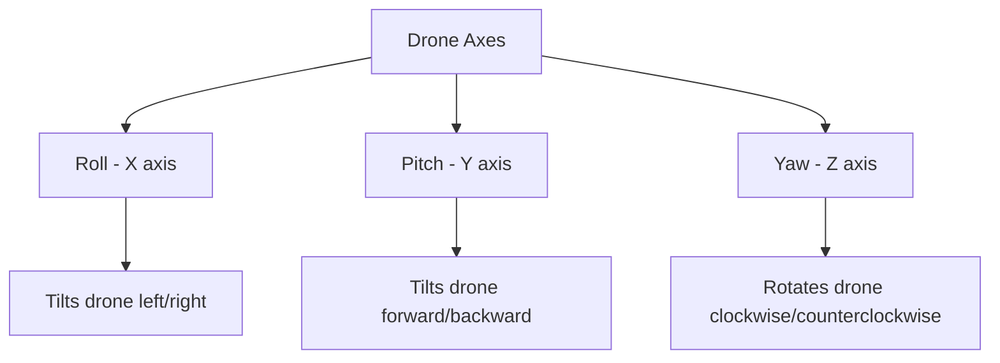
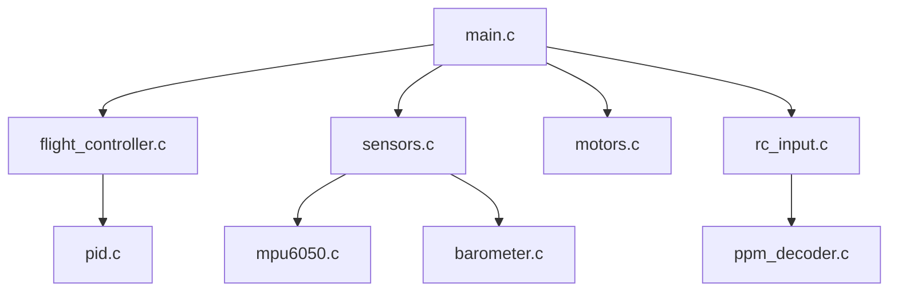

# STM32 Drone Control

## Introduction

Building your own drone flight controller using an STM32 microcontroller is an exciting project that combines embedded programming, sensor interfacing, real-time processing, and control theory. This guide will walk you through the fundamental concepts and implementation details required to create a basic drone flight controller using STM32 microcontrollers.

Drones (or quadcopters) require precise control of multiple motors to maintain stability in the air. The STM32 family of microcontrollers, with their powerful processing capabilities, timers, and peripheral interfaces, make them ideal candidates for drone control applications.

By the end of this tutorial, you'll understand:
- The basic principles of drone flight dynamics
- How to interface with sensors required for flight control
- How to implement a PID control loop for stability
- How to generate PWM signals to control motors
- How to build a complete basic drone flight controller

## Prerequisites

Before starting this project, you should be familiar with:
- Basic STM32 programming
- Using STM32CubeIDE or similar development environments
- I2C and SPI communication protocols
- Basic understanding of control systems (helpful but not required)

## Hardware Requirements

To follow along with this project, you'll need:

1. An STM32 development board (F4 or F7 series recommended for performance)
2. MPU6050 or similar IMU (Inertial Measurement Unit)
3. Brushless motors and ESCs (Electronic Speed Controllers)
4. A battery (LiPo battery, typically 3S or 4S)
5. A drone frame
6. Radio receiver (for remote control)

## Understanding Drone Flight Dynamics

Before diving into the code, let's understand how a drone flies and the control principles involved.

### Coordinate System

Drones operate with three axes of rotation:
- **Roll** (rotation around X-axis) - tilting left or right
- **Pitch** (rotation around Y-axis) - tilting forward or backward
- **Yaw** (rotation around Z-axis) - rotating clockwise or counterclockwise



### Motor Configuration

In a quadcopter (the most common drone configuration), the four motors work together to control the drone's movement:
- Increasing all motor speeds makes the drone ascend
- Decreasing all motor speeds makes the drone descend
- Differential control of motor pairs creates roll, pitch, and yaw movements

## Setting Up the Project

Let's start by creating a new STM32 project and configuring the necessary peripherals.

### Project Setup in STM32CubeIDE

1. Create a new STM32 project for your board
2. Configure the system clock (recommended 72MHz or higher)
3. Set up the necessary peripherals:
   - I2C for IMU communication
   - TIM (Timers) for PWM generation
   - UART for debugging and communication
   - Optional: SPI for barometer/external sensors

Here's a code snippet showing the initialization of these peripherals:

```c
// Initialize HAL Library
HAL_Init();

// Configure System Clock
SystemClock_Config();

// Initialize peripherals
MX_GPIO_Init();
MX_I2C1_Init();  // For IMU
MX_TIM1_Init();  // For motor PWM signals
MX_USART2_UART_Init();  // For debugging
```

## Interfacing with the IMU

The IMU is the most critical sensor for a drone flight controller. It provides acceleration and angular velocity data that we use to determine the drone's orientation.

### Initializing the MPU6050

Here's how to initialize the MPU6050 using I2C:

```c
#define MPU6050_ADDR 0xD0  // I2C address with AD0 pin low (0x68<<1)

uint8_t MPU6050_Init(void) {
    uint8_t check, data;
    
    // Check device ID
    HAL_I2C_Mem_Read(&hi2c1, MPU6050_ADDR, WHO_AM_I_REG, 1, &check, 1, 1000);
    
    if (check == 0x68) {  // 0x68 is the expected device ID
        // Wake up the MPU6050
        data = 0x00;
        HAL_I2C_Mem_Write(&hi2c1, MPU6050_ADDR, PWR_MGMT_1_REG, 1, &data, 1, 1000);
        
        // Set DATA RATE of 1KHz
        data = 0x07;
        HAL_I2C_Mem_Write(&hi2c1, MPU6050_ADDR, SMPLRT_DIV_REG, 1, &data, 1, 1000);
        
        // Configure accelerometer (+/-4g)
        data = 0x08;
        HAL_I2C_Mem_Write(&hi2c1, MPU6050_ADDR, ACCEL_CONFIG_REG, 1, &data, 1, 1000);
        
        // Configure gyroscope (500 deg/s)
        data = 0x08;
        HAL_I2C_Mem_Write(&hi2c1, MPU6050_ADDR, GYRO_CONFIG_REG, 1, &data, 1, 1000);
        
        return 0;  // Success
    }
    
    return 1;  // Error
}
```

### Reading Sensor Data

Now let's read the acceleration and gyroscope data:

```c
typedef struct {
    int16_t Accel_X_RAW;
    int16_t Accel_Y_RAW;
    int16_t Accel_Z_RAW;
    float Ax;
    float Ay;
    float Az;
    
    int16_t Gyro_X_RAW;
    int16_t Gyro_Y_RAW;
    int16_t Gyro_Z_RAW;
    float Gx;
    float Gy;
    float Gz;
    
    float roll;
    float pitch;
    float yaw;
} MPU6050_t;

void MPU6050_Read_All(MPU6050_t *DataStruct) {
    uint8_t data[14];
    
    // Read 14 bytes of data: 6 from accelerometer, 2 from temperature sensor, 6 from gyroscope
    HAL_I2C_Mem_Read(&hi2c1, MPU6050_ADDR, ACCEL_XOUT_H_REG, 1, data, 14, 1000);
    
    // Combine the bytes to form 16-bit values
    DataStruct->Accel_X_RAW = (int16_t)(data[0] << 8 | data[1]);
    DataStruct->Accel_Y_RAW = (int16_t)(data[2] << 8 | data[3]);
    DataStruct->Accel_Z_RAW = (int16_t)(data[4] << 8 | data[5]);
    
    DataStruct->Gyro_X_RAW = (int16_t)(data[8] << 8 | data[9]);
    DataStruct->Gyro_Y_RAW = (int16_t)(data[10] << 8 | data[11]);
    DataStruct->Gyro_Z_RAW = (int16_t)(data[12] << 8 | data[13]);
    
    // Convert raw values to physical units
    // For +/-4g sensitivity, divide by 8192 to get acceleration in g
    DataStruct->Ax = DataStruct->Accel_X_RAW / 8192.0f;
    DataStruct->Ay = DataStruct->Accel_Y_RAW / 8192.0f;
    DataStruct->Az = DataStruct->Accel_Z_RAW / 8192.0f;
    
    // For 500 deg/s sensitivity, divide by 65.5 to get angular velocity in deg/s
    DataStruct->Gx = DataStruct->Gyro_X_RAW / 65.5f;
    DataStruct->Gy = DataStruct->Gyro_Y_RAW / 65.5f;
    DataStruct->Gz = DataStruct->Gyro_Z_RAW / 65.5f;
}
```

## Attitude Estimation

Now that we can read raw sensor data, we need to estimate the drone's actual orientation (attitude). For this, we'll use a complementary filter, which combines accelerometer and gyroscope data.

```c
#define DT 0.01f  // 10ms sampling rate

void UpdateAttitude(MPU6050_t *DataStruct) {
    // Calculate angles from accelerometer data
    float accel_roll = atan2f(DataStruct->Ay, DataStruct->Az) * 180.0f / M_PI;
    float accel_pitch = atanf(-DataStruct->Ax / sqrtf(DataStruct->Ay * DataStruct->Ay + 
                                                      DataStruct->Az * DataStruct->Az)) * 180.0f / M_PI;
    
    // Complementary filter - combine accelerometer and gyroscope data
    DataStruct->roll = 0.98f * (DataStruct->roll + DataStruct->Gx * DT) + 0.02f * accel_roll;
    DataStruct->pitch = 0.98f * (DataStruct->pitch + DataStruct->Gy * DT) + 0.02f * accel_pitch;
    
    // For yaw, we typically use a magnetometer, but for this simple example we'll just integrate gyroscope data
    DataStruct->yaw += DataStruct->Gz * DT;
}
```

## Implementing PID Control

PID (Proportional-Integral-Derivative) control is essential for a stable drone. It calculates motor outputs based on the error between the desired and actual orientation.

```c
typedef struct {
    float Kp;           // Proportional gain
    float Ki;           // Integral gain
    float Kd;           // Derivative gain
    float error;        // Current error
    float previous_error; // Previous error
    float integral;     // Accumulated error
    float derivative;   // Rate of change of error
    float output;       // PID output
    float output_limit; // Maximum output value
} PID_t;

void PID_Init(PID_t *PID, float Kp, float Ki, float Kd, float output_limit) {
    PID->Kp = Kp;
    PID->Ki = Ki;
    PID->Kd = Kd;
    PID->error = 0;
    PID->previous_error = 0;
    PID->integral = 0;
    PID->derivative = 0;
    PID->output = 0;
    PID->output_limit = output_limit;
}

float PID_Calculate(PID_t *PID, float setpoint, float measurement, float dt) {
    // Calculate error
    PID->error = setpoint - measurement;
    
    // Calculate integral
    PID->integral += PID->error * dt;
    
    // Anti-windup - limit the integral
    if (PID->integral > PID->output_limit) PID->integral = PID->output_limit;
    else if (PID->integral < -PID->output_limit) PID->integral = -PID->output_limit;
    
    // Calculate derivative
    PID->derivative = (PID->error - PID->previous_error) / dt;
    
    // Calculate output
    PID->output = (PID->Kp * PID->error) + 
                  (PID->Ki * PID->integral) + 
                  (PID->Kd * PID->derivative);
    
    // Limit output
    if (PID->output > PID->output_limit) PID->output = PID->output_limit;
    else if (PID->output < -PID->output_limit) PID->output = -PID->output_limit;
    
    // Store current error for next iteration
    PID->previous_error = PID->error;
    
    return PID->output;
}
```

## Motor Control with PWM

To control the drone's motors, we need to generate PWM signals using the STM32's timer peripherals.

### Setting Up PWM Timers

First, configure the timers in CubeMX to generate PWM signals, then initialize them in code:

```c
// After configuring TIM1 in CubeMX for PWM generation
void StartPWM(void) {
    HAL_TIM_PWM_Start(&htim1, TIM_CHANNEL_1);  // Motor 1
    HAL_TIM_PWM_Start(&htim1, TIM_CHANNEL_2);  // Motor 2
    HAL_TIM_PWM_Start(&htim1, TIM_CHANNEL_3);  // Motor 3
    HAL_TIM_PWM_Start(&htim1, TIM_CHANNEL_4);  // Motor 4
}

// Set motor speed (0-1000)
void SetMotorSpeed(uint8_t motor, uint16_t speed) {
    if (speed > 1000) speed = 1000;  // Limit to maximum
    
    // Convert 0-1000 to PWM value (typically 1000-2000 μs)
    uint16_t pwm_value = 1000 + speed;
    
    switch (motor) {
        case 1:
            __HAL_TIM_SET_COMPARE(&htim1, TIM_CHANNEL_1, pwm_value);
            break;
        case 2:
            __HAL_TIM_SET_COMPARE(&htim1, TIM_CHANNEL_2, pwm_value);
            break;
        case 3:
            __HAL_TIM_SET_COMPARE(&htim1, TIM_CHANNEL_3, pwm_value);
            break;
        case 4:
            __HAL_TIM_SET_COMPARE(&htim1, TIM_CHANNEL_4, pwm_value);
            break;
    }
}
```

## Remote Control Input

To control the drone, we need to read commands from a radio receiver. Most RC receivers output PPM (Pulse Position Modulation) or PWM signals that can be captured using input capture timers.

```c
// Variables to store RC input values
uint16_t rc_throttle = 0;
uint16_t rc_roll = 0;
uint16_t rc_pitch = 0;
uint16_t rc_yaw = 0;

// To be called from the input capture callback
void ProcessRCInput(TIM_HandleTypeDef *htim, uint32_t channel, uint32_t value) {
    static uint32_t prev_value = 0;
    static uint8_t current_channel = 0;
    
    uint32_t pulse_width = 0;
    
    if (prev_value < value) {
        pulse_width = value - prev_value;
    } else {
        pulse_width = (0xFFFF - prev_value) + value;
    }
    
    prev_value = value;
    
    // Typical RC values are 1000-2000 μs, normalize to 0-1000
    pulse_width = (pulse_width > 2000) ? 1000 : ((pulse_width < 1000) ? 0 : (pulse_width - 1000));
    
    // Assign value to appropriate channel based on timing
    if (pulse_width > 3000) {  // Frame gap detected
        current_channel = 0;
    } else {
        switch (current_channel) {
            case 0:
                rc_throttle = pulse_width;
                break;
            case 1:
                rc_roll = pulse_width;
                break;
            case 2:
                rc_pitch = pulse_width;
                break;
            case 3:
                rc_yaw = pulse_width;
                break;
        }
        current_channel++;
    }
}
```

## Putting It All Together

Now let's combine all these components into a complete drone flight controller system.

```c
// Define PID controllers for each axis
PID_t pid_roll, pid_pitch, pid_yaw;

// Define IMU data structure
MPU6050_t mpu;

void FlightControllerInit(void) {
    // Initialize MPU6050
    MPU6050_Init();
    
    // Initialize PID controllers with appropriate gains
    // Note: These values will need tuning for your specific drone
    PID_Init(&pid_roll, 1.5f, 0.05f, 0.5f, 400.0f);
    PID_Init(&pid_pitch, 1.5f, 0.05f, 0.5f, 400.0f);
    PID_Init(&pid_yaw, 2.0f, 0.1f, 0.0f, 200.0f);
    
    // Start PWM output to motors
    StartPWM();
    
    // Start timer for RC input capture
    HAL_TIM_IC_Start_IT(&htim2, TIM_CHANNEL_1);
}

void FlightControlLoop(void) {
    // Read sensor data
    MPU6050_Read_All(&mpu);
    
    // Update attitude estimation
    UpdateAttitude(&mpu);
    
    // Calculate desired roll, pitch, and yaw based on RC input
    float desired_roll = (rc_roll - 500) * 0.08f;    // Convert 0-1000 to approx -40 to +40 degrees
    float desired_pitch = (rc_pitch - 500) * 0.08f;
    float desired_yaw_rate = (rc_yaw - 500) * 0.4f;  // Convert to desired rotation rate
    
    // Calculate PID outputs
    float roll_output = PID_Calculate(&pid_roll, desired_roll, mpu.roll, DT);
    float pitch_output = PID_Calculate(&pid_pitch, desired_pitch, mpu.pitch, DT);
    float yaw_output = PID_Calculate(&pid_yaw, desired_yaw_rate, mpu.Gz, DT);
    
    // Calculate motor outputs
    // Note: This is for a quadcopter in X configuration
    uint16_t base_throttle = rc_throttle;
    
    uint16_t motor1_output = base_throttle - roll_output + pitch_output + yaw_output;
    uint16_t motor2_output = base_throttle + roll_output + pitch_output - yaw_output;
    uint16_t motor3_output = base_throttle + roll_output - pitch_output + yaw_output;
    uint16_t motor4_output = base_throttle - roll_output - pitch_output - yaw_output;
    
    // Set motor speeds
    SetMotorSpeed(1, motor1_output);
    SetMotorSpeed(2, motor2_output);
    SetMotorSpeed(3, motor3_output);
    SetMotorSpeed(4, motor4_output);
}
```

## Main Program Loop

Finally, here's the main program loop that ties everything together:

```c
int main(void) {
    // Initialize HAL, system clock, and peripherals
    HAL_Init();
    SystemClock_Config();
    MX_GPIO_Init();
    MX_I2C1_Init();
    MX_TIM1_Init();
    MX_TIM2_Init();
    MX_USART2_UART_Init();
    
    // Initialize the flight controller
    FlightControllerInit();
    
    // Arm the motors (typically with a low throttle for a short time)
    for (int i = 1; i <= 4; i++) {
        SetMotorSpeed(i, 0);
    }
    HAL_Delay(3000);  // Wait for ESCs to initialize
    
    // Main loop
    uint32_t previous_time = HAL_GetTick();
    
    while (1) {
        uint32_t current_time = HAL_GetTick();
        
        // Run flight control loop at fixed intervals (10ms = 100Hz)
        if (current_time - previous_time >= 10) {
            FlightControlLoop();
            previous_time = current_time;
        }
    }
}
```

## Safety Considerations

When building a drone, safety is critical. Here are some important safety features to implement:

1. **Failsafe mechanism**: If RC signal is lost, the drone should automatically land or return to home
2. **Low battery detection**: Monitor battery voltage and land when it's too low
3. **Motor arming procedure**: Require a specific sequence to arm motors to prevent accidental startup
4. **Limit maximum angles**: Prevent the drone from flipping over by limiting maximum roll and pitch angles

Here's a simple implementation of a failsafe:

```c
void CheckFailsafe(void) {
    static uint32_t last_rc_time = 0;
    uint32_t current_time = HAL_GetTick();
    
    // If no RC input for more than 500ms, activate failsafe
    if (current_time - last_rc_time > 500) {
        // Gradually reduce throttle to land
        rc_throttle = rc_throttle > 50 ? rc_throttle - 5 : 0;
        rc_roll = 500;     // Center roll
        rc_pitch = 500;    // Center pitch
        rc_yaw = 500;      // Center yaw
    }
    
    // Update last_rc_time when new RC data is received
    // This should be called from the RC input handler
}

// Call this from RC input handler
void UpdateRCTime(void) {
    last_rc_time = HAL_GetTick();
}
```

## Testing and Tuning

PID tuning is an important part of drone development. Here's a basic approach:

1. Start with only P gain (set I and D to zero)
2. Gradually increase P until the drone responds quickly but starts to oscillate
3. Add D gain to dampen oscillations
4. Finally, add a small I gain to eliminate steady-state errors

Always test with the propellers removed initially, then test outside in an open area with enough space.

## Advanced Features

Once you have a basic flight controller working, you can add advanced features:

1. **Altitude hold** using a barometer
2. **Position hold** using GPS
3. **Return-to-home functionality**
4. **Waypoint navigation**
5. **Auto-takeoff and landing**
6. **Obstacle avoidance** using distance sensors

## Real-World Project Structure

For a more maintainable codebase, structure your project into modules:



## Debugging and Telemetry

For debugging, it's helpful to stream telemetry data over UART:

```c
void SendTelemetry(void) {
    char buffer[100];
    int len = sprintf(buffer, "R:%.2f P:%.2f Y:%.2f T:%d M1:%d M2:%d M3:%d M4:%d\r
",
                     mpu.roll, mpu.pitch, mpu.yaw, rc_throttle,
                     motor1_output, motor2_output, motor3_output, motor4_output);
    
    HAL_UART_Transmit(&huart2, (uint8_t*)buffer, len, 100);
}
```

## Summary

In this tutorial, we've covered the essential components of building a drone flight controller using an STM32 microcontroller:

1. Reading sensor data from an IMU
2. Estimating the drone's attitude
3. Implementing PID control for stability
4. Generating PWM signals to control motors
5. Reading RC inputs for manual control
6. Putting it all together into a functional flight controller

Building a drone is a challenging but rewarding project that combines multiple disciplines of engineering. The code provided here is a starting point - real-world flight controllers are more complex and include additional features and safety mechanisms.

## Additional Resources

To continue your drone development journey, check out these resources:

1. **MultiWii** and **Betaflight** - Open-source flight controller firmware to study
2. **STM32 Reference Manuals** - For detailed information on peripherals
3. **Control Theory Textbooks** - To understand PID tuning and advanced control techniques
4. **DIY Drone Communities** - For project ideas and troubleshooting

## Exercises

1. Modify the code to support a hexacopter (6 motors) configuration
2. Implement altitude hold using a barometer
3. Add a basic telemetry system to monitor drone status via UART
4. Create a simple ground control station using Python and serial communication
5. Implement a battery voltage monitoring system

Remember, drone development requires careful testing and patience. Always prioritize safety and test new features incrementally!