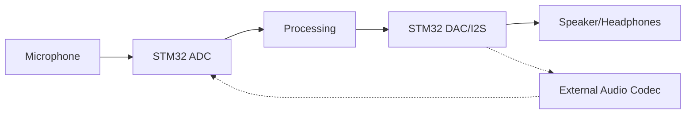

# STM32 Audio Processing

Audio processing with STM32 microcontrollers opens up a world of possibilities for creating interactive sound applications, digital musical instruments, and audio effect processors. In this tutorial, we'll explore how to capture, process, and output audio signals using the STM32 platform.

## Introduction

STM32 microcontrollers, with their powerful ARM Cortex-M cores, provide an excellent platform for digital audio processing. They offer sufficient computational power, flexible peripherals, and optimized DSP instructions that make them suitable for a wide range of audio applications.

This tutorial will guide you through:
- Setting up the audio input/output on STM32
- Sampling and processing audio signals
- Implementing common audio effects
- Building a complete audio processing application

## Prerequisites

Before diving into audio processing, you should have:
- Basic understanding of STM32 microcontrollers
- Familiarity with the STM32CubeIDE or similar development environment
- Elementary knowledge of digital signal processing concepts
- An STM32 development board (preferably with audio capabilities like the STM32F4-Discovery)

## Hardware Setup

For audio processing, you'll typically need:

1. **STM32 Development Board**: The STM32F4-Discovery board is ideal as it includes a CS43L22 audio DAC with integrated class D speaker driver
2. **External Components**:
   - Microphone (for audio input)
   - Speakers or headphones (for audio output)
   - Optional: Audio codec board for higher quality audio



## Basic Audio Concepts

Before implementation, let's understand some fundamental concepts:

### Sampling

Audio sampling involves converting continuous analog signals into discrete digital values. The sampling rate (measured in Hz) determines how many samples are taken per second.

For high-quality audio, we typically use:
- 44.1 kHz (CD quality)
- 48 kHz (standard for digital audio workstations)

The STM32 can handle these rates through its ADC (Analog-to-Digital Converter) or external audio codecs via I2S (Inter-IC Sound).

### Audio Resolution

Resolution refers to the number of bits used to represent each audio sample:
- 16-bit: Common for most applications (65,536 possible values)
- 24-bit: Higher quality audio (16,777,216 possible values)

The STM32F4's ADC provides 12-bit resolution, while external codecs can offer higher bit depths.

## Setting Up Audio I/O on STM32

Let's start by configuring our STM32 board for audio input and output.

### Using the Built-in Audio Capabilities

For STM32F4-Discovery boards with the CS43L22 codec:

```c
/* Initialize the audio driver structure */
__IO uint32_t TimeOut = TIMEOUT_MAX;
I2S_HandleTypeDef hi2s3;
I2C_HandleTypeDef hi2c1;

void Audio_Init(uint32_t sampleRate)
{
    /* Configure I2C for audio codec */
    __HAL_RCC_I2C1_CLK_ENABLE();
    hi2c1.Instance = I2C1;
    hi2c1.Init.ClockSpeed = 100000;
    hi2c1.Init.DutyCycle = I2C_DUTYCYCLE_2;
    hi2c1.Init.OwnAddress1 = 0x33;
    hi2c1.Init.AddressingMode = I2C_ADDRESSINGMODE_7BIT;
    HAL_I2C_Init(&hi2c1);
    
    /* Configure I2S for audio output */
    __HAL_RCC_SPI3_CLK_ENABLE();
    hi2s3.Instance = SPI3;
    hi2s3.Init.Mode = I2S_MODE_MASTER_TX;
    hi2s3.Init.Standard = I2S_STANDARD_PHILIPS;
    hi2s3.Init.DataFormat = I2S_DATAFORMAT_16B;
    hi2s3.Init.MCLKOutput = I2S_MCLKOUTPUT_ENABLE;
    hi2s3.Init.AudioFreq = sampleRate;
    hi2s3.Init.CPOL = I2S_CPOL_LOW;
    HAL_I2S_Init(&hi2s3);
    
    /* Initialize codec with I2C commands */
    CODEC_Init(sampleRate);
}
```

### Configuring the ADC for Audio Input

If using the STM32's internal ADC for audio input:

```c
ADC_HandleTypeDef hadc1;
DMA_HandleTypeDef hdma_adc1;

void Audio_ADC_Init(void)
{
    ADC_ChannelConfTypeDef sConfig = {0};
    
    /* ADC1 configuration */
    hadc1.Instance = ADC1;
    hadc1.Init.ClockPrescaler = ADC_CLOCK_SYNC_PCLK_DIV4;
    hadc1.Init.Resolution = ADC_RESOLUTION_12B;
    hadc1.Init.ScanConvMode = DISABLE;
    hadc1.Init.ContinuousConvMode = ENABLE;
    hadc1.Init.DiscontinuousConvMode = DISABLE;
    hadc1.Init.ExternalTrigConvEdge = ADC_EXTERNALTRIGCONVEDGE_NONE;
    hadc1.Init.ExternalTrigConv = ADC_SOFTWARE_START;
    hadc1.Init.DataAlign = ADC_DATAALIGN_RIGHT;
    hadc1.Init.NbrOfConversion = 1;
    hadc1.Init.DMAContinuousRequests = ENABLE;
    HAL_ADC_Init(&hadc1);
    
    /* ADC1 channel configuration */
    sConfig.Channel = ADC_CHANNEL_1; // Connect microphone to this pin
    sConfig.Rank = 1;
    sConfig.SamplingTime = ADC_SAMPLETIME_28CYCLES;
    HAL_ADC_ConfigChannel(&hadc1, &sConfig);
    
    /* DMA configuration for ADC */
    __HAL_RCC_DMA2_CLK_ENABLE();
    hdma_adc1.Instance = DMA2_Stream0;
    hdma_adc1.Init.Channel = DMA_CHANNEL_0;
    hdma_adc1.Init.Direction = DMA_PERIPH_TO_MEMORY;
    hdma_adc1.Init.PeriphInc = DMA_PERIPH_INC_DISABLE;
    hdma_adc1.Init.MemInc = DMA_MEMORY_INC_ENABLE;
    hdma_adc1.Init.PeriphDataAlignment = DMA_PDATAALIGN_HALFWORD;
    hdma_adc1.Init.MemDataAlignment = DMA_MDATAALIGN_HALFWORD;
    hdma_adc1.Init.Mode = DMA_CIRCULAR;
    hdma_adc1.Init.Priority = DMA_PRIORITY_HIGH;
    HAL_DMA_Init(&hdma_adc1);
    
    __HAL_LINKDMA(&hadc1, DMA_Handle, hdma_adc1);
}
```

## Audio Buffers and Real-time Processing

For real-time audio processing, we need to implement a double-buffering system to ensure continuous audio flow:

```c
#define AUDIO_BUFFER_SIZE  1024

int16_t audioInBuffer[AUDIO_BUFFER_SIZE];
int16_t audioOutBuffer[AUDIO_BUFFER_SIZE];
int16_t processingBuffer[AUDIO_BUFFER_SIZE];

volatile uint8_t bufferState = 0; // 0: first half, 1: second half

void HAL_ADC_ConvHalfCpltCallback(ADC_HandleTypeDef* hadc)
{
    if(hadc->Instance == ADC1)
    {
        // First half of buffer filled
        bufferState = 0;
        
        // Copy data to processing buffer
        for(int i = 0; i < AUDIO_BUFFER_SIZE/2; i++)
        {
            processingBuffer[i] = audioInBuffer[i];
        }
        
        // Process the audio
        ProcessAudio(processingBuffer, audioOutBuffer, AUDIO_BUFFER_SIZE/2);
    }
}

void HAL_ADC_ConvCpltCallback(ADC_HandleTypeDef* hadc)
{
    if(hadc->Instance == ADC1)
    {
        // Second half of buffer filled
        bufferState = 1;
        
        // Copy data to processing buffer
        for(int i = 0; i < AUDIO_BUFFER_SIZE/2; i++)
        {
            processingBuffer[i] = audioInBuffer[i + AUDIO_BUFFER_SIZE/2];
        }
        
        // Process the audio
        ProcessAudio(processingBuffer, audioOutBuffer + AUDIO_BUFFER_SIZE/2, AUDIO_BUFFER_SIZE/2);
    }
}
```

## Basic Audio Processing Techniques

Now, let's implement some fundamental audio processing techniques:

### 1. Volume Control

The simplest audio effect is volume adjustment:

```c
void AdjustVolume(int16_t* buffer, uint16_t size, float gain)
{
    for(uint16_t i = 0; i < size; i++)
    {
        // Apply gain and clip if necessary
        float sample = buffer[i] * gain;
        
        // Clip to prevent overflow
        if(sample > 32767) sample = 32767;
        if(sample < -32768) sample = -32768;
        
        buffer[i] = (int16_t)sample;
    }
}
```

### 2. Low-Pass Filter

A simple first-order low-pass filter to remove high frequencies:

```c
// Keep filter state between calls
static float previousOutput = 0;

void LowPassFilter(int16_t* inputBuffer, int16_t* outputBuffer, uint16_t size, float alpha)
{
    // alpha = dt / (RC + dt), where dt = 1/sampleRate, RC = time constant
    // Lower alpha = more filtering
    
    for(uint16_t i = 0; i < size; i++)
    {
        // y[n] = alpha * x[n] + (1 - alpha) * y[n-1]
        float output = alpha * inputBuffer[i] + (1 - alpha) * previousOutput;
        previousOutput = output;
        
        // Store the filtered output
        outputBuffer[i] = (int16_t)output;
    }
}
```

### 3. Echo Effect

A simple echo effect using a delay buffer:

```c
#define ECHO_BUFFER_SIZE 16000 // For about 330ms delay at 48kHz

int16_t echoBuffer[ECHO_BUFFER_SIZE] = {0};
uint16_t echoIndex = 0;

void AddEchoEffect(int16_t* buffer, uint16_t size, float decay)
{
    for(uint16_t i = 0; i < size; i++)
    {
        // Read the delayed sample
        int16_t delaySample = echoBuffer[echoIndex];
        
        // Mix the current sample with the delayed sample
        int16_t outputSample = buffer[i] + (int16_t)(delaySample * decay);
        
        // Store the current sample in the delay buffer
        echoBuffer[echoIndex] = buffer[i];
        
        // Update the buffer index
        echoIndex = (echoIndex + 1) % ECHO_BUFFER_SIZE;
        
        // Store the output
        buffer[i] = outputSample;
    }
}
```

## FFT-Based Audio Processing

For more advanced audio processing, we can use the Fast Fourier Transform (FFT) to convert time-domain signals to frequency-domain:

```c
#include "arm_math.h" // ARM CMSIS DSP library

#define FFT_SIZE 1024
float32_t fftInput[FFT_SIZE*2];  // Real and imaginary parts
float32_t fftOutput[FFT_SIZE];   // Magnitude results

arm_rfft_fast_instance_f32 fftInstance;

void InitFFT(void)
{
    // Initialize the RFFT instance
    arm_rfft_fast_init_f32(&fftInstance, FFT_SIZE);
}

void PerformFFT(int16_t* audioBuffer)
{
    // Convert int16 to float32 and prepare for FFT
    for(int i = 0; i < FFT_SIZE; i++)
    {
        // Apply a window function to reduce spectral leakage
        float32_t window = 0.5f * (1.0f - arm_cos_f32(2.0f * PI * i / (FFT_SIZE - 1)));
        fftInput[i*2] = (float32_t)audioBuffer[i] * window;
        fftInput[i*2+1] = 0.0f; // Imaginary part is zero
    }
    
    // Perform FFT
    arm_rfft_fast_f32(&fftInstance, fftInput, fftInput, 0);
    
    // Calculate magnitude
    arm_cmplx_mag_f32(fftInput, fftOutput, FFT_SIZE/2);
    
    // Now fftOutput contains the frequency spectrum
}
```

## Implementing a Complete Audio Processor

Now, let's combine all these techniques into a complete audio processing system:

```c
typedef enum {
    EFFECT_NONE,
    EFFECT_VOLUME,
    EFFECT_LOWPASS,
    EFFECT_ECHO,
    EFFECT_SPECTRAL
} EffectType;

typedef struct {
    EffectType type;
    float param1;
    float param2;
} AudioEffect;

// Global effect settings
AudioEffect currentEffect = {EFFECT_NONE, 1.0f, 0.0f};

void ProcessAudio(int16_t* inputBuffer, int16_t* outputBuffer, uint16_t size)
{
    // Copy input to output first
    for(uint16_t i = 0; i < size; i++)
    {
        outputBuffer[i] = inputBuffer[i];
    }
    
    // Apply selected effect
    switch(currentEffect.type)
    {
        case EFFECT_VOLUME:
            AdjustVolume(outputBuffer, size, currentEffect.param1);
            break;
            
        case EFFECT_LOWPASS:
            LowPassFilter(inputBuffer, outputBuffer, size, currentEffect.param1);
            break;
            
        case EFFECT_ECHO:
            AddEchoEffect(outputBuffer, size, currentEffect.param1);
            break;
            
        case EFFECT_SPECTRAL:
            // Apply spectral processing if buffer size matches FFT size
            if(size == FFT_SIZE)
            {
                PerformSpectralProcessing(inputBuffer, outputBuffer);
            }
            break;
            
        case EFFECT_NONE:
        default:
            // Do nothing, passthrough
            break;
    }
}

void PerformSpectralProcessing(int16_t* inputBuffer, int16_t* outputBuffer)
{
    // Perform FFT
    PerformFFT(inputBuffer);
    
    // Modify the spectrum as needed
    // For example, we could implement a spectral noise gate:
    for(int i = 0; i < FFT_SIZE/2; i++)
    {
        if(fftOutput[i] < currentEffect.param1)
        {
            // Zero out bins below threshold
            fftInput[i*2] = 0;
            fftInput[i*2+1] = 0;
        }
    }
    
    // Perform inverse FFT
    arm_rfft_fast_f32(&fftInstance, fftInput, fftInput, 1);
    
    // Convert back to int16
    for(int i = 0; i < FFT_SIZE; i++)
    {
        float32_t sample = fftInput[i*2] / FFT_SIZE; // Scaling factor
        
        // Clip to prevent overflow
        if(sample > 32767.0f) sample = 32767.0f;
        if(sample < -32768.0f) sample = -32768.0f;
        
        outputBuffer[i] = (int16_t)sample;
    }
}
```

## Main Application

Here's how we tie everything together in the main application:

```c
int main(void)
{
    /* MCU Configuration */
    HAL_Init();
    SystemClock_Config();
    
    /* Initialize peripherals */
    Audio_Init(48000); // 48kHz sample rate
    Audio_ADC_Init();
    InitFFT();
    
    /* Start audio I/O */
    HAL_ADC_Start_DMA(&hadc1, (uint32_t*)audioInBuffer, AUDIO_BUFFER_SIZE);
    HAL_I2S_Transmit_DMA(&hi2s3, (uint16_t*)audioOutBuffer, AUDIO_BUFFER_SIZE);
    
    /* Set initial effect */
    currentEffect.type = EFFECT_ECHO;
    currentEffect.param1 = 0.5f; // 50% echo level
    
    /* Main loop */
    while(1)
    {
        // Check for user input (e.g., from buttons)
        if(HAL_GPIO_ReadPin(GPIOA, GPIO_PIN_0) == GPIO_PIN_SET)
        {
            // Change effect
            currentEffect.type = (currentEffect.type + 1) % 5;
            HAL_Delay(300); // Debounce
        }
        
        // Other application logic
    }
}
```

## Real-World Application: Guitar Effects Processor

Let's build a practical example: a guitar effects processor using the STM32. This would allow a guitar to be plugged into the STM32 (with appropriate pre-amplification), processed, and then output to an amplifier or headphones.

```c
/* Guitar Effects Processor */

// Effect parameters
typedef struct {
    float distortionGain;
    float reverbLevel;
    float delayTime;
    float delayFeedback;
    float eqLow;
    float eqMid;
    float eqHigh;
} GuitarEffectParams;

GuitarEffectParams effectParams = {
    .distortionGain = 1.0f,
    .reverbLevel = 0.3f,
    .delayTime = 0.3f,     // 300ms
    .delayFeedback = 0.4f, // 40%
    .eqLow = 1.0f,
    .eqMid = 1.0f,
    .eqHigh = 1.0f
};

// Distortion effect
void ApplyDistortion(int16_t* buffer, uint16_t size, float gain)
{
    for(uint16_t i = 0; i < size; i++)
    {
        // Apply gain
        float sample = buffer[i] * gain;
        
        // Apply soft clipping
        sample = sample / (1.0f + fabsf(sample));
        
        // Scale back to int16
        sample *= 32767.0f;
        
        // Store result
        buffer[i] = (int16_t)sample;
    }
}

// Simple 3-band EQ using biquad filters
void Apply3BandEQ(int16_t* buffer, uint16_t size, float lowGain, float midGain, float highGain)
{
    // Implement 3 biquad filters here:
    // 1. Low shelf filter (boost/cut below ~200Hz)
    // 2. Peak filter (boost/cut around ~1kHz)
    // 3. High shelf filter (boost/cut above ~4kHz)
    
    // This would require implementing biquad filters which is beyond
    // the scope of this example
}

// Process guitar audio
void ProcessGuitarAudio(int16_t* inputBuffer, int16_t* outputBuffer, uint16_t size)
{
    // Copy input to output first
    for(uint16_t i = 0; i < size; i++)
    {
        outputBuffer[i] = inputBuffer[i];
    }
    
    // Apply effects chain
    ApplyDistortion(outputBuffer, size, effectParams.distortionGain);
    Apply3BandEQ(outputBuffer, size, effectParams.eqLow, effectParams.eqMid, effectParams.eqHigh);
    AddEchoEffect(outputBuffer, size, effectParams.delayFeedback);
    // Additional effects would be applied here
}
```

## Performance Considerations

When implementing audio processing on STM32 microcontrollers, keep these performance tips in mind:

1. **Optimize Critical Code**: Use the ARM CMSIS DSP library for optimized DSP functions
2. **Buffer Sizes**: Choose appropriate buffer sizes - smaller buffers reduce latency but require more frequent processing
3. **Clock Speed**: Run the MCU at the highest stable clock frequency for demanding applications
4. **Memory Usage**: Be mindful of RAM usage, especially with delay effects and FFT
5. **Precision**: Use fixed-point arithmetic where possible for better performance
6. **DMA**: Always use DMA for audio data transfers to free up the CPU
7. **Interrupt Priority**: Set audio processing interrupts to high priority

## Debugging Audio Applications

Debugging audio applications can be challenging. Here are some tips:

1. **LED Indicators**: Use LEDs to indicate processing states or errors
2. **Serial Output**: Output debug information via UART (but beware this might affect real-time performance)
3. **Spectrum Analysis**: Output FFT data to a PC for visualization
4. **Offline Testing**: Test algorithms offline in MATLAB or Python before implementing on STM32

## Summary

In this tutorial, we've covered:
- Setting up audio I/O on STM32 microcontrollers
- Implementing basic audio effects like volume control, filtering, and echo
- Using the FFT for frequency-domain processing
- Building a complete audio processing system
- Creating a practical guitar effects processor

Audio processing with STM32 offers a powerful platform for building embedded audio applications. From simple effects processors to complex audio analyzers, the STM32's combination of processing power and peripheral flexibility makes it an excellent choice for audio projects.

## Additional Resources

To continue your learning journey:

1. **ST Documentation**:
   - STM32F4 Discovery User Manual
   - Application Note AN4231: Digital Signal Processing for STM32 Microcontrollers

2. **Books**:
   - "Digital Signal Processing: Principles, Algorithms and Applications" by Proakis and Manolakis
   - "The Scientist and Engineer's Guide to Digital Signal Processing" by Steven W. Smith

3. **Exercises**:
   - Implement a parametric equalizer
   - Create a vocal effects processor
   - Build a spectrum analyzer with LED display
   - Develop a pitch shifter using granular synthesis techniques

By starting with the basics and gradually implementing more complex effects, you'll develop a solid understanding of audio processing on the STM32 platform.