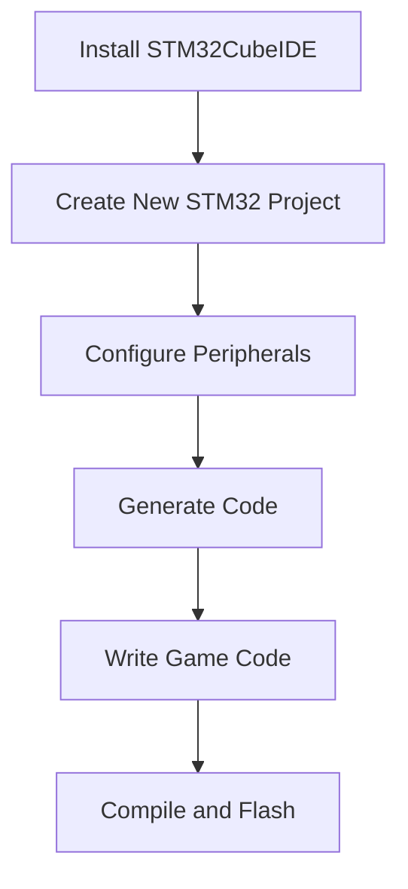

# STM32 Game Development

## Introduction

Developing games on STM32 microcontrollers combines embedded programming with creative game design principles. While STM32 devices have limited resources compared to dedicated gaming platforms, they provide an excellent environment for creating simple, retro-style games while learning important embedded programming concepts.

In this tutorial, we'll explore how to develop games on STM32 microcontrollers, covering everything from hardware setup to implementing game mechanics. By the end, you'll have the knowledge to create your own simple arcade-style games on these powerful microcontrollers.

## Prerequisites

Before diving into STM32 game development, you should be familiar with:

- Basic C programming
- STM32 microcontroller fundamentals
- Basic electronics principles
- STM32CubeIDE or similar development environment

## Hardware Requirements

To follow along with this tutorial, you'll need:

1. An STM32 development board (STM32F4-Discovery or Nucleo-F401RE recommended)
2. A small LCD display (ST7735, ILI9341, or SSD1306 OLED)
3. Joystick or buttons for user input
4. Breadboard and jumper wires
5. Optional: Buzzer or speaker for sound effects

## Setting Up Your Development Environment

We'll use STM32CubeIDE for this project, which provides an integrated development environment with configuration tools and code generation capabilities.



Let's start by configuring our hardware interfaces:

```c
/* Display Configuration using SPI */
void ConfigureDisplay(void) {
  /* Initialize the SPI bus for the display */
  hspi1.Instance = SPI1;
  hspi1.Init.Mode = SPI_MODE_MASTER;
  hspi1.Init.Direction = SPI_DIRECTION_2LINES;
  hspi1.Init.DataSize = SPI_DATASIZE_8BIT;
  hspi1.Init.CLKPolarity = SPI_POLARITY_LOW;
  hspi1.Init.CLKPhase = SPI_PHASE_1EDGE;
  hspi1.Init.NSS = SPI_NSS_SOFT;
  hspi1.Init.BaudRatePrescaler = SPI_BAUDRATEPRESCALER_4;
  hspi1.Init.FirstBit = SPI_FIRSTBIT_MSB;
  hspi1.Init.TIMode = SPI_TIMODE_DISABLE;
  hspi1.Init.CRCCalculation = SPI_CRCCALCULATION_DISABLE;
  HAL_SPI_Init(&hspi1);
  
  /* Initialize the display */
  ST7735_Init();
}

/* Input Configuration for buttons/joystick */
void ConfigureInput(void) {
  GPIO_InitTypeDef GPIO_InitStruct = {0};
  
  /* Enable GPIO clock */
  __HAL_RCC_GPIOA_CLK_ENABLE();
  
  /* Configure GPIO pins for buttons */
  GPIO_InitStruct.Pin = GPIO_PIN_0 | GPIO_PIN_1 | GPIO_PIN_2 | GPIO_PIN_3;
  GPIO_InitStruct.Mode = GPIO_MODE_INPUT;
  GPIO_InitStruct.Pull = GPIO_PULLUP;
  HAL_GPIO_Init(GPIOA, &GPIO_InitStruct);
}
```

## Understanding Game Development Concepts

Before we start coding, let's understand some key concepts in game development that apply to our STM32 platform:

### 1. Game Loop

The game loop is the central component of any game. It continuously updates the game state and renders the display:

```c
void GameLoop(void) {
  while (1) {
    ProcessInput();    // Read user inputs
    UpdateGame();      // Update game state
    RenderDisplay();   // Draw the current frame
    HAL_Delay(20);     // ~50 FPS
  }
}
```

### 2. Double Buffering

To avoid screen flickering, we use double buffering by drawing to an offscreen buffer before displaying it:

```c
uint16_t frameBuffer[LCD_WIDTH * LCD_HEIGHT];

void RenderDisplay(void) {
  // Clear buffer
  memset(frameBuffer, 0, sizeof(frameBuffer));
  
  // Draw game elements to buffer
  DrawPlayer(frameBuffer);
  DrawObstacles(frameBuffer);
  DrawScore(frameBuffer);
  
  // Send buffer to display
  ST7735_DrawImage(0, 0, LCD_WIDTH, LCD_HEIGHT, frameBuffer);
}
```

### 3. Sprites and Collision Detection

Sprites are the graphical elements in your game. We'll define simple sprite structures and implement collision detection:

```c
typedef struct {
  int16_t x, y;          // Position
  int16_t width, height; // Dimensions
  uint16_t *bitmap;      // Sprite image data
  int16_t velocityX, velocityY; // Movement speed
} Sprite;

// Check if two sprites are colliding
bool CheckCollision(Sprite *sprite1, Sprite *sprite2) {
  return (sprite1->x < sprite2->x + sprite2->width &&
          sprite1->x + sprite1->width > sprite2->x &&
          sprite1->y < sprite2->y + sprite2->height &&
          sprite1->y + sprite1->height > sprite2->y);
}
```

## Creating a Simple Pong Game

Let's implement a simple Pong game to demonstrate these concepts. We'll need:
- Two paddles (player and AI or second player)
- A ball that bounces
- Score tracking

First, let's define our game elements:

```c
#define SCREEN_WIDTH  160
#define SCREEN_HEIGHT 128
#define PADDLE_WIDTH  5
#define PADDLE_HEIGHT 30
#define BALL_SIZE     6

// Game objects
Sprite player1Paddle = {0, SCREEN_HEIGHT/2 - PADDLE_HEIGHT/2, PADDLE_WIDTH, PADDLE_HEIGHT, NULL, 0, 0};
Sprite player2Paddle = {SCREEN_WIDTH - PADDLE_WIDTH, SCREEN_HEIGHT/2 - PADDLE_HEIGHT/2, PADDLE_WIDTH, PADDLE_HEIGHT, NULL, 0, 0};
Sprite ball = {SCREEN_WIDTH/2 - BALL_SIZE/2, SCREEN_HEIGHT/2 - BALL_SIZE/2, BALL_SIZE, BALL_SIZE, NULL, 1, 1};

// Game state
int player1Score = 0;
int player2Score = 0;
bool gameRunning = false;
```

Now, let's implement the game loop functions:

```c
void ProcessInput(void) {
  // Read joystick or buttons for Player 1 paddle movement
  if (HAL_GPIO_ReadPin(GPIOA, GPIO_PIN_0) == GPIO_PIN_RESET) {
    player1Paddle.y -= 3; // Move up
  }
  if (HAL_GPIO_ReadPin(GPIOA, GPIO_PIN_1) == GPIO_PIN_RESET) {
    player1Paddle.y += 3; // Move down
  }
  
  // Keep paddle within screen bounds
  if (player1Paddle.y < 0) player1Paddle.y = 0;
  if (player1Paddle.y > SCREEN_HEIGHT - PADDLE_HEIGHT) {
    player1Paddle.y = SCREEN_HEIGHT - PADDLE_HEIGHT;
  }
  
  // Simple AI for Player 2 (or read second set of buttons)
  player2Paddle.y = ball.y - PADDLE_HEIGHT/2 + BALL_SIZE/2;
  if (player2Paddle.y < 0) player2Paddle.y = 0;
  if (player2Paddle.y > SCREEN_HEIGHT - PADDLE_HEIGHT) {
    player2Paddle.y = SCREEN_HEIGHT - PADDLE_HEIGHT;
  }
}

void UpdateGame(void) {
  if (!gameRunning) return;
  
  // Update ball position
  ball.x += ball.velocityX * 2;
  ball.y += ball.velocityY * 2;
  
  // Ball collision with top and bottom walls
  if (ball.y <= 0 || ball.y >= SCREEN_HEIGHT - BALL_SIZE) {
    ball.velocityY = -ball.velocityY;
    PlaySound(SOUND_BOUNCE);
  }
  
  // Ball collision with paddles
  if (CheckCollision(&ball, &player1Paddle) || 
      CheckCollision(&ball, &player2Paddle)) {
    ball.velocityX = -ball.velocityX;
    PlaySound(SOUND_HIT);
  }
  
  // Ball out of bounds - scoring
  if (ball.x <= 0) {
    player2Score++;
    ResetBall();
    PlaySound(SOUND_SCORE);
  } else if (ball.x >= SCREEN_WIDTH - BALL_SIZE) {
    player1Score++;
    ResetBall();
    PlaySound(SOUND_SCORE);
  }
}

void RenderDisplay(void) {
  // Clear buffer with black background
  ST7735_FillScreen(ST7735_BLACK);
  
  // Draw paddles (white)
  ST7735_FillRectangle(player1Paddle.x, player1Paddle.y, 
                      player1Paddle.width, player1Paddle.height, ST7735_WHITE);
  ST7735_FillRectangle(player2Paddle.x, player2Paddle.y, 
                      player2Paddle.width, player2Paddle.height, ST7735_WHITE);
  
  // Draw ball (white)
  ST7735_FillRectangle(ball.x, ball.y, ball.width, ball.height, ST7735_WHITE);
  
  // Draw center line
  for (int i = 0; i < SCREEN_HEIGHT; i += 10) {
    ST7735_FillRectangle(SCREEN_WIDTH/2 - 1, i, 2, 5, ST7735_WHITE);
  }
  
  // Draw scores
  char scoreText[20];
  sprintf(scoreText, "%d  %d", player1Score, player2Score);
  ST7735_WriteString(SCREEN_WIDTH/2 - 20, 5, scoreText, Font_7x10, ST7735_WHITE, ST7735_BLACK);
}

void ResetBall(void) {
  // Center the ball and give it a random direction
  ball.x = SCREEN_WIDTH/2 - BALL_SIZE/2;
  ball.y = SCREEN_HEIGHT/2 - BALL_SIZE/2;
  
  // Random direction based on system time or other entropy source
  uint32_t randomVal = HAL_GetTick();
  ball.velocityX = (randomVal % 2 == 0) ? 1 : -1;
  ball.velocityY = (randomVal % 10) / 5 - 1; // Value between -1 and 1
  
  // Brief pause before starting
  HAL_Delay(500);
}
```

## Adding Sound Effects

For a more immersive experience, let's add simple sound effects using PWM:

```c
typedef enum {
  SOUND_BOUNCE,
  SOUND_HIT,
  SOUND_SCORE
} SoundType;

void PlaySound(SoundType sound) {
  // Configure timer for PWM output
  switch (sound) {
    case SOUND_BOUNCE:
      // Higher pitched sound
      SetPWMFrequency(880); // 880 Hz (A5 note)
      HAL_Delay(50);
      break;
    case SOUND_HIT:
      // Mid pitched sound
      SetPWMFrequency(587); // 587 Hz (D5 note)
      HAL_Delay(100);
      break;
    case SOUND_SCORE:
      // Sequence of tones
      SetPWMFrequency(523); // 523 Hz (C5 note)
      HAL_Delay(100);
      SetPWMFrequency(659); // 659 Hz (E5 note)
      HAL_Delay(100);
      SetPWMFrequency(784); // 784 Hz (G5 note)
      HAL_Delay(150);
      break;
  }
  
  // Stop sound
  StopPWM();
}

void SetPWMFrequency(uint32_t frequency) {
  // Implementation depends on your specific STM32 model
  // This is a simplified example
  
  // Configure TIM3 for PWM output
  uint32_t period = (SystemCoreClock / frequency) - 1;
  
  TIM3->ARR = period;
  TIM3->CCR1 = period / 2; // 50% duty cycle
  TIM3->CR1 |= TIM_CR1_CEN; // Enable timer
}

void StopPWM(void) {
  TIM3->CR1 &= ~TIM_CR1_CEN; // Disable timer
}
```

## Creating Game States

Let's implement multiple game states to create a complete game experience:

```c
typedef enum {
  STATE_MENU,
  STATE_PLAYING,
  STATE_GAME_OVER
} GameState;

GameState currentState = STATE_MENU;

void HandleGameStates(void) {
  switch (currentState) {
    case STATE_MENU:
      DisplayMenu();
      if (ButtonPressed(BUTTON_START)) {
        InitializeGame();
        currentState = STATE_PLAYING;
      }
      break;
      
    case STATE_PLAYING:
      ProcessInput();
      UpdateGame();
      RenderDisplay();
      
      // Check win condition
      if (player1Score >= 5 || player2Score >= 5) {
        currentState = STATE_GAME_OVER;
      }
      break;
      
    case STATE_GAME_OVER:
      DisplayGameOver();
      if (ButtonPressed(BUTTON_START)) {
        ResetGame();
        currentState = STATE_MENU;
      }
      break;
  }
}

void DisplayMenu(void) {
  ST7735_FillScreen(ST7735_BLACK);
  ST7735_WriteString(25, 40, "PONG GAME", Font_11x18, ST7735_WHITE, ST7735_BLACK);
  ST7735_WriteString(15, 70, "Press START", Font_7x10, ST7735_GREEN, ST7735_BLACK);
  ST7735_WriteString(15, 90, "to begin", Font_7x10, ST7735_GREEN, ST7735_BLACK);
}

void DisplayGameOver(void) {
  ST7735_FillScreen(ST7735_BLACK);
  ST7735_WriteString(20, 40, "GAME OVER", Font_11x18, ST7735_WHITE, ST7735_BLACK);
  
  char winner[20];
  sprintf(winner, "Player %d wins!", (player1Score > player2Score) ? 1 : 2);
  ST7735_WriteString(30, 70, winner, Font_7x10, ST7735_YELLOW, ST7735_BLACK);
  
  ST7735_WriteString(15, 100, "Press START", Font_7x10, ST7735_GREEN, ST7735_BLACK);
}
```

## Complete Game Framework

Putting everything together, here's our main function:

```c
int main(void) {
  // System initialization
  HAL_Init();
  SystemClock_Config();
  
  // Initialize peripherals
  ConfigureDisplay();
  ConfigureInput();
  ConfigureAudio();
  
  // Main game loop
  while (1) {
    HandleGameStates();
    HAL_Delay(20); // ~50 FPS
  }
}
```

## Optimizing Game Performance

STM32 microcontrollers have limited resources, so optimization is crucial for smooth gameplay:

1. **Efficient Rendering**: Update only changed portions of the screen when possible
2. **Fixed-Point Math**: Use integer arithmetic instead of floating-point operations
3. **Memory Management**: Pre-allocate buffers to avoid dynamic memory allocation
4. **DMA Transfers**: Use DMA for display updates to free up CPU time

Here's an example of using fixed-point math for smoother movement:

```c
// Fixed-point representation: 8 bits for integer part, 8 bits for fraction
#define FP_SHIFT 8
#define TO_FP(a) ((a) << FP_SHIFT)
#define FROM_FP(a) ((a) >> FP_SHIFT)

// Fixed-point position and velocity
int32_t ballXFP = TO_FP(SCREEN_WIDTH/2 - BALL_SIZE/2);
int32_t ballYFP = TO_FP(SCREEN_HEIGHT/2 - BALL_SIZE/2);
int32_t ballVelXFP = TO_FP(1) / 2;  // 0.5 pixels per frame
int32_t ballVelYFP = TO_FP(1) / 2;  // 0.5 pixels per frame

void UpdateBallPositionFixedPoint(void) {
  // Update position using fixed-point math
  ballXFP += ballVelXFP;
  ballYFP += ballVelYFP;
  
  // Convert back to integer for rendering
  ball.x = FROM_FP(ballXFP);
  ball.y = FROM_FP(ballYFP);
}
```

## Creating a Space Invaders Game

Now that we understand the basics, let's implement a more complex game like Space Invaders:

```c
// Game configuration
#define NUM_ENEMIES 15
#define ENEMY_ROWS 3
#define ENEMY_COLS 5
#define MAX_BULLETS 5

// Game objects
Sprite player;
Sprite enemies[NUM_ENEMIES];
Sprite bullets[MAX_BULLETS];
int score = 0;
int lives = 3;

void InitSpaceInvaders(void) {
  // Initialize player
  player.x = SCREEN_WIDTH / 2 - 8;
  player.y = SCREEN_HEIGHT - 20;
  player.width = 16;
  player.height = 8;
  
  // Initialize enemies in a grid
  for (int row = 0; row < ENEMY_ROWS; row++) {
    for (int col = 0; col < ENEMY_COLS; col++) {
      int index = row * ENEMY_COLS + col;
      enemies[index].x = 20 + col * 25;
      enemies[index].y = 20 + row * 20;
      enemies[index].width = 16;
      enemies[index].height = 8;
      enemies[index].velocityX = 1; // Move right initially
    }
  }
  
  // Clear bullets
  for (int i = 0; i < MAX_BULLETS; i++) {
    bullets[i].active = false;
  }
}

void UpdateSpaceInvaders(void) {
  // Move player based on input
  if (HAL_GPIO_ReadPin(GPIOA, GPIO_PIN_0) == GPIO_PIN_RESET) {
    player.x -= 3; // Move left
  }
  if (HAL_GPIO_ReadPin(GPIOA, GPIO_PIN_1) == GPIO_PIN_RESET) {
    player.x += 3; // Move right
  }
  
  // Keep player in bounds
  if (player.x < 0) player.x = 0;
  if (player.x > SCREEN_WIDTH - player.width) {
    player.x = SCREEN_WIDTH - player.width;
  }
  
  // Fire bullet
  if (HAL_GPIO_ReadPin(GPIOA, GPIO_PIN_2) == GPIO_PIN_RESET) {
    FireBullet();
  }
  
  // Update bullets
  UpdateBullets();
  
  // Update enemies
  UpdateEnemies();
  
  // Check collisions
  CheckCollisions();
}

void FireBullet(void) {
  // Find an inactive bullet
  for (int i = 0; i < MAX_BULLETS; i++) {
    if (!bullets[i].active) {
      bullets[i].active = true;
      bullets[i].x = player.x + player.width/2 - 1;
      bullets[i].y = player.y - 5;
      bullets[i].width = 2;
      bullets[i].height = 5;
      bullets[i].velocityY = -3; // Move up
      
      PlaySound(SOUND_SHOOT);
      break;
    }
  }
}

void UpdateBullets(void) {
  for (int i = 0; i < MAX_BULLETS; i++) {
    if (bullets[i].active) {
      bullets[i].y += bullets[i].velocityY;
      
      // Deactivate bullets that go off screen
      if (bullets[i].y < 0) {
        bullets[i].active = false;
      }
    }
  }
}

void UpdateEnemies(void) {
  bool shouldChangeDirection = false;
  
  // Check if any enemy is at the edge
  for (int i = 0; i < NUM_ENEMIES; i++) {
    if (enemies[i].active) {
      enemies[i].x += enemies[i].velocityX;
      
      if (enemies[i].x <= 0 || enemies[i].x >= SCREEN_WIDTH - enemies[i].width) {
        shouldChangeDirection = true;
      }
    }
  }
  
  // Change direction and move down if needed
  if (shouldChangeDirection) {
    for (int i = 0; i < NUM_ENEMIES; i++) {
      if (enemies[i].active) {
        enemies[i].velocityX = -enemies[i].velocityX;
        enemies[i].y += 5; // Move down
      }
    }
  }
}

void CheckCollisions(void) {
  // Check bullet collisions with enemies
  for (int b = 0; b < MAX_BULLETS; b++) {
    if (bullets[b].active) {
      for (int e = 0; e < NUM_ENEMIES; e++) {
        if (enemies[e].active && CheckCollision(&bullets[b], &enemies[e])) {
          // Hit an enemy
          enemies[e].active = false;
          bullets[b].active = false;
          score += 10;
          PlaySound(SOUND_EXPLOSION);
          break;
        }
      }
    }
  }
  
  // Check if enemies reached the bottom
  for (int e = 0; e < NUM_ENEMIES; e++) {
    if (enemies[e].active && enemies[e].y >= SCREEN_HEIGHT - 20) {
      // Game over - enemies reached bottom
      lives = 0;
      break;
    }
  }
}
```

## Beyond the Basics

Once you've mastered these concepts, consider exploring:

### 1. Sprite Animation

Add animation frames to your sprites for more dynamic visuals:

```c
typedef struct {
  Sprite base;
  uint16_t *frames[4];   // Animation frames
  uint8_t frameCount;    // Total number of frames
  uint8_t currentFrame;  // Current frame index
  uint8_t frameDelay;    // Frames to wait before next animation
  uint8_t frameCounter;  // Current frame counter
} AnimatedSprite;

void UpdateAnimation(AnimatedSprite *sprite) {
  sprite->frameCounter++;
  if (sprite->frameCounter >= sprite->frameDelay) {
    sprite->frameCounter = 0;
    sprite->currentFrame = (sprite->currentFrame + 1) % sprite->frameCount;
    sprite->base.bitmap = sprite->frames[sprite->currentFrame];
  }
}
```

### 2. Scrolling Backgrounds

Create parallax scrolling for more immersive games:

```c
typedef struct {
  uint16_t *bitmap;
  uint16_t width, height;
  int16_t offsetX, offsetY;
  int16_t scrollSpeedX, scrollSpeedY;
} Background;

void UpdateBackground(Background *bg) {
  bg->offsetX += bg->scrollSpeedX;
  bg->offsetY += bg->scrollSpeedY;
  
  // Wrap around for seamless scrolling
  if (bg->offsetX >= bg->width) bg->offsetX -= bg->width;
  if (bg->offsetX < 0) bg->offsetX += bg->width;
  if (bg->offsetY >= bg->height) bg->offsetY -= bg->height;
  if (bg->offsetY < 0) bg->offsetY += bg->height;
}

void DrawBackground(Background *bg) {
  // Draw background with wrap-around
  for (int y = 0; y < SCREEN_HEIGHT; y += bg->height) {
    for (int x = 0; x < SCREEN_WIDTH; x += bg->width) {
      int drawX = x - bg->offsetX;
      int drawY = y - bg->offsetY;
      ST7735_DrawImage(drawX, drawY, bg->width, bg->height, bg->bitmap);
    }
  }
}
```

### 3. Saving Game State to Flash Memory

Save high scores or game progress to the STM32's flash memory:

```c
typedef struct {
  uint32_t highScore;
  uint8_t completedLevels;
  char playerName[10];
} GameSaveData;

#define FLASH_SECTOR_ADDRESS 0x08060000 // Use appropriate sector

void SaveGameData(GameSaveData *data) {
  // Unlock flash
  HAL_FLASH_Unlock();
  
  // Erase sector
  FLASH_EraseInitTypeDef eraseInit;
  eraseInit.TypeErase = FLASH_TYPEERASE_SECTORS;
  eraseInit.Sector = FLASH_SECTOR_7; // Choose appropriate sector
  eraseInit.NbSectors = 1;
  eraseInit.VoltageRange = FLASH_VOLTAGE_RANGE_3;
  
  uint32_t sectorError = 0;
  HAL_FLASHEx_Erase(&eraseInit, &sectorError);
  
  // Write data
  uint32_t *sourceData = (uint32_t *)data;
  uint32_t address = FLASH_SECTOR_ADDRESS;
  
  for (uint32_t i = 0; i < sizeof(GameSaveData)/4; i++) {
    HAL_FLASH_Program(FLASH_TYPEPROGRAM_WORD, address, sourceData[i]);
    address += 4;
  }
  
  // Lock flash
  HAL_FLASH_Lock();
}

void LoadGameData(GameSaveData *data) {
  // Copy from flash to RAM
  memcpy(data, (void*)FLASH_SECTOR_ADDRESS, sizeof(GameSaveData));
}
```

## Summary

In this tutorial, we've explored STM32 game development from basic concepts to implementing complete games. We've learned:

1. How to set up the hardware and software environment
2. Core game development concepts like the game loop and sprite management
3. Creating simple graphics and handling user input
4. Implementing game mechanics for Pong and Space Invaders
5. Adding sound effects and game states
6. Optimizing performance on resource-constrained hardware
7. Advanced techniques like animation and persistent storage

STM32 microcontrollers might not match the power of dedicated gaming consoles, but they provide an excellent platform for learning embedded programming while creating entertaining games. The skills learned here will transfer to more complex embedded systems projects and help you understand the foundations of game development.

## Exercises

To further develop your skills, try these challenges:

1. **Enhance the Pong game**: Add paddle acceleration, different ball speeds, or power-ups.
2. **Improve Space Invaders**: Add different enemy types, shields, or boss enemies.
3. **Create a Tetris clone**: Implement block falling, rotation, and line clearing.
4. **Build a simple platformer**: Create a character that can run and jump through obstacles.
5. **Add a simple menu system**: Create a game selection screen to switch between your games.

## Additional Resources

- [STM32 Hardware Documentation](https://www.st.com)
- [STM32CubeIDE User Manual](https://www.st.com)
- [Display Controller Datasheets](https://www.displaytech-us.com/st7735-display)
- Game Programming Patterns by Robert Nystrom (for general game architecture concepts)
- "Making Games for the Atari 2600" by Steven Hugg (While for a different platform, the concepts of simple game development apply well)