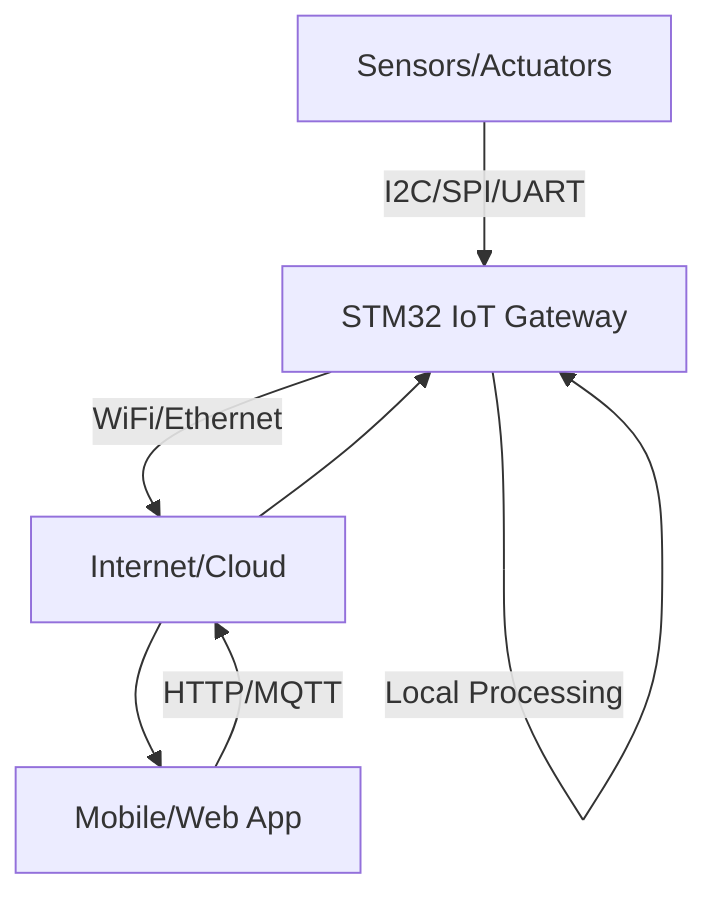

# STM32 IoT Gateway

## Introduction

An IoT (Internet of Things) gateway serves as a bridge between local IoT devices/sensors and the wider internet or cloud platforms. In this tutorial, we'll learn how to build an IoT gateway using an STM32 microcontroller. The STM32 family, with its excellent performance, low power consumption, and rich peripherals, makes an ideal platform for creating a capable yet energy-efficient IoT gateway.

Our gateway will collect data from local sensors, process it, and transmit it to cloud services, while also supporting remote control of connected devices. By the end of this tutorial, you'll understand the key concepts of IoT gateways and have practical knowledge to build your own using the STM32 platform.

## Understanding IoT Gateways

### What is an IoT Gateway?

An IoT gateway sits at the edge of a network, connecting IoT devices that use various protocols (like I2C, SPI, UART) to the internet or cloud services. It performs several important functions:

- **Protocol translation**: Converts between local device protocols and internet protocols
- **Data processing**: Filters, aggregates, and analyzes data from sensors
- **Security**: Provides encryption and authentication
- **Device management**: Handles device registration and updates
- **Edge computing**: Processes data locally to reduce cloud dependencies



## Required Hardware

To follow along with this tutorial, you'll need:

1. **STM32 Development Board** - We'll use the STM32F746G-DISCO board which has:
   - STM32F746NG microcontroller (Cortex-M7 core at 216 MHz)
   - 1MB Flash, 320KB RAM
   - Integrated Ethernet
   - Arduino compatible headers

2. **WiFi Module** - ESP8266 or a WiFi shield
3. **Sensors** - Temperature/humidity (DHT22), light sensor (BH1750)
4. **Breadboard and jumper wires**
5. **USB cable** for programming and power

## Required Software

1. **STM32CubeIDE** - Integrated development environment for STM32
2. **STM32CubeMX** - For configuring the STM32 microcontroller
3. **FreeRTOS** - Real-time operating system for multitasking
4. **LwIP** - Lightweight IP stack for network connectivity
5. **MQTT Client** - For communicating with cloud services

## Setting Up the Development Environment

### Installing STM32CubeIDE

1. Download STM32CubeIDE from [ST's website](https://www.st.com)
2. Install the IDE following the installation wizard
3. Launch STM32CubeIDE and set up a workspace

### Creating a New Project

1. In STM32CubeIDE, select `File > New > STM32 Project`
2. Select your STM32 board or MCU (STM32F746NG in our case)
3. Name your project "STM32_IoT_Gateway"
4. Select C as the programming language
5. Click "Finish" to create the project

## Hardware Setup

### Connecting the WiFi Module

Connect the ESP8266 WiFi module to the STM32 board:

| ESP8266 Pin | STM32 Pin |
|-------------|-----------|
| VCC         | 3.3V      |
| GND         | GND       |
| TX          | PA10 (UART RX) |
| RX          | PA9 (UART TX)  |
| CH_PD       | 3.3V      |

### Connecting the Sensors

Connect the DHT22 temperature/humidity sensor:

| DHT22 Pin | STM32 Pin |
|-----------|-----------|
| VCC       | 5V        |
| DATA      | PD7       |
| GND       | GND       |

Connect the BH1750 light sensor via I2C:

| BH1750 Pin | STM32 Pin |
|------------|-----------|
| VCC        | 3.3V      |
| GND        | GND       |
| SCL        | PB8 (I2C1 SCL) |
| SDA        | PB9 (I2C1 SDA) |

## Software Implementation

### Configuring the STM32 with CubeMX

1. Open STM32CubeMX within your IDE or as a standalone application
2. Configure the clock to run at 216 MHz
3. Enable the required peripherals:
   - UART1 for WiFi module communication
   - I2C1 for the light sensor
   - GPIO for the DHT22 sensor
   - Ethernet controller (if using Ethernet instead of WiFi)
4. Enable FreeRTOS middleware for multitasking
5. Configure the network stack (LwIP if using Ethernet)
6. Generate the code

### Project Structure

Our STM32 IoT Gateway will have the following software components:

```
STM32_IoT_Gateway/
├── Core/
│   ├── Inc/                   # Header files
│   └── Src/                   # Source files
├── Drivers/                   # STM32 HAL drivers
├── Middlewares/
│   ├── FreeRTOS/              # FreeRTOS files
│   ├── LwIP/                  # TCP/IP stack (if using Ethernet)
│   └── MQTT/                  # MQTT client implementation
└── Network/
    ├── wifi.c                 # WiFi module driver
    ├── wifi.h
    ├── mqtt_client.c          # MQTT client implementation
    └── mqtt_client.h
```

### Setting Up WiFi Communication

First, let's create a driver for the ESP8266 WiFi module. Create a file named `wifi.h`:

```c
#ifndef WIFI_H
#define WIFI_H

#include "main.h"
#include <stdint.h>

typedef enum {
  WIFI_OK,
  WIFI_ERROR,
  WIFI_TIMEOUT
} WiFi_Status_t;

WiFi_Status_t WiFi_Init(void);
WiFi_Status_t WiFi_Connect(const char* ssid, const char* password);
WiFi_Status_t WiFi_Disconnect(void);
WiFi_Status_t WiFi_GetIP(char* ip);
WiFi_Status_t WiFi_SendHTTPRequest(const char* host, uint16_t port, const char* path, const char* data, char* response);

#endif /* WIFI_H */
```

Now, let's implement the WiFi driver in `wifi.c`:

```c
#include "wifi.h"
#include <string.h>
#include <stdio.h>
#include "usart.h"

#define WIFI_TIMEOUT_MS 10000
#define WIFI_UART huart1  // Use the correct UART instance

static char wifi_buffer[512];
static volatile uint16_t wifi_buffer_index = 0;

static WiFi_Status_t WiFi_SendCommand(const char* command, const char* expected_response, uint32_t timeout);

void HAL_UART_RxCpltCallback(UART_HandleTypeDef *huart)
{
  if (huart->Instance == WIFI_UART.Instance)
  {
    // Store the received character in the buffer
    if (wifi_buffer_index < sizeof(wifi_buffer) - 1)
    {
      wifi_buffer[wifi_buffer_index++] = received_char;
    }
    
    // Continue receiving
    HAL_UART_Receive_IT(&WIFI_UART, (uint8_t*)&received_char, 1);
  }
}

WiFi_Status_t WiFi_Init(void)
{
  // Reset buffer
  memset(wifi_buffer, 0, sizeof(wifi_buffer));
  wifi_buffer_index = 0;
  
  // Start UART reception in interrupt mode
  uint8_t received_char;
  HAL_UART_Receive_IT(&WIFI_UART, &received_char, 1);
  
  // Reset ESP8266
  WiFi_Status_t status = WiFi_SendCommand("AT+RST\r
", "ready", 5000);
  if (status != WIFI_OK) return status;
  
  // Set mode to station + AP
  status = WiFi_SendCommand("AT+CWMODE=3\r
", "OK", 2000);
  if (status != WIFI_OK) return status;
  
  return WIFI_OK;
}

WiFi_Status_t WiFi_Connect(const char* ssid, const char* password)
{
  char command[64];
  snprintf(command, sizeof(command), "AT+CWJAP=\"%s\",\"%s\"\r
", ssid, password);
  
  return WiFi_SendCommand(command, "OK", WIFI_TIMEOUT_MS);
}

WiFi_Status_t WiFi_GetIP(char* ip)
{
  WiFi_Status_t status = WiFi_SendCommand("AT+CIFSR\r
", "CIFSR", 2000);
  if (status != WIFI_OK) return status;
  
  // Parse IP address from response
  char* ip_start = strstr(wifi_buffer, "STAIP,\"");
  if (ip_start != NULL)
  {
    ip_start += 7;  // Move to the start of the IP
    char* ip_end = strchr(ip_start, '\"');
    if (ip_end != NULL)
    {
      size_t ip_len = ip_end - ip_start;
      strncpy(ip, ip_start, ip_len);
      ip[ip_len] = '\0';
      return WIFI_OK;
    }
  }
  
  return WIFI_ERROR;
}

static WiFi_Status_t WiFi_SendCommand(const char* command, const char* expected_response, uint32_t timeout)
{
  // Clear buffer
  memset(wifi_buffer, 0, sizeof(wifi_buffer));
  wifi_buffer_index = 0;
  
  // Send command
  HAL_UART_Transmit(&WIFI_UART, (uint8_t*)command, strlen(command), 1000);
  
  // Wait for response
  uint32_t start_time = HAL_GetTick();
  while (HAL_GetTick() - start_time < timeout)
  {
    if (strstr(wifi_buffer, expected_response) != NULL)
    {
      return WIFI_OK;
    }
    HAL_Delay(10);
  }
  
  return WIFI_TIMEOUT;
}

// Additional implementations for other WiFi functions...
```

### Creating an MQTT Client

Now let's implement an MQTT client to communicate with cloud services. Create `mqtt_client.h`:

```c
#ifndef MQTT_CLIENT_H
#define MQTT_CLIENT_H

#include <stdint.h>

typedef enum {
  MQTT_OK,
  MQTT_ERROR,
  MQTT_CONNECT_FAILED,
  MQTT_SUBSCRIBE_FAILED,
  MQTT_PUBLISH_FAILED
} MQTT_Status_t;

typedef void (*MQTT_MessageCallback_t)(const char* topic, const char* message);

MQTT_Status_t MQTT_Init(void);
MQTT_Status_t MQTT_Connect(const char* broker, uint16_t port, const char* client_id, 
                          const char* username, const char* password);
MQTT_Status_t MQTT_Subscribe(const char* topic, MQTT_MessageCallback_t callback);
MQTT_Status_t MQTT_Publish(const char* topic, const char* message);
MQTT_Status_t MQTT_Disconnect(void);
void MQTT_Process(void);

#endif /* MQTT_CLIENT_H */
```

Now implement the MQTT client in `mqtt_client.c`:

```c
#include "mqtt_client.h"
#include "wifi.h"
#include <string.h>
#include <stdio.h>

#define MQTT_BUFFER_SIZE 1024

static char mqtt_tx_buffer[MQTT_BUFFER_SIZE];
static char mqtt_rx_buffer[MQTT_BUFFER_SIZE];
static MQTT_MessageCallback_t message_callback = NULL;

/* 
 * This is a simplified MQTT client for educational purposes.
 * In a real application, you would use a full MQTT library like
 * Eclipse Paho or Mosquitto.
 */

MQTT_Status_t MQTT_Connect(const char* broker, uint16_t port, const char* client_id, 
                          const char* username, const char* password)
{
  // First, establish a TCP connection to the broker
  char command[128];
  snprintf(command, sizeof(command), "AT+CIPSTART=\"TCP\",\"%s\",%d\r
", broker, port);
  
  if (WiFi_SendCommand(command, "OK", 10000) != WIFI_OK) {
    return MQTT_CONNECT_FAILED;
  }
  
  // Build the MQTT CONNECT packet (simplified)
  uint16_t len = 0;
  uint16_t client_id_len = strlen(client_id);
  
  // Fixed header
  mqtt_tx_buffer[len++] = 0x10;  // CONNECT packet type
  
  // We'll simplify the remaining length calculation for this example
  mqtt_tx_buffer[len++] = 12 + client_id_len;  // Remaining length
  
  // Variable header
  mqtt_tx_buffer[len++] = 0x00;  // Protocol name length MSB
  mqtt_tx_buffer[len++] = 0x04;  // Protocol name length LSB
  mqtt_tx_buffer[len++] = 'M';   // Protocol name
  mqtt_tx_buffer[len++] = 'Q';
  mqtt_tx_buffer[len++] = 'T';
  mqtt_tx_buffer[len++] = 'T';
  mqtt_tx_buffer[len++] = 0x04;  // Protocol level
  mqtt_tx_buffer[len++] = 0x02;  // Connect flags (clean session)
  mqtt_tx_buffer[len++] = 0x00;  // Keep alive MSB (0)
  mqtt_tx_buffer[len++] = 0x3C;  // Keep alive LSB (60 seconds)
  
  // Payload - client ID
  mqtt_tx_buffer[len++] = client_id_len >> 8;  // Client ID length MSB
  mqtt_tx_buffer[len++] = client_id_len & 0xFF; // Client ID length LSB
  memcpy(&mqtt_tx_buffer[len], client_id, client_id_len);
  len += client_id_len;
  
  // Send the packet via ESP8266
  char cip_send_cmd[16];
  snprintf(cip_send_cmd, sizeof(cip_send_cmd), "AT+CIPSEND=%d\r
", len);
  
  if (WiFi_SendCommand(cip_send_cmd, ">", 5000) != WIFI_OK) {
    return MQTT_CONNECT_FAILED;
  }
  
  // Send the actual MQTT packet
  if (WiFi_SendRawData((uint8_t*)mqtt_tx_buffer, len) != WIFI_OK) {
    return MQTT_CONNECT_FAILED;
  }
  
  // Wait for CONNACK
  // In a real implementation, you would parse the response properly
  if (WiFi_WaitForData("+IPD", 5000) != WIFI_OK) {
    return MQTT_CONNECT_FAILED;
  }
  
  return MQTT_OK;
}

MQTT_Status_t MQTT_Publish(const char* topic, const char* message)
{
  uint16_t topic_len = strlen(topic);
  uint16_t message_len = strlen(message);
  uint16_t len = 0;
  
  // Fixed header
  mqtt_tx_buffer[len++] = 0x30;  // PUBLISH packet type
  
  // Remaining length (simplified)
  mqtt_tx_buffer[len++] = 2 + topic_len + message_len;
  
  // Variable header - Topic
  mqtt_tx_buffer[len++] = topic_len >> 8;  // Topic length MSB
  mqtt_tx_buffer[len++] = topic_len & 0xFF; // Topic length LSB
  memcpy(&mqtt_tx_buffer[len], topic, topic_len);
  len += topic_len;
  
  // Payload - Message
  memcpy(&mqtt_tx_buffer[len], message, message_len);
  len += message_len;
  
  // Send the packet via ESP8266
  char cip_send_cmd[16];
  snprintf(cip_send_cmd, sizeof(cip_send_cmd), "AT+CIPSEND=%d\r
", len);
  
  if (WiFi_SendCommand(cip_send_cmd, ">", 5000) != WIFI_OK) {
    return MQTT_PUBLISH_FAILED;
  }
  
  // Send the actual MQTT packet
  if (WiFi_SendRawData((uint8_t*)mqtt_tx_buffer, len) != WIFI_OK) {
    return MQTT_PUBLISH_FAILED;
  }
  
  return MQTT_OK;
}

// Additional MQTT functions would be implemented here...
```

### Reading Sensors

Let's create drivers for our sensors. First, the DHT22 temperature/humidity sensor:

```c
#include "dht22.h"
#include "main.h"
#include "gpio.h"
#include <stdint.h>

#define DHT22_PORT GPIOD
#define DHT22_PIN GPIO_PIN_7

// Wait for specified microseconds
static void DHT22_Delay_Us(uint32_t us)
{
  uint32_t delay = us * (HAL_RCC_GetHCLKFreq() / 1000000);
  while (delay--) {}
}

static DHT22_Status_t DHT22_ReadData(uint8_t* data)
{
  uint8_t i, j;
  uint8_t temp;
  
  // Configure pin as output
  GPIO_InitTypeDef GPIO_InitStruct = {0};
  GPIO_InitStruct.Pin = DHT22_PIN;
  GPIO_InitStruct.Mode = GPIO_MODE_OUTPUT_PP;
  GPIO_InitStruct.Pull = GPIO_NOPULL;
  GPIO_InitStruct.Speed = GPIO_SPEED_FREQ_LOW;
  HAL_GPIO_Init(DHT22_PORT, &GPIO_InitStruct);
  
  // Send start signal
  HAL_GPIO_WritePin(DHT22_PORT, DHT22_PIN, GPIO_PIN_SET);
  HAL_Delay(1);
  HAL_GPIO_WritePin(DHT22_PORT, DHT22_PIN, GPIO_PIN_RESET);
  HAL_Delay(18);  // At least 18ms
  HAL_GPIO_WritePin(DHT22_PORT, DHT22_PIN, GPIO_PIN_SET);
  DHT22_Delay_Us(30);  // 20-40us
  
  // Configure pin as input
  GPIO_InitStruct.Mode = GPIO_MODE_INPUT;
  GPIO_InitStruct.Pull = GPIO_PULLUP;
  HAL_GPIO_Init(DHT22_PORT, &GPIO_InitStruct);
  
  // Check for DHT22 response
  if (HAL_GPIO_ReadPin(DHT22_PORT, DHT22_PIN) == GPIO_PIN_SET)
    return DHT22_ERROR;
  DHT22_Delay_Us(80);  // Response signal
  if (HAL_GPIO_ReadPin(DHT22_PORT, DHT22_PIN) == GPIO_PIN_RESET)
    return DHT22_ERROR;
  DHT22_Delay_Us(80);  // Prepare for data
  
  // Read 40 bits (5 bytes)
  for (i = 0; i < 5; i++) {
    temp = 0;
    for (j = 0; j < 8; j++) {
      while (HAL_GPIO_ReadPin(DHT22_PORT, DHT22_PIN) == GPIO_PIN_RESET) {};  // Wait for rising edge
      DHT22_Delay_Us(30);  // Wait 30us
      if (HAL_GPIO_ReadPin(DHT22_PORT, DHT22_PIN) == GPIO_PIN_SET) {
        // Bit is 1
        temp |= (1 << (7 - j));
        while (HAL_GPIO_ReadPin(DHT22_PORT, DHT22_PIN) == GPIO_PIN_SET) {};  // Wait for falling edge
      }
    }
    data[i] = temp;
  }
  
  // Verify checksum
  if (data[4] == ((data[0] + data[1] + data[2] + data[3]) & 0xFF))
    return DHT22_OK;
  else
    return DHT22_CHECKSUM_ERROR;
}

DHT22_Status_t DHT22_ReadTemperatureHumidity(float* temperature, float* humidity)
{
  uint8_t data[5];
  
  DHT22_Status_t status = DHT22_ReadData(data);
  if (status != DHT22_OK)
    return status;
  
  // Calculate humidity
  *humidity = ((data[0] << 8) | data[1]) / 10.0;
  
  // Calculate temperature
  int16_t temp16 = ((data[2] & 0x7F) << 8) | data[3];
  if (data[2] & 0x80)  // Negative temperature
    temp16 = -temp16;
  *temperature = temp16 / 10.0;
  
  return DHT22_OK;
}
```

Next, let's implement a driver for the BH1750 light sensor:

```c
#include "bh1750.h"
#include "i2c.h"

#define BH1750_ADDR 0x23  // ADDR pin low - 0x5C if ADDR pin high
#define BH1750_MODE BH1750_CONTINUOUS_HIGH_RES

BH1750_Status_t BH1750_Init(void)
{
  uint8_t command = BH1750_POWER_ON;
  if (HAL_I2C_Master_Transmit(&hi2c1, BH1750_ADDR << 1, &command, 1, 100) != HAL_OK)
    return BH1750_ERROR;
  
  command = BH1750_MODE;
  if (HAL_I2C_Master_Transmit(&hi2c1, BH1750_ADDR << 1, &command, 1, 100) != HAL_OK)
    return BH1750_ERROR;
  
  return BH1750_OK;
}

BH1750_Status_t BH1750_ReadLight(float* light)
{
  uint8_t data[2];
  
  if (HAL_I2C_Master_Receive(&hi2c1, BH1750_ADDR << 1, data, 2, 100) != HAL_OK)
    return BH1750_ERROR;
  
  // Calculate the light level in lux
  uint16_t raw_light = (data[0] << 8) | data[1];
  *light = raw_light / 1.2;
  
  return BH1750_OK;
}
```

### Main Application

Now, let's implement the main application that ties everything together. We'll use FreeRTOS to create different tasks for handling sensors, network communication, and cloud connectivity.

```c
/* Includes */
#include "main.h"
#include "cmsis_os.h"
#include "wifi.h"
#include "mqtt_client.h"
#include "dht22.h"
#include "bh1750.h"
#include <stdio.h>
#include <string.h>

/* Private variables */
osThreadId sensorTaskHandle;
osThreadId networkTaskHandle;
osThreadId mqttTaskHandle;
osMessageQId sensorQueueHandle;

/* WiFi and MQTT configuration */
#define WIFI_SSID "YourWiFiSSID"
#define WIFI_PASSWORD "YourWiFiPassword"
#define MQTT_BROKER "mqtt.example.com"
#define MQTT_PORT 1883
#define MQTT_CLIENT_ID "STM32_Gateway"
#define MQTT_USERNAME "user"
#define MQTT_PASSWORD "pass"
#define MQTT_TOPIC_PUBLISH "stm32/sensors"
#define MQTT_TOPIC_SUBSCRIBE "stm32/control"

/* Sensor data structure */
typedef struct {
  float temperature;
  float humidity;
  float light;
  uint32_t timestamp;
} SensorData_t;

/* Function prototypes */
void SystemClock_Config(void);
void StartSensorTask(void const * argument);
void StartNetworkTask(void const * argument);
void StartMQTTTask(void const * argument);
void MQTT_MessageHandler(const char* topic, const char* message);

int main(void)
{
  /* Reset of all peripherals, initialize the Flash interface and the Systick. */
  HAL_Init();
  
  /* Configure the system clock */
  SystemClock_Config();
  
  /* Initialize all configured peripherals */
  MX_GPIO_Init();
  MX_I2C1_Init();
  MX_USART1_UART_Init();
  
  /* Initialize sensors */
  BH1750_Init();
  
  /* Create the thread(s) */
  osThreadDef(sensorTask, StartSensorTask, osPriorityNormal, 0, 256);
  sensorTaskHandle = osThreadCreate(osThread(sensorTask), NULL);
  
  osThreadDef(networkTask, StartNetworkTask, osPriorityNormal, 0, 512);
  networkTaskHandle = osThreadCreate(osThread(networkTask), NULL);
  
  osThreadDef(mqttTask, StartMQTTTask, osPriorityNormal, 0, 512);
  mqttTaskHandle = osThreadCreate(osThread(mqttTask), NULL);
  
  /* Create the message queue */
  osMessageQDef(sensorQueue, 10, SensorData_t);
  sensorQueueHandle = osMessageCreate(osMessageQ(sensorQueue), NULL);
  
  /* Start scheduler */
  osKernelStart();
  
  /* We should never get here as control is now taken by the scheduler */
  while (1) {}
}

/* Sensor data collection task */
void StartSensorTask(void const * argument)
{
  SensorData_t sensorData;
  
  for(;;)
  {
    /* Read temperature and humidity */
    float temperature, humidity;
    if (DHT22_ReadTemperatureHumidity(&temperature, &humidity) == DHT22_OK)
    {
      sensorData.temperature = temperature;
      sensorData.humidity = humidity;
    }
    
    /* Read light level */
    float light;
    if (BH1750_ReadLight(&light) == BH1750_OK)
    {
      sensorData.light = light;
    }
    
    /* Add timestamp */
    sensorData.timestamp = HAL_GetTick();
    
    /* Send sensor data to MQTT task via queue */
    osMessagePut(sensorQueueHandle, (uint32_t)&sensorData, 0);
    
    /* Sample sensors every 10 seconds */
    osDelay(10000);
  }
}

/* Network connection task */
void StartNetworkTask(void const * argument)
{
  /* Initialize WiFi module */
  if (WiFi_Init() != WIFI_OK)
  {
    /* Handle error */
    Error_Handler();
  }
  
  /* Connect to WiFi network */
  if (WiFi_Connect(WIFI_SSID, WIFI_PASSWORD) != WIFI_OK)
  {
    /* Handle error */
    Error_Handler();
  }
  
  /* Get IP address */
  char ip[16];
  if (WiFi_GetIP(ip) == WIFI_OK)
  {
    /* Log IP address (could send to debug UART) */
    printf("IP Address: %s\r
", ip);
  }
  
  /* Task completed, suspend */
  osThreadSuspend(NULL);
}

/* MQTT communication task */
void StartMQTTTask(void const * argument)
{
  /* Wait for network to be ready */
  osDelay(5000);
  
  /* Connect to MQTT broker */
  if (MQTT_Connect(MQTT_BROKER, MQTT_PORT, MQTT_CLIENT_ID, MQTT_USERNAME, MQTT_PASSWORD) != MQTT_OK)
  {
    /* Handle error */
    Error_Handler();
  }
  
  /* Subscribe to control topic */
  if (MQTT_Subscribe(MQTT_TOPIC_SUBSCRIBE, MQTT_MessageHandler) != MQTT_OK)
  {
    /* Handle error */
    Error_Handler();
  }
  
  for(;;)
  {
    /* Process MQTT messages */
    MQTT_Process();
    
    /* Check for sensor data in queue */
    osEvent event = osMessageGet(sensorQueueHandle, 100);
    if (event.status == osEventMessage)
    {
      SensorData_t* sensorData = (SensorData_t*)event.value.p;
      
      /* Format sensor data as JSON */
      char json[128];
      snprintf(json, sizeof(json), 
               "{\"temp\":%.1f,\"humidity\":%.1f,\"light\":%.1f,\"timestamp\":%lu}",
               sensorData->temperature, 
               sensorData->humidity,
               sensorData->light,
               sensorData->timestamp);
      
      /* Publish to MQTT broker */
      MQTT_Publish(MQTT_TOPIC_PUBLISH, json);
    }
  }
}

/* MQTT message callback */
void MQTT_MessageHandler(const char* topic, const char* message)
{
  /* Handle incoming control messages */
  if (strcmp(topic, MQTT_TOPIC_SUBSCRIBE) == 0)
  {
    /* Parse JSON message and handle commands */
    /* This is a simple example - you could add more sophisticated parsing */
    if (strstr(message, "\"command\":\"led_on\"") != NULL)
    {
      /* Turn on LED */
      HAL_GPIO_WritePin(LD1_GPIO_Port, LD1_Pin, GPIO_PIN_SET);
    }
    else if (strstr(message, "\"command\":\"led_off\"") != NULL)
    {
      /* Turn off LED */
      HAL_GPIO_WritePin(LD1_GPIO_Port, LD1_Pin, GPIO_PIN_RESET);
    }
  }
}
```

## Integration with Cloud Platforms

Our IoT gateway can connect to various cloud platforms. Here are a few examples:

### Integration with AWS IoT Core

1. Create an AWS IoT thing and generate certificates
2. Update the MQTT configuration to use AWS IoT endpoint
3. Implement TLS for secure communication
4. Use AWS IoT specific topics and protocols

### Integration with Google Cloud IoT