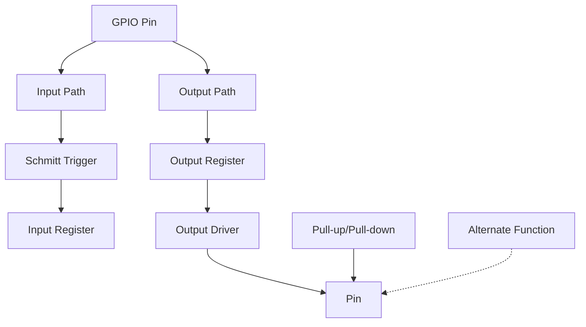

# STM32 GPIO Configuration

## Introduction

General Purpose Input/Output (GPIO) pins are fundamental components of any microcontroller, including the STM32 family. These pins allow the microcontroller to interact with the outside world by reading digital signals (input) or controlling external devices (output). Properly configuring GPIO pins is one of the first skills you'll need to master when working with STM32 microcontrollers.

In this tutorial, we'll explore how to configure and use GPIO pins on STM32 microcontrollers, understand the internal architecture of these pins, and implement common use cases like controlling LEDs, reading button states, and more.

## STM32 GPIO Architecture

Before diving into configuration, let's understand the architecture of an STM32 GPIO pin.



Each GPIO pin on an STM32 microcontroller has:

- **Input path**: For reading external signals
- **Output path**: For controlling external devices
- **Pull-up/Pull-down resistors**: For defining the default state
- **Alternate function support**: For connecting to internal peripherals like UART, I2C, etc.
- **Speed configuration**: For controlling signal transition rate
- **Various operating modes**: Input, output, analog, alternate function

## Basic GPIO Configuration

### Step 1: Enable the GPIO Clock

Before using any GPIO port, you need to enable its clock. In STM32 microcontrollers, all peripherals, including GPIO ports, are connected to the Advanced High-performance Bus (AHB) or the Advanced Peripheral Bus (APB). The exact register depends on the STM32 family you're using.

For STM32F4xx series:

```c
// Enable GPIOA clock
RCC->AHB1ENR |= RCC_AHB1ENR_GPIOAEN;

// Enable GPIOB clock
RCC->AHB1ENR |= RCC_AHB1ENR_GPIOBEN;

// Enable multiple GPIO clocks at once
RCC->AHB1ENR |= (RCC_AHB1ENR_GPIOAEN | RCC_AHB1ENR_GPIOBEN | RCC_AHB1ENR_GPIOCEN);
```

For STM32F0xx, STM32F3xx, and some other series:

```c
// Enable GPIOA clock
RCC->AHBENR |= RCC_AHBENR_GPIOAEN;

// Enable GPIOB clock
RCC->AHBENR |= RCC_AHBENR_GPIOBEN;
```

### Step 2: Configure GPIO Mode

Each GPIO pin can operate in one of these modes:

1. **Input mode**: For reading external signals
2. **Output mode**: For controlling external devices
3. **Alternate function mode**: For connecting to internal peripherals
4. **Analog mode**: For connecting to analog peripherals like ADC

Here's how to configure these modes:

```c
// Configure PA5 as output
GPIOA->MODER &= ~(0x3 << (5 * 2));  // Clear mode bits for pin 5
GPIOA->MODER |= (0x1 << (5 * 2));   // Set output mode (01) for pin 5

// Configure PB6 as input
GPIOB->MODER &= ~(0x3 << (6 * 2));  // Clear mode bits for pin 6 (00 = input mode)

// Configure PC7 as analog
GPIOC->MODER |= (0x3 << (7 * 2));   // Set analog mode (11) for pin 7

// Configure PD8 as alternate function
GPIOD->MODER &= ~(0x3 << (8 * 2));  // Clear mode bits for pin 8
GPIOD->MODER |= (0x2 << (8 * 2));   // Set alternate function mode (10) for pin 8
```

### Step 3: Configure Output Type (for output mode)

When configured as output, you can choose between push-pull or open-drain:

```c
// Configure PA5 as push-pull output (default)
GPIOA->OTYPER &= ~(0x1 << 5);

// Configure PA7 as open-drain output
GPIOA->OTYPER |= (0x1 << 7);
```

### Step 4: Configure Output Speed (for output mode)

You can set different speed grades for output pins:

```c
// Configure PA5 as low-speed output
GPIOA->OSPEEDR &= ~(0x3 << (5 * 2));

// Configure PA7 as high-speed output
GPIOA->OSPEEDR &= ~(0x3 << (7 * 2));  // Clear speed bits
GPIOA->OSPEEDR |= (0x3 << (7 * 2));   // Set high speed (11)
```

### Step 5: Configure Pull-up/Pull-down Resistors

You can enable internal pull-up or pull-down resistors:

```c
// Configure PA5 with pull-up resistor
GPIOA->PUPDR &= ~(0x3 << (5 * 2));    // Clear pull-up/down bits
GPIOA->PUPDR |= (0x1 << (5 * 2));     // Set pull-up (01)

// Configure PB6 with pull-down resistor
GPIOB->PUPDR &= ~(0x3 << (6 * 2));    // Clear pull-up/down bits
GPIOB->PUPDR |= (0x2 << (6 * 2));     // Set pull-down (10)

// Configure PC7 with no pull-up/pull-down (floating)
GPIOC->PUPDR &= ~(0x3 << (7 * 2));    // Clear pull-up/down bits (00 = floating)
```

### Step 6: Configure Alternate Function (if applicable)

If you're using alternate function mode, you need to specify which function:

```c
// Configure PB6 for USART1_TX (AF7)
GPIOB->AFR[0] &= ~(0xF << (6 * 4));   // Clear AF bits for pin 6 (in low register AFR[0])
GPIOB->AFR[0] |= (0x7 << (6 * 4));    // Set AF7 for pin 6

// Configure PB10 for I2C2_SCL (AF4)
GPIOB->AFR[1] &= ~(0xF << ((10-8) * 4));  // Clear AF bits for pin 10 (in high register AFR[1])
GPIOB->AFR[1] |= (0x4 << ((10-8) * 4));   // Set AF4 for pin 10
```

## Reading and Writing GPIO

### Reading Input Pins

To read the state of an input pin:

```c
// Read state of pin PB6
uint8_t pinState = (GPIOB->IDR & (1 << 6)) >> 6;

// Alternative for cleaner code
uint8_t pinState = (GPIOB->IDR & (1 << 6)) ? 1 : 0;

// Reading multiple pins at once
uint16_t portValue = GPIOB->IDR;
```

### Writing to Output Pins

To set or reset output pins:

```c
// Set PA5 high
GPIOA->BSRR = (1 << 5);

// Set PA7 low
GPIOA->BSRR = (1 << (7 + 16));  // Using the reset bits (16-31)

// Alternative method to set low
GPIOA->BRR = (1 << 7);  // Not available on all STM32 series

// Direct write to output data register (less efficient for single pin)
GPIOA->ODR |= (1 << 5);   // Set high
GPIOA->ODR &= ~(1 << 7);  // Set low

// Toggle a pin
GPIOA->ODR ^= (1 << 5);   // Toggle PA5
```

## Practical Examples

### Example 1: Controlling an LED

Let's configure an STM32 to blink an LED connected to PA5 (which is the built-in LED on many STM32 development boards):

```c
#include "stm32f4xx.h"

void delay(uint32_t ms) {
    // Simple delay function
    ms *= 3000;  // Adjust based on your clock speed
    while (ms--) {
        __NOP();  // No operation
    }
}

int main(void) {
    // Enable GPIOA clock
    RCC->AHB1ENR |= RCC_AHB1ENR_GPIOAEN;
    
    // Configure PA5 as output
    GPIOA->MODER &= ~(0x3 << (5 * 2));
    GPIOA->MODER |= (0x1 << (5 * 2));
    
    // Configure as push-pull (default, but being explicit)
    GPIOA->OTYPER &= ~(0x1 << 5);
    
    // Configure as low speed (default, but being explicit)
    GPIOA->OSPEEDR &= ~(0x3 << (5 * 2));
    
    // No pull-up/pull-down
    GPIOA->PUPDR &= ~(0x3 << (5 * 2));
    
    while (1) {
        // Toggle LED
        GPIOA->ODR ^= (1 << 5);
        delay(500);  // Wait 500ms
    }
}
```

### Example 2: Reading a Button and Controlling an LED

Now let's read a button connected to PB6 and toggle the LED when pressed:

```c
#include "stm32f4xx.h"

void delay(uint32_t ms) {
    ms *= 3000;  // Adjust based on your clock speed
    while (ms--) {
        __NOP();
    }
}

int main(void) {
    // Enable GPIOA and GPIOB clocks
    RCC->AHB1ENR |= RCC_AHB1ENR_GPIOAEN | RCC_AHB1ENR_GPIOBEN;
    
    // Configure PA5 (LED) as output
    GPIOA->MODER &= ~(0x3 << (5 * 2));
    GPIOA->MODER |= (0x1 << (5 * 2));
    
    // Configure PB6 (button) as input with pull-up
    GPIOB->MODER &= ~(0x3 << (6 * 2));
    GPIOB->PUPDR &= ~(0x3 << (6 * 2));
    GPIOB->PUPDR |= (0x1 << (6 * 2));  // Enable pull-up
    
    uint8_t prevButtonState = 1;  // Button state (1 = not pressed with pull-up)
    
    while (1) {
        // Read button state
        uint8_t buttonState = (GPIOB->IDR & (1 << 6)) ? 1 : 0;
        
        // Check for button press (transition from high to low)
        if (buttonState == 0 && prevButtonState == 1) {
            // Toggle LED
            GPIOA->ODR ^= (1 << 5);
            delay(50);  // Debounce delay
        }
        
        prevButtonState = buttonState;
        delay(10);  // Small delay for debouncing
    }
}
```

### Example 3: Using Alternate Function (UART)

This example configures pins PA9 and PA10 for UART1 operation:

```c
#include "stm32f4xx.h"

void UART1_Init(void) {
    // Enable GPIOA and USART1 clocks
    RCC->AHB1ENR |= RCC_AHB1ENR_GPIOAEN;
    RCC->APB2ENR |= RCC_APB2ENR_USART1EN;
    
    // Configure PA9 (TX) and PA10 (RX) for alternate function
    
    // Set mode to alternate function for PA9 and PA10
    GPIOA->MODER &= ~(0x3 << (9 * 2) | 0x3 << (10 * 2));
    GPIOA->MODER |= (0x2 << (9 * 2) | 0x2 << (10 * 2));
    
    // Set alternate function 7 (USART1) for PA9 and PA10
    GPIOA->AFR[1] &= ~(0xF << ((9-8) * 4) | 0xF << ((10-8) * 4));
    GPIOA->AFR[1] |= (0x7 << ((9-8) * 4) | 0x7 << ((10-8) * 4));
    
    // Configure speed and output type (high speed, push-pull)
    GPIOA->OSPEEDR |= (0x3 << (9 * 2) | 0x3 << (10 * 2));
    GPIOA->OTYPER &= ~(0x1 << 9 | 0x1 << 10);
    
    // No pull-up/pull-down for PA9, pull-up for PA10 (RX)
    GPIOA->PUPDR &= ~(0x3 << (9 * 2) | 0x3 << (10 * 2));
    GPIOA->PUPDR |= (0x1 << (10 * 2));  // Pull-up for RX
    
    // Configure USART1 (details omitted for brevity - focus on GPIO)
    // ...
}

int main(void) {
    UART1_Init();
    
    // Rest of your UART code
    // ...
    
    while (1) {
        // Main loop
    }
}
```

## Using GPIO with HAL Library

While direct register manipulation gives you complete control, the STM32 HAL (Hardware Abstraction Layer) library provides a more portable approach:

```c
#include "stm32f4xx_hal.h"

int main(void) {
    HAL_Init();
    
    // Enable GPIO Clocks
    __HAL_RCC_GPIOA_CLK_ENABLE();
    
    // Configure LED on PA5
    GPIO_InitTypeDef GPIO_InitStruct = {0};
    GPIO_InitStruct.Pin = GPIO_PIN_5;
    GPIO_InitStruct.Mode = GPIO_MODE_OUTPUT_PP;
    GPIO_InitStruct.Pull = GPIO_NOPULL;
    GPIO_InitStruct.Speed = GPIO_SPEED_FREQ_LOW;
    HAL_GPIO_Init(GPIOA, &GPIO_InitStruct);
    
    while (1) {
        // Toggle LED
        HAL_GPIO_TogglePin(GPIOA, GPIO_PIN_5);
        HAL_Delay(500);
    }
}
```

## GPIO Configuration Best Practices

1. **Always enable the clock** before configuring GPIO ports.
2. **Use atomic operations** like BSRR for setting/resetting pins to avoid race conditions.
3. **Properly configure input pins** with pull-up/pull-down resistors when needed.
4. **Consider using HAL library** for better portability across STM32 families.
5. **Use appropriate speed settings** for output pins to minimize EMI and power consumption.
6. **Be cautious with open-drain outputs** - they require external pull-up resistors in most cases.
7. **Pay attention to current limits** - STM32 GPIO pins typically can source/sink 8-25mA depending on the specific MCU.

## Common GPIO Configuration Issues

1. **Forgetting to enable the GPIO clock**: If your GPIO doesn't work, first check if you've enabled the corresponding clock.
2. **Incorrect pin numbering**: Remember that pin numbers start from 0, not 1.
3. **Not clearing bits before setting**: Always clear the relevant bits before setting new values to avoid unintended configurations.
4. **Using BRR on unsupported series**: Not all STM32 series have the BRR register. Check your device's reference manual.
5. **Exceeding current limits**: Connecting high-current loads directly to GPIO pins can damage the microcontroller.

## Summary

STM32 GPIO configuration involves several steps:
1. Enabling the GPIO clock
2. Setting the pin mode (input, output, alternate function, analog)
3. Configuring additional options like speed, output type, and pull-up/pull-down
4. Reading from or writing to the pins using the appropriate registers

By understanding the GPIO architecture and configuration options, you can interface your STM32 microcontroller with various external devices and sensors.

## Exercises

1. Create a project that uses a button to cycle through different LED blinking patterns (e.g., slow blink, fast blink, always on).
2. Implement a simple traffic light system using three LEDs (red, yellow, green).
3. Create a binary counter using 8 LEDs that increments every second.
4. Implement debouncing for a button input without using delays.
5. Create a project that combines multiple GPIO configurations: reading buttons, controlling LEDs, and using one pin in alternate function mode.

## Additional Resources

- STM32 Reference Manuals: Check the specific documentation for your STM32 family
- STM32CubeIDE: Integrated development environment with configuration tools
- STM32 HAL Documentation: For higher-level GPIO configuration
- STM32 GPIO tutorials on embedded systems forums and websites