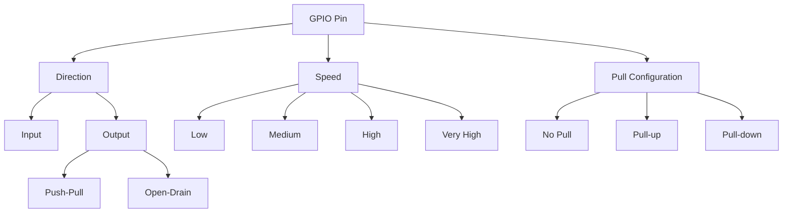

# STM32 LED Control

## Introduction

Controlling LEDs is often the first step in embedded systems programming - it's the "Hello World" of microcontrollers! In this tutorial, we'll learn how to control LEDs using the GPIO (General-Purpose Input/Output) pins of STM32 microcontrollers. We'll cover everything from basic blinking to more advanced patterns and techniques.

STM32 microcontrollers are powerful ARM Cortex-M based devices that offer versatile GPIO capabilities, making them perfect for LED control applications. Whether you're building a simple indicator light or a complex lighting system, understanding LED control is a fundamental skill for any embedded programmer.

## Prerequisites

Before we begin, make sure you have:
- An STM32 development board (like the STM32F4Discovery, Nucleo, or similar)
- STM32CubeIDE or another STM32 development environment installed
- Basic understanding of C programming
- A USB cable to connect your board to your computer
- LEDs, resistors (typically 220Ω-330Ω), and jumper wires if you're building your own circuit

## Understanding GPIO on STM32

GPIO pins on STM32 microcontrollers can be configured for various functions. For LED control, we'll use them as digital outputs. Each GPIO pin on an STM32 can be:

1. **Configured as input or output**
2. **Set to different output modes** (push-pull, open-drain)
3. **Configured with or without pull-up/pull-down resistors**
4. **Set to different speed grades** (low, medium, high, very high)

Here's a simple diagram showing the GPIO structure:



## Basic LED Blinking Example

Let's start with a simple example: blinking an on-board LED. Most STM32 development boards have at least one built-in LED connected to a GPIO pin.

### Step 1: Setting Up the Project

Create a new project in STM32CubeIDE:

1. Open STM32CubeIDE
2. Click on "File" > "New" > "STM32 Project"
3. Select your board or microcontroller
4. Give your project a name (e.g., "LED_Blink")
5. Keep the default settings and click "Finish"

### Step 2: Configuring the GPIO

We'll use the built-in LED that's typically connected to a specific GPIO pin. For the STM32F4Discovery board, it's connected to pin PD13.

In the STM32CubeMX graphical interface:

1. Find the pin connected to your on-board LED (check your board's documentation)
2. Configure it as "GPIO_Output"
3. Set the appropriate default settings
4. Generate the code

### Step 3: Writing the Code

Once you've generated the project, open the `main.c` file. We'll modify the main loop to blink the LED.

```c
/* USER CODE BEGIN WHILE */
while (1)
{
  /* USER CODE END WHILE */
  
  /* USER CODE BEGIN 3 */
  HAL_GPIO_TogglePin(GPIOD, GPIO_PIN_13); // Toggle the LED state
  HAL_Delay(500); // Wait for 500ms
}
/* USER CODE END 3 */
```

This code simply toggles the LED state every 500ms, creating a blinking effect.

### Step 4: Compiling and Running

1. Compile the code by clicking the "Build" button
2. Connect your STM32 board to your computer
3. Click the "Debug" button to flash the code to your board
4. Watch your LED start blinking!

## Understanding the LED Control Code

Let's break down the key functions used for LED control:

### GPIO Initialization

Before using a GPIO pin, it must be initialized:

```c
void GPIO_Init(void)
{
  GPIO_InitTypeDef GPIO_InitStruct = {0};
  
  /* Enable the GPIO port clock */
  __HAL_RCC_GPIOD_CLK_ENABLE();
  
  /* Configure the GPIO pin */
  GPIO_InitStruct.Pin = GPIO_PIN_13;
  GPIO_InitStruct.Mode = GPIO_MODE_OUTPUT_PP; // Push-pull output
  GPIO_InitStruct.Pull = GPIO_NOPULL; // No pull-up or pull-down
  GPIO_InitStruct.Speed = GPIO_SPEED_FREQ_LOW; // Low speed is sufficient for LEDs
  
  HAL_GPIO_Init(GPIOD, &GPIO_InitStruct);
}
```

This code:
1. Creates a GPIO initialization structure
2. Enables the clock for the GPIO port (GPIOD in this case)
3. Sets the pin number (PIN_13)
4. Configures the pin as push-pull output
5. Disables pull-up/pull-down resistors
6. Sets the output speed to low (sufficient for LEDs)
7. Initializes the GPIO pin with these settings

### Controlling the LED State

There are three main ways to control an LED:

#### 1. Setting the LED state (ON/OFF)

```c
// Turn the LED ON
HAL_GPIO_WritePin(GPIOD, GPIO_PIN_13, GPIO_PIN_SET);

// Turn the LED OFF
HAL_GPIO_WritePin(GPIOD, GPIO_PIN_13, GPIO_PIN_RESET);
```

#### 2. Toggling the LED state

```c
// Toggle the LED (ON→OFF or OFF→ON)
HAL_GPIO_TogglePin(GPIOD, GPIO_PIN_13);
```

#### 3. Reading the current LED state

```c
// Read the current state of the LED
GPIO_PinState state = HAL_GPIO_ReadPin(GPIOD, GPIO_PIN_13);

if (state == GPIO_PIN_SET) {
  // LED is ON
} else {
  // LED is OFF
}
```

## Multiple LED Control

Most projects require controlling multiple LEDs. Let's look at how to control multiple LEDs connected to different GPIO pins.

### Hardware Setup

Connect several LEDs to different GPIO pins through appropriate resistors. For example:
- LED1 → PD12 (with a 220Ω resistor)
- LED2 → PD13 (with a 220Ω resistor)
- LED3 → PD14 (with a 220Ω resistor)
- LED4 → PD15 (with a 220Ω resistor)

### Code Example

```c
/* Define LED pins */
#define LED1_PIN GPIO_PIN_12
#define LED2_PIN GPIO_PIN_13
#define LED3_PIN GPIO_PIN_14
#define LED4_PIN GPIO_PIN_15
#define LED_PORT GPIOD

/* GPIO Initialization function */
void LED_GPIO_Init(void)
{
  GPIO_InitTypeDef GPIO_InitStruct = {0};
  
  /* Enable the GPIO port clock */
  __HAL_RCC_GPIOD_CLK_ENABLE();
  
  /* Configure all LED pins */
  GPIO_InitStruct.Pin = LED1_PIN | LED2_PIN | LED3_PIN | LED4_PIN;
  GPIO_InitStruct.Mode = GPIO_MODE_OUTPUT_PP;
  GPIO_InitStruct.Pull = GPIO_NOPULL;
  GPIO_InitStruct.Speed = GPIO_SPEED_FREQ_LOW;
  
  HAL_GPIO_Init(LED_PORT, &GPIO_InitStruct);
}

/* LED control functions */
void LED_All_ON(void)
{
  HAL_GPIO_WritePin(LED_PORT, LED1_PIN | LED2_PIN | LED3_PIN | LED4_PIN, GPIO_PIN_SET);
}

void LED_All_OFF(void)
{
  HAL_GPIO_WritePin(LED_PORT, LED1_PIN | LED2_PIN | LED3_PIN | LED4_PIN, GPIO_PIN_RESET);
}

/* Create a running light effect */
void LED_Running_Light(uint32_t delay_ms)
{
  // Turn on LEDs one by one
  HAL_GPIO_WritePin(LED_PORT, LED1_PIN, GPIO_PIN_SET);
  HAL_Delay(delay_ms);
  HAL_GPIO_WritePin(LED_PORT, LED2_PIN, GPIO_PIN_SET);
  HAL_Delay(delay_ms);
  HAL_GPIO_WritePin(LED_PORT, LED3_PIN, GPIO_PIN_SET);
  HAL_Delay(delay_ms);
  HAL_GPIO_WritePin(LED_PORT, LED4_PIN, GPIO_PIN_SET);
  HAL_Delay(delay_ms);
  
  // Turn off LEDs one by one
  HAL_GPIO_WritePin(LED_PORT, LED1_PIN, GPIO_PIN_RESET);
  HAL_Delay(delay_ms);
  HAL_GPIO_WritePin(LED_PORT, LED2_PIN, GPIO_PIN_RESET);
  HAL_Delay(delay_ms);
  HAL_GPIO_WritePin(LED_PORT, LED3_PIN, GPIO_PIN_RESET);
  HAL_Delay(delay_ms);
  HAL_GPIO_WritePin(LED_PORT, LED4_PIN, GPIO_PIN_RESET);
  HAL_Delay(delay_ms);
}
```

## Advanced LED Control Techniques

### LED Brightness Control with PWM

While digital GPIO can only turn LEDs fully ON or OFF, we can use PWM (Pulse Width Modulation) to control the brightness of LEDs:

```c
/* Initialize Timer for PWM */
void PWM_Init(void)
{
  TIM_HandleTypeDef htim4;
  TIM_OC_InitTypeDef sConfigOC = {0};
  
  /* Initialize the timer */
  htim4.Instance = TIM4;
  htim4.Init.Prescaler = 83; // Adjust based on your clock
  htim4.Init.CounterMode = TIM_COUNTERMODE_UP;
  htim4.Init.Period = 999; // 0-999 gives 1000 steps of brightness
  HAL_TIM_PWM_Init(&htim4);
  
  /* Configure the PWM channel */
  sConfigOC.OCMode = TIM_OCMODE_PWM1;
  sConfigOC.Pulse = 0; // Start with LED off
  sConfigOC.OCPolarity = TIM_OCPOLARITY_HIGH;
  HAL_TIM_PWM_ConfigChannel(&htim4, &sConfigOC, TIM_CHANNEL_1);
  
  /* Start PWM */
  HAL_TIM_PWM_Start(&htim4, TIM_CHANNEL_1);
}

/* Set LED brightness (0-100%) */
void LED_Set_Brightness(uint8_t brightness)
{
  uint32_t pulse = (brightness * 999) / 100;
  __HAL_TIM_SET_COMPARE(&htim4, TIM_CHANNEL_1, pulse);
}
```

With this code, you can call `LED_Set_Brightness(50)` to set the LED to 50% brightness.

### LED Patterns with Bit Manipulation

For efficient LED patterns, we can use bit manipulation:

```c
/* Binary counter pattern */
void LED_Binary_Counter(uint32_t delay_ms)
{
  for (uint8_t i = 0; i < 16; i++) {
    // Write the binary value directly to the output data register
    // Shift to match the LED pins (12-15)
    GPIOD->ODR = (i << 12);
    HAL_Delay(delay_ms);
  }
}

/* LED chaser with variable direction */
void LED_Chaser(uint32_t delay_ms, uint8_t direction)
{
  uint16_t pattern = 0x1000; // Start with LED1 (PD12)
  
  for (uint8_t i = 0; i < 4; i++) {
    // Write the pattern to the LEDs
    GPIOD->ODR = pattern;
    HAL_Delay(delay_ms);
    
    // Update pattern based on direction
    if (direction) {
      // Left to right
      pattern <<= 1;
    } else {
      // Right to left
      pattern >>= 1;
    }
  }
}
```

## Practical Example: Traffic Light Simulation

Let's create a traffic light simulation with three LEDs: red, yellow, and green.

### Hardware Setup
- Red LED → PC0 (with a 220Ω resistor)
- Yellow LED → PC1 (with a 220Ω resistor)
- Green LED → PC2 (with a 220Ω resistor)

### Code Implementation

```c
/* Define traffic light pins */
#define RED_LED_PIN GPIO_PIN_0
#define YELLOW_LED_PIN GPIO_PIN_1
#define GREEN_LED_PIN GPIO_PIN_2
#define TRAFFIC_LED_PORT GPIOC

/* GPIO Initialization */
void Traffic_Light_Init(void)
{
  GPIO_InitTypeDef GPIO_InitStruct = {0};
  
  /* Enable GPIOC clock */
  __HAL_RCC_GPIOC_CLK_ENABLE();
  
  /* Configure the GPIO pins */
  GPIO_InitStruct.Pin = RED_LED_PIN | YELLOW_LED_PIN | GREEN_LED_PIN;
  GPIO_InitStruct.Mode = GPIO_MODE_OUTPUT_PP;
  GPIO_InitStruct.Pull = GPIO_NOPULL;
  GPIO_InitStruct.Speed = GPIO_SPEED_FREQ_LOW;
  
  HAL_GPIO_Init(TRAFFIC_LED_PORT, &GPIO_InitStruct);
  
  /* Start with all LEDs off */
  HAL_GPIO_WritePin(TRAFFIC_LED_PORT, RED_LED_PIN | YELLOW_LED_PIN | GREEN_LED_PIN, GPIO_PIN_RESET);
}

/* Traffic light sequence function */
void Traffic_Light_Sequence(void)
{
  // Turn on RED light for 3 seconds
  HAL_GPIO_WritePin(TRAFFIC_LED_PORT, RED_LED_PIN, GPIO_PIN_SET);
  HAL_GPIO_WritePin(TRAFFIC_LED_PORT, YELLOW_LED_PIN | GREEN_LED_PIN, GPIO_PIN_RESET);
  HAL_Delay(3000);
  
  // Turn on RED and YELLOW lights for 1 second (getting ready to go)
  HAL_GPIO_WritePin(TRAFFIC_LED_PORT, RED_LED_PIN | YELLOW_LED_PIN, GPIO_PIN_SET);
  HAL_GPIO_WritePin(TRAFFIC_LED_PORT, GREEN_LED_PIN, GPIO_PIN_RESET);
  HAL_Delay(1000);
  
  // Turn on GREEN light for 3 seconds
  HAL_GPIO_WritePin(TRAFFIC_LED_PORT, GREEN_LED_PIN, GPIO_PIN_SET);
  HAL_GPIO_WritePin(TRAFFIC_LED_PORT, RED_LED_PIN | YELLOW_LED_PIN, GPIO_PIN_RESET);
  HAL_Delay(3000);
  
  // Turn on YELLOW light for 2 seconds (warning to stop)
  HAL_GPIO_WritePin(TRAFFIC_LED_PORT, YELLOW_LED_PIN, GPIO_PIN_SET);
  HAL_GPIO_WritePin(TRAFFIC_LED_PORT, RED_LED_PIN | GREEN_LED_PIN, GPIO_PIN_RESET);
  HAL_Delay(2000);
}

/* Main function for continuous operation */
int main(void)
{
  /* MCU Configuration */
  HAL_Init();
  SystemClock_Config();
  
  /* Initialize traffic lights */
  Traffic_Light_Init();
  
  /* Main loop */
  while (1)
  {
    Traffic_Light_Sequence();
  }
}
```

## Debugging LED Projects

When working with LEDs, debugging is relatively straightforward since you can visually see what's happening. Here are some tips:

1. **Check wiring**: Ensure LEDs are connected correctly with the right polarity and appropriate resistors
2. **Verify GPIO initialization**: Make sure pins are properly configured as outputs
3. **Test each LED individually**: Try controlling each LED separately to isolate issues
4. **Use simple patterns first**: Start with basic ON/OFF tests before moving to complex patterns
5. **Monitor GPIO registers**: Use the debugger to check register values:
```c
// Check the output state of the GPIO pins
uint16_t pin_state = GPIOD->ODR;
   ```

## Common Pitfalls and Solutions

1. **LED doesn't light up**
- Check LED polarity (anode/cathode orientation)
- Verify the resistor value (too high = too dim)
- Ensure the GPIO pin is properly configured as output

2. **LED is too dim**
- Reduce the resistor value (carefully, to avoid damaging the LED)
- Make sure power supply voltage is adequate

3. **LED flickers unexpectedly**
- Check for floating inputs that might affect the GPIO
- Ensure proper decoupling capacitors near the microcontroller
- Look for timing issues in the code

4. **All LEDs light up at once**
- Check for short circuits
- Verify GPIO port configuration (you might be setting all pins, not just the intended ones)

## Projects and Exercises

### Exercise 1: Simple Binary Counter
Implement a binary counter using 4 LEDs that counts from 0 to 15.

### Exercise 2: Knight Rider Scanner
Create a "Knight Rider" style scanning LED pattern with at least 6 LEDs.

### Exercise 3: LED Brightness Control
Implement a fading LED that gradually changes from OFF to full brightness and back.

### Exercise 4: Interactive Traffic Light
Extend the traffic light example to include a pedestrian button (connected to a GPIO input) that changes the sequence.

### Exercise 5: Morse Code Transmitter
Create a system that can transmit Morse code messages using an LED.

## Summary

In this tutorial, you've learned:

- How to configure STM32 GPIO pins for LED control
- Basic LED control techniques (ON, OFF, toggle)
- How to work with multiple LEDs
- Advanced techniques like PWM brightness control
- Practical applications like traffic light simulation
- Debugging tips and common pitfalls

LED control is a fundamental skill in embedded programming and serves as a building block for more complex applications. The techniques you've learned here can be applied to various indicators, user interfaces, and signaling systems in your future projects.

## Additional Resources

- STM32 GPIO Documentation: Refer to your specific STM32 family reference manual
- HAL GPIO API Reference: Check the ST HAL documentation for more GPIO functions
- PWM and Timer tutorials: To learn more about advanced LED brightness control
- Digital IO best practices: To understand proper circuit design for LEDs

## Next Steps

Now that you've mastered LED control, you're ready to move on to more advanced STM32 topics like:

- Button inputs and interrupts
- Communication protocols (UART, SPI, I2C)
- Analog-to-Digital Conversion (ADC)
- Timers and more advanced PWM applications