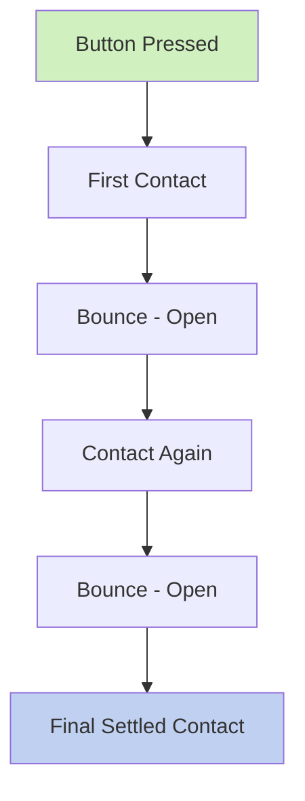
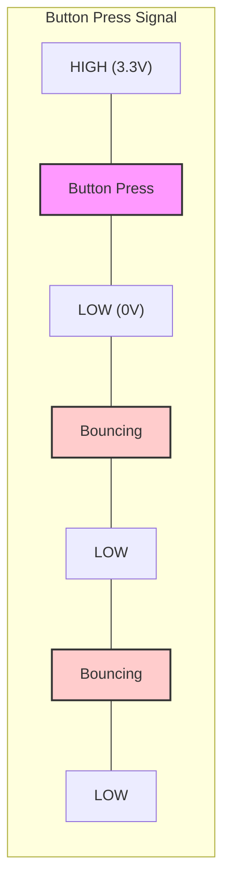
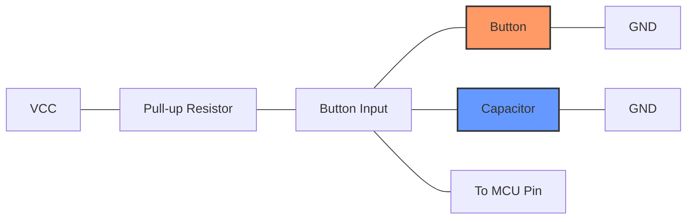

# STM32 Debouncing

## Introduction

When working with physical buttons or switches in embedded systems, you'll encounter a phenomenon called "bouncing." This occurs when a mechanical switch is pressed or released, causing the electrical contacts to rapidly oscillate between open and closed states before settling. These oscillations can lead to multiple false detections of a single button press, creating unpredictable behavior in your application.

Debouncing is the technique used to filter out these unwanted oscillations and ensure a clean, single signal from button presses. In this tutorial, we'll explore how to implement debouncing on STM32 microcontrollers, a critical skill for building reliable embedded applications.

## Understanding Switch Bouncing

Before diving into the solution, let's understand the problem in more detail.

### What is Switch Bouncing?

When you press a mechanical button or switch, the physical contacts don't make a perfect connection instantly. Instead, they bounce against each other, creating multiple make-and-break connections within a short time period (typically 5-20ms).



To a human, this happens too quickly to notice. But to a microcontroller running at MHz speeds, these bounces appear as multiple button presses, causing unexpected behavior in your program.

### Visualizing the Problem

Here's what the electrical signal might look like when a button is pressed:



## Debouncing Methods for STM32 Microcontrollers

There are several methods to address switch bouncing in STM32 applications:

1. **Software Delay**: The simplest approach
2. **Software Counters**: More efficient than delays
3. **Hardware Debouncing**: Using RC circuits or dedicated ICs
4. **Interrupt-Based Debouncing**: Efficient use of MCU resources

Let's explore each method with practical code examples.

## 1. Software Delay Method

This is the simplest approach where we wait for the bouncing to settle after detecting a button press.

```c
/* Button pressed detection with basic delay debouncing */
if (HAL_GPIO_ReadPin(BUTTON_GPIO_Port, BUTTON_Pin) == GPIO_PIN_RESET) {  // Button pressed (assuming active low)
    HAL_Delay(50);  // Wait for bouncing to stop (50ms)
    
    // Check if button is still pressed
    if (HAL_GPIO_ReadPin(BUTTON_GPIO_Port, BUTTON_Pin) == GPIO_PIN_RESET) {
        // Handle button press event
        buttonPressCount++;
        // Additional button handling code
    }
}
```

**Pros**:
- Very simple to implement
- Works reliably for most applications

**Cons**:
- Blocks the CPU during delay
- Not suitable for time-critical applications
- Wastes processing cycles

## 2. Software Counter Method

This method uses a counter that needs to reach a certain threshold before considering a button press valid.

```c
#define DEBOUNCE_THRESHOLD 5

uint8_t debounceCounter = 0;
GPIO_PinState buttonState;
GPIO_PinState lastButtonState = GPIO_PIN_SET;  // Assuming active low button

void checkButton(void) {
    // Read current button state
    buttonState = HAL_GPIO_ReadPin(BUTTON_GPIO_Port, BUTTON_Pin);
    
    // Check if button state changed
    if (buttonState != lastButtonState) {
        // Increment debounce counter
        debounceCounter++;
        
        // If counter reaches threshold, accept the change
        if (debounceCounter >= DEBOUNCE_THRESHOLD) {
            // Update last known state
            lastButtonState = buttonState;
            
            // Process the button press (when button is pressed - active low)
            if (buttonState == GPIO_PIN_RESET) {
                // Handle button press event
                buttonPressCount++;
            }
            
            // Reset counter
            debounceCounter = 0;
        }
    } else {
        // Reset counter if no change detected
        debounceCounter = 0;
    }
}
```

This function would typically be called from a timer interrupt that occurs every few milliseconds.

## 3. Timer-Based Method

This is one of the most efficient methods for STM32 microcontrollers, leveraging the hardware timers.

```c
/* Global variables */
volatile uint8_t buttonPressed = 0;
GPIO_PinState lastButtonState = GPIO_PIN_SET;  // Assuming active low button

/* Function to be called periodically by a timer interrupt (e.g., every 10ms) */
void checkButtonDebounce(void) {
    GPIO_PinState currentState = HAL_GPIO_ReadPin(BUTTON_GPIO_Port, BUTTON_Pin);
    
    // If state changed
    if (currentState != lastButtonState) {
        // Update state
        lastButtonState = currentState;
        
        // If button is pressed (active low)
        if (currentState == GPIO_PIN_RESET) {
            buttonPressed = 1;
        }
    }
}

/* In main or another function */
void processButton(void) {
    // Check if button was pressed
    if (buttonPressed) {
        // Reset flag
        buttonPressed = 0;
        
        // Handle button press
        buttonPressCount++;
        // Other button handling code
    }
}
```

To set up the timer interrupt:

```c
/* Timer initialization (place in main or initialization function) */
void setupDebounceTimer(void) {
    // Enable TIM3 clock
    __HAL_RCC_TIM3_CLK_ENABLE();
    
    // Configure timer for 10ms interval
    htim3.Instance = TIM3;
    htim3.Init.Prescaler = 7999;  // For 8MHz clock, this gives 1kHz
    htim3.Init.CounterMode = TIM_COUNTERMODE_UP;
    htim3.Init.Period = 10;  // 10ms interrupt
    
    HAL_TIM_Base_Init(&htim3);
    HAL_TIM_Base_Start_IT(&htim3);
    
    // Enable TIM3 interrupt
    HAL_NVIC_SetPriority(TIM3_IRQn, 0, 0);
    HAL_NVIC_EnableIRQ(TIM3_IRQn);
}

/* Timer interrupt handler */
void TIM3_IRQHandler(void) {
    HAL_TIM_IRQHandler(&htim3);
    checkButtonDebounce();
}
```

## 4. Interrupt-Based Method with Timestamp

This approach uses external interrupts with timestamp comparison to efficiently debounce buttons:

```c
/* Global variables */
volatile uint32_t lastDebounceTime = 0;
volatile uint8_t buttonState = 0;
#define DEBOUNCE_DELAY_MS 50

/* Configure External Interrupt */
void configureButtonInterrupt(void) {
    GPIO_InitTypeDef GPIO_InitStruct = {0};
    
    // Enable GPIO clock
    __HAL_RCC_GPIOA_CLK_ENABLE();
    
    // Configure button pin as input with pull-up
    GPIO_InitStruct.Pin = BUTTON_Pin;
    GPIO_InitStruct.Mode = GPIO_MODE_IT_FALLING;  // Trigger on falling edge (press)
    GPIO_InitStruct.Pull = GPIO_PULLUP;
    HAL_GPIO_Init(BUTTON_GPIO_Port, &GPIO_InitStruct);
    
    // Enable EXTI interrupt
    HAL_NVIC_SetPriority(EXTI0_IRQn, 0, 0);  // Assuming button on pin 0
    HAL_NVIC_EnableIRQ(EXTI0_IRQn);
}

/* External Interrupt Handler */
void EXTI0_IRQHandler(void) {
    HAL_GPIO_EXTI_IRQHandler(BUTTON_Pin);
}

/* EXTI Callback (This is called from HAL_GPIO_EXTI_IRQHandler) */
void HAL_GPIO_EXTI_Callback(uint16_t GPIO_Pin) {
    if (GPIO_Pin == BUTTON_Pin) {
        uint32_t currentTime = HAL_GetTick();
        
        // Check if enough time has passed since last interrupt
        if ((currentTime - lastDebounceTime) > DEBOUNCE_DELAY_MS) {
            buttonState = 1;
            lastDebounceTime = currentTime;
        }
    }
}

/* In main function */
void processButtonEvents(void) {
    if (buttonState) {
        buttonState = 0;
        // Handle button press
        buttonPressCount++;
        // Other button handling code
    }
}
```

## Complete Example: LED Toggle with Debouncing

Here's a complete example that toggles an LED each time a debounced button is pressed:

```c
/* Includes */
#include "main.h"

/* Private variables */
GPIO_InitTypeDef GPIO_InitStruct = {0};
TIM_HandleTypeDef htim3;
volatile uint8_t buttonPressed = 0;
GPIO_PinState lastButtonState = GPIO_PIN_SET;

/* Function prototypes */
void SystemClock_Config(void);
void GPIO_Init(void);
void TIM3_Init(void);
void checkButtonDebounce(void);

int main(void) {
    /* MCU Configuration */
    HAL_Init();
    SystemClock_Config();
    
    /* Initialize peripherals */
    GPIO_Init();
    TIM3_Init();
    
    /* Infinite loop */
    while (1) {
        /* Check if button was pressed */
        if (buttonPressed) {
            buttonPressed = 0;
            
            /* Toggle LED */
            HAL_GPIO_TogglePin(LD2_GPIO_Port, LD2_Pin);
        }
    }
}

/* GPIO Initialization Function */
void GPIO_Init(void) {
    /* GPIO Ports Clock Enable */
    __HAL_RCC_GPIOC_CLK_ENABLE();
    __HAL_RCC_GPIOA_CLK_ENABLE();
    
    /* Configure LED pin as output */
    GPIO_InitStruct.Pin = LD2_Pin;
    GPIO_InitStruct.Mode = GPIO_MODE_OUTPUT_PP;
    GPIO_InitStruct.Pull = GPIO_NOPULL;
    GPIO_InitStruct.Speed = GPIO_SPEED_FREQ_LOW;
    HAL_GPIO_Init(LD2_GPIO_Port, &GPIO_InitStruct);
    
    /* Configure Button pin as input with pull-up */
    GPIO_InitStruct.Pin = B1_Pin;
    GPIO_InitStruct.Mode = GPIO_MODE_INPUT;
    GPIO_InitStruct.Pull = GPIO_PULLUP;
    HAL_GPIO_Init(B1_GPIO_Port, &GPIO_InitStruct);
}

/* TIM3 Initialization Function */
void TIM3_Init(void) {
    /* Enable TIM3 clock */
    __HAL_RCC_TIM3_CLK_ENABLE();
    
    /* Configure timer for 10ms interval */
    htim3.Instance = TIM3;
    htim3.Init.Prescaler = 7999;  // For 8MHz clock, this gives 1kHz
    htim3.Init.CounterMode = TIM_COUNTERMODE_UP;
    htim3.Init.Period = 10;  // 10ms interrupt
    
    HAL_TIM_Base_Init(&htim3);
    HAL_TIM_Base_Start_IT(&htim3);
    
    /* Enable TIM3 interrupt */
    HAL_NVIC_SetPriority(TIM3_IRQn, 0, 0);
    HAL_NVIC_EnableIRQ(TIM3_IRQn);
}

/* Button Debounce Check Function (called from TIM3 interrupt) */
void checkButtonDebounce(void) {
    GPIO_PinState currentState = HAL_GPIO_ReadPin(B1_GPIO_Port, B1_Pin);
    
    /* If state changed */
    if (currentState != lastButtonState) {
        /* Update state */
        lastButtonState = currentState;
        
        /* If button is pressed (active low) */
        if (currentState == GPIO_PIN_RESET) {
            buttonPressed = 1;
        }
    }
}

/* TIM3 interrupt handler */
void TIM3_IRQHandler(void) {
    HAL_TIM_IRQHandler(&htim3);
    checkButtonDebounce();
}
```

This example assumes:
- An STM32 Nucleo board with an LED on PA5 (LD2)
- User button on PC13 (B1), active low
- System clock at 8MHz

## Hardware Debouncing

While software debouncing works well, hardware debouncing can offload the processing from the MCU. A simple RC filter can effectively debounce a button:



Components:
- Pull-up resistor: 10kΩ
- Capacitor: 100nF

The resistor and capacitor form a low-pass filter that smooths out the rapid voltage changes during button bouncing.

## Best Practices for STM32 Debouncing

1. **Choose the Right Debounce Time**: Typically 20-50ms works well for most mechanical switches.

2. **Use Hardware Timer Interrupts**: They provide consistent timing without blocking the CPU.

3. **Consider Power Consumption**: For low-power applications, use external interrupts to wake from sleep states.

4. **Test Thoroughly**: Different switches have different bouncing characteristics.

5. **Combine Methods**: For critical applications, consider combining hardware and software debouncing.

## Common Debouncing Mistakes

- **Too Short Debounce Time**: If your debounce delay is too short, some bounces may still get through.

- **Blocking Delays**: Using `HAL_Delay()` for debouncing can block critical code execution.

- **Ignoring Button Release**: Remember to debounce both press and release events if your application requires it.

- **Complex Logic in ISRs**: Keep interrupt service routines short and simple.

## Summary

Debouncing is an essential technique when working with physical switches and buttons in STM32 microcontrollers. In this tutorial, we've explored several debouncing methods:

- Software delay-based debouncing
- Counter-based debouncing
- Timer interrupt-based debouncing
- Interrupt with timestamp debouncing
- Simple hardware debouncing

Each method has its advantages and is suitable for different applications. For most projects, the timer-based approach offers the best balance of simplicity, efficiency, and reliability.

## Exercises

1. Modify the timer-based example to also detect and debounce button release events.

2. Implement a state machine that tracks multiple button states (idle, pressed, held, released).

3. Create a button library that supports multiple buttons with debouncing.

4. Compare the CPU usage of different debouncing methods using the debug features of your IDE.

5. Implement a hardware debouncing circuit and compare its performance to software debouncing.

## Additional Resources

- STM32 HAL User Manual for details on GPIO and Timer functions
- STM32CubeIDE resources for timer configuration
- STM32 Application Notes (especially those related to human interface design)

Remember that reliable button handling is fundamental to creating responsive and robust embedded systems. The techniques learned here will serve you well in almost all microcontroller projects that involve human interaction.