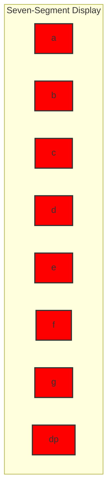

# STM32 Seven Segment Displays

## Introduction

Seven-segment displays are one of the simplest and most widely used output devices in embedded systems. They provide a convenient way to display numeric data (0-9) and some basic alphanumeric characters (A-F). In this tutorial, we'll learn how to interface seven-segment displays with STM32 microcontrollers using digital I/O pins, enabling you to add simple visual feedback to your embedded projects.

## What is a Seven-Segment Display?

A seven-segment display consists of seven LED segments arranged in the shape of the number "8". Each segment is labeled with a letter from 'a' to 'g', and there's often an additional decimal point segment labeled 'dp'. By turning specific segments on or off, we can display different characters.



## Types of Seven-Segment Displays

There are two main types of seven-segment displays:

### 1. Common Cathode (CC)

In a common cathode display, all cathodes of the LED segments are connected together. To light up a segment, you must apply a HIGH signal (logic 1) to its corresponding anode pin.

### 2. Common Anode (CA)

In a common anode display, all anodes of the LED segments are connected together. To light up a segment, you must apply a LOW signal (logic 0) to its corresponding cathode pin.

## Hardware Requirements

- STM32 development board (like STM32F4Discovery or Nucleo)
- Seven-segment display (common anode or common cathode)
- 8 current-limiting resistors (typically 220Ω to 330Ω)
- Breadboard and jumper wires
- USB cable for programming

## Circuit Connection

Let's connect a common anode seven-segment display to an STM32 microcontroller:

1. Connect the common anode pin(s) of the display to VCC (3.3V)
2. Connect each segment (a-g and dp) to a GPIO pin through a current-limiting resistor
3. Configure the GPIO pins as outputs

## STM32 Configuration

First, let's initialize the GPIO pins for the seven-segment display:

```c
#include "stm32f4xx_hal.h"

// Define GPIO pins for each segment
#define SEG_A_PIN  GPIO_PIN_0
#define SEG_B_PIN  GPIO_PIN_1
#define SEG_C_PIN  GPIO_PIN_2
#define SEG_D_PIN  GPIO_PIN_3
#define SEG_E_PIN  GPIO_PIN_4
#define SEG_F_PIN  GPIO_PIN_5
#define SEG_G_PIN  GPIO_PIN_6
#define SEG_DP_PIN GPIO_PIN_7

#define SEG_GPIO_PORT GPIOA

void SevenSegment_Init(void) {
  GPIO_InitTypeDef GPIO_InitStruct = {0};
  
  // Enable the GPIO clock
  __HAL_RCC_GPIOA_CLK_ENABLE();
  
  // Configure all pins as outputs
  GPIO_InitStruct.Pin = SEG_A_PIN | SEG_B_PIN | SEG_C_PIN | SEG_D_PIN |
                        SEG_E_PIN | SEG_F_PIN | SEG_G_PIN | SEG_DP_PIN;
  GPIO_InitStruct.Mode = GPIO_MODE_OUTPUT_PP;  // Push-pull output mode
  GPIO_InitStruct.Pull = GPIO_NOPULL;          // No pull-up or pull-down
  GPIO_InitStruct.Speed = GPIO_SPEED_FREQ_LOW; // Low speed is sufficient for LEDs
  
  HAL_GPIO_Init(SEG_GPIO_PORT, &GPIO_InitStruct);
  
  // Initially turn off all segments (for common anode, HIGH = OFF)
  HAL_GPIO_WritePin(SEG_GPIO_PORT, SEG_A_PIN | SEG_B_PIN | SEG_C_PIN | SEG_D_PIN |
                   SEG_E_PIN | SEG_F_PIN | SEG_G_PIN | SEG_DP_PIN, GPIO_PIN_SET);
}
```

## Displaying Digits

Next, let's create a function to display digits on the seven-segment display. We'll define segment patterns for digits 0-9 and hexadecimal characters A-F.

```c
// Segment patterns for Common Anode display (0 = ON, 1 = OFF)
// Segments: dp g f e d c b a
const uint8_t SEVEN_SEG_DIGITS_CA[16] = {
  0b11000000,  // 0
  0b11111001,  // 1
  0b10100100,  // 2
  0b10110000,  // 3
  0b10011001,  // 4
  0b10010010,  // 5
  0b10000010,  // 6
  0b11111000,  // 7
  0b10000000,  // 8
  0b10010000,  // 9
  0b10001000,  // A
  0b10000011,  // b
  0b11000110,  // C
  0b10100001,  // d
  0b10000110,  // E
  0b10001110   // F
};

// Segment patterns for Common Cathode display (1 = ON, 0 = OFF)
const uint8_t SEVEN_SEG_DIGITS_CC[16] = {
  0b00111111,  // 0
  0b00000110,  // 1
  0b01011011,  // 2
  0b01001111,  // 3
  0b01100110,  // 4
  0b01101101,  // 5
  0b01111101,  // 6
  0b00000111,  // 7
  0b01111111,  // 8
  0b01101111,  // 9
  0b01110111,  // A
  0b01111100,  // b
  0b00111001,  // C
  0b01011110,  // d
  0b01111001,  // E
  0b01110001   // F
};

void SevenSegment_DisplayDigit(uint8_t digit, bool commonAnode, bool decimalPoint) {
  uint8_t pattern;
  
  // Ensure digit is in valid range
  if (digit > 15) digit = 0;
  
  // Get the appropriate pattern based on display type
  if (commonAnode) {
    pattern = SEVEN_SEG_DIGITS_CA[digit];
    // For common anode: 0 = segment ON, 1 = segment OFF
    if (!decimalPoint) {
      pattern &= 0b01111111; // Turn on decimal point (set dp bit to 0)
    }
  } else {
    pattern = SEVEN_SEG_DIGITS_CC[digit];
    // For common cathode: 1 = segment ON, 0 = segment OFF
    if (decimalPoint) {
      pattern |= 0b10000000; // Turn on decimal point (set dp bit to 1)
    }
  }
  
  // Write the pattern to the GPIO pins
  HAL_GPIO_WritePin(SEG_GPIO_PORT, SEG_A_PIN, (pattern & 0x01) ? GPIO_PIN_SET : GPIO_PIN_RESET);
  HAL_GPIO_WritePin(SEG_GPIO_PORT, SEG_B_PIN, (pattern & 0x02) ? GPIO_PIN_SET : GPIO_PIN_RESET);
  HAL_GPIO_WritePin(SEG_GPIO_PORT, SEG_C_PIN, (pattern & 0x04) ? GPIO_PIN_SET : GPIO_PIN_RESET);
  HAL_GPIO_WritePin(SEG_GPIO_PORT, SEG_D_PIN, (pattern & 0x08) ? GPIO_PIN_SET : GPIO_PIN_RESET);
  HAL_GPIO_WritePin(SEG_GPIO_PORT, SEG_E_PIN, (pattern & 0x10) ? GPIO_PIN_SET : GPIO_PIN_RESET);
  HAL_GPIO_WritePin(SEG_GPIO_PORT, SEG_F_PIN, (pattern & 0x20) ? GPIO_PIN_SET : GPIO_PIN_RESET);
  HAL_GPIO_WritePin(SEG_GPIO_PORT, SEG_G_PIN, (pattern & 0x40) ? GPIO_PIN_SET : GPIO_PIN_RESET);
  HAL_GPIO_WritePin(SEG_GPIO_PORT, SEG_DP_PIN, (pattern & 0x80) ? GPIO_PIN_SET : GPIO_PIN_RESET);
}
```

## Multiple Seven-Segment Displays

For displaying larger numbers, we often need multiple seven-segment displays. There are two common approaches:

### 1. Direct Drive (Parallel)

With direct drive, each display has its own set of GPIO pins. This requires more I/O pins but is simpler to implement.

### 2. Multiplexing

With multiplexing, we can control multiple displays using fewer pins. The idea is to rapidly switch between displays, showing only one digit at a time, but doing it so quickly that the human eye perceives all displays as continuously lit.

Here's a simple implementation of multiplexing for a 4-digit display:

```c
#define DIGIT_1_PIN GPIO_PIN_8
#define DIGIT_2_PIN GPIO_PIN_9
#define DIGIT_3_PIN GPIO_PIN_10
#define DIGIT_4_PIN GPIO_PIN_11
#define DIGIT_GPIO_PORT GPIOB

// Initialize digit control pins
void SevenSegment_MultiDigit_Init(void) {
  GPIO_InitTypeDef GPIO_InitStruct = {0};
  
  // Enable the GPIO clock
  __HAL_RCC_GPIOB_CLK_ENABLE();
  
  // Call the single-digit init function for segment pins
  SevenSegment_Init();
  
  // Configure digit control pins as outputs
  GPIO_InitStruct.Pin = DIGIT_1_PIN | DIGIT_2_PIN | DIGIT_3_PIN | DIGIT_4_PIN;
  GPIO_InitStruct.Mode = GPIO_MODE_OUTPUT_PP;
  GPIO_InitStruct.Pull = GPIO_NOPULL;
  GPIO_InitStruct.Speed = GPIO_SPEED_FREQ_LOW;
  
  HAL_GPIO_Init(DIGIT_GPIO_PORT, &GPIO_InitStruct);
  
  // Initially turn off all digits (for common anode, LOW = OFF)
  HAL_GPIO_WritePin(DIGIT_GPIO_PORT, DIGIT_1_PIN | DIGIT_2_PIN | 
                   DIGIT_3_PIN | DIGIT_4_PIN, GPIO_PIN_RESET);
}

// Display a 4-digit number using multiplexing
void SevenSegment_DisplayNumber(uint16_t number, bool commonAnode) {
  uint8_t digit1 = number / 1000;
  uint8_t digit2 = (number / 100) % 10;
  uint8_t digit3 = (number / 10) % 10;
  uint8_t digit4 = number % 10;
  
  // Define refresh rate
  const uint32_t refreshDelay = 5; // ms
  
  // Display each digit in sequence
  // Digit 1 (leftmost)
  HAL_GPIO_WritePin(DIGIT_GPIO_PORT, DIGIT_1_PIN, commonAnode ? GPIO_PIN_SET : GPIO_PIN_RESET);
  SevenSegment_DisplayDigit(digit1, commonAnode, false);
  HAL_Delay(refreshDelay);
  HAL_GPIO_WritePin(DIGIT_GPIO_PORT, DIGIT_1_PIN, commonAnode ? GPIO_PIN_RESET : GPIO_PIN_SET);
  
  // Digit 2
  HAL_GPIO_WritePin(DIGIT_GPIO_PORT, DIGIT_2_PIN, commonAnode ? GPIO_PIN_SET : GPIO_PIN_RESET);
  SevenSegment_DisplayDigit(digit2, commonAnode, false);
  HAL_Delay(refreshDelay);
  HAL_GPIO_WritePin(DIGIT_GPIO_PORT, DIGIT_2_PIN, commonAnode ? GPIO_PIN_RESET : GPIO_PIN_SET);
  
  // Digit 3
  HAL_GPIO_WritePin(DIGIT_GPIO_PORT, DIGIT_3_PIN, commonAnode ? GPIO_PIN_SET : GPIO_PIN_RESET);
  SevenSegment_DisplayDigit(digit3, commonAnode, false);
  HAL_Delay(refreshDelay);
  HAL_GPIO_WritePin(DIGIT_GPIO_PORT, DIGIT_3_PIN, commonAnode ? GPIO_PIN_RESET : GPIO_PIN_SET);
  
  // Digit 4 (rightmost)
  HAL_GPIO_WritePin(DIGIT_GPIO_PORT, DIGIT_4_PIN, commonAnode ? GPIO_PIN_SET : GPIO_PIN_RESET);
  SevenSegment_DisplayDigit(digit4, commonAnode, false);
  HAL_Delay(refreshDelay);
  HAL_GPIO_WritePin(DIGIT_GPIO_PORT, DIGIT_4_PIN, commonAnode ? GPIO_PIN_RESET : GPIO_PIN_SET);
}
```

For continuous display, this function would be called repeatedly:

```c
void updateDisplay(uint16_t number, bool commonAnode) {
  // Call repeatedly, typically in the main loop
  while (1) {
    SevenSegment_DisplayNumber(number, commonAnode);
    // Other tasks can be performed here
  }
}
```

## Using Shift Registers

When controlling multiple seven-segment displays, we might run out of GPIO pins. A common solution is to use shift registers like the 74HC595, which allow you to control many outputs using just 3 GPIO pins:

1. Data pin
2. Clock pin
3. Latch pin

Here's a simplified example:

```c
#define SHIFT_DATA_PIN  GPIO_PIN_0
#define SHIFT_CLOCK_PIN GPIO_PIN_1
#define SHIFT_LATCH_PIN GPIO_PIN_2
#define SHIFT_GPIO_PORT GPIOC

void ShiftRegister_Init(void) {
  GPIO_InitTypeDef GPIO_InitStruct = {0};
  
  // Enable the GPIO clock
  __HAL_RCC_GPIOC_CLK_ENABLE();
  
  // Configure pins as outputs
  GPIO_InitStruct.Pin = SHIFT_DATA_PIN | SHIFT_CLOCK_PIN | SHIFT_LATCH_PIN;
  GPIO_InitStruct.Mode = GPIO_MODE_OUTPUT_PP;
  GPIO_InitStruct.Pull = GPIO_NOPULL;
  GPIO_InitStruct.Speed = GPIO_SPEED_FREQ_MEDIUM;
  
  HAL_GPIO_Init(SHIFT_GPIO_PORT, &GPIO_InitStruct);
  
  // Initialize pins to LOW
  HAL_GPIO_WritePin(SHIFT_GPIO_PORT, SHIFT_DATA_PIN | SHIFT_CLOCK_PIN | SHIFT_LATCH_PIN, GPIO_PIN_RESET);
}

void ShiftRegister_Write(uint8_t data) {
  // Pull latch LOW to start data transfer
  HAL_GPIO_WritePin(SHIFT_GPIO_PORT, SHIFT_LATCH_PIN, GPIO_PIN_RESET);
  
  // Shift out 8 bits, MSB first
  for (int i = 7; i >= 0; i--) {
    // Set data bit
    HAL_GPIO_WritePin(SHIFT_GPIO_PORT, SHIFT_DATA_PIN, (data & (1 << i)) ? GPIO_PIN_SET : GPIO_PIN_RESET);
    
    // Pulse clock to shift bit into register
    HAL_GPIO_WritePin(SHIFT_GPIO_PORT, SHIFT_CLOCK_PIN, GPIO_PIN_SET);
    HAL_GPIO_WritePin(SHIFT_GPIO_PORT, SHIFT_CLOCK_PIN, GPIO_PIN_RESET);
  }
  
  // Pull latch HIGH to update outputs
  HAL_GPIO_WritePin(SHIFT_GPIO_PORT, SHIFT_LATCH_PIN, GPIO_PIN_SET);
}

// Display a digit using shift register
void SevenSegment_ShiftRegister_DisplayDigit(uint8_t digit, bool commonAnode) {
  uint8_t pattern;
  
  // Get the appropriate pattern
  if (commonAnode) {
    pattern = SEVEN_SEG_DIGITS_CA[digit];
  } else {
    pattern = SEVEN_SEG_DIGITS_CC[digit];
  }
  
  // Send the pattern to the shift register
  ShiftRegister_Write(pattern);
}
```

## Complete Example: Digital Clock

Let's build a simple digital clock using a 4-digit seven-segment display:

```c
#include "stm32f4xx_hal.h"

// ... Include all the functions defined earlier ...

// Global variables for timekeeping
uint8_t hours = 12;
uint8_t minutes = 0;
uint8_t seconds = 0;

void Clock_Init(void) {
  // Initialize the display
  SevenSegment_MultiDigit_Init();
  
  // Configure a timer for 1-second interrupts
  // This is simplified - you would need to properly configure a timer
  // using Timer initialization code
}

// Timer interrupt handler (called every second)
void HAL_TIM_PeriodElapsedCallback(TIM_HandleTypeDef *htim) {
  // Update time
  seconds++;
  if (seconds >= 60) {
    seconds = 0;
    minutes++;
    if (minutes >= 60) {
      minutes = 0;
      hours++;
      if (hours >= 24) {
        hours = 0;
      }
    }
  }
}

void Clock_DisplayTime(bool commonAnode) {
  // Format: HH:MM (with colon in the middle)
  uint8_t digit1 = hours / 10;
  uint8_t digit2 = hours % 10;
  uint8_t digit3 = minutes / 10;
  uint8_t digit4 = minutes % 10;
  
  const uint32_t refreshDelay = 5; // ms
  
  // Display each digit with a blinking colon (using decimal point on digit 2)
  // Digit 1 (tens of hours)
  HAL_GPIO_WritePin(DIGIT_GPIO_PORT, DIGIT_1_PIN, commonAnode ? GPIO_PIN_SET : GPIO_PIN_RESET);
  SevenSegment_DisplayDigit(digit1, commonAnode, false);
  HAL_Delay(refreshDelay);
  HAL_GPIO_WritePin(DIGIT_GPIO_PORT, DIGIT_1_PIN, commonAnode ? GPIO_PIN_RESET : GPIO_PIN_SET);
  
  // Digit 2 (hours with colon/decimal point)
  HAL_GPIO_WritePin(DIGIT_GPIO_PORT, DIGIT_2_PIN, commonAnode ? GPIO_PIN_SET : GPIO_PIN_RESET);
  // Blink the decimal point every second as a colon
  SevenSegment_DisplayDigit(digit2, commonAnode, (seconds % 2 == 0));
  HAL_Delay(refreshDelay);
  HAL_GPIO_WritePin(DIGIT_GPIO_PORT, DIGIT_2_PIN, commonAnode ? GPIO_PIN_RESET : GPIO_PIN_SET);
  
  // Digit 3 (tens of minutes)
  HAL_GPIO_WritePin(DIGIT_GPIO_PORT, DIGIT_3_PIN, commonAnode ? GPIO_PIN_SET : GPIO_PIN_RESET);
  SevenSegment_DisplayDigit(digit3, commonAnode, false);
  HAL_Delay(refreshDelay);
  HAL_GPIO_WritePin(DIGIT_GPIO_PORT, DIGIT_3_PIN, commonAnode ? GPIO_PIN_RESET : GPIO_PIN_SET);
  
  // Digit 4 (minutes)
  HAL_GPIO_WritePin(DIGIT_GPIO_PORT, DIGIT_4_PIN, commonAnode ? GPIO_PIN_SET : GPIO_PIN_RESET);
  SevenSegment_DisplayDigit(digit4, commonAnode, false);
  HAL_Delay(refreshDelay);
  HAL_GPIO_WritePin(DIGIT_GPIO_PORT, DIGIT_4_PIN, commonAnode ? GPIO_PIN_RESET : GPIO_PIN_SET);
}

int main(void) {
  // Initialize HAL
  HAL_Init();
  
  // Configure system clock
  SystemClock_Config();
  
  // Initialize clock
  Clock_Init();
  
  // Main loop
  while (1) {
    // Display the time (update display)
    Clock_DisplayTime(true); // Assuming common anode display
  }
}
```

## Practical Considerations

### 1. Current Limiting

Always use current-limiting resistors with seven-segment displays to protect both the LEDs and your microcontroller. Typical values range from 220Ω to 330Ω.

### 2. Power Consumption

When multiplexing, be aware that rapidly switching segments on and off can lead to higher power consumption. You may need to adjust the duty cycle or refresh rate.

### 3. Brightness Control

You can implement brightness control using PWM (Pulse Width Modulation) on the common pin or using different resistor values.

### 4. Debouncing

If you're using buttons to control the display (e.g., setting time), implement proper debouncing to avoid erratic behavior.

## Troubleshooting

### Common Issues:

1. **Segments not lighting up**:
   - Check connections and resistor values
   - Verify GPIO configuration
   - Ensure you're using the correct pattern (common anode vs. common cathode)

2. **Dim display**:
   - Resistor values might be too high
   - Check power supply voltage
   - For multiplexed displays, increase the duty cycle

3. **Flickering display**:
   - Increase the refresh rate
   - Check for loose connections
   - Ensure timer interrupts aren't being delayed

## Summary

In this tutorial, we've learned how to interface seven-segment displays with STM32 microcontrollers. We covered:

- Basic seven-segment display concepts (common anode vs. common cathode)
- Direct driving a single seven-segment display
- Multiplexing multiple displays
- Using shift registers to reduce pin count
- Building a practical digital clock application

Seven-segment displays are versatile and straightforward components for displaying numeric information in embedded systems. Despite their simplicity, they remain relevant in many applications where a simple numeric display is sufficient.

## Exercises

1. Modify the clock example to display hours and minutes in 12-hour format with AM/PM indication.
2. Implement a countdown timer that beeps when it reaches zero.
3. Create a reaction time game that displays the time in milliseconds between a stimulus (LED turning on) and a button press.
4. Add temperature display functionality using a temperature sensor, alternating between showing time and temperature.
5. Implement brightness control using PWM on the common pins.

## Additional Resources

- STM32 HAL documentation for GPIO configuration
- STM32CubeIDE or STM32CubeMX for graphical configuration
- Application notes on driving LEDs with STM32 microcontrollers
- 74HC595 shift register datasheet for more advanced applications