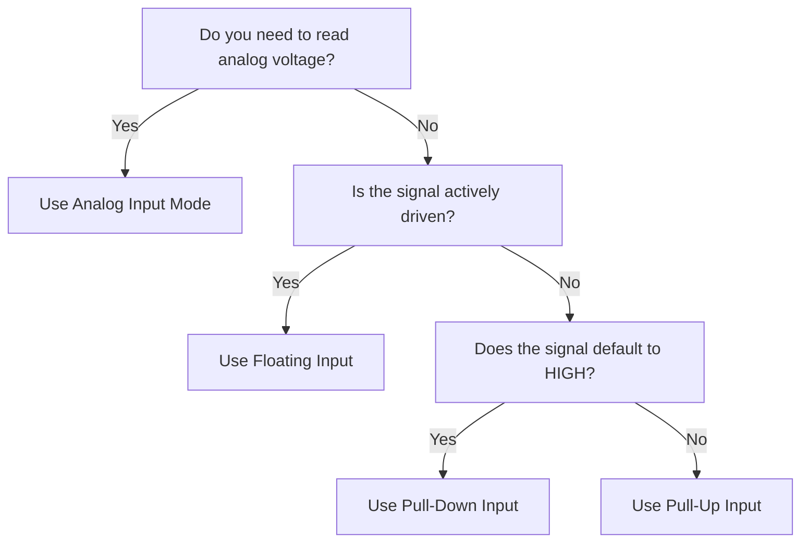

# STM32 Input Modes

## Introduction

When working with STM32 microcontrollers, understanding how to properly configure GPIO pins as inputs is crucial for creating reliable embedded applications. Unlike simple microcontrollers, STM32 devices offer several input configuration options that provide flexibility and functionality for different use cases.

In this tutorial, we'll explore the various input modes available on STM32 microcontrollers, how to configure them, and when to use each mode. Whether you're connecting buttons, sensors, or communication interfaces, selecting the appropriate input mode is essential for proper circuit operation.

## Input Mode Fundamentals

STM32 microcontrollers allow pins to be configured in four primary input modes:

1. **Floating input** - No internal resistors connected
2. **Pull-up input** - Internal pull-up resistor enabled
3. **Pull-down input** - Internal pull-down resistor enabled 
4. **Analog input** - For connecting to ADC channels

Let's look at each of these configurations in detail.

## GPIO Input Configuration Structure

Before diving into specific modes, it's important to understand the GPIO configuration structure in STM32. The configuration involves setting multiple fields in the `GPIO_InitTypeDef` structure:

```c
GPIO_InitTypeDef GPIO_InitStruct = {0};

// Common fields for all input configurations
GPIO_InitStruct.Pin = GPIO_PIN_0;        // Select which pin to configure
GPIO_InitStruct.Mode = GPIO_MODE_INPUT;  // Set as input (will be modified based on mode)
GPIO_InitStruct.Speed = GPIO_SPEED_FREQ_LOW;  // Speed setting (not critical for inputs)
```

## Floating Input Mode

Floating input mode is the most basic configuration where the pin is set as an input without any internal pull-up or pull-down resistors.

### When to Use Floating Inputs

Floating inputs are appropriate when:
- The external circuit provides its own pull-up or pull-down resistor
- Connecting to devices that actively drive the signal high or low (like other digital outputs)
- Reading the state of a tri-state bus

### How to Configure Floating Inputs

```c
GPIO_InitTypeDef GPIO_InitStruct = {0};

// Configure pin as floating input
GPIO_InitStruct.Pin = GPIO_PIN_0;
GPIO_InitStruct.Mode = GPIO_MODE_INPUT;
GPIO_InitStruct.Pull = GPIO_NOPULL;  // No internal pull-up or pull-down

HAL_GPIO_Init(GPIOA, &GPIO_InitStruct);
```

### Caution with Floating Inputs

Never leave an input "truly floating" (without any pull-up or pull-down) if you're reading its value. A floating input can randomly change states due to electrical noise and capacitive coupling, causing unpredictable behavior in your application.

## Pull-Up Input Mode

In pull-up mode, an internal resistor (typically 40kΩ) connects the pin to VDD (3.3V), pulling the signal high when nothing is connected.

### When to Use Pull-Up Inputs

Pull-up inputs are ideal for:
- Connecting buttons or switches that ground the pin when activated
- I2C communication lines
- Any input that should default to a HIGH state

### How to Configure Pull-Up Inputs

```c
GPIO_InitTypeDef GPIO_InitStruct = {0};

// Configure pin with internal pull-up
GPIO_InitStruct.Pin = GPIO_PIN_0;
GPIO_InitStruct.Mode = GPIO_MODE_INPUT;
GPIO_InitStruct.Pull = GPIO_PULLUP;  // Enable internal pull-up resistor

HAL_GPIO_Init(GPIOA, &GPIO_InitStruct);
```

### Reading a Pull-Up Input

When using a pull-up configuration with a button:
- The pin reads HIGH (1) when the button is NOT pressed
- The pin reads LOW (0) when the button is pressed (connecting to ground)

```c
// Read the state of a button connected to PA0 with pull-up
uint8_t buttonState = HAL_GPIO_ReadPin(GPIOA, GPIO_PIN_0);

if (buttonState == GPIO_PIN_RESET) {  // Button is pressed (connected to GND)
    // Execute button press actions
}
```

## Pull-Down Input Mode

Pull-down mode uses an internal resistor (typically 40kΩ) to connect the pin to ground, ensuring the signal stays low when nothing is connected.

### When to Use Pull-Down Inputs

Pull-down inputs are useful for:
- Connecting buttons or switches that connect to VDD when activated
- Sensing when a device is powered on (active high signals)
- Any input that should default to a LOW state

### How to Configure Pull-Down Inputs

```c
GPIO_InitTypeDef GPIO_InitStruct = {0};

// Configure pin with internal pull-down
GPIO_InitStruct.Pin = GPIO_PIN_0;
GPIO_InitStruct.Mode = GPIO_MODE_INPUT;
GPIO_InitStruct.Pull = GPIO_PULLDOWN;  // Enable internal pull-down resistor

HAL_GPIO_Init(GPIOA, &GPIO_InitStruct);
```

### Reading a Pull-Down Input

When using a pull-down configuration with a button:
- The pin reads LOW (0) when the button is NOT pressed
- The pin reads HIGH (1) when the button is pressed (connecting to VDD)

```c
// Read the state of a button connected to PA0 with pull-down
uint8_t buttonState = HAL_GPIO_ReadPin(GPIOA, GPIO_PIN_0);

if (buttonState == GPIO_PIN_SET) {  // Button is pressed (connected to VDD)
    // Execute button press actions
}
```

## Analog Input Mode

Analog input mode disconnects the pin from the digital input buffer and prepares it for use with the Analog-to-Digital Converter (ADC).

### When to Use Analog Inputs

Analog input mode is necessary when:
- Reading analog voltage levels from sensors (temperature, light, etc.)
- Reading potentiometer positions
- Capturing analog signals from external sources

### How to Configure Analog Inputs

```c
GPIO_InitTypeDef GPIO_InitStruct = {0};

// Configure pin as analog input
GPIO_InitStruct.Pin = GPIO_PIN_0;
GPIO_InitStruct.Mode = GPIO_MODE_ANALOG;
GPIO_InitStruct.Pull = GPIO_NOPULL;  // Usually no pull resistors for analog inputs

HAL_GPIO_Init(GPIOA, &GPIO_InitStruct);

// Additional ADC configuration would be required
```

Note that configuring a pin as an analog input is just the first step. You'll also need to set up the ADC to actually read the analog value.

## Special Input Modes

STM32 also offers special input configurations for triggering interrupts:

### Interrupt-Triggered Inputs

You can configure pins to trigger interrupts on different events:
- Rising edge (LOW to HIGH transition)
- Falling edge (HIGH to LOW transition)
- Both edges (any transition)

```c
GPIO_InitTypeDef GPIO_InitStruct = {0};

// Configure pin for interrupt on rising edge
GPIO_InitStruct.Pin = GPIO_PIN_0;
GPIO_InitStruct.Mode = GPIO_MODE_IT_RISING;  // Interrupt on rising edge
GPIO_InitStruct.Pull = GPIO_PULLDOWN;  // Using pull-down with rising edge detection

HAL_GPIO_Init(GPIOA, &GPIO_InitStruct);

// Don't forget to enable the interrupt in NVIC
HAL_NVIC_SetPriority(EXTI0_IRQn, 0, 0);
HAL_NVIC_EnableIRQ(EXTI0_IRQn);
```

## Input Mode Selection Diagram

The following diagram helps visualize when to use each input mode:



## Practical Examples

### Example 1: Button Interface with Debouncing

This example shows how to configure a button with a pull-up resistor and implement simple debouncing:

```c
// Button connected to PA0 with pull-up (button connects to GND when pressed)

void configureButtonInput(void) {
    GPIO_InitTypeDef GPIO_InitStruct = {0};
    
    // Enable GPIOA clock
    __HAL_RCC_GPIOA_CLK_ENABLE();
    
    // Configure PA0 as input with pull-up
    GPIO_InitStruct.Pin = GPIO_PIN_0;
    GPIO_InitStruct.Mode = GPIO_MODE_INPUT;
    GPIO_InitStruct.Pull = GPIO_PULLUP;
    HAL_GPIO_Init(GPIOA, &GPIO_InitStruct);
}

// Read button with debouncing
uint8_t readButtonDebounced(void) {
    static uint32_t lastDebounceTime = 0;
    static uint8_t lastButtonState = GPIO_PIN_SET;  // Not pressed initially
    static uint8_t buttonState = GPIO_PIN_SET;      // Not pressed initially
    const uint32_t debounceDelay = 50;  // 50ms debounce time
    
    // Read the current pin state
    uint8_t reading = HAL_GPIO_ReadPin(GPIOA, GPIO_PIN_0);
    
    // Check if the state changed
    if (reading != lastButtonState) {
        // Reset the debounce timer
        lastDebounceTime = HAL_GetTick();
    }
    
    // If enough time has passed, update the actual button state
    if ((HAL_GetTick() - lastDebounceTime) > debounceDelay) {
        if (reading != buttonState) {
            buttonState = reading;
        }
    }
    
    // Update the last button state
    lastButtonState = reading;
    
    // Return the debounced state (GPIO_PIN_RESET when pressed)
    return buttonState;
}
```

### Example 2: Digital Sensor Interface

This example demonstrates interfacing with a digital sensor that provides its own driven output:

```c
// Digital sensor connected to PB5 (floating input)

void configureSensorInput(void) {
    GPIO_InitTypeDef GPIO_InitStruct = {0};
    
    // Enable GPIOB clock
    __HAL_RCC_GPIOB_CLK_ENABLE();
    
    // Configure PB5 as floating input
    GPIO_InitStruct.Pin = GPIO_PIN_5;
    GPIO_InitStruct.Mode = GPIO_MODE_INPUT;
    GPIO_InitStruct.Pull = GPIO_NOPULL;  // Floating input
    HAL_GPIO_Init(GPIOB, &GPIO_InitStruct);
}

// Read digital sensor
uint8_t readDigitalSensor(void) {
    return HAL_GPIO_ReadPin(GPIOB, GPIO_PIN_5);
}
```

### Example 3: Interrupt-Triggered Input for Motion Detection

This example shows how to configure a motion detector to trigger interrupts:

```c
// Motion detector connected to PC13, triggers HIGH when motion detected

void configureMotionDetector(void) {
    GPIO_InitTypeDef GPIO_InitStruct = {0};
    
    // Enable GPIOC clock
    __HAL_RCC_GPIOC_CLK_ENABLE();
    
    // Configure PC13 as interrupt on rising edge with pull-down
    GPIO_InitStruct.Pin = GPIO_PIN_13;
    GPIO_InitStruct.Mode = GPIO_MODE_IT_RISING;  // Interrupt on rising edge
    GPIO_InitStruct.Pull = GPIO_PULLDOWN;        // Pull-down (defaults to LOW)
    HAL_GPIO_Init(GPIOC, &GPIO_InitStruct);
    
    // Enable the EXTI interrupt for PC13
    HAL_NVIC_SetPriority(EXTI15_10_IRQn, 0, 0);
    HAL_NVIC_EnableIRQ(EXTI15_10_IRQn);
}

// Interrupt handler (in stm32fxxx_it.c)
void EXTI15_10_IRQHandler(void) {
    HAL_GPIO_EXTI_IRQHandler(GPIO_PIN_13);
}

// Callback function (must be implemented in your code)
void HAL_GPIO_EXTI_Callback(uint16_t GPIO_Pin) {
    if (GPIO_Pin == GPIO_PIN_13) {
        // Motion detected! Handle the event
        handleMotionDetected();
    }
}
```

## Best Practices for Input Configuration

1. **Never leave inputs truly floating** - Always use internal or external pull-up/down resistors if the input is not actively driven.

2. **Consider power consumption** - Using internal pull-up/down resistors will increase power consumption slightly. For ultra-low-power applications, consider external resistors with higher values.

3. **Match the input configuration to the signal source** - Use pull-up for active-low signals and pull-down for active-high signals.

4. **Debounce mechanical inputs** - Always implement debouncing for buttons and switches to prevent false triggers.

5. **Protect inputs from overvoltage** - Ensure input voltages don't exceed VDD (typically 3.3V) or go below GND.

6. **Configure unused pins properly** - Configure unused pins as outputs or inputs with pull-up/down to prevent floating conditions that can increase power consumption.

## Troubleshooting Input Configurations

| Problem | Possible Cause | Solution |
|---------|----------------|----------|
| Input reads random values | Floating input | Add pull-up or pull-down resistor |
| Button triggers multiple times | Mechanical bouncing | Implement debouncing in software |
| Input always reads HIGH/LOW | Incorrect pull resistor | Switch between pull-up and pull-down |
| Input doesn't trigger interrupt | Incorrect edge detection | Verify edge detection matches signal behavior |
| Input draws excessive current | Short circuit or incorrect configuration | Check wiring and configuration |

## Summary

Understanding STM32 input modes is essential for creating reliable embedded applications. The flexibility of the STM32 GPIO system allows you to configure pins for various input needs:

- **Floating inputs** for signals that are actively driven
- **Pull-up inputs** for switches/sensors that connect to ground
- **Pull-down inputs** for switches/sensors that connect to VDD
- **Analog inputs** for reading voltage levels
- **Interrupt-triggered inputs** for event-based processing

By selecting the appropriate input configuration for your application, you can ensure reliable operation while minimizing power consumption and preventing false readings.

## Exercises

1. Configure a pushbutton on PA0 using internal pull-up resistors and implement debouncing.
2. Create a circuit with three LEDs connected to output pins and three buttons using different input configurations (pull-up, pull-down, interrupt).
3. Design a simple light sensor circuit using an LDR (Light Dependent Resistor) and read its value using an analog input.
4. Implement a system that uses an interrupt-triggered input to wake the microcontroller from sleep mode when a button is pressed.
5. Create a digital input multiplexer that can read 8 inputs using only 4 GPIO pins.

## Further Reading

- STM32 Reference Manual for your specific device
- STM32 HAL GPIO API documentation
- Application notes on power consumption optimization
- Application notes on EMI/EMC design considerations for inputs