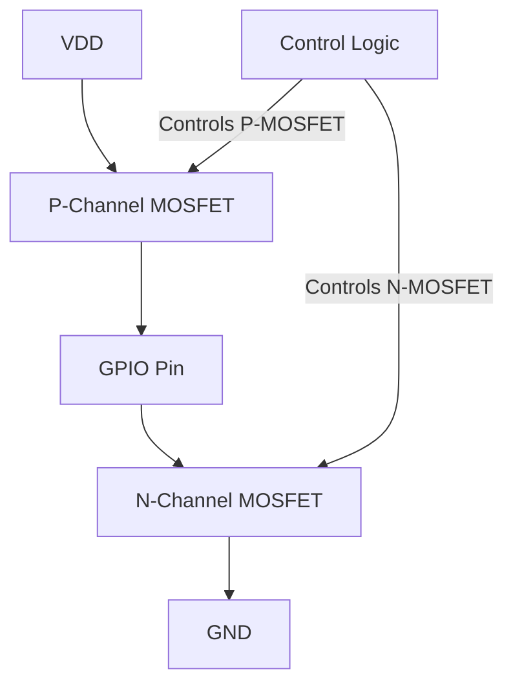
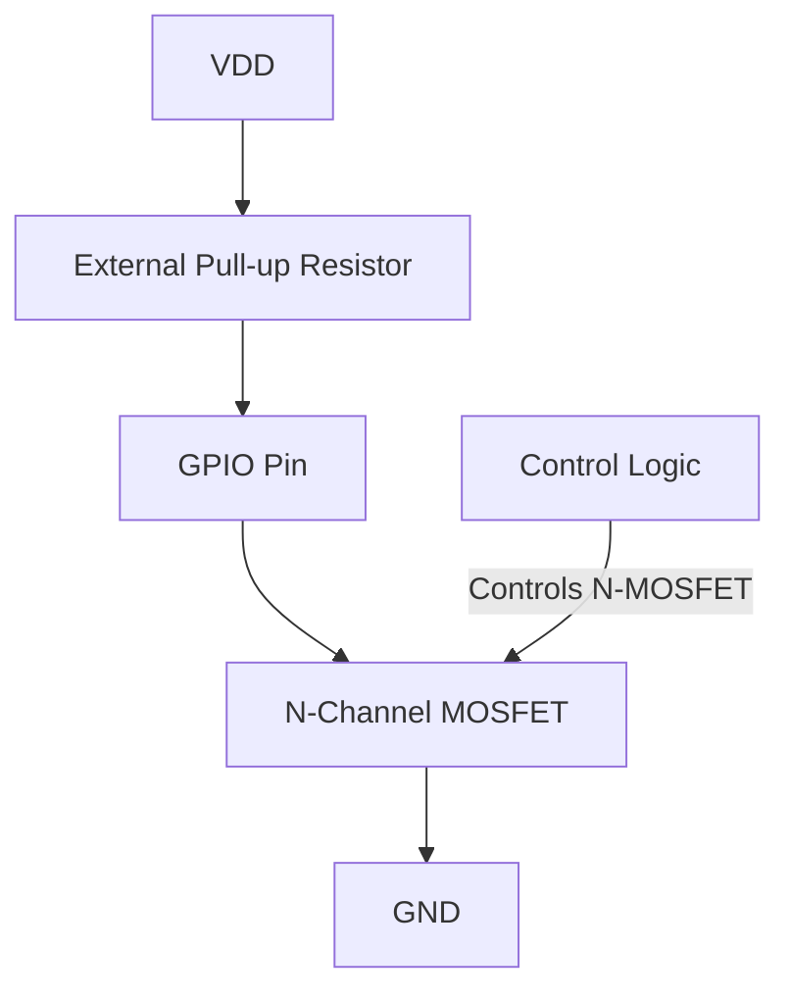

# STM32 Output Modes

## Introduction

When working with STM32 microcontrollers, understanding how to configure GPIO (General Purpose Input/Output) pins as outputs is essential for controlling external devices like LEDs, motors, displays, and communication interfaces. STM32 microcontrollers offer several output modes that provide flexibility for different applications.

In this article, we'll explore the various output configurations available in STM32 microcontrollers, how to set them up, and when to use each mode. This knowledge will help you design more efficient and robust embedded systems.

## GPIO Basics Review

Before diving into output modes, let's quickly review what GPIO pins are:

- GPIO pins are digital pins that can be configured as either inputs or outputs
- When configured as outputs, they can drive external components by providing voltage levels (typically 0V for LOW and 3.3V for HIGH)
- STM32 microcontrollers group GPIO pins into ports (PORTA, PORTB, etc.)
- Each pin has configurable modes, speeds, and additional features

## STM32 Output Mode Types

STM32 microcontrollers support four main output configurations:

1. Push-Pull Output
2. Open-Drain Output
3. Alternate Function Push-Pull
4. Alternate Function Open-Drain

Let's examine each of these modes in detail.

## Push-Pull Output Mode

Push-pull is the most common output configuration and the default mode when a pin is configured as an output.

### How Push-Pull Works

In push-pull mode:
- The output driver consists of two transistors in a "totem pole" arrangement
- When outputting HIGH, the upper (P-channel) transistor connects the pin to VDD
- When outputting LOW, the lower (N-channel) transistor connects the pin to GND
- Only one transistor is active at a time



### Characteristics of Push-Pull Mode

- Can actively drive the output both HIGH and LOW
- Provides low output impedance in both states
- Can source (provide) and sink (absorb) current
- Typically faster transitions between states
- Cannot be used for open-collector/open-drain protocols (like I2C)

### Configuring Push-Pull Output

Here's how to configure a pin as push-pull output using the STM32 HAL library:

```c
// Configure GPIO pin PA5 as push-pull output
GPIO_InitTypeDef GPIO_InitStruct = {0};

// Enable the GPIOA clock
__HAL_RCC_GPIOA_CLK_ENABLE();

// Configure the GPIO pin
GPIO_InitStruct.Pin = GPIO_PIN_5;           // Select pin 5
GPIO_InitStruct.Mode = GPIO_MODE_OUTPUT_PP; // Push-pull output mode
GPIO_InitStruct.Pull = GPIO_NOPULL;         // No pull-up or pull-down
GPIO_InitStruct.Speed = GPIO_SPEED_FREQ_LOW; // Low speed is sufficient for most cases

HAL_GPIO_Init(GPIOA, &GPIO_InitStruct);

// Set the pin high
HAL_GPIO_WritePin(GPIOA, GPIO_PIN_5, GPIO_PIN_SET);

// Set the pin low
HAL_GPIO_WritePin(GPIOA, GPIO_PIN_5, GPIO_PIN_RESET);
```

### When to Use Push-Pull Mode

Use push-pull mode when:
- Driving LEDs, transistors, or other devices that need active HIGH and LOW signals
- You need fast transitions between states
- You need to both source and sink current
- Working with devices that require a strong drive in both directions

## Open-Drain Output Mode

Open-drain is an alternative output configuration that offers different characteristics from push-pull.

### How Open-Drain Works

In open-drain mode:
- Only the lower (N-channel) transistor is controlled
- When outputting LOW, the transistor connects the pin to GND
- When outputting HIGH, the transistor is off (high impedance state)
- An external pull-up resistor is typically needed to pull the line HIGH



### Characteristics of Open-Drain Mode

- Can actively drive LOW but relies on pull-up resistor for HIGH
- High output impedance in the HIGH state
- Can only sink current, not source it
- Slower rise times due to RC time constant with pull-up resistor
- Allows multiple devices to share a common bus (wired-AND configuration)
- Required for certain communication protocols like I2C

### Configuring Open-Drain Output

Here's how to configure a pin as open-drain output:

```c
// Configure GPIO pin PB6 as open-drain output
GPIO_InitTypeDef GPIO_InitStruct = {0};

// Enable the GPIOB clock
__HAL_RCC_GPIOB_CLK_ENABLE();

// Configure the GPIO pin
GPIO_InitStruct.Pin = GPIO_PIN_6;            // Select pin 6
GPIO_InitStruct.Mode = GPIO_MODE_OUTPUT_OD;  // Open-drain output mode
GPIO_InitStruct.Pull = GPIO_NOPULL;          // External pull-up should be used
GPIO_InitStruct.Speed = GPIO_SPEED_FREQ_LOW; // Low speed configuration

HAL_GPIO_Init(GPIOB, &GPIO_InitStruct);

// Set the output high (transistor OFF - pin pulled high by external resistor)
HAL_GPIO_WritePin(GPIOB, GPIO_PIN_6, GPIO_PIN_SET);

// Set the output low (transistor ON - actively pulling to ground)
HAL_GPIO_WritePin(GPIOB, GPIO_PIN_6, GPIO_PIN_RESET);
```

### When to Use Open-Drain Mode

Use open-drain mode when:
- Implementing communication protocols that require it (I2C, 1-Wire, etc.)
- Creating a shared bus where multiple devices need to communicate
- Level shifting between different voltage domains (with appropriate pull-up)
- Implementing a wired-AND or wired-OR logic
- When the HIGH level voltage needs to be different from the microcontroller's VDD

## Alternate Function Modes

STM32 microcontrollers allow GPIO pins to be connected to internal peripheral functions. Each alternate function mode can be configured as either push-pull or open-drain.

### Alternate Function Push-Pull

In this mode, the pin is controlled by a peripheral (like UART, SPI, timer, etc.) rather than direct GPIO operations, but maintains push-pull characteristics.

### Alternate Function Open-Drain

Similar to above, but the peripheral controls the pin in open-drain mode. This is used for peripherals that require open-drain configuration, like I2C.

### Configuring Alternate Function

Here's an example configuring USART1 TX pin (PA9) as alternate function push-pull:

```c
// Configure PA9 as USART1 TX (Alternate Function Push-Pull)
GPIO_InitTypeDef GPIO_InitStruct = {0};

// Enable the GPIOA clock
__HAL_RCC_GPIOA_CLK_ENABLE();

// Configure the GPIO pin
GPIO_InitStruct.Pin = GPIO_PIN_9;
GPIO_InitStruct.Mode = GPIO_MODE_AF_PP;       // Alternate function push-pull
GPIO_InitStruct.Pull = GPIO_NOPULL;
GPIO_InitStruct.Speed = GPIO_SPEED_FREQ_HIGH; // High speed for communication
GPIO_InitStruct.Alternate = GPIO_AF7_USART1;  // Alternate function mapping for USART1

HAL_GPIO_Init(GPIOA, &GPIO_InitStruct);
```

Here's an example configuring I2C1 SDA pin (PB7) as alternate function open-drain:

```c
// Configure PB7 as I2C1 SDA (Alternate Function Open-Drain)
GPIO_InitTypeDef GPIO_InitStruct = {0};

// Enable the GPIOB clock
__HAL_RCC_GPIOB_CLK_ENABLE();

// Configure the GPIO pin
GPIO_InitStruct.Pin = GPIO_PIN_7;
GPIO_InitStruct.Mode = GPIO_MODE_AF_OD;      // Alternate function open-drain
GPIO_InitStruct.Pull = GPIO_NOPULL;          // External pull-up is used for I2C
GPIO_InitStruct.Speed = GPIO_SPEED_FREQ_HIGH; // High speed for communication
GPIO_InitStruct.Alternate = GPIO_AF4_I2C1;   // Alternate function mapping for I2C1

HAL_GPIO_Init(GPIOB, &GPIO_InitStruct);
```

## Output Speed Configuration

STM32 microcontrollers allow you to configure the slew rate (transition speed) of output pins. This helps manage electromagnetic interference (EMI) and power consumption.

Available speed settings generally include:
- Low speed
- Medium speed
- High speed
- Very high speed

```c
// Speed options (specific options vary by STM32 family)
GPIO_InitStruct.Speed = GPIO_SPEED_FREQ_LOW;    // Slow slew rate, less EMI
GPIO_InitStruct.Speed = GPIO_SPEED_FREQ_MEDIUM; // Medium slew rate
GPIO_InitStruct.Speed = GPIO_SPEED_FREQ_HIGH;   // Fast slew rate
GPIO_InitStruct.Speed = GPIO_SPEED_FREQ_VERY_HIGH; // Very fast slew rate, more EMI
```

Guidelines for selecting speed:
- Use slower speeds for general-purpose outputs like LEDs
- Use faster speeds for communication interfaces and timing-critical signals
- Higher speeds consume more power and generate more noise

## Practical Examples

### Example 1: LED Blinking with Push-Pull Output

```c
#include "main.h"

void SystemClock_Config(void);

int main(void)
{
  HAL_Init();
  SystemClock_Config();
  
  // Configure LED pin (PA5 on many STM32 development boards)
  GPIO_InitTypeDef GPIO_InitStruct = {0};
  
  __HAL_RCC_GPIOA_CLK_ENABLE();
  
  GPIO_InitStruct.Pin = GPIO_PIN_5;
  GPIO_InitStruct.Mode = GPIO_MODE_OUTPUT_PP;  // Push-pull output
  GPIO_InitStruct.Pull = GPIO_NOPULL;
  GPIO_InitStruct.Speed = GPIO_SPEED_FREQ_LOW; // Low speed is sufficient for LEDs
  
  HAL_GPIO_Init(GPIOA, &GPIO_InitStruct);
  
  while (1)
  {
    HAL_GPIO_TogglePin(GPIOA, GPIO_PIN_5);  // Toggle LED
    HAL_Delay(500);  // 500ms delay
  }
}
```

### Example 2: Implementing a Simple I2C Bus with Open-Drain Outputs

If you need to bit-bang an I2C protocol (not using the hardware I2C peripheral):

```c
#include "main.h"

// Define pins
#define I2C_SCL_PIN GPIO_PIN_6
#define I2C_SDA_PIN GPIO_PIN_7
#define I2C_PORT GPIOB

void SystemClock_Config(void);
void I2C_Init(void);
void I2C_Start(void);
void I2C_Stop(void);
void I2C_WriteByte(uint8_t data);

int main(void)
{
  HAL_Init();
  SystemClock_Config();
  
  I2C_Init();
  
  while (1)
  {
    // Example: Write to I2C device at address 0x38
    I2C_Start();
    I2C_WriteByte(0x38 << 1);  // Device address with write bit (0)
    I2C_WriteByte(0x42);       // Some data
    I2C_Stop();
    
    HAL_Delay(1000);
  }
}

void I2C_Init(void)
{
  GPIO_InitTypeDef GPIO_InitStruct = {0};
  
  __HAL_RCC_GPIOB_CLK_ENABLE();
  
  // Configure SCL and SDA pins as open-drain outputs
  GPIO_InitStruct.Pin = I2C_SCL_PIN | I2C_SDA_PIN;
  GPIO_InitStruct.Mode = GPIO_MODE_OUTPUT_OD;  // Open-drain output
  GPIO_InitStruct.Pull = GPIO_NOPULL;          // External pull-ups are used
  GPIO_InitStruct.Speed = GPIO_SPEED_FREQ_HIGH;
  
  HAL_GPIO_Init(I2C_PORT, &GPIO_InitStruct);
  
  // Set both pins high initially
  HAL_GPIO_WritePin(I2C_PORT, I2C_SCL_PIN | I2C_SDA_PIN, GPIO_PIN_SET);
}

void I2C_Start(void)
{
  // Ensure both lines are high
  HAL_GPIO_WritePin(I2C_PORT, I2C_SCL_PIN | I2C_SDA_PIN, GPIO_PIN_SET);
  HAL_Delay(1);
  
  // SDA goes low while SCL is high to signal START
  HAL_GPIO_WritePin(I2C_PORT, I2C_SDA_PIN, GPIO_PIN_RESET);
  HAL_Delay(1);
  HAL_GPIO_WritePin(I2C_PORT, I2C_SCL_PIN, GPIO_PIN_RESET);
}

void I2C_Stop(void)
{
  // Ensure SCL is low and SDA is low
  HAL_GPIO_WritePin(I2C_PORT, I2C_SCL_PIN, GPIO_PIN_RESET);
  HAL_GPIO_WritePin(I2C_PORT, I2C_SDA_PIN, GPIO_PIN_RESET);
  HAL_Delay(1);
  
  // SCL goes high
  HAL_GPIO_WritePin(I2C_PORT, I2C_SCL_PIN, GPIO_PIN_SET);
  HAL_Delay(1);
  
  // SDA goes high while SCL is high to signal STOP
  HAL_GPIO_WritePin(I2C_PORT, I2C_SDA_PIN, GPIO_PIN_SET);
  HAL_Delay(1);
}

void I2C_WriteByte(uint8_t data)
{
  for (int i = 7; i >= 0; i--)
  {
    // Set SDA according to bit value
    HAL_GPIO_WritePin(I2C_PORT, I2C_SDA_PIN, (data & (1 << i)) ? GPIO_PIN_SET : GPIO_PIN_RESET);
    HAL_Delay(1);
    
    // Clock pulse
    HAL_GPIO_WritePin(I2C_PORT, I2C_SCL_PIN, GPIO_PIN_SET);
    HAL_Delay(1);
    HAL_GPIO_WritePin(I2C_PORT, I2C_SCL_PIN, GPIO_PIN_RESET);
    HAL_Delay(1);
  }
  
  // Release SDA for ACK bit (write high to put in high-impedance state)
  HAL_GPIO_WritePin(I2C_PORT, I2C_SDA_PIN, GPIO_PIN_SET);
  HAL_Delay(1);
  
  // Clock for ACK bit
  HAL_GPIO_WritePin(I2C_PORT, I2C_SCL_PIN, GPIO_PIN_SET);
  HAL_Delay(1);
  HAL_GPIO_WritePin(I2C_PORT, I2C_SCL_PIN, GPIO_PIN_RESET);
  HAL_Delay(1);
}
```

### Example 3: Level Shifting with Open-Drain Output

Open-drain outputs are useful for level shifting between different voltage domains. This example shows how to interface with a 5V device from a 3.3V STM32:

```c
#include "main.h"

void SystemClock_Config(void);

int main(void)
{
  HAL_Init();
  SystemClock_Config();
  
  // Configure level-shifting pin
  GPIO_InitTypeDef GPIO_InitStruct = {0};
  
  __HAL_RCC_GPIOC_CLK_ENABLE();
  
  GPIO_InitStruct.Pin = GPIO_PIN_10;
  GPIO_InitStruct.Mode = GPIO_MODE_OUTPUT_OD;  // Open-drain output
  GPIO_InitStruct.Pull = GPIO_NOPULL;          // External pull-up to 5V power rail
  GPIO_InitStruct.Speed = GPIO_SPEED_FREQ_LOW;
  
  HAL_GPIO_Init(GPIOC, &GPIO_InitStruct);
  
  while (1)
  {
    // Send signals to the 5V device
    // When we set the pin low, it pulls to GND
    // When we set it high, it's released and the external pull-up pulls to 5V
    HAL_GPIO_WritePin(GPIOC, GPIO_PIN_10, GPIO_PIN_RESET); // Active low (0V)
    HAL_Delay(500);
    
    HAL_GPIO_WritePin(GPIOC, GPIO_PIN_10, GPIO_PIN_SET);   // Inactive (5V via pull-up)
    HAL_Delay(500);
  }
}
```

## Output Mode Selection Guide

Here's a quick reference to help select the appropriate output mode:

| Application | Recommended Mode | Comments |
|-------------|------------------|----------|
| LEDs, simple digital outputs | Push-Pull | Most efficient for simple ON/OFF control |
| I2C, shared buses | Open-Drain | Required for wired-AND functionality |
| Level shifting between voltage domains | Open-Drain | Use pull-up to the higher voltage |
| High-speed signals, logic devices | Push-Pull | Better for driving capacitive loads |
| Communication peripherals (UART TX, SPI) | Alternate Function Push-Pull | Let the peripheral handle the pin |
| I2C peripherals | Alternate Function Open-Drain | Required for I2C protocol |

## Common Pitfalls and Solutions

### Missing Pull-Up Resistors

**Problem**: Open-drain outputs don't work properly without pull-up resistors.

**Solution**: Always add external pull-up resistors (typically 4.7kΩ to 10kΩ) to VDD for open-drain configurations.

### Incorrect Speed Settings

**Problem**: Too slow speed settings can cause timing issues in communication protocols.

**Solution**: Use appropriate speed settings based on the application requirements.

### Mixing Push-Pull and Open-Drain on Shared Lines

**Problem**: When multiple devices share a signal line, using push-pull can cause short circuits.

**Solution**: Always use open-drain for shared signal lines.

### Current Limitations

**Problem**: Exceeding the maximum current capability of GPIO pins.

**Solution**: Check the datasheet for the maximum current rating (typically 8-25mA per pin). Use external drivers for higher current loads.

## Summary

STM32 microcontrollers offer versatile output configurations to suit various application needs:

- **Push-Pull Output**: The default and most common configuration, providing active drive in both directions.
- **Open-Drain Output**: Ideal for shared buses, level shifting, and protocols like I2C.
- **Alternate Function Push-Pull/Open-Drain**: Connect GPIO pins to internal peripherals with appropriate output characteristics.

Understanding these output modes and when to use them is essential for designing reliable embedded systems with STM32 microcontrollers. By selecting the appropriate mode for each application, you can ensure optimal performance, proper signal integrity, and compatibility with various external devices.

## Exercises for Practice

1. Configure an LED to blink using push-pull output mode.
2. Create a simple two-button input and LED output circuit, where one button toggles the LED and the other changes the blinking pattern.
3. Implement a level shifter using open-drain mode to interface a 3.3V STM32 with a 5V device.
4. Design a shared bus with multiple STM32 devices communicating using open-drain outputs.
5. Create a project that uses both UART (alternate function push-pull) and I2C (alternate function open-drain) to communicate with different peripheral devices.

## Additional Resources

- STM32 Reference Manuals - For detailed information about GPIO configurations for your specific STM32 model
- STM32 HAL Documentation - For API reference on GPIO functions
- STM32CubeIDE or STM32CubeMX - For visual configuration of GPIO pins
- Application Notes (AN4899) - STM32 cross-series GPIO overview