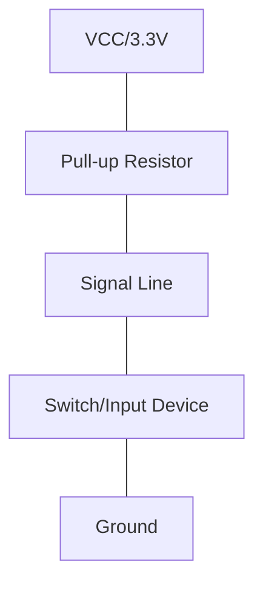

# STM32 Pull-up Resistors

## Introduction

Pull-up resistors are an essential component in digital electronic circuits, especially when working with microcontroller inputs like those on STM32 devices. These simple components help establish a default logic state for digital pins, prevent floating inputs, and enable various interface protocols. Understanding how to properly configure and use pull-up resistors in STM32 microcontrollers is crucial for creating reliable embedded systems.

In this guide, we'll explore:
- What pull-up resistors are and why they're necessary
- How STM32 internal pull-up resistors work
- How to configure pull-up resistors in STM32 microcontrollers
- Practical applications and example code

## What Are Pull-up Resistors?

A pull-up resistor is a resistor connected between a signal line and a positive voltage supply (usually VCC or 3.3V in STM32 systems). Its purpose is to ensure that when the input is not actively driven by a device (like a switch or another digital output), it "pulls up" the voltage to a known high state instead of leaving it "floating."



### Why Are Pull-up Resistors Necessary?

Digital inputs on microcontrollers like the STM32 need to read a clear HIGH or LOW signal, but without a defined connection, a pin can "float" between states due to:
- Electrical noise
- Capacitive coupling from nearby signals
- Leakage currents

This floating state can cause unpredictable behavior, including:
- False triggering of interrupts
- Inconsistent readings of input states
- Random behavior in your application

## STM32 Internal Pull-up Resistors

One of the advantages of STM32 microcontrollers is that they include built-in (internal) pull-up resistors that can be enabled through software. This eliminates the need for external components in many applications.

Key characteristics of STM32 internal pull-up resistors:
- Typical resistance values between 30kΩ and 50kΩ (depending on specific STM32 family)
- Can be individually enabled/disabled for each GPIO pin
- Configurable through GPIO peripheral registers or HAL/LL functions

## Configuring Pull-up Resistors in STM32

There are several ways to configure pull-up resistors in STM32 microcontrollers depending on your development environment and preferred API level.

### Using STM32CubeMX

If you're using STM32CubeMX for project initialization:

1. Open your project in STM32CubeMX
2. Select the GPIO pin you want to configure
3. Set the pin mode to "GPIO_Input"
4. In the GPIO configuration panel, set "Pull-up/Pull-down" to "Pull-up"
5. Generate the code

### Using STM32 HAL Library

Here's how to configure a pin with an internal pull-up resistor using the HAL library:

```c
// Initialize GPIO pin with pull-up resistor
GPIO_InitTypeDef GPIO_InitStruct = {0};

// Enable clock for GPIOA peripheral
__HAL_RCC_GPIOA_CLK_ENABLE();

// Configure PA0 as input with pull-up
GPIO_InitStruct.Pin = GPIO_PIN_0;
GPIO_InitStruct.Mode = GPIO_MODE_INPUT;
GPIO_InitStruct.Pull = GPIO_PULLUP;
GPIO_InitStruct.Speed = GPIO_SPEED_FREQ_LOW;
HAL_GPIO_Init(GPIOA, &GPIO_InitStruct);
```

### Using STM32 LL (Low-Level) Library

Alternatively, you can use the Low-Level library for more direct control:

```c
// Enable clock for GPIOA peripheral
LL_AHB1_GRP1_EnableClock(LL_AHB1_GRP1_PERIPH_GPIOA);

// Configure PA0 as input with pull-up
LL_GPIO_SetPinMode(GPIOA, LL_GPIO_PIN_0, LL_GPIO_MODE_INPUT);
LL_GPIO_SetPinPull(GPIOA, LL_GPIO_PIN_0, LL_GPIO_PULL_UP);
```

### Using Direct Register Access

For the most direct control, you can manipulate the registers directly:

```c
// Enable clock for GPIOA peripheral
RCC->AHB1ENR |= RCC_AHB1ENR_GPIOAEN;

// Configure PA0 as input with pull-up
GPIOA->MODER &= ~(0x3 << (0 * 2));        // Clear bits for input mode
GPIOA->PUPDR &= ~(0x3 << (0 * 2));        // Clear pull-up/down bits
GPIOA->PUPDR |= (0x1 << (0 * 2));         // Set pull-up
```

## Reading Inputs with Pull-up Resistors

When a pin is configured with a pull-up resistor, the input will read as HIGH (1) when nothing is connected or when the external switch/button is open. It will read as LOW (0) when the pin is connected to ground (switch/button is closed).

Here's how to read a pin with a pull-up resistor:

```c
// Read state of pin PA0 (configured with pull-up)
if (HAL_GPIO_ReadPin(GPIOA, GPIO_PIN_0) == GPIO_PIN_RESET) {
    // Pin is LOW (connected to ground, button pressed)
    // Execute your code here
} else {
    // Pin is HIGH (pulled up, button not pressed)
    // Execute alternative code here
}
```

## Practical Examples

### Example 1: Button Interface with Debouncing

This example shows how to connect a button to an STM32 using an internal pull-up resistor, with software debouncing:

```c
#include "main.h"

#define DEBOUNCE_DELAY 50 // milliseconds

GPIO_PinState lastButtonState = GPIO_PIN_SET;  // Default state with pull-up is HIGH
uint32_t lastDebounceTime = 0;

int main(void)
{
    HAL_Init();
    SystemClock_Config();

    // Initialize button pin with pull-up
    GPIO_InitTypeDef GPIO_InitStruct = {0};
    __HAL_RCC_GPIOA_CLK_ENABLE();
    GPIO_InitStruct.Pin = GPIO_PIN_0;  // Using PA0 for button
    GPIO_InitStruct.Mode = GPIO_MODE_INPUT;
    GPIO_InitStruct.Pull = GPIO_PULLUP;
    GPIO_InitStruct.Speed = GPIO_SPEED_FREQ_LOW;
    HAL_GPIO_Init(GPIOA, &GPIO_InitStruct);

    // Initialize LED pin
    __HAL_RCC_GPIOC_CLK_ENABLE();
    GPIO_InitStruct.Pin = GPIO_PIN_13;  // LED pin on many STM32 dev boards
    GPIO_InitStruct.Mode = GPIO_MODE_OUTPUT_PP;
    GPIO_InitStruct.Pull = GPIO_NOPULL;
    GPIO_InitStruct.Speed = GPIO_SPEED_FREQ_LOW;
    HAL_GPIO_Init(GPIOC, &GPIO_InitStruct);

    while (1)
    {
        GPIO_PinState currentButtonState = HAL_GPIO_ReadPin(GPIOA, GPIO_PIN_0);
        
        // Check if button state changed
        if (currentButtonState != lastButtonState) {
            lastDebounceTime = HAL_GetTick();
        }
        
        // If state has been stable for the debounce period
        if ((HAL_GetTick() - lastDebounceTime) > DEBOUNCE_DELAY) {
            // If button is pressed (LOW with pull-up)
            if (currentButtonState == GPIO_PIN_RESET) {
                // Toggle LED
                HAL_GPIO_TogglePin(GPIOC, GPIO_PIN_13);
                
                // Wait for button release to avoid multiple toggles
                while (HAL_GPIO_ReadPin(GPIOA, GPIO_PIN_0) == GPIO_PIN_RESET) {
                    // Do nothing, just wait
                }
            }
        }
        
        lastButtonState = currentButtonState;
    }
}
```

### Example 2: I2C Communication Using Internal Pull-ups

For I2C communication, pull-up resistors are essential. While external pull-ups are recommended for reliable I2C, you can use the internal pull-ups for testing or low-speed applications:

```c
#include "main.h"

I2C_HandleTypeDef hi2c1;

void I2C_Init(void)
{
    // Enable clock for GPIOB
    __HAL_RCC_GPIOB_CLK_ENABLE();
    
    // Configure I2C pins with internal pull-ups
    GPIO_InitTypeDef GPIO_InitStruct = {0};
    GPIO_InitStruct.Pin = GPIO_PIN_8 | GPIO_PIN_9;  // SCL and SDA pins for I2C1 on many STM32s
    GPIO_InitStruct.Mode = GPIO_MODE_AF_OD;         // Alternate function, Open-Drain
    GPIO_InitStruct.Pull = GPIO_PULLUP;             // Enable internal pull-ups
    GPIO_InitStruct.Speed = GPIO_SPEED_FREQ_HIGH;
    GPIO_InitStruct.Alternate = GPIO_AF4_I2C1;      // Connect to I2C1 peripheral
    HAL_GPIO_Init(GPIOB, &GPIO_InitStruct);
    
    // Enable I2C clock
    __HAL_RCC_I2C1_CLK_ENABLE();
    
    // Configure I2C
    hi2c1.Instance = I2C1;
    hi2c1.Init.ClockSpeed = 100000;           // 100kHz (standard mode)
    hi2c1.Init.DutyCycle = I2C_DUTYCYCLE_2;
    hi2c1.Init.OwnAddress1 = 0;
    hi2c1.Init.AddressingMode = I2C_ADDRESSINGMODE_7BIT;
    hi2c1.Init.DualAddressMode = I2C_DUALADDRESS_DISABLE;
    hi2c1.Init.OwnAddress2 = 0;
    hi2c1.Init.GeneralCallMode = I2C_GENERALCALL_DISABLE;
    hi2c1.Init.NoStretchMode = I2C_NOSTRETCH_DISABLE;
    
    HAL_I2C_Init(&hi2c1);
}

// Example: Scan for I2C devices
void I2C_Scan(void)
{
    printf("Scanning I2C bus...\r
");
    
    uint8_t device_count = 0;
    uint8_t buffer[1];
    
    for (uint8_t address = 1; address < 128; address++)
    {
        // Check if device responds at this address
        if (HAL_I2C_Master_Transmit(&hi2c1, (uint16_t)(address << 1), buffer, 0, 100) == HAL_OK)
        {
            printf("Device found at address 0x%02X\r
", address);
            device_count++;
        }
    }
    
    if (device_count == 0) {
        printf("No I2C devices found\r
");
    } else {
        printf("Found %d devices\r
", device_count);
    }
}
```

### Example 3: External Interrupt with Pull-up

This example configures a pin with a pull-up resistor to generate interrupts when a button is pressed:

```c
#include "main.h"

void HAL_GPIO_EXTI_Callback(uint16_t GPIO_Pin)
{
    if (GPIO_Pin == GPIO_PIN_0) {
        // This will be called when PA0 goes LOW (button press)
        // Add your interrupt handling code here
        HAL_GPIO_TogglePin(GPIOC, GPIO_PIN_13);  // Toggle LED
    }
}

int main(void)
{
    HAL_Init();
    SystemClock_Config();

    // Enable clocks
    __HAL_RCC_GPIOA_CLK_ENABLE();
    __HAL_RCC_GPIOC_CLK_ENABLE();
    
    // Configure LED pin
    GPIO_InitTypeDef GPIO_InitStruct = {0};
    GPIO_InitStruct.Pin = GPIO_PIN_13;
    GPIO_InitStruct.Mode = GPIO_MODE_OUTPUT_PP;
    GPIO_InitStruct.Pull = GPIO_NOPULL;
    GPIO_InitStruct.Speed = GPIO_SPEED_FREQ_LOW;
    HAL_GPIO_Init(GPIOC, &GPIO_InitStruct);
    
    // Configure button pin with pull-up and interrupt on falling edge
    GPIO_InitStruct.Pin = GPIO_PIN_0;
    GPIO_InitStruct.Mode = GPIO_MODE_IT_FALLING;  // Interrupt on falling edge (HIGH to LOW)
    GPIO_InitStruct.Pull = GPIO_PULLUP;
    HAL_GPIO_Init(GPIOA, &GPIO_InitStruct);
    
    // Enable and set EXTI Line0 Interrupt
    HAL_NVIC_SetPriority(EXTI0_IRQn, 0, 0);
    HAL_NVIC_EnableIRQ(EXTI0_IRQn);
    
    while (1) {
        // Main program loop
        HAL_Delay(100);
    }
}

// This function needs to be defined in your code
void EXTI0_IRQHandler(void)
{
    HAL_GPIO_EXTI_IRQHandler(GPIO_PIN_0);
}
```

## When to Use External Pull-up Resistors vs. Internal

While STM32's internal pull-up resistors are convenient, there are situations where external pull-ups might be preferable:

| Parameter | Internal Pull-ups | External Pull-ups |
|-----------|------------------|------------------|
| Resistance value | Fixed (~40kΩ typical) | Customizable (1kΩ-100kΩ) |
| Current capacity | Limited | Depends on resistor choice |
| Reliability | Good for basic I/O | Better for noise-sensitive applications |
| Board space | No extra components | Requires physical resistors |
| Application | Simple buttons, low-speed interfaces | High-speed interfaces, noise-sensitive circuits |

For interfaces like I2C operating at higher speeds, external pull-up resistors of 2.2kΩ to 4.7kΩ are typically recommended for better performance.

## Common Issues and Troubleshooting

### Input Reading as LOW When It Should Be HIGH

If your input with a pull-up resistor reads LOW when it should be HIGH:
- Check if there's an unintended connection to ground
- Verify the pin configuration in your code
- Check if the pull-up is actually enabled

### Inconsistent Readings

If you're getting inconsistent readings:
- Add debouncing for buttons/switches
- Consider using an external pull-up with a lower resistance value
- Check for electromagnetic interference in your circuit

### High Power Consumption

If your device is consuming more power than expected:
- Remember that internal pull-ups draw a small amount of current
- Disable pull-ups on unused pins
- Use external pull-ups with higher resistance values for low-power applications

## Summary

Pull-up resistors are a fundamental component in digital circuits that prevent floating inputs and establish default states for GPIO pins. STM32 microcontrollers provide convenient internal pull-up resistors that can be enabled through software, eliminating the need for external components in many applications.

Key takeaways:
- Pull-up resistors establish a default HIGH state when inputs are not actively driven
- STM32 microcontrollers have internal pull-up resistors (typically 30-50kΩ)
- They can be configured using STM32CubeMX, HAL/LL libraries, or direct register access
- For noise-sensitive or high-speed applications, external pull-up resistors may be preferable

## Exercises

1. Configure a button using an internal pull-up resistor that toggles an LED when pressed.
2. Modify the button example to use an external pull-up resistor of 10kΩ and compare the behavior.
3. Create a simple keypad (3x3 or 4x4) interface using pull-up resistors and row/column scanning.
4. Implement a project that compares the performance of I2C communication using internal vs. external pull-up resistors.
5. Create a power-efficient system that selectively enables pull-ups only when needed.

## Further Reading

- STM32 Reference Manuals for your specific device
- STM32 HAL and LL API documentation
- Digital Electronics fundamentals
- I2C Protocol Specifications for proper pull-up resistor sizing