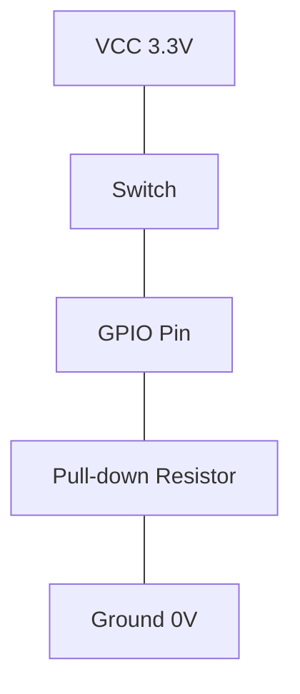

# STM32 Pull-down Resistors

## Introduction

Pull-down resistors are an essential component in digital electronic circuits, particularly when working with microcontrollers like the STM32 family. They serve a crucial role in ensuring stable and predictable input states on GPIO pins. In this tutorial, we'll explore what pull-down resistors are, why they're important, and how to configure and use them with STM32 microcontrollers.

## What are Pull-down Resistors?

A pull-down resistor is a resistor connected between a signal line and ground (0V). Its primary function is to ensure a known state (LOW) on a digital input pin when no active signal is present.



In the above diagram, when the switch is open, the resistor "pulls down" the GPIO pin to ground, ensuring it reads a logic LOW (0). When the switch is closed, current flows from VCC to the pin, overriding the pull-down effect and making the pin read HIGH (1).

## Why Do We Need Pull-down Resistors?

Without pull-down (or pull-up) resistors, input pins would be in a "floating" state when not actively driven. This can lead to:

1. Unpredictable behavior due to electrical noise
2. False triggering of inputs
3. Increased power consumption
4. Potential damage to the microcontroller in certain situations

By using pull-down resistors, we ensure our inputs are in a defined state (LOW) until actively driven HIGH.

## STM32 Internal Pull-down Resistors

One of the advantages of STM32 microcontrollers is that they feature built-in pull-down (and pull-up) resistors that can be enabled through software. This eliminates the need for external resistors in many applications, saving board space and component costs.

The typical value of these internal pull-down resistors is between 30kΩ and 50kΩ, which is suitable for most applications.

## Configuring Pull-down Resistors in STM32

### Using STM32CubeMX

The easiest way to configure pull-down resistors is using the STM32CubeMX tool:

1. Open your project in STM32CubeMX
2. Select the GPIO pin you want to configure
3. In the GPIO mode dropdown, select "Input mode"
4. In the Pull-up/Pull-down dropdown, select "Pull-down"
5. Generate the code

### Through HAL Library Code

If you're manually configuring your pins with the HAL library, here's how to set up a pull-down resistor:

```c
GPIO_InitTypeDef GPIO_InitStruct = {0};

// Configure GPIO pin for input with pull-down
GPIO_InitStruct.Pin = GPIO_PIN_0;  // Example: Pin PA0
GPIO_InitStruct.Mode = GPIO_MODE_INPUT;
GPIO_InitStruct.Pull = GPIO_PULLDOWN;  // Enable pull-down
GPIO_InitStruct.Speed = GPIO_SPEED_FREQ_LOW;
HAL_GPIO_Init(GPIOA, &GPIO_InitStruct);
```

### Using Low-Level Register Access

For those who prefer direct register access (not recommended for beginners):

```c
// Enable GPIOA clock
RCC->AHB1ENR |= RCC_AHB1ENR_GPIOAEN;

// Configure PA0 as input (00 in MODER[1:0])
GPIOA->MODER &= ~(0x3 << (0 * 2));

// Enable pull-down (10 in PUPDR[1:0])
GPIOA->PUPDR &= ~(0x3 << (0 * 2));
GPIOA->PUPDR |= (0x2 << (0 * 2));
```

## When to Use Pull-down vs. Pull-up Resistors

The choice between pull-down and pull-up resistors depends on your specific application:

| Pull-down (LOW when inactive) | Pull-up (HIGH when inactive) |
|-------------------------------|------------------------------|
| Push buttons connecting to VCC | Push buttons connecting to GND |
| Active-high sensors | Active-low sensors |
| When default state should be 0 | When default state should be 1 |

## Practical Example: Button Interface with Pull-down Resistor

Let's create a simple button interface where the button connects between a GPIO pin and VCC. When not pressed, the pull-down resistor ensures the input reads as LOW.

### Hardware Setup


### Code Implementation

```c
#include "main.h"

int main(void)
{
  HAL_Init();
  SystemClock_Config();
  
  // Enable GPIOA clock
  __HAL_RCC_GPIOA_CLK_ENABLE();
  __HAL_RCC_GPIOC_CLK_ENABLE();
  
  // Configure PA0 as input with pull-down
  GPIO_InitTypeDef GPIO_InitStruct = {0};
  GPIO_InitStruct.Pin = GPIO_PIN_0;
  GPIO_InitStruct.Mode = GPIO_MODE_INPUT;
  GPIO_InitStruct.Pull = GPIO_PULLDOWN;
  HAL_GPIO_Init(GPIOA, &GPIO_InitStruct);
  
  // Configure PC13 (LED) as output
  GPIO_InitStruct.Pin = GPIO_PIN_13;
  GPIO_InitStruct.Mode = GPIO_MODE_OUTPUT_PP;
  GPIO_InitStruct.Pull = GPIO_NOPULL;
  GPIO_InitStruct.Speed = GPIO_SPEED_FREQ_LOW;
  HAL_GPIO_Init(GPIOC, &GPIO_InitStruct);
  
  while (1)
  {
    // Read button state (PA0)
    GPIO_PinState buttonState = HAL_GPIO_ReadPin(GPIOA, GPIO_PIN_0);
    
    // Set LED based on button state
    HAL_GPIO_WritePin(GPIOC, GPIO_PIN_13, buttonState);
    
    // Small delay to avoid rapid toggling due to button bounce
    HAL_Delay(10);
  }
}
```

### Expected Behavior

- When the button is not pressed, PA0 reads LOW (0) due to the pull-down resistor, and the LED is OFF.
- When the button is pressed, it connects PA0 to VCC, the pin reads HIGH (1), and the LED turns ON.

## Debouncing with Pull-down Resistors

When using mechanical switches like buttons, you might encounter "bounce" - rapid transitions between states when the button is pressed or released. Pull-down resistors don't solve this issue by themselves, but they're an essential part of a debouncing solution:

```c
// Improved button read with debouncing
GPIO_PinState readButtonDebounced(GPIO_TypeDef* GPIOx, uint16_t GPIO_Pin)
{
  static uint32_t lastDebounceTime = 0;
  static GPIO_PinState lastButtonState = GPIO_PIN_RESET;
  static GPIO_PinState buttonState = GPIO_PIN_RESET;
  
  // Read the current pin state
  GPIO_PinState reading = HAL_GPIO_ReadPin(GPIOx, GPIO_Pin);
  
  // Check if the state changed
  if (reading != lastButtonState) {
    // Reset the debounce timer
    lastDebounceTime = HAL_GetTick();
  }
  
  // If enough time has passed, consider the state stable
  if ((HAL_GetTick() - lastDebounceTime) > 50) { // 50ms debounce time
    // Update the button state if it changed
    if (reading != buttonState) {
      buttonState = reading;
    }
  }
  
  // Save the last reading
  lastButtonState = reading;
  
  return buttonState;
}
```

## External vs. Internal Pull-down Resistors

While STM32 microcontrollers have internal pull-down resistors, there are cases where external ones might be preferred:

| Internal Pull-downs | External Pull-downs |
|---------------------|---------------------|
| Simpler hardware | More precise resistance value |
| Save board space | Stronger pull-down (lower resistance) |
| Adequate for most digital inputs | Required for specific threshold requirements |
| ~30-50kΩ typical value | Can choose specific values (e.g., 4.7kΩ, 10kΩ) |

## Common Issues and Troubleshooting

1. **Input reading incorrectly**: Verify the pull-down resistor is enabled correctly in your GPIO initialization.
  
2. **Button presses missed**: Your internal pull-down might be too weak for your application. Consider adding an external pull-down resistor with a lower value.

3. **Erratic behavior**: Check for proper debouncing if using mechanical buttons.

4. **High power consumption**: If power consumption is critical, note that using pull-down resistors can increase power usage compared to high-impedance inputs.

## Summary

Pull-down resistors are crucial components in digital IO design with STM32 microcontrollers. They ensure that input pins have a defined state (LOW) when not actively driven, preventing floating inputs and unpredictable behavior.

Key points to remember:
- STM32 microcontrollers have built-in pull-down resistors that can be enabled in software
- They're essential for interfacing with buttons, switches, and other digital inputs
- The choice between pull-up and pull-down depends on your specific circuit requirements
- Proper configuration of pull-down resistors is crucial for reliable operation of digital inputs

## Exercises

1. Configure an STM32 GPIO pin with an internal pull-down resistor and connect an LED to see how it behaves when left unconnected vs. when connected to VCC.

2. Create a simple toggle switch that changes the state of an LED each time a button is pressed. Use internal pull-down resistors and implement proper debouncing.

3. Design a circuit with multiple buttons using pull-down resistors, where each button controls a different LED.

4. Compare the behavior of the same input circuit using internal vs. external pull-down resistors of different values. Observe any differences in performance.

## Additional Resources

- STM32 Reference Manual (RM0090 for STM32F4 family)
- ST Microelectronics Application Notes:
  - AN4899: STM32 GPIO configuration for hardware settings and low-power consumption
  - AN2867: Oscillator design guide for STM32 microcontrollers
- STM32 HAL GPIO Driver documentation