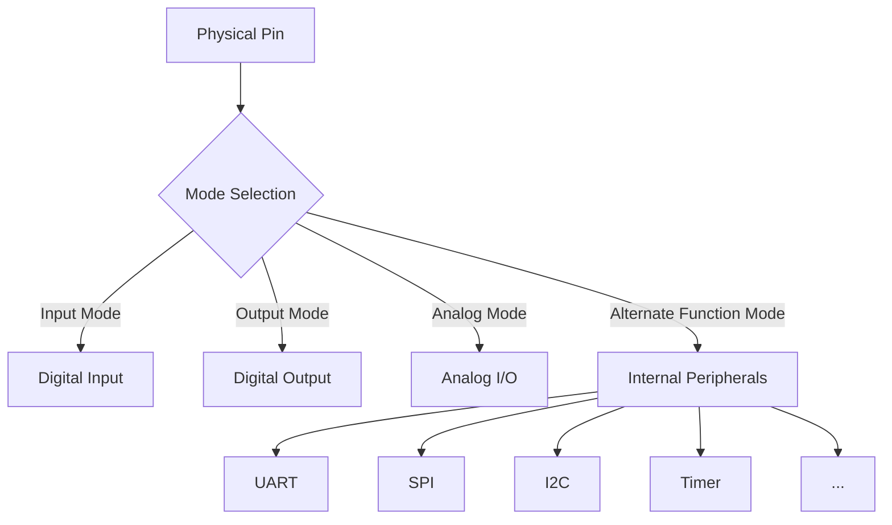

# STM32 Alternate Functions

## Introduction

When working with STM32 microcontrollers, you'll often need more functionality from your pins than just basic digital input and output. This is where **Alternate Functions** come into play. Alternate functions allow a single physical pin to serve multiple purposes by connecting it to different internal peripherals.

For example, a pin might function as:
- A standard GPIO pin (default)
- A UART transmitter
- An SPI clock line
- A timer output channel
- And many more possibilities

This capability maximizes the functionality of your microcontroller despite its limited number of physical pins. Let's explore how to use these alternate functions effectively in your STM32 projects.

## Understanding GPIO Alternate Function Modes

Each GPIO pin on an STM32 microcontroller can be configured in one of several modes:

- Input mode
- Output mode
- Analog mode
- **Alternate function mode**

When a pin is configured in alternate function mode, it's connected to a specific peripheral inside the microcontroller rather than functioning as a general-purpose I/O.



## How Alternate Functions Are Organized

STM32 microcontrollers organize alternate functions using a multiplexer system. Each pin can typically support multiple alternate functions, identified by AF0 through AF15 (16 possible functions, though not all are used on every pin).

The specific mapping of functions to AF numbers varies by:
- STM32 family (F1, F4, L4, etc.)
- Specific chip model
- The physical pin itself

### The Alternate Function Mapping Table

To determine which alternate function to select for a specific peripheral on a specific pin, you'll need to consult the datasheet or reference manual for your specific STM32 microcontroller.

For example, on an STM32F4 series, you might see a table like this (simplified):

| Pin | AF0 | AF1 | AF2 | AF3 | AF4 | AF5 | ... |
|-----|-----|-----|-----|-----|-----|-----|-----|
| PA0 | - | TIM2_CH1 | TIM5_CH1 | - | USART2_CTS | - | ... |
| PA1 | - | TIM2_CH2 | TIM5_CH2 | - | USART2_RTS | - | ... |
| PA2 | - | TIM2_CH3 | TIM5_CH3 | - | USART2_TX | - | ... |
| ... | ... | ... | ... | ... | ... | ... | ... |

This table shows which peripheral function is connected to each pin when a specific alternate function number is selected.

## Configuring Alternate Functions in Code

Let's see how to configure a pin for alternate function mode in code. We'll use the STM32 HAL library, which is commonly used for STM32 programming.

### Step 1: Enable the GPIO and Peripheral Clocks

```c
// Enable GPIO port A clock
__HAL_RCC_GPIOA_CLK_ENABLE();

// Enable the peripheral clock (e.g., USART2)
__HAL_RCC_USART2_CLK_ENABLE();
```

### Step 2: Configure the GPIO Pin for Alternate Function Mode

```c
GPIO_InitTypeDef GPIO_InitStruct = {0};

// Configure PA2 for USART2_TX (on many STM32F4, this is AF7)
GPIO_InitStruct.Pin = GPIO_PIN_2;
GPIO_InitStruct.Mode = GPIO_MODE_AF_PP;       // Alternate function push-pull
GPIO_InitStruct.Pull = GPIO_PULLUP;           // Enable pull-up if needed
GPIO_InitStruct.Speed = GPIO_SPEED_FREQ_HIGH; // High speed for communication pins
GPIO_InitStruct.Alternate = GPIO_AF7_USART2;  // Assign alternate function 7 (USART2)

HAL_GPIO_Init(GPIOA, &GPIO_InitStruct);
```

### Step 3: Configure and Use the Peripheral

```c
UART_HandleTypeDef huart2;

// Configure USART2
huart2.Instance = USART2;
huart2.Init.BaudRate = 115200;
huart2.Init.WordLength = UART_WORDLENGTH_8B;
huart2.Init.StopBits = UART_STOPBITS_1;
huart2.Init.Parity = UART_PARITY_NONE;
huart2.Init.Mode = UART_MODE_TX_RX;
huart2.Init.HwFlowCtl = UART_HWCONTROL_NONE;
huart2.Init.OverSampling = UART_OVERSAMPLING_16;

HAL_UART_Init(&huart2);

// Now you can use the UART
char message[] = "Hello from UART!\r
";
HAL_UART_Transmit(&huart2, (uint8_t*)message, strlen(message), 100);
```

## Practical Examples

Let's look at some common use cases for alternate functions.

### Example 1: Configuring a Pin for PWM Output using Timer

This example configures PA0 to output a PWM signal using Timer 2 Channel 1:

```c
// Enable clocks
__HAL_RCC_GPIOA_CLK_ENABLE();
__HAL_RCC_TIM2_CLK_ENABLE();

// Configure GPIO for alternate function
GPIO_InitTypeDef GPIO_InitStruct = {0};
GPIO_InitStruct.Pin = GPIO_PIN_0;
GPIO_InitStruct.Mode = GPIO_MODE_AF_PP;
GPIO_InitStruct.Pull = GPIO_NOPULL;
GPIO_InitStruct.Speed = GPIO_SPEED_FREQ_HIGH;
GPIO_InitStruct.Alternate = GPIO_AF1_TIM2;  // TIM2 is on AF1 for this pin
HAL_GPIO_Init(GPIOA, &GPIO_InitStruct);

// Configure Timer for PWM
TIM_HandleTypeDef htim2;
TIM_OC_InitTypeDef sConfigOC = {0};

htim2.Instance = TIM2;
htim2.Init.Prescaler = 84-1;         // For a 84MHz clock
htim2.Init.CounterMode = TIM_COUNTERMODE_UP;
htim2.Init.Period = 1000-1;          // 1000 steps for PWM resolution
htim2.Init.ClockDivision = TIM_CLOCKDIVISION_DIV1;
HAL_TIM_PWM_Init(&htim2);

// Configure the PWM channel
sConfigOC.OCMode = TIM_OCMODE_PWM1;
sConfigOC.Pulse = 500;               // 50% duty cycle
sConfigOC.OCPolarity = TIM_OCPOLARITY_HIGH;
sConfigOC.OCFastMode = TIM_OCFAST_DISABLE;
HAL_TIM_PWM_ConfigChannel(&htim2, &sConfigOC, TIM_CHANNEL_1);

// Start PWM generation
HAL_TIM_PWM_Start(&htim2, TIM_CHANNEL_1);
```

### Example 2: Configuring I2C Communication

This example sets up I2C1 on pins PB6 (SCL) and PB7 (SDA):

```c
// Enable peripheral clocks
__HAL_RCC_GPIOB_CLK_ENABLE();
__HAL_RCC_I2C1_CLK_ENABLE();

// Configure I2C pins for alternate function
GPIO_InitTypeDef GPIO_InitStruct = {0};
GPIO_InitStruct.Pin = GPIO_PIN_6 | GPIO_PIN_7;  // SCL and SDA pins
GPIO_InitStruct.Mode = GPIO_MODE_AF_OD;         // Open-drain for I2C
GPIO_InitStruct.Pull = GPIO_PULLUP;             // Pull-ups needed for I2C
GPIO_InitStruct.Speed = GPIO_SPEED_FREQ_VERY_HIGH;
GPIO_InitStruct.Alternate = GPIO_AF4_I2C1;      // I2C1 is on AF4
HAL_GPIO_Init(GPIOB, &GPIO_InitStruct);

// Configure and initialize I2C
I2C_HandleTypeDef hi2c1;
hi2c1.Instance = I2C1;
hi2c1.Init.ClockSpeed = 100000;              // Standard I2C speed (100 KHz)
hi2c1.Init.DutyCycle = I2C_DUTYCYCLE_2;
hi2c1.Init.OwnAddress1 = 0;                  // Our own address (as master)
hi2c1.Init.AddressingMode = I2C_ADDRESSINGMODE_7BIT;
hi2c1.Init.DualAddressMode = I2C_DUALADDRESS_DISABLE;
hi2c1.Init.OwnAddress2 = 0;
hi2c1.Init.GeneralCallMode = I2C_GENERALCALL_DISABLE;
hi2c1.Init.NoStretchMode = I2C_NOSTRETCH_DISABLE;
HAL_I2C_Init(&hi2c1);

// Example: Write data to a device with address 0x50
uint8_t data[] = {0x00, 0x42};  // Register 0, value 0x42
HAL_I2C_Master_Transmit(&hi2c1, 0x50 << 1, data, 2, 100);
```

## Common Challenges and Solutions

### 1. Conflicting Alternate Functions

**Problem**: You need to use two different peripherals that want to use the same pin.

**Solution**: 
- Check if either peripheral can be mapped to a different pin
- Consider using a different peripheral instance (e.g., USART1 instead of USART2)
- Prioritize which function is more important for your application

### 2. Pin Remapping on STM32F1 Series

The STM32F1 series uses a different approach to alternate functions called "pin remapping". Instead of numbering alternate functions from AF0 to AF15, it uses specific remapping registers.

```c
// Example of pin remapping for STM32F1
// Enable clock for alternate function I/O
__HAL_RCC_AFIO_CLK_ENABLE();

// Remap USART1 from PA9/PA10 to PB6/PB7
__HAL_AFIO_REMAP_USART1_ENABLE();
```

### 3. Finding the Correct AF Number

**Problem**: It's difficult to remember all the AF numbers for different peripherals.

**Solution**: The STM32 HAL library defines macros for common alternates, such as:
- `GPIO_AF1_TIM1`
- `GPIO_AF4_I2C1`
- `GPIO_AF7_USART2`

Always refer to your specific microcontroller's datasheet for the correct mapping.

## Debugging Alternate Function Issues

If your peripheral isn't working as expected after configuring alternate functions:

1. **Verify clock enablement**: Both GPIO and peripheral clocks must be enabled
2. **Check pin configurations**: Mode, alternate function number, and pull-up/down settings
3. **Confirm peripheral initialization**: Ensure the peripheral itself is correctly configured
4. **Use an oscilloscope or logic analyzer**: Check if the expected signals appear on the pins
5. **Review the datasheet**: Confirm you're using the correct AF number for your specific chip

## Summary

STM32 Alternate Functions allow you to maximize the use of your microcontroller's pins by connecting them to various internal peripherals. To use alternate functions effectively:

1. Determine which peripheral you need to use
2. Find the appropriate pins that support that peripheral
3. Look up the correct alternate function number in the datasheet
4. Configure the pins for alternate function mode with the correct AF number
5. Initialize and use the peripheral

This powerful feature enables complex applications with minimal external components, but requires careful attention to detail when configuring your microcontroller.

## Further Resources

- Practice by implementing different communication protocols (UART, SPI, I2C)
- Experiment with timer outputs for PWM generation
- Try using specialized alternate functions like USB, CAN, or Ethernet

## Exercises

1. Configure a pin to blink an LED using a timer's PWM output
2. Set up UART communication between your STM32 and a computer
3. Implement an I2C interface to read data from a sensor
4. Create a project that uses multiple alternate functions simultaneously