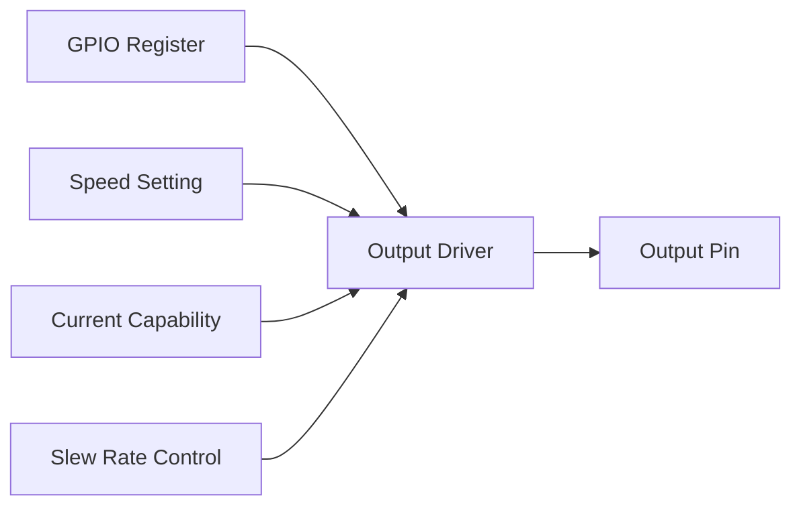
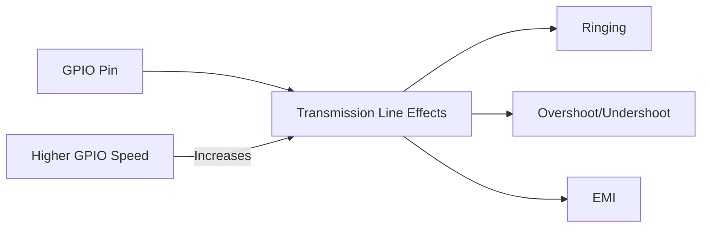

# STM32 GPIO Speed

## Introduction

When working with STM32 microcontrollers, you'll often need to configure GPIO (General-Purpose Input/Output) pins for various applications. One important but sometimes overlooked configuration parameter is the **GPIO speed setting**. This parameter determines how quickly the pin can change its output state, which affects both performance and signal integrity.

In this tutorial, we'll explore:
- What GPIO speed means on STM32 microcontrollers
- Why it's important for your applications
- How to configure GPIO speed settings
- When to use different speed options for optimal performance

## Understanding GPIO Speed

### What is GPIO Speed?

GPIO speed refers to the **slew rate** - how quickly the output voltage can transition from low to high (0V to 3.3V) or high to low (3.3V to 0V). This is measured in terms of rise/fall time or maximum toggling frequency.

On STM32 microcontrollers, GPIO speed settings don't directly specify a numeric value (like MHz). Instead, they provide relative options:

| Speed Setting | Meaning |
|--------------|---------|
| Low Speed | Slower transitions, reduced electromagnetic emissions |
| Medium Speed | Balanced performance for general usage |
| High Speed | Faster transitions for time-critical applications |
| Very High Speed | Maximum performance for high-frequency signals |

The actual frequency these settings correspond to varies by STM32 family and specific chip model.

### How GPIO Speed Works

When you configure a GPIO pin on an STM32 microcontroller, you're actually configuring the output driver's capabilities:



Higher speed settings:
- Increase the current drive capability
- Allow faster charging/discharging of capacitive loads
- Result in steeper signal edges (faster transitions)

## Why GPIO Speed Matters

Choosing the appropriate GPIO speed setting is crucial for:

1. **Signal Integrity**: Too slow settings can cause timing violations; too fast can create noise issues
2. **Power Consumption**: Higher speeds generally consume more power
3. **EMI (Electromagnetic Interference)**: Faster transitions generate more electromagnetic emissions
4. **Application Requirements**: Some protocols (like SPI, I2C) have specific timing requirements

Let's examine scenarios where different speed settings are appropriate:

### Low Speed (2MHz)
- LED control
- Button inputs
- Low-frequency signaling
- Battery-powered applications where power consumption is critical

### Medium Speed (25MHz)
- General-purpose I/O
- Most typical microcontroller applications
- UART communication

### High Speed (50MHz)
- SPI communication
- I2C fast mode
- ADC/DAC trigger signals

### Very High Speed (100MHz+)
- High-speed communication interfaces
- Clock signal outputs
- External memory interfaces
- Time-critical applications

## Configuring GPIO Speed in STM32CubeIDE

Let's look at how to configure GPIO speed in practice using STM32CubeIDE:

### Method 1: Using STM32CubeMX GUI

1. Open your project in STM32CubeIDE
2. Go to the Pinout & Configuration tab
3. Select the desired GPIO pin
4. In the GPIO Mode section, look for "Speed" dropdown
5. Select the appropriate speed setting


### Method 2: Direct Register Access

For more control or in cases where you're not using STM32CubeIDE, you can configure the speed registers directly:

```c
// Configure GPIOA Pin 5 for High Speed Output
// 1. Enable GPIOA clock
RCC->AHB1ENR |= RCC_AHB1ENR_GPIOAEN;

// 2. Set pin as output (Mode register)
GPIOA->MODER &= ~(0x3 << (5 * 2));  // Clear mode bits
GPIOA->MODER |= (0x1 << (5 * 2));   // Set as output

// 3. Configure speed register (OSPEEDR)
GPIOA->OSPEEDR &= ~(0x3 << (5 * 2)); // Clear speed bits
GPIOA->OSPEEDR |= (0x2 << (5 * 2));  // Set high speed (0x2)
// Speed options: 0x0=Low, 0x1=Medium, 0x2=High, 0x3=Very High
```

### Method 3: Using HAL Library

If you're using the STM32 HAL (Hardware Abstraction Layer) library, you can configure GPIO speed as follows:

```c
GPIO_InitTypeDef GPIO_InitStruct = {0};

// Enable GPIO Port Clock
__HAL_RCC_GPIOA_CLK_ENABLE();

// Configure GPIO pin
GPIO_InitStruct.Pin = GPIO_PIN_5;
GPIO_InitStruct.Mode = GPIO_MODE_OUTPUT_PP;
GPIO_InitStruct.Pull = GPIO_NOPULL;
GPIO_InitStruct.Speed = GPIO_SPEED_FREQ_HIGH;  // Set GPIO speed

HAL_GPIO_Init(GPIOA, &GPIO_InitStruct);
```

The available speed options in the HAL library are:
- `GPIO_SPEED_FREQ_LOW`
- `GPIO_SPEED_FREQ_MEDIUM`
- `GPIO_SPEED_FREQ_HIGH`
- `GPIO_SPEED_FREQ_VERY_HIGH`

## Real-World Examples

Let's explore some practical examples of when to use different GPIO speed settings:

### Example 1: LED Blinking Application

For a simple LED blinking application, low speed is sufficient:

```c
// LED blinking example with low speed GPIO
GPIO_InitTypeDef GPIO_InitStruct = {0};

// Enable GPIO Port Clock
__HAL_RCC_GPIOA_CLK_ENABLE();

// Configure GPIO pin for LED
GPIO_InitStruct.Pin = GPIO_PIN_5;  // LED on PA5 (on many STM32 boards)
GPIO_InitStruct.Mode = GPIO_MODE_OUTPUT_PP;
GPIO_InitStruct.Pull = GPIO_NOPULL;
GPIO_InitStruct.Speed = GPIO_SPEED_FREQ_LOW;  // Low speed is sufficient

HAL_GPIO_Init(GPIOA, &GPIO_InitStruct);

// In main loop
while (1) {
  HAL_GPIO_TogglePin(GPIOA, GPIO_PIN_5);
  HAL_Delay(500);  // Toggle every 500ms
}
```

### Example 2: SPI Communication

For SPI communication, especially at higher speeds, you'll want to use high or very high speed settings:

```c
// SPI GPIO configuration with high speed for reliable communication
GPIO_InitTypeDef GPIO_InitStruct = {0};

// Enable GPIO clocks
__HAL_RCC_GPIOA_CLK_ENABLE();

// Configure SPI pins (SCK, MISO, MOSI)
// SCK pin
GPIO_InitStruct.Pin = GPIO_PIN_5;
GPIO_InitStruct.Mode = GPIO_MODE_AF_PP;
GPIO_InitStruct.Pull = GPIO_NOPULL;
GPIO_InitStruct.Speed = GPIO_SPEED_FREQ_VERY_HIGH;  // Use very high for fast SPI
GPIO_InitStruct.Alternate = GPIO_AF5_SPI1;
HAL_GPIO_Init(GPIOA, &GPIO_InitStruct);

// MISO pin
GPIO_InitStruct.Pin = GPIO_PIN_6;
HAL_GPIO_Init(GPIOA, &GPIO_InitStruct);

// MOSI pin
GPIO_InitStruct.Pin = GPIO_PIN_7;
HAL_GPIO_Init(GPIOA, &GPIO_InitStruct);

// Then configure SPI itself
// ...
```

### Example 3: External Memory Interface

When interfacing with external memory like SDRAM or QSPI Flash, very high speed is needed:

```c
// Configure GPIO for external memory interface
GPIO_InitTypeDef GPIO_InitStruct = {0};

// Enable GPIO clocks
__HAL_RCC_GPIOD_CLK_ENABLE();
__HAL_RCC_GPIOE_CLK_ENABLE();

// Configure data pins D0-D3
GPIO_InitStruct.Pin = GPIO_PIN_14 | GPIO_PIN_15 | GPIO_PIN_0 | GPIO_PIN_1;
GPIO_InitStruct.Mode = GPIO_MODE_AF_PP;
GPIO_InitStruct.Pull = GPIO_NOPULL;
GPIO_InitStruct.Speed = GPIO_SPEED_FREQ_VERY_HIGH;  // Critical for memory timing
GPIO_InitStruct.Alternate = GPIO_AF12_FMC;
HAL_GPIO_Init(GPIOD, &GPIO_InitStruct);

// Configure additional pins as needed
// ...
```

## Choosing the Right GPIO Speed

To select the appropriate GPIO speed setting for your application, ask yourself:

1. **What's connected to this pin?** Consider the electrical characteristics of connected devices
2. **How fast does it need to change?** Consider the maximum frequency requirements
3. **Is power consumption important?** Lower speeds consume less power
4. **Do you need to minimize EMI?** Lower speeds generate less electromagnetic interference
5. **What's the capacitive load?** Higher capacitance needs higher speed settings

### General Guidelines

| Application | Recommended Speed Setting |
|-------------|--------------------------|
| LEDs, Simple Indicators | Low |
| Buttons, Switches | Low |
| General GPIO | Medium |
| UART (≤115200 baud) | Medium |
| UART (>115200 baud) | High |
| I2C Standard Mode | Medium |
| I2C Fast Mode | High |
| SPI (≤10MHz) | High |
| SPI (>10MHz) | Very High |
| External Memory | Very High |
| Timing-Critical Signals | Very High |

## Measuring GPIO Speed Performance

If you want to verify the actual performance of different GPIO speed settings, you can:

1. Use an oscilloscope to measure rise/fall times
2. Create a test program that toggles a pin at maximum speed:

```c
// Test program to measure maximum GPIO toggle speed
int main(void) {
  // Initialize system
  HAL_Init();
  SystemClock_Config();  // Configure to maximum frequency
  
  // Enable GPIO clock
  __HAL_RCC_GPIOA_CLK_ENABLE();
  
  // Configure GPIO
  GPIO_InitTypeDef GPIO_InitStruct = {0};
  GPIO_InitStruct.Pin = GPIO_PIN_5;
  GPIO_InitStruct.Mode = GPIO_MODE_OUTPUT_PP;
  GPIO_InitStruct.Pull = GPIO_NOPULL;
  GPIO_InitStruct.Speed = GPIO_SPEED_FREQ_VERY_HIGH;  // Test with different speeds
  HAL_GPIO_Init(GPIOA, &GPIO_InitStruct);
  
  // Maximum speed toggle
  while (1) {
    // Direct register access for maximum speed
    GPIOA->BSRR = GPIO_PIN_5;     // Set pin high
    GPIOA->BSRR = GPIO_PIN_5 << 16;  // Set pin low
    
    // or alternative method:
    // GPIOA->ODR ^= GPIO_PIN_5;  // Toggle pin (slightly slower)
  }
}
```

Connect an oscilloscope to the pin and measure the frequency and rise/fall times.

## Impact of GPIO Speed on Signal Quality

Higher GPIO speeds can introduce issues including:

1. **Ringing**: Oscillations in the signal after transitions
2. **Overshoot/Undershoot**: Signal exceeding the intended voltage levels
3. **EMI**: Increased electromagnetic emissions



To mitigate these issues:
- Use appropriate GPIO speed for your application
- Consider adding series termination resistors (33-100Ω)
- Keep signal traces short
- Use proper ground planes in your PCB design

## Special Considerations by STM32 Family

Different STM32 families have slightly different GPIO speed configurations:

| STM32 Family | Available Speed Settings | Notes |
|--------------|--------------------------|-------|
| STM32F0 | Low, Medium, High | Suitable for most basic applications |
| STM32F1 | Low (2MHz), Medium (10MHz), High (50MHz) | Older family with fewer options |
| STM32F4 | Low, Medium, High, Very High | Good balance for most applications |
| STM32H7 | Low, Medium, High, Very High | Highest performance, capable of very fast I/O |

Always refer to your specific STM32 reference manual for accurate specifications.

## Summary

GPIO speed configuration is an important but often overlooked aspect of STM32 programming. By selecting the appropriate speed setting, you can:

- Optimize performance for your specific application
- Reduce power consumption when high speed isn't needed
- Improve signal integrity and reduce EMI
- Meet timing requirements for various communication protocols

Remember that:
- Higher speeds aren't always better
- Match the speed setting to your application requirements
- Consider power, EMI, and signal quality tradeoffs

## Exercises

To reinforce your understanding, try these exercises:

1. Create a project that configures two pins with different speed settings and toggle them at maximum speed. Observe the difference with an oscilloscope.

2. Experiment with different speed settings for an SPI interface and measure the maximum reliable communication speed.

3. Create a test program that measures power consumption differences between low and high-speed GPIO configurations.

## Additional Resources

- STM32 Reference Manuals (specific to your microcontroller family)
- STM32CubeIDE User Guide
- Application Note AN4899: "STM32 cross-series GPIO interface"
- [STM32 HAL GPIO Driver Documentation](https://www.st.com)