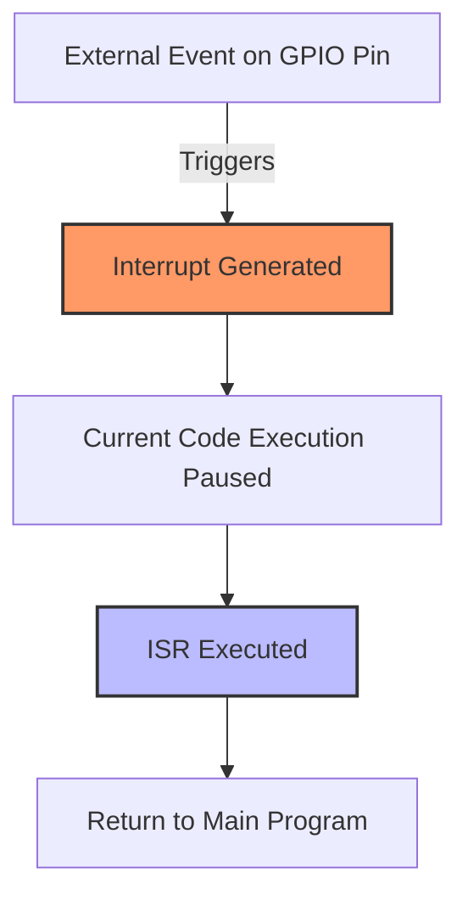

# STM32 GPIO Interrupts

Interrupts are one of the most powerful features in embedded systems programming. They allow your microcontroller to respond immediately to external events without constantly checking (polling) for them. In this tutorial, we'll explore how to set up and use GPIO interrupts on STM32 microcontrollers.

## What are GPIO Interrupts?

GPIO (General Purpose Input/Output) interrupts allow your STM32 microcontroller to detect changes on input pins and immediately execute special code called an **Interrupt Service Routine (ISR)**. This approach is significantly more efficient than continuously checking pin states in your main program loop.



## Why Use GPIO Interrupts?

1. **Power Efficiency**: Your microcontroller can sleep until an event occurs, saving power
2. **Responsive Systems**: Instant reaction to events like button presses
3. **Precise Timing**: Capture exactly when events happen
4. **Resource Optimization**: CPU isn't wasted on constantly checking inputs

## STM32 Interrupt Basics

STM32 microcontrollers support interrupts on most GPIO pins. Each pin can be configured to trigger an interrupt on:

- **Rising edge**: Low to high transition (0→1)
- **Falling edge**: High to low transition (1→0)
- **Both edges**: Any change in state

Let's explore how to implement this functionality.

## Step-by-Step Implementation

### Prerequisites

For this tutorial, you'll need:

- An STM32 development board (e.g., Nucleo, Discovery)
- STM32CubeIDE or similar development environment
- Basic knowledge of STM32 GPIO configuration

### 1. Configure GPIO as Input

First, we need to set up our GPIO pin as an input:

```c
// Initialize GPIO pin as input
GPIO_InitTypeDef GPIO_InitStruct = {0};

// Enable the GPIO clock
__HAL_RCC_GPIOC_CLK_ENABLE();

// Configure GPIO pin PC13 (typically the user button on many STM32 boards)
GPIO_InitStruct.Pin = GPIO_PIN_13;
GPIO_InitStruct.Mode = GPIO_MODE_IT_FALLING;  // Interrupt on falling edge
GPIO_InitStruct.Pull = GPIO_PULLUP;           // Enable pull-up resistor
HAL_GPIO_Init(GPIOC, &GPIO_InitStruct);
```

Notice the `GPIO_MODE_IT_FALLING` parameter. This special mode configures the pin for interrupt detection on a falling edge.

### 2. Configure and Enable the Interrupt

Next, we need to enable the interrupt in the NVIC (Nested Vectored Interrupt Controller):

```c
// Enable the interrupt in the NVIC
HAL_NVIC_SetPriority(EXTI15_10_IRQn, 0, 0);  // Set priority (0 is highest)
HAL_NVIC_EnableIRQ(EXTI15_10_IRQn);          // Enable the interrupt
```

In the STM32 architecture, multiple GPIO pins are grouped into shared external interrupt lines (EXTI). For pin PC13, we use `EXTI15_10_IRQn`, which handles interrupts for pins 10-15.

### 3. Implement the Interrupt Service Routine (ISR)

Now we need to define the function that will be called when the interrupt occurs:

```c
// This function is automatically called when the EXTI15_10 interrupt occurs
void EXTI15_10_IRQHandler(void) {
  // Check if the interrupt is from PC13
  if (__HAL_GPIO_EXTI_GET_IT(GPIO_PIN_13) != RESET) {
    // Clear the interrupt flag
    __HAL_GPIO_EXTI_CLEAR_IT(GPIO_PIN_13);
    
    // Your interrupt handling code goes here
    // For example, toggle an LED
    HAL_GPIO_TogglePin(GPIOA, GPIO_PIN_5);
    
    // Add debounce delay if this is a button press
    HAL_Delay(50);
  }
}
```

### 4. Alternative: Using HAL Callback

The HAL library provides a cleaner way to handle GPIO interrupts through callbacks:

```c
// In your main.c, add this callback function
void HAL_GPIO_EXTI_Callback(uint16_t GPIO_Pin) {
  if (GPIO_Pin == GPIO_PIN_13) {
    // Your interrupt handling code goes here
    // For example, toggle an LED
    HAL_GPIO_TogglePin(GPIOA, GPIO_PIN_5);
  }
}
```

With this approach, you don't need to manually define the `EXTI15_10_IRQHandler`. The HAL library provides this function, which calls your callback.

## Complete Example: Button Interrupt to Toggle LED

Here's a complete example that toggles an LED when a button is pressed:

```c
#include "main.h"

void SystemClock_Config(void);
static void MX_GPIO_Init(void);

int main(void) {
  // Initialize HAL, clock, and GPIOs
  HAL_Init();
  SystemClock_Config();
  MX_GPIO_Init();

  // Main program loop
  while (1) {
    // The main loop can do other tasks or sleep
    // The LED toggling happens in the interrupt handler
    HAL_Delay(100);
  }
}

static void MX_GPIO_Init(void) {
  GPIO_InitTypeDef GPIO_InitStruct = {0};

  // Enable GPIO clocks
  __HAL_RCC_GPIOC_CLK_ENABLE();
  __HAL_RCC_GPIOA_CLK_ENABLE();

  // Configure LED pin (PA5 on many Nucleo boards)
  GPIO_InitStruct.Pin = GPIO_PIN_5;
  GPIO_InitStruct.Mode = GPIO_MODE_OUTPUT_PP;
  GPIO_InitStruct.Pull = GPIO_NOPULL;
  GPIO_InitStruct.Speed = GPIO_SPEED_FREQ_LOW;
  HAL_GPIO_Init(GPIOA, &GPIO_InitStruct);

  // Configure button pin (PC13 on many STM32 boards)
  GPIO_InitStruct.Pin = GPIO_PIN_13;
  GPIO_InitStruct.Mode = GPIO_MODE_IT_FALLING;
  GPIO_InitStruct.Pull = GPIO_PULLUP;
  HAL_GPIO_Init(GPIOC, &GPIO_InitStruct);

  // Enable EXTI interrupt for button
  HAL_NVIC_SetPriority(EXTI15_10_IRQn, 0, 0);
  HAL_NVIC_EnableIRQ(EXTI15_10_IRQn);
}

// Interrupt callback
void HAL_GPIO_EXTI_Callback(uint16_t GPIO_Pin) {
  if (GPIO_Pin == GPIO_PIN_13) {
    // Toggle LED
    HAL_GPIO_TogglePin(GPIOA, GPIO_PIN_5);
    
    // Simple debounce
    HAL_Delay(50);
  }
}
```

## Advanced Concepts

### Interrupt Priority

STM32 microcontrollers support priority levels for interrupts. Higher priority interrupts can interrupt lower priority ones:

```c
// Set interrupt priority (0 is highest, 15 is lowest on most STM32 devices)
HAL_NVIC_SetPriority(EXTI15_10_IRQn, 2, 0);
```

### Debouncing

Physical buttons exhibit "bouncing" - rapid on/off transitions when pressed. There are several approaches to handle this:

1. **Software delay**: Simple but blocks the CPU
   ```c
   void HAL_GPIO_EXTI_Callback(uint16_t GPIO_Pin) {
     if (GPIO_Pin == GPIO_PIN_13) {
       HAL_Delay(50);  // 50ms debounce
       if (HAL_GPIO_ReadPin(GPIOC, GPIO_PIN_13) == GPIO_PIN_RESET) {
         // Button is still pressed after debounce
         HAL_GPIO_TogglePin(GPIOA, GPIO_PIN_5);
       }
     }
   }
   ```

2. **Timer-based debouncing**: More efficient but more complex

### Multiple Interrupt Sources

You can handle multiple interrupt sources in a single callback:

```c
void HAL_GPIO_EXTI_Callback(uint16_t GPIO_Pin) {
  switch (GPIO_Pin) {
    case GPIO_PIN_13:  // Button 1
      // Handle button 1
      break;
    case GPIO_PIN_0:   // Button 2
      // Handle button 2
      break;
    default:
      break;
  }
}
```

## Real-World Application: Emergency Stop Button

Let's implement a simple emergency stop system for a motor:

```c
#include "main.h"

// Global state variable
volatile uint8_t system_running = 0;

int main(void) {
  // Init code here...
  
  // Start the system
  system_running = 1;
  
  while (1) {
    if (system_running) {
      // Normal system operation
      HAL_GPIO_WritePin(MOTOR_GPIO_Port, MOTOR_Pin, GPIO_PIN_SET);
    } else {
      // System stopped
      HAL_GPIO_WritePin(MOTOR_GPIO_Port, MOTOR_Pin, GPIO_PIN_RESET);
    }
    
    HAL_Delay(10);
  }
}

// Configure e-stop button on PA0 with interrupt
static void MX_GPIO_Init(void) {
  GPIO_InitTypeDef GPIO_InitStruct = {0};
  
  __HAL_RCC_GPIOA_CLK_ENABLE();
  
  // E-stop button (PA0)
  GPIO_InitStruct.Pin = GPIO_PIN_0;
  GPIO_InitStruct.Mode = GPIO_MODE_IT_FALLING;
  GPIO_InitStruct.Pull = GPIO_PULLUP;
  HAL_GPIO_Init(GPIOA, &GPIO_InitStruct);
  
  // High priority for emergency stop
  HAL_NVIC_SetPriority(EXTI0_IRQn, 0, 0);
  HAL_NVIC_EnableIRQ(EXTI0_IRQn);
}

// Emergency stop interrupt handler
void HAL_GPIO_EXTI_Callback(uint16_t GPIO_Pin) {
  if (GPIO_Pin == GPIO_PIN_0) {
    // Immediately stop the system
    system_running = 0;
    
    // Visual indication
    for (int i = 0; i < 5; i++) {
      HAL_GPIO_TogglePin(LED_GPIO_Port, LED_Pin);
      HAL_Delay(100);
    }
  }
}
```

## Common Pitfalls and Tips

1. **Keep ISRs Short**: Interrupt handlers should be as brief as possible
2. **Volatile Variables**: Use the `volatile` keyword for variables modified in ISRs
3. **Avoid HAL_Delay in ISRs**: This blocks other interrupts; use flags instead
4. **Critical Sections**: Protect shared resources with critical sections:
   ```c
   __disable_irq();  // Disable all interrupts
   // Critical code here
   __enable_irq();   // Re-enable interrupts
   ```
5. **Interrupt Flags**: Always clear interrupt flags to prevent repeated triggering

## Summary

GPIO interrupts are an essential feature for creating responsive embedded systems:

- They allow immediate response to external events
- They're more power-efficient than polling
- STM32 supports various interrupt trigger conditions (rising, falling, both edges)
- Proper handling includes debouncing, priority management, and keeping ISRs short

With the knowledge from this tutorial, you can now implement event-driven programming in your STM32 projects, creating more efficient and responsive embedded systems.

## Exercises

1. Modify the example code to toggle the LED on both rising and falling edges
2. Implement a counter that increments each time a button is pressed and displays the count on an LED using binary representation
3. Create a system with two buttons - one that starts a timer (LED blinking) and another that stops it
4. Implement edge detection that differentiates between short and long button presses

## Additional Resources

- [STM32 Reference Manual](https://www.st.com/en/microcontrollers-microprocessors/stm32-32-bit-arm-cortex-mcus.html)
- [STM32 HAL Documentation](https://www.st.com/en/development-tools/stm32cubemx.html)
- [ARM Cortex-M Interrupts](https://developer.arm.com/documentation/dui0552/a/the-cortex-m3-processor/exception-model/vector-table)