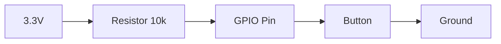
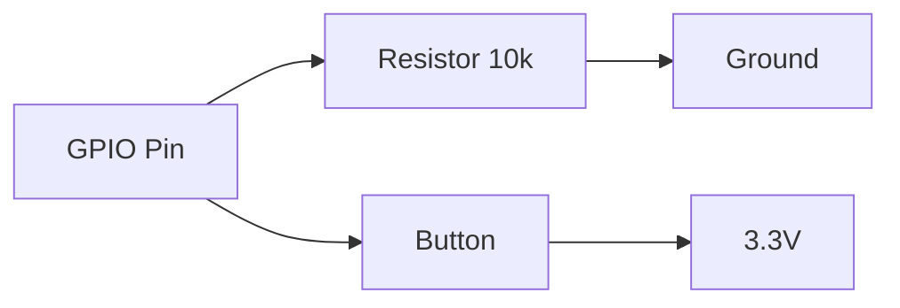

# STM32 Button Interfacing

## Introduction

Button interfaces are fundamental components in embedded systems, allowing users to interact with your device. This tutorial covers how to properly connect and read button inputs on STM32 microcontrollers, which is essential knowledge for any embedded developer.

In this guide, you'll learn:
- How to physically connect buttons to STM32 pins
- How to configure GPIO pins for button input
- Different button reading techniques (polling vs interrupts)
- How to implement debouncing to ensure reliable button readings
- Practical applications for button interfaces in real projects

## Hardware Requirements

To follow along with this tutorial, you'll need:
- An STM32 development board (such as the Nucleo, Discovery, or Blue Pill)
- Push buttons (momentary tactile switches)
- Pull-up or pull-down resistors (typically 10kΩ)
- Breadboard and jumper wires

## Basic Button Circuit

Before diving into code, let's understand how to connect a button to your STM32 microcontroller. There are two common configurations:

### Pull-Up Configuration



In a pull-up configuration:
- The GPIO pin is connected to VCC through a pull-up resistor
- When the button is **not pressed**, the pin reads **HIGH** (1)
- When the button is **pressed**, the pin is connected to ground and reads **LOW** (0)

### Pull-Down Configuration



In a pull-down configuration:
- The GPIO pin is connected to ground through a pull-down resistor
- When the button is **not pressed**, the pin reads **LOW** (0)
- When the button is **pressed**, the pin is connected to VCC and reads **HIGH** (1)

> **Note:** STM32 microcontrollers have internal pull-up and pull-down resistors that can be enabled in software, eliminating the need for external resistors in many cases.

## Configuring GPIO for Button Input

Let's start by setting up a GPIO pin as an input for a button. We'll use the STM32 HAL (Hardware Abstraction Layer) library for this example.

```c
// Include required headers
#include "main.h"

// Button GPIO pin definition
#define BUTTON_PORT GPIOA
#define BUTTON_PIN  GPIO_PIN_0  // Using PA0 as button input

void button_init(void) {
  GPIO_InitTypeDef GPIO_InitStruct = {0};
  
  // Enable clock for GPIOA
  __HAL_RCC_GPIOA_CLK_ENABLE();
  
  // Configure GPIO pin for button
  GPIO_InitStruct.Pin = BUTTON_PIN;
  GPIO_InitStruct.Mode = GPIO_MODE_INPUT;     // Set as input
  GPIO_InitStruct.Pull = GPIO_PULLUP;         // Enable internal pull-up
  GPIO_InitStruct.Speed = GPIO_SPEED_FREQ_LOW;
  
  HAL_GPIO_Init(BUTTON_PORT, &GPIO_InitStruct);
}
```

In this code:
1. We define which GPIO port and pin our button is connected to
2. We enable the clock for the GPIO port
3. We configure the pin as an input with an internal pull-up resistor

## Reading Button State with Polling

The simplest way to read a button state is through polling, where we repeatedly check the pin state in our main loop:

```c
// Function to read button state
uint8_t read_button(void) {
  // Read the button state (inverted because of pull-up)
  return (HAL_GPIO_ReadPin(BUTTON_PORT, BUTTON_PIN) == GPIO_PIN_RESET);
}

int main(void) {
  // System initialization code...
  
  // Initialize button GPIO
  button_init();
  
  while (1) {
    if (read_button()) {
      // Button is pressed, do something
      // For example, toggle an LED
      HAL_GPIO_TogglePin(LED_PORT, LED_PIN);
      
      // Simple delay to avoid multiple toggles from a single press
      HAL_Delay(200);
    }
    
    // Other tasks...
  }
}
```

> **Important:** Notice that since we're using a pull-up configuration, the button logic is inverted: GPIO_PIN_RESET (0) means the button is pressed, and GPIO_PIN_SET (1) means it's not pressed.

## Button Debouncing

Mechanical buttons have a problem called "bouncing" - when pressed or released, they don't immediately settle into a stable state but instead "bounce" between open and closed for a short period (typically 10-50ms).

Here's a simple debouncing function:

```c
uint8_t debounce_button(void) {
  static uint32_t last_debounce_time = 0;
  static uint8_t button_state = 0;
  static uint8_t last_reading = 0;
  uint8_t reading = HAL_GPIO_ReadPin(BUTTON_PORT, BUTTON_PIN) == GPIO_PIN_RESET;
  
  // If the button state changed
  if (reading != last_reading) {
    // Reset debounce timer
    last_debounce_time = HAL_GetTick();
  }
  
  // Check if debounce delay has passed (50ms)
  if ((HAL_GetTick() - last_debounce_time) > 50) {
    // If the button state has changed
    if (reading != button_state) {
      button_state = reading;
    }
  }
  
  last_reading = reading;
  return button_state;
}
```

Then, in your main loop:

```c
int main(void) {
  // System initialization code...
  button_init();
  
  while (1) {
    if (debounce_button()) {
      // Debounced button press detected
      // Your action here
    }
    
    // Other tasks...
  }
}
```

## Using Interrupts for Button Handling

Polling is simple but inefficient. Using interrupts allows the microcontroller to react to button presses immediately while doing other tasks in between:

```c
// Initialize button with interrupt
void button_interrupt_init(void) {
  GPIO_InitTypeDef GPIO_InitStruct = {0};
  
  // Enable clock for GPIOA
  __HAL_RCC_GPIOA_CLK_ENABLE();
  
  // Configure GPIO pin for button with interrupt
  GPIO_InitStruct.Pin = BUTTON_PIN;
  GPIO_InitStruct.Mode = GPIO_MODE_IT_FALLING;  // Interrupt on falling edge (button press with pull-up)
  GPIO_InitStruct.Pull = GPIO_PULLUP;
  
  HAL_GPIO_Init(BUTTON_PORT, &GPIO_InitStruct);
  
  // Enable and set EXTI interrupt priority
  HAL_NVIC_SetPriority(EXTI0_IRQn, 1, 0);
  HAL_NVIC_EnableIRQ(EXTI0_IRQn);
}

// Button press flag
volatile uint8_t button_pressed = 0;

// Interrupt handler for EXTI line 0
void EXTI0_IRQHandler(void) {
  HAL_GPIO_EXTI_IRQHandler(BUTTON_PIN);
}

// Callback function (will be called by the HAL after an interrupt)
void HAL_GPIO_EXTI_Callback(uint16_t GPIO_Pin) {
  if (GPIO_Pin == BUTTON_PIN) {
    // Simple debouncing with a 50ms delay
    static uint32_t last_interrupt_time = 0;
    uint32_t current_time = HAL_GetTick();
    
    if (current_time - last_interrupt_time > 50) {
      button_pressed = 1;
    }
    
    last_interrupt_time = current_time;
  }
}

int main(void) {
  // System initialization code...
  
  // Initialize button with interrupt
  button_interrupt_init();
  
  while (1) {
    if (button_pressed) {
      // Handle button press
      // For example, toggle an LED
      HAL_GPIO_TogglePin(LED_PORT, LED_PIN);
      
      // Reset the flag
      button_pressed = 0;
    }
    
    // Other tasks...
    // The system can do other work while waiting for button presses
  }
}
```

## Advanced Button Techniques

### Detecting Button Events

You might want to detect different button events such as:
- Single press
- Double press
- Long press
- Release

Here's a more comprehensive button handling function:

```c
// Button event types
typedef enum {
  BUTTON_NONE,
  BUTTON_PRESS,
  BUTTON_RELEASE,
  BUTTON_LONG_PRESS,
  BUTTON_DOUBLE_PRESS
} ButtonEvent;

// Button state structure
typedef struct {
  uint8_t current_state;
  uint8_t previous_state;
  uint32_t press_time;
  uint32_t release_time;
  uint8_t press_count;
} ButtonState;

ButtonState button = {0};

ButtonEvent check_button_events(void) {
  ButtonEvent event = BUTTON_NONE;
  uint8_t current_reading = HAL_GPIO_ReadPin(BUTTON_PORT, BUTTON_PIN) == GPIO_PIN_RESET;
  uint32_t current_time = HAL_GetTick();
  
  // Detect state change with debouncing
  if (current_reading != button.current_state) {
    // Wait for debounce time (50ms)
    HAL_Delay(50);
    
    // Read again after debounce
    current_reading = HAL_GPIO_ReadPin(BUTTON_PORT, BUTTON_PIN) == GPIO_PIN_RESET;
    
    if (current_reading != button.current_state) {
      button.previous_state = button.current_state;
      button.current_state = current_reading;
      
      if (button.current_state) {
        // Button press detected
        button.press_time = current_time;
        button.press_count++;
        event = BUTTON_PRESS;
      } else {
        // Button release detected
        button.release_time = current_time;
        
        // Check if it was a long press (press time > 1000ms)
        if (button.release_time - button.press_time > 1000) {
          event = BUTTON_LONG_PRESS;
          button.press_count = 0;
        } else {
          event = BUTTON_RELEASE;
          
          // Check for double press (two presses within 300ms)
          if (button.press_count >= 2 && button.release_time - button.press_time < 300) {
            event = BUTTON_DOUBLE_PRESS;
            button.press_count = 0;
          }
        }
      }
    }
  }
  
  // Reset press count if too much time has passed since last press
  if (!button.current_state && button.press_count > 0 && current_time - button.release_time > 500) {
    button.press_count = 0;
  }
  
  return event;
}
```

You can use this function in your main loop to detect different button events:

```c
int main(void) {
  // System initialization code...
  button_init();
  
  while (1) {
    ButtonEvent event = check_button_events();
    
    switch (event) {
      case BUTTON_PRESS:
        // Handle button press
        break;
      case BUTTON_RELEASE:
        // Handle button release
        break;
      case BUTTON_LONG_PRESS:
        // Handle long press
        break;
      case BUTTON_DOUBLE_PRESS:
        // Handle double press
        break;
      default:
        // No event
        break;
    }
    
    // Other tasks...
  }
}
```

## Practical Application: Menu Navigation System

Let's create a simple menu navigation system using a single button:

```c
typedef enum {
  MENU_MAIN,
  MENU_SETTINGS,
  MENU_BRIGHTNESS,
  MENU_VOLUME
} MenuState;

// Navigate through menu with a single button
void navigate_menu(void) {
  static MenuState current_menu = MENU_MAIN;
  ButtonEvent event = check_button_events();
  
  switch (event) {
    case BUTTON_PRESS:
      // Short press: move to next menu item
      switch (current_menu) {
        case MENU_MAIN:
          current_menu = MENU_SETTINGS;
          display_text("Settings Menu");
          break;
        case MENU_SETTINGS:
          current_menu = MENU_BRIGHTNESS;
          display_text("Brightness Menu");
          break;
        case MENU_BRIGHTNESS:
          current_menu = MENU_VOLUME;
          display_text("Volume Menu");
          break;
        case MENU_VOLUME:
          current_menu = MENU_MAIN;
          display_text("Main Menu");
          break;
      }
      break;
      
    case BUTTON_LONG_PRESS:
      // Long press: enter selected menu or go back to main
      if (current_menu == MENU_MAIN) {
        display_text("Entering Main Menu...");
        // Perform main menu action
      } else if (current_menu == MENU_SETTINGS) {
        display_text("Entering Settings...");
        // Perform settings action
      } else if (current_menu == MENU_BRIGHTNESS) {
        display_text("Adjusting Brightness...");
        // Adjust brightness
      } else if (current_menu == MENU_VOLUME) {
        display_text("Adjusting Volume...");
        // Adjust volume
      }
      break;
      
    case BUTTON_DOUBLE_PRESS:
      // Double press: return to main menu from any submenu
      current_menu = MENU_MAIN;
      display_text("Main Menu");
      break;
      
    default:
      // No event
      break;
  }
}
```

This example shows how different button events can be used to create an intuitive menu navigation system with just a single button.

## Multiple Buttons

For more complex interfaces, you might need multiple buttons. Here's how to handle multiple buttons:

```c
// Define multiple buttons
#define BUTTON1_PORT GPIOA
#define BUTTON1_PIN  GPIO_PIN_0
#define BUTTON2_PORT GPIOA
#define BUTTON2_PIN  GPIO_PIN_1
#define BUTTON3_PORT GPIOA
#define BUTTON3_PIN  GPIO_PIN_2

// Initialize multiple buttons
void buttons_init(void) {
  GPIO_InitTypeDef GPIO_InitStruct = {0};
  
  // Enable clock for GPIOA
  __HAL_RCC_GPIOA_CLK_ENABLE();
  
  // Configure GPIO pins for buttons
  GPIO_InitStruct.Mode = GPIO_MODE_INPUT;
  GPIO_InitStruct.Pull = GPIO_PULLUP;
  GPIO_InitStruct.Speed = GPIO_SPEED_FREQ_LOW;
  
  GPIO_InitStruct.Pin = BUTTON1_PIN;
  HAL_GPIO_Init(BUTTON1_PORT, &GPIO_InitStruct);
  
  GPIO_InitStruct.Pin = BUTTON2_PIN;
  HAL_GPIO_Init(BUTTON2_PORT, &GPIO_InitStruct);
  
  GPIO_InitStruct.Pin = BUTTON3_PIN;
  HAL_GPIO_Init(BUTTON3_PORT, &GPIO_InitStruct);
}

// Read the state of a specific button
uint8_t read_button_n(GPIO_TypeDef* port, uint16_t pin) {
  return (HAL_GPIO_ReadPin(port, pin) == GPIO_PIN_RESET);
}

// Example usage in main loop
int main(void) {
  // System initialization code...
  buttons_init();
  
  while (1) {
    if (read_button_n(BUTTON1_PORT, BUTTON1_PIN)) {
      // Button 1 pressed
      // For example, menu up
      menu_up();
      HAL_Delay(200); // Simple debounce
    }
    
    if (read_button_n(BUTTON2_PORT, BUTTON2_PIN)) {
      // Button 2 pressed
      // For example, menu down
      menu_down();
      HAL_Delay(200); // Simple debounce
    }
    
    if (read_button_n(BUTTON3_PORT, BUTTON3_PIN)) {
      // Button 3 pressed
      // For example, menu select
      menu_select();
      HAL_Delay(200); // Simple debounce
    }
    
    // Other tasks...
  }
}
```

## Summary

In this tutorial, you've learned:

1. **Button Circuit Basics**: How to connect buttons to STM32 pins using pull-up or pull-down configurations
2. **GPIO Configuration**: How to set up GPIO pins for button input
3. **Button Reading Techniques**:
   - Simple polling
   - Interrupt-based approaches
4. **Debouncing**: How to implement software debouncing to get reliable button readings
5. **Advanced Button Handling**:
   - Detecting various button events (press, release, long press, double press)
   - Creating a menu navigation system with buttons
   - Working with multiple buttons

Button interfacing is a fundamental skill in embedded development that opens up numerous possibilities for creating interactive devices. With the techniques covered in this tutorial, you can now implement reliable button interfaces in your STM32 projects.

## Exercises

1. Implement a simple counter that increments when a button is pressed and displays the count on an LED (binary) or an LCD.
2. Create a password system using a sequence of button presses (like a simple version of the Simon game).
3. Build a stopwatch with start/stop and reset functionality using two buttons.
4. Implement a system where a long press powers the device into a low-power mode.
5. Add button control to an existing project to enhance user interaction.

## Additional Resources

- STM32 HAL Documentation for GPIO
- [STM32 Reference Manual](https://www.st.com/resource/en/reference_manual/) (specific to your STM32 family)
- [Application Note AN4899: Debouncing techniques for buttons and switches](https://www.st.com/resource/en/application_note/an4899-debouncing-techniques-for-buttons-and-switches-stmicroelectronics.pdf)
- [HAL Library User Manual](https://www.st.com/resource/en/user_manual/)