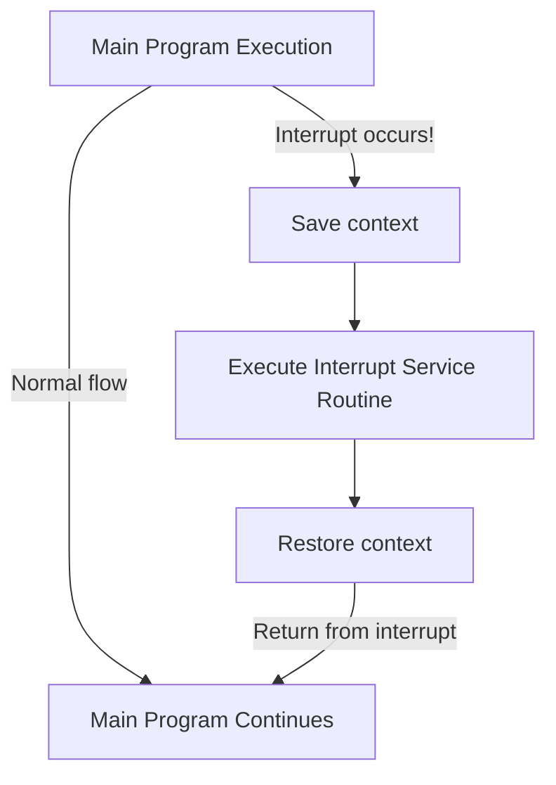
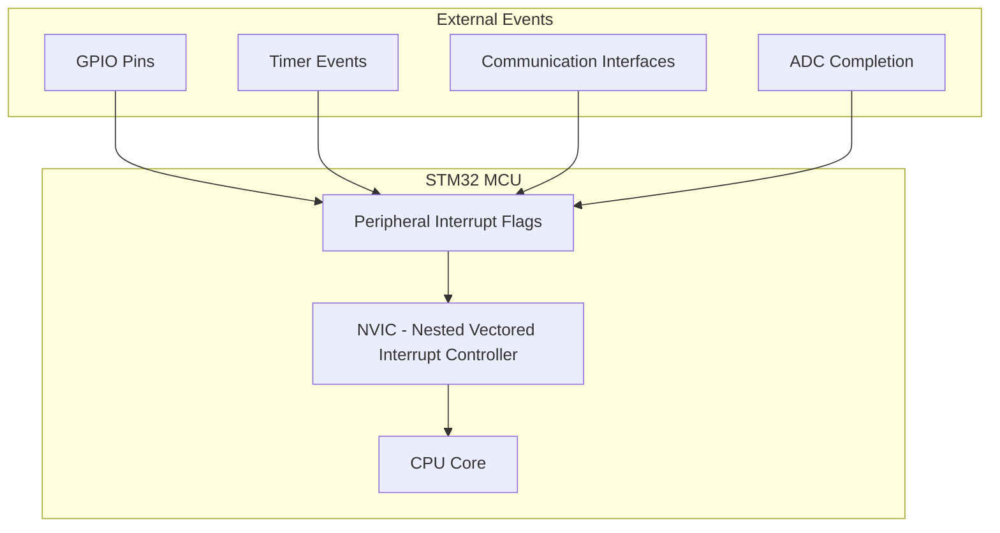

# STM32 Interrupt Basics

## Introduction

Interrupts are one of the most powerful features of microcontrollers, allowing them to respond immediately to important events without constantly polling for changes. In STM32 microcontrollers, the interrupt system provides a flexible way to handle various events efficiently, from external pin changes to timer overflows and communication events.

This guide will introduce you to the fundamental concepts of interrupts in STM32 microcontrollers and demonstrate how to implement them in your projects.

## What Are Interrupts?

An interrupt is a signal that temporarily pauses the normal execution of your program to run a special function called an **Interrupt Service Routine (ISR)** in response to an event. Once the ISR completes its task, the program returns to where it left off.



Interrupts are like a doorbell – you don't need to keep checking if someone is at the door; the bell will alert you when someone arrives.

## Why Use Interrupts?

Interrupts offer several advantages:

1. **Efficiency**: No need to continuously check (poll) for events
2. **Responsiveness**: Immediate reaction to events
3. **Power saving**: MCU can enter low-power modes and wake up on interrupts
4. **Real-time capabilities**: Critical events can be handled promptly
5. **Resource optimization**: CPU time is only used when necessary

## STM32 Interrupt System Architecture

STM32 microcontrollers use a Nested Vectored Interrupt Controller (NVIC), which is part of the ARM Cortex-M core. The NVIC provides:

- Individual enable/disable for each interrupt source
- Programmable priority levels for each interrupt
- Automatic handling of nested interrupts (higher priority interrupts can interrupt lower ones)
- Vector table with predefined memory locations for interrupt handlers



## Interrupt Concepts in STM32

### 1. Interrupt Sources

STM32 microcontrollers have many interrupt sources, including:

- External pins (EXTI lines)
- Timers (overflow, capture, compare)
- Communication peripherals (UART, SPI, I2C)
- ADC conversion complete
- System events (SysTick, system exceptions)

### 2. Interrupt Priority

Each interrupt in STM32 has a programmable priority level. When multiple interrupts occur simultaneously, the one with the highest priority is serviced first.

STM32 microcontrollers typically support 16 priority levels (0-15), with 0 being the highest priority.

### 3. Interrupt Vector Table

This is a memory structure that contains the addresses of all interrupt handlers. When an interrupt occurs, the processor automatically looks up the corresponding handler address in the vector table.

### 4. NVIC Functions

STM32HAL provides convenient functions to configure interrupts:

- `HAL_NVIC_EnableIRQ()`: Enable an interrupt
- `HAL_NVIC_DisableIRQ()`: Disable an interrupt
- `HAL_NVIC_SetPriority()`: Set interrupt priority
- `HAL_NVIC_SystemReset()`: System reset

## Implementing Basic Interrupts in STM32

Let's explore how to implement a simple interrupt-based system:

### Example 1: Button Interrupt

This example demonstrates how to set up an external interrupt for a pushbutton and toggle an LED when the button is pressed.

```c
/* Include necessary header files */
#include "main.h"

/* Define pins */
#define LED_PIN GPIO_PIN_5
#define LED_PORT GPIOA
#define BUTTON_PIN GPIO_PIN_13
#define BUTTON_PORT GPIOC

/* Function prototypes */
void SystemClock_Config(void);
void GPIO_Init(void);
void EXTI_Init(void);

int main(void)
{
  /* Reset of all peripherals, initialize the Flash interface and Systick */
  HAL_Init();
  
  /* Configure the system clock */
  SystemClock_Config();
  
  /* Initialize GPIO pins */
  GPIO_Init();
  
  /* Initialize external interrupts */
  EXTI_Init();
  
  /* Infinite loop */
  while (1)
  {
    /* Main program can do other tasks or enter low power mode */
    HAL_PWR_EnterSLEEPMode(PWR_MAINREGULATOR_ON, PWR_SLEEPENTRY_WFI);
  }
}

/* GPIO initialization function */
void GPIO_Init(void)
{
  GPIO_InitTypeDef GPIO_InitStruct = {0};
  
  /* Enable GPIO clocks */
  __HAL_RCC_GPIOA_CLK_ENABLE();
  __HAL_RCC_GPIOC_CLK_ENABLE();
  
  /* Configure LED pin */
  GPIO_InitStruct.Pin = LED_PIN;
  GPIO_InitStruct.Mode = GPIO_MODE_OUTPUT_PP;
  GPIO_InitStruct.Pull = GPIO_NOPULL;
  GPIO_InitStruct.Speed = GPIO_SPEED_FREQ_LOW;
  HAL_GPIO_Init(LED_PORT, &GPIO_InitStruct);
  
  /* Configure button pin */
  GPIO_InitStruct.Pin = BUTTON_PIN;
  GPIO_InitStruct.Mode = GPIO_MODE_IT_FALLING;  /* Interrupt on falling edge */
  GPIO_InitStruct.Pull = GPIO_PULLUP;
  HAL_GPIO_Init(BUTTON_PORT, &GPIO_InitStruct);
}

/* External interrupt initialization function */
void EXTI_Init(void)
{
  /* Enable SYSCFG clock for EXTI */
  __HAL_RCC_SYSCFG_CLK_ENABLE();
  
  /* Set interrupt priority */
  HAL_NVIC_SetPriority(EXTI15_10_IRQn, 0, 0);
  
  /* Enable the external interrupt */
  HAL_NVIC_EnableIRQ(EXTI15_10_IRQn);
}

/* EXTI line interrupt handler */
void EXTI15_10_IRQHandler(void)
{
  /* Check if interrupt was triggered by our button (EXTI line 13) */
  if(__HAL_GPIO_EXTI_GET_IT(BUTTON_PIN) != RESET)
  {
    /* Toggle LED */
    HAL_GPIO_TogglePin(LED_PORT, LED_PIN);
    
    /* Clear the interrupt flag */
    __HAL_GPIO_EXTI_CLEAR_IT(BUTTON_PIN);
    
    /* Add small delay for debouncing (optional) */
    for(volatile uint32_t i = 0; i < 10000; i++);
  }
}
```

Let's break down the key elements of this code:

1. We configure the button pin as an interrupt input using `GPIO_MODE_IT_FALLING`
2. We enable the NVIC for the EXTI line connected to our button
3. When the button is pressed, the EXTI15_10_IRQHandler is called automatically
4. Inside the handler, we toggle the LED and clear the interrupt flag

### Example 2: Timer Interrupt

This example shows how to set up a timer interrupt to execute code at regular intervals.

```c
/* Include necessary header files */
#include "main.h"

/* Timer handle */
TIM_HandleTypeDef htim2;

/* Function prototypes */
void SystemClock_Config(void);
void GPIO_Init(void);
void Timer_Init(void);

int main(void)
{
  /* Reset of all peripherals, initialize the Flash interface and Systick */
  HAL_Init();
  
  /* Configure the system clock */
  SystemClock_Config();
  
  /* Initialize GPIO pins */
  GPIO_Init();
  
  /* Initialize timer */
  Timer_Init();
  
  /* Start the timer */
  HAL_TIM_Base_Start_IT(&htim2);
  
  /* Infinite loop */
  while (1)
  {
    /* Main program continues normally */
  }
}

/* GPIO initialization function */
void GPIO_Init(void)
{
  GPIO_InitTypeDef GPIO_InitStruct = {0};
  
  /* Enable GPIO clock */
  __HAL_RCC_GPIOA_CLK_ENABLE();
  
  /* Configure LED pin */
  GPIO_InitStruct.Pin = GPIO_PIN_5;
  GPIO_InitStruct.Mode = GPIO_MODE_OUTPUT_PP;
  GPIO_InitStruct.Pull = GPIO_NOPULL;
  GPIO_InitStruct.Speed = GPIO_SPEED_FREQ_LOW;
  HAL_GPIO_Init(GPIOA, &GPIO_InitStruct);
}

/* Timer initialization function */
void Timer_Init(void)
{
  TIM_ClockConfigTypeDef sClockSourceConfig = {0};
  
  /* Enable timer clock */
  __HAL_RCC_TIM2_CLK_ENABLE();
  
  /* Basic timer configuration */
  htim2.Instance = TIM2;
  htim2.Init.Prescaler = 8000 - 1;         /* 8 MHz / 8000 = 1 KHz */
  htim2.Init.CounterMode = TIM_COUNTERMODE_UP;
  htim2.Init.Period = 1000 - 1;            /* 1 KHz / 1000 = 1 Hz (1 second) */
  htim2.Init.ClockDivision = TIM_CLOCKDIVISION_DIV1;
  htim2.Init.AutoReloadPreload = TIM_AUTORELOAD_PRELOAD_ENABLE;
  
  if (HAL_TIM_Base_Init(&htim2) != HAL_OK)
  {
    Error_Handler();
  }
  
  /* Setup clock source */
  sClockSourceConfig.ClockSource = TIM_CLOCKSOURCE_INTERNAL;
  if (HAL_TIM_ConfigClockSource(&htim2, &sClockSourceConfig) != HAL_OK)
  {
    Error_Handler();
  }
  
  /* Enable TIM2 global interrupt */
  HAL_NVIC_SetPriority(TIM2_IRQn, 0, 0);
  HAL_NVIC_EnableIRQ(TIM2_IRQn);
}

/* Timer interrupt handler */
void TIM2_IRQHandler(void)
{
  HAL_TIM_IRQHandler(&htim2);
}

/* Timer period elapsed callback */
void HAL_TIM_PeriodElapsedCallback(TIM_HandleTypeDef *htim)
{
  /* Check which timer triggered this callback */
  if (htim->Instance == TIM2)
  {
    /* Toggle LED */
    HAL_GPIO_TogglePin(GPIOA, GPIO_PIN_5);
  }
}
```

In this example:

1. We configure TIM2 with a prescaler and period to create a 1-second interval
2. We enable the timer interrupt using HAL_TIM_Base_Start_IT
3. When the timer reaches its period value, TIM2_IRQHandler is called
4. HAL_TIM_IRQHandler then calls our HAL_TIM_PeriodElapsedCallback function
5. In the callback, we toggle the LED

## Interrupt Best Practices

1. **Keep ISRs short and fast**: Interrupt handlers should execute quickly
2. **Avoid blocking operations**: Don't use delay functions or infinite loops in ISRs
3. **Use volatile for shared variables**: If a variable is modified in an ISR and used in the main program, declare it as `volatile`
4. **Implement proper debouncing**: For button interrupts, implement debouncing to prevent false triggers
5. **Set appropriate priorities**: Critical interrupts should have higher priorities
6. **Use flags instead of heavy processing**: Set flags in ISRs and handle complex processing in the main loop

### Example of Using Flags:

```c
/* Global volatile flag */
volatile uint8_t button_pressed = 0;

/* In the interrupt handler */
void EXTI15_10_IRQHandler(void)
{
  if(__HAL_GPIO_EXTI_GET_IT(BUTTON_PIN) != RESET)
  {
    /* Set flag instead of doing work directly */
    button_pressed = 1;
    
    /* Clear interrupt flag */
    __HAL_GPIO_EXTI_CLEAR_IT(BUTTON_PIN);
  }
}

/* In the main loop */
while(1)
{
  /* Check if flag was set by interrupt */
  if(button_pressed)
  {
    /* Do time-consuming work here */
    process_button_press();
    
    /* Reset flag */
    button_pressed = 0;
  }
  
  /* Continue with other tasks */
}
```

## Common Interrupt Related Issues

1. **Missing volatile keyword**: Leads to unpredictable behavior when variables are shared between ISRs and main code
2. **Not clearing interrupt flags**: Causes interrupt handlers to be called repeatedly
3. **Interrupt priority conflicts**: Can cause critical interrupts to be delayed
4. **Interrupt handler not defined**: Results in a hard fault when the interrupt occurs
5. **Stack overflow**: If ISRs use too much stack or interrupts nest too deeply

## STM32 Specific Interrupt Configuration

### Using STM32CubeMX

STM32CubeMX provides a graphical way to configure interrupts:

1. Select the peripheral you want to use (e.g., GPIO, Timer)
2. Enable the interrupt in the peripheral configuration
3. Configure the NVIC settings (priority, sub-priority)
4. Generate the code

### Manual Configuration Steps

To manually configure an interrupt:

1. Configure the peripheral to generate interrupts
2. Configure the NVIC (enable and set priority)
3. Implement the interrupt handler

## Summary

Interrupts are a powerful feature of STM32 microcontrollers that allow responsive, efficient handling of events. Key points to remember:

- Interrupts pause normal program execution to handle important events
- STM32 uses the NVIC to manage multiple interrupt sources with different priorities
- Interrupt handlers should be kept short and efficient
- Use flags for communication between ISRs and the main program
- Proper configuration involves peripheral setup, NVIC setup, and handler implementation

By mastering interrupts, you can create STM32 applications that are more responsive, power-efficient, and capable of real-time operation.

## Exercises

1. Modify the button interrupt example to count button presses and display the count on multiple LEDs
2. Create a timer interrupt that runs at 100Hz and implement a software PWM for an LED
3. Implement a debounce algorithm for a button using interrupts and a timer
4. Set up two interrupt sources with different priorities and observe how they interact
5. Create a power-efficient application that sleeps most of the time and wakes up on an interrupt

## Additional Resources

- STM32 Reference Manual (RM0383 for STM32F411 or similar for your specific MCU)
- STM32 HAL Driver Documentation
- ARM Cortex-M4 Generic User Guide
- ST Community Forums for specific interrupt questions