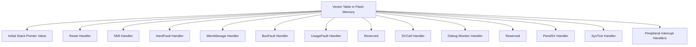

# STM32 Interrupt Vectors

## Introduction

Interrupt vectors are a fundamental concept in embedded systems programming, particularly when working with STM32 microcontrollers. They serve as the backbone of the interrupt handling mechanism, allowing your microcontroller to respond to various events promptly and efficiently.

An interrupt vector is essentially a memory address that points to the function (handler) that should be executed when a specific interrupt occurs. The STM32 microcontrollers organize these vectors in a table called the **Interrupt Vector Table (IVT)**, which resides at the beginning of the flash memory.

In this tutorial, we'll explore how interrupt vectors work in STM32 microcontrollers, how they're organized, and how to configure them properly in your applications.

## Understanding the STM32 Vector Table

### Vector Table Structure

The vector table in STM32 microcontrollers is a fixed-size array of function pointers located at the beginning of the flash memory (address 0x08000000). The first entry in this table is typically the initial stack pointer value, followed by the reset handler. The subsequent entries are pointers to various exception and interrupt handlers.



The first 16 entries are reserved for system exceptions, while the remaining entries are for peripheral-specific interrupts (like USART, I2C, GPIO, etc.).

### Examining the Vector Table

Here's a simplified representation of the vector table structure in STM32 microcontrollers:

```c
__attribute__((section(".isr_vector")))
void (* const g_pfnVectors[])(void) = {
    (void *)&_estack,                   // Initial Stack Pointer Value
    Reset_Handler,                      // Reset Handler
    NMI_Handler,                        // NMI Handler
    HardFault_Handler,                  // Hard Fault Handler
    MemManage_Handler,                  // MPU Fault Handler
    BusFault_Handler,                   // Bus Fault Handler
    UsageFault_Handler,                 // Usage Fault Handler
    0,                                  // Reserved
    0,                                  // Reserved
    0,                                  // Reserved
    0,                                  // Reserved
    SVC_Handler,                        // SVCall Handler
    DebugMon_Handler,                   // Debug Monitor Handler
    0,                                  // Reserved
    PendSV_Handler,                     // PendSV Handler
    SysTick_Handler,                    // SysTick Handler
    
    // External Interrupts
    WWDG_IRQHandler,                    // Window Watchdog
    PVD_IRQHandler,                     // PVD through EXTI Line detection
    TAMP_STAMP_IRQHandler,              // Tamper and TimeStamp
    RTC_WKUP_IRQHandler,                // RTC Wakeup
    FLASH_IRQHandler,                   // Flash
    RCC_IRQHandler,                     // RCC
    EXTI0_IRQHandler,                   // EXTI Line0
    // ...and so on for other peripheral interrupts
};
```

In this example, `g_pfnVectors` is an array of function pointers, and the `__attribute__((section(".isr_vector")))` directive ensures that this array is placed at the beginning of the flash memory.

## System Exceptions vs. Peripheral Interrupts

In STM32 microcontrollers, interrupts are divided into two main categories:

1. **System Exceptions**: These are core exceptions generated by the ARM Cortex-M processor itself. Examples include Reset, NMI, HardFault, and SysTick.

2. **Peripheral Interrupts**: These are generated by the STM32-specific peripherals like GPIO, USART, I2C, etc.

### System Exceptions

The system exceptions have fixed positions in the vector table:

| Position | Exception Type | Description |
|----------|---------------|-------------|
| 1 | Reset | Called on system reset |
| 2 | NMI | Non-maskable interrupt |
| 3 | HardFault | All fault handlers |
| 4 | MemManage | Memory protection related faults |
| 5 | BusFault | Memory access related faults |
| 6 | UsageFault | Instruction execution faults |
| 11 | SVCall | System service call via SWI instruction |
| 12 | DebugMonitor | Debug monitor handler |
| 14 | PendSV | Pendable request for system service |
| 15 | SysTick | System tick timer |

### Peripheral Interrupts

Peripheral interrupts start from position 16 in the vector table. Their order and number vary depending on the specific STM32 microcontroller model you're using.

For example, in the STM32F4 series, the first few peripheral interrupts are:

| Position | Interrupt | Description |
|----------|-----------|-------------|
| 16 | WWDG | Window watchdog interrupt |
| 17 | PVD | PVD through EXTI line detection interrupt |
| 18 | TAMP_STAMP | Tamper and TimeStamp interrupts through EXTI line |
| 19 | RTC_WKUP | RTC wakeup interrupt through EXTI line |
| 20 | FLASH | Flash global interrupt |
| 21 | RCC | RCC global interrupt |
| 22 | EXTI0 | EXTI Line0 interrupt |
| ... | ... | ... |

## IRQ Numbers and Vector Addresses

Each interrupt source in an STM32 microcontroller is assigned a unique **IRQ number**. This IRQ number is used to determine the position of the corresponding handler in the vector table.

The relationship between the IRQ number and the vector address is:

```
Vector Address = VTOR + (IRQ Number + 16) * 4
```

Where:
- **VTOR** is the Vector Table Offset Register, which contains the base address of the vector table.
- **16** is added because the first 16 entries are reserved for system exceptions.
- **4** is the size of each vector entry (4 bytes for a 32-bit address).

For example, if the VTOR is 0x08000000 and the IRQ number for USART1 is 37, then the vector address for USART1 would be:

```
Vector Address = 0x08000000 + (37 + 16) * 4 = 0x08000000 + 212 = 0x080000D4
```

## Working with Interrupt Vectors

### Default Handlers

In most STM32 development environments, default handlers for all exceptions and interrupts are provided. These default handlers typically enter an infinite loop, which will cause the system to hang if the corresponding interrupt occurs.

```c
void USART1_IRQHandler(void)
{
    /* USER CODE BEGIN USART1_IRQn 0 */

    /* USER CODE END USART1_IRQn 0 */
    /* USER CODE BEGIN USART1_IRQn 1 */

    /* USER CODE END USART1_IRQn 1 */
}
```

### Implementing Custom Handlers

To implement a custom handler for a specific interrupt, you need to define the corresponding function with the exact name expected in the vector table. For example, to handle USART1 interrupts:

```c
void USART1_IRQHandler(void)
{
    // Check if we received data
    if (USART1->SR & USART_SR_RXNE) {
        // Read the received data
        uint8_t data = USART1->DR;
        
        // Process the data
        process_data(data);
        
        // Clear the interrupt flag (automatically done when reading DR)
    }
}
```

### Enabling Interrupts

To enable a specific interrupt, you need to:

1. Configure the peripheral to generate an interrupt.
2. Set the priority of the interrupt using the Nested Vectored Interrupt Controller (NVIC).
3. Enable the interrupt in the NVIC.

Here's an example for USART1:

```c
void USART1_Setup(void)
{
    // Configure USART1
    USART1->CR1 |= USART_CR1_UE;        // Enable USART
    USART1->CR1 |= USART_CR1_RXNEIE;    // Enable RXNE interrupt
    
    // Set priority (0 is highest, 15 is lowest)
    NVIC_SetPriority(USART1_IRQn, 10);
    
    // Enable the interrupt in NVIC
    NVIC_EnableIRQ(USART1_IRQn);
}
```

## Real-World Example: Button Interrupt

Let's implement a real-world example where we configure a button to trigger an interrupt that toggles an LED.

### Hardware Setup

- Connect a push button to pin PA0 (configured as EXTI0)
- Connect an LED to pin PB5

### Code Implementation

```c
#include "stm32f4xx.h"

// LED state
volatile uint8_t led_state = 0;

// Button interrupt handler
void EXTI0_IRQHandler(void)
{
    // Check if EXTI0 interrupt pending flag is set
    if (EXTI->PR & EXTI_PR_PR0) {
        // Toggle LED state
        led_state = !led_state;
        
        // Set or clear LED pin based on state
        if (led_state) {
            GPIOB->BSRR = GPIO_BSRR_BS5;  // Set PB5 (LED ON)
        } else {
            GPIOB->BSRR = GPIO_BSRR_BR5;  // Reset PB5 (LED OFF)
        }
        
        // Clear the interrupt pending flag
        EXTI->PR = EXTI_PR_PR0;
    }
}

int main(void)
{
    // Enable GPIOA and GPIOB clocks
    RCC->AHB1ENR |= RCC_AHB1ENR_GPIOAEN | RCC_AHB1ENR_GPIOBEN;
    
    // Enable SYSCFG clock (needed for EXTI configuration)
    RCC->APB2ENR |= RCC_APB2ENR_SYSCFGEN;
    
    // Configure PA0 as input with pull-up
    GPIOA->MODER &= ~GPIO_MODER_MODER0;  // Input mode
    GPIOA->PUPDR |= GPIO_PUPDR_PUPDR0_0; // Pull-up
    
    // Configure PB5 as output
    GPIOB->MODER |= GPIO_MODER_MODER5_0;  // Output mode
    GPIOB->OTYPER &= ~GPIO_OTYPER_OT5;    // Push-pull
    GPIOB->OSPEEDR |= GPIO_OSPEEDER_OSPEEDR5_0; // Medium speed
    
    // Connect PA0 to EXTI0
    SYSCFG->EXTICR[0] &= ~SYSCFG_EXTICR1_EXTI0;
    SYSCFG->EXTICR[0] |= SYSCFG_EXTICR1_EXTI0_PA;
    
    // Configure EXTI0 to trigger on falling edge
    EXTI->FTSR |= EXTI_FTSR_TR0;  // Falling trigger enabled
    EXTI->RTSR &= ~EXTI_RTSR_TR0; // Rising trigger disabled
    EXTI->IMR |= EXTI_IMR_MR0;    // Interrupt mask register
    
    // Set priority for EXTI0 interrupt
    NVIC_SetPriority(EXTI0_IRQn, 0);
    
    // Enable EXTI0 interrupt in NVIC
    NVIC_EnableIRQ(EXTI0_IRQn);
    
    // Main loop
    while (1) {
        // The main program can do other tasks here
        // The LED toggling is handled by the interrupt
    }
}
```

### Output

When you press the button connected to PA0, an interrupt is triggered, and the LED connected to PB5 will toggle between ON and OFF states. The main program can continue to perform other tasks without being blocked by button polling.

## Relocating the Vector Table

In some applications, you may need to relocate the vector table, for example, when implementing a bootloader. The STM32 microcontrollers allow you to do this using the Vector Table Offset Register (VTOR).

```c
// Relocate vector table to RAM
void relocate_vector_table(void)
{
    extern uint32_t vectors[];  // Vector table in RAM
    
    // Copy vector table from flash to RAM
    for (int i = 0; i < 48; i++) {
        vectors[i] = *(__IO uint32_t*)(0x08000000 + (i * 4));
    }
    
    // Set VTOR to point to the new vector table
    SCB->VTOR = (uint32_t)vectors;
}
```

## Interrupt Priority and Nesting

The STM32 microcontrollers use the Nested Vectored Interrupt Controller (NVIC) to manage interrupt priorities and nesting. Each interrupt can be assigned a priority level, with lower values indicating higher priority.

```c
// Set priorities for multiple interrupts
void configure_interrupt_priorities(void)
{
    // Higher priority for USART (lower value)
    NVIC_SetPriority(USART1_IRQn, 0);
    
    // Medium priority for button interrupt
    NVIC_SetPriority(EXTI0_IRQn, 1);
    
    // Lower priority for timer
    NVIC_SetPriority(TIM2_IRQn, 2);
}
```

With proper priority configuration, higher-priority interrupts can interrupt lower-priority ones, allowing for nested interrupt handling.

## Summary

In this tutorial, we've covered STM32 interrupt vectors in detail, including:

- The structure and organization of the vector table
- The difference between system exceptions and peripheral interrupts
- How to implement and register custom interrupt handlers
- Enabling and configuring interrupts using the NVIC
- A real-world example of button interrupt handling
- Advanced topics like vector table relocation and interrupt priority management

Understanding interrupt vectors is crucial for developing efficient and responsive embedded applications with STM32 microcontrollers. They allow your program to respond to events as they occur, without the need for constant polling.

## Further Exercises

1. Modify the button interrupt example to use a different GPIO pin.
2. Implement debouncing in the button interrupt handler to prevent multiple triggers from a single press.
3. Create a system that uses multiple interrupts with different priorities.
4. Implement a simple UART communication system using interrupts instead of polling.
5. Try relocating the vector table to RAM and modifying a specific interrupt handler at runtime.

## Additional Resources

- STM32 Reference Manuals - Check the official documentation for your specific STM32 model.
- ARM Cortex-M Technical Reference Manual - For detailed information about the exception model.
- CMSIS Documentation - The Cortex Microcontroller Software Interface Standard provides useful APIs for working with interrupts.