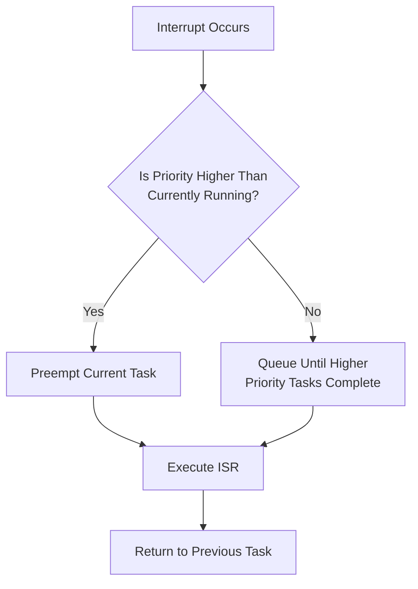

# STM32 Interrupt Masking

Interrupt masking is a crucial technique in embedded systems programming that allows you to temporarily disable specific interrupts or all interrupts to create critical sections of code. In this article, we'll explore how interrupt masking works on STM32 microcontrollers, why it's important, and how to implement it properly in your applications.

## Introduction to Interrupt Masking

When working with STM32 microcontrollers (based on ARM Cortex-M cores), you'll often need to handle multiple interrupt sources simultaneously. However, there are situations where you need to ensure that certain operations are not interrupted:

- When accessing shared resources between interrupt handlers and the main program
- During time-critical operations where timing precision is essential
- When performing atomic operations that must not be split
- During system initialization or reconfiguration

Interrupt masking provides a mechanism to temporarily disable interrupts to achieve these goals.

## Interrupt Priority System in STM32

Before diving into masking techniques, it's important to understand how STM32 organizes interrupt priorities:

1. STM32 microcontrollers use the Nested Vectored Interrupt Controller (NVIC)
2. Each interrupt can be assigned a priority level (0-15, where 0 is highest priority)
3. The NVIC automatically handles nesting of interrupts based on their priorities
4. Interrupts with higher priorities can preempt lower priority ones



## Global Interrupt Masking

The simplest approach to interrupt masking is to disable all interrupts globally. In STM32, this can be achieved using the following intrinsic functions:

```c
// Disable all interrupts
__disable_irq();

// Critical section where no interrupts will occur
// ...

// Re-enable all interrupts
__enable_irq();
```

These functions directly manipulate the PRIMASK register in the Cortex-M core, which can disable all interrupts except for Non-Maskable Interrupts (NMI) and HardFault.

### Example: Protecting a Resource

Here's a practical example where we need to protect a shared resource:

```c
volatile uint32_t shared_counter = 0;

void increment_counter(void) {
    // Disable interrupts before accessing shared resource
    __disable_irq();
    
    // Critical section - cannot be interrupted
    shared_counter++;
    
    // Re-enable interrupts after critical section
    __enable_irq();
}

void handle_button_press(void) {
    // This will be called from an interrupt
    increment_counter();
}

int main(void) {
    // Initialize hardware
    // ...
    
    while (1) {
        // Main program logic
        if (some_condition) {
            increment_counter();
        }
    }
}
```

### Important Caution

While global interrupt masking is simple to implement, it should be used with care:

- Keep critical sections as short as possible
- Disabling interrupts for too long can cause interrupts to be missed
- Time-sensitive operations like communication protocols might fail
- Real-time responsiveness could be compromised

A good rule of thumb is to keep global interrupt masking sections under a few microseconds.

## Selective Interrupt Masking

Often, disabling all interrupts is too heavy-handed. STM32 allows you to selectively enable or disable specific interrupts through the NVIC interface.

### Disabling Specific Interrupts

```c
// Disable USART2 interrupt
NVIC_DisableIRQ(USART2_IRQn);

// Critical section where USART2 interrupts won't occur
// ...

// Re-enable USART2 interrupt
NVIC_EnableIRQ(USART2_IRQn);
```

### Example: Managing Multiple Interrupt Sources

Consider a scenario where we have a system with multiple interrupt sources:

```c
// Initialize our interrupt sources
void setup_interrupts(void) {
    // Configure EXTI for button press
    // ...
    NVIC_SetPriority(EXTI0_IRQn, 2); // Priority 2 (medium)
    NVIC_EnableIRQ(EXTI0_IRQn);
    
    // Configure timer interrupt
    // ...
    NVIC_SetPriority(TIM2_IRQn, 1); // Priority 1 (high)
    NVIC_EnableIRQ(TIM2_IRQn);
    
    // Configure UART interrupt
    // ...
    NVIC_SetPriority(USART2_IRQn, 3); // Priority 3 (low)
    NVIC_EnableIRQ(USART2_IRQn);
}

void process_sensitive_data(void) {
    // Disable only UART interrupts while processing
    NVIC_DisableIRQ(USART2_IRQn);
    
    // Process data - won't be interrupted by UART
    // but still allows higher priority interrupts
    // ...
    
    // Re-enable UART interrupts
    NVIC_EnableIRQ(USART2_IRQn);
}
```

In this example, we keep the higher priority timer interrupt active while disabling the UART interrupt during sensitive data processing.

## Priority-Based Masking with BASEPRI

Cortex-M3, M4, and M7 processors provide an advanced masking mechanism using the BASEPRI register. This register sets a priority threshold below which interrupts are masked.

```c
// Disable all interrupts with priority level 2 and lower
__set_BASEPRI(2 << (8 - __NVIC_PRIO_BITS));

// Critical section - only interrupts with priority 0-1 can occur
// ...

// Re-enable all interrupts
__set_BASEPRI(0);
```

> Note: The priority shift `(8 - __NVIC_PRIO_BITS)` is needed because the ARM core uses the upper bits of the priority byte, depending on how many priority bits your specific STM32 implements.

### Example: Layered Interrupt Handling

Here's how you might implement a layered approach to interrupt handling:

```c
void enter_critical_section_level1(void) {
    // Mask interrupts of priority 1 and lower
    __set_BASEPRI(1 << (8 - __NVIC_PRIO_BITS));
    
    // Only priority 0 (highest) interrupts can occur now
}

void exit_critical_section_level1(void) {
    __set_BASEPRI(0);
}

void handle_system_error(void) {
    // Enter critical section but still allow highest priority interrupts
    enter_critical_section_level1();
    
    // Handle error, update system state, etc.
    // ...
    
    // Exit critical section
    exit_critical_section_level1();
}
```

## Saving and Restoring Interrupt State

A safer approach to masking is to save the current interrupt state before disabling, and then restore it afterward, regardless of what it was:

```c
uint32_t save_and_disable_interrupts(void) {
    uint32_t primask = __get_PRIMASK();
    __disable_irq();
    return primask;
}

void restore_interrupts(uint32_t primask) {
    __set_PRIMASK(primask);
}

void critical_function(void) {
    // Save current interrupt state and disable interrupts
    uint32_t primask = save_and_disable_interrupts();
    
    // Critical section
    // ...
    
    // Restore previous interrupt state
    restore_interrupts(primask);
}
```

This approach is particularly useful when you're writing library functions that might be called from various contexts, including from within other interrupt-disabled sections.

## Masking in RTOS Environments

If you're using an RTOS like FreeRTOS with your STM32, you should use the RTOS-provided functions for critical sections rather than manipulating the interrupt flags directly:

```c
// FreeRTOS example
void task_function(void *params) {
    while(1) {
        // Enter critical section
        taskENTER_CRITICAL();
        
        // Protected code
        // ...
        
        // Exit critical section
        taskEXIT_CRITICAL();
        
        // Rest of the task
    }
}
```

This ensures proper integration with the RTOS scheduler and its interrupt handling.

## Practical Application: Debouncing a Button

Let's see a complete example of using interrupt masking for debouncing a button:

```c
#define DEBOUNCE_TIME_MS 50

volatile uint32_t last_button_press_time = 0;
volatile bool button_pressed = false;

// Button interrupt handler (EXTI0_IRQHandler)
void EXTI0_IRQHandler(void) {
    // Clear pending bit
    EXTI->PR = EXTI_PR_PR0;
    
    uint32_t current_time = HAL_GetTick();
    
    // Check if enough time has passed since last press (debouncing)
    if (current_time - last_button_press_time > DEBOUNCE_TIME_MS) {
        // Save the current state and disable further button interrupts
        NVIC_DisableIRQ(EXTI0_IRQn);
        
        // Set the flag for main loop processing
        button_pressed = true;
        
        // Update last press time
        last_button_press_time = current_time;
        
        // We'll re-enable the interrupt in the main loop after processing
    }
}

int main(void) {
    // Initialize system and GPIO
    SystemInit();
    HAL_Init();
    
    // Configure button interrupt (EXTI0)
    // ...
    
    // Enable button interrupt
    NVIC_SetPriority(EXTI0_IRQn, 3);
    NVIC_EnableIRQ(EXTI0_IRQn);
    
    while (1) {
        // Check if button was pressed
        if (button_pressed) {
            // Enter critical section
            __disable_irq();
            
            // Reset flag within critical section
            button_pressed = false;
            
            // Exit critical section
            __enable_irq();
            
            // Process button press
            handle_button_press();
            
            // Re-enable button interrupt after processing
            NVIC_EnableIRQ(EXTI0_IRQn);
        }
        
        // Other main loop processing
        // ...
    }
}
```

In this example, we:
1. Disable the button interrupt after a valid press to avoid multiple triggers
2. Process the button press in the main loop
3. Use a critical section when checking and clearing the shared flag
4. Re-enable the interrupt after handling the button press

## Best Practices for Interrupt Masking

1. **Keep critical sections short**: The longer you mask interrupts, the more likely you are to miss important events.

2. **Use the least restrictive masking possible**: Instead of disabling all interrupts, consider disabling only specific ones or using priority-based masking.

3. **Be careful with shared resources**: Always use proper masking when accessing variables that might be modified by both interrupts and the main program.

4. **Save and restore state**: When writing library functions, save the interrupt state before modifying it and restore it afterward.

5. **Document critical sections**: Make it clear in your code comments when you're entering and exiting critical sections and why they're needed.

6. **Consider alternatives**: Sometimes using atomic operations or lock-free data structures can eliminate the need for interrupt masking.

## Debugging Interrupt Masking Issues

Common problems with interrupt masking include:

- **Interrupted critical sections**: If your critical section can be interrupted, you might have forgotten to mask interrupts properly.
- **Missed interrupts**: If your system is missing interrupts, you might be masking them for too long.
- **Deadlocks**: If your system stops responding, you might have disabled interrupts and never re-enabled them.

To debug these issues:
- Add timestamps before and after critical sections to measure how long they take
- Use a logic analyzer to monitor interrupt lines
- Add debug output to track when interrupts are masked and unmasked

## Summary

Interrupt masking is an essential technique for creating reliable embedded systems with STM32 microcontrollers. By selectively disabling interrupts, you can create critical sections that protect shared resources and ensure crucial operations complete without interference.

Key points to remember:
- Use global masking (`__disable_irq()` / `__enable_irq()`) only for very short critical sections
- Use selective interrupt masking through NVIC for more targeted control
- Use priority-based masking with BASEPRI on Cortex-M3/M4/M7 for advanced control
- Always save and restore interrupt state in reusable functions
- Keep critical sections as short as possible

## Exercises for Practice

1. Write a function that safely increments a 64-bit counter variable (which requires multiple instructions on a 32-bit MCU) using interrupt masking.

2. Implement a circular buffer that can be safely used from both an interrupt context and the main program.

3. Create a library function that configures a timer while ensuring no timer interrupts can occur during configuration.

4. Design a priority scheme for a system with 5 different interrupt sources, deciding which ones should be able to preempt others.

5. Modify the button debouncing example to handle multiple buttons, each with their own interrupt line.

## Further Reading

- STM32 Reference Manual (RM0090 for STM32F4 series)
- ARM Cortex-M Programming Guide
- "Making Embedded Systems" by Elecia White
- "The Definitive Guide to ARM Cortex-M3 and Cortex-M4 Processors" by Joseph Yiu