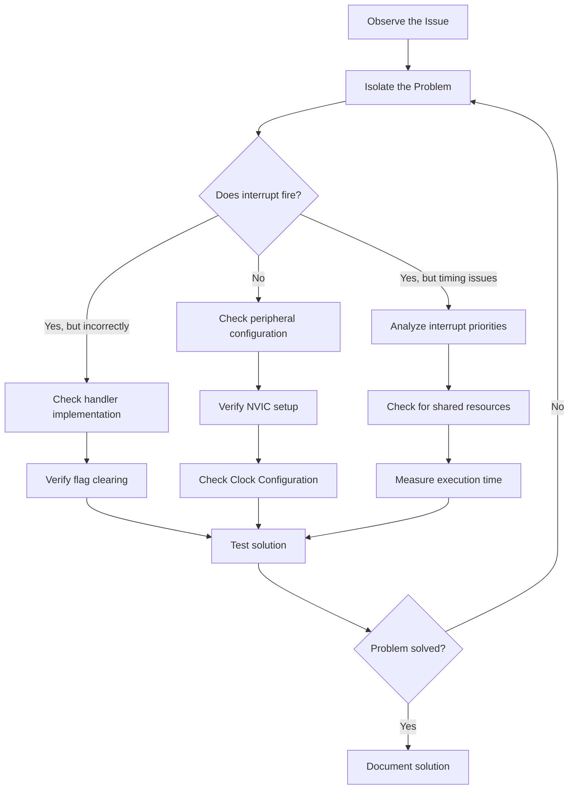

# STM32 Interrupt Debugging

Debugging interrupt-related issues can be one of the most challenging aspects of embedded development. Unlike regular sequential code, interrupt handlers execute asynchronously, making traditional debugging approaches less effective. This guide will walk you through various techniques and tools to identify and resolve interrupt-related problems in STM32 microcontrollers.

## Introduction to Interrupt Debugging

Interrupts are essential for responsive embedded systems, allowing microcontrollers to react immediately to external events without constant polling. However, their asynchronous nature can introduce complex bugs that are difficult to track down:

- Timing issues between interrupt handlers
- Priority conflicts leading to unexpected behavior
- Race conditions when accessing shared resources
- Stack overflow problems caused by nested interrupts
- Missing or incorrect interrupt configurations

This guide will equip you with practical strategies to diagnose and fix these issues.

## Prerequisites

Before diving into interrupt debugging, you should be familiar with:

- Basic STM32 programming concepts
- How interrupts work in general
- Setting up interrupts using STM32CubeMX or directly with registers

## Common Interrupt Issues and Solutions

### 1. Interrupt Not Firing

One of the most common issues is when an expected interrupt doesn't trigger at all.

#### Checklist:

```c
// Is the interrupt enabled in the peripheral?
TIM2->DIER |= TIM_DIER_UIE; // Enable update interrupt for Timer 2

// Is the interrupt enabled in the NVIC?
HAL_NVIC_EnableIRQ(TIM2_IRQn);

// Are the interrupt priorities properly set?
HAL_NVIC_SetPriority(TIM2_IRQn, 0, 0);

// Is the peripheral itself enabled?
TIM2->CR1 |= TIM_CR1_CEN; // Enable Timer 2
```

#### Debugging Strategy:

1. Use an LED to verify if the interrupt handler is being entered:

```c
void TIM2_IRQHandler(void) {
  if (TIM2->SR & TIM_SR_UIF) {
    HAL_GPIO_TogglePin(GPIOA, GPIO_PIN_5); // Toggle LED on each interrupt
    TIM2->SR &= ~TIM_SR_UIF; // Clear the interrupt flag
  }
}
```

2. Check interrupt flags in the status register to verify if events are occurring
3. Verify clock configurations - peripherals need their clocks enabled

### 2. Interrupt Priority Issues

When multiple interrupts occur simultaneously, priority settings determine which one executes first.

```c
// Setting interrupt priorities (lower number = higher priority)
HAL_NVIC_SetPriority(EXTI0_IRQn, 0, 0);    // Highest priority
HAL_NVIC_SetPriority(TIM2_IRQn, 1, 0);     // Medium priority
HAL_NVIC_SetPriority(USART2_IRQn, 2, 0);   // Lowest priority
```

The STM32 has a preemption priority and a subpriority. The preemption priority determines whether an interrupt can interrupt another already running interrupt handler.

#### Debugging Strategy:

Track interrupt execution order using GPIO pins:

```c
void EXTI0_IRQHandler(void) {
  HAL_GPIO_WritePin(GPIOA, GPIO_PIN_1, GPIO_PIN_SET);    // Set pin high at start
  
  // Interrupt handling code here
  
  HAL_GPIO_WritePin(GPIOA, GPIO_PIN_1, GPIO_PIN_RESET);  // Set pin low at end
  HAL_EXTI_ClearPendingBit(EXTI_Line0);
}

void TIM2_IRQHandler(void) {
  HAL_GPIO_WritePin(GPIOA, GPIO_PIN_2, GPIO_PIN_SET);    // Different pin for each ISR
  
  // Interrupt handling code here
  
  HAL_GPIO_WritePin(GPIOA, GPIO_PIN_2, GPIO_PIN_RESET);
  TIM2->SR &= ~TIM_SR_UIF;
}
```

Use a logic analyzer or oscilloscope to observe these pins and verify the actual execution sequence.

### 3. Race Conditions and Shared Resources

When both the main program and interrupt handlers access shared data, race conditions can occur.

#### Problematic Code:

```c
// Global variable accessed by both main loop and interrupt
volatile uint32_t counter = 0;

void EXTI0_IRQHandler(void) {
  counter++;
  HAL_EXTI_ClearPendingBit(EXTI_Line0);
}

int main(void) {
  // Initialization code...
  
  while (1) {
    if (counter > 100) {
      counter = 0;
      // Do something...
    }
  }
}
```

#### Fixed Code with Critical Section Protection:

```c
volatile uint32_t counter = 0;

void EXTI0_IRQHandler(void) {
  counter++;
  HAL_EXTI_ClearPendingBit(EXTI_Line0);
}

int main(void) {
  // Initialization code...
  
  while (1) {
    uint32_t local_counter;
    
    // Enter critical section
    __disable_irq();
    local_counter = counter;
    if (local_counter > 100) {
      counter = 0;
    }
    __enable_irq();
    // Exit critical section
    
    if (local_counter > 100) {
      // Do something...
    }
  }
}
```

### 4. Stack Overflow Due to Nested Interrupts

When interrupts nest too deeply, they can cause stack overflow, leading to system crashes.

#### Debugging Strategy:

Monitor the stack usage with a pattern filling technique:

```c
#define STACK_SIZE 1024
uint32_t stack[STACK_SIZE];

void fillStackPattern(void) {
  for (int i = 0; i < STACK_SIZE; i++) {
    stack[i] = 0xDEADBEEF; // Fill with recognizable pattern
  }
}

uint32_t checkStackUsage(void) {
  uint32_t count = 0;
  for (int i = 0; i < STACK_SIZE; i++) {
    if (stack[i] != 0xDEADBEEF) {
      count++;
    }
  }
  return count * sizeof(uint32_t); // Return bytes used
}

int main(void) {
  fillStackPattern();
  
  // Rest of your code...
  
  while (1) {
    uint32_t stackUsed = checkStackUsage();
    // Log or display this value
  }
}
```

## Using Tools for Interrupt Debugging

### 1. Logic Analyzer/Oscilloscope

A logic analyzer is invaluable for debugging timing-related interrupt issues.

#### Technique: Pulse Tracing

```c
void TIM2_IRQHandler(void) {
  // Set debugging pin high at start of ISR
  HAL_GPIO_WritePin(DEBUG_PORT, DEBUG_PIN, GPIO_PIN_SET);
  
  if (TIM2->SR & TIM_SR_UIF) {
    // Your interrupt handling code
    
    TIM2->SR &= ~TIM_SR_UIF; // Clear interrupt flag
  }
  
  // Set debugging pin low at end of ISR
  HAL_GPIO_WritePin(DEBUG_PORT, DEBUG_PIN, GPIO_PIN_RESET);
}
```

This allows you to measure:
- Interrupt latency
- Handler execution time
- Timing relationships between different interrupts

### 2. Using ITM (Instrumentation Trace Macrocell)

STM32 Cortex-M3/M4/M7 processors include ITM for real-time tracing with minimal impact on execution:

```c
// Initialize ITM - typically done in a system initialization function
void initITM(void) {
  // Enable the ITM port
  ITM->LAR = 0xC5ACCE55; // Unlock access to ITM registers
  ITM->TCR = (1 << 0) | (1 << 16); // Enable ITM and set ID
  ITM->TPR = 0x0000000F; // Enable ports 0-3
  ITM->TER = 0x00000001; // Enable stimulus port 0
}

// Then use ITM_SendChar in your interrupt handler
void EXTI0_IRQHandler(void) {
  ITM_SendChar('A'); // Send a marker at the start of the ISR
  
  // Interrupt handling code
  
  ITM_SendChar('B'); // Send a marker at the end of the ISR
  HAL_EXTI_ClearPendingBit(EXTI_Line0);
}
```

View these outputs in your debugger's trace window (like in STM32CubeIDE or Keil).

### 3. Live Peripheral Register Inspection

Most debuggers allow you to view peripheral registers in real-time:

1. In STM32CubeIDE, open the SFRs (Special Function Registers) view
2. Navigate to the relevant peripheral (e.g., TIM2, EXTI)
3. Set a breakpoint in your interrupt handler
4. When the breakpoint is hit, check:
   - Status registers to verify interrupt flags
   - Control registers to confirm proper configuration
   - Priority registers in the NVIC

## Interrupt Debugging Process



## Advanced Techniques

### 1. Interrupt Latency Measurement

Accurately measure how long it takes from the trigger event to the start of your interrupt handler:

```c
// In main.c - Setup Timer 2 for precise timing
void setupLatencyMeasurement(void) {
  // Enable TIM2 clock
  RCC->APB1ENR |= RCC_APB1ENR_TIM2EN;
  
  // Configure Timer 2 as a high-speed counter
  TIM2->PSC = 0;          // No prescaler
  TIM2->ARR = 0xFFFFFFFF; // Max count
  TIM2->CR1 |= TIM_CR1_CEN; // Start the timer
}

// Variables to store timestamps
volatile uint32_t eventTime = 0;
volatile uint32_t isrTime = 0;
volatile uint32_t latency = 0;

// In EXTI handler
void EXTI0_IRQHandler(void) {
  // Get the time as soon as we enter the ISR
  isrTime = TIM2->CNT;
  
  // Calculate latency (accounting for counter overflow)
  if (isrTime >= eventTime) {
    latency = isrTime - eventTime;
  } else {
    latency = (0xFFFFFFFF - eventTime) + isrTime + 1;
  }
  
  // Rest of your handler...
  
  HAL_EXTI_ClearPendingBit(EXTI_Line0);
}

// In the event triggering function (e.g., GPIO setup)
void EXTI0_IRQHandler_SetupTrigger(void) {
  // Record the time when event should trigger
  eventTime = TIM2->CNT;
  
  // Configure EXTI line for GPIO pin
  // ...
}
```

### 2. Fault Handlers for Debugging

Customize fault handlers to help diagnose crashes related to interrupt issues:

```c
// Hard Fault Handler with diagnostic info
void HardFault_Handler(void) {
  // Capture fault status registers
  volatile uint32_t hfsr = SCB->HFSR;  // Hard Fault Status Register
  volatile uint32_t cfsr = SCB->CFSR;  // Configurable Fault Status Register
  volatile uint32_t lr;                // Link Register value
  
  // Get the value of the link register
  __asm volatile ("MOV %0, LR
" : "=r" (lr) : );
  
  // Indicate hard fault via LED
  while (1) {
    HAL_GPIO_TogglePin(GPIOA, GPIO_PIN_5);
    for (volatile int i = 0; i < 1000000; i++); // Simple delay
  }
}
```

In a real application, you would log these fault values or transmit them via a debug UART.

## Common Mistakes to Avoid

1. **Forgetting to clear interrupt flags**: The interrupt will keep firing if not cleared
   ```c
   // Correct way to clear Timer 2 Update interrupt flag
   TIM2->SR &= ~TIM_SR_UIF;
   ```

2. **Long-running interrupt handlers**: Keep ISRs as short as possible
   ```c
   // Bad practice
   void TIM2_IRQHandler(void) {
     // Clear flag
     TIM2->SR &= ~TIM_SR_UIF;
     
     // Don't do this in an ISR!
     HAL_Delay(100);  // Blocking delay
     
     // Complex calculations that could be done in main loop
     // ...
   }
   
   // Better practice
   volatile bool timer_event = false;
   
   void TIM2_IRQHandler(void) {
     // Clear flag
     TIM2->SR &= ~TIM_SR_UIF;
     
     // Just set a flag
     timer_event = true;
   }
   
   // In main loop
   while (1) {
     if (timer_event) {
       timer_event = false;
       
       // Do the heavy processing here
       // ...
     }
   }
   ```

3. **Not being careful with volatile**: Variables shared between ISR and main code must be volatile
   ```c
   // Correct declaration for a shared variable
   volatile uint32_t shared_counter = 0;
   ```

4. **Missing interrupt vector definitions**: Make sure interrupt handlers match expected names
   ```c
   // This must match exactly the expected name in startup file
   void TIM2_IRQHandler(void) {
     // ...
   }
   ```

## Practical Example: Debugging a Button Debounce Interrupt

Let's walk through debugging a common issue with button interrupts: contact bounce causing multiple interrupts.

### Problem Code:

```c
// Button EXTI handler with a bug
void EXTI0_IRQHandler(void) {
  if (EXTI->PR & EXTI_PR_PR0) {
    // Toggle LED
    HAL_GPIO_TogglePin(GPIOA, GPIO_PIN_5);
    
    // Clear the interrupt flag
    EXTI->PR = EXTI_PR_PR0;
  }
}
```

### Issue:
When pressing the button once, the LED sometimes toggles multiple times due to contact bounce.

### Debugging Process:

1. **Identify the issue with pulse tracing**:
   ```c
   void EXTI0_IRQHandler(void) {
     HAL_GPIO_WritePin(GPIOC, GPIO_PIN_8, GPIO_PIN_SET); // Debug trace
     
     if (EXTI->PR & EXTI_PR_PR0) {
       // Toggle LED
       HAL_GPIO_TogglePin(GPIOA, GPIO_PIN_5);
       
       // Clear the interrupt flag
       EXTI->PR = EXTI_PR_PR0;
     }
     
     HAL_GPIO_WritePin(GPIOC, GPIO_PIN_8, GPIO_PIN_RESET); // Debug trace
   }
   ```

2. **View the result**: Using a logic analyzer, you'd see multiple pulses when pressing the button once.

3. **Fix with debouncing**:
   ```c
   // Add timestamp for debouncing
   volatile uint32_t last_button_press = 0;
   
   void EXTI0_IRQHandler(void) {
     HAL_GPIO_WritePin(GPIOC, GPIO_PIN_8, GPIO_PIN_SET); // Debug trace
     
     uint32_t current_time = HAL_GetTick();
     
     if ((EXTI->PR & EXTI_PR_PR0) && (current_time - last_button_press > 50)) {
       // Update timestamp
       last_button_press = current_time;
       
       // Toggle LED
       HAL_GPIO_TogglePin(GPIOA, GPIO_PIN_5);
       
       // Clear the interrupt flag
       EXTI->PR = EXTI_PR_PR0;
     } else {
       // Just clear the flag for bounces we want to ignore
       EXTI->PR = EXTI_PR_PR0;
     }
     
     HAL_GPIO_WritePin(GPIOC, GPIO_PIN_8, GPIO_PIN_RESET); // Debug trace
   }
   ```

## Summary

Debugging interrupts in STM32 microcontrollers requires a systematic approach and specialized techniques:

1. **Proper setup verification** - Check peripheral configuration, NVIC settings, and priorities
2. **Isolation techniques** - Use GPIO pins and logic analyzers to visualize interrupt behavior
3. **Critical section protection** - Properly guard shared resources between ISRs and main code
4. **Runtime analysis** - Measure latency, execution time, and monitor stack usage
5. **Structured debugging process** - Follow a methodical approach to identify and fix issues

Remember that interrupt-related bugs often manifest in seemingly unrelated ways. A system reset, memory corruption, or unexpected behavior could all be symptoms of interrupt problems.

## Exercises

1. Set up an STM32 project with two interrupt sources (timer and external button) with different priorities, and verify the execution order using GPIO pins and a logic analyzer.

2. Implement a shared counter between an ISR and main code, then debug and fix any race conditions.

3. Measure the interrupt latency for an EXTI interrupt and experiment with different system configurations to see how they affect the latency.

4. Create a nested interrupt scenario and monitor stack usage to ensure no overflow occurs.

5. Implement a robust button debouncing system using interrupts, and debug it using the techniques covered in this guide.

## Additional Resources

- STM32 Reference Manuals - Detailed documentation on interrupt configurations
- [Cortex-M3/M4 Programmer's Model](https://developer.arm.com/documentation/dui0553/latest/) - Detailed information about the NVIC and exception handling
- Application Note [AN179](https://www.st.com/resource/en/application_note/an179-cortexm-embedded-software-development-stmicroelectronics.pdf) - Cortex-M Embedded Software Development