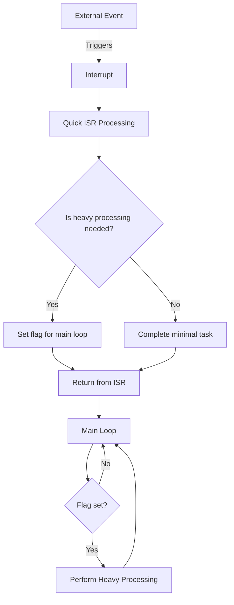

# STM32 Interrupt Best Practices

## Introduction

Interrupts are essential components in embedded systems programming, allowing microcontrollers to respond promptly to external events without constant polling. While basic interrupt implementation might seem straightforward, following proper practices is crucial for creating reliable, maintainable, and efficient interrupt-driven applications.

This guide covers essential best practices for STM32 interrupt handlers, helping you avoid common pitfalls and optimize your interrupt-based code. Whether you're building a simple hobby project or a complex industrial system, these practices will help you write robust interrupt handlers.

## Why Interrupt Best Practices Matter

Before diving into specific practices, let's understand why they're important:

- **System Stability**: Poorly implemented interrupts can lead to system crashes, unpredictable behavior, and hard-to-debug issues
- **Timing Reliability**: Following best practices ensures consistent and predictable timing in interrupt-driven systems
- **Power Efficiency**: Well-designed interrupt handlers minimize CPU usage and can significantly reduce power consumption
- **Code Maintainability**: Clean interrupt code is easier to debug, maintain, and modify

## Best Practice 1: Keep Interrupt Service Routines (ISRs) Short and Fast

One of the most important rules when working with interrupts is to keep your Interrupt Service Routines (ISRs) as short and fast as possible.

### Why It Matters

- Long ISRs can block other critical interrupts
- Extended processing in ISRs increases interrupt latency
- System responsiveness decreases with lengthy ISRs

### Implementation Example

**Poor Practice:**

```c
void EXTI15_10_IRQHandler(void)
{
    // Check if the interrupt is from EXTI line 13
    if (LL_EXTI_IsActiveFlag_0_31(LL_EXTI_LINE_13) != RESET)
    {
        // Clear interrupt flag
        LL_EXTI_ClearFlag_0_31(LL_EXTI_LINE_13);
        
        // BAD PRACTICE: Doing too much work in the ISR
        for(int i = 0; i < 1000; i++) {
            calculate_and_update_display();
            apply_complex_filter();
            transmit_data_over_uart();
        }
    }
}
```

**Best Practice:**

```c
// Flag to signal main loop that button was pressed
volatile uint8_t button_pressed = 0;

void EXTI15_10_IRQHandler(void)
{
    // Check if the interrupt is from EXTI line 13
    if (LL_EXTI_IsActiveFlag_0_31(LL_EXTI_LINE_13) != RESET)
    {
        // Clear interrupt flag
        LL_EXTI_ClearFlag_0_31(LL_EXTI_LINE_13);
        
        // GOOD PRACTICE: Just set a flag and exit quickly
        button_pressed = 1;
    }
}

// In the main loop
void main(void)
{
    // ... initialization code ...
    
    while(1)
    {
        if(button_pressed)
        {
            button_pressed = 0;
            // Do the heavy processing here, outside the ISR
            process_button_press();
        }
        
        // ... other main loop code ...
    }
}
```

## Best Practice 2: Use Flags and Buffers for Communication

Instead of processing data directly in ISRs, use flags and buffers to communicate between ISRs and the main program.

### Why It Matters

- Minimizes time spent in interrupt context
- Prevents data corruption from interrupt-based race conditions
- Allows for more organized data flow in your application

### Implementation Example

```c
// Circular buffer for received UART data
#define RX_BUFFER_SIZE 64
volatile uint8_t rx_buffer[RX_BUFFER_SIZE];
volatile uint16_t rx_write_index = 0;
volatile uint16_t rx_read_index = 0;
volatile uint8_t rx_data_available = 0;

void USART2_IRQHandler(void)
{
    // Check if we received data
    if (LL_USART_IsActiveFlag_RXNE(USART2) && LL_USART_IsEnabledIT_RXNE(USART2))
    {
        // Read data from UART
        uint8_t received_byte = LL_USART_ReceiveData8(USART2);
        
        // Calculate new write index
        uint16_t next_write = (rx_write_index + 1) % RX_BUFFER_SIZE;
        
        // If buffer isn't full, store byte and update index
        if (next_write != rx_read_index)
        {
            rx_buffer[rx_write_index] = received_byte;
            rx_write_index = next_write;
            rx_data_available = 1;
        }
    }
}

// Function to get data from buffer (called from main loop)
uint8_t uart_get_byte(uint8_t* byte)
{
    // If buffer is empty
    if (rx_read_index == rx_write_index)
    {
        return 0; // No data available
    }
    
    // Read byte from buffer
    *byte = rx_buffer[rx_read_index];
    rx_read_index = (rx_read_index + 1) % RX_BUFFER_SIZE;
    
    return 1; // Data was available and returned
}

// In main loop
void main(void)
{
    // ... initialization code ...
    
    while(1)
    {
        uint8_t byte;
        
        while(uart_get_byte(&byte))
        {
            // Process received bytes here
            process_uart_data(byte);
        }
        
        // ... other main loop code ...
    }
}
```

## Best Practice 3: Handle Interrupt Priority Properly

STM32 microcontrollers offer configurable interrupt priorities, allowing you to determine which interrupts are more important than others.

### Why It Matters

- Critical tasks can preempt less important operations
- Prevents high-frequency interrupts from starving important interrupts
- Ensures predictable system behavior in complex interrupt scenarios

### Implementation Example

```c
void configure_interrupt_priorities(void)
{
    // Configure NVIC priorities
    
    // Timer interrupt (lowest priority - not time critical)
    NVIC_SetPriority(TIM2_IRQn, 3);
    
    // UART interrupt (medium priority - communication)
    NVIC_SetPriority(USART2_IRQn, 2);
    
    // ADC conversion complete (higher priority - data acquisition)
    NVIC_SetPriority(ADC_IRQn, 1);
    
    // External interrupt for emergency stop button (highest priority)
    NVIC_SetPriority(EXTI15_10_IRQn, 0);
    
    // Enable interrupts
    NVIC_EnableIRQ(TIM2_IRQn);
    NVIC_EnableIRQ(USART2_IRQn);
    NVIC_EnableIRQ(ADC_IRQn);
    NVIC_EnableIRQ(EXTI15_10_IRQn);
}
```

:::note
On STM32 microcontrollers, **lower numeric values represent higher priority**. In the example above, EXTI15_10_IRQn has the highest priority with a value of 0.
:::

## Best Practice 4: Protect Shared Resources with Critical Sections

When both the main program and ISRs access shared resources (variables, peripherals), you need to protect these resources from concurrent access.

### Why It Matters

- Prevents data corruption when both main code and ISRs access the same variable
- Ensures atomic operations on multi-byte data
- Prevents race conditions that can lead to unpredictable behavior

### Implementation Example

```c
// Shared resource
volatile uint32_t sensor_value = 0;

// In an ISR
void ADC_IRQHandler(void)
{
    if (LL_ADC_IsActiveFlag_EOC(ADC1))
    {
        // Clear flag
        LL_ADC_ClearFlag_EOC(ADC1);
        
        // Update shared resource
        sensor_value = LL_ADC_READData(ADC1);
    }
}

// In main code
void process_sensor_data(void)
{
    uint32_t local_copy;
    
    // Disable interrupts to protect read of shared resource
    __disable_irq();
    local_copy = sensor_value;
    __enable_irq();
    
    // Now work with local_copy safely
    calculate_average(local_copy);
}
```

For more complex critical sections, you might want to use a more selective approach:

```c
void process_sensor_data(void)
{
    uint32_t local_copy;
    
    // Save current interrupt state and disable only ADC interrupt
    uint32_t primask = __get_PRIMASK();
    NVIC_DisableIRQ(ADC_IRQn);
    
    // Access shared resource
    local_copy = sensor_value;
    
    // Restore previous interrupt state
    if (!primask) {
        NVIC_EnableIRQ(ADC_IRQn);
    }
    
    // Process data with interrupts enabled
    calculate_average(local_copy);
}
```

## Best Practice 5: Properly Clear Interrupt Flags

Always clear interrupt flags to prevent immediate re-triggering of the same interrupt.

### Why It Matters

- Prevents interrupt handlers from being called repeatedly
- Avoids system instability and stack overflows
- Ensures predictable interrupt behavior

### Implementation Example

```c
void TIM2_IRQHandler(void)
{
    // Check if update interrupt flag is set
    if (LL_TIM_IsActiveFlag_UPDATE(TIM2))
    {
        // IMPORTANT: Clear the interrupt flag
        LL_TIM_ClearFlag_UPDATE(TIM2);
        
        // Handle timer interrupt
        handle_timer_tick();
    }
}
```

:::caution
If you forget to clear interrupt flags, your interrupt handler will be called repeatedly, potentially causing system instability or crashes.
:::

## Best Practice 6: Use Volatile for Shared Variables

Always declare variables shared between ISRs and the main program as `volatile`.

### Why It Matters

- Prevents compiler optimization that might eliminate "redundant" reads
- Ensures variables are always read from memory, not from registers
- Critical for correct operation when variables can be changed asynchronously

### Implementation Example

```c
// CORRECT: Using volatile for variables accessed from ISRs
volatile uint32_t pulse_count = 0;
volatile uint8_t button_state = 0;

void EXTI0_IRQHandler(void)
{
    if (LL_EXTI_IsActiveFlag_0_31(LL_EXTI_LINE_0))
    {
        // Clear the EXTI line flag
        LL_EXTI_ClearFlag_0_31(LL_EXTI_LINE_0);
        
        // Increment the pulse counter
        pulse_count++;
        
        // Update button state
        button_state = (LL_GPIO_IsInputPinSet(GPIOA, LL_GPIO_PIN_0)) ? 1 : 0;
    }
}

// In main function
void main(void)
{
    // ... initialization ...
    
    while (1)
    {
        if (pulse_count > 10)
        {
            // The compiler will always read the actual memory value
            // because pulse_count is declared as volatile
            process_pulses(pulse_count);
            pulse_count = 0;
        }
    }
}
```

## Best Practice 7: Debounce Hardware Inputs in Interrupts

When using interrupts with physical inputs like buttons, always implement debouncing to prevent multiple false triggers.

### Why It Matters

- Physical switches bounce, causing multiple rapid interrupts
- Debouncing prevents a single button press from registering multiple times
- Makes user interfaces more reliable and predictable

### Implementation Example

```c
// Last time the button was pressed (in system ticks)
volatile uint32_t last_button_press = 0;
// Debounce delay in milliseconds
#define DEBOUNCE_DELAY_MS 50

void EXTI15_10_IRQHandler(void)
{
    // Check if the interrupt is from EXTI line 13
    if (LL_EXTI_IsActiveFlag_0_31(LL_EXTI_LINE_13))
    {
        // Clear the interrupt flag
        LL_EXTI_ClearFlag_0_31(LL_EXTI_LINE_13);
        
        // Get current system time
        uint32_t current_time = HAL_GetTick();
        
        // Check if enough time has passed since the last button press
        if ((current_time - last_button_press) > DEBOUNCE_DELAY_MS)
        {
            // Update the last press time
            last_button_press = current_time;
            
            // Process the button press
            handle_button_press();
        }
        // If not enough time has passed, ignore this interrupt (it's a bounce)
    }
}
```

## Best Practice 8: Use Interrupt Handlers for Hardware Events Only

Reserve interrupts for truly asynchronous hardware events and avoid software-triggered interrupts when possible.

### Why It Matters

- Hardware events are truly asynchronous and need immediate attention
- Software events can often be handled through other mechanisms
- Keeps interrupt vector table focused on essential hardware responses

### Implementation Example

**Poor Practice:**

```c
// Using interrupts for a software timer that could be polled
void start_software_timer(uint32_t delay_ms)
{
    // Configure timer with delay
    // ...
    
    // Enable timer interrupt to handle timeout
    NVIC_EnableIRQ(TIM3_IRQn);
    LL_TIM_EnableIT_UPDATE(TIM3);
    LL_TIM_EnableCounter(TIM3);
}

void TIM3_IRQHandler(void)
{
    if (LL_TIM_IsActiveFlag_UPDATE(TIM3))
    {
        LL_TIM_ClearFlag_UPDATE(TIM3);
        handle_software_timeout();
    }
}
```

**Better Practice:**

```c
// Better to use a polling approach for software timers
volatile uint32_t timer_start;
volatile uint32_t timer_duration;
volatile uint8_t timer_running = 0;

void start_software_timer(uint32_t delay_ms)
{
    timer_start = HAL_GetTick();
    timer_duration = delay_ms;
    timer_running = 1;
}

// In main loop
void main(void)
{
    // ... initialization ...
    
    while (1)
    {
        // Check timers
        if (timer_running && ((HAL_GetTick() - timer_start) >= timer_duration))
        {
            timer_running = 0;
            handle_software_timeout();
        }
        
        // ... other main loop code ...
    }
}
```

## Best Practice 9: Properly Handle Nested Interrupts

Understand and configure nested interrupts correctly to ensure system stability.

### Why It Matters

- Nested interrupts allow high-priority interrupts to preempt lower ones
- Improper nesting can lead to stack overflows and system instability
- Critical for systems requiring real-time response to multiple events

### Implementation Example

```c
void configure_nested_interrupts(void)
{
    // Configure nested vectored interrupt controller
    
    // Set priority grouping (how many bits are used for pre-emption priority)
    NVIC_SetPriorityGrouping(NVIC_PRIORITYGROUP_4);
    
    // Configure button interrupt (high priority, should preempt others)
    NVIC_SetPriority(EXTI0_IRQn, 1);
    NVIC_EnableIRQ(EXTI0_IRQn);
    
    // Configure UART interrupt (medium priority)
    NVIC_SetPriority(USART2_IRQn, 2);
    NVIC_EnableIRQ(USART2_IRQn);
    
    // Configure timer interrupt (lowest priority)
    NVIC_SetPriority(TIM2_IRQn, 3);
    NVIC_EnableIRQ(TIM2_IRQn);
    
    // Enable global interrupts
    __enable_irq();
}

// In high-priority interrupt
void EXTI0_IRQHandler(void)
{
    // Critical processing that shouldn't be interrupted
    __disable_irq();
    critical_section();
    __enable_irq();
    
    // Less critical processing that can be interrupted by other ISRs
    non_critical_section();
}
```

## Best Practice 10: Document Interrupt Dependencies and Behaviors

Always document your interrupt handlers, their priorities, and their interactions with the rest of your system.

### Why It Matters

- Interrupts create complex, timing-dependent behaviors that are hard to trace
- Documentation helps future developers (including yourself) understand the system
- Makes maintenance and debugging significantly easier

### Documentation Example

```c
/**
 * @brief External interrupt handler for emergency stop button
 * 
 * This interrupt has the highest priority (0) and will preempt all other
 * interrupts. It immediately stops all motor movement by disabling PWM outputs
 * and sets the system to a safe state.
 * 
 * @note This handler uses a 50ms debounce delay to prevent false triggers
 * @note Shared variables: emergency_stop_active, motor_enabled
 */
void EXTI15_10_IRQHandler(void)
{
    if (LL_EXTI_IsActiveFlag_0_31(LL_EXTI_LINE_15))
    {
        LL_EXTI_ClearFlag_0_31(LL_EXTI_LINE_15);
        
        // Debounce code here
        
        // Emergency stop code
        emergency_stop_system();
    }
}
```

## Visualizing Interrupt Flow

The following diagram illustrates the recommended flow for interrupt-based systems, emphasizing the "keep ISRs short" principle:



## Common Interrupt Pitfalls to Avoid

1. **Using blocking delays in ISRs**: Never use functions like `HAL_Delay()` in interrupt handlers.
2. **Forgetting to clear interrupt flags**: Always clear the interrupt flag that triggered the handler.
3. **Accessing non-volatile shared variables**: Always use the `volatile` keyword for variables shared between ISRs and main code.
4. **Using printf or complex I/O in ISRs**: These operations are usually too slow for ISRs.
5. **Not considering priority and nesting**: Incorrect priority settings can lead to system instability.
6. **Over-using interrupts**: Not everything needs to be interrupt-driven; consider polling for non-critical events.
7. **Failing to protect shared resources**: Always protect shared resources with critical sections.
8. **Not debouncing hardware inputs**: Physical switches bounce and can trigger multiple interrupts.

## Real-World Example: Complete Temperature Monitor with Alarm

Let's put these best practices together in a more comprehensive example: a temperature monitoring system with an alarm feature.

```c
// Shared variables
volatile float current_temperature = 0.0f;
volatile uint8_t alarm_triggered = 0;
volatile uint8_t new_temperature_available = 0;

// Circular buffer for temperature logging
#define TEMP_BUFFER_SIZE 60  // Store last 60 readings
volatile float temperature_history[TEMP_BUFFER_SIZE];
volatile uint8_t temp_write_index = 0;

// ADC conversion complete interrupt - triggered when a new temperature reading is available
void ADC_IRQHandler(void)
{
    if (LL_ADC_IsActiveFlag_EOC(ADC1))
    {
        // Clear the interrupt flag
        LL_ADC_ClearFlag_EOC(ADC1);
        
        // Read ADC value and convert to temperature
        uint16_t adc_value = LL_ADC_READData(ADC1);
        
        // Quick calculation in ISR is acceptable if it's simple
        float temperature = (adc_value * 3.3f / 4096.0f - 0.5f) * 100.0f;
        
        // Update shared variable
        current_temperature = temperature;
        
        // Store in circular buffer
        temperature_history[temp_write_index] = temperature;
        temp_write_index = (temp_write_index + 1) % TEMP_BUFFER_SIZE;
        
        // Set flag for main loop
        new_temperature_available = 1;
        
        // Check temperature threshold and set alarm if needed
        if (temperature > 50.0f) {  // 50°C threshold
            alarm_triggered = 1;
        }
    }
}

// Button interrupt - used to silence the alarm
void EXTI0_IRQHandler(void)
{
    static uint32_t last_press_time = 0;
    
    if (LL_EXTI_IsActiveFlag_0_31(LL_EXTI_LINE_0))
    {
        // Clear interrupt flag
        LL_EXTI_ClearFlag_0_31(LL_EXTI_LINE_0);
        
        // Debounce
        uint32_t current_time = HAL_GetTick();
        if ((current_time - last_press_time) > 100) {  // 100ms debounce
            last_press_time = current_time;
            
            // Reset alarm flag
            alarm_triggered = 0;
        }
    }
}

// Timer interrupt for regular temperature sampling
void TIM2_IRQHandler(void)
{
    if (LL_TIM_IsActiveFlag_UPDATE(TIM2))
    {
        // Clear interrupt flag
        LL_TIM_ClearFlag_UPDATE(TIM2);
        
        // Start ADC conversion - will trigger ADC interrupt when complete
        LL_ADC_REG_StartConversion(ADC1);
    }
}

// Main function
int main(void)
{
    // System initialization
    system_init();
    
    // Configure peripherals
    adc_init();
    timer_init();
    gpio_init();
    usart_init();
    
    // Configure interrupts with appropriate priorities
    // Higher priority (lower number) for critical interrupts
    NVIC_SetPriority(ADC_IRQn, 2);      // Medium priority
    NVIC_SetPriority(EXTI0_IRQn, 1);    // High priority (alarm reset)
    NVIC_SetPriority(TIM2_IRQn, 3);     // Low priority
    
    // Enable interrupts
    NVIC_EnableIRQ(ADC_IRQn);
    NVIC_EnableIRQ(EXTI0_IRQn);
    NVIC_EnableIRQ(TIM2_IRQn);
    
    // Enable global interrupts
    __enable_irq();
    
    // Start timer for regular sampling
    LL_TIM_EnableCounter(TIM2);
    
    // Main loop
    while (1)
    {
        // Handle new temperature reading
        if (new_temperature_available)
        {
            // Reset flag - use critical section since multiple bits could be modified
            __disable_irq();
            new_temperature_available = 0;
            // Make local copy of temperature while interrupts are disabled
            float temp_copy = current_temperature;
            __enable_irq();
            
            // Update LCD display with current temperature
            update_temperature_display(temp_copy);
            
            // Log to UART if significant change
            static float last_logged_temp = 0.0f;
            if (fabsf(temp_copy - last_logged_temp) > 0.5f) {
                last_logged_temp = temp_copy;
                log_temperature(temp_copy);
            }
        }
        
        // Handle alarm
        static uint8_t alarm_state = 0;
        if (alarm_triggered && !alarm_state)
        {
            alarm_state = 1;
            activate_alarm();
            log_alarm_event(current_temperature);
        }
        else if (!alarm_triggered && alarm_state)
        {
            alarm_state = 0;
            deactivate_alarm();
            log_alarm_reset();
        }
        
        // Low-priority background tasks
        update_user_interface();
        check_serial_commands();
        
        // Optional: Low power mode if no processing needed
        // __WFI();  // Wait for interrupt
    }
}
```

## Summary

Implementing proper interrupt practices in STM32 applications is essential for creating reliable, efficient, and maintainable embedded systems. By following these best practices, you can avoid common pitfalls and ensure your interrupt-driven code operates correctly even in complex scenarios.

Key takeaways:

1. Keep interrupt handlers short and fast
2. Use flags and buffers to communicate between ISRs and main code
3. Configure appropriate interrupt priorities
4. Protect shared resources with critical sections
5. Always clear interrupt flags
6. Use volatile for variables shared between ISRs and main code
7. Implement debouncing for hardware inputs
8. Reserve interrupts for hardware events
9. Understand and properly configure nested interrupts
10. Document your interrupt system thoroughly

## Further Learning

To deepen your understanding of STM32 interrupts, you might explore:

- Nested Vectored Interrupt Controller (NVIC) configuration details
- Interrupt priority grouping concepts
- DMA (Direct Memory Access) as an alternative to CPU-intensive interrupts
- Interrupt-safe data structures for more complex communication patterns
- Power management using interrupts to wake from low-power modes

## Exercises

1. Create a simple project that uses a button interrupt with proper debouncing
2. Implement a UART receive handler using a circular buffer
3. Modify the temperature monitoring example to add logging capabilities
4. Implement a system with multiple interrupt priorities and observe the nesting behavior
5. Create an interrupt-driven PWM control system with safety features