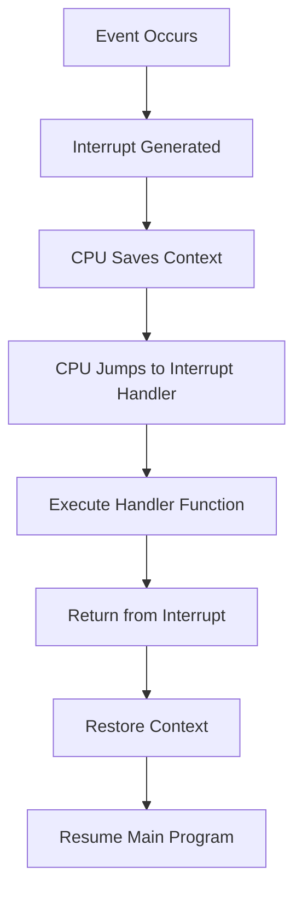
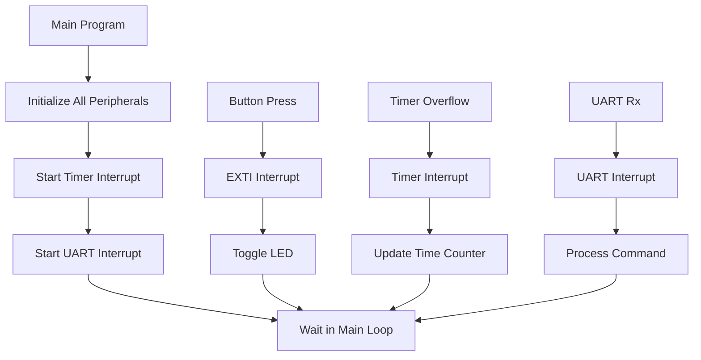

# STM32 Interrupt Examples

## Introduction

Interrupts are essential mechanisms in embedded systems that allow microcontrollers to respond to events asynchronously. Rather than continuously polling for events, interrupts enable the CPU to focus on its main tasks while being notified when specific events occur. This improves both efficiency and responsiveness of the system.

In this tutorial, we'll explore practical examples of implementing different types of interrupts on STM32 microcontrollers. We'll cover GPIO interrupts, timer interrupts, and UART interrupts with complete code examples that you can adapt for your own projects.

## Prerequisites

Before diving into these examples, you should have:

- Basic knowledge of STM32 microcontrollers
- STM32CubeIDE or similar development environment set up
- A development board with an STM32 microcontroller (examples use the STM32F4 series, but concepts apply to other STM32 families)
- Basic understanding of C programming

## Understanding STM32 Interrupt Structure

Before we get into specific examples, let's understand the key components of the STM32 interrupt system:

1. **NVIC (Nested Vectored Interrupt Controller)**: Manages all interrupts in the system
2. **IRQ Handler**: Function that executes when an interrupt occurs
3. **Priority Levels**: Allow certain interrupts to preempt others based on importance
4. **Interrupt Vector Table**: Maps specific interrupt sources to their handler functions

Here's a simplified representation of the interrupt flow:



## Example 1: GPIO Button Interrupt

Let's start with a common use case: detecting when a button is pressed using an external interrupt.

### Hardware Setup

- Connect a push button to pin PA0 (can be modified to any GPIO pin)
- Connect an LED to pin PC13 (this will toggle when the button is pressed)

### Code Example

```c
/* Includes ------------------------------------------------------------------*/
#include "main.h"

/* Private variables ---------------------------------------------------------*/
UART_HandleTypeDef huart2;

/* Private function prototypes -----------------------------------------------*/
void SystemClock_Config(void);
static void MX_GPIO_Init(void);
static void MX_USART2_UART_Init(void);

/* Main function -------------------------------------------------------------*/
int main(void)
{
  /* MCU Configuration--------------------------------------------------------*/
  HAL_Init();
  SystemClock_Config();
  
  /* Initialize peripherals */
  MX_GPIO_Init();
  MX_USART2_UART_Init();
  
  /* Print welcome message */
  char *welcome_msg = "GPIO Interrupt Example\r
";
  HAL_UART_Transmit(&huart2, (uint8_t*)welcome_msg, strlen(welcome_msg), HAL_MAX_DELAY);
  
  /* Infinite loop */
  while (1)
  {
    /* Main program continues running here */
    HAL_Delay(1000);
    HAL_UART_Transmit(&huart2, (uint8_t*)"Main loop running...\r
", 22, HAL_MAX_DELAY);
  }
}

/* GPIO Initialization Function */
static void MX_GPIO_Init(void)
{
  GPIO_InitTypeDef GPIO_InitStruct = {0};

  /* GPIO Ports Clock Enable */
  __HAL_RCC_GPIOA_CLK_ENABLE();
  __HAL_RCC_GPIOC_CLK_ENABLE();

  /* Configure LED pin */
  GPIO_InitStruct.Pin = GPIO_PIN_13;
  GPIO_InitStruct.Mode = GPIO_MODE_OUTPUT_PP;
  GPIO_InitStruct.Pull = GPIO_NOPULL;
  GPIO_InitStruct.Speed = GPIO_SPEED_FREQ_LOW;
  HAL_GPIO_Init(GPIOC, &GPIO_InitStruct);
  
  /* Set LED pin high (LED off on most STM32 boards) */
  HAL_GPIO_WritePin(GPIOC, GPIO_PIN_13, GPIO_PIN_SET);

  /* Configure button pin with interrupt */
  GPIO_InitStruct.Pin = GPIO_PIN_0;
  GPIO_InitStruct.Mode = GPIO_MODE_IT_RISING;  /* Interrupt on rising edge */
  GPIO_InitStruct.Pull = GPIO_PULLDOWN;
  HAL_GPIO_Init(GPIOA, &GPIO_InitStruct);

  /* Enable the button EXTI interrupt */
  HAL_NVIC_SetPriority(EXTI0_IRQn, 0, 0);
  HAL_NVIC_EnableIRQ(EXTI0_IRQn);
}

/* EXTI line interrupt handler */
void HAL_GPIO_EXTI_Callback(uint16_t GPIO_Pin)
{
  if(GPIO_Pin == GPIO_PIN_0)
  {
    /* Toggle LED */
    HAL_GPIO_TogglePin(GPIOC, GPIO_PIN_13);
    
    /* Send a message via UART */
    char *button_msg = "Button pressed! LED toggled.\r
";
    HAL_UART_Transmit(&huart2, (uint8_t*)button_msg, strlen(button_msg), HAL_MAX_DELAY);
    
    /* Simple debounce by software delay */
    HAL_Delay(200);
  }
}

/* This function is called by the HAL library when the EXTI interrupt occurs */
void EXTI0_IRQHandler(void)
{
  HAL_GPIO_EXTI_IRQHandler(GPIO_PIN_0);
}
```

### How This Works

1. We configure PA0 as an input with rising edge interrupt trigger
2. We enable the EXTI0 interrupt in the NVIC
3. When the button is pressed, the EXTI0_IRQHandler function is called
4. This handler calls HAL_GPIO_EXTI_IRQHandler, which in turn calls our callback function
5. In the callback, we toggle the LED and print a message

### Common Issues and Solutions

- **Button Bouncing**: The example includes a simple debounce delay. For more reliable debouncing, consider using a timer or hardware debounce circuit.
- **Interrupt Latency**: Keep your interrupt service routines short to minimize latency in your system.

## Example 2: Timer Interrupt

Timer interrupts are useful for executing code at precise intervals without blocking the main program.

### Code Example

```c
/* Includes ------------------------------------------------------------------*/
#include "main.h"

/* Private variables ---------------------------------------------------------*/
TIM_HandleTypeDef htim2;
UART_HandleTypeDef huart2;
uint32_t counter = 0;

/* Private function prototypes -----------------------------------------------*/
void SystemClock_Config(void);
static void MX_GPIO_Init(void);
static void MX_TIM2_Init(void);
static void MX_USART2_UART_Init(void);

/* Main function -------------------------------------------------------------*/
int main(void)
{
  /* MCU Configuration--------------------------------------------------------*/
  HAL_Init();
  SystemClock_Config();
  
  /* Initialize peripherals */
  MX_GPIO_Init();
  MX_TIM2_Init();
  MX_USART2_UART_Init();
  
  /* Print welcome message */
  char *welcome_msg = "Timer Interrupt Example\r
Timer will trigger every 1 second\r
";
  HAL_UART_Transmit(&huart2, (uint8_t*)welcome_msg, strlen(welcome_msg), HAL_MAX_DELAY);
  
  /* Start the timer with interrupt */
  HAL_TIM_Base_Start_IT(&htim2);
  
  /* Infinite loop */
  while (1)
  {
    /* Main program continues running here */
    HAL_Delay(5000);
    HAL_UART_Transmit(&huart2, (uint8_t*)"Main loop still running...\r
", 28, HAL_MAX_DELAY);
  }
}

/* Timer Initialization Function */
static void MX_TIM2_Init(void)
{
  TIM_ClockConfigTypeDef sClockSourceConfig = {0};
  
  /* Configure timer with 1Hz interrupt rate (assuming 84MHz clock) */
  htim2.Instance = TIM2;
  htim2.Init.Prescaler = 8400 - 1;
  htim2.Init.CounterMode = TIM_COUNTERMODE_UP;
  htim2.Init.Period = 10000 - 1;  /* 10000 * 8400 / 84000000 = 1 second */
  htim2.Init.ClockDivision = TIM_CLOCKDIVISION_DIV1;
  HAL_TIM_Base_Init(&htim2);
  
  sClockSourceConfig.ClockSource = TIM_CLOCKSOURCE_INTERNAL;
  HAL_TIM_ConfigClockSource(&htim2, &sClockSourceConfig);
  
  /* Enable timer interrupt */
  HAL_NVIC_SetPriority(TIM2_IRQn, 1, 0);
  HAL_NVIC_EnableIRQ(TIM2_IRQn);
}

/* GPIO Initialization Function */
static void MX_GPIO_Init(void)
{
  GPIO_InitTypeDef GPIO_InitStruct = {0};

  /* GPIO Ports Clock Enable */
  __HAL_RCC_GPIOC_CLK_ENABLE();

  /* Configure LED pin */
  GPIO_InitStruct.Pin = GPIO_PIN_13;
  GPIO_InitStruct.Mode = GPIO_MODE_OUTPUT_PP;
  GPIO_InitStruct.Pull = GPIO_NOPULL;
  GPIO_InitStruct.Speed = GPIO_SPEED_FREQ_LOW;
  HAL_GPIO_Init(GPIOC, &GPIO_InitStruct);
  
  /* Set LED pin high (LED off on most STM32 boards) */
  HAL_GPIO_WritePin(GPIOC, GPIO_PIN_13, GPIO_PIN_SET);
}

/* Timer interrupt callback */
void HAL_TIM_PeriodElapsedCallback(uint32_t htim)
{
  if (htim == (uint32_t)&htim2)
  {
    /* Toggle LED */
    HAL_GPIO_TogglePin(GPIOC, GPIO_PIN_13);
    
    /* Increment counter and print message */
    counter++;
    char msg[50];
    sprintf(msg, "Timer interrupt triggered %lu times\r
", counter);
    HAL_UART_Transmit(&huart2, (uint8_t*)msg, strlen(msg), HAL_MAX_DELAY);
  }
}

/* This function is called by the HAL library when the TIM interrupt occurs */
void TIM2_IRQHandler(void)
{
  HAL_TIM_IRQHandler(&htim2);
}
```

### How This Works

1. We initialize Timer 2 with a period of 1 second
2. We enable the timer interrupt in the NVIC
3. When the timer overflows, the TIM2_IRQHandler function is called
4. This handler calls HAL_TIM_IRQHandler, which in turn calls our callback function
5. In the callback, we toggle the LED and increment a counter

### Timer Calculation

The timer period is calculated as:

```
Interrupt frequency = Timer clock / ((Prescaler + 1) * (Period + 1))
```

In our example:
```
1Hz = 84MHz / ((8400) * (10000))
```

### Applications of Timer Interrupts

- Generating precise timing intervals
- Implementing software PWM
- Creating timeouts for communication protocols
- Building a real-time operating system tick

## Example 3: UART Interrupt

UART interrupts allow you to receive data asynchronously without blocking the main program.

### Code Example

```c
/* Includes ------------------------------------------------------------------*/
#include "main.h"
#include <string.h>

/* Private variables ---------------------------------------------------------*/
UART_HandleTypeDef huart2;
uint8_t rx_buffer[1];  /* Buffer for receiving one byte */
uint8_t message[100];  /* Buffer for the complete message */
uint8_t msg_index = 0;

/* Private function prototypes -----------------------------------------------*/
void SystemClock_Config(void);
static void MX_GPIO_Init(void);
static void MX_USART2_UART_Init(void);
static void process_message(void);

/* Main function -------------------------------------------------------------*/
int main(void)
{
  /* MCU Configuration--------------------------------------------------------*/
  HAL_Init();
  SystemClock_Config();
  
  /* Initialize peripherals */
  MX_GPIO_Init();
  MX_USART2_UART_Init();
  
  /* Print welcome message */
  char *welcome_msg = "UART Interrupt Example\r
Type a message and press Enter\r
";
  HAL_UART_Transmit(&huart2, (uint8_t*)welcome_msg, strlen(welcome_msg), HAL_MAX_DELAY);
  
  /* Start UART receive in interrupt mode (non-blocking) */
  HAL_UART_Receive_IT(&huart2, rx_buffer, 1);
  
  /* Infinite loop */
  while (1)
  {
    /* Main program continues running here */
    HAL_GPIO_TogglePin(GPIOC, GPIO_PIN_13);
    HAL_Delay(1000);
  }
}

/* UART Initialization Function */
static void MX_USART2_UART_Init(void)
{
  huart2.Instance = USART2;
  huart2.Init.BaudRate = 115200;
  huart2.Init.WordLength = UART_WORDLENGTH_8B;
  huart2.Init.StopBits = UART_STOPBITS_1;
  huart2.Init.Parity = UART_PARITY_NONE;
  huart2.Init.Mode = UART_MODE_TX_RX;
  huart2.Init.HwFlowCtl = UART_HWCONTROL_NONE;
  huart2.Init.OverSampling = UART_OVERSAMPLING_16;
  HAL_UART_Init(&huart2);
  
  /* Enable UART interrupt */
  HAL_NVIC_SetPriority(USART2_IRQn, 0, 0);
  HAL_NVIC_EnableIRQ(USART2_IRQn);
}

/* GPIO Initialization Function */
static void MX_GPIO_Init(void)
{
  GPIO_InitTypeDef GPIO_InitStruct = {0};

  /* GPIO Ports Clock Enable */
  __HAL_RCC_GPIOC_CLK_ENABLE();

  /* Configure LED pin */
  GPIO_InitStruct.Pin = GPIO_PIN_13;
  GPIO_InitStruct.Mode = GPIO_MODE_OUTPUT_PP;
  GPIO_InitStruct.Pull = GPIO_NOPULL;
  GPIO_InitStruct.Speed = GPIO_SPEED_FREQ_LOW;
  HAL_GPIO_Init(GPIOC, &GPIO_InitStruct);
  
  /* Set LED pin high (LED off on most STM32 boards) */
  HAL_GPIO_WritePin(GPIOC, GPIO_PIN_13, GPIO_PIN_SET);
}

/* UART receive complete callback */
void HAL_UART_RxCpltCallback(UART_HandleTypeDef *huart)
{
  if (huart->Instance == USART2)
  {
    /* Echo received character back to terminal */
    HAL_UART_Transmit(&huart2, rx_buffer, 1, HAL_MAX_DELAY);
    
    if (rx_buffer[0] == '\r' || rx_buffer[0] == '
')
    {
      /* End of message, process it */
      HAL_UART_Transmit(&huart2, (uint8_t*)"\r
", 2, HAL_MAX_DELAY);
      message[msg_index] = '\0';  /* Null-terminate the string */
      
      /* Process the complete message */
      process_message();
      
      /* Reset buffer index for next message */
      msg_index = 0;
    }
    else if (msg_index < sizeof(message) - 1)
    {
      /* Add character to message buffer */
      message[msg_index++] = rx_buffer[0];
    }
    
    /* Restart interrupt reception for next character */
    HAL_UART_Receive_IT(&huart2, rx_buffer, 1);
  }
}

/* Process the received message */
static void process_message(void)
{
  char response[120];
  sprintf(response, "You sent: \"%s\" (%d characters)\r
", message, msg_index);
  HAL_UART_Transmit(&huart2, (uint8_t*)response, strlen(response), HAL_MAX_DELAY);
  
  /* Simple command interpreter */
  if (strcmp((char*)message, "ledon") == 0)
  {
    HAL_GPIO_WritePin(GPIOC, GPIO_PIN_13, GPIO_PIN_RESET);  /* LED on */
    HAL_UART_Transmit(&huart2, (uint8_t*)"LED turned ON\r
", 15, HAL_MAX_DELAY);
  }
  else if (strcmp((char*)message, "ledoff") == 0)
  {
    HAL_GPIO_WritePin(GPIOC, GPIO_PIN_13, GPIO_PIN_SET);  /* LED off */
    HAL_UART_Transmit(&huart2, (uint8_t*)"LED turned OFF\r
", 16, HAL_MAX_DELAY);
  }
}

/* This function is called by the HAL library when the UART interrupt occurs */
void USART2_IRQHandler(void)
{
  HAL_UART_IRQHandler(&huart2);
}
```

### How This Works

1. We initialize UART2 with interrupts enabled
2. We start an interrupt-based receive operation for 1 byte
3. When a byte is received, the USART2_IRQHandler function is called
4. This handler calls HAL_UART_IRQHandler, which in turn calls our callback function
5. In the callback, we process the received byte and restart the interrupt reception

### Applications of UART Interrupts

- Implementing command-line interfaces
- Receiving data from sensors or other devices
- Building communication protocols
- Creating a debug console

## Advanced Concepts and Best Practices

### Interrupt Priority Management

STM32 microcontrollers support multiple priority levels for interrupts. This allows certain critical interrupts to preempt less important ones.

```c
/* Setting interrupt priority (lower number = higher priority) */
HAL_NVIC_SetPriority(EXTI0_IRQn, 0, 0);  /* Highest priority */
HAL_NVIC_SetPriority(TIM2_IRQn, 1, 0);   /* Medium priority */
HAL_NVIC_SetPriority(USART2_IRQn, 2, 0); /* Lowest priority */
```

### Interrupt Safety

When sharing data between interrupts and the main program, you need to ensure proper synchronization:

```c
/* Example of interrupt-safe data sharing */
volatile uint32_t shared_data = 0;

/* In main program */
__disable_irq();  /* Disable all interrupts */
uint32_t local_copy = shared_data;
__enable_irq();   /* Re-enable interrupts */
```

### Interrupt Latency Considerations

- Keep interrupt handlers as short as possible
- Avoid blocking calls like HAL_Delay() in interrupt handlers
- Consider using flags to defer processing to the main loop

```c
/* Example of using a flag for deferred processing */
volatile uint8_t data_ready_flag = 0;

void HAL_UART_RxCpltCallback(UART_HandleTypeDef *huart)
{
  /* Set flag and return quickly */
  data_ready_flag = 1;
  
  /* Restart reception */
  HAL_UART_Receive_IT(&huart2, rx_buffer, 1);
}

/* In main loop */
while (1)
{
  if (data_ready_flag)
  {
    data_ready_flag = 0;
    /* Process data here */
  }
}
```

## Combining Multiple Interrupt Sources

Real-world applications often require handling multiple interrupt sources simultaneously. Here's an example combining a button interrupt, a timer interrupt, and UART reception:



## Troubleshooting Common Issues

### Interrupt Not Firing

1. Check if you've enabled the interrupt in the NVIC with `HAL_NVIC_EnableIRQ()`
2. Verify that you've configured the peripheral correctly for interrupt generation
3. Check if you've implemented the correct IRQHandler function

### Interrupt Handler Crashes

1. Make sure your handler doesn't access invalid memory
2. Check for stack overflow (try increasing stack size in linker script)
3. Verify that you're not calling blocking functions inside the handler

### System Hangs

1. Check for interrupt priority conflicts
2. Look for infinite loops in your interrupt handlers
3. Ensure you're not disabling interrupts for too long

## Summary

In this tutorial, we've explored three common types of interrupts on STM32 microcontrollers:

1. **GPIO Interrupts**: Useful for responding to external events like button presses
2. **Timer Interrupts**: Perfect for periodic tasks and precise timing
3. **UART Interrupts**: Ideal for non-blocking serial communication

Key takeaways:

- Interrupts allow your microcontroller to respond to events without continuous polling
- The STM32 NVIC provides a robust system for managing multiple interrupt sources with different priorities
- Proper interrupt handling requires attention to latency, safety, and resource sharing
- Keep interrupt service routines short and defer complex processing to the main loop

## Exercises for Practice

1. Modify the button interrupt example to detect both rising and falling edges and print different messages
2. Create a system that uses a timer interrupt to blink an LED at different rates based on button presses
3. Extend the UART example to parse more complex commands with parameters
4. Implement a system that combines all three interrupt types to create a simple data logger

## Additional Resources

- STM32 HAL Documentation: [STM32 HAL User Manuals](https://www.st.com/)
- Application Notes: AN4067 - STM32F4 interrupt handling
- STM32CubeIDE Examples: Look for the "GPIO_EXTI" and "UART_TwoBoards_ComIT" examples
- Cortex-M Programming Guide: [ARM Cortex-M for Beginners](https://www.arm.com/)

Remember, mastering interrupts is key to creating responsive and efficient embedded systems. Practice with these examples and gradually build more complex applications as you become comfortable with the concepts.