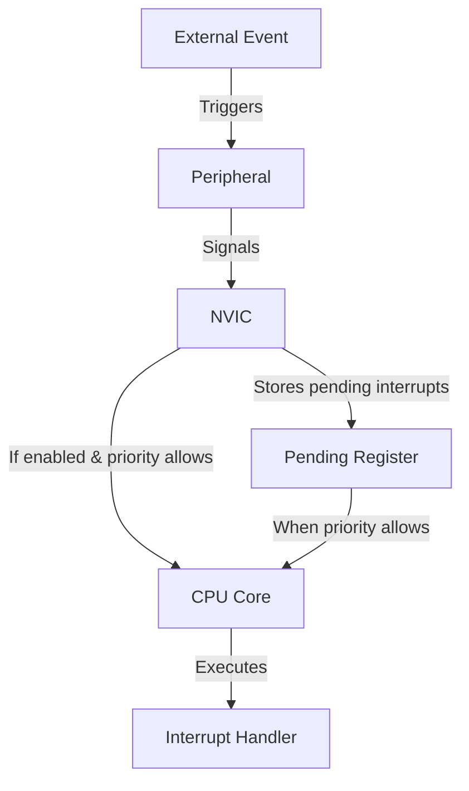

# STM32 NVIC - Nested Vectored Interrupt Controller

## Introduction

The Nested Vectored Interrupt Controller (NVIC) is a core component of ARM Cortex-M processors that powers the STM32 family of microcontrollers. It manages all the interrupts in the system, allowing your microcontroller to respond to external events efficiently and predictably. 

Understanding the NVIC is crucial for developing robust embedded applications that can handle multiple concurrent events while maintaining system stability. This guide will explain how the NVIC works, how to configure it, and how to use it effectively in your STM32 projects.

## What is the NVIC?

The NVIC (Nested Vectored Interrupt Controller) is a dedicated hardware component that:

- Manages interrupt priorities
- Supports nested interrupts (higher priority interrupts can interrupt lower priority ones)
- Provides configurable priority levels
- Handles the vectoring process (automatically jumping to the correct Interrupt Service Routine)
- Allows enabling/disabling specific interrupts



## NVIC Concepts

### Interrupt Vectors

STM32 microcontrollers use a table of function pointers (called the vector table) to determine which handler function to execute when a specific interrupt occurs. Each entry in this table corresponds to a specific interrupt source.

The first few entries in the vector table are reserved for system exceptions like Reset, HardFault, and SysTick, while the remaining entries correspond to peripheral interrupts like USART, SPI, GPIO, etc.

### Priority Levels

The NVIC allows you to assign different priority levels to interrupts. On STM32 devices:

- Lower numerical values represent higher priorities
- The number of priority bits varies by STM32 family (typically 3-4 bits)
- Priority is split into preemption priority and subpriority

### Preemption vs Subpriority

The NVIC in STM32 devices divides priority into two components:

1. **Preemption Priority**: Determines if an interrupt can preempt (interrupt) another interrupt
2. **Subpriority**: Determines which interrupt is handled first when multiple interrupts with the same preemption priority are pending

## Configuring the NVIC in STM32

### Using HAL Library

The most common way to configure the NVIC in STM32 is through the Hardware Abstraction Layer (HAL) library. Here's a typical example:

```c
// NVIC configuration structure
NVIC_InitTypeDef NVIC_InitStructure;

// Configure USART2 interrupt priority
NVIC_InitStructure.NVIC_IRQChannel = USART2_IRQn; // Interrupt source
NVIC_InitStructure.NVIC_IRQChannelPreemptionPriority = 1; // Preemption priority
NVIC_InitStructure.NVIC_IRQChannelSubPriority = 0; // Subpriority
NVIC_InitStructure.NVIC_IRQChannelCmd = ENABLE; // Enable the interrupt

// Initialize the NVIC with these settings
NVIC_Init(&NVIC_InitStructure);
```

### Using STM32CubeMX

With STM32CubeMX, configuring interrupts is even easier:

1. Enable the peripheral you want to use
2. Go to the NVIC settings tab
3. Check the box for the interrupt(s) you want to enable
4. Set the appropriate priority levels
5. Generate the code

### Setting Priority Grouping

Before configuring individual interrupts, you should set how the priority bits are divided between preemption priority and subpriority:

```c
// Set priority grouping (example: 2 bits for preemption, 2 bits for subpriority)
HAL_NVIC_PriorityGroupConfig(NVIC_PRIORITYGROUP_2);
```

Common grouping options include:
- `NVIC_PRIORITYGROUP_0`: 0 bits for preemption, 4 bits for subpriority
- `NVIC_PRIORITYGROUP_2`: 2 bits for preemption, 2 bits for subpriority
- `NVIC_PRIORITYGROUP_4`: 4 bits for preemption, 0 bits for subpriority

## Practical Example: Button Interrupt

Let's implement a common scenario: configuring a GPIO pin to trigger an interrupt when a button is pressed.

```c
// First, we configure the GPIO pin as input with pull-up
void GPIO_Config(void) {
  GPIO_InitTypeDef GPIO_InitStruct = {0};
  
  // Enable GPIOA clock
  __HAL_RCC_GPIOA_CLK_ENABLE();
  
  // Configure PA0 as input with pull-up
  GPIO_InitStruct.Pin = GPIO_PIN_0;
  GPIO_InitStruct.Mode = GPIO_MODE_IT_FALLING; // Interrupt on falling edge
  GPIO_InitStruct.Pull = GPIO_PULLUP;
  HAL_GPIO_Init(GPIOA, &GPIO_InitStruct);
  
  // Configure NVIC for EXTI0 (External interrupt line 0)
  HAL_NVIC_SetPriority(EXTI0_IRQn, 2, 0);
  HAL_NVIC_EnableIRQ(EXTI0_IRQn);
}

// Interrupt handler
void EXTI0_IRQHandler(void) {
  // Check if EXTI line is triggered
  if(__HAL_GPIO_EXTI_GET_IT(GPIO_PIN_0) != RESET) {
    // Clear the interrupt flag
    __HAL_GPIO_EXTI_CLEAR_IT(GPIO_PIN_0);
    
    // Your code here - e.g., toggle LED
    HAL_GPIO_TogglePin(GPIOD, GPIO_PIN_13); // Toggle LED
    
    // Simple debounce
    HAL_Delay(50);
  }
}
```

When the button on PA0 is pressed, it will trigger an interrupt that toggles an LED on PD13.

## Advanced Example: Multiple Prioritized Interrupts

This example shows how to handle multiple interrupts with different priorities:

```c
void System_Config(void) {
  // Set priority grouping
  HAL_NVIC_PriorityGroupConfig(NVIC_PRIORITYGROUP_2);
  
  // Configure UART interrupt (high priority)
  HAL_NVIC_SetPriority(USART2_IRQn, 0, 0);
  HAL_NVIC_EnableIRQ(USART2_IRQn);
  
  // Configure button interrupt (medium priority)
  HAL_NVIC_SetPriority(EXTI0_IRQn, 1, 0);
  HAL_NVIC_EnableIRQ(EXTI0_IRQn);
  
  // Configure timer interrupt (low priority)
  HAL_NVIC_SetPriority(TIM2_IRQn, 2, 0);
  HAL_NVIC_EnableIRQ(TIM2_IRQn);
}
```

In this configuration:
- UART interrupts can preempt both button and timer interrupts
- Button interrupts can preempt timer interrupts
- Timer interrupts have the lowest priority

## Practical Tips for Using NVIC

### Keep ISRs Short

Interrupt Service Routines (ISRs) should be kept as short as possible. A good practice is to set a flag or signal in the ISR and handle the actual work in the main loop:

```c
volatile uint8_t uart_data_ready = 0;
volatile uint8_t received_byte;

// UART interrupt handler
void USART2_IRQHandler(void) {
  if(USART2->SR & USART_SR_RXNE) {
    // Just store the data and set a flag
    received_byte = USART2->DR;
    uart_data_ready = 1;
  }
}

// Main loop
while(1) {
  if(uart_data_ready) {
    // Process the data here (not in the ISR)
    ProcessReceivedByte(received_byte);
    uart_data_ready = 0;
  }
  
  // Other main loop tasks
}
```

### Use Interrupt Priorities Wisely

Reserve high priorities for truly time-critical interrupts. A common priority scheme:

1. Communication errors (highest)
2. Communication data handling
3. Critical sensor readings
4. User interface
5. Background tasks (lowest)

### Be Careful with Shared Resources

When an ISR and main code (or different ISRs) access the same variable:

```c
// In your main code, disable interrupts before accessing shared data
__disable_irq();
shared_variable = new_value;
__enable_irq();

// Alternatively, use critical sections
uint32_t primask_bit = __get_PRIMASK();
__disable_irq();
// Critical section here
if(primask_bit == 0) {
  __enable_irq();
}
```

### Debugging Interrupts

To help debug interrupt-related issues:

```c
// Add counters to track ISR calls
volatile uint32_t uart_isr_count = 0;

void USART2_IRQHandler(void) {
  uart_isr_count++;
  // Rest of ISR code
}
```

## Common Pitfalls

1. **Forgetting to clear interrupt flags**: Most peripherals require you to clear their interrupt flags in the ISR
2. **Nested interrupt overflows**: Too many nested interrupts can cause stack overflow
3. **Priority inversion**: When a high-priority task waits for a low-priority task that's preempted
4. **Shared resource corruption**: Not protecting shared resources between different priority levels
5. **Function calls in ISRs**: Using functions that might take too long or use interrupts themselves

## STM32 NVIC in CubeMX

When using STM32CubeMX, the NVIC configuration becomes much simpler:

1. In the "System Core" section, select "NVIC"
2. Set the desired "Priority Group" (usually NVIC_PRIORITYGROUP_4)
3. Enable each interrupt you need and set its priority
4. CubeMX will generate all the initialization code for you

## Summary

The NVIC is a powerful feature of STM32 microcontrollers that enables efficient handling of system events. Key points to remember:

- The NVIC manages all interrupts with configurable priorities
- Priority is divided into preemption priority and subpriority
- Lower numerical values represent higher priority
- Keep ISRs short and handle the main work in the main loop
- Be careful with shared resources between different interrupt priorities

By mastering the NVIC, you can create responsive embedded systems that efficiently handle multiple events while maintaining system stability.

## Exercises

1. Configure a button interrupt that toggles an LED when pressed
2. Set up two button interrupts with different priorities and observe their behavior
3. Create a system with a timer interrupt, a UART interrupt, and a button interrupt, all with different priorities
4. Experiment with different priority groupings to understand how they affect interrupt behavior
5. Implement a shared resource between an ISR and main code using proper protection

## Additional Resources

- [STM32 Reference Manual](https://www.st.com/resource/en/reference_manual/) - Look for the NVIC section for your specific STM32 family
- [ARM Cortex-M3 Technical Reference Manual](https://developer.arm.com/documentation/ddi0337/e/) - See Chapter 8 for detailed NVIC information
- STMicroelectronics application notes:
  - AN4555: "Using the STM32F7 Series MCU interrupt controller"
  - AN179: "Cortex-M3 Embedded Software Development"