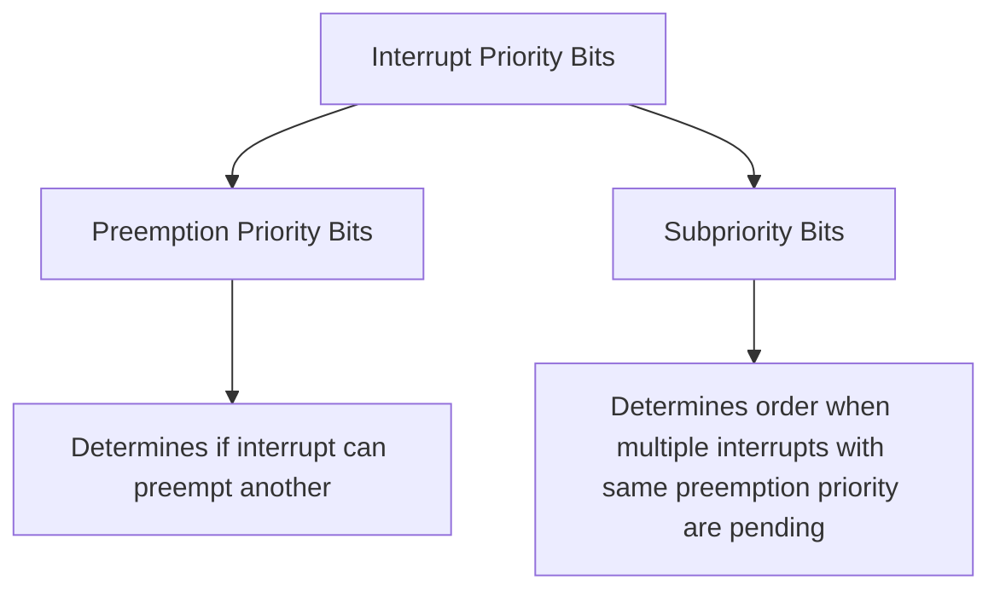
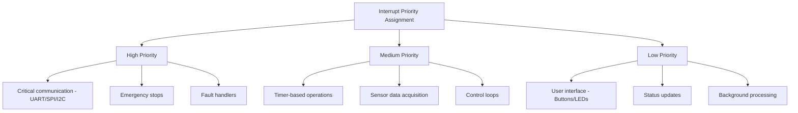

# STM32 Interrupt Priority

## Introduction

Interrupt handling is fundamental to embedded systems programming, allowing microcontrollers to respond to events in real-time. In STM32 microcontrollers, not all interrupts are created equal - some need to be processed more urgently than others. The STM32's Nested Vectored Interrupt Controller (NVIC) provides a sophisticated priority management system that allows developers to define which interrupts should take precedence when multiple interrupts occur simultaneously.

This guide will walk you through how interrupt priorities work in STM32 microcontrollers, how to configure them, and how to implement robust interrupt management strategies in your applications.

## Understanding the NVIC

The STM32 family uses ARM Cortex-M cores which include the Nested Vectored Interrupt Controller (NVIC). The NVIC manages all the external interrupts (like GPIO, timers, communication interfaces) and provides:

- Vectored interrupt handling (automatic branching to specific handler functions)
- Configurable priority levels for each interrupt
- Nested interrupt support (higher priority interrupts can interrupt lower priority ones)
- Priority grouping capabilities

## Priority Levels in STM32

STM32 microcontrollers support different numbers of priority bits depending on the specific Cortex-M core:

- Cortex-M0/M0+: 2 priority bits (4 priority levels)
- Cortex-M3/M4/M7: 4 priority bits (16 priority levels)

However, STM32 uses an **inverted priority numbering system**: lower numerical values represent higher priorities. For example:

- Priority 0 is the highest priority
- Priority 15 (in a system with 4 priority bits) is the lowest priority

## Priority Grouping

One of the more complex aspects of the STM32 NVIC is the concept of priority grouping. The priority value is divided into two parts:

1. **Preemption Priority**: Determines whether an interrupt can preempt another interrupt
2. **Subpriority**: Used to determine the execution order when multiple interrupts with the same preemption priority are pending

The STM32 allows configuration of how many bits are assigned to preemption priority versus subpriority through the `NVIC_PriorityGroupConfig()` function in the Standard Peripheral Library or `HAL_NVIC_SetPriorityGrouping()` in the HAL library.



## Priority Groups in STM32

The STM32 supports several priority grouping options:

| Priority Group | Preemption Bits | Subpriority Bits | Description |
|----------------|----------------|-----------------|-------------|
| Group 0 | 0 | 4 | No preemption, 16 subpriority levels |
| Group 1 | 1 | 3 | 2 preemption levels, 8 subpriority levels |
| Group 2 | 2 | 2 | 4 preemption levels, 4 subpriority levels |
| Group 3 | 3 | 1 | 8 preemption levels, 2 subpriority levels |
| Group 4 | 4 | 0 | 16 preemption levels, no subpriority |

## Configuring Interrupt Priorities

### Using STM32CubeMX

The easiest way to configure interrupt priorities is using STM32CubeMX, which provides a graphical interface:

1. Enable the desired peripheral and its interrupt in the Peripherals Configuration
2. Go to the NVIC tab
3. Enable the corresponding interrupt
4. Set the priority value (remember: lower value = higher priority)

### Using HAL Library

If you're using the HAL library, you can configure priorities in code:

```c
// First, set the priority grouping (usually done once in initialization)
HAL_NVIC_SetPriorityGrouping(NVIC_PRIORITYGROUP_2);  // 4 preemption levels, 4 subpriority levels

// Then configure a specific interrupt priority
// Parameters: IRQn, Preemption Priority, Subpriority
HAL_NVIC_SetPriority(USART2_IRQn, 1, 0);  // Higher priority (preemption 1, subpriority 0)
HAL_NVIC_SetPriority(DMA1_Stream6_IRQn, 2, 1);  // Lower priority (preemption 2, subpriority 1)

// Enable the interrupt
HAL_NVIC_EnableIRQ(USART2_IRQn);
HAL_NVIC_EnableIRQ(DMA1_Stream6_IRQn);
```

### Using Standard Peripheral Library (Legacy)

If you're using the older Standard Peripheral Library:

```c
// Set priority grouping
NVIC_PriorityGroupConfig(NVIC_PriorityGroup_2);  // 4 preemption levels, 4 subpriority levels

// Configure interrupt
NVIC_InitTypeDef NVIC_InitStructure;
NVIC_InitStructure.NVIC_IRQChannel = USART2_IRQn;
NVIC_InitStructure.NVIC_IRQChannelPreemptionPriority = 1;
NVIC_InitStructure.NVIC_IRQChannelSubPriority = 0;
NVIC_InitStructure.NVIC_IRQChannelCmd = ENABLE;
NVIC_Init(&NVIC_InitStructure);
```

## Practical Example: Managing Multiple Interrupts

Here's a complete example demonstrating priority management with UART, timer, and button interrupts:

```c
#include "stm32f4xx_hal.h"

UART_HandleTypeDef huart2;
TIM_HandleTypeDef htim2;

void SystemClock_Config(void);
void Error_Handler(void);
void UART_Init(void);
void TIM2_Init(void);
void GPIO_Init(void);

int main(void)
{
  HAL_Init();
  SystemClock_Config();
  
  // Initialize peripherals
  GPIO_Init();
  UART_Init();
  TIM2_Init();
  
  // Set priority grouping (4 preemption levels, 4 subpriority levels)
  HAL_NVIC_SetPriorityGrouping(NVIC_PRIORITYGROUP_2);
  
  // Configure UART interrupt with high priority
  HAL_NVIC_SetPriority(USART2_IRQn, 0, 0);  // Highest priority
  HAL_NVIC_EnableIRQ(USART2_IRQn);
  
  // Configure timer interrupt with medium priority
  HAL_NVIC_SetPriority(TIM2_IRQn, 1, 0);  // Medium priority
  HAL_NVIC_EnableIRQ(TIM2_IRQn);
  
  // Configure button interrupt (EXTI) with lowest priority
  HAL_NVIC_SetPriority(EXTI0_IRQn, 2, 0);  // Lowest priority
  HAL_NVIC_EnableIRQ(EXTI0_IRQn);
  
  // Start timer
  HAL_TIM_Base_Start_IT(&htim2);
  
  // Enable UART receive interrupt
  HAL_UART_Receive_IT(&huart2, (uint8_t*)rx_buffer, 1);
  
  while (1)
  {
    // Main program loop
    HAL_Delay(1000);
  }
}

// UART Interrupt Handler
void USART2_IRQHandler(void)
{
  HAL_UART_IRQHandler(&huart2);
  // This has highest priority and can interrupt both timer and button handlers
}

// Timer Interrupt Handler
void TIM2_IRQHandler(void)
{
  HAL_TIM_IRQHandler(&htim2);
  // This has medium priority and can interrupt the button handler
  // but will be interrupted by UART handler
}

// Button Interrupt Handler
void EXTI0_IRQHandler(void)
{
  HAL_GPIO_EXTI_IRQHandler(GPIO_PIN_0);
  // This has lowest priority and will be interrupted by both
  // UART and timer handlers
}

// UART Reception Complete Callback
void HAL_UART_RxCpltCallback(UART_HandleTypeDef *huart)
{
  if(huart->Instance == USART2)
  {
    // Process received UART data (highest priority task)
    // Re-enable UART receive interrupt for next byte
    HAL_UART_Receive_IT(&huart2, (uint8_t*)rx_buffer, 1);
  }
}

// Timer Period Elapsed Callback
void HAL_TIM_PeriodElapsedCallback(TIM_HandleTypeDef *htim)
{
  if(htim->Instance == TIM2)
  {
    // Process timer event (medium priority task)
  }
}

// GPIO EXTI Callback
void HAL_GPIO_EXTI_Callback(uint16_t GPIO_Pin)
{
  if(GPIO_Pin == GPIO_PIN_0)
  {
    // Process button press (lowest priority task)
  }
}

// Other initialization functions omitted for brevity
```

## Interrupt Priority Best Practices

When assigning interrupt priorities, consider these guidelines:

1. **Assign higher priorities to time-critical interrupts**:
   - Communication interrupts that require immediate response
   - Safety-critical interrupts (emergency stop, critical error detection)

2. **Assign medium priorities to periodic tasks**:
   - Timer interrupts for timing-sensitive but not critical operations
   - Sensor data acquisition at specific intervals

3. **Assign lower priorities to background tasks**:
   - User interface responses (button presses, LED updates)
   - Non-time-critical status updates

4. **Keep critical sections short**: Minimize the time spent in interrupt handlers to prevent blocking other interrupts

5. **Use consistent priority grouping**: Choose a priority grouping scheme that makes sense for your application and use it consistently

6. **Document your priority scheme**: Create a table documenting all interrupts and their priority levels



## Advanced Topic: System Exceptions

In addition to peripheral interrupts, Cortex-M processors also have system exceptions like SVC, PendSV, and SysTick. These have fixed hardware priorities, but some can be configured:

- HardFault, NMI, MemManage: Fixed highest priorities (cannot be changed)
- SysTick, PendSV: Configurable priorities

If you're using an RTOS, it often uses PendSV for task switching and requires specific priority configurations.

## Advanced Topic: Critical Sections

Sometimes you need to ensure that certain code sections are not interrupted. STM32 provides functions to temporarily disable interrupts:

```c
// Disable all interrupts
__disable_irq();

// Critical section code here

// Re-enable interrupts
__enable_irq();
```

For more selective control, you can modify specific interrupt priorities dynamically:

```c
// Save current priority and temporarily disable a specific interrupt
uint32_t previousPriority = NVIC_GetPriority(USART2_IRQn);
NVIC_SetPriority(USART2_IRQn, 0xFF);  // Set to lowest priority (effectively disabled)

// Critical section code here

// Restore original priority
NVIC_SetPriority(USART2_IRQn, previousPriority);
```

## Real-World Application: Motor Control System

Consider a motor control system with multiple interrupt sources:

- Encoder interrupt (position feedback) - Highest priority
- Current sensing ADC interrupt - High priority
- Control loop timer interrupt - Medium priority
- Communication UART interrupt - Medium-low priority
- User interface button interrupt - Lowest priority

```c
// Initialize priority grouping
HAL_NVIC_SetPriorityGrouping(NVIC_PRIORITYGROUP_4);  // 16 preemption levels

// Configure interrupt priorities
// Encoder interrupt (critical for position tracking)
HAL_NVIC_SetPriority(EXTI1_IRQn, 0, 0);

// Current sensing (critical for overcurrent protection)
HAL_NVIC_SetPriority(ADC_IRQn, 1, 0);

// Control loop timer
HAL_NVIC_SetPriority(TIM1_UP_TIM10_IRQn, 2, 0);

// Communication UART
HAL_NVIC_SetPriority(USART2_IRQn, 3, 0);

// User interface buttons
HAL_NVIC_SetPriority(EXTI0_IRQn, 4, 0);

// Enable all interrupts
HAL_NVIC_EnableIRQ(EXTI1_IRQn);
HAL_NVIC_EnableIRQ(ADC_IRQn);
HAL_NVIC_EnableIRQ(TIM1_UP_TIM10_IRQn);
HAL_NVIC_EnableIRQ(USART2_IRQn);
HAL_NVIC_EnableIRQ(EXTI0_IRQn);
```

This ensures that critical safety and control functions are never delayed by lower-priority communication or user interface tasks.

## Common Pitfalls

1. **Priority Inversion**: When a high-priority task is indirectly blocked by a low-priority task through shared resources. Solution: Use proper resource locking mechanisms.

2. **Interrupt Starvation**: When a high-priority interrupt occurs so frequently that lower-priority interrupts never execute. Solution: Keep interrupt handlers short and consider timing more carefully.

3. **Forgetting to Enable Interrupts**: After configuring priorities, you must still enable the interrupt. Checklist:
   - Configure peripheral
   - Set interrupt priority
   - Enable interrupt in NVIC
   - Enable specific interrupt in peripheral

4. **Incorrect Priority Grouping**: Using different priority grouping in different parts of code. Solution: Set priority grouping once at startup.

## Summary

STM32 microcontrollers offer a powerful and flexible interrupt priority management system through the NVIC. By understanding how priorities work and how to configure them properly, you can create robust embedded systems that respond appropriately to different events based on their importance.

Key points to remember:
- Lower numerical values represent higher priorities in STM32
- Priority grouping divides priority into preemption priority and subpriority
- Choose priority grouping based on your application needs
- Assign priorities based on time sensitivity and importance of tasks
- Keep interrupt handlers short to prevent blocking other interrupts

## Exercises

1. Set up a project with three interrupts: a timer interrupt, a UART receive interrupt, and a button press interrupt. Configure them with different priorities and observe how they interact.

2. Experiment with different priority grouping configurations to understand how preemption works.

3. Create a situation where a low-priority interrupt is executing and a high-priority interrupt occurs. Use debug tools to observe the preemption behavior.

4. Implement a simple critical section that cannot be interrupted by any interrupt except NMI.

5. Design a priority scheme for a hypothetical embedded application with at least 5 different interrupt sources.

## Additional Resources

- [STM32 HAL Documentation](https://www.st.com/resource/en/user_manual/dm00105879-description-of-stm32f4-hal-and-ll-drivers-stmicroelectronics.pdf)
- [ARM Cortex-M4 Generic User Guide](https://developer.arm.com/documentation/dui0553/latest/)
- [ARM NVIC Documentation](https://developer.arm.com/documentation/dui0552/a/cortex-m3-peripherals/nested-vectored-interrupt-controller)
- [STM32 Application Note: Managing Nested Interrupts](https://www.st.com/resource/en/application_note/an4837-managing-nested-interrupts-in-the-stm32f7-series-stmicroelectronics.pdf)