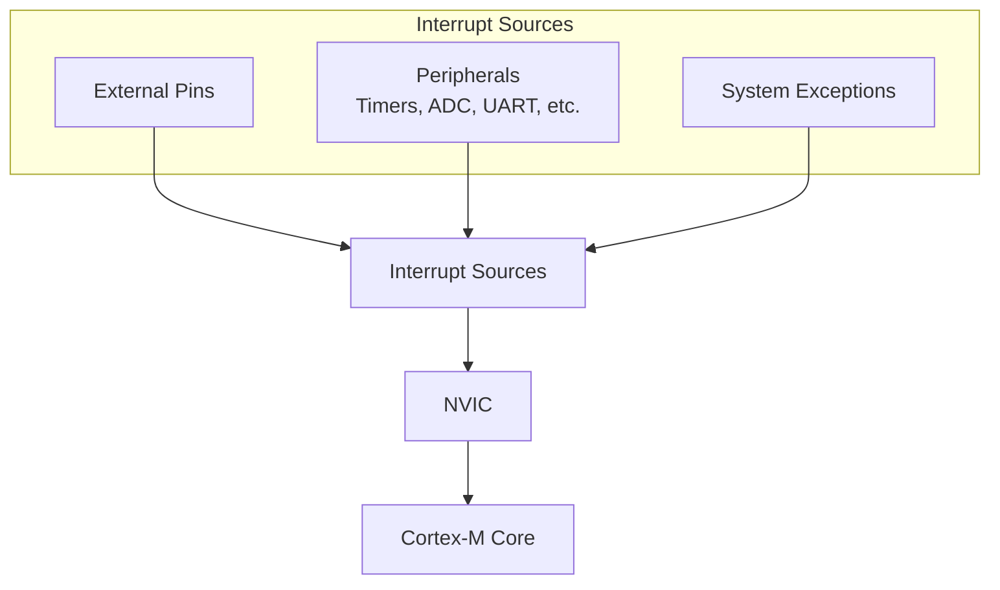

# STM32 Interrupt Configuration

## Introduction

Interrupts are a fundamental concept in embedded systems that allow microcontrollers to respond to events without constantly polling for them. On STM32 microcontrollers, interrupts provide an efficient way to handle external signals, timer events, and other asynchronous occurrences. This guide will walk you through the process of configuring and using interrupts on STM32 devices, with practical examples to reinforce your understanding.

## What Are Interrupts?

Interrupts are hardware or software signals that temporarily pause the normal execution of your program to handle a high-priority event. Think of them as urgent notifications that require immediate attention. When an interrupt occurs, the microcontroller:

1. Pauses its current task
2. Saves its context (registers and state)
3. Executes an Interrupt Service Routine (ISR)
4. Restores the context
5. Resumes the original task

This mechanism allows your microcontroller to respond to events promptly without wasting CPU cycles checking for them repeatedly.

## STM32 Interrupt Architecture

STM32 microcontrollers are based on the ARM Cortex-M core, which includes the Nested Vectored Interrupt Controller (NVIC). The NVIC manages all interrupts in the system and offers features like:

- Support for up to 240 interrupts (depending on the specific STM32 model)
- 16 programmable priority levels
- Automatic saving and restoring of processor state
- Nested interrupt handling



## Interrupt Priority Levels

The STM32 allows you to assign priority levels to interrupts, determining which interrupt takes precedence when multiple interrupts occur simultaneously. The priority system works as follows:

- Lower numerical values represent higher priorities
- Priority grouping allows you to configure preemption and sub-priority levels
- STM32F4 devices, for example, use 4 bits for priority, giving 16 priority levels (0-15)

## Configuring Interrupts on STM32

Let's walk through the step-by-step process of configuring interrupts on an STM32 microcontroller.

### Step 1: Enable the Peripheral Clock

First, we need to enable the clock for the peripheral we want to use with interrupts:

```c
// Enable GPIOA clock
RCC->AHB1ENR |= RCC_AHB1ENR_GPIOAEN;
```

### Step 2: Configure the GPIO Pin

For external interrupts, configure the GPIO pin that will trigger the interrupt:

```c
// Configure PA0 as input with pull-up
GPIOA->MODER &= ~GPIO_MODER_MODE0;     // Set as input (00)
GPIOA->PUPDR &= ~GPIO_PUPDR_PUPD0;     // Clear bits
GPIOA->PUPDR |= GPIO_PUPDR_PUPD0_0;    // Set as pull-up (01)
```

### Step 3: Configure the EXTI Line

For external interrupts, we need to configure the EXTI (External Interrupt) line:

```c
// Connect PA0 to EXTI line 0
SYSCFG->EXTICR[0] &= ~SYSCFG_EXTICR1_EXTI0;    // Clear EXTI0 bits
SYSCFG->EXTICR[0] |= SYSCFG_EXTICR1_EXTI0_PA;  // Set PA for EXTI0

// Configure EXTI line 0 for falling edge trigger
EXTI->FTSR |= EXTI_FTSR_TR0;    // Enable falling trigger
EXTI->RTSR &= ~EXTI_RTSR_TR0;   // Disable rising trigger

// Enable EXTI line 0
EXTI->IMR |= EXTI_IMR_MR0;      // Enable interrupt on EXTI0
```

### Step 4: Configure the NVIC

Now we need to configure the NVIC to handle our interrupt:

```c
// Set priority for EXTI0 interrupt
NVIC_SetPriority(EXTI0_IRQn, 2);  // Priority level 2

// Enable EXTI0 interrupt in the NVIC
NVIC_EnableIRQ(EXTI0_IRQn);
```

### Step 5: Implement the Interrupt Service Routine (ISR)

Finally, we need to write the Interrupt Service Routine that will be executed when the interrupt occurs:

```c
void EXTI0_IRQHandler(void)
{
    // Check if EXTI Line 0 interrupt occurred
    if (EXTI->PR & EXTI_PR_PR0)
    {
        // Toggle LED connected to PA5
        GPIOA->ODR ^= GPIO_ODR_OD5;
        
        // Clear the EXTI line 0 pending bit
        EXTI->PR = EXTI_PR_PR0;
    }
}
```

## Complete Example: Button Interrupt

Let's put it all together with a complete example. We'll configure an STM32F4 to toggle an LED whenever a button is pressed:

```c
#include "stm32f4xx.h"

void SystemInit(void);
void configureGPIO(void);
void configureInterrupt(void);

int main(void)
{
    // Initialize system
    SystemInit();
    
    // Configure GPIO pins
    configureGPIO();
    
    // Configure interrupt
    configureInterrupt();
    
    // Main loop
    while (1)
    {
        // The main program continues running
        // LED toggling is handled by the interrupt
    }
}

void configureGPIO(void)
{
    // Enable clocks for GPIOA
    RCC->AHB1ENR |= RCC_AHB1ENR_GPIOAEN;
    
    // Configure PA0 (button) as input with pull-up
    GPIOA->MODER &= ~GPIO_MODER_MODE0;
    GPIOA->PUPDR &= ~GPIO_PUPDR_PUPD0;
    GPIOA->PUPDR |= GPIO_PUPDR_PUPD0_0;
    
    // Configure PA5 (LED) as output
    GPIOA->MODER &= ~GPIO_MODER_MODE5;
    GPIOA->MODER |= GPIO_MODER_MODE5_0;
    GPIOA->OTYPER &= ~GPIO_OTYPER_OT5;
    GPIOA->OSPEEDR &= ~GPIO_OSPEEDR_OSPEED5;
}

void configureInterrupt(void)
{
    // Enable SYSCFG clock
    RCC->APB2ENR |= RCC_APB2ENR_SYSCFGEN;
    
    // Connect PA0 to EXTI line 0
    SYSCFG->EXTICR[0] &= ~SYSCFG_EXTICR1_EXTI0;
    SYSCFG->EXTICR[0] |= SYSCFG_EXTICR1_EXTI0_PA;
    
    // Configure EXTI line 0 for falling edge trigger
    EXTI->FTSR |= EXTI_FTSR_TR0;    // Enable falling trigger
    EXTI->RTSR &= ~EXTI_RTSR_TR0;   // Disable rising trigger
    
    // Enable EXTI line 0
    EXTI->IMR |= EXTI_IMR_MR0;
    
    // Set priority and enable interrupt in NVIC
    NVIC_SetPriority(EXTI0_IRQn, 2);
    NVIC_EnableIRQ(EXTI0_IRQn);
}

void EXTI0_IRQHandler(void)
{
    // Check if EXTI Line 0 interrupt occurred
    if (EXTI->PR & EXTI_PR_PR0)
    {
        // Toggle LED
        GPIOA->ODR ^= GPIO_ODR_OD5;
        
        // Clear the EXTI line 0 pending bit
        EXTI->PR = EXTI_PR_PR0;
    }
}
```

## Real-World Application: UART Receive Interrupt

In real-world applications, polling for incoming data can be inefficient. Let's see how to use interrupts to handle UART communication:

```c
#include "stm32f4xx.h"
#include <string.h>

#define BUFFER_SIZE 64

volatile uint8_t rxBuffer[BUFFER_SIZE];
volatile uint8_t rxIndex = 0;
volatile uint8_t dataReady = 0;

void SystemInit(void);
void UART2_Init(void);
void processData(void);

int main(void)
{
    // Initialize system
    SystemInit();
    
    // Initialize UART with interrupt
    UART2_Init();
    
    while (1)
    {
        if (dataReady)
        {
            processData();
            dataReady = 0;
            rxIndex = 0;
        }
        
        // Do other tasks...
    }
}

void UART2_Init(void)
{
    // Enable clocks
    RCC->AHB1ENR |= RCC_AHB1ENR_GPIOAEN;
    RCC->APB1ENR |= RCC_APB1ENR_USART2EN;
    
    // Configure PA2 (TX) and PA3 (RX) for UART
    GPIOA->MODER &= ~(GPIO_MODER_MODE2 | GPIO_MODER_MODE3);
    GPIOA->MODER |= (GPIO_MODER_MODE2_1 | GPIO_MODER_MODE3_1); // Alternate function
    
    // Set alternate function AF7 (USART2) for PA2 and PA3
    GPIOA->AFR[0] &= ~(GPIO_AFRL_AFRL2 | GPIO_AFRL_AFRL3);
    GPIOA->AFR[0] |= ((7 << GPIO_AFRL_AFSEL2_Pos) | (7 << GPIO_AFRL_AFSEL3_Pos));
    
    // Configure UART: 9600 baud, 8-bit data, no parity, 1 stop bit
    // For 16MHz system clock, USARTDIV = 16MHz/9600 = 1666.67 = 0x683
    USART2->BRR = 0x683;
    
    // Enable UART receiver, transmitter, and receive interrupt
    USART2->CR1 = USART_CR1_RE | USART_CR1_TE | USART_CR1_RXNEIE;
    
    // Enable UART
    USART2->CR1 |= USART_CR1_UE;
    
    // Enable USART2 interrupt in NVIC
    NVIC_SetPriority(USART2_IRQn, 1);
    NVIC_EnableIRQ(USART2_IRQn);
}

void processData(void)
{
    // Example: Echo received data back
    for (uint8_t i = 0; i < rxIndex; i++)
    {
        // Wait until transmit buffer is empty
        while (!(USART2->SR & USART_SR_TXE));
        
        // Send the byte
        USART2->DR = rxBuffer[i];
    }
}

void USART2_IRQHandler(void)
{
    // Check if data is received
    if (USART2->SR & USART_SR_RXNE)
    {
        // Read the received byte
        uint8_t data = USART2->DR;
        
        // Store in buffer if there's space
        if (rxIndex < BUFFER_SIZE - 1)
        {
            rxBuffer[rxIndex++] = data;
            
            // Check for end of message (carriage return)
            if (data == '\r')
            {
                rxBuffer[rxIndex] = '\0'; // Null terminate
                dataReady = 1;
            }
        }
        else
        {
            // Buffer overflow, reset index
            rxIndex = 0;
        }
    }
}
```

## Timer Interrupt Example

Another common use of interrupts is with timers to perform periodic tasks:

```c
#include "stm32f4xx.h"

void SystemInit(void);
void Timer2_Init(void);

int main(void)
{
    // Initialize system
    SystemInit();
    
    // Initialize GPIO for LED
    RCC->AHB1ENR |= RCC_AHB1ENR_GPIOAEN;
    GPIOA->MODER &= ~GPIO_MODER_MODE5;
    GPIOA->MODER |= GPIO_MODER_MODE5_0;
    
    // Initialize Timer2 for 1Hz interrupt
    Timer2_Init();
    
    while (1)
    {
        // Main program runs while timer interrupt handles LED blinking
    }
}

void Timer2_Init(void)
{
    // Enable Timer2 clock
    RCC->APB1ENR |= RCC_APB1ENR_TIM2EN;
    
    // Set prescaler to get 1MHz timer clock
    // 16MHz / 16 = 1MHz
    TIM2->PSC = 15;
    
    // Set auto-reload value for 1Hz interrupts
    // 1MHz / 1,000,000 = 1Hz
    TIM2->ARR = 1000000 - 1;
    
    // Enable update interrupt
    TIM2->DIER |= TIM_DIER_UIE;
    
    // Enable Timer2 counter
    TIM2->CR1 |= TIM_CR1_CEN;
    
    // Enable Timer2 interrupt in NVIC
    NVIC_SetPriority(TIM2_IRQn, 3);
    NVIC_EnableIRQ(TIM2_IRQn);
}

void TIM2_IRQHandler(void)
{
    // Check if update interrupt flag is set
    if (TIM2->SR & TIM_SR_UIF)
    {
        // Toggle LED
        GPIOA->ODR ^= GPIO_ODR_OD5;
        
        // Clear the update interrupt flag
        TIM2->SR &= ~TIM_SR_UIF;
    }
}
```

## Common Mistakes and Best Practices

When working with STM32 interrupts, be aware of these common pitfalls and best practices:

### Mistakes to Avoid:

1. **Forgetting to clear interrupt flags**: Always clear the interrupt flag in your ISR to prevent the interrupt from triggering repeatedly.
2. **Long-running ISRs**: Keep your ISRs short and quick. Lengthy processing should be delegated to the main loop.
3. **Accessing shared resources without protection**: If both your ISR and main code access the same variables, use volatile qualifiers and consider atomic operations.
4. **Incorrect priority settings**: Set appropriate priorities based on response time requirements.

### Best Practices:

1. **Use flags to communicate between ISRs and main code**: Set flags in ISRs and check them in the main loop rather than doing heavy processing in the ISR.
2. **Declare shared variables as volatile**: This ensures the compiler doesn't optimize away necessary memory accesses.
3. **Keep ISRs minimal**: Do only what's necessary in the ISR and defer other processing to the main loop.
4. **Use proper naming conventions**: Name your ISRs according to STM32 conventions for clarity.

```c
// Good example: Flag-based approach
volatile uint8_t dataReady = 0;

void EXTI0_IRQHandler(void)
{
    if (EXTI->PR & EXTI_PR_PR0)
    {
        dataReady = 1;  // Set flag, don't process here
        EXTI->PR = EXTI_PR_PR0;  // Clear pending bit
    }
}

// In main loop
while (1)
{
    if (dataReady)
    {
        processData();  // Process data in main loop
        dataReady = 0;  // Reset flag
    }
}
```

## STM32 HAL vs. Direct Register Access

While the examples in this tutorial use direct register access for educational purposes, in production environments, many developers use the STM32 Hardware Abstraction Layer (HAL) to configure interrupts:

```c
// HAL example for button interrupt
void HAL_GPIO_EXTI_Callback(uint16_t GPIO_Pin)
{
    if (GPIO_Pin == GPIO_PIN_0)
    {
        HAL_GPIO_TogglePin(GPIOA, GPIO_PIN_5);  // Toggle LED
    }
}
```

The HAL provides a more portable and easier-to-use interface but at the cost of some overhead and abstraction from the hardware details.

## Summary

Interrupts are a powerful feature of STM32 microcontrollers that allow your system to respond efficiently to events. In this guide, we've covered:

- The basic concept of interrupts and their importance
- STM32's interrupt architecture based on the NVIC
- Step-by-step configuration of external, UART, and timer interrupts
- Real-world examples showing practical applications
- Common mistakes and best practices

By mastering interrupt configuration, you can create more efficient and responsive embedded systems that save power and CPU resources.

## Exercises

To reinforce your understanding, try these exercises:

1. Modify the button interrupt example to toggle the LED only after the button has been pressed 3 times.
2. Create a system that uses a timer interrupt to sample an ADC channel every 100ms.
3. Implement a UART command processor that receives commands via interrupt and executes different actions based on the command received.
4. Configure an external interrupt with a debounce mechanism to handle button bounce.
5. Create a priority-based interrupt system where a higher-priority interrupt can preempt a lower-priority one.

## Additional Resources

For further reading on STM32 interrupts:

- STM32 Reference Manuals for your specific device
- ARM Cortex-M3/M4 Programming Guide
- ST's HAL and LL Driver Documentation
- STM32CubeIDE Documentation on Interrupt Configuration