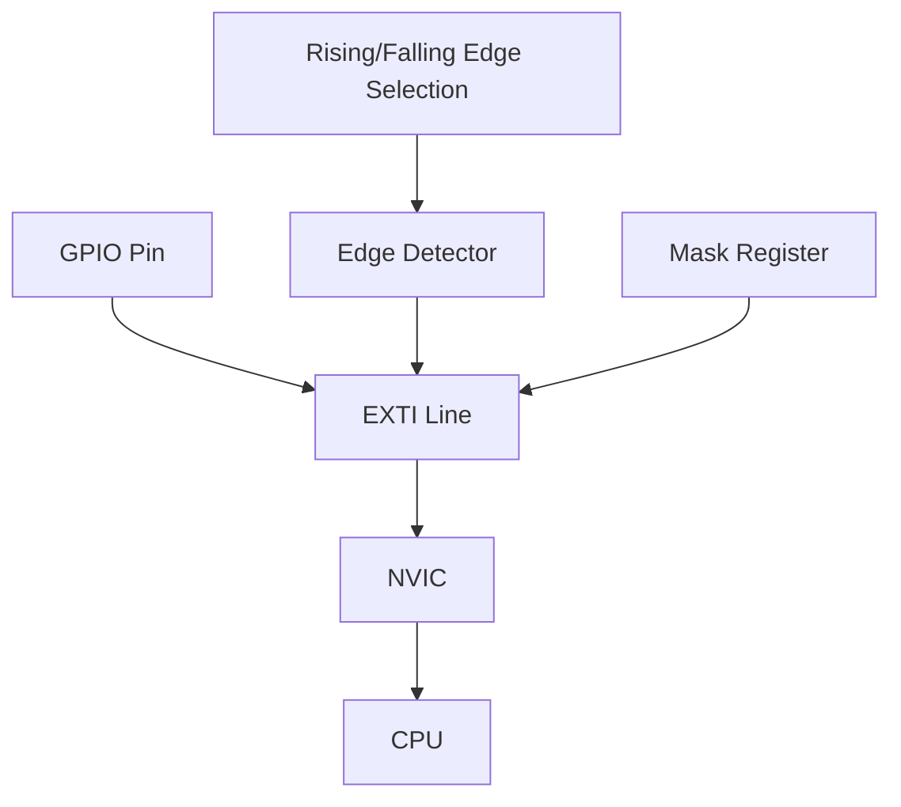

# STM32 External Interrupts

## Introduction

External interrupts are a powerful feature of the STM32 microcontrollers that allow your application to respond immediately to events happening outside the microcontroller. Unlike polling where you continuously check for an input change, interrupts let the microcontroller continue with other tasks until an external event occurs.

External interrupts can be triggered by:
- Button presses
- Sensor outputs
- Communication signals
- External device notifications

In this tutorial, we'll explore how to configure and use external interrupts on STM32 microcontrollers, their benefits, and practical applications.

## Why Use External Interrupts?

External interrupts offer several advantages over polling:

1. **Efficiency**: CPU only processes inputs when they change, saving processing time
2. **Responsiveness**: Immediate reaction to external events
3. **Power optimization**: Critical for battery-powered applications
4. **Multitasking**: Handle multiple inputs without blocking the main program flow

## STM32 External Interrupt Architecture

STM32 microcontrollers feature a sophisticated external interrupt system:



Key components include:

- **EXTI (External Interrupt/Event Controller)**: Routes GPIO signals to the NVIC
- **GPIO pins**: Physical pins that connect to external devices
- **NVIC (Nested Vectored Interrupt Controller)**: Manages interrupt priorities and forwarding to the CPU

Each GPIO pin is connected to a specific EXTI line based on its pin number. For example, PA0, PB0, PC0, etc., all share EXTI line 0.

## Configuring External Interrupts

Let's walk through the process of setting up an external interrupt step by step.

### 1. Enable GPIO Clock

First, we need to enable the clock for the GPIO port we'll be using:

```c
// Enable GPIOA clock
RCC->AHB2ENR |= RCC_AHB2ENR_GPIOAEN;
```

### 2. Configure GPIO Pin

Configure the GPIO pin as input with pull-up or pull-down resistor:

```c
// Configure PA0 as input with pull-up
GPIOA->MODER &= ~GPIO_MODER_MODE0;           // Input mode (00)
GPIOA->PUPDR &= ~GPIO_PUPDR_PUPD0;           // Clear pull-up/pull-down
GPIOA->PUPDR |= GPIO_PUPDR_PUPD0_0;          // Set pull-up (01)
```

### 3. Connect GPIO Pin to EXTI Line

Select the GPIO port for the EXTI line using the SYSCFG module:

```c
// Enable SYSCFG clock
RCC->APB2ENR |= RCC_APB2ENR_SYSCFGEN;

// Connect PA0 to EXTI0
SYSCFG->EXTICR[0] &= ~SYSCFG_EXTICR1_EXTI0;  // Clear EXTI0 bits
SYSCFG->EXTICR[0] |= SYSCFG_EXTICR1_EXTI0_PA; // Select PA0
```

### 4. Configure EXTI Line

Set the trigger type (rising edge, falling edge, or both) and enable the EXTI line:

```c
// Configure EXTI0 to trigger on falling edge
EXTI->FTSR1 |= EXTI_FTSR1_FT0;              // Enable falling edge trigger
EXTI->RTSR1 &= ~EXTI_RTSR1_RT0;             // Disable rising edge trigger
EXTI->IMR1 |= EXTI_IMR1_IM0;                // Enable EXTI0 interrupt
```

### 5. Configure NVIC

Set the priority and enable the EXTI interrupt in the NVIC:

```c
// Set priority and enable EXTI0 interrupt in NVIC
NVIC_SetPriority(EXTI0_IRQn, 0);            // Highest priority
NVIC_EnableIRQ(EXTI0_IRQn);                 // Enable interrupt
```

### 6. Implement the Interrupt Handler

Define the interrupt handler function:

```c
void EXTI0_IRQHandler(void) {
    // Check if EXTI0 interrupt flag is set
    if (EXTI->PR1 & EXTI_PR1_PIF0) {
        // Clear the EXTI0 interrupt flag
        EXTI->PR1 |= EXTI_PR1_PIF0;
        
        // Your interrupt handling code here
        // For example, toggle an LED
        GPIOB->ODR ^= GPIO_ODR_OD7;
        
        // Add debounce delay if connected to a button
        // Simple delay for debouncing (not ideal but simple)
        for(volatile int i = 0; i < 50000; i++);
    }
}
```

## Complete Example: Button Interrupt

Here's a complete example that toggles an LED when a button is pressed:

```c
#include "stm32l4xx.h"

void SystemClock_Config(void);
void GPIO_Init(void);
void EXTI_Init(void);

int main(void) {
    // Initialize system clock
    SystemClock_Config();
    
    // Initialize GPIO
    GPIO_Init();
    
    // Initialize External Interrupt
    EXTI_Init();
    
    // Enable global interrupts
    __enable_irq();
    
    while (1) {
        // Main program loop
        // The CPU can perform other tasks here
        // It will be interrupted when the button is pressed
    }
}

void GPIO_Init(void) {
    // Enable GPIO clocks
    RCC->AHB2ENR |= RCC_AHB2ENR_GPIOAEN;  // GPIOA clock for button
    RCC->AHB2ENR |= RCC_AHB2ENR_GPIOBEN;  // GPIOB clock for LED
    
    // Configure PA0 as input with pull-up (for button)
    GPIOA->MODER &= ~GPIO_MODER_MODE0;
    GPIOA->PUPDR &= ~GPIO_PUPDR_PUPD0;
    GPIOA->PUPDR |= GPIO_PUPDR_PUPD0_0;
    
    // Configure PB7 as output (for LED)
    GPIOB->MODER &= ~GPIO_MODER_MODE7;
    GPIOB->MODER |= GPIO_MODER_MODE7_0;
    GPIOB->OTYPER &= ~GPIO_OTYPER_OT7;     // Push-pull
    GPIOB->OSPEEDR |= GPIO_OSPEEDR_OSPEED7; // High speed
    GPIOB->ODR &= ~GPIO_ODR_OD7;            // LED off initially
}

void EXTI_Init(void) {
    // Enable SYSCFG clock
    RCC->APB2ENR |= RCC_APB2ENR_SYSCFGEN;
    
    // Connect PA0 to EXTI0
    SYSCFG->EXTICR[0] &= ~SYSCFG_EXTICR1_EXTI0;
    SYSCFG->EXTICR[0] |= SYSCFG_EXTICR1_EXTI0_PA;
    
    // Configure EXTI0 to trigger on falling edge (button press)
    EXTI->FTSR1 |= EXTI_FTSR1_FT0;        // Enable falling edge trigger
    EXTI->RTSR1 &= ~EXTI_RTSR1_RT0;       // Disable rising edge trigger
    EXTI->IMR1 |= EXTI_IMR1_IM0;          // Enable EXTI0 interrupt
    
    // Set priority and enable EXTI0 interrupt in NVIC
    NVIC_SetPriority(EXTI0_IRQn, 0);      // Highest priority
    NVIC_EnableIRQ(EXTI0_IRQn);           // Enable interrupt
}

void EXTI0_IRQHandler(void) {
    // Check if EXTI0 interrupt flag is set
    if (EXTI->PR1 & EXTI_PR1_PIF0) {
        // Clear the EXTI0 interrupt flag
        EXTI->PR1 |= EXTI_PR1_PIF0;
        
        // Toggle LED
        GPIOB->ODR ^= GPIO_ODR_OD7;
        
        // Simple delay for debouncing
        for(volatile int i = 0; i < 50000; i++);
    }
}

// System clock configuration function (implementation not shown)
void SystemClock_Config(void) {
    // Configure system clock
    // ...
}
```

## Practical Example: Multiple Button Interrupts

You can expand the concept to handle multiple buttons connected to different GPIO pins:

```c
#include "stm32l4xx.h"

void SystemClock_Config(void);
void GPIO_Init(void);
void EXTI_Init(void);

int main(void) {
    SystemClock_Config();
    GPIO_Init();
    EXTI_Init();
    __enable_irq();
    
    while (1) {
        // Main program loop
    }
}

void GPIO_Init(void) {
    // Enable GPIO clocks
    RCC->AHB2ENR |= RCC_AHB2ENR_GPIOAEN | RCC_AHB2ENR_GPIOBEN;
    
    // Configure PA0 and PA1 as inputs with pull-up (for buttons)
    GPIOA->MODER &= ~(GPIO_MODER_MODE0 | GPIO_MODER_MODE1);
    GPIOA->PUPDR &= ~(GPIO_PUPDR_PUPD0 | GPIO_PUPDR_PUPD1);
    GPIOA->PUPDR |= (GPIO_PUPDR_PUPD0_0 | GPIO_PUPDR_PUPD1_0);
    
    // Configure PB0 and PB1 as outputs (for LEDs)
    GPIOB->MODER &= ~(GPIO_MODER_MODE0 | GPIO_MODER_MODE1);
    GPIOB->MODER |= (GPIO_MODER_MODE0_0 | GPIO_MODER_MODE1_0);
    GPIOB->OTYPER &= ~(GPIO_OTYPER_OT0 | GPIO_OTYPER_OT1);
    GPIOB->OSPEEDR |= (GPIO_OSPEEDR_OSPEED0 | GPIO_OSPEEDR_OSPEED1);
    GPIOB->ODR &= ~(GPIO_ODR_OD0 | GPIO_ODR_OD1);
}

void EXTI_Init(void) {
    // Enable SYSCFG clock
    RCC->APB2ENR |= RCC_APB2ENR_SYSCFGEN;
    
    // Connect PA0 to EXTI0 and PA1 to EXTI1
    SYSCFG->EXTICR[0] &= ~(SYSCFG_EXTICR1_EXTI0 | SYSCFG_EXTICR1_EXTI1);
    SYSCFG->EXTICR[0] |= (SYSCFG_EXTICR1_EXTI0_PA | SYSCFG_EXTICR1_EXTI1_PA);
    
    // Configure EXTI0 and EXTI1 to trigger on falling edge
    EXTI->FTSR1 |= (EXTI_FTSR1_FT0 | EXTI_FTSR1_FT1);
    EXTI->RTSR1 &= ~(EXTI_RTSR1_RT0 | EXTI_RTSR1_RT1);
    EXTI->IMR1 |= (EXTI_IMR1_IM0 | EXTI_IMR1_IM1);
    
    // Set priority and enable interrupts in NVIC
    NVIC_SetPriority(EXTI0_IRQn, 0);
    NVIC_EnableIRQ(EXTI0_IRQn);
    
    NVIC_SetPriority(EXTI1_IRQn, 1);
    NVIC_EnableIRQ(EXTI1_IRQn);
}

void EXTI0_IRQHandler(void) {
    if (EXTI->PR1 & EXTI_PR1_PIF0) {
        EXTI->PR1 |= EXTI_PR1_PIF0;  // Clear flag
        
        // Toggle LED0
        GPIOB->ODR ^= GPIO_ODR_OD0;
        
        // Debounce
        for(volatile int i = 0; i < 50000; i++);
    }
}

void EXTI1_IRQHandler(void) {
    if (EXTI->PR1 & EXTI_PR1_PIF1) {
        EXTI->PR1 |= EXTI_PR1_PIF1;  // Clear flag
        
        // Toggle LED1
        GPIOB->ODR ^= GPIO_ODR_OD1;
        
        // Debounce
        for(volatile int i = 0; i < 50000; i++);
    }
}
```

## Advanced Techniques

### Line Sharing and Port Selection

As mentioned earlier, GPIO pins with the same number (regardless of port) share the same EXTI line. For example, PA1, PB1, PC1, etc., all use EXTI line 1. This means you can only use one pin with the same number for interrupts at a time.

The SYSCFG_EXTICR registers let you select which port's pin connects to each EXTI line:

```c
// For PA0 to EXTI0
SYSCFG->EXTICR[0] |= SYSCFG_EXTICR1_EXTI0_PA;

// For PB0 to EXTI0
SYSCFG->EXTICR[0] |= SYSCFG_EXTICR1_EXTI0_PB;

// For PC0 to EXTI0
SYSCFG->EXTICR[0] |= SYSCFG_EXTICR1_EXTI0_PC;
```

### Interrupt Priority

STM32 allows setting priorities for interrupts, which determines which interrupt is processed first when multiple interrupts occur simultaneously:

```c
// Set EXTI0 to highest priority (0)
NVIC_SetPriority(EXTI0_IRQn, 0);

// Set EXTI1 to lower priority (1)
NVIC_SetPriority(EXTI1_IRQn, 1);
```

### Debouncing Strategies

Hardware buttons often "bounce," causing multiple interrupts on a single press. Here are better ways to handle debouncing than the simple delay used in our examples:

1. **Timer-based debouncing**:
```c
// In the interrupt handler
void EXTI0_IRQHandler(void) {
    if (EXTI->PR1 & EXTI_PR1_PIF0) {
        EXTI->PR1 |= EXTI_PR1_PIF0;  // Clear flag
        
        // Disable this interrupt temporarily
        EXTI->IMR1 &= ~EXTI_IMR1_IM0;
        
        // Toggle LED
        GPIOB->ODR ^= GPIO_ODR_OD7;
        
        // Start a timer to re-enable the interrupt after a delay
        // ...timer setup code...
    }
}

// In the timer interrupt handler
void TIM2_IRQHandler(void) {
    if (TIM2->SR & TIM_SR_UIF) {
        TIM2->SR &= ~TIM_SR_UIF;  // Clear flag
        
        // Re-enable the button interrupt
        EXTI->IMR1 |= EXTI_IMR1_IM0;
        
        // Stop the timer
        TIM2->CR1 &= ~TIM_CR1_CEN;
    }
}
```

2. **Software debouncing with time stamps**:
```c
volatile uint32_t lastPressTime = 0;
uint32_t debounceDelay = 50;  // ms

void EXTI0_IRQHandler(void) {
    if (EXTI->PR1 & EXTI_PR1_PIF0) {
        EXTI->PR1 |= EXTI_PR1_PIF0;  // Clear flag
        
        uint32_t currentTime = HAL_GetTick();  // Get current time in ms
        
        if (currentTime - lastPressTime > debounceDelay) {
            // Button press is valid (not bounce)
            GPIOB->ODR ^= GPIO_ODR_OD7;  // Toggle LED
            lastPressTime = currentTime;  // Update last press time
        }
    }
}
```

## Practical Applications

### 1. Wake from Sleep Mode

External interrupts can wake the STM32 from sleep modes, which is essential for battery-powered applications:

```c
#include "stm32l4xx.h"

int main(void) {
    // Initialize system
    SystemClock_Config();
    GPIO_Init();
    EXTI_Init();
    
    while (1) {
        // Enter sleep mode
        __WFI();  // Wait For Interrupt
        
        // Code here runs after waking from interrupt
        // Perform tasks, then go back to sleep
    }
}
```

### 2. Sensor Reading on Event

Configure interrupts to read sensors only when they detect activity:

```c
// Interrupt handler for motion sensor
void EXTI2_IRQHandler(void) {
    if (EXTI->PR1 & EXTI_PR1_PIF2) {
        EXTI->PR1 |= EXTI_PR1_PIF2;  // Clear flag
        
        // Motion detected, read sensor data
        uint16_t sensorValue = ReadMotionSensor();
        
        // Process the data
        ProcessSensorData(sensorValue);
    }
}
```

### 3. Communication Protocol Implementation

External interrupts are essential for implementing communication protocols like SPI, I2C, or UART in software:

```c
// Interrupt handler for UART RX pin
void EXTI3_IRQHandler(void) {
    if (EXTI->PR1 & EXTI_PR1_PIF3) {
        EXTI->PR1 |= EXTI_PR1_PIF3;  // Clear flag
        
        // Sample the pin at appropriate times to read UART data
        SoftwareUartReceiveBit();
    }
}
```

## Best Practices

1. **Keep ISRs Short**: Interrupt Service Routines should execute quickly. For complex tasks, set a flag that the main loop checks.

```c
volatile bool buttonPressed = false;

void EXTI0_IRQHandler(void) {
    if (EXTI->PR1 & EXTI_PR1_PIF0) {
        EXTI->PR1 |= EXTI_PR1_PIF0;  // Clear flag
        buttonPressed = true;  // Set flag
    }
}

int main(void) {
    // Initialization code...
    
    while (1) {
        if (buttonPressed) {
            // Handle button press
            ProcessButtonPress();
            buttonPressed = false;  // Clear flag
        }
        
        // Other tasks...
    }
}
```

2. **Use Volatile for Shared Variables**: Variables accessed by both ISRs and the main loop should be declared volatile.

3. **Proper Priority Management**: Assign higher priorities to time-critical interrupts.

4. **Edge Selection**: Choose the appropriate trigger edge (rising, falling, or both) for your application.

## Common Issues and Solutions

### 1. Interrupts Not Triggering

**Possible causes**:
- Clock not enabled for GPIO or SYSCFG
- EXTI line not properly configured
- NVIC interrupt not enabled
- Wrong port selected for the EXTI line

**Solution**: Verify all configuration steps, especially SYSCFG settings.

### 2. Multiple Interrupts on Button Press

**Possible causes**:
- Button bounce
- Missing debounce mechanism

**Solution**: Implement proper debouncing as described earlier.

### 3. Shared Line Conflicts

**Possible causes**:
- Trying to use multiple pins with the same number for interrupts

**Solution**: Reorganize your GPIO connections to use pins with unique numbers, or implement a software solution to determine which pin triggered the shared interrupt.

## Summary

External interrupts are a powerful feature of STM32 microcontrollers that allow efficient handling of external events without continuous polling. Key takeaways:

1. External interrupts allow immediate response to external events
2. The EXTI module connects GPIO pins to the NVIC
3. Configuration requires proper setup of GPIO, SYSCFG, EXTI, and NVIC
4. Interrupts can be triggered on rising edge, falling edge, or both
5. Proper debouncing is essential for button inputs
6. Pins with the same number (across different ports) share the same EXTI line
7. ISRs should be kept short and simple

With these concepts and examples, you should now be able to implement external interrupts in your STM32 projects to handle buttons, sensors, and other external events efficiently.

## Exercises

1. Configure an STM32 to light different LEDs based on which of three buttons is pressed.
2. Implement a proper debouncing mechanism using a timer.
3. Create a system that counts the number of times a button is pressed and displays the count on LEDs in binary format.
4. Design a power-efficient system that stays in sleep mode until awakened by an external interrupt.
5. Implement a simple state machine that changes states when a button is pressed.

## Additional Resources

- STM32 Reference Manual: EXTI and SYSCFG sections
- STM32 Programming Manual: Interrupt handling
- STM32CubeIDE examples: GPIO EXTI examples
- ARM Cortex-M4 Generic User Guide: Interrupt handling