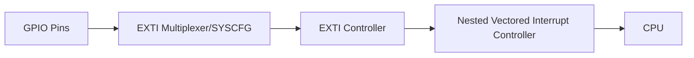

# STM32 EXTI Lines

## Introduction

External Interrupt (EXTI) lines are a key feature of STM32 microcontrollers that allow your application to respond immediately to external events. Unlike polling where you continuously check for changes, interrupts let the microcontroller perform other tasks until an event occurs, improving efficiency and responsiveness.

In this guide, we'll explore how EXTI lines work in STM32 microcontrollers, their configuration, and how to implement them in your projects.

## What are EXTI Lines?

EXTI (External Interrupt) lines are dedicated hardware paths that can trigger interrupts based on external events. On STM32 microcontrollers, these lines allow GPIO pins to generate interrupts when a specified condition occurs (like a button press or a sensor trigger).

### Key Characteristics of EXTI Lines

- STM32 microcontrollers typically have 16 EXTI lines (EXTI0 through EXTI15)
- Each EXTI line corresponds to the pin number across all GPIO ports
- For example, EXTI0 can be connected to PA0, PB0, PC0, etc., but only one at a time
- EXTI lines can be triggered on rising edge, falling edge, or both
- They can wake the microcontroller from sleep modes, making them power-efficient

## EXTI Line Architecture

The EXTI system in STM32 has several components working together:



1. **GPIO Pins**: The physical pins that detect external signals
2. **EXTI Multiplexer** (in SYSCFG): Selects which GPIO port connects to which EXTI line
3. **EXTI Controller**: Manages edge detection and interrupt masking
4. **NVIC**: Handles interrupt prioritization and delivery to the CPU

## Configuring EXTI Lines in STM32

Let's go through the process of configuring an EXTI line step by step:

### 1. Enable Required Clocks

First, enable the clocks for the GPIO port and SYSCFG:

```c
// Enable GPIOA clock
RCC->AHB1ENR |= RCC_AHB1ENR_GPIOAEN;

// Enable SYSCFG clock (required for EXTI configuration)
RCC->APB2ENR |= RCC_APB2ENR_SYSCFGEN;
```

### 2. Configure the GPIO Pin

Set up the GPIO pin as input with pull-up or pull-down as needed:

```c
// Configure PA0 as input with pull-up
GPIOA->MODER &= ~GPIO_MODER_MODER0;  // Input mode (00)
GPIOA->PUPDR &= ~GPIO_PUPDR_PUPDR0;  // Clear bits
GPIOA->PUPDR |= GPIO_PUPDR_PUPDR0_0; // Pull-up (01)
```

### 3. Connect GPIO Pin to EXTI Line

Use the SYSCFG_EXTICR registers to select which GPIO port is connected to the EXTI line:

```c
// Connect PA0 to EXTI0
SYSCFG->EXTICR[0] &= ~SYSCFG_EXTICR1_EXTI0; // Clear EXTI0 bits
SYSCFG->EXTICR[0] |= SYSCFG_EXTICR1_EXTI0_PA; // Select PA0
```

### 4. Configure EXTI Line Trigger

Set the trigger condition (rising edge, falling edge, or both):

```c
// Configure EXTI0 to trigger on falling edge (button press)
EXTI->RTSR &= ~EXTI_RTSR_TR0;  // Disable rising edge trigger
EXTI->FTSR |= EXTI_FTSR_TR0;   // Enable falling edge trigger
```

### 5. Enable the EXTI Line

Enable the interrupt for the EXTI line:

```c
// Enable EXTI0 interrupt
EXTI->IMR |= EXTI_IMR_MR0;  // Unmask EXTI0 interrupt
```

### 6. Configure NVIC

Set up the NVIC to handle the EXTI interrupt:

```c
// Set EXTI0 interrupt priority
NVIC_SetPriority(EXTI0_IRQn, 0);

// Enable EXTI0 interrupt in NVIC
NVIC_EnableIRQ(EXTI0_IRQn);
```

### 7. Implement the Interrupt Handler

Write the interrupt service routine (ISR) to handle the interrupt:

```c
void EXTI0_IRQHandler(void) {
    // Check if EXTI0 interrupt is pending
    if (EXTI->PR & EXTI_PR_PR0) {
        // Your interrupt handling code here
        // For example, toggle an LED
        GPIOC->ODR ^= GPIO_ODR_OD13;
        
        // Clear the EXTI pending bit
        EXTI->PR = EXTI_PR_PR0;
    }
}
```

## Practical Example: Button Interrupt with LED Toggle

Let's implement a complete example where pressing a button connected to PA0 toggles an LED connected to PC13 (common on many STM32 development boards):

```c
#include "stm32f4xx.h"

void SystemClock_Config(void);
void EXTI0_Config(void);

int main(void) {
    // Initialize system
    SystemClock_Config();
    
    // Configure EXTI0 for button interrupt
    EXTI0_Config();
    
    // Configure PC13 as output for LED
    RCC->AHB1ENR |= RCC_AHB1ENR_GPIOCEN;
    GPIOC->MODER &= ~GPIO_MODER_MODER13;
    GPIOC->MODER |= GPIO_MODER_MODER13_0;
    
    // Turn on LED initially
    GPIOC->BSRR = GPIO_BSRR_BR13;
    
    // Main loop
    while (1) {
        // The microcontroller can do other tasks or sleep here
        // The button press will be handled by the interrupt
    }
}

void EXTI0_Config(void) {
    // Enable clocks
    RCC->AHB1ENR |= RCC_AHB1ENR_GPIOAEN;
    RCC->APB2ENR |= RCC_APB2ENR_SYSCFGEN;
    
    // Configure PA0 as input with pull-up
    GPIOA->MODER &= ~GPIO_MODER_MODER0;
    GPIOA->PUPDR &= ~GPIO_PUPDR_PUPDR0;
    GPIOA->PUPDR |= GPIO_PUPDR_PUPDR0_0;
    
    // Connect PA0 to EXTI0
    SYSCFG->EXTICR[0] &= ~SYSCFG_EXTICR1_EXTI0;
    SYSCFG->EXTICR[0] |= SYSCFG_EXTICR1_EXTI0_PA;
    
    // Configure EXTI0 to trigger on falling edge
    EXTI->RTSR &= ~EXTI_RTSR_TR0;
    EXTI->FTSR |= EXTI_FTSR_TR0;
    
    // Enable EXTI0 interrupt
    EXTI->IMR |= EXTI_IMR_MR0;
    
    // Configure NVIC
    NVIC_SetPriority(EXTI0_IRQn, 0);
    NVIC_EnableIRQ(EXTI0_IRQn);
}

void EXTI0_IRQHandler(void) {
    // Check if EXTI0 interrupt is pending
    if (EXTI->PR & EXTI_PR_PR0) {
        // Toggle LED on PC13
        GPIOC->ODR ^= GPIO_ODR_OD13;
        
        // Clear the EXTI pending bit
        EXTI->PR = EXTI_PR_PR0;
    }
}

// SystemClock_Config implementation omitted for brevity
```

### Expected Behavior

- When the system starts, the LED will be on
- Each time you press the button connected to PA0, the LED will toggle (on/off)
- The main loop remains free to perform other tasks
- The system responds immediately to button presses

## Using HAL Library for EXTI Configuration

For beginners, the STM32 HAL (Hardware Abstraction Layer) library offers an easier way to configure EXTI:

```c
#include "stm32f4xx_hal.h"

GPIO_InitTypeDef GPIO_InitStruct = {0};

void HAL_GPIO_EXTI_Callback(uint16_t GPIO_Pin) {
    if (GPIO_Pin == GPIO_PIN_0) {
        HAL_GPIO_TogglePin(GPIOC, GPIO_PIN_13);
    }
}

void EXTI0_Config(void) {
    // Enable clocks
    __HAL_RCC_GPIOA_CLK_ENABLE();
    
    // Configure GPIO pin input with pull-up
    GPIO_InitStruct.Pin = GPIO_PIN_0;
    GPIO_InitStruct.Mode = GPIO_MODE_IT_FALLING;
    GPIO_InitStruct.Pull = GPIO_PULLUP;
    HAL_GPIO_Init(GPIOA, &GPIO_InitStruct);
    
    // Enable EXTI interrupt
    HAL_NVIC_SetPriority(EXTI0_IRQn, 0, 0);
    HAL_NVIC_EnableIRQ(EXTI0_IRQn);
}

void EXTI0_IRQHandler(void) {
    HAL_GPIO_EXTI_IRQHandler(GPIO_PIN_0);
}
```

Note how much cleaner and more compact the code is compared to the register-level approach!

## Advanced Topics: EXTI Line Limitations and Solutions

### Port Limitation Problem

As mentioned, each EXTI line can only be connected to one GPIO pin at a time. This creates a limitation: you can't have interrupts on PA0 and PB0 simultaneously since both would use EXTI0.

### Solutions to EXTI Limitations

1. **Careful Pin Planning**: Assign interrupt-requiring inputs to different pin numbers across ports.

2. **Pin Multiplexing**: Use external hardware multiplexers to combine multiple signals.

3. **Polling with Interrupts**: Use an interrupt on one pin to trigger software polling of other pins.

4. **Port Interrupts**: Some STM32 models offer port-level interrupts (EXTI_PR1, EXTI_PR2) that can handle multiple pins.

## Debugging EXTI Issues

Common problems with EXTI lines and their solutions:

### Missing Interrupt

If your interrupt never triggers, check:
- Clock enablement (GPIO and SYSCFG)
- Correct EXTI line connection
- NVIC priority and enablement
- Interrupt masking (IMR register)

### Multiple Triggering

If your interrupt triggers multiple times for a single event, you might need debouncing:

```c
void EXTI0_IRQHandler(void) {
    // Check if EXTI0 interrupt is pending
    if (EXTI->PR & EXTI_PR_PR0) {
        static uint32_t last_trigger_time = 0;
        uint32_t current_time = HAL_GetTick();
        
        // Debounce - ignore triggers within 50ms
        if (current_time - last_trigger_time > 50) {
            // Toggle LED
            GPIOC->ODR ^= GPIO_ODR_OD13;
            last_trigger_time = current_time;
        }
        
        // Clear the EXTI pending bit
        EXTI->PR = EXTI_PR_PR0;
    }
}
```

## Summary

EXTI lines are a powerful feature of STM32 microcontrollers that enable responsive and efficient handling of external events. They allow your microcontroller to:

- Respond immediately to external events without polling
- Wake from low-power modes when needed
- Free up the CPU for other tasks until an event occurs

We've covered the complete process of configuring and using EXTI lines, from basic concepts to practical implementation, including:

- The architecture of the EXTI system
- Step-by-step configuration using both register-level and HAL approaches
- A complete practical example of button-triggered LED toggling
- Advanced topics and debugging techniques

## Exercises

1. Modify the example to use a different GPIO pin and EXTI line.
2. Configure an EXTI line to trigger on both rising and falling edges.
3. Implement a system that uses two buttons on different EXTI lines.
4. Create a power-efficient system that sleeps until awakened by an EXTI interrupt.
5. Implement debouncing for a button input using the technique shown in the debugging section.

## Additional Resources

- STM32 Reference Manual: See the EXTI and SYSCFG sections for your specific microcontroller
- STM32 HAL Documentation: For more details on using the HAL library with EXTI
- STM32CubeMX: A graphical tool that can generate EXTI configuration code