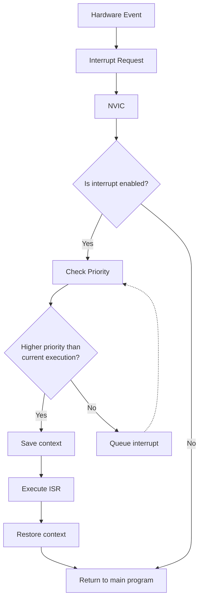

# STM32 Interrupt Handling

## Introduction

Interrupts are a fundamental concept in embedded systems programming, allowing your microcontroller to respond immediately to important events rather than continuously checking for them (polling). In STM32 microcontrollers, the interrupt system is robust and flexible, providing developers with powerful tools to create responsive applications.

In this tutorial, we'll explore how interrupts work in STM32 microcontrollers, how to configure them, and how to write effective interrupt service routines (ISRs). By the end, you'll be able to implement interrupt-driven programs on your STM32 device.

## What are Interrupts?

Interrupts are hardware or software events that temporarily halt the main program execution to service a higher-priority task. Think of them as urgent notifications that require immediate attention.

### Key Benefits of Using Interrupts:

- **Responsiveness**: Your system can react immediately to external events
- **Power efficiency**: No need for constant polling, allowing sleep modes
- **Resource optimization**: CPU focuses on important tasks only when needed
- **Real-time performance**: Predictable response times to critical events

## STM32 Interrupt Architecture

STM32 microcontrollers use the Nested Vectored Interrupt Controller (NVIC) from ARM Cortex-M architecture to manage interrupts.



### Key Components:

1. **Interrupt Sources**: External pins, timers, communication peripherals, etc.
2. **NVIC**: Handles interrupt prioritization and enabling/disabling
3. **Vector Table**: Contains address pointers to interrupt service routines
4. **ISR**: The function that executes when an interrupt occurs

## Basic Interrupt Configuration Steps

Configuring interrupts in STM32 involves several steps, which we'll break down with specific examples:

1. Enable the clock for the peripheral generating the interrupt
2. Configure the peripheral and its interrupt generation
3. Configure the NVIC priority and enable the interrupt
4. Implement the interrupt service routine (ISR)

Let's walk through these steps for a common scenario: handling a push button interrupt.

## Example 1: External Push Button Interrupt

Let's configure an external button on PA0 to trigger an interrupt whenever it's pressed.

### Step 1: Configure GPIO Pin

```c
// Enable GPIOA clock
RCC->AHB1ENR |= RCC_AHB1ENR_GPIOAEN;

// Configure PA0 as input with pull-up
GPIOA->MODER &= ~GPIO_MODER_MODE0;  // Input mode (00)
GPIOA->PUPDR &= ~GPIO_PUPDR_PUPD0;  // Clear bits
GPIOA->PUPDR |= GPIO_PUPDR_PUPD0_0; // Pull-up (01)
```

### Step 2: Configure EXTI (External Interrupt)

```c
// Connect PA0 to EXTI line 0
RCC->APB2ENR |= RCC_APB2ENR_SYSCFGEN;  // Enable SYSCFG clock
SYSCFG->EXTICR[0] &= ~SYSCFG_EXTICR1_EXTI0;  // Clear EXTI0 bits
SYSCFG->EXTICR[0] |= SYSCFG_EXTICR1_EXTI0_PA;  // PA0 connected to EXTI0

// Configure EXTI line 0
EXTI->IMR |= EXTI_IMR_IM0;    // Enable interrupt on EXTI0
EXTI->FTSR |= EXTI_FTSR_TR0;  // Trigger on falling edge (button press)
```

### Step 3: Configure NVIC

```c
// Set priority and enable interrupt in NVIC
NVIC_SetPriority(EXTI0_IRQn, 0);  // Highest priority (0)
NVIC_EnableIRQ(EXTI0_IRQn);       // Enable interrupt in NVIC
```

### Step 4: Implement ISR

```c
void EXTI0_IRQHandler(void) {
    // Check if EXTI0 interrupt occurred
    if (EXTI->PR & EXTI_PR_PR0) {
        // Toggle LED (assuming LED on PB5)
        GPIOB->ODR ^= GPIO_ODR_OD5;
        
        // Clear pending bit
        EXTI->PR = EXTI_PR_PR0;
    }
}
```

### Using HAL Library (Alternative Approach)

If you're using STM32's HAL library, the configuration becomes more abstracted:

```c
// Initialize GPIO with interrupt
GPIO_InitTypeDef GPIO_InitStruct = {0};
GPIO_InitStruct.Pin = GPIO_PIN_0;
GPIO_InitStruct.Mode = GPIO_MODE_IT_FALLING;
GPIO_InitStruct.Pull = GPIO_PULLUP;
HAL_GPIO_Init(GPIOA, &GPIO_InitStruct);

// Enable interrupt in NVIC
HAL_NVIC_SetPriority(EXTI0_IRQn, 0, 0);
HAL_NVIC_EnableIRQ(EXTI0_IRQn);

// And the interrupt handler becomes:
void HAL_GPIO_EXTI_Callback(uint16_t GPIO_Pin) {
    if (GPIO_Pin == GPIO_PIN_0) {
        HAL_GPIO_TogglePin(GPIOB, GPIO_PIN_5);  // Toggle LED
    }
}
```

## Example 2: Timer Interrupt

Timers are a common source of interrupts in embedded systems. Let's set up a periodic timer interrupt.

### Step 1: Configure Timer

```c
// Enable TIM2 clock
RCC->APB1ENR |= RCC_APB1ENR_TIM2EN;

// Set prescaler and auto-reload register for 1Hz interrupts
// Assuming 16MHz system clock
TIM2->PSC = 15999;    // Prescaler = 16000 (16000000/16000 = 1000Hz)
TIM2->ARR = 999;      // Auto-reload = 1000 (1000Hz/1000 = 1Hz)

// Enable update interrupt
TIM2->DIER |= TIM_DIER_UIE;

// Start timer
TIM2->CR1 |= TIM_CR1_CEN;
```

### Step 2: Configure NVIC

```c
// Set priority and enable timer interrupt
NVIC_SetPriority(TIM2_IRQn, 1);  // Priority 1 (lower than button)
NVIC_EnableIRQ(TIM2_IRQn);
```

### Step 3: Implement ISR

```c
void TIM2_IRQHandler(void) {
    if (TIM2->SR & TIM_SR_UIF) {
        // One second has passed
        // Perform your periodic task here
        
        // Clear update interrupt flag
        TIM2->SR &= ~TIM_SR_UIF;
    }
}
```

### HAL Version

```c
TIM_HandleTypeDef htim2;

void ConfigureTimer(void) {
    htim2.Instance = TIM2;
    htim2.Init.Prescaler = 15999;
    htim2.Init.CounterMode = TIM_COUNTERMODE_UP;
    htim2.Init.Period = 999;
    htim2.Init.ClockDivision = TIM_CLOCKDIVISION_DIV1;
    HAL_TIM_Base_Init(&htim2);
    
    HAL_NVIC_SetPriority(TIM2_IRQn, 1, 0);
    HAL_NVIC_EnableIRQ(TIM2_IRQn);
    
    HAL_TIM_Base_Start_IT(&htim2);
}

void HAL_TIM_PeriodElapsedCallback(TIM_HandleTypeDef *htim) {
    if (htim->Instance == TIM2) {
        // One second has passed
        // Perform your periodic task here
    }
}
```

## Best Practices for STM32 Interrupt Handling

### 1. Keep ISRs Short and Fast

```c
// Bad practice
void EXTI0_IRQHandler(void) {
    if (EXTI->PR & EXTI_PR_PR0) {
        // Bad: Long delay inside an ISR
        for(volatile int i = 0; i < 1000000; i++);
        
        GPIOB->ODR ^= GPIO_ODR_OD5;
        EXTI->PR = EXTI_PR_PR0;
    }
}

// Good practice
volatile uint8_t button_pressed = 0;

void EXTI0_IRQHandler(void) {
    if (EXTI->PR & EXTI_PR_PR0) {
        // Good: Set a flag and handle in main loop
        button_pressed = 1;
        EXTI->PR = EXTI_PR_PR0;
    }
}

// In main loop
while (1) {
    if (button_pressed) {
        button_pressed = 0;
        // Handle button press with lengthy operations
        // ...
    }
}
```

### 2. Use Volatile for Shared Variables

Variables shared between ISRs and the main code should be declared `volatile` to prevent optimization issues:

```c
volatile uint32_t timer_count = 0;

void TIM2_IRQHandler(void) {
    if (TIM2->SR & TIM_SR_UIF) {
        timer_count++;  // This will be correctly updated
        TIM2->SR &= ~TIM_SR_UIF;
    }
}
```

### 3. Handle Interrupt Priority Properly

When multiple interrupts are used, set appropriate priorities:

```c
// Critical interrupt (highest priority)
NVIC_SetPriority(EXTI0_IRQn, 0);

// Important but not critical
NVIC_SetPriority(TIM2_IRQn, 1);

// Background task interrupt
NVIC_SetPriority(USART2_IRQn, 2);
```

### 4. Always Clear Interrupt Flags

Failing to clear flags results in continuous interrupt triggering:

```c
void EXTI0_IRQHandler(void) {
    if (EXTI->PR & EXTI_PR_PR0) {
        // Handle interrupt
        
        // Don't forget this line!
        EXTI->PR = EXTI_PR_PR0;
    }
}
```

## Real-World Application: UART Receive with Interrupts

Let's implement a complete example of UART communication using interrupts:

```c
#define BUFFER_SIZE 64
volatile uint8_t rx_buffer[BUFFER_SIZE];
volatile uint8_t rx_index = 0;
volatile uint8_t rx_complete = 0;

void USART2_Config(void) {
    // Enable clocks
    RCC->AHB1ENR |= RCC_AHB1ENR_GPIOAEN;
    RCC->APB1ENR |= RCC_APB1ENR_USART2EN;
    
    // Configure USART2 pins (PA2=TX, PA3=RX)
    GPIOA->MODER &= ~(GPIO_MODER_MODE2 | GPIO_MODER_MODE3);
    GPIOA->MODER |= (GPIO_MODER_MODE2_1 | GPIO_MODER_MODE3_1);  // Alternate function
    
    GPIOA->AFR[0] &= ~(GPIO_AFRL_AFRL2 | GPIO_AFRL_AFRL3);
    GPIOA->AFR[0] |= (7 << (4 * 2)) | (7 << (4 * 3));  // AF7 for USART2
    
    // Configure USART2
    USART2->BRR = 0x0683;  // 9600 baud @ 16MHz
    USART2->CR1 = 0;
    USART2->CR1 |= USART_CR1_RE | USART_CR1_TE;  // Enable Tx and Rx
    USART2->CR1 |= USART_CR1_RXNEIE;  // Enable Rx interrupt
    USART2->CR1 |= USART_CR1_UE;  // Enable USART
    
    // Configure NVIC
    NVIC_SetPriority(USART2_IRQn, 1);
    NVIC_EnableIRQ(USART2_IRQn);
}

void USART2_IRQHandler(void) {
    if (USART2->SR & USART_SR_RXNE) {
        uint8_t data = USART2->DR;  // Read received data
        
        // Store in buffer
        if (rx_index < BUFFER_SIZE && !rx_complete) {
            rx_buffer[rx_index++] = data;
            
            // Check for end of message (newline)
            if (data == '
' || data == '\r') {
                rx_buffer[rx_index] = 0;  // Null-terminate
                rx_complete = 1;  // Set completion flag
            }
        }
    }
}

void USART2_SendString(const char* str) {
    while (*str) {
        // Wait until transmit data register is empty
        while (!(USART2->SR & USART_SR_TXE));
        USART2->DR = *str++;
    }
}

int main(void) {
    // System initialization code
    // ...
    
    USART2_Config();
    
    while (1) {
        if (rx_complete) {
            // Process received data
            USART2_SendString("Received: ");
            USART2_SendString((char*)rx_buffer);
            USART2_SendString("\r
");
            
            // Reset buffer
            rx_index = 0;
            rx_complete = 0;
        }
        
        // Other application tasks
    }
}
```

This example demonstrates:
1. Setting up UART with receive interrupts
2. Buffering incoming data
3. Processing complete messages in the main loop
4. Responding to the received data

## Debugging Interrupts

When working with interrupts, debugging can be challenging. Here are some tips:

1. **Use Status LEDs**: Toggle different LEDs in different ISRs to visualize execution.
2. **Use Debug Counters**: Increment volatile counters in ISRs that you can watch in debug mode.
3. **Check Interrupt Flags**: Always verify if interrupt flags are being cleared properly.
4. **Use Debug Breakpoints Carefully**: Be aware that breakpoints in ISRs will pause execution and might affect timing-sensitive code.

## Common Issues and Solutions

| Issue | Possible Cause | Solution |
|-------|---------------|----------|
| Interrupt never triggers | Interrupt not enabled in NVIC | Call `NVIC_EnableIRQ()` |
| Interrupt triggers repeatedly | Flag not cleared | Clear the pending flag in the ISR |
| Shared variable not updated | Missing volatile keyword | Declare shared variables as volatile |
| Interrupt priority issues | Incorrect priority settings | Review and adjust NVIC priority settings |
| System crashes in ISR | Stack overflow | Keep ISRs short and avoid recursive calls |

## Summary

In this tutorial, we've covered the fundamentals of interrupt handling in STM32 microcontrollers:

- The architecture of STM32's interrupt system
- How to configure external interrupts for push buttons
- Setting up timer interrupts for periodic tasks
- Best practices for writing efficient interrupt handlers
- A real-world UART example using interrupts

Mastering interrupt handling is essential for developing responsive and power-efficient embedded applications. By using interrupts effectively, you can create systems that respond immediately to external events while maintaining low power consumption.

## Exercises

1. Modify the push button example to detect both rising and falling edges (button press and release).
2. Create a system with two buttons of different priorities.
3. Implement a UART echo program that receives characters and immediately sends them back.
4. Design a traffic light controller using timer interrupts.
5. Create a data logger that uses ADC interrupts to sample sensors at regular intervals.

## Additional Resources

- STM32 Reference Manual (RM0383) for detailed information about the NVIC and interrupt controller
- STM32 Programming Manual (PM0214) for Cortex-M4 specific information
- STM32 HAL Documentation for API reference when using the HAL library
- ARM Cortex-M4 Generic User Guide for general information about the Cortex-M4 NVIC