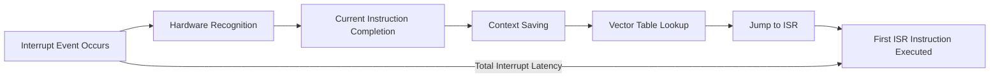

# STM32 Interrupt Latency

## Introduction

Interrupt latency refers to the delay between an interrupt event occurring and the execution of the first instruction of the corresponding Interrupt Service Routine (ISR). In STM32 microcontrollers, understanding and optimizing interrupt latency is crucial for developing responsive real-time systems where timing is critical.

This guide explains the concept of interrupt latency in STM32 microcontrollers, what causes it, how to measure it, and techniques to minimize it for better system performance.

## What is Interrupt Latency?

Interrupt latency is the total time delay from when a peripheral or external signal triggers an interrupt to when the processor actually begins executing the interrupt handler code. 



In time-critical applications such as motor control, communication protocols, or sensor data acquisition, excessive interrupt latency can cause missed deadlines, data loss, or system instability.

## Components of Interrupt Latency

The total interrupt latency in STM32 microcontrollers consists of several components:

1. **Hardware Recognition Delay**: Time for the interrupt controller to detect the interrupt signal
2. **Current Instruction Completion**: Time to finish the current CPU instruction
3. **Context Saving**: Time to save the current processor state (registers) onto the stack
4. **Vector Table Lookup**: Time to find the appropriate ISR address in the interrupt vector table
5. **Branch to ISR**: Time to jump to the ISR address and begin execution

## Measuring Interrupt Latency on STM32

To measure interrupt latency in practice, we can use a GPIO pin toggle technique:

```c
// In the main program
void setup_latency_measurement(void) {
  // Configure GPIO pin for output (for measurement)
  // For example, using GPIOA pin 5
  RCC->AHB1ENR |= RCC_AHB1ENR_GPIOAEN;  // Enable GPIOA clock
  GPIOA->MODER &= ~GPIO_MODER_MODER5_Msk;  
  GPIOA->MODER |= GPIO_MODER_MODER5_0;  // Set as output mode
  
  // Configure timer to generate interrupts
  // This example uses TIM2
  RCC->APB1ENR |= RCC_APB1ENR_TIM2EN;  // Enable TIM2 clock
  TIM2->PSC = 84 - 1;  // Prescaler for 84 MHz clock to get 1 MHz timer clock
  TIM2->ARR = 1000 - 1;  // Auto-reload value for 1 ms period
  TIM2->DIER |= TIM_DIER_UIE;  // Enable update interrupt
  NVIC_SetPriority(TIM2_IRQn, 0);  // Set highest priority
  NVIC_EnableIRQ(TIM2_IRQn);  // Enable the interrupt in NVIC
  
  TIM2->CR1 |= TIM_CR1_CEN;  // Start timer
}

// In the ISR
void TIM2_IRQHandler(void) {
  // Set pin high immediately (first instruction)
  GPIOA->BSRR = GPIO_BSRR_BS5;
  
  // Clear the interrupt flag
  TIM2->SR &= ~TIM_SR_UIF;
  
  // Do your normal ISR work here
  
  // Set pin low when ISR work is done (optional, measures ISR duration)
  GPIOA->BSRR = GPIO_BSRR_BR5;
}
```

By observing the GPIO pin with an oscilloscope, you can measure:
- The time from the timer overflow (which triggers the interrupt) to the pin going high represents the interrupt latency
- The duration the pin stays high represents the ISR execution time

## Factors Affecting STM32 Interrupt Latency

Several factors can influence interrupt latency on STM32 microcontrollers:

### 1. Interrupt Priority Settings

STM32 microcontrollers use the Nested Vectored Interrupt Controller (NVIC) which supports priority levels. Higher priority interrupts can preempt lower priority ones.

```c
// Setting interrupt priority (lower numerical value = higher priority)
NVIC_SetPriority(TIM2_IRQn, 0);  // Highest priority
NVIC_SetPriority(USART2_IRQn, 1);  // Lower priority
```

### 2. Processor State and Instructions

The CPU must complete its current instruction before handling an interrupt. Some instructions take longer to execute than others:
- Divide operations can take many cycles
- Memory operations (especially to slower memory) can introduce wait states
- DMA operations may block the bus

### 3. System Clock Frequency

Higher clock frequencies generally reduce interrupt latency as instructions execute faster:

```c
// Example of setting system clock to 84 MHz on an STM32F4
// Configure PLL, etc. (simplified)
RCC->PLLCFGR = /* PLL configuration values */;
RCC->CFGR = /* Clock configuration values */;
RCC->CR |= RCC_CR_PLLON;  // Enable PLL
while(!(RCC->CR & RCC_CR_PLLRDY));  // Wait for PLL ready
```

### 4. Memory Wait States

Flash memory often requires wait states at higher CPU frequencies, affecting instruction fetch time:

```c
// Configure Flash latency (wait states) for higher frequency
FLASH->ACR = FLASH_ACR_LATENCY_5WS;  // 5 wait states for 168 MHz
```

### 5. Interrupt Nesting

When interrupts are nested (higher priority interrupts preempting lower ones), each level adds context saving overhead:

```c
// Enable nested interrupts by setting PRIMASK
__enable_irq();  // Global interrupt enable

// Inside a lower priority ISR, higher priority interrupts can still occur
void USART2_IRQHandler(void) {
  // Higher priority interrupts can still preempt this ISR
  // ...
}
```

## Optimizing Interrupt Latency

### 1. Use Appropriate Interrupt Priorities

Assign higher priorities to time-critical interrupts:

```c
// Assign highest priority (0) to critical timer interrupt
NVIC_SetPriority(TIM1_UP_TIM10_IRQn, 0);

// Assign medium priority to communication interrupts
NVIC_SetPriority(USART2_IRQn, 2);

// Assign lowest priority to non-critical interrupts
NVIC_SetPriority(I2C1_EV_IRQn, 15);
```

### 2. Minimize Critical Sections

Reduce sections where interrupts are disabled:

```c
// Bad practice - disabling interrupts for too long
__disable_irq();
long_running_function();
__enable_irq();

// Better practice - minimize critical section
__disable_irq();
quick_atomic_operation();
__enable_irq();
```

### 3. Optimize ISR Code

Keep ISRs short and efficient:

```c
// Poor ISR implementation
void TIM2_IRQHandler(void) {
  TIM2->SR &= ~TIM_SR_UIF;  // Clear interrupt flag
  
  // Complex calculations directly in the ISR
  float result = complex_calculation();
  update_display(result);
}

// Better ISR implementation
volatile uint8_t timer_event_flag = 0;

void TIM2_IRQHandler(void) {
  TIM2->SR &= ~TIM_SR_UIF;  // Clear interrupt flag
  
  // Just set a flag and handle processing in main loop
  timer_event_flag = 1;
}

// In main loop
while (1) {
  if (timer_event_flag) {
    timer_event_flag = 0;
    float result = complex_calculation();
    update_display(result);
  }
}
```

### 4. Use Direct Register Access

For critical timing, use direct register access rather than HAL functions:

```c
// Using HAL (has more overhead)
HAL_GPIO_TogglePin(GPIOA, GPIO_PIN_5);

// Direct register access (faster)
GPIOA->ODR ^= GPIO_ODR_OD5;
// Or even better for atomic operation:
GPIOA->BSRR = GPIO_BSRR_BS5;  // Set pin
// or
GPIOA->BSRR = GPIO_BSRR_BR5;  // Reset pin
```

### 5. Configure Flash Acceleration

Use prefetch buffer, instruction cache, and appropriate wait states:

```c
// Enable prefetch, instruction cache and set proper wait states
FLASH->ACR |= FLASH_ACR_PRFTEN | FLASH_ACR_ICEN;
FLASH->ACR &= ~FLASH_ACR_LATENCY;
FLASH->ACR |= FLASH_ACR_LATENCY_2WS;  // 2 wait states for 100MHz
```

### 6. Place Critical Code in RAM

For ultimate performance, place time-critical code in RAM:

```c
// Function attribute to place in RAM
__attribute__((section(".ram_func")))
void critical_isr_function(void) {
  // This function will execute from RAM
  // ...
}
```

## Practical Example: Precise Timing Control

Here's a complete example of a low-latency interrupt system for precise timing control:

```c
// Place in RAM for fastest execution
__attribute__((section(".ram_func")))
void TIM1_UP_TIM10_IRQHandler(void) {
  // First instruction - set output pin (for latency measurement)
  GPIOA->BSRR = GPIO_BSRR_BS5;
  
  // Clear interrupt flag quickly
  TIM1->SR &= ~TIM_SR_UIF;
  
  // Critical timing-dependent code here
  // Direct register access for fastest control
  if (sequence_step == 0) {
    GPIOB->BSRR = GPIO_BSRR_BS10;  // Turn on output 1
    sequence_step = 1;
    TIM1->ARR = PERIOD_STEP1 - 1;  // Set next interval
  } else if (sequence_step == 1) {
    GPIOB->BSRR = GPIO_BSRR_BR10;  // Turn off output 1
    GPIOB->BSRR = GPIO_BSRR_BS11;  // Turn on output 2
    sequence_step = 2;
    TIM1->ARR = PERIOD_STEP2 - 1;  // Set next interval
  } else {
    GPIOB->BSRR = GPIO_BSRR_BR11;  // Turn off output 2
    sequence_step = 0;
    TIM1->ARR = PERIOD_STEP0 - 1;  // Set next interval
  }
  
  // Signal completion (for latency measurement)
  GPIOA->BSRR = GPIO_BSRR_BR5;
}

void setup_precision_timing(void) {
  // Configure GPIO outputs
  RCC->AHB1ENR |= RCC_AHB1ENR_GPIOAEN | RCC_AHB1ENR_GPIOBEN;
  
  // Configure GPIOA5 as timing measurement output
  GPIOA->MODER &= ~GPIO_MODER_MODER5_Msk;
  GPIOA->MODER |= GPIO_MODER_MODER5_0;
  
  // Configure GPIOB10 and GPIOB11 as control outputs
  GPIOB->MODER &= ~(GPIO_MODER_MODER10_Msk | GPIO_MODER_MODER11_Msk);
  GPIOB->MODER |= GPIO_MODER_MODER10_0 | GPIO_MODER_MODER11_0;
  
  // Configure Timer 1 for precise interrupts
  RCC->APB2ENR |= RCC_APB2ENR_TIM1EN;
  
  // Calculate for maximum precision
  // No prescaler for maximum resolution
  TIM1->PSC = 0;
  TIM1->ARR = PERIOD_STEP0 - 1;
  
  // Enable update interrupt
  TIM1->DIER |= TIM_DIER_UIE;
  
  // Set highest priority (0)
  NVIC_SetPriority(TIM1_UP_TIM10_IRQn, 0);
  NVIC_EnableIRQ(TIM1_UP_TIM10_IRQn);
  
  // Start timer
  TIM1->CR1 |= TIM_CR1_CEN;
}
```

## Summary

Understanding and optimizing interrupt latency is crucial for developing responsive STM32-based systems:

- Interrupt latency is the delay between an interrupt event and the execution of the first ISR instruction
- Key components include hardware recognition, context saving, and vector lookup
- Measurement can be done through GPIO pin toggling and oscilloscope observation
- Optimization techniques include proper priority settings, minimizing critical sections, optimizing ISR code, and placing critical functions in RAM
- STM32's NVIC offers flexible priority management to meet timing requirements

## Exercises

1. **Measurement Exercise**: Set up an STM32 board to measure the interrupt latency of a timer interrupt using the GPIO toggle method and an oscilloscope or logic analyzer.

2. **Optimization Exercise**: Implement two versions of the same interrupt handler – one using HAL functions and another using direct register access. Measure and compare their latencies.

3. **Priority Exercise**: Create a system with three interrupt sources of different priorities. Verify that higher priority interrupts can preempt lower priority ones by measuring execution timing.

4. **RAM Execution Exercise**: Place a critical ISR in RAM using the `__attribute__((section(".ram_func")))` directive and compare its latency to the same function executing from Flash.

## Additional Resources

- ARM Cortex-M4 Generic User Guide - For detailed information on the NVIC
- STM32F4 Reference Manual - For specific details on STM32F4 peripherals and interrupt mechanisms
- ST Application Notes:
  - AN4067: STM32F4 DSP and standard peripherals library
  - AN3156: Interrupt latency on STM32 microcontrollers