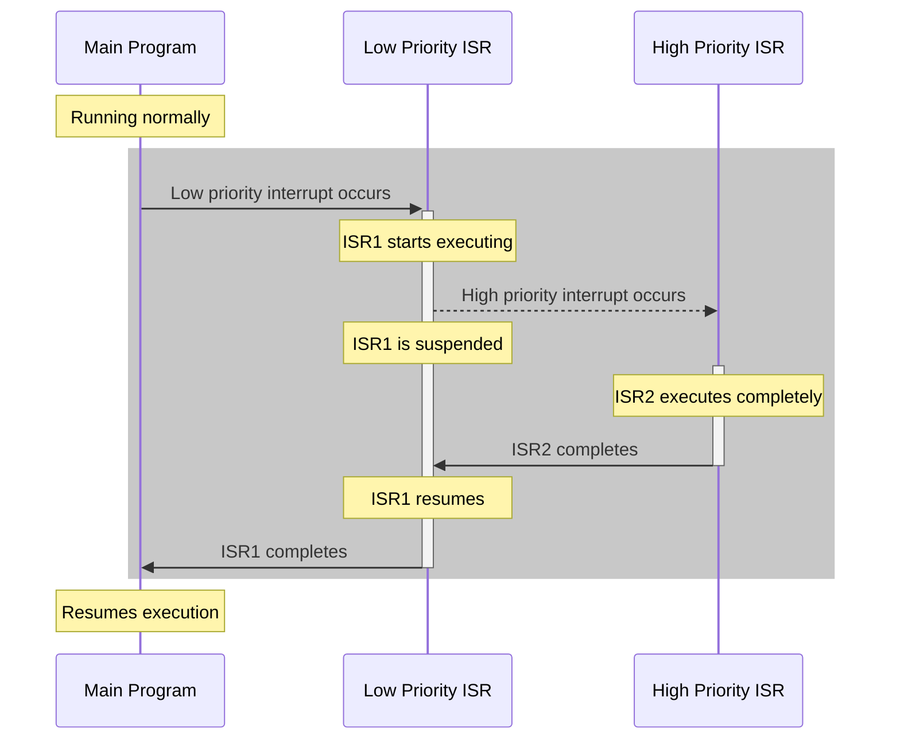

# STM32 Nested Interrupts

## Introduction

In embedded systems, interrupts are crucial for responding to real-time events efficiently. As your STM32 projects grow more complex, you'll often need to handle multiple interrupt sources with different priorities. This is where nested interrupts become essential.

Nested interrupts allow a higher-priority interrupt to temporarily suspend the execution of a lower-priority interrupt handler. This mechanism ensures that critical events receive immediate attention, even when the system is already handling another interrupt.

In this tutorial, we'll explore how the STM32's Nested Vectored Interrupt Controller (NVIC) manages nested interrupts, how to configure interrupt priorities, and how to implement robust interrupt handling in your applications.

## Understanding Interrupt Nesting on STM32

STM32 microcontrollers use the Arm Cortex-M processor's Nested Vectored Interrupt Controller (NVIC) to manage interrupts. The NVIC supports:

1. **Vectored interrupts** - Each interrupt source has a dedicated handler function
2. **Priority-based handling** - Up to 256 priority levels (chip-specific)
3. **Nested interrupts** - Higher-priority interrupts can preempt lower-priority ones

### How Nested Interrupts Work

Let's visualize how nested interrupts work with a simple diagram:



In this scenario:
1. The main program is running
2. A low-priority interrupt occurs, and its ISR begins execution
3. During the low-priority ISR execution, a high-priority interrupt occurs
4. The low-priority ISR is suspended, and the high-priority ISR executes
5. Once the high-priority ISR completes, the low-priority ISR resumes
6. Finally, the main program continues

## STM32 Interrupt Priority Configuration

The STM32 NVIC uses two concepts for managing interrupt priorities:

1. **Preemption Priority**: Determines whether an interrupt can preempt another
2. **Subpriority**: Used to determine the sequence when multiple interrupts with the same preemption priority are pending

### Priority Grouping

STM32 microcontrollers allow you to configure how many bits are allocated to preemption priority versus subpriority using the `NVIC_PriorityGroupConfig()` function. This is crucial for nested interrupts.

Here are the possible priority groupings:

| Priority Group | Preemption Bits | Subpriority Bits | Description |
|----------------|----------------|-----------------|-------------|
| NVIC_PriorityGroup_0 | 0 | 4 | No preemption, 16 subpriorities |
| NVIC_PriorityGroup_1 | 1 | 3 | 2 preemption levels, 8 subpriorities |
| NVIC_PriorityGroup_2 | 2 | 2 | 4 preemption levels, 4 subpriorities |
| NVIC_PriorityGroup_3 | 3 | 1 | 8 preemption levels, 2 subpriorities |
| NVIC_PriorityGroup_4 | 4 | 0 | 16 preemption levels, no subpriority |

For nested interrupts to work effectively, you'll typically want to use NVIC_PriorityGroup_2 or higher to have multiple preemption levels.

## Implementing Nested Interrupts

Let's walk through the steps to set up nested interrupts on an STM32 microcontroller.

### Step 1: Configure the NVIC Priority Grouping

First, decide how many preemption levels you need and configure the priority grouping:

```c
// In your initialization code
NVIC_PriorityGroupConfig(NVIC_PriorityGroup_4); // 16 preemption levels
```

### Step 2: Configure Interrupt Priorities

Next, configure each interrupt with appropriate priority levels:

```c
void configureInterrupts(void) {
    // Configure USART interrupt with medium priority
    NVIC_InitTypeDef NVIC_InitStructure;
    NVIC_InitStructure.NVIC_IRQChannel = USART2_IRQn;
    NVIC_InitStructure.NVIC_IRQChannelPreemptionPriority = 10; // Medium priority
    NVIC_InitStructure.NVIC_IRQChannelSubPriority = 0;
    NVIC_InitStructure.NVIC_IRQChannelCmd = ENABLE;
    NVIC_Init(&NVIC_InitStructure);
    
    // Configure timer interrupt with low priority
    NVIC_InitStructure.NVIC_IRQChannel = TIM2_IRQn;
    NVIC_InitStructure.NVIC_IRQChannelPreemptionPriority = 14; // Low priority
    NVIC_InitStructure.NVIC_IRQChannelSubPriority = 0;
    NVIC_InitStructure.NVIC_IRQChannelCmd = ENABLE;
    NVIC_Init(&NVIC_InitStructure);
    
    // Configure button interrupt with high priority
    NVIC_InitStructure.NVIC_IRQChannel = EXTI0_IRQn;
    NVIC_InitStructure.NVIC_IRQChannelPreemptionPriority = 5; // High priority
    NVIC_InitStructure.NVIC_IRQChannelSubPriority = 0;
    NVIC_InitStructure.NVIC_IRQChannelCmd = ENABLE;
    NVIC_Init(&NVIC_InitStructure);
}
```

Remember, in STM32, **lower numerical values represent higher priorities**.

### Step 3: Implement Interrupt Handlers

Now, implement your interrupt handlers. Here's an example with nested interrupt behavior:

```c
// Low-priority timer interrupt
void TIM2_IRQHandler(void) {
    if (TIM_GetITStatus(TIM2, TIM_IT_Update) != RESET) {
        TIM_ClearITPendingBit(TIM2, TIM_IT_Update);
        
        // Long operation - can be preempted by higher priority interrupts
        for (int i = 0; i < 1000; i++) {
            // This loop simulates a lengthy operation
            processSensorData(); // Process some sensor data
        }
        
        LED_Toggle(LED_GREEN); // Toggle LED when complete
    }
}

// Medium-priority USART interrupt
void USART2_IRQHandler(void) {
    if (USART_GetITStatus(USART2, USART_IT_RXNE) != RESET) {
        uint16_t receivedChar = USART_ReceiveData(USART2);
        
        // Process received character
        processReceivedData(receivedChar);
        
        LED_Toggle(LED_BLUE); // Toggle LED to indicate USART activity
    }
}

// High-priority button interrupt
void EXTI0_IRQHandler(void) {
    if (EXTI_GetITStatus(EXTI_Line0) != RESET) {
        EXTI_ClearITPendingBit(EXTI_Line0);
        
        // Critical emergency response - needs immediate attention
        emergencyStop(); // Immediately handle emergency condition
        
        LED_Toggle(LED_RED); // Toggle red LED to indicate emergency
    }
}
```

In this example, if:
- The timer interrupt is running and a USART interrupt occurs, the USART interrupt will preempt the timer interrupt
- Any interrupt is running and the button interrupt occurs, the button interrupt will preempt the current interrupt

## Critical Section Protection

When implementing nested interrupts, you must protect shared resources from concurrent access. Use critical sections to temporarily disable interrupts when accessing shared resources:

```c
// Global variable accessed by multiple interrupts
volatile uint32_t sharedCounter = 0;

void incrementCounter(void) {
    // Disable interrupts to protect shared resource
    __disable_irq();
    
    // Access shared resource
    sharedCounter++;
    
    // Re-enable interrupts
    __enable_irq();
}
```

For more granular control, you can save and restore the interrupt state:

```c
void safelyAccessSharedResource(void) {
    // Save current interrupt state and disable interrupts
    uint32_t primask = __get_PRIMASK();
    __disable_irq();
    
    // Access shared resource
    sharedCounter++;
    
    // Restore previous interrupt state
    if (!primask) {
        __enable_irq();
    }
}
```

## Real-World Example: Multi-Sensor Monitoring System

Let's implement a practical example: a monitoring system with multiple sensors and communication interfaces, all using nested interrupts.

```c
// System includes
#include "stm32f4xx.h"
#include "stm32f4xx_gpio.h"
#include "stm32f4xx_rcc.h"
#include "stm32f4xx_tim.h"
#include "stm32f4xx_exti.h"
#include "stm32f4xx_usart.h"
#include "misc.h"

// Global variables
volatile uint32_t temperature = 0;
volatile uint32_t pressure = 0;
volatile uint8_t alarmState = 0;
volatile uint8_t commandReceived = 0;
volatile uint8_t commandData = 0;

// Initialize system
void SystemInit(void) {
    // Configure clock and peripherals (code omitted for brevity)
    
    // Configure interrupt priorities for nested interrupts
    NVIC_PriorityGroupConfig(NVIC_PriorityGroup_4);
    
    // Configure Timer2 for periodic sensor sampling (low priority)
    NVIC_InitTypeDef NVIC_InitStructure;
    NVIC_InitStructure.NVIC_IRQChannel = TIM2_IRQn;
    NVIC_InitStructure.NVIC_IRQChannelPreemptionPriority = 14; // Low priority
    NVIC_InitStructure.NVIC_IRQChannelSubPriority = 0;
    NVIC_InitStructure.NVIC_IRQChannelCmd = ENABLE;
    NVIC_Init(&NVIC_InitStructure);
    
    // Configure USART for command reception (medium priority)
    NVIC_InitStructure.NVIC_IRQChannel = USART2_IRQn;
    NVIC_InitStructure.NVIC_IRQChannelPreemptionPriority = 10; // Medium priority
    NVIC_InitStructure.NVIC_IRQChannelSubPriority = 0;
    NVIC_InitStructure.NVIC_IRQChannelCmd = ENABLE;
    NVIC_Init(&NVIC_InitStructure);
    
    // Configure external interrupt for alarm button (high priority)
    NVIC_InitStructure.NVIC_IRQChannel = EXTI0_IRQn;
    NVIC_InitStructure.NVIC_IRQChannelPreemptionPriority = 5; // High priority
    NVIC_InitStructure.NVIC_IRQChannelSubPriority = 0;
    NVIC_InitStructure.NVIC_IRQChannelCmd = ENABLE;
    NVIC_Init(&NVIC_InitStructure);
    
    // Enable the peripherals and interrupts
    TIM_ITConfig(TIM2, TIM_IT_Update, ENABLE);
    USART_ITConfig(USART2, USART_IT_RXNE, ENABLE);
    EXTI_Init(&EXTI_InitStructure); // Configure EXTI line 0
    
    TIM_Cmd(TIM2, ENABLE);
}

// Low-priority sensor sampling interrupt
void TIM2_IRQHandler(void) {
    if (TIM_GetITStatus(TIM2, TIM_IT_Update) != RESET) {
        TIM_ClearITPendingBit(TIM2, TIM_IT_Update);
        
        // This is a long operation that reads sensors
        // It can be interrupted by higher priority handlers
        temperature = readTemperatureSensor();
        pressure = readPressureSensor();
        
        // Process sensor data
        processSensorData(temperature, pressure);
    }
}

// Medium-priority communication interrupt
void USART2_IRQHandler(void) {
    if (USART_GetITStatus(USART2, USART_IT_RXNE) != RESET) {
        // Read received data
        commandData = USART_ReceiveData(USART2);
        commandReceived = 1;
        
        // Process command - can be interrupted by high priority alarm
        processCommand(commandData);
    }
}

// High-priority emergency alarm interrupt
void EXTI0_IRQHandler(void) {
    if (EXTI_GetITStatus(EXTI_Line0) != RESET) {
        EXTI_ClearITPendingBit(EXTI_Line0);
        
        // This handler has highest priority and will interrupt any other handler
        alarmState = 1;
        
        // Emergency response - maximum priority
        triggerEmergencyProtocol();
        
        // Even with long operations, this won't be interrupted
        notifyEmergencyServices();
    }
}

// Main function
int main(void) {
    SystemInit();
    
    while (1) {
        // Main loop processing
        if (commandReceived) {
            // Process command that was received by interrupt
            executeCommand(commandData);
            commandReceived = 0;
        }
        
        if (alarmState) {
            // Handle alarm state that was triggered by interrupt
            manageAlarmCondition();
            
            // Clear alarm only when condition is resolved
            if (isEmergencyResolved()) {
                alarmState = 0;
            }
        }
        
        // Regular background tasks
        updateDisplay(temperature, pressure);
        
        // Enter low power mode until next interrupt
        __WFI(); // Wait For Interrupt - power saving
    }
}
```

### System Behavior with Nested Interrupts

In this system:

1. The timer interrupt (`TIM2_IRQHandler`) periodically samples sensors but has the lowest priority
2. If a USART command is received (`USART2_IRQHandler`) during sensor sampling, it will interrupt the sensor sampling
3. If an emergency occurs (`EXTI0_IRQHandler`), it will immediately interrupt either of the other handlers
4. Once the higher-priority handler completes, the interrupted handler resumes where it left off

This ensures that critical events like emergencies are handled immediately, while still allowing for regular sensor monitoring and command processing.

## Best Practices for Nested Interrupts

To effectively use nested interrupts in your STM32 projects:

1. **Prioritize correctly**: Assign priorities based on response time requirements
2. **Keep ISRs short**: Interrupt handlers should be as brief as possible
3. **Protect shared resources**: Use critical sections when accessing shared data
4. **Avoid priority inversion**: Be aware of scenarios where a low-priority task holds a resource needed by a high-priority task
5. **Test thoroughly**: Verify that your system handles concurrent interrupts correctly
6. **Consider stack usage**: Nested interrupts require more stack space
7. **Be aware of latency**: Each interrupt adds some context-switching overhead

## Common Pitfalls

Watch out for these common issues when working with nested interrupts:

### Stack Overflow

Each nested interrupt requires additional stack space. If your handlers are deep or have large local variables, you might experience stack overflow.

**Solution**: Increase your stack size in the linker script and minimize local variables in ISRs.

### Priority Inversion

This occurs when a high-priority task is blocked waiting for a resource held by a low-priority task, which itself is preempted by a medium-priority task.

**Solution**: Use priority inheritance protocols or avoid sharing resources between handlers of significantly different priorities.

### Excessive Interrupt Nesting

Too many levels of nested interrupts can lead to unpredictable behavior and difficult debugging.

**Solution**: Limit the number of priority levels and ensure most handlers complete quickly.

## Summary

Nested interrupts are a powerful feature of STM32 microcontrollers that allow for responsive handling of events with different priorities. By properly configuring the NVIC and following best practices, you can create robust systems that efficiently respond to multiple interrupt sources while maintaining predictable behavior.

Key points to remember:
- The NVIC allows configuration of interrupt priorities to control which interrupts can preempt others
- Lower numerical priority values represent higher actual priorities
- Properly protect shared resources when using nested interrupts
- Keep interrupt handlers short and efficient
- Consider stack usage when implementing nested interrupts

## Additional Resources

- [ST Microelectronics Reference Manual (RM0090)](https://www.st.com/resource/en/reference_manual/dm00031020-stm32f405-415-stm32f407-417-stm32f427-437-and-stm32f429-439-advanced-arm-based-32-bit-mcus-stmicroelectronics.pdf) - Official documentation for STM32F4 series
- [Arm Cortex-M4 Devices Generic User Guide](https://developer.arm.com/documentation/dui0553/latest/) - Details on the Cortex-M4 NVIC

## Exercises

Try these exercises to reinforce your understanding of nested interrupts:

1. Modify the sample code to add a medium-high priority ADC conversion interrupt that can preempt the USART handler but not the emergency handler.

2. Implement a system with four different interrupt priorities and test different scenarios where they might interrupt each other.

3. Create a program that demonstrates the priority inversion problem, then modify it to solve the issue using priority inheritance.

4. Design a data logging system that uses nested interrupts to handle both periodic sampling and external event triggering, while ensuring data integrity.