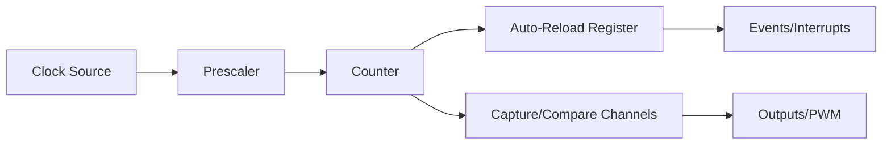

# STM32 Timer Basics

## Introduction

Timers are among the most versatile and commonly used peripherals in microcontrollers. In STM32 microcontrollers, timers provide precise timing capabilities for a wide range of applications, from generating PWM signals to measuring input frequencies and creating time delays.

This guide introduces you to STM32 timer fundamentals, covering their architecture, different timer types, and how to configure them for basic operations. By the end, you'll have a solid foundation to incorporate timers into your STM32 projects.

## Understanding STM32 Timer Architecture

At their core, STM32 timers are digital counters that increment or decrement at a configurable rate determined by the timer clock. Let's break down the key components of the timer architecture:

### Counter Register

The counter register (CNT) is the heart of the timer. It:
- Counts up, down, or up-and-down depending on the configuration
- Has a resolution determined by the timer type (16-bit or 32-bit)
- Can count from 0 to 65,535 (for 16-bit timers) or 0 to 4,294,967,295 (for 32-bit timers)

### Prescaler

The prescaler (PSC) divides the timer clock before it reaches the counter:
- Allows you to slow down the counter rate
- Has a 16-bit value (0-65535)
- Formula: Timer tick frequency = Timer clock / (Prescaler + 1)

### Auto-Reload Register

The auto-reload register (ARR) sets the maximum value the counter can reach:
- When reached, the counter resets or changes direction
- Determines the period of the timer
- Timer period = (ARR + 1) × Timer tick period

Let's visualize the basic timer architecture:



## Types of STM32 Timers

STM32 microcontrollers include several types of timers, each with different capabilities:

1. **Basic Timers**: Simplest form, mainly used for time-base generation and triggering DAC
2. **General-Purpose Timers**: More versatile with input/output channels for PWM, input capture, and output compare
3. **Advanced Timers**: Include additional features like complementary outputs with dead-time insertion, ideal for motor control
4. **Low-Power Timers**: Designed to operate in low-power modes with minimal current consumption

Here's a comparison table of the common timer types found in many STM32 microcontrollers:

| Timer Type | Resolution | Channels | Special Features | Typical Use Cases |
|------------|------------|----------|------------------|-------------------|
| Basic | 16-bit | 0 | Simple timeout | Time base generation, delays |
| General-Purpose | 16/32-bit | 2-4 | Input capture, output compare | PWM generation, event timing |
| Advanced | 16-bit | 4-6 | Dead-time insertion, complementary outputs | Motor control, complex PWM |
| Low-Power | 16-bit | 1-2 | Ultra-low power consumption | Wake-up source in sleep modes |

## Timer Clock Configuration

Before using a timer, you need to enable its clock and configure it properly. Here's how to do it using STM32CubeHAL:

```c
// Enable clock for TIM2
__HAL_RCC_TIM2_CLK_ENABLE();

// Timer handle declaration
TIM_HandleTypeDef htim2;

// Basic timer initialization
htim2.Instance = TIM2;
htim2.Init.Prescaler = 7999;        // Divide clock by 8000
htim2.Init.CounterMode = TIM_COUNTERMODE_UP;
htim2.Init.Period = 9999;           // Count to 10000
htim2.Init.ClockDivision = TIM_CLOCKDIVISION_DIV1;
htim2.Init.AutoReloadPreload = TIM_AUTORELOAD_PRELOAD_DISABLE;

// Initialize timer
HAL_TIM_Base_Init(&htim2);

// Start timer
HAL_TIM_Base_Start(&htim2);
```

In this example, assuming a 64MHz clock, the timer will tick at:
- Timer frequency = 64MHz / (7999 + 1) = 8kHz
- Timer period = (9999 + 1) / 8kHz = 1.25 seconds

## Creating Time Delays with Timers

One of the simplest applications of timers is creating precise delays. Here's how to implement a blocking delay function:

```c
void Timer_Delay_ms(TIM_HandleTypeDef *htim, uint32_t delay_ms) {
    // Reset counter
    __HAL_TIM_SET_COUNTER(htim, 0);
    
    // Wait until the counter reaches the desired value
    while(__HAL_TIM_GET_COUNTER(htim) < delay_ms);
}
```

And here's how to set up a timer for non-blocking delays using interrupts:

```c
// Timer interrupt configuration
HAL_TIM_Base_Start_IT(&htim2);

// Timer interrupt handler
void HAL_TIM_PeriodElapsedCallback(TIM_HandleTypeDef *htim) {
    if(htim->Instance == TIM2) {
        // Your code to execute when the timer period elapses
        HAL_GPIO_TogglePin(GPIOA, GPIO_PIN_5); // Example: Toggle LED
    }
}
```

## Input Capture Mode

Input capture mode allows you to measure the duration of external signals. This is useful for measuring frequency, pulse width, or duty cycle.

```c
// Configure timer channel for input capture
TIM_IC_InitTypeDef sConfigIC;
sConfigIC.ICPolarity = TIM_ICPOLARITY_RISING;
sConfigIC.ICSelection = TIM_ICSELECTION_DIRECTTI;
sConfigIC.ICPrescaler = TIM_ICPSC_DIV1;
sConfigIC.ICFilter = 0;

HAL_TIM_IC_ConfigChannel(&htim3, &sConfigIC, TIM_CHANNEL_1);
HAL_TIM_IC_Start_IT(&htim3, TIM_CHANNEL_1);

// Input capture callback
void HAL_TIM_IC_CaptureCallback(TIM_HandleTypeDef *htim) {
    if(htim->Instance == TIM3) {
        if(htim->Channel == HAL_TIM_ACTIVE_CHANNEL_1) {
            uint32_t captureValue = HAL_TIM_ReadCapturedValue(htim, TIM_CHANNEL_1);
            // Process captured value
        }
    }
}
```

## Output Compare Mode

Output compare mode allows you to generate precise timing events or waveforms:

```c
// Configure timer channel for output compare
TIM_OC_InitTypeDef sConfigOC;
sConfigOC.OCMode = TIM_OCMODE_TIMING;
sConfigOC.Pulse = 5000;  // Set compare value
sConfigOC.OCPolarity = TIM_OCPOLARITY_HIGH;
sConfigOC.OCFastMode = TIM_OCFAST_DISABLE;

HAL_TIM_OC_ConfigChannel(&htim4, &sConfigOC, TIM_CHANNEL_1);
HAL_TIM_OC_Start_IT(&htim4, TIM_CHANNEL_1);

// Output compare callback
void HAL_TIM_OC_DelayElapsedCallback(TIM_HandleTypeDef *htim) {
    if(htim->Instance == TIM4) {
        if(htim->Channel == HAL_TIM_ACTIVE_CHANNEL_1) {
            // Your code to execute when compare match occurs
        }
    }
}
```

## Generating PWM Signals

Pulse Width Modulation (PWM) is one of the most common timer applications. Here's how to configure a timer for PWM output:

```c
// Configure timer channel for PWM output
TIM_OC_InitTypeDef sConfigOC;
sConfigOC.OCMode = TIM_OCMODE_PWM1;
sConfigOC.Pulse = 5000;  // Set initial duty cycle (50% if Period = 9999)
sConfigOC.OCPolarity = TIM_OCPOLARITY_HIGH;
sConfigOC.OCFastMode = TIM_OCFAST_DISABLE;

HAL_TIM_PWM_ConfigChannel(&htim3, &sConfigOC, TIM_CHANNEL_1);
HAL_TIM_PWM_Start(&htim3, TIM_CHANNEL_1);

// Change duty cycle during runtime
void Update_Duty_Cycle(TIM_HandleTypeDef *htim, uint32_t channel, uint32_t duty_cycle) {
    // duty_cycle should be between 0 and 100
    uint32_t pulse = (htim->Init.Period + 1) * duty_cycle / 100;
    __HAL_TIM_SET_COMPARE(htim, channel, pulse);
}
```

## Practical Example: LED Breathing Effect

Let's implement a practical example using PWM to create an LED breathing effect:

```c
// Timer configuration code (as shown earlier)
// ...

void LED_Breathing(void) {
    uint32_t brightness = 0;
    int8_t direction = 1;
    
    while(1) {
        // Update brightness
        brightness += direction;
        
        // Change direction at limits
        if(brightness >= 100) direction = -1;
        if(brightness <= 0) direction = 1;
        
        // Update PWM duty cycle
        Update_Duty_Cycle(&htim3, TIM_CHANNEL_1, brightness);
        
        // Small delay for visible effect
        HAL_Delay(10);
    }
}
```

## Practical Example: Frequency Measurement

Here's how to measure the frequency of an input signal using timer input capture:

```c
uint32_t prevCapture = 0;
uint32_t frequency = 0;
uint32_t timerClock = 64000000; // Assuming 64MHz timer clock

void HAL_TIM_IC_CaptureCallback(TIM_HandleTypeDef *htim) {
    if(htim->Instance == TIM3) {
        if(htim->Channel == HAL_TIM_ACTIVE_CHANNEL_1) {
            uint32_t currentCapture = HAL_TIM_ReadCapturedValue(htim, TIM_CHANNEL_1);
            
            // Calculate period
            uint32_t period = 0;
            if(currentCapture > prevCapture) {
                period = currentCapture - prevCapture;
            } else {
                // Timer overflow occurred
                period = ((htim->Init.Period + 1) - prevCapture) + currentCapture;
            }
            
            // Calculate frequency (considering prescaler)
            uint32_t prescaler = htim->Init.Prescaler + 1;
            frequency = (timerClock / prescaler) / period;
            
            // Save current capture for next calculation
            prevCapture = currentCapture;
        }
    }
}
```

## Summary

In this tutorial, we covered the fundamentals of STM32 timers:

- Timer architecture and key components
- Different timer types and their capabilities
- Basic timer configuration
- Time delay generation
- Input capture for measuring signals
- Output compare for generating events
- PWM generation for variable output control

STM32 timers are incredibly versatile peripherals that form the foundation for many embedded applications. With the knowledge gained here, you're ready to incorporate timers into your projects for precise timing, signal measurement, and output generation.

## Exercises

To reinforce your understanding of STM32 timers, try these exercises:

1. Create a function that uses a timer to generate a precise 1ms delay.
2. Implement a timer-based system to toggle an LED at exactly 2.5Hz.
3. Build a frequency counter that can measure and display input frequencies from 1Hz to 10kHz.
4. Generate a PWM signal with variable duty cycle controlled by a potentiometer.
5. Implement a traffic light controller using timer interrupts for state changes.

## Additional Resources

- STM32 Reference Manuals (specific to your device family)
- STM32CubeHAL User Manuals
- STM32 Timer Application Notes (AN4013, AN4776)
- Online tutorials and community forums