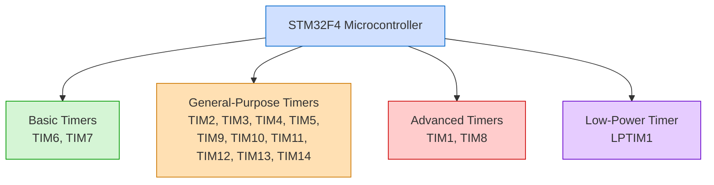
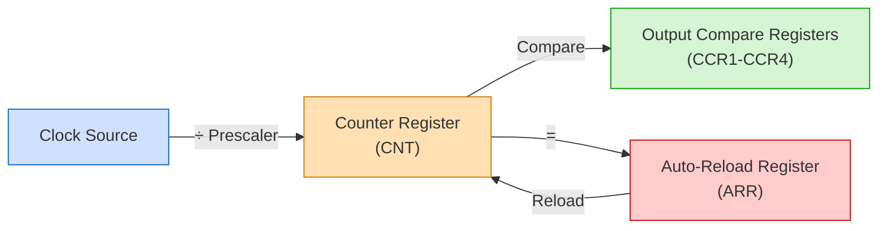
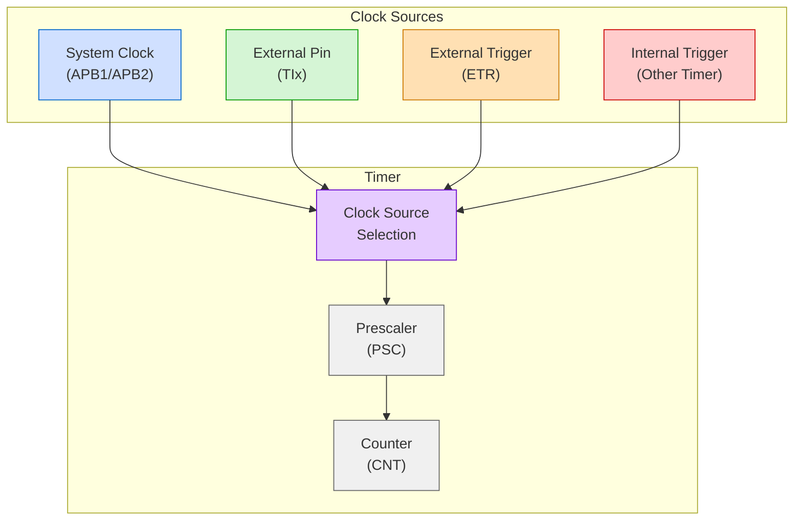

# STM32 Timer Architecture

## Introduction

Timers are among the most versatile and powerful peripherals in STM32 microcontrollers. They allow you to measure time intervals, generate signals, capture input signals, and control various timing-related operations with minimal CPU intervention. Understanding the architecture of STM32 timers is essential for leveraging their capabilities in your embedded applications.

In this guide, we'll explore the fundamental architecture of STM32 timers, their types, and how they function at a hardware level. This knowledge will serve as a foundation for more advanced timer applications in later sections.

## Timer Types in STM32

STM32 microcontrollers feature several types of timers, each designed for specific purposes:

1. **Basic Timers**: Simple timers primarily used for time-base generation and triggering other peripherals.

2. **General-Purpose Timers**: Versatile timers with multiple channels for input capture, output compare, and PWM generation.

3. **Advanced Timers**: Enhanced timers with complementary outputs, dead-time insertion, and additional features for motor control applications.

4. **Low-Power Timers**: Specialized timers that can operate in low-power modes with minimal current consumption.

Let's visualize the timer distribution across a typical STM32F4 microcontroller:



## Core Timer Architecture

Despite their differences, all STM32 timers share a common architectural foundation. Let's examine these core components:

### Counter

The counter is the heart of any timer. It's a register that can count up, down, or both (up-down) based on configuration. The counter value increments or decrements according to:

- Clock source (internal or external)
- Prescaler value
- Counting direction



### Prescaler (PSC)

The prescaler divides the input clock frequency before it reaches the counter. This extends the timer's range and allows for precise timing adjustments. The formula is:

`Timer Clock = Input Clock / (Prescaler + 1)`

For example, with a 72MHz clock and a prescaler of 71:

`Timer Clock = 72,000,000 / (71 + 1) = 1,000,000 Hz (1MHz)`

This means the counter increments every 1μs.

### Auto-Reload Register (ARR)

The auto-reload register defines the maximum value the counter can reach before it resets (in up-counting mode) or the minimum value before it resets (in down-counting mode). This determines the period of the timer:

`Timer Period = (ARR + 1) / Timer Clock`

For example, with ARR = 999 and a 1MHz timer clock:

`Timer Period = (999 + 1) / 1,000,000 = 0.001s (1ms)`

### Capture/Compare Registers (CCR)

These registers are used for:

- **Output Compare Mode**: Generate events when the counter matches the CCR value
- **Input Capture Mode**: Record the counter value when an external event occurs

A single timer can have multiple channels (typically 2-4), each with its own CCR.

## Timer Clock Sources

STM32 timers can use various clock sources:

1. **Internal Clock**: Derived from the system clock (typically APB1 or APB2)
2. **External Clock Mode 1**: External input pin (TIx)
3. **External Clock Mode 2**: External trigger input (ETR)
4. **Internal Trigger**: Output from another timer



## Timer Operation Modes

STM32 timers support several operation modes:

### Time Base Generation

The simplest mode where the timer generates periodic events based on the counter and ARR value. This is commonly used for creating regular interrupts.

### Input Capture

In this mode, the timer captures the counter value when an event occurs on an input pin. This is useful for measuring pulse width, frequency, or duty cycle of external signals.

### Output Compare

The timer generates output signals or actions when the counter matches a compare value. This can be used for generating precise timing events.

### PWM Generation

A specialized form of output compare that generates Pulse Width Modulation signals. The duty cycle is determined by the compare value relative to the auto-reload value.

## Basic Timer Control Registers

To control timers, you'll primarily interact with these registers:

1. **TIMx_CR1**: Control Register 1 - sets counting direction, alignment, and enables the counter
2. **TIMx_DIER**: DMA/Interrupt Enable Register - enables various interrupts and DMA requests
3. **TIMx_SR**: Status Register - indicates timer events like update, compare match, etc.
4. **TIMx_EGR**: Event Generation Register - forces events for testing or synchronization
5. **TIMx_CNT**: Counter Register - contains the current counter value
6. **TIMx_PSC**: Prescaler Register - sets the prescaler value
7. **TIMx_ARR**: Auto-Reload Register - defines the counter's period

## Practical Example: Basic Timer Configuration

Let's look at a basic example of configuring a timer (TIM2) as a time base generator:

```c
// Enable TIM2 clock
RCC->APB1ENR |= RCC_APB1ENR_TIM2EN;

// Set prescaler for 1MHz timer clock (assuming 72MHz system clock)
TIM2->PSC = 71;  // 72MHz / (71+1) = 1MHz

// Set auto-reload value for 1ms period
TIM2->ARR = 999;  // (999+1) / 1MHz = 1ms

// Enable update interrupt
TIM2->DIER |= TIM_DIER_UIE;

// Enable counter
TIM2->CR1 |= TIM_CR1_CEN;

// Configure NVIC for TIM2 interrupt
NVIC_EnableIRQ(TIM2_IRQn);
NVIC_SetPriority(TIM2_IRQn, 1);
```

The interrupt handler would look like:

```c
void TIM2_IRQHandler(void) {
    // Check if update interrupt flag is set
    if (TIM2->SR & TIM_SR_UIF) {
        // Clear the interrupt flag
        TIM2->SR &= ~TIM_SR_UIF;
        
        // Your code here - this will execute every 1ms
        toggleLED();  // Example action
    }
}
```

## HAL Library Implementation

For beginners, using the STM32 HAL (Hardware Abstraction Layer) library can simplify timer configuration. Here's an equivalent example using HAL:

```c
TIM_HandleTypeDef htim2;

void configureTimer(void) {
    // Configure timer timebase
    htim2.Instance = TIM2;
    htim2.Init.Prescaler = 71;  // 72MHz / (71+1) = 1MHz
    htim2.Init.CounterMode = TIM_COUNTERMODE_UP;
    htim2.Init.Period = 999;    // (999+1) / 1MHz = 1ms
    htim2.Init.ClockDivision = TIM_CLOCKDIVISION_DIV1;
    
    // Initialize timer
    HAL_TIM_Base_Init(&htim2);
    
    // Start timer with interrupts
    HAL_TIM_Base_Start_IT(&htim2);
}

// Timer callback function
void HAL_TIM_PeriodElapsedCallback(TIM_HandleTypeDef *htim) {
    if (htim->Instance == TIM2) {
        // Your code here - this will execute every 1ms
        HAL_GPIO_TogglePin(LED_GPIO_Port, LED_Pin);  // Example action
    }
}
```

## Real-World Applications

Timers are central to many embedded applications. Here are some common uses:

1. **LED Blinking without Blocking**: Create precise timing for visual indicators without using delay functions.

2. **Motor Control**: Generate PWM signals to control the speed and direction of motors.

3. **Communication Protocols**: Implement timing for custom communication protocols or enhance existing ones.

4. **Data Acquisition**: Precisely time the sampling of sensors or analog signals.

5. **Watchdog Functionality**: Create custom watchdog timers to detect and recover from software failures.

## Advanced Timer Features

Advanced timers (like TIM1 and TIM8) include additional features:

1. **Complementary Outputs**: Generate complementary signals (useful for H-bridge control)
2. **Dead-Time Insertion**: Add a delay between complementary signals to prevent shoot-through
3. **Break Function**: Shut down outputs when a critical error is detected
4. **Center-Aligned PWM**: Generate symmetrical PWM signals with reduced harmonics

These features make advanced timers particularly suited for motor control applications.

## Summary

STM32 timers are versatile peripherals with a consistent architectural foundation. They consist of:

- Counter registers that track time
- Prescalers that divide the input clock
- Auto-reload registers that determine the timer period
- Capture/compare registers for input capture or output compare operations

Understanding this architecture allows you to implement precise timing, pulse generation, signal measurement, and more in your embedded applications.

## Exercise Ideas

1. Configure a basic timer to generate a 500ms interrupt and toggle an LED.
2. Implement a system that measures the frequency of an external signal using input capture.
3. Generate PWM signals with various duty cycles to control the brightness of an LED.
4. Create a timer-based debouncing solution for a button input.
5. Implement a simple digital tachometer using timer input capture.

## Additional Resources

- STM32 Reference Manuals for your specific microcontroller
- STM32 HAL and LL Timer APIs documentation
- [ST Microelectronics Application Notes on Timers](https://www.st.com)
- Community forums like STM32 Community and Stack Overflow