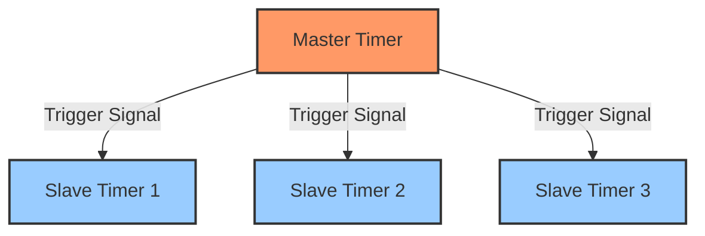
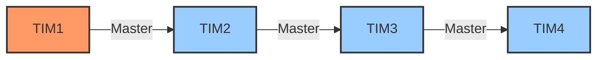

# STM32 Timer Synchronization

## Introduction

Timer synchronization is a powerful feature in STM32 microcontrollers that allows multiple timers to work together in a coordinated manner. This coordination enables more complex timing applications such as multi-phase PWM generation, precise event sequencing, and advanced motor control. 

In this tutorial, we'll explore how to synchronize multiple timers on STM32 microcontrollers, why you might need this feature, and how to implement it in your projects. By the end, you'll understand how to leverage timer synchronization to solve timing challenges in your embedded applications.

## Why Synchronize Timers?

Before diving into the implementation details, let's understand why timer synchronization is important:

1. **Synchronized PWM Outputs**: Generate multiple PWM signals with precise phase relationships.
2. **Complex Waveform Generation**: Create sophisticated waveforms requiring multiple timers.
3. **Advanced Motor Control**: Implement field-oriented control for BLDC/PMSM motors.
4. **Event Sequencing**: Trigger multiple events with precise timing relationships.
5. **Clock Distribution**: Use one timer as a master clock source for others.

## Timer Synchronization Basics

STM32 timers can be configured in master-slave arrangements, where one timer (the master) controls one or more other timers (the slaves). The synchronization mechanism works through the Timer Synchronization (TS) signals.

### Master-Slave Architecture



### Synchronization Modes

STM32 timers support several synchronization modes:

1. **Reset Mode**: The slave timer counter resets when the master trigger occurs.
2. **Gated Mode**: The slave timer counts only when the trigger signal is active.
3. **Trigger Mode**: The slave timer starts counting when the trigger is received.
4. **External Clock Mode 1**: The slave timer uses the trigger signal as a clock.

### Trigger Sources

Common trigger sources include:

- Timer Update Events
- Timer Capture/Compare Events
- Timer Trigger Outputs (TRGO)
- External Trigger Inputs (ETR)

## Setting Up Timer Synchronization

Let's go through a step-by-step example of synchronizing two timers. We'll configure TIM2 as a master timer and TIM3 as a slave timer.

### Step 1: Initialize the Clocks

First, we need to enable the clocks for the timers we'll be using:

```c
// Enable clocks for TIM2 and TIM3
RCC->APB1ENR |= RCC_APB1ENR_TIM2EN | RCC_APB1ENR_TIM3EN;
```

### Step 2: Configure the Master Timer (TIM2)

Next, we'll set up TIM2 as our master timer:

```c
// Configure TIM2 as a master timer
TIM2->PSC = 7999;              // Prescaler: 8000 - 1
TIM2->ARR = 9999;              // Auto-reload: 10000 - 1
TIM2->CR1 = TIM_CR1_CEN;       // Enable counter

// Configure the master mode
TIM2->CR2 &= ~TIM_CR2_MMS;     // Clear Master Mode Selection
TIM2->CR2 |= TIM_CR2_MMS_0;    // Set Master Mode to 'Update'
                               // (001: Update event is TRGO)
```

This configures TIM2 with:
- 8000 prescaler (assuming 8 MHz clock, this gives 1 kHz timer clock)
- 10000 auto-reload value (1 kHz / 10000 = 0.1 Hz or 10-second period)
- Update event as the trigger output (TRGO)

### Step 3: Configure the Slave Timer (TIM3)

Now let's configure TIM3 as a slave timer:

```c
// Configure TIM3 as a slave timer
TIM3->PSC = 999;               // Prescaler: 1000 - 1
TIM3->ARR = 999;               // Auto-reload: 1000 - 1

// Configure slave mode
TIM3->SMCR &= ~TIM_SMCR_TS;    // Clear Trigger Selection
TIM3->SMCR |= TIM_SMCR_TS_1;   // Set TS to ITR1 (010: Internal Trigger 1)
                               // ITR1 connects to TIM2

TIM3->SMCR &= ~TIM_SMCR_SMS;   // Clear Slave Mode Selection
TIM3->SMCR |= TIM_SMCR_SMS_2;  // Set SMS to 'Reset Mode' (100)

TIM3->CR1 = TIM_CR1_CEN;       // Enable counter
```

This configures TIM3 with:
- 1000 prescaler
- 1000 auto-reload value
- ITR1 (TIM2) as the trigger source
- Reset mode (counter resets when trigger received)

The internal trigger connections are fixed in hardware. For most STM32 devices:
- ITR0 in TIM2 connects to TIM1
- ITR1 in TIM3 connects to TIM2
- And so on (check the reference manual for your specific device)

## Practical Applications

Let's explore some practical applications of timer synchronization.

### Example 1: Cascaded Timers for Long Time Intervals

One common use case is creating a very long time interval by cascading timers:

```c
// Timer setup for a very long interval using cascaded timers
void SetupLongInterval(void) {
    // Enable clocks
    RCC->APB1ENR |= RCC_APB1ENR_TIM2EN | RCC_APB1ENR_TIM3EN;
    
    // Configure TIM2 as a master timer (16-bit timer)
    TIM2->PSC = 7999;              // 1 kHz timer clock (assuming 8 MHz system clock)
    TIM2->ARR = 65535;             // Maximum value for 16-bit timer
    TIM2->CR2 |= TIM_CR2_MMS_1;    // TRGO on counter overflow
    TIM2->CR1 |= TIM_CR1_CEN;      // Enable counter
    
    // Configure TIM3 as a slave timer
    TIM3->PSC = 0;                 // No additional prescaling
    TIM3->ARR = 65535;             // Maximum value
    TIM3->SMCR |= TIM_SMCR_TS_1;   // ITR1 (TIM2) as trigger source
    TIM3->SMCR |= TIM_SMCR_SMS_0 | TIM_SMCR_SMS_1 | TIM_SMCR_SMS_2; // External Clock Mode 1
    TIM3->CR1 |= TIM_CR1_CEN;      // Enable counter
    
    // Configure TIM3 to generate an interrupt on overflow
    TIM3->DIER |= TIM_DIER_UIE;    // Update interrupt enable
    NVIC_EnableIRQ(TIM3_IRQn);     // Enable TIM3 interrupt in NVIC
}

// TIM3 Interrupt Handler
void TIM3_IRQHandler(void) {
    if (TIM3->SR & TIM_SR_UIF) {
        TIM3->SR &= ~TIM_SR_UIF;  // Clear update interrupt flag
        
        // Your code here - this executes after approximately 
        // 65536 × 65536 × (1/1000) = 4294.967296 seconds (≈ 71.6 minutes)
    }
}
```

This setup creates a timer chain where TIM3 increments every time TIM2 overflows, effectively multiplying the maximum counting period.

### Example 2: Multi-phase PWM Generation

For motor control or power conversion applications, synchronized multi-phase PWM signals are essential:

```c
// Setup synchronized 3-phase PWM
void Setup3PhasePWM(void) {
    // Enable clocks
    RCC->APB2ENR |= RCC_APB2ENR_TIM1EN;
    
    // Configure TIM1 for center-aligned PWM
    TIM1->CR1 = TIM_CR1_CMS_0 | TIM_CR1_CMS_1;  // Center-aligned mode
    TIM1->PSC = 7;                // 10 MHz timer clock (assuming 80 MHz system clock)
    TIM1->ARR = 999;              // 10 kHz PWM frequency
    
    // Configure PWM channels
    // Channel 1 - Phase A
    TIM1->CCR1 = 500;             // 50% duty cycle
    TIM1->CCMR1 |= TIM_CCMR1_OC1M_1 | TIM_CCMR1_OC1M_2;  // PWM mode 1
    TIM1->CCMR1 |= TIM_CCMR1_OC1PE;  // Preload enable
    TIM1->CCER |= TIM_CCER_CC1E;   // Enable output
    
    // Channel 2 - Phase B (120° phase shift)
    TIM1->CCR2 = 500;             // 50% duty cycle
    TIM1->CCMR1 |= TIM_CCMR1_OC2M_1 | TIM_CCMR1_OC2M_2;  // PWM mode 1
    TIM1->CCMR1 |= TIM_CCMR1_OC2PE;  // Preload enable
    TIM1->CCER |= TIM_CCER_CC2E;   // Enable output
    
    // Channel 3 - Phase C (240° phase shift)
    TIM1->CCR3 = 500;             // 50% duty cycle
    TIM1->CCMR2 |= TIM_CCMR2_OC3M_1 | TIM_CCMR2_OC3M_2;  // PWM mode 1
    TIM1->CCMR2 |= TIM_CCMR2_OC3PE;  // Preload enable
    TIM1->CCER |= TIM_CCER_CC3E;   // Enable output
    
    // Enable outputs
    TIM1->BDTR |= TIM_BDTR_MOE;   // Main output enable
    
    // Set up phase shifts using the repetition counter to delay updates
    TIM1->RCR = 0;                // Update every counter cycle
    
    // Start the timer
    TIM1->CR1 |= TIM_CR1_CEN;
    
    // The phase shift is managed in the timer update interrupt handler
}

// TIM1 Update Interrupt for phase management
void TIM1_UP_TIM10_IRQHandler(void) {
    static uint8_t phase = 0;
    
    if (TIM1->SR & TIM_SR_UIF) {
        TIM1->SR &= ~TIM_SR_UIF;  // Clear update interrupt flag
        
        // Adjust phase based on counter
        phase = (phase + 1) % 3;
        
        switch(phase) {
            case 0:  // Phase A active
                TIM1->CCR1 = 500;  // 50% duty cycle
                TIM1->CCR2 = 0;    // Off
                TIM1->CCR3 = 0;    // Off
                break;
            case 1:  // Phase B active
                TIM1->CCR1 = 0;    // Off
                TIM1->CCR2 = 500;  // 50% duty cycle
                TIM1->CCR3 = 0;    // Off
                break;
            case 2:  // Phase C active
                TIM1->CCR1 = 0;    // Off
                TIM1->CCR2 = 0;    // Off
                TIM1->CCR3 = 500;  // 50% duty cycle
                break;
        }
    }
}
```

This creates three PWM signals with 120° phase shifts between them, which is essential for three-phase motor control.

## Using HAL Library for Timer Synchronization

For those using the STM32 HAL library, here's how to implement timer synchronization:

```c
// HAL Example: TIM2 as Master, TIM3 as Slave
void HAL_TimerSyncExample(void) {
    TIM_HandleTypeDef htim2, htim3;
    TIM_MasterConfigTypeDef sMasterConfig;
    TIM_SlaveConfigTypeDef sSlaveConfig;
    
    // Initialize TIM2 as master
    htim2.Instance = TIM2;
    htim2.Init.Prescaler = 7999;
    htim2.Init.CounterMode = TIM_COUNTERMODE_UP;
    htim2.Init.Period = 9999;
    htim2.Init.ClockDivision = TIM_CLOCKDIVISION_DIV1;
    HAL_TIM_Base_Init(&htim2);
    
    // Configure TIM2 as master
    sMasterConfig.MasterOutputTrigger = TIM_TRGO_UPDATE;
    sMasterConfig.MasterSlaveMode = TIM_MASTERSLAVEMODE_ENABLE;
    HAL_TIMEx_MasterConfigSynchronization(&htim2, &sMasterConfig);
    
    // Initialize TIM3 as slave
    htim3.Instance = TIM3;
    htim3.Init.Prescaler = 999;
    htim3.Init.CounterMode = TIM_COUNTERMODE_UP;
    htim3.Init.Period = 999;
    htim3.Init.ClockDivision = TIM_CLOCKDIVISION_DIV1;
    HAL_TIM_Base_Init(&htim3);
    
    // Configure TIM3 as slave
    sSlaveConfig.SlaveMode = TIM_SLAVEMODE_RESET;
    sSlaveConfig.InputTrigger = TIM_TS_ITR1;  // ITR1 = TIM2
    sSlaveConfig.TriggerPolarity = TIM_TRIGGERPOLARITY_RISING;
    sSlaveConfig.TriggerPrescaler = TIM_TRIGGERPRESCALER_DIV1;
    HAL_TIM_SlaveConfigSynchronization(&htim3, &sSlaveConfig);
    
    // Start timers
    HAL_TIM_Base_Start(&htim2);
    HAL_TIM_Base_Start(&htim3);
}
```

## Advanced Synchronization Techniques

### Timer Chaining for Complex Timing

You can chain multiple timers for elaborate timing sequences:



### Timer Synchronization with External Events

Timers can also be synchronized with external events using the ETR (External Trigger) input:

```c
// Synchronize timer with external signal
void SyncTimerWithExternal(void) {
    // Enable TIM2 clock
    RCC->APB1ENR |= RCC_APB1ENR_TIM2EN;
    
    // Configure GPIO for ETR input (check datasheet for specific pin)
    // This example assumes PA0 is connected to TIM2_ETR
    RCC->AHB1ENR |= RCC_AHB1ENR_GPIOAEN;
    GPIOA->MODER &= ~GPIO_MODER_MODER0;
    GPIOA->MODER |= GPIO_MODER_MODER0_1;  // Alternate function
    GPIOA->AFR[0] |= 1;  // AF1 for TIM2 on PA0
    
    // Configure TIM2 to use ETR as trigger
    TIM2->PSC = 0;
    TIM2->ARR = 65535;
    
    // Configure External Trigger
    TIM2->SMCR &= ~TIM_SMCR_TS;
    TIM2->SMCR |= TIM_SMCR_TS_2 | TIM_SMCR_TS_1 | TIM_SMCR_TS_0;  // 111: External Trigger Input (ETRF)
    
    // Configure as trigger mode
    TIM2->SMCR &= ~TIM_SMCR_SMS;
    TIM2->SMCR |= TIM_SMCR_SMS_1 | TIM_SMCR_SMS_0;  // 011: Trigger Mode
    
    // Enable counter
    TIM2->CR1 |= TIM_CR1_CEN;
}
```

## Common Challenges and Solutions

### Timer Synchronization Issues

If you're having trouble with timer synchronization, check these common issues:

1. **Incorrect Trigger Source**: Verify the ITR mapping in your device's reference manual.
2. **Clock Domain Issues**: Ensure all timers use the same clock domain or account for domain crossing.
3. **Timer Reset Behavior**: Some synchronization modes require specific reset behaviors.

### Debug Techniques

To debug timer synchronization:

1. Use an oscilloscope to monitor timer outputs.
2. Configure unused timer channels as outputs for debugging.
3. Set up debug registers to freeze timers during debugging (DBG_TIMx_STOP bits).

## Summary

STM32 timer synchronization is a powerful feature that allows you to create complex timing relationships between multiple timers. This capability is essential for applications like motor control, precision timing, and multi-phase systems.

Key points to remember:
- Timers can be configured in master-slave arrangements
- Multiple synchronization modes are available (Reset, Gated, Trigger, and External Clock)
- Various trigger sources can be used (Update events, CCx events, TRGO, ETR)
- Properly synchronized timers can solve complex timing challenges

## Exercises

1. Configure TIM1 as a master timer and TIM2 as a slave timer in Reset mode.
2. Create a cascade of three timers (TIM1 → TIM2 → TIM3) to generate a very long time interval.
3. Generate two PWM signals with a precise 90° phase shift using timer synchronization.
4. Implement a system where an external input triggers a sequence of timed events using multiple synchronized timers.
5. Create a multi-phase PWM generator with configurable phase shifts for three-phase motor control.

## Additional Resources

- **STM32 Reference Manuals**: Check your specific device's reference manual for details on timer connections and capabilities.
- **STM32 Application Notes**:
  - AN4013: STM32 cross-series timer overview
  - AN4776: General-purpose timer cookbook
- **STM32 HAL Documentation**: For implementation using the HAL library.

By mastering timer synchronization, you'll be able to implement advanced timing functionality in your STM32 projects, opening up possibilities for more sophisticated embedded applications.