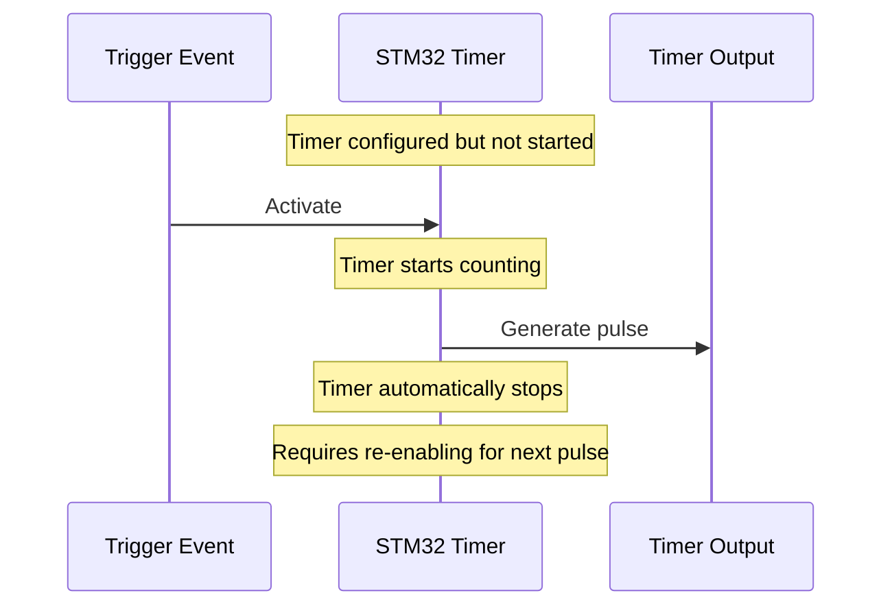

# STM32 One-Pulse Mode

## Introduction

The STM32 microcontroller family offers a variety of timer peripherals with advanced features for precise timing control. One of these features is the **One-Pulse Mode (OPM)**, which allows you to generate a single, precisely timed pulse when triggered. This mode is particularly useful in applications requiring exact timing control, such as:

- Triggering sensors or actuators once
- Generating precise delays
- Creating one-time control signals
- Timing critical events

In this tutorial, we'll explore how the One-Pulse Mode works, how to configure it, and walk through some practical examples to demonstrate its capabilities.

## Understanding One-Pulse Mode

### What is One-Pulse Mode?

One-Pulse Mode is a special timer operating mode where the timer automatically stops after generating a single pulse. This differs from the standard timer operation, which continuously generates pulses until explicitly stopped.

### How Does It Work?

When configured in One-Pulse Mode:

1. The timer waits for a trigger event (like an external signal or software trigger)
2. Once triggered, it generates precisely one pulse with a programmable width
3. After generating the pulse, the timer automatically stops and disables itself
4. The timer needs to be re-enabled to generate another pulse

This behavior makes One-Pulse Mode perfect for applications requiring a single, accurate timing event without the need for continuous timer operation.



## Timer Configuration for One-Pulse Mode

To use One-Pulse Mode, we need to configure several key parameters:

1. **Timer Selection**: Choose an appropriate timer (e.g., TIM2, TIM3, etc.)
2. **Clock Source**: Configure the timer clock source and prescaler
3. **Counter Mode**: Set up as one-pulse mode
4. **Pulse Width**: Configure through the auto-reload register (ARR) and compare register (CCR)
5. **Trigger Source**: Select what will trigger the timer (external pin, software, etc.)

Let's look at the step-by-step process to set up One-Pulse Mode.

### Basic Configuration Steps

Here's how to configure a timer for One-Pulse Mode using STM32CubeHAL:

```c
void ConfigureOnePulseMode(void)
{
  // 1. Enable the timer clock
  __HAL_RCC_TIM2_CLK_ENABLE();
  
  // 2. Initialize timer handle
  TIM_HandleTypeDef htim2;
  htim2.Instance = TIM2;
  htim2.Init.Prescaler = 72 - 1;         // Assuming 72MHz clock, gives 1MHz timer clock
  htim2.Init.CounterMode = TIM_COUNTERMODE_UP;
  htim2.Init.Period = 1000 - 1;          // 1ms period
  htim2.Init.ClockDivision = TIM_CLOCKDIVISION_DIV1;
  htim2.Init.AutoReloadPreload = TIM_AUTORELOAD_PRELOAD_DISABLE;
  
  // 3. Initialize the timer base
  HAL_TIM_Base_Init(&htim2);
  
  // 4. Configure One-Pulse Mode
  TIM_OnePulse_InitTypeDef onePulseConfig;
  onePulseConfig.OCMode = TIM_OCMODE_PWM2;  // PWM mode 2 for proper pulse generation
  onePulseConfig.Pulse = 500 - 1;           // 500 ticks (half of period) = 0.5ms pulse width
  onePulseConfig.OCPolarity = TIM_OCPOLARITY_HIGH;
  onePulseConfig.OCNPolarity = TIM_OCNPOLARITY_HIGH;
  onePulseConfig.OCIdleState = TIM_OCIDLESTATE_RESET;
  onePulseConfig.OCNIdleState = TIM_OCNIDLESTATE_RESET;
  
  // 5. Initialize One-Pulse Mode
  HAL_TIM_OnePulse_Init(&htim2, TIM_OPMODE_SINGLE);
  
  // 6. Configure the output channel (e.g., Channel 1)
  HAL_TIM_OnePulse_ConfigChannel(&htim2, &onePulseConfig, TIM_CHANNEL_1, TIM_CHANNEL_2);
  
  // 7. Enable the output channel
  HAL_TIM_OnePulse_Start(&htim2, TIM_CHANNEL_1);
}
```

In this example:
- We configure TIM2 with a prescaler to get a 1MHz timer clock
- The period is set to 1000 ticks (1ms)
- The pulse width is set to 500 ticks (0.5ms)
- We use PWM mode 2, which is ideal for One-Pulse Mode operation

## Trigger Sources in One-Pulse Mode

One-Pulse Mode can be triggered in different ways:

### Software Trigger

You can trigger the pulse through software by setting the appropriate bit:

```c
// Trigger the one-pulse mode via software
HAL_TIM_GenerateEvent(&htim2, TIM_EVENTSOURCE_TRIGGER);
```

### External Trigger

You can also configure a timer to be triggered by an external signal:

```c
void ConfigureExternalTrigger(void)
{
  // Configure TIM2 to be triggered by an external signal on TI1 (PA0)
  TIM_SlaveConfigTypeDef slaveConfig;
  slaveConfig.SlaveMode = TIM_SLAVEMODE_TRIGGER;
  slaveConfig.InputTrigger = TIM_TS_TI1FP1;        // Use filtered TI1 as trigger
  slaveConfig.TriggerPolarity = TIM_TRIGGERPOLARITY_RISING;
  slaveConfig.TriggerFilter = 0;
  
  HAL_TIM_SlaveConfigSynchro(&htim2, &slaveConfig);
}
```

This configuration makes the timer wait for a rising edge on the TI1 input (typically PA0 for TIM2) before generating the pulse.

## Practical Examples

Let's explore some practical applications of One-Pulse Mode.

### Example 1: Precise Delay Generator

This example shows how to use One-Pulse Mode to generate a precise delay before executing a task:

```c
void PreciseDelayExample(void)
{
  // Configure One-Pulse Mode
  ConfigureOnePulseMode();
  
  // Configure timer interrupt
  HAL_NVIC_SetPriority(TIM2_IRQn, 0, 0);
  HAL_NVIC_EnableIRQ(TIM2_IRQn);
  __HAL_TIM_ENABLE_IT(&htim2, TIM_IT_UPDATE);
  
  // Trigger the timer to start the delay
  HAL_TIM_GenerateEvent(&htim2, TIM_EVENTSOURCE_TRIGGER);
  
  // The interrupt will be called after exactly the configured delay
  
  // Main program continues executing...
}

// Timer interrupt handler
void TIM2_IRQHandler(void)
{
  if (__HAL_TIM_GET_FLAG(&htim2, TIM_FLAG_UPDATE) != RESET)
  {
    if (__HAL_TIM_GET_IT_SOURCE(&htim2, TIM_IT_UPDATE) != RESET)
    {
      __HAL_TIM_CLEAR_IT(&htim2, TIM_IT_UPDATE);
      
      // Execute your time-critical code here
      DelayedTask();
    }
  }
}

void DelayedTask(void)
{
  // This function will be called after the precise delay
  // Perform your timing-critical operations here
}
```

### Example 2: Sensor Trigger Controller

In this example, we'll create a system that triggers a sensor once and captures its response:

```c
void SensorTriggerExample(void)
{
  // Configure GPIO for sensor echo input
  GPIO_InitTypeDef GPIO_InitStruct = {0};
  __HAL_RCC_GPIOA_CLK_ENABLE();
  GPIO_InitStruct.Pin = GPIO_PIN_1;  // PA1 for echo input
  GPIO_InitStruct.Mode = GPIO_MODE_INPUT;
  GPIO_InitStruct.Pull = GPIO_NOPULL;
  HAL_GPIO_Init(GPIOA, &GPIO_InitStruct);
  
  // Configure Timer for One-Pulse Mode to trigger sensor
  ConfigureOnePulseMode();  // Configure TIM2 for a 10µs pulse (adjust parameters as needed)
  
  // Start sensor measurement
  HAL_TIM_OnePulse_Start(&htim2, TIM_CHANNEL_1);
  HAL_TIM_GenerateEvent(&htim2, TIM_EVENTSOURCE_TRIGGER);
  
  // Wait for sensor response (polling method)
  uint32_t timeout = HAL_GetTick() + 100;  // 100ms timeout
  uint32_t startTime, endTime, duration;
  
  // Wait for echo to start
  while (HAL_GPIO_ReadPin(GPIOA, GPIO_PIN_1) == GPIO_PIN_RESET)
  {
    if (HAL_GetTick() >= timeout) return;  // Timeout
  }
  startTime = HAL_GetTick();
  
  // Wait for echo to end
  while (HAL_GPIO_ReadPin(GPIOA, GPIO_PIN_1) == GPIO_PIN_SET)
  {
    if (HAL_GetTick() >= timeout) return;  // Timeout
  }
  endTime = HAL_GetTick();
  
  // Calculate duration
  duration = endTime - startTime;
  
  // Process sensor data
  ProcessSensorData(duration);
}
```

This example would be applicable for sensors like ultrasonic distance sensors that require a trigger pulse followed by echo duration measurement.

### Example 3: Precise Motor Control Pulse

This example demonstrates using One-Pulse Mode to generate a precise control signal for a stepper motor:

```c
void StepperPulseExample(void)
{
  // Configure the stepper motor direction pin
  HAL_GPIO_WritePin(DIRECTION_GPIO_Port, DIRECTION_Pin, GPIO_PIN_SET);  // Set direction
  
  // Configure One-Pulse Mode with appropriate timing for stepper motor
  TIM_HandleTypeDef htim2;
  htim2.Instance = TIM2;
  htim2.Init.Prescaler = 72 - 1;         
  htim2.Init.CounterMode = TIM_COUNTERMODE_UP;
  htim2.Init.Period = 100 - 1;           // Shorter period for faster stepping
  htim2.Init.ClockDivision = TIM_CLOCKDIVISION_DIV1;
  htim2.Init.AutoReloadPreload = TIM_AUTORELOAD_PRELOAD_DISABLE;
  
  HAL_TIM_Base_Init(&htim2);
  
  TIM_OnePulse_InitTypeDef onePulseConfig;
  onePulseConfig.OCMode = TIM_OCMODE_PWM2;
  onePulseConfig.Pulse = 50 - 1;         // 50% duty cycle
  onePulseConfig.OCPolarity = TIM_OCPOLARITY_HIGH;
  onePulseConfig.OCNPolarity = TIM_OCNPOLARITY_HIGH;
  onePulseConfig.OCIdleState = TIM_OCIDLESTATE_RESET;
  onePulseConfig.OCNIdleState = TIM_OCNIDLESTATE_RESET;
  
  HAL_TIM_OnePulse_Init(&htim2, TIM_OPMODE_SINGLE);
  HAL_TIM_OnePulse_ConfigChannel(&htim2, &onePulseConfig, TIM_CHANNEL_1, TIM_CHANNEL_2);
  
  // Generate a precise step pulse
  HAL_TIM_OnePulse_Start(&htim2, TIM_CHANNEL_1);
  HAL_TIM_GenerateEvent(&htim2, TIM_EVENTSOURCE_TRIGGER);
  
  // Wait for pulse to complete
  while (__HAL_TIM_GET_FLAG(&htim2, TIM_FLAG_UPDATE) == RESET) {}
  
  // Reset the flag
  __HAL_TIM_CLEAR_FLAG(&htim2, TIM_FLAG_UPDATE);
  
  // Pulse completed, motor has moved one step
}
```

## Advanced One-Pulse Mode Techniques

### Combining with DMA

For more complex applications, you can combine One-Pulse Mode with DMA to automatically update pulse parameters:

```c
void OnePulseWithDMAExample(void)
{
  // DMA configuration for automatic pulse width update
  static uint32_t pulseWidths[3] = {100, 200, 300};  // Different pulse widths
  
  __HAL_RCC_DMA1_CLK_ENABLE();
  
  hdma_tim2_up.Instance = DMA1_Channel2;
  hdma_tim2_up.Init.Direction = DMA_MEMORY_TO_PERIPH;
  hdma_tim2_up.Init.PeriphInc = DMA_PERIPH_INC_DISABLE;
  hdma_tim2_up.Init.MemInc = DMA_MEMORY_INC_ENABLE;
  hdma_tim2_up.Init.PeriphDataAlignment = DMA_PDATAALIGN_WORD;
  hdma_tim2_up.Init.MemDataAlignment = DMA_MDATAALIGN_WORD;
  hdma_tim2_up.Init.Mode = DMA_NORMAL;
  hdma_tim2_up.Init.Priority = DMA_PRIORITY_HIGH;
  
  HAL_DMA_Init(&hdma_tim2_up);
  
  // Link DMA to timer
  __HAL_LINKDMA(&htim2, hdma[TIM_DMA_ID_UPDATE], hdma_tim2_up);
  
  // Enable timer DMA request
  __HAL_TIM_ENABLE_DMA(&htim2, TIM_DMA_UPDATE);
  
  // Start DMA transfer to update CCR register
  HAL_DMA_Start(&hdma_tim2_up, (uint32_t)pulseWidths, (uint32_t)&htim2.Instance->CCR1, 3);
  
  // Configure and start one-pulse mode
  // ... (similar to previous examples)
}
```

### Timer Chaining

You can also chain multiple timers in One-Pulse Mode to create complex timing sequences:

```c
void ChainedTimersExample(void)
{
  // Configure first timer (TIM2) in One-Pulse Mode
  // ... (configuration code similar to previous examples)
  
  // Configure second timer (TIM3) to be triggered by TIM2's TRGO signal
  TIM_HandleTypeDef htim3;
  htim3.Instance = TIM3;
  // ... (basic configuration)
  
  // Set up slave mode to be triggered by TIM2
  TIM_SlaveConfigTypeDef slaveConfig;
  slaveConfig.SlaveMode = TIM_SLAVEMODE_TRIGGER;
  slaveConfig.InputTrigger = TIM_TS_ITR1;  // Internal Trigger 1 (TIM2)
  slaveConfig.TriggerPolarity = TIM_TRIGGERPOLARITY_RISING;
  slaveConfig.TriggerFilter = 0;
  
  HAL_TIM_SlaveConfigSynchro(&htim3, &slaveConfig);
  
  // Configure TIM2 to generate trigger output when it finishes
  TIM_MasterConfigTypeDef masterConfig;
  masterConfig.MasterOutputTrigger = TIM_TRGO_UPDATE;
  masterConfig.MasterSlaveMode = TIM_MASTERSLAVEMODE_ENABLE;
  
  HAL_TIMEx_MasterConfigSynchronization(&htim2, &masterConfig);
  
  // Start both timers in One-Pulse Mode
  HAL_TIM_OnePulse_Start(&htim2, TIM_CHANNEL_1);
  HAL_TIM_OnePulse_Start(&htim3, TIM_CHANNEL_1);
  
  // Trigger the first timer
  HAL_TIM_GenerateEvent(&htim2, TIM_EVENTSOURCE_TRIGGER);
  
  // Now TIM2 will generate a pulse, and when it finishes,
  // it will automatically trigger TIM3 to generate its pulse
}
```

## Common Issues and Troubleshooting

When working with One-Pulse Mode, you might encounter some common issues:

1. **Pulse Not Generated**
   - Check timer clock configuration
   - Verify trigger source is properly configured
   - Ensure output channel is correctly set up

2. **Unexpected Pulse Width**
   - Verify prescaler settings
   - Check ARR and CCR values
   - Confirm the OCMode setting (PWM1 vs PWM2)

3. **Multiple Pulses Instead of One**
   - Ensure One-Pulse Mode is properly enabled
   - Check for unintended retriggering

4. **Timer Not Stopping After Pulse**
   - Verify OPMODE is set to SINGLE
   - Check for conflicting timer configurations

## Summary

STM32's One-Pulse Mode is a powerful feature for generating precise, single-pulse events. Key points to remember:

- One-Pulse Mode automatically stops the timer after generating a single pulse
- It can be triggered by software or external events
- The pulse width is precisely controlled by timer registers
- It's useful for sensor triggering, precise delays, and motor control
- It can be combined with DMA and other timers for more complex operations

By mastering One-Pulse Mode, you can create highly accurate timing systems that are perfect for a wide range of embedded applications where precision is critical.

## Additional Resources

To deepen your understanding of STM32 Timers and One-Pulse Mode:

- Explore the STM32 Reference Manual for your specific device
- Review the timer-related sections in the STM32 HAL documentation
- Practice with different trigger sources and pulse widths
- Try implementing chained timer sequences

## Exercises

1. Configure a timer in One-Pulse Mode to generate a 100µs pulse when a button is pressed.
2. Create a circuit that uses One-Pulse Mode to trigger an ultrasonic sensor and measure distance.
3. Implement a system that generates three different pulse widths in sequence using One-Pulse Mode and DMA.
4. Design a stepper motor controller that uses One-Pulse Mode for precise positioning.
5. Modify the timer chain example to create a complex timing sequence with three timers.