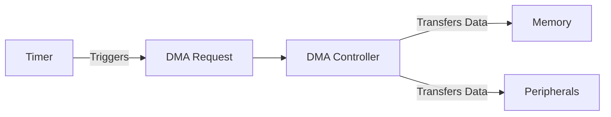

# STM32 Timer DMA

## Introduction

Direct Memory Access (DMA) is a powerful feature in STM32 microcontrollers that allows data to be transferred between memory and peripherals without CPU intervention. When combined with timers, DMA can automate repetitive tasks, significantly reduce CPU overhead, and enable high-speed, precise operations. This tutorial will explore how to configure and use DMA with STM32 timers for efficient data transfer operations.

## What is DMA?

DMA (Direct Memory Access) is a hardware feature that allows peripherals to access memory directly without requiring the CPU to handle each data transfer. This frees up the CPU to perform other tasks while data transfers occur in the background.

Key benefits of DMA include:

- Reduced CPU overhead
- Faster data transfers
- Ability to perform memory-to-peripheral, peripheral-to-memory, or memory-to-memory transfers
- Predictable timing for data transfers

## Timer and DMA Integration

STM32 timers can trigger DMA requests at specific events, such as:

- Update events (counter overflow/underflow)
- Capture/Compare events
- Trigger events

This integration allows for powerful applications like:

- Generating complex waveforms
- Sampling analog signals at precise intervals
- Controlling multiple PWM outputs with changing duty cycles
- Transferring large blocks of data with precise timing

Let's visualize the relationship between Timers and DMA:



## Prerequisites

Before diving into Timer DMA, you should have:

- Basic knowledge of STM32 microcontrollers
- Understanding of STM32 timers and their configuration
- Familiarity with STM32CubeIDE or your preferred STM32 development environment
- An STM32 development board (such as Nucleo or Discovery)

## Basic Concepts

### DMA Channels and Streams

STM32 microcontrollers organize DMA resources into:

- **DMA Controllers**: Most STM32 devices have 1-2 DMA controllers
- **DMA Channels/Streams**: Each controller has multiple channels (F1 series) or streams (F4/F7/H7 series)
- **Request Mapping**: Each peripheral's DMA request is mapped to specific channels/streams

### DMA Transfer Modes

DMA supports several transfer modes:

- **Normal Mode**: The transfer stops after completing the specified number of data items
- **Circular Mode**: The transfer automatically restarts after completion (ideal for continuous operations)
- **Memory-to-Memory Mode**: Transfers data between two memory locations (not used with timers)

### Data Width and Increment

DMA can be configured for different:

- **Data Widths**: Byte (8-bit), half-word (16-bit), or word (32-bit)
- **Address Incrementation**: Whether source/destination addresses increment after each transfer

## Timer DMA Request Sources

STM32 timers can generate DMA requests from various events:

| DMA Request Source | Description |
|-------------------|-------------|
| Update            | Generated on counter overflow/underflow |
| Capture/Compare 1-4 | Generated when a capture occurs or when compare matches |
| Trigger           | Generated when a trigger event occurs |

## Basic Timer DMA Configuration

Here's how to configure a timer with DMA using STM32CubeIDE:

1. **Enable Clock for Timer and DMA**:
```c
// Enable clock for Timer2 and DMA1
RCC->AHB1ENR |= RCC_AHB1ENR_DMA1EN;
RCC->APB1ENR |= RCC_APB1ENR_TIM2EN;
```

2. **Configure the Timer**:
```c
// Configure Timer2 for a 1kHz update rate
TIM2->PSC = 7999;   // Prescaler: 8000-1
TIM2->ARR = 9;      // Auto-reload: 10-1
TIM2->CR1 = TIM_CR1_ARPE;  // Enable auto-reload preload
```

3. **Enable Timer DMA Request**:
```c
// Enable update event DMA request
TIM2->DIER |= TIM_DIER_UDE;
```

4. **Configure DMA Channel/Stream**:
```c
// Configure DMA1 Stream 5 Channel 3 (Timer2 Update request)
DMA1_Stream5->CR = 0;                    // Reset CR register
DMA1_Stream5->CR |= (3 << DMA_SxCR_CHSEL_Pos);  // Channel 3
DMA1_Stream5->CR |= DMA_SxCR_MINC;       // Memory increment mode
DMA1_Stream5->CR |= DMA_SxCR_CIRC;       // Circular mode
DMA1_Stream5->CR |= DMA_SxCR_DIR_0;      // Memory to peripheral
DMA1_Stream5->CR |= (1 << DMA_SxCR_MSIZE_Pos);  // Memory size: 16-bit
DMA1_Stream5->CR |= (1 << DMA_SxCR_PSIZE_Pos);  // Peripheral size: 16-bit
```

5. **Set Source and Destination Addresses**:
```c
// Set peripheral address (Timer CCR1 register for PWM duty cycle)
DMA1_Stream5->PAR = (uint32_t)&TIM2->CCR1;

// Set memory address (array of duty cycle values)
uint16_t pwm_values[4] = {0, 250, 500, 750};
DMA1_Stream5->M0AR = (uint32_t)pwm_values;

// Set number of data items to transfer
DMA1_Stream5->NDTR = 4;
```

6. **Enable DMA and Timer**:
```c
// Enable DMA stream
DMA1_Stream5->CR |= DMA_SxCR_EN;

// Enable timer
TIM2->CR1 |= TIM_CR1_CEN;
```

## Practical Example 1: PWM with Changing Duty Cycle

In this example, we'll use Timer DMA to automatically update the PWM duty cycle without CPU intervention:

```c
#include "stm32f4xx.h"

uint16_t pwm_values[4] = {0, 1000, 2000, 3000}; // 0%, 25%, 50%, 75% duty cycles

void GPIO_Config(void) {
    // Enable GPIOA clock
    RCC->AHB1ENR |= RCC_AHB1ENR_GPIOAEN;
    
    // Configure PA5 (TIM2_CH1) in alternate function mode
    GPIOA->MODER &= ~GPIO_MODER_MODER5_0;
    GPIOA->MODER |= GPIO_MODER_MODER5_1;
    
    // Set alternate function 1 (TIM2_CH1)
    GPIOA->AFR[0] &= ~GPIO_AFRL_AFRL5;
    GPIOA->AFR[0] |= (1 << GPIO_AFRL_AFRL5_Pos);
}

void TIM_DMA_Config(void) {
    // Enable clock for DMA1 and TIM2
    RCC->AHB1ENR |= RCC_AHB1ENR_DMA1EN;
    RCC->APB1ENR |= RCC_APB1ENR_TIM2EN;
    
    // Configure TIM2 for PWM mode
    TIM2->PSC = 83;        // 84MHz / 84 = 1MHz timer clock
    TIM2->ARR = 3999;      // PWM period: 4000 counts = 4ms = 250Hz
    
    // Configure channel 1 for PWM mode 1
    TIM2->CCMR1 &= ~TIM_CCMR1_OC1M;
    TIM2->CCMR1 |= (TIM_CCMR1_OC1M_1 | TIM_CCMR1_OC1M_2);
    TIM2->CCMR1 |= TIM_CCMR1_OC1PE;  // Enable preload
    
    // Enable output for channel 1
    TIM2->CCER |= TIM_CCER_CC1E;
    
    // Enable DMA request for update event
    TIM2->DIER |= TIM_DIER_UDE;
    
    // Configure DMA1 Stream 5 Channel 3 (TIM2_UP)
    DMA1_Stream5->CR = 0;
    DMA1_Stream5->CR |= (3 << DMA_SxCR_CHSEL_Pos);  // Channel 3
    DMA1_Stream5->CR |= DMA_SxCR_MINC;     // Memory increment
    DMA1_Stream5->CR |= DMA_SxCR_CIRC;     // Circular mode
    DMA1_Stream5->CR |= DMA_SxCR_DIR_0;    // Memory to peripheral
    DMA1_Stream5->CR |= (1 << DMA_SxCR_MSIZE_Pos);  // Memory size: 16-bit
    DMA1_Stream5->CR |= (1 << DMA_SxCR_PSIZE_Pos);  // Peripheral size: 16-bit
    
    // Set peripheral and memory addresses
    DMA1_Stream5->PAR = (uint32_t)&TIM2->CCR1;  // CCR1 for PWM duty cycle
    DMA1_Stream5->M0AR = (uint32_t)pwm_values;
    DMA1_Stream5->NDTR = 4;  // 4 values to transfer
    
    // Enable DMA stream
    DMA1_Stream5->CR |= DMA_SxCR_EN;
    
    // Enable timer
    TIM2->CR1 |= TIM_CR1_CEN;
}

int main(void) {
    GPIO_Config();
    TIM_DMA_Config();
    
    while(1) {
        // CPU can do other tasks here while DMA handles PWM updates
    }
}
```

This example creates a breathing LED effect. The DMA controller automatically cycles through the duty cycle values, updating the PWM output on each timer update event.

## Practical Example 2: ADC Sampling with Timer Trigger and DMA

In this example, we'll configure a timer to trigger ADC conversions at regular intervals, with DMA transferring the results to memory:

```c
#include "stm32f4xx.h"

#define ADC_BUFFER_SIZE 100
uint16_t adc_values[ADC_BUFFER_SIZE];

void GPIO_Config(void) {
    // Enable GPIOA clock
    RCC->AHB1ENR |= RCC_AHB1ENR_GPIOAEN;
    
    // Configure PA0 (ADC123_IN0) in analog mode
    GPIOA->MODER |= GPIO_MODER_MODER0;
}

void ADC_Timer_DMA_Config(void) {
    // Enable clocks for DMA2, ADC1, TIM3
    RCC->AHB1ENR |= RCC_AHB1ENR_DMA2EN;
    RCC->APB2ENR |= RCC_APB2ENR_ADC1EN;
    RCC->APB1ENR |= RCC_APB1ENR_TIM3EN;
    
    // Configure TIM3 as trigger for ADC
    TIM3->PSC = 8399;     // 84MHz / 8400 = 10kHz
    TIM3->ARR = 9;        // 10kHz / 10 = 1kHz sampling rate
    TIM3->CR2 |= (2 << TIM_CR2_MMS_Pos);  // TRGO on update event
    
    // Configure ADC1
    ADC1->CR1 |= ADC_CR1_SCAN;       // Scan mode
    ADC1->CR1 |= ADC_CR1_EOCIE;      // End of conversion interrupt
    ADC1->CR2 |= ADC_CR2_EXTEN_0;    // Rising edge trigger
    ADC1->CR2 |= (0x7 << ADC_CR2_EXTSEL_Pos);  // TIM3 TRGO as trigger
    ADC1->CR2 |= ADC_CR2_DMA;        // Enable DMA
    ADC1->CR2 |= ADC_CR2_CONT;       // Continuous conversion
    
    // Configure channel 0 (PA0)
    ADC1->SQR1 = 0;               // 1 conversion in sequence
    ADC1->SQR3 = 0;               // Channel 0 as first in sequence
    ADC1->SMPR2 |= (7 << 0);      // 480 cycles sampling time for channel 0
    
    // Configure DMA2 Stream 0 Channel 0 (ADC1)
    DMA2_Stream0->CR = 0;
    DMA2_Stream0->CR |= (0 << DMA_SxCR_CHSEL_Pos);  // Channel 0
    DMA2_Stream0->CR |= DMA_SxCR_MINC;     // Memory increment
    DMA2_Stream0->CR |= DMA_SxCR_CIRC;     // Circular mode
    DMA2_Stream0->CR |= (1 << DMA_SxCR_MSIZE_Pos);  // Memory size: 16-bit
    DMA2_Stream0->CR |= (1 << DMA_SxCR_PSIZE_Pos);  // Peripheral size: 16-bit
    
    // Set peripheral and memory addresses
    DMA2_Stream0->PAR = (uint32_t)&ADC1->DR;      // ADC data register
    DMA2_Stream0->M0AR = (uint32_t)adc_values;
    DMA2_Stream0->NDTR = ADC_BUFFER_SIZE;
    
    // Enable DMA
    DMA2_Stream0->CR |= DMA_SxCR_EN;
    
    // Enable ADC
    ADC1->CR2 |= ADC_CR2_ADON;
    
    // Start timer
    TIM3->CR1 |= TIM_CR1_CEN;
    
    // Start ADC conversion
    ADC1->CR2 |= ADC_CR2_SWSTART;
}

int main(void) {
    GPIO_Config();
    ADC_Timer_DMA_Config();
    
    while(1) {
        // Process ADC data here
        // Note: DMA is continuously filling the adc_values buffer
        // with new samples at 1kHz rate
    }
}
```

This example sets up a system that:
1. Uses TIM3 to generate a trigger signal at 1kHz
2. Triggers ADC1 to sample channel 0 (PA0) at each trigger
3. DMA transfers each ADC result to a circular buffer in memory
4. The CPU can process the data while new samples are continuously collected

## Example 3: Using HAL Library for Timer DMA

For those who prefer using the HAL library, here's an equivalent example using the STM32 HAL for configuring a timer with DMA:

```c
#include "main.h"

TIM_HandleTypeDef htim2;
DMA_HandleTypeDef hdma_tim2_up;
uint16_t pwm_values[4] = {0, 1000, 2000, 3000};

void SystemClock_Config(void);
static void MX_GPIO_Init(void);
static void MX_DMA_Init(void);
static void MX_TIM2_Init(void);

int main(void) {
    HAL_Init();
    SystemClock_Config();
    
    MX_GPIO_Init();
    MX_DMA_Init();
    MX_TIM2_Init();
    
    // Start the DMA transfer
    HAL_TIM_PWM_Start(&htim2, TIM_CHANNEL_1);
    HAL_TIM_DMABurst_MultiWriteStart(&htim2, TIM_DMA_UPDATE, TIM_DMABASE_CCR1,
                                   TIM_DMA_LENGTH_4, (uint32_t*)pwm_values, 4);
    
    while (1) {
        // CPU can do other tasks
    }
}

static void MX_TIM2_Init(void) {
    TIM_ClockConfigTypeDef sClockSourceConfig = {0};
    TIM_MasterConfigTypeDef sMasterConfig = {0};
    TIM_OC_InitTypeDef sConfigOC = {0};
    
    htim2.Instance = TIM2;
    htim2.Init.Prescaler = 83;
    htim2.Init.CounterMode = TIM_COUNTERMODE_UP;
    htim2.Init.Period = 3999;
    htim2.Init.ClockDivision = TIM_CLOCKDIVISION_DIV1;
    HAL_TIM_Base_Init(&htim2);
    
    sClockSourceConfig.ClockSource = TIM_CLOCKSOURCE_INTERNAL;
    HAL_TIM_ConfigClockSource(&htim2, &sClockSourceConfig);
    
    HAL_TIM_PWM_Init(&htim2);
    
    sMasterConfig.MasterOutputTrigger = TIM_TRGO_UPDATE;
    sMasterConfig.MasterSlaveMode = TIM_MASTERSLAVEMODE_DISABLE;
    HAL_TIMEx_MasterConfigSynchronization(&htim2, &sMasterConfig);
    
    sConfigOC.OCMode = TIM_OCMODE_PWM1;
    sConfigOC.Pulse = 0;
    sConfigOC.OCPolarity = TIM_OCPOLARITY_HIGH;
    sConfigOC.OCFastMode = TIM_OCFAST_DISABLE;
    HAL_TIM_PWM_ConfigChannel(&htim2, &sConfigOC, TIM_CHANNEL_1);
}

static void MX_DMA_Init(void) {
    __HAL_RCC_DMA1_CLK_ENABLE();
    
    HAL_NVIC_SetPriority(DMA1_Stream5_IRQn, 0, 0);
    HAL_NVIC_EnableIRQ(DMA1_Stream5_IRQn);
}

void HAL_TIM_MspPostInit(TIM_HandleTypeDef* timHandle) {
    GPIO_InitTypeDef GPIO_InitStruct = {0};
    if(timHandle->Instance==TIM2) {
        __HAL_RCC_GPIOA_CLK_ENABLE();
        GPIO_InitStruct.Pin = GPIO_PIN_5;
        GPIO_InitStruct.Mode = GPIO_MODE_AF_PP;
        GPIO_InitStruct.Pull = GPIO_NOPULL;
        GPIO_InitStruct.Speed = GPIO_SPEED_FREQ_LOW;
        GPIO_InitStruct.Alternate = GPIO_AF1_TIM2;
        HAL_GPIO_Init(GPIOA, &GPIO_InitStruct);
    }
}

void HAL_TIM_Base_MspInit(TIM_HandleTypeDef* tim_baseHandle) {
    if(tim_baseHandle->Instance==TIM2) {
        __HAL_RCC_TIM2_CLK_ENABLE();
        
        hdma_tim2_up.Instance = DMA1_Stream5;
        hdma_tim2_up.Init.Channel = DMA_CHANNEL_3;
        hdma_tim2_up.Init.Direction = DMA_MEMORY_TO_PERIPH;
        hdma_tim2_up.Init.PeriphInc = DMA_PINC_DISABLE;
        hdma_tim2_up.Init.MemInc = DMA_MINC_ENABLE;
        hdma_tim2_up.Init.PeriphDataAlignment = DMA_PDATAALIGN_HALFWORD;
        hdma_tim2_up.Init.MemDataAlignment = DMA_MDATAALIGN_HALFWORD;
        hdma_tim2_up.Init.Mode = DMA_CIRCULAR;
        hdma_tim2_up.Init.Priority = DMA_PRIORITY_LOW;
        hdma_tim2_up.Init.FIFOMode = DMA_FIFOMODE_DISABLE;
        HAL_DMA_Init(&hdma_tim2_up);
        
        __HAL_LINKDMA(tim_baseHandle, hdma[TIM_DMA_ID_UPDATE], hdma_tim2_up);
    }
}
```

## Common Applications of Timer DMA

### 1. Waveform Generation

Using Timer DMA, you can create complex waveforms by having DMA automatically update the timer's compare registers:

- Square waves with varying duty cycles
- Sine waves (using lookup tables)
- Triangle waves
- Custom waveforms for signal generation

### 2. LED Control

- LED brightness control via PWM
- LED strip control (like WS2812B) with precise timing
- Complex LED patterns and animations

### 3. Sensor Data Acquisition

- Sampling analog sensors at precise intervals
- Reading multiple sensors in sequence
- High-speed data acquisition

### 4. Motor Control

- Generating precise PWM signals for motor control
- Smooth acceleration/deceleration profiles
- Position control with encoder feedback

## Advanced Concepts

### DMA Double Buffer Mode

For continuous operation without data loss, you can use DMA double buffer mode:

```c
// Configure DMA for double buffer mode
DMA1_Stream5->CR |= DMA_SxCR_DBM;       // Double buffer mode
DMA1_Stream5->M0AR = (uint32_t)buffer0;  // First buffer
DMA1_Stream5->M1AR = (uint32_t)buffer1;  // Second buffer
```

With this configuration, DMA automatically switches between the two buffers while the CPU can process the inactive buffer.

### DMA Interrupts

You can set up DMA interrupts to notify the CPU when transfers are complete:

```c
// Enable DMA transfer complete interrupt
DMA1_Stream5->CR |= DMA_SxCR_TCIE;

// Enable DMA interrupt in NVIC
NVIC_EnableIRQ(DMA1_Stream5_IRQn);

// Interrupt handler
void DMA1_Stream5_IRQHandler(void) {
    if (DMA1->HISR & DMA_HISR_TCIF5) {
        DMA1->HIFCR |= DMA_HIFCR_CTCIF5;  // Clear flag
        // Process completed transfer
    }
}
```

## Debugging Tips

1. **Check Clock Configuration**: Ensure that both timer and DMA clocks are enabled.

2. **Verify DMA Channel/Stream Mapping**: Different timers are mapped to specific DMA channels/streams. Check the reference manual for your specific STM32 device.

3. **Data Alignment**: Ensure that memory and peripheral data sizes match.

4. **Transfer Direction**: Verify the DMA direction is correctly set (memory-to-peripheral or peripheral-to-memory).

5. **Use the DMA Status Flags**: Check DMA status registers to see if transfers are occurring.

6. **Debugging Tools**:
   - Logic analyzer to observe output signals
   - Debugger breakpoints and variable watching
   - DMA transfer complete interrupts for tracking

## Common Issues and Solutions

| Issue | Possible Cause | Solution |
|-------|----------------|----------|
| DMA not transferring data | Incorrect channel/stream mapping | Check reference manual for correct mapping |
| Inconsistent transfers | DMA priority too low | Increase DMA priority |
| Data corruption | Incorrect data width | Match peripheral and memory data widths |
| Timer not triggering DMA | DMA request not enabled | Set the appropriate bit in TIMx_DIER register |
| DMA transfers but no output | GPIO not configured | Configure GPIO for alternate function |

## Summary

Timer DMA is a powerful feature in STM32 microcontrollers that allows for efficient data transfers with precise timing. By offloading these transfers to the DMA controller, the CPU is free to handle other tasks, improving overall system performance.

Key takeaways:
- DMA allows peripherals to access memory without CPU intervention
- Timers can trigger DMA requests on various events (update, capture/compare, etc.)
- DMA can operate in normal, circular, or double-buffer mode
- Common applications include waveform generation, sensor data acquisition, and motor control
- Proper configuration requires attention to clock setup, channel mapping, and data alignment

## Additional Resources

For further learning:

1. STM32 Reference Manuals - Detailed information about timer and DMA peripherals
2. STM32 Application Notes:
   - AN4013: STM32 DMA controller
   - AN4776: General-purpose timer cookbook

## Exercises

To reinforce your understanding:

1. Modify the PWM example to create a sine wave using a pre-calculated lookup table.
2. Implement a dual-channel ADC sampling system using timer triggering and DMA.
3. Create a system that generates varying PWM patterns for an RGB LED to produce smooth color transitions.
4. Build a data logger that samples an analog sensor at precise intervals and stores the data in memory.
5. Implement a motor control system with smooth acceleration and deceleration using timer DMA.