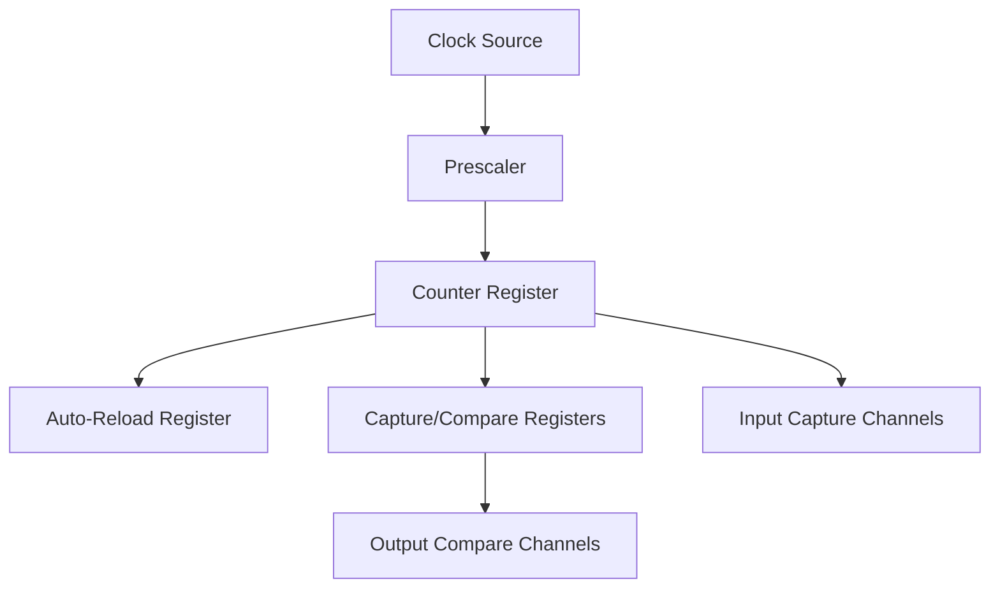
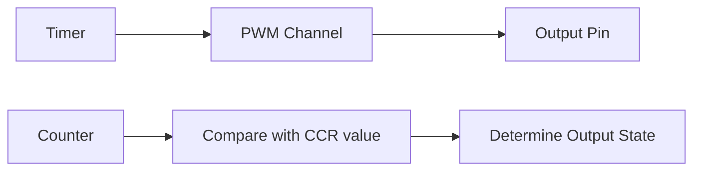

# STM32 Timer Applications

## Introduction

Timers are essential peripherals in microcontrollers that allow precise timing operations. In STM32 microcontrollers, timers are versatile and can be used for various applications beyond simple time measurement. This guide explores practical applications of STM32 timers, including PWM generation, input capture, and time-base operations.

Understanding timer applications is crucial for embedded systems development, as timing control is fundamental to tasks like motor control, sensor reading, and communication protocols. In this tutorial, we'll explore how to harness the power of STM32 timers for real-world applications.

## Timer Basics Review

Before diving into applications, let's briefly review what an STM32 timer consists of:



Key components:
- **Prescaler**: Divides the input clock
- **Counter**: Increments with each clock pulse
- **Auto-reload register**: Determines the counting period
- **Capture/compare registers**: Used for PWM, input capture, and output compare

## Application 1: Timer as a Time Base

One of the simplest applications is using a timer as a time base for periodic interrupts.

### Implementation Steps

1. **Configure the Timer**:

```c
void Timer_Init(void)
{
  /* Enable clock for TIM2 */
  RCC->APB1ENR |= RCC_APB1ENR_TIM2EN;
  
  /* Set prescaler to get 1 MHz timer clock */
  /* For 8 MHz system clock: 8MHz/8 = 1MHz */
  TIM2->PSC = 7;
  
  /* Set auto-reload value for 1000 Hz interrupts */
  /* 1MHz/1000 = 1000 counts per interrupt */
  TIM2->ARR = 999;
  
  /* Enable update interrupt */
  TIM2->DIER |= TIM_DIER_UIE;
  
  /* Start the timer */
  TIM2->CR1 |= TIM_CR1_CEN;
  
  /* Enable TIM2 interrupt in NVIC */
  NVIC_EnableIRQ(TIM2_IRQn);
}
```

2. **Implement the Interrupt Handler**:

```c
void TIM2_IRQHandler(void)
{
  /* Check if update interrupt flag is set */
  if (TIM2->SR & TIM_SR_UIF)
  {
    /* Clear the interrupt flag */
    TIM2->SR &= ~TIM_SR_UIF;
    
    /* Toggle LED connected to GPIOA pin 5 */
    GPIOA->ODR ^= GPIO_ODR_OD5;
  }
}
```

### Practical Example: Creating a 1-second Timer

```c
#include "stm32f4xx.h"

int main(void)
{
  /* Configure system clock */
  SystemClock_Config();
  
  /* Configure LED pin (PA5) */
  RCC->AHB1ENR |= RCC_AHB1ENR_GPIOAEN;
  GPIOA->MODER |= GPIO_MODER_MODER5_0;
  
  /* Configure TIM2 for 1Hz interrupts */
  RCC->APB1ENR |= RCC_APB1ENR_TIM2EN;
  
  /* For 84MHz APB1 Timer clock: 84MHz/8400 = 10kHz */
  TIM2->PSC = 8399;
  
  /* 10kHz/10000 = 1Hz (1 second) */
  TIM2->ARR = 9999;
  
  /* Enable update interrupt */
  TIM2->DIER |= TIM_DIER_UIE;
  
  /* Enable TIM2 interrupt in NVIC */
  NVIC_EnableIRQ(TIM2_IRQn);
  
  /* Start the timer */
  TIM2->CR1 |= TIM_CR1_CEN;
  
  while (1)
  {
    /* Main application code */
  }
}
```

This example creates a precise 1-second timer that toggles an LED, providing a visual indication of the timing operation.

## Application 2: PWM Generation

Pulse Width Modulation (PWM) is one of the most common timer applications, useful for controlling motors, LEDs, and other analog-like outputs.

### PWM Basics

PWM generates a square wave with variable duty cycle:



The PWM signal's duty cycle is determined by the ratio of the Compare Register (CCR) value to the Auto-Reload Register (ARR) value:

Duty Cycle = (CCR / ARR) × 100%

### Implementation Steps

1. **Configure GPIO for PWM Output**:

```c
void GPIO_PWM_Init(void)
{
  /* Enable clock for GPIOA */
  RCC->AHB1ENR |= RCC_AHB1ENR_GPIOAEN;
  
  /* Configure PA0 for alternate function (TIM2_CH1) */
  GPIOA->MODER &= ~GPIO_MODER_MODER0;
  GPIOA->MODER |= GPIO_MODER_MODER0_1;
  
  /* Set alternate function AF1 for PA0 (TIM2_CH1) */
  GPIOA->AFR[0] &= ~GPIO_AFRL_AFRL0;
  GPIOA->AFR[0] |= 1;
}
```

2. **Configure Timer for PWM**:

```c
void PWM_Init(void)
{
  /* Enable clock for TIM2 */
  RCC->APB1ENR |= RCC_APB1ENR_TIM2EN;
  
  /* Set prescaler to get 1 MHz timer clock */
  TIM2->PSC = 83; // For 84MHz APB1 timer clock: 84MHz/84 = 1MHz
  
  /* Set auto-reload value for 20kHz PWM frequency */
  /* 1MHz/20kHz = 50 counts per PWM period */
  TIM2->ARR = 49;
  
  /* Configure channel 1 for PWM mode 1 */
  TIM2->CCMR1 &= ~TIM_CCMR1_OC1M;
  TIM2->CCMR1 |= TIM_CCMR1_OC1M_1 | TIM_CCMR1_OC1M_2;
  
  /* Enable output compare preload */
  TIM2->CCMR1 |= TIM_CCMR1_OC1PE;
  
  /* Enable capture/compare channel 1 output */
  TIM2->CCER |= TIM_CCER_CC1E;
  
  /* Set initial duty cycle to 50% */
  TIM2->CCR1 = 25; // 50% of ARR value
  
  /* Enable auto-reload preload */
  TIM2->CR1 |= TIM_CR1_ARPE;
  
  /* Start the timer */
  TIM2->CR1 |= TIM_CR1_CEN;
}
```

### Practical Example: LED Brightness Control

```c
#include "stm32f4xx.h"

void delay_ms(uint32_t ms);

int main(void)
{
  /* Configure system clock */
  SystemClock_Config();
  
  /* Initialize GPIO for PWM */
  GPIO_PWM_Init();
  
  /* Initialize Timer for PWM */
  PWM_Init();
  
  uint16_t dutyCycle = 0;
  
  while (1)
  {
    /* Fade in */
    for (dutyCycle = 0; dutyCycle <= 49; dutyCycle++)
    {
      TIM2->CCR1 = dutyCycle;
      delay_ms(20);
    }
    
    /* Fade out */
    for (dutyCycle = 49; dutyCycle > 0; dutyCycle--)
    {
      TIM2->CCR1 = dutyCycle;
      delay_ms(20);
    }
  }
}
```

This example creates a "breathing" LED effect by gradually changing the PWM duty cycle.

## Application 3: Input Capture

Input capture is used to measure pulse width, frequency, or duty cycle of an external signal.

### Implementation Steps

1. **Configure GPIO for Input Capture**:

```c
void GPIO_InputCapture_Init(void)
{
  /* Enable clock for GPIOA */
  RCC->AHB1ENR |= RCC_AHB1ENR_GPIOAEN;
  
  /* Configure PA0 for alternate function (TIM2_CH1) */
  GPIOA->MODER &= ~GPIO_MODER_MODER0;
  GPIOA->MODER |= GPIO_MODER_MODER0_1;
  
  /* Set alternate function AF1 for PA0 (TIM2_CH1) */
  GPIOA->AFR[0] &= ~GPIO_AFRL_AFRL0;
  GPIOA->AFR[0] |= 1;
  
  /* Set to pull-down configuration */
  GPIOA->PUPDR &= ~GPIO_PUPDR_PUPDR0;
  GPIOA->PUPDR |= GPIO_PUPDR_PUPDR0_1;
}
```

2. **Configure Timer for Input Capture**:

```c
void InputCapture_Init(void)
{
  /* Enable clock for TIM2 */
  RCC->APB1ENR |= RCC_APB1ENR_TIM2EN;
  
  /* Set prescaler to get 1 MHz timer clock */
  TIM2->PSC = 83; // For 84MHz APB1 Timer clock: 84MHz/84 = 1MHz
  
  /* Set auto-reload to maximum value */
  TIM2->ARR = 0xFFFFFFFF;
  
  /* Configure channel 1 for input capture */
  /* Map TI1 to IC1 */
  TIM2->CCMR1 &= ~TIM_CCMR1_CC1S;
  TIM2->CCMR1 |= TIM_CCMR1_CC1S_0;
  
  /* Set filter to 0 */
  TIM2->CCMR1 &= ~TIM_CCMR1_IC1F;
  
  /* Configure for both rising and falling edges */
  TIM2->CCER |= TIM_CCER_CC1P | TIM_CCER_CC1NP;
  
  /* Enable capture on channel 1 */
  TIM2->CCER |= TIM_CCER_CC1E;
  
  /* Enable capture interrupt */
  TIM2->DIER |= TIM_DIER_CC1IE;
  
  /* Enable NVIC interrupt for TIM2 */
  NVIC_EnableIRQ(TIM2_IRQn);
  
  /* Start the timer */
  TIM2->CR1 |= TIM_CR1_CEN;
}
```

3. **Implement the Interrupt Handler for Signal Measurement**:

```c
volatile uint32_t risingEdge = 0;
volatile uint32_t fallingEdge = 0;
volatile uint32_t pulseWidth = 0;
volatile uint8_t edgeState = 0; // 0 = next edge is rising, 1 = next edge is falling

void TIM2_IRQHandler(void)
{
  /* Check if capture occurred on channel 1 */
  if (TIM2->SR & TIM_SR_CC1IF)
  {
    /* Clear the interrupt flag */
    TIM2->SR &= ~TIM_SR_CC1IF;
    
    if (edgeState == 0) // Rising edge
    {
      risingEdge = TIM2->CCR1;
      edgeState = 1;
      
      /* Configure for falling edge */
      TIM2->CCER &= ~TIM_CCER_CC1NP;
      TIM2->CCER |= TIM_CCER_CC1P;
    }
    else // Falling edge
    {
      fallingEdge = TIM2->CCR1;
      edgeState = 0;
      
      /* Calculate pulse width */
      if (fallingEdge > risingEdge)
      {
        pulseWidth = fallingEdge - risingEdge;
      }
      else
      {
        /* Handle timer overflow */
        pulseWidth = (0xFFFFFFFF - risingEdge) + fallingEdge + 1;
      }
      
      /* Configure for rising edge */
      TIM2->CCER &= ~(TIM_CCER_CC1P | TIM_CCER_CC1NP);
    }
  }
}
```

### Practical Example: Measuring Frequency of an External Signal

```c
#include "stm32f4xx.h"
#include <stdio.h>

volatile uint32_t risingEdge1 = 0;
volatile uint32_t risingEdge2 = 0;
volatile uint32_t signalFrequency = 0;
volatile uint8_t captureFlag = 0;

int main(void)
{
  /* Configure system clock */
  SystemClock_Config();
  
  /* Initialize UART for displaying results */
  UART_Init();
  
  /* Initialize GPIO for input capture */
  GPIO_InputCapture_Init();
  
  /* Configure TIM2 channel 1 to capture rising edges only */
  RCC->APB1ENR |= RCC_APB1ENR_TIM2EN;
  TIM2->PSC = 83; // 1MHz timer clock
  TIM2->ARR = 0xFFFFFFFF;
  
  /* Map TI1 to IC1 */
  TIM2->CCMR1 &= ~TIM_CCMR1_CC1S;
  TIM2->CCMR1 |= TIM_CCMR1_CC1S_0;
  
  /* Configure for rising edge only */
  TIM2->CCER &= ~(TIM_CCER_CC1P | TIM_CCER_CC1NP);
  
  /* Enable capture on channel 1 */
  TIM2->CCER |= TIM_CCER_CC1E;
  
  /* Enable capture interrupt */
  TIM2->DIER |= TIM_DIER_CC1IE;
  
  /* Enable NVIC interrupt for TIM2 */
  NVIC_EnableIRQ(TIM2_IRQn);
  
  /* Start the timer */
  TIM2->CR1 |= TIM_CR1_CEN;
  
  char buffer[50];
  
  while (1)
  {
    if (captureFlag)
    {
      captureFlag = 0;
      
      /* Calculate and display frequency */
      float freq = 1000000.0f / signalFrequency; // Convert to Hz (1MHz timer)
      sprintf(buffer, "Frequency: %.2f Hz\r
", freq);
      UART_SendString(buffer);
    }
  }
}

void TIM2_IRQHandler(void)
{
  /* Check if capture occurred on channel 1 */
  if (TIM2->SR & TIM_SR_CC1IF)
  {
    /* Clear the interrupt flag */
    TIM2->SR &= ~TIM_SR_CC1IF;
    
    if (risingEdge1 == 0)
    {
      risingEdge1 = TIM2->CCR1;
    }
    else
    {
      risingEdge2 = TIM2->CCR1;
      
      /* Calculate time between rising edges */
      if (risingEdge2 > risingEdge1)
      {
        signalFrequency = risingEdge2 - risingEdge1;
      }
      else
      {
        /* Handle timer overflow */
        signalFrequency = (0xFFFFFFFF - risingEdge1) + risingEdge2 + 1;
      }
      
      risingEdge1 = risingEdge2;
      captureFlag = 1;
    }
  }
}
```

This example measures the frequency of an input signal by calculating the time between consecutive rising edges.

## Application 4: One-Pulse Mode

One-pulse mode is useful for generating a precise single pulse with configurable delay and width.

### Implementation Steps

```c
void OnePulse_Init(uint32_t delay, uint32_t width)
{
  /* Enable clock for GPIOA and TIM2 */
  RCC->AHB1ENR |= RCC_AHB1ENR_GPIOAEN;
  RCC->APB1ENR |= RCC_APB1ENR_TIM2EN;
  
  /* Configure PA1 (TIM2_CH2) for alternate function */
  GPIOA->MODER &= ~GPIO_MODER_MODER1;
  GPIOA->MODER |= GPIO_MODER_MODER1_1;
  GPIOA->AFR[0] &= ~GPIO_AFRL_AFRL1;
  GPIOA->AFR[0] |= (1 << 4); // AF1
  
  /* Configure TIM2 for one-pulse mode */
  /* Set prescaler for 1 MHz timer clock */
  TIM2->PSC = 83;
  
  /* Set auto-reload value (delay + width) */
  TIM2->ARR = delay + width - 1;
  
  /* Set compare value for channel 2 (when to start the pulse) */
  TIM2->CCR2 = delay;
  
  /* Configure channel 2 as output compare */
  TIM2->CCMR1 &= ~TIM_CCMR1_OC2M;
  TIM2->CCMR1 |= TIM_CCMR1_OC2M_1 | TIM_CCMR1_OC2M_2; // PWM mode 1
  
  /* Set active high polarity and enable channel 2 */
  TIM2->CCER &= ~TIM_CCER_CC2P;
  TIM2->CCER |= TIM_CCER_CC2E;
  
  /* Configure for one-pulse mode */
  TIM2->CR1 |= TIM_CR1_OPM;
}

void GenerateSinglePulse(void)
{
  /* Start the timer to generate one pulse */
  TIM2->CR1 |= TIM_CR1_CEN;
}
```

### Practical Example: Ultrasonic Sensor Trigger Pulse

```c
#include "stm32f4xx.h"

int main(void)
{
  /* Configure system clock */
  SystemClock_Config();
  
  /* Initialize one-pulse mode for 10µs pulse with 50µs delay */
  OnePulse_Init(50, 10);
  
  while (1)
  {
    /* Generate trigger pulse every 100ms */
    GenerateSinglePulse();
    
    /* Simple delay */
    for (volatile int i = 0; i < 800000; i++);
  }
}
```

This example generates precise 10µs trigger pulses needed for ultrasonic distance sensors.

## Application 5: Timer Synchronization

STM32 timers can be synchronized to create complex timing scenarios.

### Implementation Example:

```c
void SyncTimers_Init(void)
{
  /* Enable clocks for TIM2 and TIM3 */
  RCC->APB1ENR |= RCC_APB1ENR_TIM2EN | RCC_APB1ENR_TIM3EN;
  
  /* Configure TIM2 as master */
  TIM2->PSC = 83;      // 1 MHz timer clock
  TIM2->ARR = 999;     // 1 kHz update rate
  
  /* Configure TIM2 as master that sends update event as trigger */
  TIM2->CR2 &= ~TIM_CR2_MMS;
  TIM2->CR2 |= TIM_CR2_MMS_1; // Update event is trigger output
  
  /* Configure TIM3 as slave */
  TIM3->PSC = 9;       // 100 kHz timer clock (when triggered)
  TIM3->ARR = 9999;    // Count to 10000
  
  /* Configure TIM3 to be triggered by TIM2 */
  TIM3->SMCR &= ~TIM_SMCR_TS;
  TIM3->SMCR |= TIM_SMCR_TS_0 | TIM_SMCR_TS_1; // ITR1 = TIM2
  
  /* Configure TIM3 in trigger mode (reset counter on trigger) */
  TIM3->SMCR &= ~TIM_SMCR_SMS;
  TIM3->SMCR |= TIM_SMCR_SMS_2; // Reset mode
  
  /* Enable update interrupt for TIM3 */
  TIM3->DIER |= TIM_DIER_UIE;
  
  /* Enable TIM3 interrupt in NVIC */
  NVIC_EnableIRQ(TIM3_IRQn);
  
  /* Start both timers */
  TIM2->CR1 |= TIM_CR1_CEN;
  TIM3->CR1 |= TIM_CR1_CEN;
}
```

## Real-World Application Examples

### Motor Control with PWM

Controlling a DC motor speed with PWM:

```c
#include "stm32f4xx.h"

void Motor_Init(void)
{
  /* Configure GPIO for PWM output */
  RCC->AHB1ENR |= RCC_AHB1ENR_GPIOAEN;
  
  /* Configure PA8 (TIM1_CH1) for PWM output */
  GPIOA->MODER &= ~GPIO_MODER_MODER8;
  GPIOA->MODER |= GPIO_MODER_MODER8_1;
  GPIOA->AFR[1] &= ~GPIO_AFRH_AFRH0;
  GPIOA->AFR[1] |= 1; // AF1
  
  /* Configure direction pin (PB0) */
  RCC->AHB1ENR |= RCC_AHB1ENR_GPIOBEN;
  GPIOB->MODER &= ~GPIO_MODER_MODER0;
  GPIOB->MODER |= GPIO_MODER_MODER0_0;
  
  /* Configure TIM1 for PWM */
  RCC->APB2ENR |= RCC_APB2ENR_TIM1EN;
  
  /* Set prescaler for 1 MHz timer clock */
  TIM1->PSC = 167; // 168MHz/168 = 1MHz
  
  /* Set auto-reload for 20 kHz PWM frequency */
  TIM1->ARR = 49; // 1MHz/50 = 20kHz
  
  /* Configure channel 1 for PWM mode 1 */
  TIM1->CCMR1 &= ~TIM_CCMR1_OC1M;
  TIM1->CCMR1 |= TIM_CCMR1_OC1M_1 | TIM_CCMR1_OC1M_2;
  TIM1->CCMR1 |= TIM_CCMR1_OC1PE;
  
  /* Enable output for channel 1 */
  TIM1->CCER |= TIM_CCER_CC1E;
  
  /* Enable main output */
  TIM1->BDTR |= TIM_BDTR_MOE;
  
  /* Set initial duty cycle to 0% */
  TIM1->CCR1 = 0;
  
  /* Start timer */
  TIM1->CR1 |= TIM_CR1_CEN;
}

void Motor_SetSpeed(uint8_t speed)
{
  /* speed should be 0-100 percent */
  if (speed > 100) speed = 100;
  
  /* Convert percentage to timer value */
  uint32_t pwmValue = (TIM1->ARR * speed) / 100;
  
  /* Update CCR register */
  TIM1->CCR1 = pwmValue;
}

void Motor_SetDirection(uint8_t forward)
{
  if (forward)
    GPIOB->BSRR = GPIO_BSRR_BS0;
  else
    GPIOB->BSRR = GPIO_BSRR_BR0;
}
```

### Servo Motor Control

```c
void Servo_Init(void)
{
  /* Configure GPIO for PWM output */
  RCC->AHB1ENR |= RCC_AHB1ENR_GPIOAEN;
  GPIOA->MODER &= ~GPIO_MODER_MODER8;
  GPIOA->MODER |= GPIO_MODER_MODER8_1;
  GPIOA->AFR[1] &= ~GPIO_AFRH_AFRH0;
  GPIOA->AFR[1] |= 1; // AF1
  
  /* Configure TIM1 for PWM */
  RCC->APB2ENR |= RCC_APB2ENR_TIM1EN;
  
  /* 50Hz PWM frequency (20ms period) for servo control */
  /* For 168MHz APB2 Timer clock: 168MHz/84 = 2MHz */
  TIM1->PSC = 83;
  
  /* 2MHz/50Hz = 40,000 counts per PWM period */
  TIM1->ARR = 39999;
  
  /* Configure channel 1 for PWM mode 1 */
  TIM1->CCMR1 &= ~TIM_CCMR1_OC1M;
  TIM1->CCMR1 |= TIM_CCMR1_OC1M_1 | TIM_CCMR1_OC1M_2;
  TIM1->CCMR1 |= TIM_CCMR1_OC1PE;
  
  /* Enable output for channel 1 */
  TIM1->CCER |= TIM_CCER_CC1E;
  
  /* Enable main output */
  TIM1->BDTR |= TIM_BDTR_MOE;
  
  /* Set initial position (neutral) */
  TIM1->CCR1 = 3000; // 1.5ms pulse (neutral position)
  
  /* Start timer */
  TIM1->CR1 |= TIM_CR1_CEN;
}

void Servo_SetPosition(uint8_t angle)
{
  /* Limit angle to 0-180 degrees */
  if (angle > 180) angle = 180;
  
  /* Convert angle to pulse width 
   * 0 degrees = 1ms pulse (2000 counts)
   * 90 degrees = 1.5ms pulse (3000 counts)
   * 180 degrees = 2ms pulse (4000 counts)
   */
  uint32_t pulseWidth = 2000 + (angle * 2000) / 180;
  
  /* Update CCR register */
  TIM1->CCR1 = pulseWidth;
}
```

### RPM Measurement with Input Capture

```c
volatile uint32_t pulseCount = 0;
volatile uint32_t lastCapture = 0;
volatile uint32_t rpm = 0;
volatile uint8_t updateFlag = 0;

void RPM_Init(void)
{
  /* Configure GPIO for input capture */
  RCC->AHB1ENR |= RCC_AHB1ENR_GPIOAEN;
  GPIOA->MODER &= ~GPIO_MODER_MODER0;
  GPIOA->MODER |= GPIO_MODER_MODER0_1;
  GPIOA->AFR[0] &= ~GPIO_AFRL_AFRL0;
  GPIOA->AFR[0] |= 1; // AF1
  
  /* Configure TIM2 for input capture */
  RCC->APB1ENR |= RCC_APB1ENR_TIM2EN;
  
  /* 1 MHz timer clock */
  TIM2->PSC = 83;
  TIM2->ARR = 0xFFFFFFFF;
  
  /* Configure channel 1 for input capture */
  TIM2->CCMR1 &= ~TIM_CCMR1_CC1S;
  TIM2->CCMR1 |= TIM_CCMR1_CC1S_0;
  
  /* Configure for rising edge only */
  TIM2->CCER &= ~(TIM_CCER_CC1P | TIM_CCER_CC1NP);
  
  /* Enable capture */
  TIM2->CCER |= TIM_CCER_CC1E;
  
  /* Enable interrupt */
  TIM2->DIER |= TIM_DIER_CC1IE;
  
  /* Enable NVIC interrupt */
  NVIC_EnableIRQ(TIM2_IRQn);
  
  /* Start timer */
  TIM2->CR1 |= TIM_CR1_CEN;
  
  /* Configure TIM3 for periodic updates */
  RCC->APB1ENR |= RCC_APB1ENR_TIM3EN;
  TIM3->PSC = 8399;   // 10 kHz
  TIM3->ARR = 9999;   // 1 Hz update rate
  TIM3->DIER |= TIM_DIER_UIE;
  NVIC_EnableIRQ(TIM3_IRQn);
  TIM3->CR1 |= TIM_CR1_CEN;
}

void TIM2_IRQHandler(void)
{
  if (TIM2->SR & TIM_SR_CC1IF)
  {
    TIM2->SR &= ~TIM_SR_CC1IF;
    pulseCount++;
  }
}

void TIM3_IRQHandler(void)
{
  if (TIM3->SR & TIM_SR_UIF)
  {
    TIM3->SR &= ~TIM_SR_UIF;
    
    /* Calculate RPM based on pulses per second and 
       pulses per revolution (assuming 2 pulses per rev) */
    rpm = (pulseCount * 60) / 2;