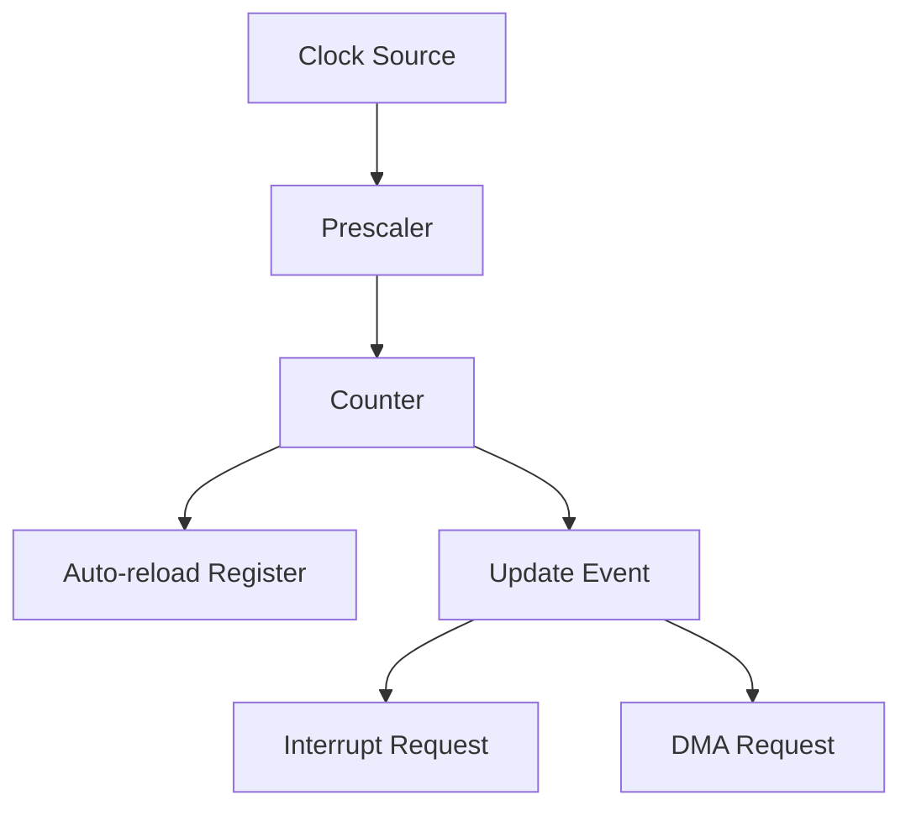

# STM32 Basic Timers

## Introduction

Basic timers are fundamental components in STM32 microcontrollers that allow you to measure time intervals, generate periodic events, and trigger actions at specific time points. Unlike more complex timer modules, basic timers are streamlined for simple timing operations, making them perfect entry points for beginners learning about timer peripherals.

In this tutorial, we'll explore the architecture, configuration, and practical applications of STM32 basic timers. By the end, you'll understand how to implement timing operations in your embedded projects using these versatile peripherals.

## Understanding Basic Timers in STM32

### What are Basic Timers?

Basic timers in STM32 microcontrollers are the simplest timer modules available. They're primarily designed for time-base generation and can trigger interrupts or events based on time intervals.

In the STM32 family, timers TIM6 and TIM7 are classified as basic timers. They feature:

- 16-bit counter
- 16-bit prescaler
- Auto-reload register
- Update event generation
- Interrupt generation capability
- DMA request generation



### Basic Timer Block Diagram

Let's understand the components of a basic timer:

1. **Counter Register (CNT)**: A 16-bit register that increments or decrements with each clock cycle (after prescaling).
2. **Prescaler Register (PSC)**: Divides the input clock to determine the counter's counting frequency.
3. **Auto-Reload Register (ARR)**: Defines the maximum value for the counter before it resets (in up-counting mode).
4. **Update Event**: Generated when the counter overflows/underflows, triggering interrupts or DMA requests.

## Configuring Basic Timers

### Initialization Process

To use a basic timer in your STM32 project, follow these steps:

1. Enable the timer clock in RCC (Reset and Clock Control)
2. Configure the prescaler value
3. Set the auto-reload value
4. Configure the timer's update event (UEV) generation
5. Enable interrupts if needed
6. Enable the timer

Let's implement this step by step:

```c
// Enable TIM6 clock
RCC->APB1ENR |= RCC_APB1ENR_TIM6EN;

// Configure TIM6
TIM6->PSC = 7999;        // Prescaler value
TIM6->ARR = 9999;        // Auto-reload value
TIM6->CR1 |= TIM_CR1_CEN; // Enable counter
```

### Calculating Time Intervals

The time interval can be calculated using the formula:

Time (seconds) = ((PSC + 1) × (ARR + 1)) / Timer_Clock_Frequency

For example, with a timer clock of 8MHz, PSC = 7999, and ARR = 9999:

Time = ((7999 + 1) × (9999 + 1)) / 8,000,000 = 10 seconds

## Practical Examples

### Example 1: Simple Timer Delay

This example demonstrates how to create a simple delay function using TIM6:

```c
void timer_delay_ms(uint16_t ms) {
    // Enable TIM6 clock
    RCC->APB1ENR |= RCC_APB1ENR_TIM6EN;
    
    // Calculate prescaler and ARR for 1ms timing
    // Assuming 8MHz clock
    TIM6->PSC = 7;        // 8MHz/8 = 1MHz
    TIM6->ARR = 999;      // 1MHz/1000 = 1KHz (1ms period)
    
    // Reset counter
    TIM6->CNT = 0;
    
    // Enable counter
    TIM6->CR1 |= TIM_CR1_CEN;
    
    for(uint16_t i = 0; i < ms; i++) {
        // Wait for update event
        while(!(TIM6->SR & TIM_SR_UIF));
        
        // Clear update event flag
        TIM6->SR &= ~TIM_SR_UIF;
    }
    
    // Disable counter
    TIM6->CR1 &= ~TIM_CR1_CEN;
}
```

### Example 2: Periodic Interrupt Generation

This example shows how to generate periodic interrupts using TIM6:

```c
void TIM6_init(void) {
    // Enable TIM6 clock
    RCC->APB1ENR |= RCC_APB1ENR_TIM6EN;
    
    // Configure TIM6 for 1Hz interrupt (1 second period)
    // Assuming 8MHz clock
    TIM6->PSC = 7999;     // 8MHz/8000 = 1kHz
    TIM6->ARR = 999;      // 1kHz/1000 = 1Hz
    
    // Enable update interrupt
    TIM6->DIER |= TIM_DIER_UIE;
    
    // Enable TIM6 interrupt in NVIC
    NVIC_EnableIRQ(TIM6_DAC_IRQn);
    
    // Enable counter
    TIM6->CR1 |= TIM_CR1_CEN;
}

// Interrupt handler
void TIM6_DAC_IRQHandler(void) {
    if(TIM6->SR & TIM_SR_UIF) {
        // Clear update flag
        TIM6->SR &= ~TIM_SR_UIF;
        
        // Toggle an LED or perform periodic task
        GPIOA->ODR ^= GPIO_ODR_OD5; // Toggle LED on PA5
    }
}
```

### Example 3: Using Basic Timer for DAC Trigger

Basic timers are often used to trigger DAC (Digital-to-Analog Converter) updates for waveform generation:

```c
void TIM6_DAC_init(void) {
    // Enable TIM6 and DAC clocks
    RCC->APB1ENR |= RCC_APB1ENR_TIM6EN | RCC_APB1ENR_DACEN;
    
    // Configure TIM6 for 1kHz update rate
    TIM6->PSC = 7;        // 8MHz/8 = 1MHz
    TIM6->ARR = 999;      // 1MHz/1000 = 1kHz
    
    // Configure TIM6 to trigger DAC
    TIM6->CR2 |= TIM_CR2_MMS_1;  // TRGO on Update Event
    
    // Configure DAC to be triggered by TIM6
    DAC->CR |= DAC_CR_TEN1;      // DAC channel 1 trigger enable
    DAC->CR |= DAC_CR_TSEL1_2;   // Select TIM6 as trigger
    
    // Enable DAC channel 1
    DAC->CR |= DAC_CR_EN1;
    
    // Enable TIM6
    TIM6->CR1 |= TIM_CR1_CEN;
}
```

## Common Applications of Basic Timers

Basic timers are frequently used in embedded systems for:

1. **Timebase generation** - Providing a periodic tick for system timing
2. **LED blinking** - Simple visual indicators at regular intervals
3. **Timeout detection** - Ensuring operations complete within set time limits
4. **Debouncing** - Filtering out mechanical contact noise in buttons/switches
5. **DAC triggering** - Generating waveforms at precise frequencies
6. **Simple scheduling** - Executing tasks at regular intervals

## STM32 HAL Library Approach

While direct register manipulation gives you full control, the STM32 HAL (Hardware Abstraction Layer) library provides a simpler interface for timer configuration:

```c
// Initialize TIM6 with HAL
TIM_HandleTypeDef htim6;

void HAL_TIM6_init(void) {
    htim6.Instance = TIM6;
    htim6.Init.Prescaler = 7999;
    htim6.Init.Period = 9999;
    htim6.Init.ClockDivision = TIM_CLOCKDIVISION_DIV1;
    htim6.Init.CounterMode = TIM_COUNTERMODE_UP;
    htim6.Init.AutoReloadPreload = TIM_AUTORELOAD_PRELOAD_DISABLE;
    
    HAL_TIM_Base_Init(&htim6);
    HAL_TIM_Base_Start_IT(&htim6);
}

// Interrupt callback
void HAL_TIM_PeriodElapsedCallback(TIM_HandleTypeDef *htim) {
    if(htim->Instance == TIM6) {
        // Toggle LED or perform periodic task
        HAL_GPIO_TogglePin(GPIOA, GPIO_PIN_5);
    }
}
```

## Debugging Timer Behavior

When working with timers, debugging can be challenging since timing-related issues aren't always visible. Here are some tips:

1. Use an LED to visually confirm timer operation
2. Monitor the timer registers in debug mode
3. Use logic analyzers or oscilloscopes for precise timing measurements
4. Print debug information via UART when interrupts occur

## Limitations of Basic Timers

While basic timers are straightforward to use, they have limitations compared to more advanced timer modules:

- No input capture capability
- No output compare channels
- No PWM generation
- No external triggering
- Limited to up-counting mode only

For more complex timing operations, you'll need to use general-purpose timers (TIM2-TIM5) or advanced timers (TIM1, TIM8).

## Summary

STM32 basic timers provide a straightforward way to implement timing operations in your embedded projects. They excel at generating periodic events and serving as timebase generators. While their functionality is limited compared to other timer modules, they're perfect for many common applications and serve as an excellent starting point for learning about timer peripherals.

In this tutorial, we covered:
- The architecture and components of basic timers
- How to configure and use basic timers
- Practical examples for delay generation, interrupts, and DAC triggering
- Common applications and limitations

## Exercises

1. Create a program that blinks an LED at different rates based on a button press
2. Implement a simple stopwatch using a basic timer and display the elapsed time on an LCD
3. Generate a sawtooth waveform using the DAC triggered by a basic timer
4. Create a timeout detection system that flags an error if a sensor doesn't respond within a specific time

## Additional Resources

- STM32 Reference Manual - Timer chapters
- STM32CubeIDE examples for timer configuration
- STM32 HAL documentation for timer functions