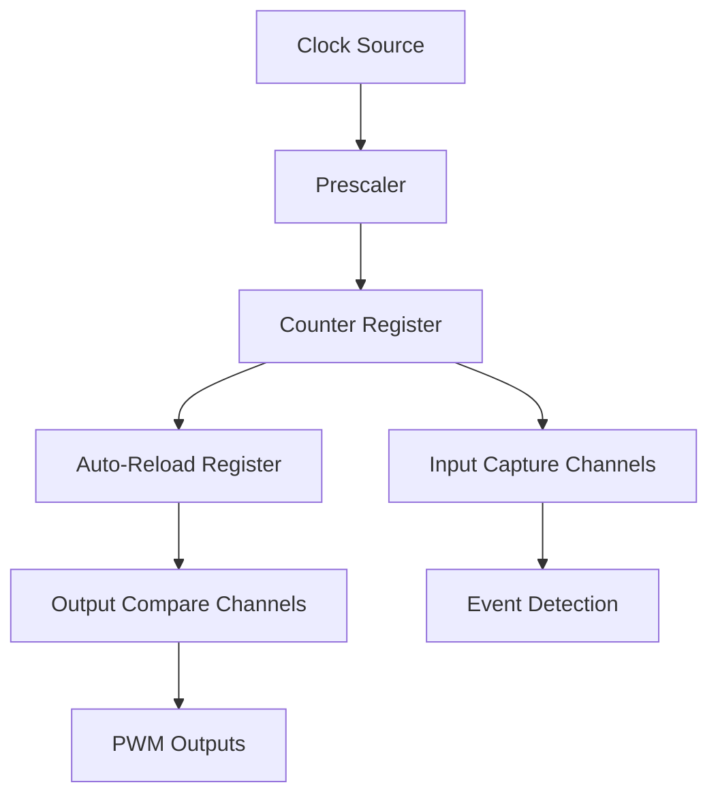

# STM32 General Purpose Timers

## Introduction

General Purpose Timers (GPTs) are among the most versatile peripherals in STM32 microcontrollers. They provide precise timing for a wide range of applications, from simple delays to complex PWM generation. This guide will introduce you to the fundamentals of STM32 GPTs, their architecture, configuration, and practical applications.

Unlike the basic timers, which are primarily designed for time-base generation, general-purpose timers offer additional functionality including:

- Input capture for measuring external signals
- Output compare for generating waveforms 
- PWM (Pulse Width Modulation) generation
- One-pulse mode operation
- Encoder interface mode for rotary encoders

Whether you're building motor control systems, digital signal processing applications, or just need accurate timing for your project, understanding general purpose timers is essential for effective STM32 programming.

## Timer Basics

### Timer Architecture

At the core of every general purpose timer is a counter that increments or decrements at a configurable rate. The architecture typically includes:



Let's examine each component:

1. **Clock Source**: The timer clock is derived from the system clock (typically APB1 or APB2).
2. **Prescaler**: Divides the input clock to produce the desired counter clock frequency.
3. **Counter Register**: Stores the current count value (TIMx_CNT).
4. **Auto-Reload Register**: Contains the maximum count value (TIMx_ARR).
5. **Input/Output Channels**: Used for capture/compare operations.

### Available General Purpose Timers

STM32 microcontrollers typically include several general purpose timers with different capabilities:

| Timer Type | Examples | Features |
|------------|----------|----------|
| Basic GPT | TIM6, TIM7 | Time base generation, DAC triggering |
| General Purpose | TIM2, TIM3, TIM4, TIM5 | Input capture, output compare, PWM, one-pulse mode |
| Advanced | TIM1, TIM8 | All GPT features plus complementary outputs, dead-time insertion |

The exact timers available depend on your specific STM32 model.

## Timer Configuration

### Basic Timer Setup

Here's a step-by-step guide to configuring a general purpose timer:

1. **Enable the timer clock** (in RCC register)
2. **Set the prescaler** (TIMx_PSC)
3. **Set the auto-reload value** (TIMx_ARR)
4. **Configure the counter mode** (up, down, or center-aligned)
5. **Enable the timer** (CEN bit in TIMx_CR1)

Here's a basic example using the STM32 HAL library to configure TIM2 for a 1-second period:

```c
// Initialize TIM2
void Timer_Init(void)
{
  // 1. Enable TIM2 clock
  RCC->APB1ENR |= RCC_APB1ENR_TIM2EN;
  
  // 2. Set prescaler - assuming system clock is 72 MHz
  // We want the timer clock to be 10 kHz (72 MHz / 7200 = 10 kHz)
  TIM2->PSC = 7199; // Prescaler value (note: actual divisor is PSC + 1)
  
  // 3. Set auto-reload value - for 1 second period
  // 10 kHz / 10000 = 1 Hz (1 second)
  TIM2->ARR = 9999;
  
  // 4. Configure counter mode (default is up-counting)
  // Up-counting is already the default, so we don't need to set it
  
  // 5. Enable the timer
  TIM2->CR1 |= TIM_CR1_CEN;
  
  // Enable update interrupt if needed
  TIM2->DIER |= TIM_DIER_UIE;
  
  // Enable TIM2 interrupt in NVIC
  NVIC_EnableIRQ(TIM2_IRQn);
}
```

### Calculating Timer Values

To calculate the timer period:

$$Timer\ Period = \frac{(Prescaler + 1) \times (ARR + 1)}{Timer\ Clock\ Frequency}$$

To calculate the timer frequency:

$$Timer\ Frequency = \frac{Timer\ Clock\ Frequency}{(Prescaler + 1) \times (ARR + 1)}$$

## Timer Modes

### Basic Time Base

The simplest use of a general purpose timer is as a time base for generating periodic events:

```c
// Timer 2 interrupt handler
void TIM2_IRQHandler(void)
{
  if (TIM2->SR & TIM_SR_UIF)  // If update interrupt flag is set
  {
    TIM2->SR &= ~TIM_SR_UIF;  // Clear the update interrupt flag
    
    // Toggle LED
    GPIOC->ODR ^= GPIO_ODR_ODR13;
  }
}
```

### Input Capture Mode

Input capture mode allows you to measure the duration of external signals:

```c
// Configure TIM2 Channel 1 for input capture
void InputCapture_Init(void)
{
  // Enable GPIOA clock
  RCC->APB2ENR |= RCC_APB2ENR_IOPAEN;
  
  // Configure PA0 (TIM2_CH1) as input floating
  GPIOA->CRL &= ~(GPIO_CRL_MODE0 | GPIO_CRL_CNF0_0);
  GPIOA->CRL |= GPIO_CRL_CNF0_1;
  
  // Enable TIM2 clock
  RCC->APB1ENR |= RCC_APB1ENR_TIM2EN;
  
  // Set prescaler for 1 μs resolution (assuming 72 MHz clock)
  TIM2->PSC = 71;
  
  // Set max auto-reload value
  TIM2->ARR = 0xFFFF;
  
  // Configure capture channel 1
  // CC1S[1:0] = 01 -> CC1 channel is configured as input, IC1 is mapped on TI1
  TIM2->CCMR1 |= TIM_CCMR1_CC1S_0;
  TIM2->CCMR1 &= ~TIM_CCMR1_CC1S_1;
  
  // Configure for rising edge detection on channel 1
  TIM2->CCER &= ~TIM_CCER_CC1P;
  
  // Enable capture on channel 1
  TIM2->CCER |= TIM_CCER_CC1E;
  
  // Enable the capture interrupt
  TIM2->DIER |= TIM_DIER_CC1IE;
  
  // Enable TIM2 interrupt in NVIC
  NVIC_EnableIRQ(TIM2_IRQn);
  
  // Enable timer
  TIM2->CR1 |= TIM_CR1_CEN;
}

// Variables for pulse width measurement
volatile uint32_t risingEdge = 0;
volatile uint32_t fallingEdge = 0;
volatile uint32_t pulseWidth = 0;
volatile uint8_t captureState = 0;

void TIM2_IRQHandler(void)
{
  if (TIM2->SR & TIM_SR_CC1IF)  // Capture occurred
  {
    TIM2->SR &= ~TIM_SR_CC1IF;  // Clear the interrupt flag
    
    if (captureState == 0)  // Rising edge
    {
      risingEdge = TIM2->CCR1;
      captureState = 1;
      
      // Change to falling edge detection
      TIM2->CCER |= TIM_CCER_CC1P;
    }
    else  // Falling edge
    {
      fallingEdge = TIM2->CCR1;
      
      // Calculate pulse width (handle timer overflow)
      if (fallingEdge > risingEdge)
        pulseWidth = fallingEdge - risingEdge;
      else
        pulseWidth = (0xFFFF - risingEdge) + fallingEdge + 1;
      
      captureState = 0;
      
      // Change back to rising edge detection
      TIM2->CCER &= ~TIM_CCER_CC1P;
    }
  }
}
```

### Output Compare Mode

Output compare mode allows you to generate precise timing events:

```c
// Configure TIM3 Channel 1 for output compare
void OutputCompare_Init(void)
{
  // Enable GPIOA clock
  RCC->APB2ENR |= RCC_APB2ENR_IOPAEN;
  
  // Configure PA6 (TIM3_CH1) as output push-pull
  GPIOA->CRL &= ~(GPIO_CRL_CNF6);
  GPIOA->CRL |= GPIO_CRL_MODE6;
  
  // Enable TIM3 clock
  RCC->APB1ENR |= RCC_APB1ENR_TIM3EN;
  
  // Set prescaler (assuming 72 MHz clock)
  TIM3->PSC = 7199;  // 72 MHz / 7200 = 10 kHz
  
  // Set auto-reload value for 1 second period
  TIM3->ARR = 9999;  // 10 kHz / 10000 = 1 Hz
  
  // Configure output compare mode (toggle on match)
  TIM3->CCMR1 &= ~TIM_CCMR1_OC1M;
  TIM3->CCMR1 |= TIM_CCMR1_OC1M_0 | TIM_CCMR1_OC1M_1;  // OC1M = 011 for toggle mode
  
  // Enable output compare preload
  TIM3->CCMR1 |= TIM_CCMR1_OC1PE;
  
  // Set compare value (50% of ARR for 50% duty cycle)
  TIM3->CCR1 = 4999;
  
  // Enable output
  TIM3->CCER |= TIM_CCER_CC1E;
  
  // Enable timer
  TIM3->CR1 |= TIM_CR1_CEN;
}
```

### PWM Mode

PWM (Pulse Width Modulation) is one of the most common uses for general purpose timers:

```c
// Configure TIM4 Channel 1 for PWM generation
void PWM_Init(void)
{
  // Enable GPIOB clock
  RCC->APB2ENR |= RCC_APB2ENR_IOPBEN;
  
  // Configure PB6 (TIM4_CH1) as alternate function push-pull
  GPIOB->CRL &= ~(GPIO_CRL_CNF6_0);
  GPIOB->CRL |= GPIO_CRL_CNF6_1 | GPIO_CRL_MODE6;
  
  // Enable TIM4 clock
  RCC->APB1ENR |= RCC_APB1ENR_TIM4EN;
  
  // Set prescaler (assuming 72 MHz clock)
  TIM4->PSC = 71;  // 72 MHz / 72 = 1 MHz
  
  // Set auto-reload value for 20 ms period (50 Hz)
  TIM4->ARR = 19999;  // 1 MHz / 20000 = 50 Hz
  
  // Configure PWM mode 1 (high when CNT < CCR1)
  TIM4->CCMR1 &= ~TIM_CCMR1_OC1M;
  TIM4->CCMR1 |= TIM_CCMR1_OC1M_1 | TIM_CCMR1_OC1M_2;  // OC1M = 110 for PWM mode 1
  
  // Enable output compare preload
  TIM4->CCMR1 |= TIM_CCMR1_OC1PE;
  
  // Set compare value (1.5 ms pulse for servo center position)
  TIM4->CCR1 = 1500;  // 1.5 ms = 1500 counts at 1 MHz
  
  // Enable output
  TIM4->CCER |= TIM_CCER_CC1E;
  
  // Enable auto-reload preload
  TIM4->CR1 |= TIM_CR1_ARPE;
  
  // Enable timer
  TIM4->CR1 |= TIM_CR1_CEN;
}

// Function to set servo position (0-180 degrees)
void SetServoPosition(uint8_t angle)
{
  // Convert angle to pulse width (1 ms to 2 ms)
  // 0 degrees = 1 ms = 1000 counts
  // 180 degrees = 2 ms = 2000 counts
  uint16_t pulseWidth = 1000 + (angle * 1000 / 180);
  
  // Set compare value
  TIM4->CCR1 = pulseWidth;
}
```

## Practical Applications

### LED Dimming with PWM

A common application for PWM is controlling LED brightness:

```c
// Configure TIM3 Channel 2 for LED PWM
void LED_PWM_Init(void)
{
  // Enable GPIOB clock
  RCC->APB2ENR |= RCC_APB2ENR_IOPBEN;
  
  // Configure PB5 (TIM3_CH2) as alternate function push-pull
  GPIOB->CRL &= ~(GPIO_CRL_CNF5_0);
  GPIOB->CRL |= GPIO_CRL_CNF5_1 | GPIO_CRL_MODE5;
  
  // Enable TIM3 clock
  RCC->APB1ENR |= RCC_APB1ENR_TIM3EN;
  
  // Set prescaler (assuming 72 MHz clock)
  TIM3->PSC = 71;  // 72 MHz / 72 = 1 MHz
  
  // Set auto-reload value for PWM frequency (1 kHz)
  TIM3->ARR = 999;  // 1 MHz / 1000 = 1 kHz
  
  // Configure PWM mode 1
  TIM3->CCMR1 &= ~TIM_CCMR1_OC2M;
  TIM3->CCMR1 |= TIM_CCMR1_OC2M_1 | TIM_CCMR1_OC2M_2;  // OC2M = 110 for PWM mode 1
  
  // Enable output compare preload
  TIM3->CCMR1 |= TIM_CCMR1_OC2PE;
  
  // Set compare value (initial duty cycle - 0%)
  TIM3->CCR2 = 0;
  
  // Enable output
  TIM3->CCER |= TIM_CCER_CC2E;
  
  // Enable auto-reload preload
  TIM3->CR1 |= TIM_CR1_ARPE;
  
  // Enable timer
  TIM3->CR1 |= TIM_CR1_CEN;
}

// Function to set LED brightness (0-100%)
void SetLEDBrightness(uint8_t brightness)
{
  if (brightness > 100)
    brightness = 100;
    
  // Convert percentage to PWM duty cycle
  uint16_t dutyCycle = (brightness * (TIM3->ARR + 1)) / 100;
  
  // Set compare value
  TIM3->CCR2 = dutyCycle;
}
```

### Frequency Measurement

Using input capture to measure frequency of an external signal:

```c
// Variables for frequency measurement
volatile uint32_t captureValue1 = 0;
volatile uint32_t captureValue2 = 0;
volatile uint32_t frequency = 0;
volatile uint8_t captureComplete = 0;

// Configure TIM2 Channel 1 for frequency measurement
void FrequencyMeasurement_Init(void)
{
  // Enable GPIOA clock
  RCC->APB2ENR |= RCC_APB2ENR_IOPAEN;
  
  // Configure PA0 (TIM2_CH1) as input floating
  GPIOA->CRL &= ~(GPIO_CRL_MODE0 | GPIO_CRL_CNF0_0);
  GPIOA->CRL |= GPIO_CRL_CNF0_1;
  
  // Enable TIM2 clock
  RCC->APB1ENR |= RCC_APB1ENR_TIM2EN;
  
  // Set prescaler for 1 μs resolution (assuming 72 MHz clock)
  TIM2->PSC = 71;
  
  // Set max auto-reload value
  TIM2->ARR = 0xFFFF;
  
  // Configure capture channel 1
  TIM2->CCMR1 |= TIM_CCMR1_CC1S_0;  // CC1 channel is configured as input, IC1 is mapped on TI1
  TIM2->CCMR1 &= ~TIM_CCMR1_CC1S_1;
  
  // Configure for rising edge detection
  TIM2->CCER &= ~TIM_CCER_CC1P;
  
  // Enable capture on channel 1
  TIM2->CCER |= TIM_CCER_CC1E;
  
  // Enable the capture interrupt
  TIM2->DIER |= TIM_DIER_CC1IE;
  
  // Enable TIM2 interrupt in NVIC
  NVIC_EnableIRQ(TIM2_IRQn);
  
  // Enable timer
  TIM2->CR1 |= TIM_CR1_CEN;
}

void TIM2_IRQHandler(void)
{
  if (TIM2->SR & TIM_SR_CC1IF)  // Capture occurred
  {
    TIM2->SR &= ~TIM_SR_CC1IF;  // Clear the interrupt flag
    
    if (captureComplete == 0)
    {
      captureValue1 = TIM2->CCR1;
      captureComplete = 1;
    }
    else
    {
      captureValue2 = TIM2->CCR1;
      
      // Calculate period (handle timer overflow)
      uint32_t period;
      if (captureValue2 > captureValue1)
        period = captureValue2 - captureValue1;
      else
        period = (0xFFFF - captureValue1) + captureValue2 + 1;
      
      // Calculate frequency (in Hz) - period is in μs
      frequency = 1000000 / period;
      
      captureComplete = 0;
    }
  }
}
```

### Motor Control

Using PWM to control a DC motor with variable speed:

```c
// Configure TIM4 Channel 2 for motor PWM
void Motor_PWM_Init(void)
{
  // Enable GPIOB clock
  RCC->APB2ENR |= RCC_APB2ENR_IOPBEN;
  
  // Configure PB7 (TIM4_CH2) as alternate function push-pull
  GPIOB->CRL &= ~(GPIO_CRL_CNF7_0);
  GPIOB->CRL |= GPIO_CRL_CNF7_1 | GPIO_CRL_MODE7;
  
  // Enable TIM4 clock
  RCC->APB1ENR |= RCC_APB1ENR_TIM4EN;
  
  // Set prescaler (assuming 72 MHz clock)
  TIM4->PSC = 71;  // 72 MHz / 72 = 1 MHz
  
  // Set auto-reload value for PWM frequency (20 kHz)
  TIM4->ARR = 49;  // 1 MHz / 50 = 20 kHz
  
  // Configure PWM mode 1
  TIM4->CCMR1 &= ~TIM_CCMR1_OC2M;
  TIM4->CCMR1 |= TIM_CCMR1_OC2M_1 | TIM_CCMR1_OC2M_2;  // OC2M = 110 for PWM mode 1
  
  // Enable output compare preload
  TIM4->CCMR1 |= TIM_CCMR1_OC2PE;
  
  // Set compare value (initial duty cycle - 0%)
  TIM4->CCR2 = 0;
  
  // Enable output
  TIM4->CCER |= TIM_CCER_CC2E;
  
  // Enable auto-reload preload
  TIM4->CR1 |= TIM_CR1_ARPE;
  
  // Enable timer
  TIM4->CR1 |= TIM_CR1_CEN;
}

// Function to set motor speed (0-100%)
void SetMotorSpeed(uint8_t speed)
{
  if (speed > 100)
    speed = 100;
    
  // Convert percentage to PWM duty cycle
  uint16_t dutyCycle = (speed * (TIM4->ARR + 1)) / 100;
  
  // Set compare value
  TIM4->CCR2 = dutyCycle;
}
```

## Common Issues and Troubleshooting

### Timer Overflow

In applications requiring precise timing over long periods, timer overflow must be handled:

```c
// 32-bit timer counter extension using interrupts
volatile uint32_t timerOverflows = 0;

void TIM2_IRQHandler(void)
{
  if (TIM2->SR & TIM_SR_UIF)  // Update interrupt (overflow)
  {
    TIM2->SR &= ~TIM_SR_UIF;  // Clear the interrupt flag
    timerOverflows++;
  }
}

// Get extended timer value in milliseconds (assuming 1 kHz timer)
uint32_t GetExtendedTimerMs(void)
{
  uint32_t current = TIM2->CNT;
  uint32_t overflows = timerOverflows;
  
  // Check if an overflow is pending but not yet processed
  if (TIM2->SR & TIM_SR_UIF)
  {
    current = TIM2->CNT;  // Re-read after overflow
    overflows++;
  }
  
  // With 16-bit timer, each overflow is 65536 counts
  return (overflows * 65536 + current) / 1;  // Convert to milliseconds (for 1 kHz timer)
}
```

### Jitter in PWM Signals

To minimize jitter in PWM signals:

1. Use a higher timer frequency
2. Avoid unnecessary interrupt handling during PWM generation
3. Enable preload registers (ARR, CCR)
4. Use DMA for updating CCR values when needed

### Dead-time Insertion

For applications requiring complementary outputs with dead-time (like H-bridge control), use advanced timers (TIM1, TIM8):

```c
// Configure TIM1 for complementary PWM with dead-time
void Complementary_PWM_Init(void)
{
  // Configure GPIO pins for TIM1_CH1 and TIM1_CH1N
  // ...
  
  // Enable TIM1 clock
  RCC->APB2ENR |= RCC_APB2ENR_TIM1EN;
  
  // Set prescaler 
  TIM1->PSC = 71;  // 72 MHz / 72 = 1 MHz
  
  // Set auto-reload value for PWM frequency (20 kHz)
  TIM1->ARR = 49;  // 1 MHz / 50 = 20 kHz
  
  // Configure PWM mode 1
  TIM1->CCMR1 &= ~TIM_CCMR1_OC1M;
  TIM1->CCMR1 |= TIM_CCMR1_OC1M_1 | TIM_CCMR1_OC1M_2;
  
  // Enable output compare preload
  TIM1->CCMR1 |= TIM_CCMR1_OC1PE;
  
  // Set compare value (50% duty cycle)
  TIM1->CCR1 = 24;
  
  // Configure dead-time (0.5 μs at 1 MHz timer)
  TIM1->BDTR &= ~TIM_BDTR_DTG;
  TIM1->BDTR |= 5;  // 5 counts = 0.5 μs
  
  // Enable outputs
  TIM1->CCER |= TIM_CCER_CC1E | TIM_CCER_CC1NE;
  
  // Enable complementary outputs
  TIM1->BDTR |= TIM_BDTR_MOE;
  
  // Enable timer
  TIM1->CR1 |= TIM_CR1_CEN;
}
```

## HAL Library Usage

For those who prefer using the STM32 HAL library, here's how to configure a timer for basic time-base generation:

```c
TIM_HandleTypeDef htim2;

void HAL_Timer_Init(void)
{
  // Initialize TIM2
  htim2.Instance = TIM2;
  htim2.Init.Prescaler = 7199;                  // 72 MHz / 7200 = 10 kHz
  htim2.Init.CounterMode = TIM_COUNTERMODE_UP;
  htim2.Init.Period = 9999;                     // 10 kHz / 10000 = 1 Hz
  htim2.Init.ClockDivision = TIM_CLOCKDIVISION_DIV1;
  htim2.Init.AutoReloadPreload = TIM_AUTORELOAD_PRELOAD_ENABLE;
  
  HAL_TIM_Base_Init(&htim2);
  
  // Start timer with interrupt
  HAL_TIM_Base_Start_IT(&htim2);
}

// Timer callback function
void HAL_TIM_PeriodElapsedCallback(TIM_HandleTypeDef *htim)
{
  if (htim->Instance == TIM2)
  {
    // Toggle LED
    HAL_GPIO_TogglePin(GPIOC, GPIO_PIN_13);
  }
}
```

And for PWM generation:

```c
TIM_HandleTypeDef htim3;
TIM_OC_InitTypeDef sConfigOC;

void HAL_PWM_Init(void)
{
  // Initialize TIM3
  htim3.Instance = TIM3;
  htim3.Init.Prescaler = 71;                   // 72 MHz / 72 = 1 MHz
  htim3.Init.CounterMode = TIM_COUNTERMODE_UP;
  htim3.Init.Period = 999;                     // 1 MHz / 1000 = 1 kHz
  htim3.Init.ClockDivision = TIM_CLOCKDIVISION_DIV1;
  htim3.Init.AutoReloadPreload = TIM_AUTORELOAD_PRELOAD_ENABLE;
  
  HAL_TIM_PWM_Init(&htim3);
  
  // Configure PWM channel
  sConfigOC.OCMode = TIM_OCMODE_PWM1;
  sConfigOC.Pulse = 500;                       // 50% duty cycle
  sConfigOC.OCPolarity = TIM_OCPOLARITY_HIGH;
  sConfigOC.OCFastMode = TIM_OCFAST_DISABLE;
  
  HAL_TIM_PWM_ConfigChannel(&htim3, &sConfigOC, TIM_CHANNEL_1);
  
  // Start PWM
  HAL_TIM_PWM_Start(&htim3, TIM_CHANNEL_1);
}

// Function to set PWM duty cycle (0-100%)
void HAL_Set_Duty_Cycle(uint8_t dutyCycle)
{
  if (dutyCycle > 100)
    dutyCycle = 100;
    
  uint32_t pulse = (dutyCycle * (htim3.Init.Period + 1)) / 100;
  __HAL_TIM_SET_COMPARE(&htim3, TIM_CHANNEL_1, pulse);
}
```

## Summary

General purpose timers are powerful peripherals in STM32 microcontrollers that enable precise timing control for a wide range of applications. In this guide, we've covered:

- The basic architecture of STM32 general purpose timers
- Configuration of timers for different modes (time-base, input capture, output compare, PWM)
- Practical applications including LED dimming, motor control, and frequency measurement
- Common issues and troubleshooting techniques
- Usage with both register-level programming and the HAL library

With this knowledge, you should be able to effectively utilize timers in your STM32 projects for accurate timing, signal generation, and measurement tasks.

## Exercises

1. Configure a timer to generate a precise 1 kHz square wave on an output pin.
2. Implement a simple debounce mechanism for a button using a timer.
3. Create a PWM-based LED fading effect that smoothly transitions from 0% to 100% brightness and back.
4. Use input capture to measure the pulse width of an infrared remote control signal.
5. Implement a simple tachometer to measure motor RPM using a timer's input capture functionality.

## Additional Resources

- [STM32 Reference Manual](https://www.st.com/resource/en/reference_manual/rm0008-stm32f101xx-stm32f102xx-stm32f103xx-stm32f105xx-and-stm32f107xx-advanced-armbased-32bit-mcus-stmicroelectronics.pdf) - See the Timer chapters for detailed register descriptions
- [STMicroelectronics Website](https://www.st.com) - For datasheets and application notes
- [STM32CubeIDE](https://www.st.com/en/development-tools/stm32cubeide.html) - Integrated development environment for STM32