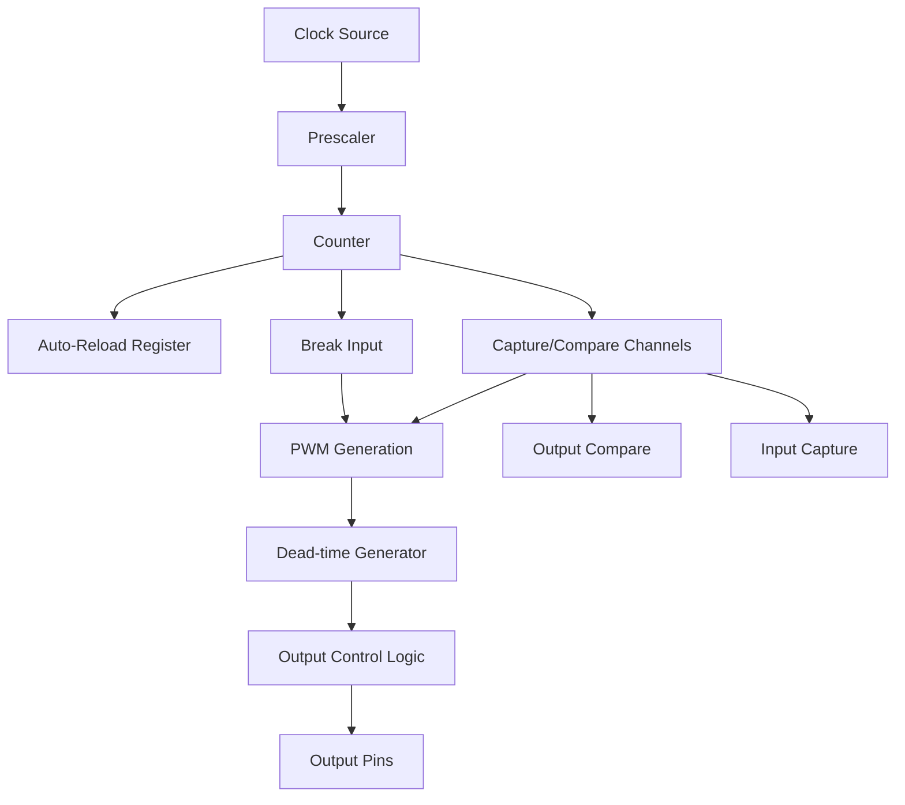

# STM32 Advanced Timers

## Introduction

STM32 microcontrollers come with a variety of timer peripherals, ranging from basic to advanced. In this tutorial, we'll focus on the advanced timer capabilities that make STM32 microcontrollers powerful for applications requiring precise timing, motor control, power conversion, and complex waveform generation.

Advanced timers in STM32 (such as TIM1 and TIM8) offer features beyond the basic counting functionality, including:

- Multiple capture/compare channels
- PWM generation with dead-time insertion
- Complementary outputs with programmable dead-time
- Break functionality for safety-critical applications
- Advanced triggering capabilities
- Center-aligned counting modes

By the end of this tutorial, you'll understand how to configure and use these advanced features in your projects.

## Advanced Timer Architecture

Advanced timers in STM32 share a common architecture but offer more functionality than general-purpose timers.



The main components include:

1. **Counter**: The heart of the timer that increments or decrements based on clock pulses
2. **Prescaler**: Divides the input clock to control the timer counting frequency
3. **Auto-reload register**: Defines the period of the timer
4. **Capture/Compare channels**: Multiple channels for comparing counter values or capturing external events
5. **Dead-time generator**: Inserts delays between complementary outputs for safe switching
6. **Break input**: Emergency stop mechanism for safety-critical applications

## Setting Up an Advanced Timer

Let's start by configuring TIM1 (an advanced timer) in a basic configuration:

```c
#include "stm32f4xx_hal.h"

TIM_HandleTypeDef htim1;

void AdvancedTimer_Init(void)
{
  /* Timer base configuration */
  htim1.Instance = TIM1;
  htim1.Init.Prescaler = 84 - 1;         // Assuming 84 MHz clock, this gives 1 MHz timer clock
  htim1.Init.CounterMode = TIM_COUNTERMODE_UP;
  htim1.Init.Period = 1000 - 1;          // 1000 counts = 1 ms period
  htim1.Init.ClockDivision = TIM_CLOCKDIVISION_DIV1;
  htim1.Init.RepetitionCounter = 0;
  htim1.Init.AutoReloadPreload = TIM_AUTORELOAD_PRELOAD_DISABLE;
  
  if (HAL_TIM_Base_Init(&htim1) != HAL_OK)
  {
    Error_Handler();
  }
  
  /* Start the timer */
  HAL_TIM_Base_Start(&htim1);
}
```

This initializes TIM1 with a 1 MHz counting frequency and a period of 1 ms. Now let's explore more advanced features.

## PWM Generation with Dead-Time

Advanced timers are excellent for PWM generation, especially for applications requiring complementary outputs with dead-time for driving power devices like MOSFETs in half-bridge configurations.

Here's how to configure TIM1 for complementary PWM output with dead-time:

```c
void PWM_DeadTime_Init(void)
{
  TIM_ClockConfigTypeDef sClockSourceConfig = {0};
  TIM_MasterConfigTypeDef sMasterConfig = {0};
  TIM_OC_InitTypeDef sConfigOC = {0};
  TIM_BreakDeadTimeConfigTypeDef sBreakDeadTimeConfig = {0};

  /* Timer base configuration */
  htim1.Instance = TIM1;
  htim1.Init.Prescaler = 84 - 1;
  htim1.Init.CounterMode = TIM_COUNTERMODE_UP;
  htim1.Init.Period = 1000 - 1;
  htim1.Init.ClockDivision = TIM_CLOCKDIVISION_DIV1;
  htim1.Init.RepetitionCounter = 0;
  htim1.Init.AutoReloadPreload = TIM_AUTORELOAD_PRELOAD_ENABLE;
  
  if (HAL_TIM_Base_Init(&htim1) != HAL_OK)
  {
    Error_Handler();
  }
  
  /* Clock source configuration */
  sClockSourceConfig.ClockSource = TIM_CLOCKSOURCE_INTERNAL;
  if (HAL_TIM_ConfigClockSource(&htim1, &sClockSourceConfig) != HAL_OK)
  {
    Error_Handler();
  }
  
  /* PWM mode configuration */
  if (HAL_TIM_PWM_Init(&htim1) != HAL_OK)
  {
    Error_Handler();
  }
  
  /* Master configuration: timer behavior in an encoder system */
  sMasterConfig.MasterOutputTrigger = TIM_TRGO_RESET;
  sMasterConfig.MasterSlaveMode = TIM_MASTERSLAVEMODE_DISABLE;
  if (HAL_TIMEx_MasterConfigSynchronization(&htim1, &sMasterConfig) != HAL_OK)
  {
    Error_Handler();
  }
  
  /* PWM channel configuration */
  sConfigOC.OCMode = TIM_OCMODE_PWM1;
  sConfigOC.Pulse = 500;  // 50% duty cycle
  sConfigOC.OCPolarity = TIM_OCPOLARITY_HIGH;
  sConfigOC.OCNPolarity = TIM_OCNPOLARITY_HIGH;
  sConfigOC.OCFastMode = TIM_OCFAST_DISABLE;
  sConfigOC.OCIdleState = TIM_OCIDLESTATE_RESET;
  sConfigOC.OCNIdleState = TIM_OCNIDLESTATE_RESET;
  
  if (HAL_TIM_PWM_ConfigChannel(&htim1, &sConfigOC, TIM_CHANNEL_1) != HAL_OK)
  {
    Error_Handler();
  }
  
  /* Break and dead-time configuration */
  sBreakDeadTimeConfig.OffStateRunMode = TIM_OSSR_DISABLE;
  sBreakDeadTimeConfig.OffStateIDLEMode = TIM_OSSI_DISABLE;
  sBreakDeadTimeConfig.LockLevel = TIM_LOCKLEVEL_OFF;
  sBreakDeadTimeConfig.DeadTime = 84;  // 84 clock cycles = 1 µs at 84 MHz
  sBreakDeadTimeConfig.BreakState = TIM_BREAK_DISABLE;
  sBreakDeadTimeConfig.BreakPolarity = TIM_BREAKPOLARITY_HIGH;
  sBreakDeadTimeConfig.AutomaticOutput = TIM_AUTOMATICOUTPUT_DISABLE;
  
  if (HAL_TIMEx_ConfigBreakDeadTime(&htim1, &sBreakDeadTimeConfig) != HAL_OK)
  {
    Error_Handler();
  }
  
  /* Start PWM on both complementary outputs */
  HAL_TIM_PWM_Start(&htim1, TIM_CHANNEL_1);
  HAL_TIMEx_PWMN_Start(&htim1, TIM_CHANNEL_1);
}
```

Key points in this configuration:

1. We set up a basic timer with 1 MHz clock
2. Configure channel 1 for PWM with 50% duty cycle
3. Configure dead-time of 1 µs (84 clock cycles at 84 MHz)
4. Start both normal and complementary PWM outputs

This produces the following waveform on TIM1_CH1 and TIM1_CH1N pins:

```
TIM1_CH1:   ____          ____          ____
               |          |   |          |   
               |__________|   |__________|   

TIM1_CH1N:      ____          ____         
           ____|    |________|    |________
                ↑  ↑
                Dead-time (1 µs)
```

The dead-time insertion ensures that both outputs are never active simultaneously, which is crucial for preventing shoot-through in half-bridge circuits.

## Advanced Timer Counting Modes

STM32 advanced timers support multiple counting modes:

1. **Up-counting**: Counter increments from 0 to the auto-reload value
2. **Down-counting**: Counter decrements from the auto-reload value to 0
3. **Center-aligned**: Counter alternates between up and down counting

Center-aligned mode is particularly useful for PWM generation in motor control applications, as it reduces harmonic content in the output waveform.

```c
void CenterAligned_PWM_Init(void)
{
  /* Base timer configuration */
  htim1.Instance = TIM1;
  htim1.Init.Prescaler = 84 - 1;
  htim1.Init.CounterMode = TIM_COUNTERMODE_CENTERALIGNED1;  // Center-aligned mode 1
  htim1.Init.Period = 1000 - 1;
  htim1.Init.ClockDivision = TIM_CLOCKDIVISION_DIV1;
  htim1.Init.RepetitionCounter = 0;
  htim1.Init.AutoReloadPreload = TIM_AUTORELOAD_PRELOAD_ENABLE;
  
  /* Initialize timer and configure PWM as in previous example */
  // ...
}
```

Center-aligned modes (1, 2, and 3) differ in their interrupt generation behavior:
- Mode 1: Interrupts on up-counting only
- Mode 2: Interrupts on down-counting only
- Mode 3: Interrupts on both up and down counting

## Break Functionality

The break feature in advanced timers provides a hardware safety mechanism. When a break event occurs, the timer outputs can be forced to a predefined state. This is crucial in applications like motor control where rapid shutdown might be necessary to prevent damage.

```c
void Break_Function_Init(void)
{
  /* Configure break function */
  sBreakDeadTimeConfig.OffStateRunMode = TIM_OSSR_ENABLE;
  sBreakDeadTimeConfig.OffStateIDLEMode = TIM_OSSI_ENABLE;
  sBreakDeadTimeConfig.LockLevel = TIM_LOCKLEVEL_1;
  sBreakDeadTimeConfig.DeadTime = 84;
  sBreakDeadTimeConfig.BreakState = TIM_BREAK_ENABLE;
  sBreakDeadTimeConfig.BreakPolarity = TIM_BREAKPOLARITY_HIGH;
  sBreakDeadTimeConfig.AutomaticOutput = TIM_AUTOMATICOUTPUT_DISABLE;
  
  if (HAL_TIMEx_ConfigBreakDeadTime(&htim1, &sBreakDeadTimeConfig) != HAL_OK)
  {
    Error_Handler();
  }
}
```

When a break event occurs (high-level on the break input in this example), the timer outputs will be disabled, preventing potential damage to the system.

## Repetition Counter

Advanced timers feature a repetition counter that allows events (like update events) to be generated after a specified number of counter cycles. This is useful for applications requiring lower event frequencies or multi-cycle operations.

```c
void Repetition_Counter_Init(void)
{
  /* Timer base configuration */
  htim1.Instance = TIM1;
  htim1.Init.Prescaler = 84 - 1;
  htim1.Init.CounterMode = TIM_COUNTERMODE_UP;
  htim1.Init.Period = 1000 - 1;
  htim1.Init.ClockDivision = TIM_CLOCKDIVISION_DIV1;
  htim1.Init.RepetitionCounter = 3;  // Update event every 4 counter cycles
  htim1.Init.AutoReloadPreload = TIM_AUTORELOAD_PRELOAD_DISABLE;
  
  /* Initialize timer */
  // ...
  
  /* Configure and enable update interrupt */
  HAL_TIM_Base_Start_IT(&htim1);
}

/* Timer update interrupt handler */
void HAL_TIM_PeriodElapsedCallback(TIM_HandleTypeDef *htim)
{
  if (htim->Instance == TIM1)
  {
    /* This will be called once every 4 ms (1 ms × 4) */
    // Process update event
  }
}
```

With a repetition counter of 3, the update event occurs every 4 counter cycles (including the 0 count), effectively dividing the update event frequency by 4.

## Real-World Application: Three-Phase PWM Generation

One of the most common applications for advanced timers is three-phase PWM generation for motor control. The following example configures TIM1 for three-phase PWM with complementary outputs and dead-time:

```c
void Three_Phase_PWM_Init(void)
{
  TIM_ClockConfigTypeDef sClockSourceConfig = {0};
  TIM_MasterConfigTypeDef sMasterConfig = {0};
  TIM_OC_InitTypeDef sConfigOC = {0};
  TIM_BreakDeadTimeConfigTypeDef sBreakDeadTimeConfig = {0};

  /* Timer base configuration */
  htim1.Instance = TIM1;
  htim1.Init.Prescaler = 1 - 1;  // For high-frequency PWM
  htim1.Init.CounterMode = TIM_COUNTERMODE_CENTERALIGNED3;
  htim1.Init.Period = 4200 - 1;  // Set for ~10 kHz PWM with 84 MHz clock
  htim1.Init.ClockDivision = TIM_CLOCKDIVISION_DIV1;
  htim1.Init.RepetitionCounter = 1;  // Update events at half the frequency
  htim1.Init.AutoReloadPreload = TIM_AUTORELOAD_PRELOAD_ENABLE;
  
  HAL_TIM_Base_Init(&htim1);
  
  sClockSourceConfig.ClockSource = TIM_CLOCKSOURCE_INTERNAL;
  HAL_TIM_ConfigClockSource(&htim1, &sClockSourceConfig);
  
  HAL_TIM_PWM_Init(&htim1);
  
  sMasterConfig.MasterOutputTrigger = TIM_TRGO_UPDATE;
  sMasterConfig.MasterSlaveMode = TIM_MASTERSLAVEMODE_DISABLE;
  HAL_TIMEx_MasterConfigSynchronization(&htim1, &sMasterConfig);
  
  /* PWM configuration for all three phases */
  sConfigOC.OCMode = TIM_OCMODE_PWM1;
  sConfigOC.Pulse = 2100;  // 50% duty cycle
  sConfigOC.OCPolarity = TIM_OCPOLARITY_HIGH;
  sConfigOC.OCNPolarity = TIM_OCNPOLARITY_HIGH;
  sConfigOC.OCFastMode = TIM_OCFAST_DISABLE;
  sConfigOC.OCIdleState = TIM_OCIDLESTATE_RESET;
  sConfigOC.OCNIdleState = TIM_OCNIDLESTATE_RESET;
  
  /* Configure Phase A */
  HAL_TIM_PWM_ConfigChannel(&htim1, &sConfigOC, TIM_CHANNEL_1);
  
  /* Configure Phase B */
  HAL_TIM_PWM_ConfigChannel(&htim1, &sConfigOC, TIM_CHANNEL_2);
  
  /* Configure Phase C */
  HAL_TIM_PWM_ConfigChannel(&htim1, &sConfigOC, TIM_CHANNEL_3);
  
  /* Break and dead-time configuration */
  sBreakDeadTimeConfig.OffStateRunMode = TIM_OSSR_ENABLE;
  sBreakDeadTimeConfig.OffStateIDLEMode = TIM_OSSI_ENABLE;
  sBreakDeadTimeConfig.LockLevel = TIM_LOCKLEVEL_1;
  sBreakDeadTimeConfig.DeadTime = 168;  // 2 µs dead-time
  sBreakDeadTimeConfig.BreakState = TIM_BREAK_ENABLE;
  sBreakDeadTimeConfig.BreakPolarity = TIM_BREAKPOLARITY_HIGH;
  sBreakDeadTimeConfig.AutomaticOutput = TIM_AUTOMATICOUTPUT_DISABLE;
  
  HAL_TIMEx_ConfigBreakDeadTime(&htim1, &sBreakDeadTimeConfig);
  
  /* Start all three phases with complementary outputs */
  HAL_TIM_PWM_Start(&htim1, TIM_CHANNEL_1);
  HAL_TIMEx_PWMN_Start(&htim1, TIM_CHANNEL_1);
  HAL_TIM_PWM_Start(&htim1, TIM_CHANNEL_2);
  HAL_TIMEx_PWMN_Start(&htim1, TIM_CHANNEL_2);
  HAL_TIM_PWM_Start(&htim1, TIM_CHANNEL_3);
  HAL_TIMEx_PWMN_Start(&htim1, TIM_CHANNEL_3);
}
```

To generate three-phase PWM with 120-degree phase shifts, we need to update the compare values periodically:

```c
void Update_ThreePhase_PWM(uint16_t amplitude, uint16_t angle)
{
  /* Calculate PWM values for each phase with 120-degree offset */
  uint16_t phase_a = 2100 + (uint16_t)((int16_t)amplitude * __sin(angle) / 32768);
  uint16_t phase_b = 2100 + (uint16_t)((int16_t)amplitude * __sin(angle + 21845) / 32768); // +120 degrees
  uint16_t phase_c = 2100 + (uint16_t)((int16_t)amplitude * __sin(angle + 43690) / 32768); // +240 degrees
  
  /* Update compare registers */
  __HAL_TIM_SET_COMPARE(&htim1, TIM_CHANNEL_1, phase_a);
  __HAL_TIM_SET_COMPARE(&htim1, TIM_CHANNEL_2, phase_b);
  __HAL_TIM_SET_COMPARE(&htim1, TIM_CHANNEL_3, phase_c);
}
```

This function generates a 3-phase sinusoidal PWM pattern where:
- `amplitude` controls the PWM modulation depth (0-2100)
- `angle` is the electrical angle (0-65535 representing 0-360 degrees)

## Advanced Timer Triggering and Synchronization

Multiple timers can be synchronized for complex applications using the trigger and slave mode capabilities:

```c
void Timer_Synchronization_Init(void)
{
  /* Configure TIM1 as master */
  TIM_MasterConfigTypeDef sMasterConfig = {0};
  sMasterConfig.MasterOutputTrigger = TIM_TRGO_UPDATE;
  sMasterConfig.MasterSlaveMode = TIM_MASTERSLAVEMODE_ENABLE;
  HAL_TIMEx_MasterConfigSynchronization(&htim1, &sMasterConfig);
  
  /* Configure TIM2 as slave */
  TIM_HandleTypeDef htim2;
  TIM_SlaveConfigTypeDef sSlaveConfig = {0};
  
  htim2.Instance = TIM2;
  htim2.Init.Prescaler = 0;
  htim2.Init.CounterMode = TIM_COUNTERMODE_UP;
  htim2.Init.Period = 0xFFFF;
  htim2.Init.ClockDivision = TIM_CLOCKDIVISION_DIV1;
  HAL_TIM_Base_Init(&htim2);
  
  sSlaveConfig.SlaveMode = TIM_SLAVEMODE_TRIGGER;
  sSlaveConfig.InputTrigger = TIM_TS_ITR0;  // TIM1 is typically connected to ITR0 of TIM2
  HAL_TIM_SlaveConfigSynchro(&htim2, &sSlaveConfig);
  
  /* Start timers */
  HAL_TIM_Base_Start(&htim1);  // Master starts first
  HAL_TIM_Base_Start(&htim2);  // Slave will start when triggered by master
}
```

This setup causes TIM2 to be triggered by TIM1's update event, ensuring precise synchronization between the timers.

## Summary

STM32 advanced timers offer powerful features that make them ideal for complex timing applications:

1. **PWM Generation**: Multiple channels with complementary outputs and dead-time insertion
2. **Flexible Counting Modes**: Up, down, and center-aligned counting
3. **Safety Features**: Break inputs for emergency shutdown
4. **Repetition Counter**: For reduced update event frequency
5. **Complex Triggering**: For synchronizing multiple peripherals

These capabilities make advanced timers essential for applications such as:
- Motor control (DC, BLDC, stepper motors)
- Switch-mode power supplies
- Digital power conversion
- Precise waveform generation
- Multi-phase systems

## Additional Resources and Exercises

### Resources
- STM32 Reference Manuals (RM0008, RM0090, etc.)
- STM32 Application Notes:
  - AN4013: STM32 cross-series timer overview
  - AN4776: General-purpose timer cookbook
  - AN1946: Designing a motor control application with STM32 MCUs

### Exercises

1. **Basic PWM Generation**:
   Configure an advanced timer to generate a PWM signal with variable duty cycle using a potentiometer connected to an ADC.

2. **Complementary PWM**:
   Create a half-bridge driver using complementary outputs with dead-time insertion. Measure the dead-time with an oscilloscope.

3. **Three-Phase PWM**:
   Implement a simple three-phase inverter control using the code provided in the tutorial. Vary the amplitude and frequency of the output.

4. **Timer Synchronization**:
   Set up two timers in a master-slave configuration where the slave timer captures input events synchronized to the master timer.

5. **Break Function**:
   Implement a safety circuit with a push-button connected to the break input. Verify that PWM outputs are disabled when the button is pressed.

By mastering advanced timer features, you'll be well-equipped to tackle complex embedded applications requiring precise timing and control.