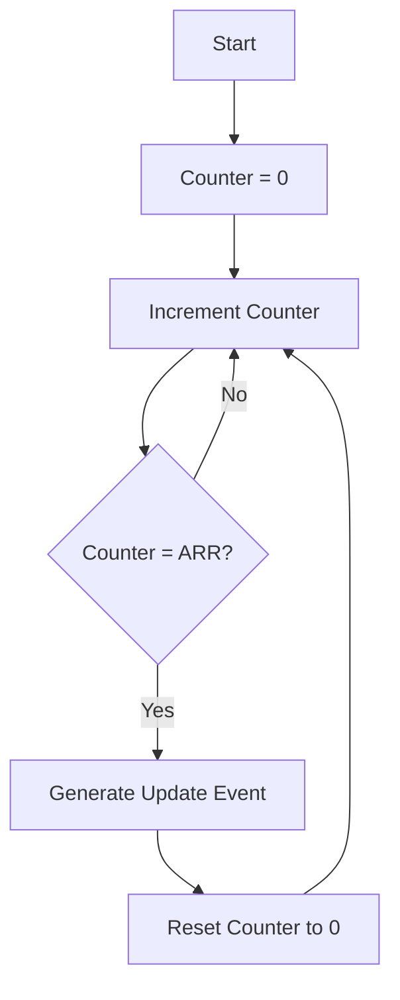
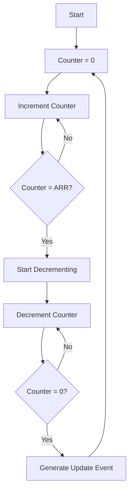

# STM32 Timer Modes

## Introduction

Timers are essential peripherals in microcontrollers that enable precise timing operations, pulse generation, event counting, and more. The STM32 family of microcontrollers offers a rich set of timer peripherals with various operating modes to address different application requirements.

In this tutorial, we'll explore the different timer modes available on STM32 microcontrollers, understand their configurations, and see how they can be applied in real-world embedded applications. Whether you're building a motor controller, a digital clock, or a complex signal generator, understanding these timer modes is crucial for effective embedded system design.

## Timer Hierarchy in STM32

Before diving into specific modes, it's important to understand the types of timers available in STM32 microcontrollers:

1. **Basic Timers**: Simple up-counting timers with fewer features
2. **General-Purpose Timers**: Versatile timers with multiple channels and modes
3. **Advanced Timers**: Feature-rich timers with complementary outputs, dead-time insertion, and more

Each type provides different capabilities, and the choice depends on your application requirements.

## Basic Timer Modes

### 1. Up-Counting Mode

This is the simplest mode where the timer counts from 0 to a predefined value (auto-reload value) and then resets to 0.

```c
// Configure TIM6 (Basic Timer) in Up-Counting mode
void BasicTimer_UpCounting_Config(void) {
  // Enable clock for TIM6
  RCC->APB1ENR |= RCC_APB1ENR_TIM6EN;
  
  // Set prescaler (divides the clock frequency)
  TIM6->PSC = 7999; // For 8MHz clock, this gives 1ms tick
  
  // Set auto-reload value (period)
  TIM6->ARR = 1000; // 1000ms = 1s
  
  // Enable update interrupt
  TIM6->DIER |= TIM_DIER_UIE;
  
  // Enable timer
  TIM6->CR1 |= TIM_CR1_CEN;
}
```

When the counter reaches the ARR value (1000 in this example), it generates an update event, resets to 0, and continues counting.

### 2. One-Pulse Mode

In this mode, the timer generates a single pulse and then stops.

```c
// Configure TIM6 for One-Pulse mode
void BasicTimer_OnePulse_Config(void) {
  // Enable clock for TIM6
  RCC->APB1ENR |= RCC_APB1ENR_TIM6EN;
  
  // Set prescaler
  TIM6->PSC = 7999; // 1ms tick
  
  // Set auto-reload value
  TIM6->ARR = 500; // 500ms pulse
  
  // Enable one-pulse mode
  TIM6->CR1 |= TIM_CR1_OPM;
  
  // Enable timer
  TIM6->CR1 |= TIM_CR1_CEN;
}
```

## General-Purpose Timer Modes

General-purpose timers offer more functionality than basic timers, including multiple channels for input capture and output compare operations.

### 1. Output Compare Mode

This mode allows you to generate output signals (like PWM) or trigger events when the counter matches specified values.

```c
// Configure TIM2 Channel 1 in Output Compare mode
void GP_Timer_OutputCompare_Config(void) {
  // Enable clock for TIM2 and GPIOA
  RCC->APB1ENR |= RCC_APB1ENR_TIM2EN;
  RCC->AHB1ENR |= RCC_AHB1ENR_GPIOAEN;
  
  // Configure PA0 as TIM2_CH1 (Alternate Function)
  GPIOA->MODER &= ~GPIO_MODER_MODER0_0;
  GPIOA->MODER |= GPIO_MODER_MODER0_1;
  GPIOA->AFR[0] |= 1; // AF1 for TIM2_CH1
  
  // Set prescaler (divides the clock frequency)
  TIM2->PSC = 7999; // 1ms tick
  
  // Set auto-reload value (period)
  TIM2->ARR = 1000; // 1000ms = 1s
  
  // Configure Channel 1 in Output Compare mode
  TIM2->CCMR1 &= ~TIM_CCMR1_OC1M;
  TIM2->CCMR1 |= TIM_CCMR1_OC1M_0 | TIM_CCMR1_OC1M_1; // PWM Mode 1
  
  // Enable Channel 1 output
  TIM2->CCER |= TIM_CCER_CC1E;
  
  // Set compare value (when to toggle output)
  TIM2->CCR1 = 500; // 50% duty cycle
  
  // Enable timer
  TIM2->CR1 |= TIM_CR1_CEN;
}
```

This example configures TIM2 channel 1 to generate a PWM signal with a 50% duty cycle.

### 2. Input Capture Mode

Input capture mode allows you to measure the duration or frequency of input signals.

```c
// Configure TIM3 Channel 1 in Input Capture mode
void GP_Timer_InputCapture_Config(void) {
  // Enable clock for TIM3 and GPIOA
  RCC->APB1ENR |= RCC_APB1ENR_TIM3EN;
  RCC->AHB1ENR |= RCC_AHB1ENR_GPIOAEN;
  
  // Configure PA6 as TIM3_CH1 (Alternate Function)
  GPIOA->MODER &= ~GPIO_MODER_MODER6_0;
  GPIOA->MODER |= GPIO_MODER_MODER6_1;
  GPIOA->AFR[0] |= (2 << 24); // AF2 for TIM3_CH1
  
  // Set prescaler
  TIM3->PSC = 7999; // 1ms tick
  
  // Configure Channel 1 in Input Capture mode
  TIM3->CCMR1 &= ~TIM_CCMR1_CC1S;
  TIM3->CCMR1 |= TIM_CCMR1_CC1S_0; // CC1 channel is configured as input
  
  // Configure for rising edge detection
  TIM3->CCER &= ~TIM_CCER_CC1P;
  
  // Enable capture on channel 1
  TIM3->CCER |= TIM_CCER_CC1E;
  
  // Enable capture interrupt
  TIM3->DIER |= TIM_DIER_CC1IE;
  
  // Enable timer
  TIM3->CR1 |= TIM_CR1_CEN;
}

// Interrupt handler to process captured value
void TIM3_IRQHandler(void) {
  if (TIM3->SR & TIM_SR_CC1IF) {
    // Read captured value
    uint32_t capturedValue = TIM3->CCR1;
    
    // Process the captured value (e.g., calculate frequency or pulse width)
    
    // Clear interrupt flag
    TIM3->SR &= ~TIM_SR_CC1IF;
  }
}
```

This example configures TIM3 channel 1 to capture the time at which a rising edge is detected on PA6.

### 3. PWM Mode

PWM (Pulse Width Modulation) is a special case of output compare mode used to generate signals with variable duty cycles.

```c
// Configure TIM4 for PWM generation
void GP_Timer_PWM_Config(void) {
  // Enable clock for TIM4 and GPIOB
  RCC->APB1ENR |= RCC_APB1ENR_TIM4EN;
  RCC->AHB1ENR |= RCC_AHB1ENR_GPIOBEN;
  
  // Configure PB6 as TIM4_CH1 (Alternate Function)
  GPIOB->MODER &= ~GPIO_MODER_MODER6_0;
  GPIOB->MODER |= GPIO_MODER_MODER6_1;
  GPIOB->AFR[0] |= (2 << 24); // AF2 for TIM4_CH1
  
  // Set prescaler
  TIM4->PSC = 7; // For 8MHz clock, this gives 1μs tick
  
  // Set auto-reload value (period)
  TIM4->ARR = 1000; // 1000μs = 1ms (frequency = 1kHz)
  
  // Configure PWM mode
  TIM4->CCMR1 &= ~TIM_CCMR1_OC1M;
  TIM4->CCMR1 |= TIM_CCMR1_OC1M_1 | TIM_CCMR1_OC1M_2; // PWM Mode 1
  TIM4->CCMR1 |= TIM_CCMR1_OC1PE; // Preload enable
  
  // Enable output
  TIM4->CCER |= TIM_CCER_CC1E;
  
  // Set initial duty cycle (25%)
  TIM4->CCR1 = 250;
  
  // Enable auto-reload preload
  TIM4->CR1 |= TIM_CR1_ARPE;
  
  // Enable timer
  TIM4->CR1 |= TIM_CR1_CEN;
}

// Function to update PWM duty cycle
void Set_PWM_DutyCycle(uint16_t dutyCycle) {
  // Make sure duty cycle is within range
  if (dutyCycle > 1000) dutyCycle = 1000;
  
  // Update CCR1 register
  TIM4->CCR1 = dutyCycle;
}
```

The above code configures TIM4 to generate a 1kHz PWM signal with an adjustable duty cycle.

## Advanced Timer Modes

Advanced timers (TIM1 and TIM8) offer additional features like complementary outputs, dead-time insertion, and more, which are particularly useful for motor control and power conversion applications.

### 1. Center-Aligned Mode (Up-Down Counting)

In this mode, the timer counts up to the auto-reload value and then counts down to 0, making it useful for symmetric PWM generation.

```c
// Configure TIM1 in Center-Aligned mode
void Adv_Timer_CenterAligned_Config(void) {
  // Enable clock for TIM1 and GPIOA
  RCC->APB2ENR |= RCC_APB2ENR_TIM1EN;
  RCC->AHB1ENR |= RCC_AHB1ENR_GPIOAEN;
  
  // Configure PA8 as TIM1_CH1 (Alternate Function)
  GPIOA->MODER &= ~GPIO_MODER_MODER8_0;
  GPIOA->MODER |= GPIO_MODER_MODER8_1;
  GPIOA->AFR[1] |= (1 << 0); // AF1 for TIM1_CH1
  
  // Set prescaler
  TIM1->PSC = 7; // 1μs tick
  
  // Set auto-reload value
  TIM1->ARR = 1000; // Period = 2000μs (up-down count)
  
  // Select center-aligned mode
  TIM1->CR1 &= ~TIM_CR1_CMS;
  TIM1->CR1 |= TIM_CR1_CMS_0 | TIM_CR1_CMS_1; // Center-aligned mode 3
  
  // Configure PWM mode
  TIM1->CCMR1 &= ~TIM_CCMR1_OC1M;
  TIM1->CCMR1 |= TIM_CCMR1_OC1M_1 | TIM_CCMR1_OC1M_2; // PWM Mode 1
  TIM1->CCMR1 |= TIM_CCMR1_OC1PE; // Preload enable
  
  // Enable output
  TIM1->CCER |= TIM_CCER_CC1E;
  
  // Set duty cycle
  TIM1->CCR1 = 500; // 50% duty cycle
  
  // Enable auto-reload preload
  TIM1->CR1 |= TIM_CR1_ARPE;
  
  // Enable main output
  TIM1->BDTR |= TIM_BDTR_MOE;
  
  // Enable timer
  TIM1->CR1 |= TIM_CR1_CEN;
}
```

### 2. Complementary Output with Dead-Time

This mode is especially useful for driving H-bridges in motor control applications, where you need complementary signals with dead-time to prevent shoot-through.

```c
// Configure TIM1 with complementary outputs and dead-time
void Adv_Timer_Complementary_DeadTime_Config(void) {
  // Enable clock for TIM1, GPIOA, and GPIOB
  RCC->APB2ENR |= RCC_APB2ENR_TIM1EN;
  RCC->AHB1ENR |= RCC_AHB1ENR_GPIOAEN | RCC_AHB1ENR_GPIOBEN;
  
  // Configure PA8 as TIM1_CH1 and PB13 as TIM1_CH1N (Alternate Function)
  // PA8 configuration
  GPIOA->MODER &= ~GPIO_MODER_MODER8_0;
  GPIOA->MODER |= GPIO_MODER_MODER8_1;
  GPIOA->AFR[1] |= (1 << 0); // AF1 for TIM1_CH1
  
  // PB13 configuration
  GPIOB->MODER &= ~GPIO_MODER_MODER13_0;
  GPIOB->MODER |= GPIO_MODER_MODER13_1;
  GPIOB->AFR[1] |= (1 << 20); // AF1 for TIM1_CH1N
  
  // Set prescaler
  TIM1->PSC = 7; // 1μs tick
  
  // Set auto-reload value
  TIM1->ARR = 1000; // 1000μs period
  
  // Configure PWM mode
  TIM1->CCMR1 &= ~TIM_CCMR1_OC1M;
  TIM1->CCMR1 |= TIM_CCMR1_OC1M_1 | TIM_CCMR1_OC1M_2; // PWM Mode 1
  TIM1->CCMR1 |= TIM_CCMR1_OC1PE; // Preload enable
  
  // Enable outputs (both main and complementary)
  TIM1->CCER |= TIM_CCER_CC1E | TIM_CCER_CC1NE;
  
  // Configure dead-time
  TIM1->BDTR &= ~TIM_BDTR_DTG;
  TIM1->BDTR |= 100; // 100μs dead-time
  
  // Set duty cycle
  TIM1->CCR1 = 500; // 50% duty cycle
  
  // Enable auto-reload preload
  TIM1->CR1 |= TIM_CR1_ARPE;
  
  // Enable main output
  TIM1->BDTR |= TIM_BDTR_MOE;
  
  // Enable timer
  TIM1->CR1 |= TIM_CR1_CEN;
}
```

This configuration generates complementary PWM signals on PA8 (TIM1_CH1) and PB13 (TIM1_CH1N) with a 100μs dead-time between transitions to prevent shoot-through.

## Timer Mode Timing Diagrams

Let's visualize some of the timer modes using mermaid diagrams:

### Up-Counting Mode



### Center-Aligned Mode



## Practical Examples

### Example 1: LED Blinking with Basic Timer

```c
// Configure system clock
void SystemClock_Config(void) {
  // Configure system to run at 8MHz from HSI
  RCC->CR |= RCC_CR_HSION;
  while(!(RCC->CR & RCC_CR_HSIRDY));
  
  RCC->CFGR &= ~RCC_CFGR_SW;
  RCC->CFGR |= RCC_CFGR_SW_HSI;
  while((RCC->CFGR & RCC_CFGR_SWS) != RCC_CFGR_SWS_HSI);
}

// Configure LED on PA5
void LED_Config(void) {
  RCC->AHB1ENR |= RCC_AHB1ENR_GPIOAEN;
  GPIOA->MODER &= ~GPIO_MODER_MODER5_1;
  GPIOA->MODER |= GPIO_MODER_MODER5_0;
}

// Configure TIM6 (Basic Timer) for 500ms interval
void TIM6_Config(void) {
  // Enable clock for TIM6
  RCC->APB1ENR |= RCC_APB1ENR_TIM6EN;
  
  // Set prescaler (divides the clock frequency)
  TIM6->PSC = 7999; // For 8MHz clock, this gives 1ms tick
  
  // Set auto-reload value (period)
  TIM6->ARR = 500; // 500ms
  
  // Enable update interrupt
  TIM6->DIER |= TIM_DIER_UIE;
  
  // Enable timer
  TIM6->CR1 |= TIM_CR1_CEN;
  
  // Enable TIM6 interrupt in NVIC
  NVIC_EnableIRQ(TIM6_DAC_IRQn);
}

// TIM6 interrupt handler
void TIM6_DAC_IRQHandler(void) {
  if (TIM6->SR & TIM_SR_UIF) {
    // Toggle LED
    GPIOA->ODR ^= (1 << 5);
    
    // Clear update interrupt flag
    TIM6->SR &= ~TIM_SR_UIF;
  }
}

int main(void) {
  // Configure system clock
  SystemClock_Config();
  
  // Configure LED
  LED_Config();
  
  // Configure Timer
  TIM6_Config();
  
  while(1) {
    // Main loop - everything is handled by the interrupt
  }
}
```

This example uses TIM6 (a basic timer) to generate an interrupt every 500ms, which toggles an LED connected to PA5.

### Example 2: Servo Motor Control with PWM

Servo motors typically require a PWM signal with a period of 20ms and a pulse width varying from 1ms to 2ms to control the position.

```c
// Configure TIM2 for Servo Control (PWM mode)
void Servo_PWM_Config(void) {
  // Enable clock for TIM2 and GPIOA
  RCC->APB1ENR |= RCC_APB1ENR_TIM2EN;
  RCC->AHB1ENR |= RCC_AHB1ENR_GPIOAEN;
  
  // Configure PA0 as TIM2_CH1 (Alternate Function)
  GPIOA->MODER &= ~GPIO_MODER_MODER0_0;
  GPIOA->MODER |= GPIO_MODER_MODER0_1;
  GPIOA->AFR[0] |= 1; // AF1 for TIM2_CH1
  
  // Set prescaler for 1μs tick
  TIM2->PSC = 7;
  
  // Set auto-reload value for 20ms period (servo standard)
  TIM2->ARR = 20000;
  
  // Configure PWM mode
  TIM2->CCMR1 &= ~TIM_CCMR1_OC1M;
  TIM2->CCMR1 |= TIM_CCMR1_OC1M_1 | TIM_CCMR1_OC1M_2; // PWM Mode 1
  TIM2->CCMR1 |= TIM_CCMR1_OC1PE; // Preload enable
  
  // Enable output
  TIM2->CCER |= TIM_CCER_CC1E;
  
  // Set initial position (neutral - 1.5ms pulse)
  TIM2->CCR1 = 1500;
  
  // Enable auto-reload preload
  TIM2->CR1 |= TIM_CR1_ARPE;
  
  // Enable timer
  TIM2->CR1 |= TIM_CR1_CEN;
}

// Function to set servo position
// position: 0 (0°) to 180 (180°)
void Set_Servo_Position(uint8_t position) {
  // Convert position (0-180) to pulse width (1000-2000μs)
  uint16_t pulseWidth = 1000 + (position * 1000 / 180);
  
  // Update CCR1 register
  TIM2->CCR1 = pulseWidth;
}
```

### Example 3: RPM Measurement with Input Capture

This example shows how to measure the RPM of a motor using the Input Capture mode.

```c
// Global variables
uint32_t captureValue1 = 0;
uint32_t captureValue2 = 0;
uint32_t pulsePeriod = 0;
uint32_t rpm = 0;
uint8_t captureFlag = 0;

// Configure TIM3 for Input Capture to measure RPM
void RPM_Measurement_Config(void) {
  // Enable clock for TIM3 and GPIOA
  RCC->APB1ENR |= RCC_APB1ENR_TIM3EN;
  RCC->AHB1ENR |= RCC_AHB1ENR_GPIOAEN;
  
  // Configure PA6 as TIM3_CH1 (Alternate Function)
  GPIOA->MODER &= ~GPIO_MODER_MODER6_0;
  GPIOA->MODER |= GPIO_MODER_MODER6_1;
  GPIOA->AFR[0] |= (2 << 24); // AF2 for TIM3_CH1
  
  // Set prescaler for 1μs tick
  TIM3->PSC = 7;
  
  // Set auto-reload to maximum
  TIM3->ARR = 0xFFFF;
  
  // Configure Channel 1 in Input Capture mode
  TIM3->CCMR1 &= ~TIM_CCMR1_CC1S;
  TIM3->CCMR1 |= TIM_CCMR1_CC1S_0; // CC1 channel is configured as input
  
  // Configure for rising edge detection
  TIM3->CCER &= ~TIM_CCER_CC1P;
  
  // Enable capture on channel 1
  TIM3->CCER |= TIM_CCER_CC1E;
  
  // Enable capture interrupt
  TIM3->DIER |= TIM_DIER_CC1IE;
  
  // Enable timer
  TIM3->CR1 |= TIM_CR1_CEN;
  
  // Enable TIM3 interrupt in NVIC
  NVIC_EnableIRQ(TIM3_IRQn);
}

// TIM3 interrupt handler
void TIM3_IRQHandler(void) {
  if (TIM3->SR & TIM_SR_CC1IF) {
    // Clear interrupt flag
    TIM3->SR &= ~TIM_SR_CC1IF;
    
    if (captureFlag == 0) {
      // First capture
      captureValue1 = TIM3->CCR1;
      captureFlag = 1;
    } else {
      // Second capture
      captureValue2 = TIM3->CCR1;
      
      // Calculate period (considering timer overflow)
      if (captureValue2 > captureValue1) {
        pulsePeriod = captureValue2 - captureValue1;
      } else {
        pulsePeriod = (0xFFFF - captureValue1) + captureValue2 + 1;
      }
      
      // Calculate RPM (assuming 1 pulse per revolution)
      // RPM = (60 * 1,000,000) / (pulsePeriod in μs)
      rpm = (60 * 1000000) / pulsePeriod;
      
      // Reset for next measurement
      captureFlag = 0;
    }
  }
}
```

This example assumes a sensor generates one pulse per revolution. The input capture is used to measure the time between consecutive rising edges, which is then used to calculate the RPM.

## Choosing the Right Timer Mode

Selecting the appropriate timer mode depends on your application requirements. Here are some guidelines:

1. **Basic Timers (TIM6, TIM7)**:
   - Best for simple timing, timeouts, and periodic interrupts
   - No external pins, so used purely for internal timing

2. **General-Purpose Timers (TIM2-TIM5, TIM9-TIM14)**:
   - Good for PWM generation, input capture, and output compare
   - TIM2 and TIM5 are 32-bit timers, offering extended range

3. **Advanced Timers (TIM1, TIM8)**:
   - Ideal for motor control applications requiring complementary outputs and dead-time insertion
   - Support center-aligned mode for symmetric PWM generation
   - Include break input functionality for safety-critical applications

## Optimization Techniques

When working with STM32 timers, consider these optimization strategies:

1. **Use DMA**: For high-frequency PWM updates or input capture, use DMA to reduce CPU load
2. **Slave Mode**: Configure timers in slave mode to trigger or synchronize with other timers
3. **Timer Chaining**: Connect multiple timers to create a timer with extended bit depth
4. **Interrupt Priority**: Assign appropriate priorities to timer interrupts based on application needs

## Summary

STM32 microcontrollers offer a rich set of timer peripherals with various operating modes to address different application requirements. In this tutorial, we've explored:

- Basic timer modes (Up-counting, One-pulse)
- General-purpose timer modes (Output Compare, Input Capture, PWM)
- Advanced timer modes (Center-aligned, Complementary outputs with dead-time)
- Practical examples including LED blinking, servo control, and RPM measurement

Understanding these timer modes and their configurations is essential for building efficient embedded applications that require precise timing, pulse generation, event counting, and motor control.

## Additional Resources

To deepen your understanding of STM32 timers, consider exploring:

1. STMicroelectronics Reference Manuals for your specific STM32 family
2. STM32CubeIDE and STM32CubeMX for graphical timer configuration
3. STM32 HAL (Hardware Abstraction Layer) timer functions for portable code
4. Example projects in the STM32CubeF4 package (or relevant package for your STM32 family)

## Exercises

1. Modify the LED blinking example to use a button to toggle between two blinking frequencies.
2. Implement a simple digital clock using TIM6 for timing and displaying hours, minutes, and seconds on an LCD.
3. Create a PWM-based RGB LED controller where each color channel is controlled by a separate timer channel.
4. Design a tachometer using the input capture mode to measure and display the RPM of a rotating device.
5. Implement a motor controller using the advanced timer features to drive a brushed DC motor with an H-bridge.