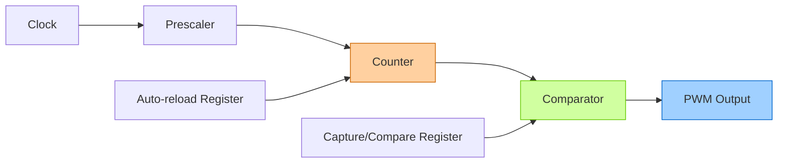

# STM32 PWM Generation

## Introduction

Pulse Width Modulation (PWM) is a fundamental technique in embedded systems for controlling power delivery to various components. By rapidly switching a digital signal between high and low states and varying the proportion of time it stays high (duty cycle), we can simulate an analog output or control the power delivered to devices like motors, LEDs, and heating elements.

STM32 microcontrollers offer powerful timer peripherals that can generate PWM signals with precise timing and minimal CPU overhead. In this tutorial, we'll explore how to configure and use the STM32 timers for PWM generation.

## PWM Basics

Before diving into implementation, let's understand what PWM is and how it works.

### What is PWM?

PWM (Pulse Width Modulation) is a technique where the width of a pulse is modulated to control the average power delivered to a load. 

Key parameters of a PWM signal:
- **Period** (T): The total time of one cycle (high + low)
- **Duty Cycle**: The percentage of time the signal is high within one period
- **Frequency**: The number of cycles per second (f = 1/T)

```mermaid
graph TD
    subgraph "PWM Signal"
        A[High] -->|Time| B[Low]
        B -->|Time| C[High]
        C -->|Time| D[Low]
        D -->|Time| E[...]
    end
    
    subgraph "Key Parameters"
        P[Period = High Time + Low Time]
        DC[Duty Cycle = (High Time / Period) × 100%]
        F[Frequency = 1 / Period]
    end
```

### PWM Applications

- **Motor speed control**: By varying the duty cycle, you can control the speed of DC motors
- **LED brightness control**: PWM allows for dimming LEDs without analog circuitry
- **Servo motor positioning**: Servo positions are controlled by specific pulse widths
- **Power regulation**: Efficient power delivery to resistive loads like heaters
- **Audio generation**: Basic sound synthesis (though DACs are preferred for quality audio)

## STM32 Timer Architecture for PWM

STM32 timers can be configured to automatically generate PWM signals on their output channels. Let's understand the timer architecture relevant to PWM:

### Timer Components for PWM

1. **Counter**: The core of the timer that increments or decrements at each clock cycle
2. **Prescaler**: Divides the input clock frequency to control the counter's tick rate
3. **Auto-reload Register (ARR)**: Defines the timer's period
4. **Capture/Compare Registers (CCRx)**: Control the duty cycle of each PWM channel
5. **Output channels**: Physical pins where the PWM signals appear



### PWM Modes

STM32 timers support different PWM modes:

1. **PWM Mode 1**: Channel is active (high) when the counter is less than CCR value
2. **PWM Mode 2**: Channel is inactive (low) when the counter is less than CCR value

For most applications, PWM Mode 1 is used, as it produces the expected behavior where a higher CCR value results in a higher duty cycle.

## Implementing PWM on STM32

Now, let's implement PWM step by step using the STM32 HAL library. We'll focus on using TIM2 for generating PWM signals.

### Step 1: Configure Timer Clock

First, we need to enable the timer's clock:

```c
// Enable clock for TIM2
__HAL_RCC_TIM2_CLK_ENABLE();
```

### Step 2: Initialize the Timer for PWM

Next, we configure the timer base:

```c
TIM_HandleTypeDef htim2;

void PWM_Init(void)
{
  // Timer base configuration
  htim2.Instance = TIM2;
  htim2.Init.Prescaler = 72 - 1;        // 72MHz / 72 = 1MHz timer clock
  htim2.Init.CounterMode = TIM_COUNTERMODE_UP;
  htim2.Init.Period = 1000 - 1;         // 1MHz / 1000 = 1kHz PWM frequency
  htim2.Init.ClockDivision = TIM_CLOCKDIVISION_DIV1;
  htim2.Init.AutoReloadPreload = TIM_AUTORELOAD_PRELOAD_ENABLE;
  
  HAL_TIM_PWM_Init(&htim2);
}
```

In this configuration:
- The timer clock is set to 1MHz (72MHz system clock divided by 72)
- The timer period is set to 1000, which results in a 1kHz PWM frequency
- We're using up-counting mode (most common for PWM)

### Step 3: Configure PWM Channel

Now we configure a specific channel (e.g., Channel 1) for PWM output:

```c
void PWM_Channel_Config(void)
{
  TIM_OC_InitTypeDef sConfigOC = {0};
  
  // Configure PWM channel 1
  sConfigOC.OCMode = TIM_OCMODE_PWM1;     // PWM Mode 1
  sConfigOC.Pulse = 500;                  // Initial 50% duty cycle (500/1000)
  sConfigOC.OCPolarity = TIM_OCPOLARITY_HIGH;
  sConfigOC.OCFastMode = TIM_OCFAST_DISABLE;
  
  HAL_TIM_PWM_ConfigChannel(&htim2, &sConfigOC, TIM_CHANNEL_1);
}
```

This configuration sets up Channel 1 of TIM2 with:
- PWM Mode 1 (output is high when counter < CCR value)
- 50% initial duty cycle (500 out of 1000)
- Active-high polarity (can be inverted if needed)

### Step 4: Configure GPIO for PWM Output

We need to set up the GPIO pin that will output the PWM signal:

```c
void PWM_GPIO_Config(void)
{
  GPIO_InitTypeDef GPIO_InitStruct = {0};
  
  // Enable GPIO clock
  __HAL_RCC_GPIOA_CLK_ENABLE();
  
  // Configure PA0 as TIM2 Channel 1 output
  GPIO_InitStruct.Pin = GPIO_PIN_0;
  GPIO_InitStruct.Mode = GPIO_MODE_AF_PP;  // Alternate function push-pull
  GPIO_InitStruct.Speed = GPIO_SPEED_FREQ_HIGH;
  
  HAL_GPIO_Init(GPIOA, &GPIO_InitStruct);
}
```

This configures PA0 (which corresponds to TIM2 Channel 1 on many STM32 devices) as a PWM output.

### Step 5: Start PWM Generation

Finally, we start the PWM signal:

```c
void PWM_Start(void)
{
  HAL_TIM_PWM_Start(&htim2, TIM_CHANNEL_1);
}
```

### Step 6: Changing PWM Duty Cycle

To dynamically change the PWM duty cycle during operation:

```c
void PWM_Set_Duty_Cycle(uint16_t duty_cycle)
{
  // Ensure duty cycle is within bounds (0-1000)
  if (duty_cycle > 1000) duty_cycle = 1000;
  
  // Set new compare value
  __HAL_TIM_SET_COMPARE(&htim2, TIM_CHANNEL_1, duty_cycle);
}
```

### Complete Example: LED Brightness Control

Here's a complete example that uses PWM to control an LED's brightness:

```c
#include "stm32f1xx_hal.h"

TIM_HandleTypeDef htim2;

void SystemClock_Config(void);
void Error_Handler(void);
void PWM_Init(void);
void PWM_Set_Duty_Cycle(uint16_t duty_cycle);

int main(void)
{
  uint16_t brightness = 0;
  uint16_t step = 10;
  uint32_t lastTick = 0;
  
  // Initialize HAL Library
  HAL_Init();
  
  // Configure system clock
  SystemClock_Config();
  
  // Initialize PWM
  PWM_Init();
  
  // Main loop: gradually change LED brightness
  while (1)
  {
    // Update brightness every 20ms
    if (HAL_GetTick() - lastTick >= 20)
    {
      lastTick = HAL_GetTick();
      
      // Change brightness
      brightness += step;
      
      // Reverse direction at limits
      if (brightness >= 1000)
      {
        brightness = 1000;
        step = -10;
      }
      else if (brightness <= 0)
      {
        brightness = 0;
        step = 10;
      }
      
      // Update PWM duty cycle
      PWM_Set_Duty_Cycle(brightness);
    }
  }
}

void PWM_Init(void)
{
  TIM_OC_InitTypeDef sConfigOC = {0};
  GPIO_InitTypeDef GPIO_InitStruct = {0};
  
  // Enable clocks
  __HAL_RCC_TIM2_CLK_ENABLE();
  __HAL_RCC_GPIOA_CLK_ENABLE();
  
  // Configure GPIO for PWM output
  GPIO_InitStruct.Pin = GPIO_PIN_0;
  GPIO_InitStruct.Mode = GPIO_MODE_AF_PP;
  GPIO_InitStruct.Speed = GPIO_SPEED_FREQ_HIGH;
  HAL_GPIO_Init(GPIOA, &GPIO_InitStruct);
  
  // Timer base configuration
  htim2.Instance = TIM2;
  htim2.Init.Prescaler = 72 - 1;        // 72MHz / 72 = 1MHz
  htim2.Init.CounterMode = TIM_COUNTERMODE_UP;
  htim2.Init.Period = 1000 - 1;         // 1MHz / 1000 = 1kHz
  htim2.Init.ClockDivision = TIM_CLOCKDIVISION_DIV1;
  htim2.Init.AutoReloadPreload = TIM_AUTORELOAD_PRELOAD_ENABLE;
  
  if (HAL_TIM_PWM_Init(&htim2) != HAL_OK)
  {
    Error_Handler();
  }
  
  // Configure PWM channel
  sConfigOC.OCMode = TIM_OCMODE_PWM1;
  sConfigOC.Pulse = 0;                  // Start with 0% duty cycle
  sConfigOC.OCPolarity = TIM_OCPOLARITY_HIGH;
  sConfigOC.OCFastMode = TIM_OCFAST_DISABLE;
  
  if (HAL_TIM_PWM_ConfigChannel(&htim2, &sConfigOC, TIM_CHANNEL_1) != HAL_OK)
  {
    Error_Handler();
  }
  
  // Start PWM
  HAL_TIM_PWM_Start(&htim2, TIM_CHANNEL_1);
}

void PWM_Set_Duty_Cycle(uint16_t duty_cycle)
{
  if (duty_cycle > 1000) duty_cycle = 1000;
  __HAL_TIM_SET_COMPARE(&htim2, TIM_CHANNEL_1, duty_cycle);
}

// Error handler function
void Error_Handler(void)
{
  while(1);
}
```

This example creates a "breathing" LED effect by gradually increasing and decreasing the PWM duty cycle.

## Practical Applications

### 1. Servo Motor Control

Servo motors require a specific PWM signal with a period of 20ms (50Hz) and pulse width between 1ms and 2ms to control position:

```c
void Servo_Init(void)
{
  // Configure timer for 50Hz (20ms period)
  htim2.Init.Prescaler = 72 - 1;        // 72MHz / 72 = 1MHz
  htim2.Init.Period = 20000 - 1;        // 1MHz / 20000 = 50Hz
  
  // Rest of configuration similar to previous examples
  // ...
  
  // Start with middle position (1.5ms pulse)
  PWM_Set_Servo_Position(90);
}

// position: 0-180 degrees
void PWM_Set_Servo_Position(uint8_t position)
{
  uint16_t pulse;
  
  // Convert position (0-180) to pulse width (1000-2000)
  // 1000 = 1ms pulse (0 degrees)
  // 2000 = 2ms pulse (180 degrees)
  pulse = 1000 + (position * 1000 / 180);
  
  __HAL_TIM_SET_COMPARE(&htim2, TIM_CHANNEL_1, pulse);
}
```

### 2. DC Motor Speed Control

For DC motor control with PWM, you might use an H-bridge driver to control the direction and speed:

```c
// Initialize PWM for motor control
void Motor_PWM_Init(void)
{
  // Configure timer for motor PWM (usually 20-25kHz to be above audible range)
  htim2.Init.Prescaler = 9 - 1;          // 72MHz / 9 = 8MHz
  htim2.Init.Period = 320 - 1;           // 8MHz / 320 = 25kHz
  
  // Rest of configuration similar to previous examples
  // ...
}

// speed: -100 to +100 (negative for reverse, positive for forward)
void Motor_Set_Speed(int8_t speed)
{
  if (speed > 0)
  {
    // Forward direction
    HAL_GPIO_WritePin(MOTOR_DIR_GPIO_Port, MOTOR_DIR_Pin, GPIO_PIN_SET);
    __HAL_TIM_SET_COMPARE(&htim2, TIM_CHANNEL_1, (speed * htim2.Init.Period) / 100);
  }
  else if (speed < 0)
  {
    // Reverse direction
    HAL_GPIO_WritePin(MOTOR_DIR_GPIO_Port, MOTOR_DIR_Pin, GPIO_PIN_RESET);
    __HAL_TIM_SET_COMPARE(&htim2, TIM_CHANNEL_1, (-speed * htim2.Init.Period) / 100);
  }
  else
  {
    // Stop
    __HAL_TIM_SET_COMPARE(&htim2, TIM_CHANNEL_1, 0);
  }
}
```

### 3. RGB LED Control

For controlling RGB LEDs, we can use three PWM channels:

```c
// Initialize PWM for RGB LED control
void RGB_LED_Init(void)
{
  // Configure timer for RGB LED PWM
  // Similar to previous examples, but configure 3 channels
  // ...
  
  // Start with LED off
  RGB_LED_Set(0, 0, 0);
}

// Set RGB values (0-255 for each color)
void RGB_LED_Set(uint8_t red, uint8_t green, uint8_t blue)
{
  // Convert 8-bit values to timer compare values
  uint16_t r_value = (red * (htim2.Init.Period + 1)) / 256;
  uint16_t g_value = (green * (htim3.Init.Period + 1)) / 256;
  uint16_t b_value = (blue * (htim4.Init.Period + 1)) / 256;
  
  // Set PWM compare values for each channel
  __HAL_TIM_SET_COMPARE(&htim2, TIM_CHANNEL_1, r_value);  // Red
  __HAL_TIM_SET_COMPARE(&htim3, TIM_CHANNEL_1, g_value);  // Green
  __HAL_TIM_SET_COMPARE(&htim4, TIM_CHANNEL_1, b_value);  // Blue
}
```

## Advanced PWM Techniques

### Center-Aligned PWM

For applications like motor control, center-aligned PWM can reduce harmonic noise and improve efficiency:

```c
// Configure timer for center-aligned PWM
htim2.Init.CounterMode = TIM_COUNTERMODE_CENTERALIGNED1;
```

Center-aligned PWM counts up and down, with output transitions occurring at the same timer value during both up and down counting.

### Complementary PWM with Dead Time

For H-bridge drivers, complementary outputs with dead time prevent shoot-through:

```c
// Configure complementary outputs with dead time
TIM_BreakDeadTimeConfigTypeDef sBreakDeadTimeConfig = {0};

sBreakDeadTimeConfig.OffStateRunMode = TIM_OSSR_DISABLE;
sBreakDeadTimeConfig.OffStateIDLEMode = TIM_OSSI_DISABLE;
sBreakDeadTimeConfig.LockLevel = TIM_LOCKLEVEL_OFF;
sBreakDeadTimeConfig.DeadTime = 100;  // Dead time in timer ticks
sBreakDeadTimeConfig.BreakState = TIM_BREAK_DISABLE;
sBreakDeadTimeConfig.BreakPolarity = TIM_BREAKPOLARITY_HIGH;
sBreakDeadTimeConfig.AutomaticOutput = TIM_AUTOMATICOUTPUT_DISABLE;

HAL_TIMEx_ConfigBreakDeadTime(&htim1, &sBreakDeadTimeConfig);
```

This feature is particularly useful for advanced timers like TIM1 and TIM8 in STM32 devices.

## Common Pitfalls and Solutions

### 1. PWM Frequency Too Low
Symptoms: Visible flickering in LEDs, audible noise in motors.

Solution: Increase PWM frequency by decreasing the timer period.

```c
// For higher frequency (e.g., 20kHz)
htim2.Init.Prescaler = 18 - 1;         // 72MHz / 18 = 4MHz
htim2.Init.Period = 200 - 1;           // 4MHz / 200 = 20kHz
```

### 2. Resolution Too Low
Symptoms: Noticeable steps when changing duty cycle.

Solution: Increase resolution by using a higher timer period value.

```c
// For higher resolution
htim2.Init.Prescaler = 72 - 1;         // 72MHz / 72 = 1MHz
htim2.Init.Period = 10000 - 1;         // 1MHz / 10000 = 100Hz with 10000 steps
```

### 3. Timer Overflow
Symptoms: Unexpected PWM behavior.

Solution: Ensure your prescaler and period values don't exceed the timer's capacity (usually 16-bit or 32-bit).

## Summary

In this tutorial, we've explored how to generate PWM signals using STM32 timers:

1. We learned the basics of PWM and its applications
2. We discussed the STM32 timer architecture for PWM generation
3. We implemented step-by-step PWM configuration using the STM32 HAL library
4. We explored practical applications like LED dimming, servo control, and motor speed control
5. We covered advanced techniques and common pitfalls

PWM is a versatile technique that allows you to control various analog-like outputs using digital signals. By mastering STM32 timer-based PWM, you can implement efficient control systems for a wide range of applications in embedded systems.

## Exercises

1. **Basic LED Dimming**: Implement a program that fades an LED on and off using PWM.
2. **Multiple PWM Channels**: Create a "light show" using multiple LEDs controlled by different PWM channels.
3. **Servo Sweep**: Write code to make a servo motor sweep back and forth between 0 and 180 degrees.
4. **PWM Audio**: Generate simple tones using PWM (hint: use frequencies in the audible range).
5. **Duty Cycle Measurement**: Use input capture to measure the duty cycle of an external PWM signal.

## Additional Resources

- STM32 Reference Manual for your specific device
- STM32 HAL Timer PWM documentation
- ST Community forums for PWM applications
- Online calculators for PWM frequency and resolution