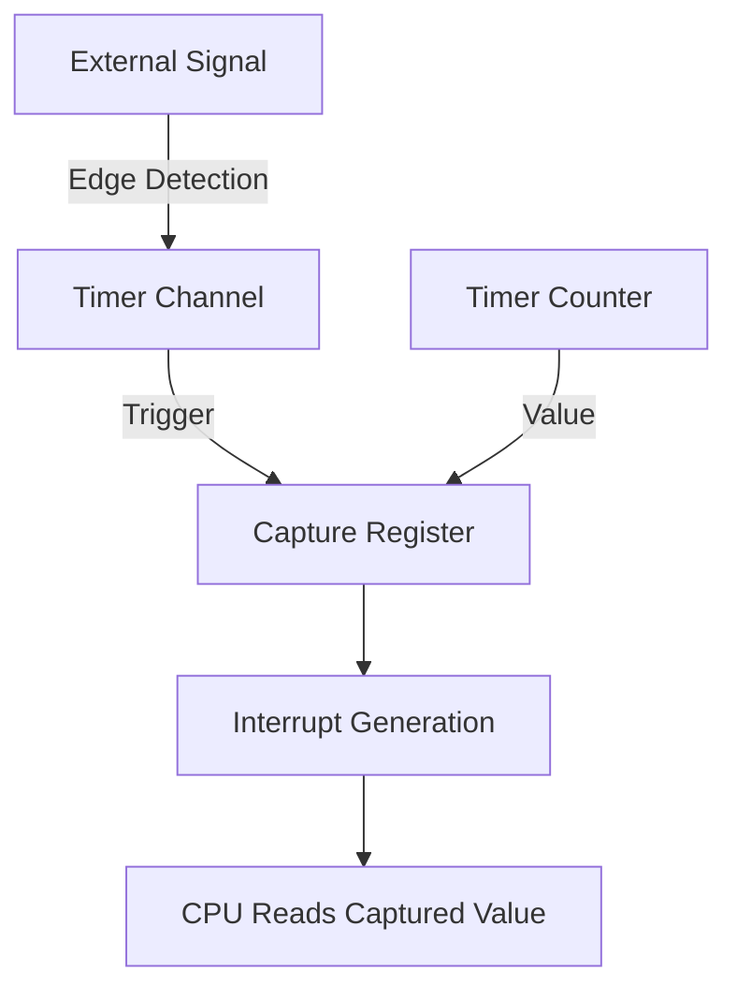

# STM32 Input Capture

## Introduction

Input Capture is one of the most versatile features of STM32 timers. It allows your microcontroller to accurately measure time intervals between external events. This capability is essential for applications such as:

- Measuring the frequency of incoming signals
- Determining pulse width and duty cycle
- Sensing rotation speed with encoders
- Implementing custom communication protocols
- Processing input from ultrasonic sensors

In this tutorial, we'll explore how to configure and use the STM32 Timer Input Capture mode to measure various signal characteristics with high precision.

## Understanding Input Capture

### What is Input Capture?

Input Capture is a timer operating mode that records the timer's counter value when a specific event (typically a signal edge) occurs on an input pin. By capturing timestamps of signal transitions, you can calculate:

- The time between rising or falling edges (period)
- The duration of high or low pulses (pulse width)
- The ratio of high time to total period (duty cycle)

### How Input Capture Works



1. The timer counter continuously counts up or down
2. When a selected edge (rising, falling, or both) occurs on the input pin
3. The current timer counter value is captured into the Capture/Compare register (CCR)
4. An interrupt can be generated to notify your program
5. Your software reads the captured value and performs calculations

## Hardware Configuration

STM32 timers have multiple channels, each capable of input capture. To use this feature, you need to:

1. Connect your input signal to a timer channel pin
2. Configure the GPIO pin as an alternate function for the timer
3. Set up the timer and channel for input capture mode

### Required Timer Resources

For input capture, you'll need:
- A timer with input capture capability (most STM32 timers)
- At least one timer channel configured for input capture
- Proper GPIO configuration for the timer input pin

## Basic Configuration

Let's walk through the steps to set up input capture using STM32CubeIDE:

### Step 1: Configure the GPIO Pin

First, configure the GPIO pin that will receive your input signal:

```c
// Enable GPIO clock
__HAL_RCC_GPIOA_CLK_ENABLE();

// Configure PA0 as TIM2 Channel 1 input
GPIO_InitTypeDef GPIO_InitStruct = {0};
GPIO_InitStruct.Pin = GPIO_PIN_0;
GPIO_InitStruct.Mode = GPIO_MODE_AF_PP;  // Alternate function mode
GPIO_InitStruct.Pull = GPIO_NOPULL;
GPIO_InitStruct.Speed = GPIO_SPEED_FREQ_HIGH;
GPIO_InitStruct.Alternate = GPIO_AF1_TIM2;  // AF1 for TIM2
HAL_GPIO_Init(GPIOA, &GPIO_InitStruct);
```

### Step 2: Configure the Timer for Input Capture

Next, initialize the timer and configure it for input capture:

```c
// Enable TIM2 clock
__HAL_RCC_TIM2_CLK_ENABLE();

// Initialize Timer
TIM_HandleTypeDef htim2 = {0};
htim2.Instance = TIM2;
htim2.Init.Prescaler = 72-1;  // 72MHz / 72 = 1MHz (1μs resolution)
htim2.Init.CounterMode = TIM_COUNTERMODE_UP;
htim2.Init.Period = 0xFFFF;  // Maximum period
htim2.Init.ClockDivision = TIM_CLOCKDIVISION_DIV1;
htim2.Init.AutoReloadPreload = TIM_AUTORELOAD_PRELOAD_DISABLE;
HAL_TIM_IC_Init(&htim2);

// Configure Input Capture Channel
TIM_IC_InitTypeDef sConfig = {0};
sConfig.ICPolarity = TIM_ICPOLARITY_RISING;  // Capture on rising edge
sConfig.ICSelection = TIM_ICSELECTION_DIRECTTI;  // Direct input
sConfig.ICPrescaler = TIM_ICPSC_DIV1;  // Capture every event
sConfig.ICFilter = 0;  // No input filter
HAL_TIM_IC_ConfigChannel(&htim2, &sConfig, TIM_CHANNEL_1);

// Start Input Capture
HAL_TIM_IC_Start_IT(&htim2, TIM_CHANNEL_1);
```

### Step 3: Configure Interrupts

Set up the timer interrupt to handle capture events:

```c
// Enable TIM2 interrupt
HAL_NVIC_SetPriority(TIM2_IRQn, 0, 0);
HAL_NVIC_EnableIRQ(TIM2_IRQn);
```

### Step 4: Implement the Interrupt Handler

Create a handler for the Input Capture interrupts:

```c
// Variables to store captured values
uint32_t captureValue = 0;
uint32_t previousCaptureValue = 0;
uint32_t signalPeriod = 0;
float frequency = 0;

void HAL_TIM_IC_CaptureCallback(TIM_HandleTypeDef *htim)
{
  if (htim->Channel == HAL_TIM_ACTIVE_CHANNEL_1)
  {
    // Read the captured value
    captureValue = HAL_TIM_ReadCapturedValue(htim, TIM_CHANNEL_1);
    
    if (previousCaptureValue != 0)
    {
      // Calculate period (handle timer overflow)
      if (captureValue > previousCaptureValue)
      {
        signalPeriod = captureValue - previousCaptureValue;
      }
      else
      {
        signalPeriod = (0xFFFF - previousCaptureValue) + captureValue + 1;
      }
      
      // Calculate frequency (timer clock = 1MHz)
      frequency = 1000000.0 / signalPeriod;
    }
    
    previousCaptureValue = captureValue;
  }
}

// TIM2 IRQ Handler
void TIM2_IRQHandler(void)
{
  HAL_TIM_IRQHandler(&htim2);
}
```

## Practical Applications

### Example 1: Frequency Measurement

Let's create a complete example for measuring an input signal frequency:

```c
#include "main.h"

TIM_HandleTypeDef htim2;
uint32_t captureValue = 0;
uint32_t previousCaptureValue = 0;
uint32_t signalPeriod = 0;
float frequency = 0;
uint8_t isFirstCapture = 1;

void SystemClock_Config(void);
static void MX_GPIO_Init(void);
static void MX_TIM2_Init(void);

int main(void)
{
  HAL_Init();
  SystemClock_Config();
  
  MX_GPIO_Init();
  MX_TIM2_Init();
  
  // Start Input Capture with interrupt
  HAL_TIM_IC_Start_IT(&htim2, TIM_CHANNEL_1);
  
  while (1)
  {
    // Print frequency every second
    HAL_Delay(1000);
    printf("Signal Frequency: %.2f Hz\r
", frequency);
  }
}

static void MX_TIM2_Init(void)
{
  TIM_IC_InitTypeDef sConfigIC = {0};

  htim2.Instance = TIM2;
  htim2.Init.Prescaler = 72-1;
  htim2.Init.CounterMode = TIM_COUNTERMODE_UP;
  htim2.Init.Period = 0xFFFF;
  htim2.Init.ClockDivision = TIM_CLOCKDIVISION_DIV1;
  htim2.Init.AutoReloadPreload = TIM_AUTORELOAD_PRELOAD_DISABLE;
  HAL_TIM_IC_Init(&htim2);

  sConfigIC.ICPolarity = TIM_ICPOLARITY_RISING;
  sConfigIC.ICSelection = TIM_ICSELECTION_DIRECTTI;
  sConfigIC.ICPrescaler = TIM_ICPSC_DIV1;
  sConfigIC.ICFilter = 0;
  HAL_TIM_IC_ConfigChannel(&htim2, &sConfigIC, TIM_CHANNEL_1);
  
  // Enable TIM2 interrupt
  HAL_NVIC_SetPriority(TIM2_IRQn, 0, 0);
  HAL_NVIC_EnableIRQ(TIM2_IRQn);
}

void HAL_TIM_IC_MspInit(TIM_HandleTypeDef* htim)
{
  GPIO_InitTypeDef GPIO_InitStruct = {0};
  if(htim->Instance == TIM2)
  {
    __HAL_RCC_TIM2_CLK_ENABLE();
    __HAL_RCC_GPIOA_CLK_ENABLE();
    
    // PA0 as TIM2 Channel 1
    GPIO_InitStruct.Pin = GPIO_PIN_0;
    GPIO_InitStruct.Mode = GPIO_MODE_AF_PP;
    GPIO_InitStruct.Pull = GPIO_NOPULL;
    GPIO_InitStruct.Speed = GPIO_SPEED_FREQ_HIGH;
    GPIO_InitStruct.Alternate = GPIO_AF1_TIM2;
    HAL_GPIO_Init(GPIOA, &GPIO_InitStruct);
  }
}

void HAL_TIM_IC_CaptureCallback(TIM_HandleTypeDef *htim)
{
  if (htim->Channel == HAL_TIM_ACTIVE_CHANNEL_1)
  {
    if (isFirstCapture)
    {
      // First capture, just store the value
      previousCaptureValue = HAL_TIM_ReadCapturedValue(htim, TIM_CHANNEL_1);
      isFirstCapture = 0;
    }
    else
    {
      // Subsequent capture
      captureValue = HAL_TIM_ReadCapturedValue(htim, TIM_CHANNEL_1);
      
      // Calculate period (handle timer overflow)
      if (captureValue > previousCaptureValue)
      {
        signalPeriod = captureValue - previousCaptureValue;
      }
      else
      {
        signalPeriod = (0xFFFF - previousCaptureValue) + captureValue + 1;
      }
      
      // Calculate frequency (timer clock = 1MHz)
      frequency = 1000000.0 / signalPeriod;
      
      // Update for next capture
      previousCaptureValue = captureValue;
    }
  }
}

void TIM2_IRQHandler(void)
{
  HAL_TIM_IRQHandler(&htim2);
}
```

### Example 2: Measuring Pulse Width and Duty Cycle

For measuring pulse width and duty cycle, we need to capture both rising and falling edges:

```c
#include "main.h"

TIM_HandleTypeDef htim2;
uint32_t risingEdgeTime = 0;
uint32_t fallingEdgeTime = 0;
uint32_t pulseWidth = 0;
uint32_t signalPeriod = 0;
float dutyCycle = 0;
uint8_t captureState = 0;

void SystemClock_Config(void);
static void MX_GPIO_Init(void);
static void MX_TIM2_Init(void);

int main(void)
{
  HAL_Init();
  SystemClock_Config();
  
  MX_GPIO_Init();
  MX_TIM2_Init();
  
  // Start Input Capture with interrupt
  HAL_TIM_IC_Start_IT(&htim2, TIM_CHANNEL_1);
  
  while (1)
  {
    // Print results every second
    HAL_Delay(1000);
    printf("Pulse Width: %lu us, Duty Cycle: %.2f%%\r
", pulseWidth, dutyCycle);
  }
}

static void MX_TIM2_Init(void)
{
  TIM_IC_InitTypeDef sConfigIC = {0};

  htim2.Instance = TIM2;
  htim2.Init.Prescaler = 72-1;
  htim2.Init.CounterMode = TIM_COUNTERMODE_UP;
  htim2.Init.Period = 0xFFFF;
  htim2.Init.ClockDivision = TIM_CLOCKDIVISION_DIV1;
  htim2.Init.AutoReloadPreload = TIM_AUTORELOAD_PRELOAD_DISABLE;
  HAL_TIM_IC_Init(&htim2);

  // Initially capture rising edge
  sConfigIC.ICPolarity = TIM_ICPOLARITY_RISING;
  sConfigIC.ICSelection = TIM_ICSELECTION_DIRECTTI;
  sConfigIC.ICPrescaler = TIM_ICPSC_DIV1;
  sConfigIC.ICFilter = 0;
  HAL_TIM_IC_ConfigChannel(&htim2, &sConfigIC, TIM_CHANNEL_1);
}

void HAL_TIM_IC_CaptureCallback(TIM_HandleTypeDef *htim)
{
  if (htim->Channel == HAL_TIM_ACTIVE_CHANNEL_1)
  {
    if (captureState == 0)  // Expecting rising edge
    {
      // Capture rising edge time
      risingEdgeTime = HAL_TIM_ReadCapturedValue(htim, TIM_CHANNEL_1);
      
      // Reconfigure for falling edge
      __HAL_TIM_SET_CAPTUREPOLARITY(htim, TIM_CHANNEL_1, TIM_ICPOLARITY_FALLING);
      captureState = 1;
    }
    else if (captureState == 1)  // Expecting falling edge
    {
      // Capture falling edge time
      fallingEdgeTime = HAL_TIM_ReadCapturedValue(htim, TIM_CHANNEL_1);
      
      // Calculate pulse width (handle timer overflow)
      if (fallingEdgeTime > risingEdgeTime)
      {
        pulseWidth = fallingEdgeTime - risingEdgeTime;
      }
      else
      {
        pulseWidth = (0xFFFF - risingEdgeTime) + fallingEdgeTime + 1;
      }
      
      // Reconfigure for next rising edge
      __HAL_TIM_SET_CAPTUREPOLARITY(htim, TIM_CHANNEL_1, TIM_ICPOLARITY_RISING);
      captureState = 2;
    }
    else if (captureState == 2)  // Next rising edge for period
    {
      uint32_t nextRisingEdge = HAL_TIM_ReadCapturedValue(htim, TIM_CHANNEL_1);
      
      // Calculate period (handle timer overflow)
      if (nextRisingEdge > risingEdgeTime)
      {
        signalPeriod = nextRisingEdge - risingEdgeTime;
      }
      else
      {
        signalPeriod = (0xFFFF - risingEdgeTime) + nextRisingEdge + 1;
      }
      
      // Calculate duty cycle
      dutyCycle = (float)pulseWidth / signalPeriod * 100.0;
      
      // Update for next measurement
      risingEdgeTime = nextRisingEdge;
      captureState = 1;
      
      // Reconfigure for falling edge
      __HAL_TIM_SET_CAPTUREPOLARITY(htim, TIM_CHANNEL_1, TIM_ICPOLARITY_FALLING);
    }
  }
}
```

## Advanced Features

### Input Filtering

STM32 timers provide input filtering to eliminate noise on the input signal. The filter samples the input at the timer clock frequency and requires a configurable number of consecutive stable samples before recognizing a signal change:

```c
// Configure input filter (8 samples at timer clock)
sConfig.ICFilter = 0x08;
HAL_TIM_IC_ConfigChannel(&htim2, &sConfig, TIM_CHANNEL_1);
```

Filter values:
- 0: No filtering
- 1-15: Filter with N samples

### Input Prescaler

The input prescaler allows you to capture only after a specified number of events, useful for high-frequency signals:

```c
// Capture every 4th event
sConfig.ICPrescaler = TIM_ICPSC_DIV4;
HAL_TIM_IC_ConfigChannel(&htim2, &sConfig, TIM_CHANNEL_1);
```

Options:
- TIM_ICPSC_DIV1: Capture every event (no prescaler)
- TIM_ICPSC_DIV2: Capture every 2nd event
- TIM_ICPSC_DIV4: Capture every 4th event
- TIM_ICPSC_DIV8: Capture every 8th event

### Dual Edge Capture

Some STM32 timers support dual edge capture, using two channels to capture different edges of the same signal:

```c
// Configure for dual edge capture
// Channel 1 for rising edge
sConfig1.ICPolarity = TIM_ICPOLARITY_RISING;
sConfig1.ICSelection = TIM_ICSELECTION_DIRECTTI;
sConfig1.ICPrescaler = TIM_ICPSC_DIV1;
sConfig1.ICFilter = 0;
HAL_TIM_IC_ConfigChannel(&htim, &sConfig1, TIM_CHANNEL_1);

// Channel 2 for falling edge on same input
sConfig2.ICPolarity = TIM_ICPOLARITY_FALLING;
sConfig2.ICSelection = TIM_ICSELECTION_INDIRECTTI;  // Indirect (same as CH1)
sConfig2.ICPrescaler = TIM_ICPSC_DIV1;
sConfig2.ICFilter = 0;
HAL_TIM_IC_ConfigChannel(&htim, &sConfig2, TIM_CHANNEL_2);
```

## Common Issues and Troubleshooting

### Timer Overflow Handling

When measuring long periods, the timer might overflow. Always check for this condition:

```c
// Calculate period with overflow handling
if (currentCapture >= previousCapture)
{
  period = currentCapture - previousCapture;
}
else
{
  period = (0xFFFF - previousCapture) + currentCapture + 1;
}
```

### Input Signal Not Detected

If your input capture is not working:

1. Check GPIO configuration (correct pin and alternate function)
2. Verify signal levels are compatible with STM32 input thresholds
3. Ensure proper pull-up/pull-down resistors if needed
4. Try adding input filtering to eliminate noise

### Inaccurate Measurements

For precise measurements:

1. Choose appropriate timer clock frequency (prescaler value)
2. Consider using a timer with a larger counter (e.g., 32-bit timer)
3. Use Direct Memory Access (DMA) for continuous captures without CPU intervention
4. For high-frequency signals, use input prescaler to avoid missing events

## Real-World Applications

### Ultrasonic Distance Measurement

Input capture is perfect for ultrasonic sensors that require precise timing:

```c
// Simplified ultrasonic sensor code
#include "main.h"

TIM_HandleTypeDef htim2;
uint32_t echoStart = 0;
uint32_t echoEnd = 0;
uint32_t echoTime = 0;
float distance = 0;  // in cm

int main(void)
{
  // ... initialization code ...
  
  while (1)
  {
    // Trigger ultrasonic sensor (10μs pulse on TRIG pin)
    HAL_GPIO_WritePin(TRIG_GPIO_Port, TRIG_Pin, GPIO_PIN_SET);
    HAL_Delay_us(10);
    HAL_GPIO_WritePin(TRIG_GPIO_Port, TRIG_Pin, GPIO_PIN_RESET);
    
    // Wait for measurement to complete
    HAL_Delay(100);
    
    // Calculate distance (sound speed = 343 m/s)
    distance = (echoTime * 0.0343) / 2;  // divide by 2 (round trip)
    
    printf("Distance: %.2f cm\r
", distance);
    HAL_Delay(500);
  }
}

void HAL_TIM_IC_CaptureCallback(TIM_HandleTypeDef *htim)
{
  if (htim->Channel == HAL_TIM_ACTIVE_CHANNEL_1)
  {
    if (HAL_GPIO_ReadPin(ECHO_GPIO_Port, ECHO_Pin) == GPIO_PIN_SET)
    {
      // Rising edge (echo start)
      echoStart = HAL_TIM_ReadCapturedValue(htim, TIM_CHANNEL_1);
      // Change polarity to capture falling edge
      __HAL_TIM_SET_CAPTUREPOLARITY(htim, TIM_CHANNEL_1, TIM_ICPOLARITY_FALLING);
    }
    else
    {
      // Falling edge (echo end)
      echoEnd = HAL_TIM_ReadCapturedValue(htim, TIM_CHANNEL_1);
      
      // Calculate echo time in microseconds
      if (echoEnd > echoStart)
      {
        echoTime = echoEnd - echoStart;
      }
      else
      {
        echoTime = (0xFFFF - echoStart) + echoEnd + 1;
      }
      
      // Reset for next measurement
      __HAL_TIM_SET_CAPTUREPOLARITY(htim, TIM_CHANNEL_1, TIM_ICPOLARITY_RISING);
    }
  }
}
```

### RPM Measurement for Motors

Input capture can measure rotation speed using Hall effect sensors or encoders:

```c
// RPM measurement code
#include "main.h"

TIM_HandleTypeDef htim2;
uint32_t lastCapture = 0;
uint32_t currentCapture = 0;
uint32_t pulseTime = 0;
float rpm = 0;
const uint8_t PULSES_PER_REVOLUTION = 4;  // Depends on your encoder

int main(void)
{
  // ... initialization code ...
  
  while (1)
  {
    // Convert pulse time to RPM
    // RPM = (60 seconds * timer frequency) / (pulses per rev * pulse time)
    if (pulseTime > 0)
    {
      rpm = (60.0 * 1000000) / (PULSES_PER_REVOLUTION * pulseTime);
      printf("Motor Speed: %.2f RPM\r
", rpm);
    }
    else
    {
      printf("Motor stopped\r
");
    }
    
    HAL_Delay(500);
  }
}

void HAL_TIM_IC_CaptureCallback(TIM_HandleTypeDef *htim)
{
  if (htim->Channel == HAL_TIM_ACTIVE_CHANNEL_1)
  {
    currentCapture = HAL_TIM_ReadCapturedValue(htim, TIM_CHANNEL_1);
    
    if (lastCapture != 0)
    {
      // Calculate time between pulses
      if (currentCapture > lastCapture)
      {
        pulseTime = currentCapture - lastCapture;
      }
      else
      {
        pulseTime = (0xFFFF - lastCapture) + currentCapture + 1;
      }
      
      // If no pulse for a long time, consider motor stopped
      if (pulseTime > 1000000)  // 1 second
      {
        pulseTime = 0;
      }
    }
    
    lastCapture = currentCapture;
  }
}
```

## Summary

STM32 Input Capture is a powerful feature that allows precise timing measurements of external signals. In this tutorial, we've covered:

- The basic principles of input capture
- How to configure timers and GPIO for input capture
- Implementing frequency, pulse width, and duty cycle measurement
- Advanced features like input filtering and prescaling
- Real-world applications including ultrasonic sensors and motor speed measurement

STM32's flexible timer system makes it possible to handle a wide range of timing requirements with high precision, making it ideal for various embedded applications where time measurement is critical.

## Exercises

1. Implement a frequency counter that displays the result on an LCD display
2. Create a PWM signal with one timer, then measure its duty cycle using input capture on another timer
3. Build an ultrasonic distance measurement system with input capture
4. Implement a tachometer for measuring motor RPM
5. Create a system that measures the time between button presses using input capture

## Additional Resources

- STM32 Reference Manual (RM0383) - Timer section
- STM32 Application Note AN4013: STM32 cross-series timer overview
- STM32 Application Note AN4776: General-purpose timer cookbook
- HAL Timer API documentation