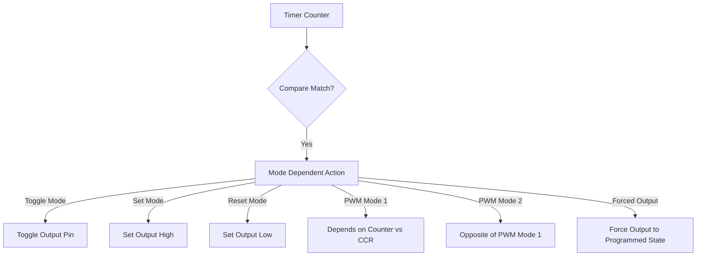

# STM32 Output Compare

## Introduction

Output Compare (OC) is one of the most powerful and useful features of STM32 timers. It allows you to generate precise timing signals, pulses, and waveforms by comparing the timer's counter value with a predefined value. When these values match, the timer can automatically trigger various actions like toggling an output pin, generating an interrupt, or starting another peripheral.

In this tutorial, we'll explore how the Output Compare feature works, how to configure it, and implement several practical applications including precise timing signals, PWM generation, and motor control.

## Understanding Output Compare

Output Compare works by continuously comparing the timer's counter value with a preset compare value. When these values match, the timer can:

1. Generate an interrupt
2. Modify an output pin's state (set high, set low, toggle, etc.)
3. Trigger actions in other peripherals via the STM32's internal interconnect

### Key Components of Output Compare

- **Compare Register**: Holds the value to be compared with the counter
- **Output Compare Mode**: Defines what happens when a match occurs (toggle, set high, set low, PWM, etc.)
- **Output Compare Channel**: STM32 timers typically have multiple independent OC channels (usually 2-4)
- **Output Compare Preload**: Allows buffering new compare values until a specific event

## Basic Output Compare Configuration

Let's start with a simple example where we'll use Output Compare to generate a precise 1 kHz square wave.

### Step 1: Initialize the GPIO

First, we need to configure the GPIO pin connected to the timer's output channel:

```c
void GPIO_Config(void) {
  // Enable clock for GPIOA
  RCC->AHB1ENR |= RCC_AHB1ENR_GPIOAEN;
  
  // Configure PA5 as alternate function (TIM2_CH1)
  GPIOA->MODER &= ~GPIO_MODER_MODER5_0;
  GPIOA->MODER |= GPIO_MODER_MODER5_1;
  
  // Set alternate function AF1 (TIM2) for PA5
  GPIOA->AFR[0] &= ~GPIO_AFRL_AFRL5;
  GPIOA->AFR[0] |= (1 << (4 * 5)); // AF1 = 0001
}
```

### Step 2: Configure the Timer

Now, let's configure Timer 2 with channel 1 in Toggle mode for a 1 kHz square wave:

```c
void TIM2_Config(void) {
  // Enable clock for TIM2
  RCC->APB1ENR |= RCC_APB1ENR_TIM2EN;
  
  // Set prescaler: assuming 84 MHz clock, divide by 84 to get 1 MHz
  TIM2->PSC = 84 - 1;
  
  // Set auto-reload value for 1 kHz toggle (500 Hz actual wave)
  // 1 MHz / 1000 = 1000
  TIM2->ARR = 1000 - 1;
  
  // Set compare value to half of ARR for 50% duty cycle
  TIM2->CCR1 = 500 - 1;
  
  // Configure Output Compare mode to Toggle on match
  TIM2->CCMR1 &= ~TIM_CCMR1_OC1M;
  TIM2->CCMR1 |= TIM_CCMR1_OC1M_0 | TIM_CCMR1_OC1M_1; // Toggle mode
  
  // Enable Output Compare preload
  TIM2->CCMR1 |= TIM_CCMR1_OC1PE;
  
  // Enable the output
  TIM2->CCER |= TIM_CCER_CC1E;
  
  // Enable counter
  TIM2->CR1 |= TIM_CR1_CEN;
}
```

### Step 3: Main Function

Finally, let's put everything together:

```c
int main(void) {
  // System clock configuration (assuming 84 MHz)
  SystemClock_Config();
  
  // Initialize peripherals
  GPIO_Config();
  TIM2_Config();
  
  while (1) {
    // The output compare is working automatically in hardware
    // No CPU intervention needed!
  }
}
```

## Output Compare Modes

STM32 timers support several output compare modes for different applications:

### 1. Toggle Mode

The output toggles each time the counter matches the compare value.

### 2. Active/Inactive Mode

The output is set to active level (typically high) when the counter matches the compare value, and to inactive level (typically low) when the counter matches another value or resets.

### 3. PWM Mode 1 and Mode 2

- **PWM Mode 1**: Output is active when counter < compare value, inactive when counter ≥ compare value
- **PWM Mode 2**: Output is inactive when counter < compare value, active when counter ≥ compare value

### 4. Forced Output Mode

Allows software to force the output to a specific state regardless of the compare match.

Let's visualize the difference between these modes:



## Practical Applications

### 1. Generating PWM Signals for Motor Control

PWM (Pulse Width Modulation) is commonly used for controlling DC motors. Here's how to set up a basic PWM signal:

```c
void PWM_Config(void) {
  // Enable clock for TIM3
  RCC->APB1ENR |= RCC_APB1ENR_TIM3EN;
  
  // Enable clock for GPIOC
  RCC->AHB1ENR |= RCC_AHB1ENR_GPIOCEN;
  
  // Configure PC7 as alternate function (TIM3_CH2)
  GPIOC->MODER &= ~GPIO_MODER_MODER7_0;
  GPIOC->MODER |= GPIO_MODER_MODER7_1;
  
  // Set alternate function AF2 (TIM3) for PC7
  GPIOC->AFR[0] &= ~GPIO_AFRL_AFRL7;
  GPIOC->AFR[0] |= (2 << (4 * 7)); // AF2 = 0010
  
  // Set prescaler: assuming 84 MHz clock, divide by 84 to get 1 MHz
  TIM3->PSC = 84 - 1;
  
  // Set auto-reload value for 20 kHz PWM frequency
  // 1 MHz / 20 kHz = 50
  TIM3->ARR = 50 - 1;
  
  // Set compare value for 50% duty cycle initially
  TIM3->CCR2 = 25 - 1;
  
  // Configure Output Compare mode to PWM mode 1
  TIM3->CCMR1 &= ~TIM_CCMR1_OC2M;
  TIM3->CCMR1 |= TIM_CCMR1_OC2M_1 | TIM_CCMR1_OC2M_2; // PWM mode 1
  
  // Enable Output Compare preload
  TIM3->CCMR1 |= TIM_CCMR1_OC2PE;
  
  // Enable the output
  TIM3->CCER |= TIM_CCER_CC2E;
  
  // Enable counter
  TIM3->CR1 |= TIM_CR1_CEN;
}

// Function to set motor speed (0-100%)
void setMotorSpeed(uint8_t speed) {
  // Ensure speed is within 0-100%
  if (speed > 100) speed = 100;
  
  // Calculate CCR value (0-100% maps to 0-ARR)
  uint32_t ccr_value = ((TIM3->ARR + 1) * speed) / 100;
  
  // Update CCR register
  TIM3->CCR2 = ccr_value;
}
```

### 2. Generating Precise Timing Signals

Output Compare can generate precise timing signals for protocols like infrared remote control:

```c
void IR_Transmit_Config(void) {
  // Enable clock for TIM4
  RCC->APB1ENR |= RCC_APB1ENR_TIM4EN;
  
  // Configure GPIO (simplified)
  // ...
  
  // Set prescaler for 38 kHz carrier frequency
  TIM4->PSC = 55 - 1; // 84 MHz / 56 = 1.5 MHz
  
  // Set auto-reload value for 38 kHz (1.5 MHz / 38 kHz ≈ 39)
  TIM4->ARR = 39 - 1;
  
  // Set compare value for 33% duty cycle
  TIM4->CCR1 = 13 - 1;
  
  // Configure Output Compare mode to PWM mode 1
  TIM4->CCMR1 &= ~TIM_CCMR1_OC1M;
  TIM4->CCMR1 |= TIM_CCMR1_OC1M_1 | TIM_CCMR1_OC1M_2; // PWM mode 1
  
  // Enable Output Compare preload
  TIM4->CCMR1 |= TIM_CCMR1_OC1PE;
  
  // Enable the output
  TIM4->CCER |= TIM_CCER_CC1E;
  
  // Don't start the timer yet - we'll control it for each IR pulse
}

void sendIRPulse(uint16_t durationMs) {
  // Start the timer
  TIM4->CR1 |= TIM_CR1_CEN;
  
  // Wait for the specified duration
  HAL_Delay(durationMs);
  
  // Stop the timer
  TIM4->CR1 &= ~TIM_CR1_CEN;
}
```

### 3. LED Brightness Control

PWM is also perfect for controlling LED brightness:

```c
void LED_PWM_Config(void) {
  // Enable clock for TIM1
  RCC->APB2ENR |= RCC_APB2ENR_TIM1EN;
  
  // Configure GPIO (simplified)
  // ...
  
  // Set prescaler for 100 Hz PWM frequency with 1000 steps
  // 84 MHz / 840 = 100 kHz
  TIM1->PSC = 840 - 1;
  
  // Set auto-reload value for 100 Hz
  // 100 kHz / 100 Hz = 1000
  TIM1->ARR = 1000 - 1;
  
  // Set compare value for initial brightness (0%)
  TIM1->CCR1 = 0;
  
  // Configure Output Compare mode to PWM mode 1
  TIM1->CCMR1 &= ~TIM_CCMR1_OC1M;
  TIM1->CCMR1 |= TIM_CCMR1_OC1M_1 | TIM_CCMR1_OC1M_2; // PWM mode 1
  
  // Enable Output Compare preload
  TIM1->CCMR1 |= TIM_CCMR1_OC1PE;
  
  // Enable the output and complementary output
  TIM1->CCER |= TIM_CCER_CC1E;
  
  // Enable counter and outputs
  TIM1->BDTR |= TIM_BDTR_MOE; // Main output enable
  TIM1->CR1 |= TIM_CR1_CEN;   // Counter enable
}

// Function to set LED brightness (0-100%)
void setLEDBrightness(uint8_t brightness) {
  // Ensure brightness is within 0-100%
  if (brightness > 100) brightness = 100;
  
  // Calculate CCR value (0-100% maps to 0-ARR)
  uint32_t ccr_value = ((TIM1->ARR + 1) * brightness) / 100;
  
  // Update CCR register
  TIM1->CCR1 = ccr_value;
}
```

## Advanced Techniques

### 1. Using Multiple Output Compare Channels

STM32 timers typically have multiple OC channels that can be used independently:

```c
void MultiChannel_PWM_Config(void) {
  // Timer configuration (simplified)
  // ...
  
  // Configure Channel 1 for 25% duty cycle
  TIM1->CCR1 = ((TIM1->ARR + 1) * 25) / 100;
  TIM1->CCMR1 |= TIM_CCMR1_OC1M_1 | TIM_CCMR1_OC1M_2;
  TIM1->CCMR1 |= TIM_CCMR1_OC1PE;
  TIM1->CCER |= TIM_CCER_CC1E;
  
  // Configure Channel 2 for 50% duty cycle
  TIM1->CCR2 = ((TIM1->ARR + 1) * 50) / 100;
  TIM1->CCMR1 |= TIM_CCMR1_OC2M_1 | TIM_CCMR1_OC2M_2;
  TIM1->CCMR1 |= TIM_CCMR1_OC2PE;
  TIM1->CCER |= TIM_CCER_CC2E;
  
  // Configure Channel 3 for 75% duty cycle
  TIM1->CCR3 = ((TIM1->ARR + 1) * 75) / 100;
  TIM1->CCMR2 |= TIM_CCMR2_OC3M_1 | TIM_CCMR2_OC3M_2;
  TIM1->CCMR2 |= TIM_CCMR2_OC3PE;
  TIM1->CCER |= TIM_CCER_CC3E;
}
```

### 2. Combining Output Compare with Input Capture

You can use some channels for output compare and others for input capture:

```c
void Combined_IC_OC_Config(void) {
  // Configure TIM2_CH1 as Input Capture to measure frequency
  TIM2->CCMR1 |= TIM_CCMR1_CC1S_0; // IC1 maps to TI1
  
  // Configure TIM2_CH2 as Output Compare for PWM generation
  TIM2->CCR2 = 500;                  // 50% duty cycle
  TIM2->CCMR1 |= TIM_CCMR1_OC2M_1 | TIM_CCMR1_OC2M_2; // PWM mode 1
  TIM2->CCMR1 |= TIM_CCMR1_OC2PE;    // Enable preload
  TIM2->CCER |= TIM_CCER_CC2E;       // Enable output
}
```

### 3. Generating Complex Waveforms

By dynamically changing the output compare value, you can generate complex waveforms:

```c
void GenerateComplexWaveform(void) {
  static uint16_t waveform[] = {
    100, 200, 400, 800, 1000, 800, 400, 200
  };
  static uint8_t index = 0;
  
  // Wait for the update event
  while (!(TIM3->SR & TIM_SR_UIF));
  TIM3->SR &= ~TIM_SR_UIF; // Clear update flag
  
  // Set new compare value
  TIM3->CCR1 = waveform[index];
  
  // Move to next value
  index = (index + 1) % 8;
}
```

## Output Compare Timing and Interrupts

For precise timing or to handle events exactly when a compare match occurs, you can use the output compare interrupt:

```c
void TIM2_OutputCompare_IRQ_Config(void) {
  // Timer configuration (simplified)
  // ...
  
  // Enable output compare interrupt for channel 1
  TIM2->DIER |= TIM_DIER_CC1IE;
  
  // Enable TIM2 interrupt in NVIC
  NVIC_EnableIRQ(TIM2_IRQn);
  NVIC_SetPriority(TIM2_IRQn, 0);
}

// IRQ handler
void TIM2_IRQHandler(void) {
  if (TIM2->SR & TIM_SR_CC1IF) {
    TIM2->SR &= ~TIM_SR_CC1IF; // Clear interrupt flag
    
    // Your precise timing code here
    // This executes exactly when the compare match occurs
    toggleLED();
  }
}
```

## Common Challenges and Solutions

### 1. PWM Signal Glitches

When changing the duty cycle or frequency during operation, you might observe glitches in the output signal. To avoid this:

```c
void CleanPWMUpdate(uint16_t newDutyCycle) {
  // Wait for update event to ensure synchronized update
  TIM3->CCR1 = newDutyCycle;
  
  // Option 1: Wait for update event
  while (!(TIM3->SR & TIM_SR_UIF));
  TIM3->SR &= ~TIM_SR_UIF;
  
  // Option 2: Force an update
  TIM3->EGR |= TIM_EGR_UG;
}
```

### 2. Deadtime Insertion for Complementary Outputs

For applications like motor control where you need to avoid shoot-through:

```c
void ConfigDeadtime(void) {
  // Configure complementary outputs (CH1 and CH1N)
  TIM1->CCER |= TIM_CCER_CC1E | TIM_CCER_CC1NE;
  
  // Set deadtime value (in timer clock cycles)
  // For 1 µs deadtime at 84 MHz: 84 cycles
  TIM1->BDTR &= ~TIM_BDTR_DTG;
  TIM1->BDTR |= 84 & TIM_BDTR_DTG;
  
  // Enable main output
  TIM1->BDTR |= TIM_BDTR_MOE;
}
```

## Real-World Example: Servo Motor Control

Servo motors typically require a 50 Hz PWM signal with pulse widths between 1 ms (0°) and 2 ms (180°):

```c
void Servo_Control_Config(void) {
  // Enable clock for TIM2
  RCC->APB1ENR |= RCC_APB1ENR_TIM2EN;
  
  // Configure GPIO (simplified)
  // ...
  
  // Set prescaler: assuming 84 MHz clock, divide by 84 to get 1 MHz
  TIM2->PSC = 84 - 1;
  
  // Set auto-reload value for 50 Hz
  // 1 MHz / 50 Hz = 20000
  TIM2->ARR = 20000 - 1;
  
  // Set compare value for 1.5 ms pulse (90° position)
  TIM2->CCR1 = 1500 - 1;
  
  // Configure Output Compare mode to PWM mode 1
  TIM2->CCMR1 &= ~TIM_CCMR1_OC1M;
  TIM2->CCMR1 |= TIM_CCMR1_OC1M_1 | TIM_CCMR1_OC1M_2; // PWM mode 1
  
  // Enable Output Compare preload
  TIM2->CCMR1 |= TIM_CCMR1_OC1PE;
  
  // Enable the output
  TIM2->CCER |= TIM_CCER_CC1E;
  
  // Enable counter
  TIM2->CR1 |= TIM_CR1_CEN;
}

// Function to set servo angle (0-180 degrees)
void setServoAngle(uint8_t angle) {
  // Ensure angle is within 0-180°
  if (angle > 180) angle = 180;
  
  // Map 0-180° to 1000-2000 µs
  uint32_t pulse_width = 1000 + (angle * 1000 / 180);
  
  // Update CCR register
  TIM2->CCR1 = pulse_width - 1;
}
```

## Summary

Output Compare is a powerful feature of STM32 timers that offers:

1. Precise signal generation with minimal CPU overhead
2. Multiple output modes for different applications
3. Flexible configuration for various timing and control needs
4. Capability to handle complex timing sequences

By mastering STM32's Output Compare functionality, you can implement precise timing for various applications from simple LED control to complex motor control systems, all while minimizing CPU load.

## Additional Resources

- [ST's Application Note AN4013](https://www.st.com/resource/en/application_note/an4013-stm32-crossseries-timer-overview-stmicroelectronics.pdf) - STM32 cross-series timer overview
- [ST's RM0383 Reference Manual](https://www.st.com/resource/en/reference_manual/dm00031020-stm32f405-415-stm32f407-417-stm32f427-437-and-stm32f429-439-advanced-arm-based-32-bit-mcus-stmicroelectronics.pdf) - Detailed timer documentation for STM32F4

## Exercises

1. **Basic Output Compare**: Modify the first example to generate a 2 kHz square wave instead of 1 kHz.

2. **PWM Breathing LED**: Create a "breathing" effect on an LED by gradually increasing and decreasing its brightness using PWM.

3. **Multi-Channel PWM**: Configure three PWM channels with different frequencies and duty cycles.

4. **Servo Control**: Implement a program that smoothly moves a servo from 0° to 180° and back in steps.

5. **Advanced Challenge**: Create a complex waveform generator that can produce multiple predefined patterns (sine, triangle, sawtooth) using Output Compare.