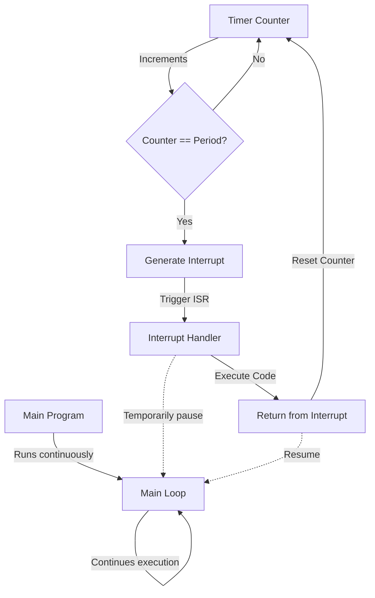

# STM32 Timer Interrupts

## Introduction

Timer interrupts are one of the most powerful features of the STM32 microcontroller family. They allow you to execute specific code at precise intervals without having your main program continuously check the timer status (polling). This capability is fundamental for many embedded applications where timing is critical.

In this tutorial, we'll explore how timer interrupts work on STM32 microcontrollers, how to configure them, and how to implement them in your projects. By the end, you'll be able to use timer interrupts to create precise timing events in your applications.

## Timer Interrupts Fundamentals

### What is a Timer Interrupt?

A timer interrupt is a hardware mechanism that triggers a special function (an Interrupt Service Routine or ISR) when a timer reaches a specific value or condition. This happens automatically, regardless of what your main code is doing at that moment.

### Advantages of Timer Interrupts

- **Precise timing**: Events occur at exact intervals
- **CPU efficiency**: No need to waste CPU cycles checking timer status
- **Multitasking**: Main code continues running while timing events are handled automatically
- **Responsiveness**: Immediate reaction to timer events

### Timer Interrupt Events

STM32 timers can generate interrupts on various events:

- **Update**: When the counter overflows or underflows
- **Capture/Compare**: When the counter matches a predefined value
- **Break**: On external events (for advanced timers)

## Setting Up Timer Interrupts

Let's go through the process of configuring a basic timer interrupt on an STM32F4 microcontroller using the STM32CubeMX and HAL libraries.

### Basic Configuration Steps

1. Configure the timer clock source and prescaler
2. Set the timer's period (auto-reload value)
3. Enable the desired interrupt(s)
4. Configure the NVIC (Nested Vector Interrupt Controller)
5. Write the interrupt handler function
6. Start the timer

### Example: 1-Second Timer Interrupt

Let's create a timer interrupt that triggers every second and toggles an LED.

#### Hardware Setup

- STM32F4 development board (e.g., STM32F4Discovery)
- LED connected to pin PA5 (usually built-in on most development boards)

#### CubeMX Configuration

First, we'll configure the timer using STM32CubeMX:

1. Open STM32CubeMX and create a new project
2. Select your STM32 board or microcontroller
3. Configure PA5 as GPIO_Output for the LED
4. Enable TIM2 with the following settings:
   - Clock Source: Internal Clock
   - Prescaler: 8400-1 (assuming 84 MHz system clock)
   - Counter Period: 10000-1
   - This gives us: 84MHz ÷ 8400 ÷ 10000 = 1 Hz (1 second period)
5. Enable the TIM2 global interrupt in the NVIC settings
6. Generate the code

#### Code Implementation

Here's the complete code for our 1-second timer interrupt example:

```c
/* Includes ------------------------------------------------------------------*/
#include "main.h"
#include "tim.h"
#include "gpio.h"

/* Private function prototypes -----------------------------------------------*/
void SystemClock_Config(void);

/* Private user code ---------------------------------------------------------*/
int main(void)
{
  /* MCU Configuration--------------------------------------------------------*/
  HAL_Init();
  SystemClock_Config();
  
  /* Initialize all configured peripherals */
  MX_GPIO_Init();
  MX_TIM2_Init();
  
  /* Start timer with interrupt */
  HAL_TIM_Base_Start_IT(&htim2);
  
  /* Infinite loop */
  while (1)
  {
    /* Main code runs here continuously */
    /* You can do other tasks here without worrying about LED timing */
  }
}

/* Timer callback function - called automatically when timer interrupt occurs */
void HAL_TIM_PeriodElapsedCallback(TIM_HandleTypeDef *htim)
{
  if(htim->Instance == TIM2)
  {
    /* Toggle LED */
    HAL_GPIO_TogglePin(GPIOA, GPIO_PIN_5);
  }
}
```

In this example:

1. The timer (TIM2) is configured to count from 0 to 9999 (10000 counts)
2. The prescaler divides the timer clock by 8400
3. When the timer reaches its period, it generates an interrupt
4. The interrupt handler `HAL_TIM_PeriodElapsedCallback()` is called
5. Inside the handler, we check if it was TIM2 that triggered the interrupt
6. If so, we toggle the LED

## Advanced Timer Interrupt Techniques

Now let's look at some more advanced techniques for working with timer interrupts.

### Using Multiple Timer Interrupts

You can configure multiple timers to generate interrupts at different intervals:

```c
/* Initialize multiple timers */
MX_TIM2_Init();  // For 1Hz LED toggle
MX_TIM3_Init();  // For 100Hz sensor reading
MX_TIM4_Init();  // For 10kHz control loop

/* Start all timers with interrupts */
HAL_TIM_Base_Start_IT(&htim2);
HAL_TIM_Base_Start_IT(&htim3);
HAL_TIM_Base_Start_IT(&htim4);

/* Timer callback handles all timer interrupts */
void HAL_TIM_PeriodElapsedCallback(TIM_HandleTypeDef *htim)
{
  if(htim->Instance == TIM2)
  {
    /* 1Hz: Toggle LED */
    HAL_GPIO_TogglePin(GPIOA, GPIO_PIN_5);
  }
  else if(htim->Instance == TIM3)
  {
    /* 100Hz: Read sensor */
    readSensorData();
  }
  else if(htim->Instance == TIM4)
  {
    /* 10kHz: Update control loop */
    updateControlLoop();
  }
}
```

### Using Capture/Compare Interrupts

Besides update events, you can also generate interrupts when the timer matches specific values:

```c
/* Initialize timer with capture/compare */
MX_TIM1_Init();

/* Start timer with capture/compare interrupt */
HAL_TIM_OC_Start_IT(&htim1, TIM_CHANNEL_1);

/* Capture/Compare callback */
void HAL_TIM_OC_DelayElapsedCallback(TIM_HandleTypeDef *htim)
{
  if(htim->Instance == TIM1)
  {
    if(htim->Channel == HAL_TIM_ACTIVE_CHANNEL_1)
    {
      /* Process event for channel 1 */
      processTimedEvent();
      
      /* Modify compare value for next interrupt if needed */
      __HAL_TIM_SET_COMPARE(htim, TIM_CHANNEL_1, 
                          __HAL_TIM_GET_COMPARE(htim, TIM_CHANNEL_1) + 1000);
    }
  }
}
```

### Timer Interrupt Priority

You can adjust the priority of timer interrupts to ensure that critical timing events are handled first:

```c
/* Configure NVIC priority for TIM2 */
HAL_NVIC_SetPriority(TIM2_IRQn, 0, 0);  // Highest priority

/* Configure NVIC priority for TIM3 */
HAL_NVIC_SetPriority(TIM3_IRQn, 1, 0);  // Medium priority

/* Configure NVIC priority for TIM4 */
HAL_NVIC_SetPriority(TIM4_IRQn, 2, 0);  // Lower priority
```

## Real-World Applications

### PWM Generation with Variable Duty Cycle

This example shows how to use timer interrupts to change PWM duty cycle over time:

```c
/* PWM variables */
uint32_t pwmValue = 0;
uint8_t increasing = 1;

/* Initialize PWM timer */
MX_TIM1_Init();

/* Start PWM on channel 1 */
HAL_TIM_PWM_Start(&htim1, TIM_CHANNEL_1);

/* Start update interrupt on timer 2 (slow timer for updates) */
HAL_TIM_Base_Start_IT(&htim2);

/* Timer 2 callback to update PWM value */
void HAL_TIM_PeriodElapsedCallback(TIM_HandleTypeDef *htim)
{
  if(htim->Instance == TIM2)
  {
    /* Update PWM value (fade effect) */
    if(increasing)
    {
      pwmValue += 10;
      if(pwmValue >= 1000)
        increasing = 0;
    }
    else
    {
      pwmValue -= 10;
      if(pwmValue <= 0)
        increasing = 1;
    }
    
    /* Update duty cycle */
    __HAL_TIM_SET_COMPARE(&htim1, TIM_CHANNEL_1, pwmValue);
  }
}
```

### Precise Data Sampling

This example shows how to sample data at a precise rate:

```c
/* ADC and data buffer variables */
uint16_t adcValue = 0;
uint16_t dataBuffer[100];
uint8_t bufferIndex = 0;

/* Initialize peripherals */
MX_ADC1_Init();
MX_TIM3_Init();

/* Start ADC in interrupt mode */
HAL_ADC_Start_IT(&hadc1);

/* Start timer for precise sampling */
HAL_TIM_Base_Start_IT(&htim3);

/* Timer callback for sampling trigger */
void HAL_TIM_PeriodElapsedCallback(TIM_HandleTypeDef *htim)
{
  if(htim->Instance == TIM3)
  {
    /* Start ADC conversion at precise intervals */
    HAL_ADC_Start_IT(&hadc1);
  }
}

/* ADC conversion complete callback */
void HAL_ADC_ConvCpltCallback(ADC_HandleTypeDef* hadc)
{
  if(hadc->Instance == ADC1)
  {
    /* Get ADC value */
    adcValue = HAL_ADC_GetValue(&hadc1);
    
    /* Store in buffer */
    dataBuffer[bufferIndex] = adcValue;
    
    /* Update buffer index */
    bufferIndex = (bufferIndex + 1) % 100;
  }
}
```

### State Machine with Timeouts

This example implements a simple state machine with timer-based transitions:

```c
/* State machine variables */
typedef enum {
  STATE_IDLE,
  STATE_ACTIVE,
  STATE_WAITING,
  STATE_ERROR
} SystemState;

SystemState currentState = STATE_IDLE;
uint32_t stateTimeout = 0;

/* Initialize timer */
MX_TIM2_Init();

/* Start timer */
HAL_TIM_Base_Start_IT(&htim2);

/* Timer callback */
void HAL_TIM_PeriodElapsedCallback(TIM_HandleTypeDef *htim)
{
  if(htim->Instance == TIM2)
  {
    /* Process state machine */
    switch(currentState)
    {
      case STATE_IDLE:
        /* Check for activation conditions */
        if(HAL_GPIO_ReadPin(BUTTON_GPIO_Port, BUTTON_Pin) == GPIO_PIN_SET)
        {
          currentState = STATE_ACTIVE;
          stateTimeout = 100; /* 100 timer ticks timeout */
          HAL_GPIO_WritePin(LED_GPIO_Port, LED_Pin, GPIO_PIN_SET);
        }
        break;
        
      case STATE_ACTIVE:
        /* Decrement timeout */
        if(stateTimeout > 0)
        {
          stateTimeout--;
        }
        else
        {
          /* Timeout expired, move to waiting state */
          currentState = STATE_WAITING;
          stateTimeout = 50; /* 50 timer ticks timeout */
          HAL_GPIO_WritePin(LED_GPIO_Port, LED_Pin, GPIO_PIN_RESET);
        }
        break;
        
      case STATE_WAITING:
        /* Decrement timeout */
        if(stateTimeout > 0)
        {
          stateTimeout--;
        }
        else
        {
          /* Timeout expired, back to idle */
          currentState = STATE_IDLE;
        }
        break;
        
      case STATE_ERROR:
        /* Error handling */
        HAL_GPIO_TogglePin(ERROR_LED_GPIO_Port, ERROR_LED_Pin);
        break;
    }
  }
}
```

## Timer Interrupt Best Practices

When working with timer interrupts, follow these best practices:

1. **Keep ISRs Short**: Interrupt service routines should be as brief as possible
2. **Avoid Blocking Functions**: Don't use `HAL_Delay()` or similar in ISRs
3. **Use Volatile Variables**: For variables shared between ISRs and main code
4. **Consider Priority**: Set appropriate interrupt priorities
5. **Disable Interrupts When Needed**: Use `__disable_irq()` and `__enable_irq()` when necessary
6. **Use Flags**: Set flags in ISRs and process them in the main loop

```c
/* Example of proper variable sharing between ISR and main code */
volatile uint8_t dataReady = 0;
volatile uint16_t timerValue = 0;

/* Timer callback */
void HAL_TIM_PeriodElapsedCallback(TIM_HandleTypeDef *htim)
{
  if(htim->Instance == TIM2)
  {
    /* Capture data in the ISR */
    timerValue = __HAL_TIM_GET_COUNTER(&htim3);
    
    /* Set flag for main loop */
    dataReady = 1;
  }
}

/* Main loop */
while (1)
{
  /* Check if data is ready */
  if(dataReady)
  {
    /* Process data */
    processTimerData(timerValue);
    
    /* Clear flag */
    dataReady = 0;
  }
  
  /* Other main loop tasks */
}
```

## Timer Interrupts Visualization

Let's visualize the timer interrupt concept with a flowchart:



## Debug Tips for Timer Interrupts

When debugging timer interrupt issues:

1. **Check Configuration**: Verify timer clock, prescaler, and period values
2. **Enable Debug Views**: Use watch windows to monitor counter values
3. **Add Debug Pins**: Toggle GPIO pins in ISRs to measure timing with oscilloscope
4. **Check NVIC Settings**: Ensure interrupts are enabled in the NVIC
5. **Verify Callback Registration**: Make sure callback functions are properly implemented

## Summary

In this tutorial, we've explored STM32 timer interrupts, including:

- The fundamentals of timer interrupts and their advantages
- How to configure timers to generate interrupts
- Writing interrupt handlers to respond to timer events
- Advanced techniques like multiple timers and capture/compare interrupts
- Real-world applications like PWM control and precise data sampling
- Best practices for working with interrupts

Timer interrupts are an essential tool for any embedded developer working with STM32 microcontrollers. They allow you to create precise timing events without blocking your main program flow, enabling more efficient and responsive applications.

## Exercises

To reinforce your understanding, try these exercises:

1. Modify the 1-second LED blink example to use a button to switch between 1Hz, 2Hz, and 5Hz blinking rates.
2. Create a simple digital clock that keeps time using timer interrupts and displays the time on a serial terminal.
3. Implement a reaction time game: use one timer to create random delays and another to measure how quickly a user presses a button after an LED lights up.
4. Design a system that uses timer interrupts to read a temperature sensor every second and sounds an alarm (using PWM) if the temperature exceeds a threshold.

## Additional Resources

To deepen your knowledge of STM32 timer interrupts, consider exploring:

- STM32 Reference Manuals for detailed timer specifications
- ST's HAL documentation for timer functions
- Application notes AN4013 and AN4776 from ST on STM32 timers
- Example projects in STM32CubeIDE

Remember that mastering timer interrupts takes practice. Start with simple examples and gradually move to more complex applications as you gain confidence.