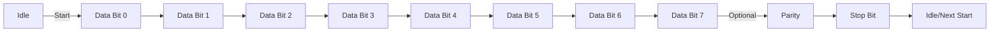
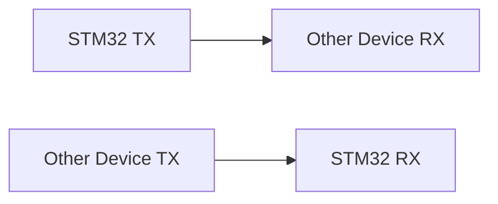

# STM32 UART Basics

## Introduction

Universal Asynchronous Receiver/Transmitter (UART) is one of the most widely used communication protocols in embedded systems. It provides a simple, reliable method for exchanging data between microcontrollers and other devices. In this tutorial, we'll explore how to implement UART communication on STM32 microcontrollers, which are popular ARM Cortex-M based devices widely used in embedded applications.

UART is particularly useful because:
- It requires only two signal wires for bidirectional communication (TX and RX)
- It's supported by virtually all microcontrollers
- It's easy to configure and use
- It's the foundation for many common interfaces like serial terminals and debugging tools

By the end of this tutorial, you'll understand how UART works, how to configure it on STM32 devices, and how to implement basic communication functions.

## UART Communication Basics

### What is UART?

UART is an asynchronous serial communication protocol. Let's break down what this means:

- **Serial**: Data is sent one bit at a time over a single communication line
- **Asynchronous**: No separate clock signal is shared between devices; instead, both devices must agree on timing parameters in advance
- **Full-duplex**: Communication can occur in both directions simultaneously

### UART Signal Format

A standard UART transmission consists of:

1. **Start bit**: Always a logic low (0) that signals the beginning of transmission
2. **Data bits**: Typically 8 bits, but can be 7 or 9 bits
3. **Parity bit**: Optional bit for error detection (can be even, odd, or none)
4. **Stop bit(s)**: One or two logic high (1) bits that signal the end of transmission

Here's a visual representation of a typical UART frame:



### UART Connections

UART requires only two connections between devices:
- **TX (Transmit)**: Sends data from the current device to the other device
- **RX (Receive)**: Receives data from the other device

When connecting two UART devices, you cross-connect TX to RX:



### Baud Rate

The baud rate defines how quickly data is sent over the serial line, measured in bits per second (bps). Common baud rates include:
- 9600 bps
- 19200 bps
- 38400 bps
- 57600 bps
- 115200 bps

Both the sender and receiver must use the same baud rate for successful communication.

## STM32 UART Hardware

STM32 microcontrollers typically include multiple UART/USART peripherals. The exact number varies by device family:
- Basic STM32 devices may have 2-3 UARTs
- More advanced STM32 devices can have 8 or more UARTs

The difference between UART and USART (Universal Synchronous/Asynchronous Receiver/Transmitter) is that USART also supports synchronous communication, but we'll focus on asynchronous mode in this tutorial.

### UART Pins on STM32

Each UART peripheral on an STM32 is associated with specific GPIO pins. For instance, on an STM32F4 device:
- USART1 TX: PA9, PB6
- USART1 RX: PA10, PB7
- USART2 TX: PA2, PD5
- USART2 RX: PA3, PD6

The exact pin mappings vary by STM32 model, so always check the datasheet for your specific device.

## Setting Up UART on STM32

We'll cover configuration using both the STM32CubeMX GUI tool and direct register programming.

### Using STM32CubeMX

STM32CubeMX provides an easy graphical interface for configuring STM32 peripherals:

1. **Create a new project** and select your STM32 device
2. **Configure the UART pins**:
   - In the Pinout & Configuration tab, find your desired UART (e.g., USART2)
   - Select "Asynchronous" mode
   - Configure parameters (baud rate, word length, parity, stop bits)
3. **Set up the clock configuration** to ensure proper timing
4. **Generate the code** for your preferred IDE

### Direct Register Configuration

For those who prefer working directly with registers, here's how to configure UART:

```c
// Enable clock for USART2 and GPIOA
RCC->AHB1ENR |= RCC_AHB1ENR_GPIOAEN;
RCC->APB1ENR |= RCC_APB1ENR_USART2EN;

// Configure PA2 (TX) and PA3 (RX) for USART2
// Set mode to alternate function
GPIOA->MODER &= ~(GPIO_MODER_MODE2_0 | GPIO_MODER_MODE3_0);
GPIOA->MODER |= (GPIO_MODER_MODE2_1 | GPIO_MODER_MODE3_1);

// Set alternate function to USART2 (AF7)
GPIOA->AFR[0] &= ~(GPIO_AFRL_AFRL2 | GPIO_AFRL_AFRL3);
GPIOA->AFR[0] |= ((7 << GPIO_AFRL_AFSEL2_Pos) | (7 << GPIO_AFRL_AFSEL3_Pos));

// Configure USART2
// Reset USART2 configuration
USART2->CR1 = 0;
USART2->CR2 = 0;
USART2->CR3 = 0;

// Set baud rate (assuming 84MHz APB1 clock, 9600 baud)
// BRR = fCK / baud rate = 84000000 / 9600 = 8750 = 0x2233
USART2->BRR = 0x2233;

// Enable USART, transmitter, and receiver
USART2->CR1 |= USART_CR1_UE | USART_CR1_TE | USART_CR1_RE;
```

## Basic UART Operations

Let's explore the fundamental UART operations in STM32.

### Sending Data

To send a single byte via UART:

```c
void UART_SendByte(USART_TypeDef *USARTx, uint8_t data) {
    // Wait until transmit data register is empty
    while (!(USARTx->SR & USART_SR_TXE));
    
    // Send data
    USARTx->DR = data;
}
```

To send a string:

```c
void UART_SendString(USART_TypeDef *USARTx, const char *str) {
    while (*str) {
        UART_SendByte(USARTx, *str++);
    }
}
```

### Receiving Data

To receive a single byte via UART:

```c
uint8_t UART_ReceiveByte(USART_TypeDef *USARTx) {
    // Wait until data is received
    while (!(USARTx->SR & USART_SR_RXNE));
    
    // Return received data
    return USARTx->DR;
}
```

### Using HAL Library

If you're using STM32's HAL library (generated by CubeMX), the functions are even simpler:

```c
// Send data
HAL_UART_Transmit(&huart2, (uint8_t*)"Hello World!\r
", 14, HAL_MAX_DELAY);

// Receive data (blocking)
uint8_t buffer[10];
HAL_UART_Receive(&huart2, buffer, 10, HAL_MAX_DELAY);

// Non-blocking receive with interrupt
HAL_UART_Receive_IT(&huart2, buffer, 10);
```

## Interrupt-Based UART Communication

For more efficient operation, you can use interrupts instead of polling:

### Configuring UART Interrupts

```c
// Enable RXNE interrupt
USART2->CR1 |= USART_CR1_RXNEIE;

// Enable USART2 interrupt in NVIC
NVIC_EnableIRQ(USART2_IRQn);
NVIC_SetPriority(USART2_IRQn, 0);
```

### Interrupt Handler

```c
void USART2_IRQHandler(void) {
    // Check if we received data
    if (USART2->SR & USART_SR_RXNE) {
        // Read received data
        uint8_t data = USART2->DR;
        
        // Process data (example: echo back)
        while (!(USART2->SR & USART_SR_TXE));
        USART2->DR = data;
    }
}
```

### Using HAL for Interrupts

With the HAL library:

```c
// In main function
HAL_UART_Receive_IT(&huart2, &receivedByte, 1);

// In callback function
void HAL_UART_RxCpltCallback(UART_HandleTypeDef *huart) {
    if (huart->Instance == USART2) {
        // Process received byte
        
        // Restart the interrupt receive
        HAL_UART_Receive_IT(&huart2, &receivedByte, 1);
    }
}
```

## DMA-Based UART Communication

For handling large data transfers efficiently, use DMA (Direct Memory Access):

### Configuring DMA for UART

Using HAL Library:

```c
// In CubeMX, enable DMA for UART TX and/or RX

// Transmit data using DMA
uint8_t txBuffer[100] = "Large data transmission via DMA\r
";
HAL_UART_Transmit_DMA(&huart2, txBuffer, strlen((char*)txBuffer));

// Receive data using DMA
uint8_t rxBuffer[100];
HAL_UART_Receive_DMA(&huart2, rxBuffer, 100);
```

### DMA Callbacks

```c
void HAL_UART_TxCpltCallback(UART_HandleTypeDef *huart) {
    if (huart->Instance == USART2) {
        // Transmission complete
    }
}

void HAL_UART_RxCpltCallback(UART_HandleTypeDef *huart) {
    if (huart->Instance == USART2) {
        // Reception complete
    }
}
```

## Practical Example: Serial Command Interface

Let's create a simple command interface that allows sending commands to the STM32 via UART:

```c
#include "stm32f4xx_hal.h"
#include <string.h>
#include <stdio.h>

UART_HandleTypeDef huart2;
char rxBuffer[100];
char txBuffer[100];
uint8_t rxIndex = 0;
uint8_t rxChar;

void processCommand(void) {
    if (strncmp(rxBuffer, "LED ON", 6) == 0) {
        HAL_GPIO_WritePin(GPIOA, GPIO_PIN_5, GPIO_PIN_SET);
        sprintf(txBuffer, "LED turned ON\r
");
        HAL_UART_Transmit(&huart2, (uint8_t*)txBuffer, strlen(txBuffer), HAL_MAX_DELAY);
    }
    else if (strncmp(rxBuffer, "LED OFF", 7) == 0) {
        HAL_GPIO_WritePin(GPIOA, GPIO_PIN_5, GPIO_PIN_RESET);
        sprintf(txBuffer, "LED turned OFF\r
");
        HAL_UART_Transmit(&huart2, (uint8_t*)txBuffer, strlen(txBuffer), HAL_MAX_DELAY);
    }
    else if (strncmp(rxBuffer, "HELP", 4) == 0) {
        sprintf(txBuffer, "Available commands:\r
LED ON\r
LED OFF\r
HELP\r
");
        HAL_UART_Transmit(&huart2, (uint8_t*)txBuffer, strlen(txBuffer), HAL_MAX_DELAY);
    }
    else {
        sprintf(txBuffer, "Unknown command: %s\r
", rxBuffer);
        HAL_UART_Transmit(&huart2, (uint8_t*)txBuffer, strlen(txBuffer), HAL_MAX_DELAY);
    }
    
    rxIndex = 0;
    memset(rxBuffer, 0, sizeof(rxBuffer));
}

int main(void) {
    /* MCU Configuration and Initialization */
    HAL_Init();
    SystemClock_Config();
    
    /* GPIO Initialization for LED */
    __HAL_RCC_GPIOA_CLK_ENABLE();
    GPIO_InitTypeDef GPIO_InitStruct = {0};
    GPIO_InitStruct.Pin = GPIO_PIN_5;
    GPIO_InitStruct.Mode = GPIO_MODE_OUTPUT_PP;
    GPIO_InitStruct.Pull = GPIO_NOPULL;
    GPIO_InitStruct.Speed = GPIO_SPEED_FREQ_LOW;
    HAL_GPIO_Init(GPIOA, &GPIO_InitStruct);
    
    /* UART2 Init */
    huart2.Instance = USART2;
    huart2.Init.BaudRate = 115200;
    huart2.Init.WordLength = UART_WORDLENGTH_8B;
    huart2.Init.StopBits = UART_STOPBITS_1;
    huart2.Init.Parity = UART_PARITY_NONE;
    huart2.Init.Mode = UART_MODE_TX_RX;
    huart2.Init.HwFlowCtl = UART_HWCONTROL_NONE;
    huart2.Init.OverSampling = UART_OVERSAMPLING_16;
    HAL_UART_Init(&huart2);
    
    /* Print welcome message */
    HAL_UART_Transmit(&huart2, (uint8_t*)"STM32 Command Interface\r
Type HELP for commands\r
", 50, HAL_MAX_DELAY);
    
    /* Start receiving one byte at a time with interrupt */
    HAL_UART_Receive_IT(&huart2, &rxChar, 1);
    
    while (1) {
        /* Main loop - everything handled in interrupts */
        HAL_Delay(100);
    }
}

void HAL_UART_RxCpltCallback(UART_HandleTypeDef *huart) {
    if (huart->Instance == USART2) {
        if (rxChar == '\r' || rxChar == '
') {
            // End of command
            if (rxIndex > 0) {
                rxBuffer[rxIndex] = '\0';
                processCommand();
            }
        }
        else {
            // Add character to buffer
            if (rxIndex < sizeof(rxBuffer) - 1) {
                rxBuffer[rxIndex++] = rxChar;
            }
        }
        
        // Restart the interrupt receive
        HAL_UART_Receive_IT(&huart2, &rxChar, 1);
    }
}
```

This example implements a simple command interface that:
1. Accepts commands like "LED ON", "LED OFF", and "HELP"
2. Processes them and sends appropriate responses
3. Controls an LED connected to PA5 (the onboard LED on many STM32 development boards)

## Debugging with UART

One of the most common uses of UART is for debugging. Here's how to implement a simple printf-style debug mechanism:

```c
#include <stdio.h>

UART_HandleTypeDef huart2;

// Redirect printf to UART
int __io_putchar(int ch) {
    HAL_UART_Transmit(&huart2, (uint8_t*)&ch, 1, HAL_MAX_DELAY);
    return ch;
}

void debug_init(void) {
    /* UART2 Init for debug */
    huart2.Instance = USART2;
    huart2.Init.BaudRate = 115200;
    huart2.Init.WordLength = UART_WORDLENGTH_8B;
    huart2.Init.StopBits = UART_STOPBITS_1;
    huart2.Init.Parity = UART_PARITY_NONE;
    huart2.Init.Mode = UART_MODE_TX_RX;
    huart2.Init.HwFlowCtl = UART_HWCONTROL_NONE;
    huart2.Init.OverSampling = UART_OVERSAMPLING_16;
    HAL_UART_Init(&huart2);
    
    printf("Debug UART initialized at 115200 baud\r
");
}

// Usage
int main(void) {
    HAL_Init();
    SystemClock_Config();
    debug_init();
    
    int counter = 0;
    float temperature = 25.5;
    
    while (1) {
        printf("Counter: %d, Temperature: %.1f°C\r
", counter, temperature);
        counter++;
        temperature += 0.1;
        HAL_Delay(1000);
    }
}
```

## Common UART Issues and Troubleshooting

### Issue 1: Garbled Text
If you're seeing garbled or nonsensical text, check the following:
- **Baud rate mismatch**: Ensure both devices are using the same baud rate
- **Word length/parity/stop bits mismatch**: All settings must match between devices
- **Clock issues**: Inaccurate system clock can cause timing problems

### Issue 2: No Communication
If you're not seeing any data:
- **Wiring**: Verify TX is connected to RX and vice versa
- **Voltage levels**: Ensure compatible voltage levels (3.3V vs 5V)
- **Peripheral clock**: Check if the UART peripheral clock is enabled
- **Pin configuration**: Confirm pins are configured for UART alternate function

### Issue 3: Data Loss
If you're losing data:
- **Buffer overflow**: Consider using interrupts or DMA
- **Flow control**: Enable hardware flow control (RTS/CTS) if available
- **Processing time**: Ensure data is processed quickly enough between receptions

## Advanced UART Features

### Hardware Flow Control

For high-speed or continuous data transfers, hardware flow control prevents data loss:

```c
// Using HAL library
huart2.Init.HwFlowCtl = UART_HWCONTROL_RTS_CTS;

// Additional pins need to be configured for RTS and CTS
// For example, on STM32F4, USART2 can use:
// - RTS: PA1, PD4
// - CTS: PA0, PD3
```

### Multiprocessor Communication

STM32 UARTs support a multiprocessor mode where several devices can share the same communication line:

```c
// Enter mute mode (only respond to address frames)
USART2->CR1 |= USART_CR1_MUTE;

// Send address frame (9th bit set)
USART2->CR1 |= USART_CR1_M;  // 9-bit word length
USART2->DR = (address | 0x100);  // Set 9th bit to mark as address
```

### RS-485 Communication

RS-485 is a popular industrial standard that uses UART with differential signaling for longer distances:

```c
// Configure DE (Driver Enable) pin for RS-485 transceiver
// Often connected to the UART's RTS pin
HAL_GPIO_WritePin(GPIOA, GPIO_PIN_1, GPIO_PIN_SET);   // Enable transmitter
HAL_UART_Transmit(&huart2, data, length, timeout);
HAL_GPIO_WritePin(GPIOA, GPIO_PIN_1, GPIO_PIN_RESET); // Disable transmitter, enable receiver
```

## Summary

In this tutorial, we've covered the fundamentals of UART communication on STM32 microcontrollers:

- UART basics and signal format
- Hardware configuration using both direct register access and the HAL library
- Transmitting and receiving data using polling, interrupts, and DMA
- A practical example of a command interface
- Debugging with UART
- Common issues and their solutions
- Advanced UART features

UART is a versatile and reliable communication protocol that forms the foundation for many embedded system applications. With the knowledge gained from this tutorial, you should be able to implement UART communication in your STM32 projects confidently.

## Additional Resources

To deepen your understanding of UART communication on STM32 microcontrollers:

1. **STM32 Reference Manuals**: Refer to the RM for your specific STM32 device for detailed register descriptions
2. **STM32 HAL Documentation**: For HAL-specific UART functions and usage
3. **Application Notes**:
   - AN4031: Using the STM32F4 UART in asynchronous mode
   - AN3109: USART hardware flow control implementation

## Exercises

1. Create a simple "echo" program that sends back any character received via UART
2. Implement a ring buffer for receiving UART data to prevent data loss
3. Build a simple protocol that sends structured data (e.g., sensor readings) over UART
4. Create a "chat" application between two STM32 devices using UART
5. Implement a bootloader that can receive firmware updates over UART