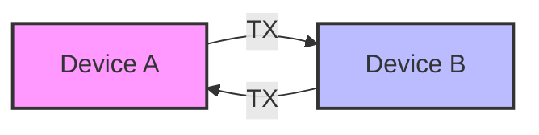

# STM32 UART Configuration

## Introduction

Universal Asynchronous Receiver/Transmitter (UART) is one of the most commonly used communication protocols in embedded systems. It provides a simple, reliable way for your STM32 microcontroller to communicate with other devices such as sensors, displays, other microcontrollers, or your computer.

In this tutorial, we'll cover everything you need to know about configuring and using UART on STM32 microcontrollers, from basic concepts to practical implementations using the STM32 HAL (Hardware Abstraction Layer) library.

## What is UART?

UART is a serial communication protocol that:

- Uses only two wires for data transmission (TX and RX)
- Is asynchronous (no clock signal is transmitted)
- Has configurable baud rates, data bits, stop bits, and parity



## UART Pins on STM32

STM32 microcontrollers typically have multiple UART peripherals (UART1, UART2, etc.). Each UART peripheral is connected to specific pins:

- **TX (Transmit)**: Data output from the microcontroller
- **RX (Receive)**: Data input to the microcontroller
- Optional hardware flow control pins: **RTS** (Request to Send) and **CTS** (Clear to Send)

## Basic UART Configuration Steps

Setting up UART on an STM32 involves the following steps:

1. Enable the GPIO and UART clocks
2. Configure the GPIO pins for UART
3. Configure the UART parameters (baud rate, word length, etc.)
4. Enable the UART peripheral

Let's go through each step with code examples.

## Step 1: Setting Up the STM32CubeIDE Project

First, create a new project in STM32CubeIDE and select your STM32 microcontroller. For this tutorial, we'll use an STM32F4 series MCU, but the concepts apply to all STM32 families.

## Step 2: Configuring UART Using STM32CubeMX

The easiest way to configure UART is through the graphical interface of STM32CubeMX:

1. In the Connectivity section, find and enable a UART peripheral (e.g., USART2)
2. Configure it for Asynchronous mode
3. Set the desired parameters:
   - Baud Rate: 115200 bits/s (common default)
   - Word Length: 8 Bits
   - Parity: None
   - Stop Bits: 1
   - Hardware Flow Control: Disabled
4. Generate the code

## Step 3: Understanding the Generated Code

After code generation, examine the `main.c` file. You'll find the UART initialization in the `MX_USARTx_UART_Init()` function:

```c
static void MX_USART2_UART_Init(void)
{
  huart2.Instance = USART2;
  huart2.Init.BaudRate = 115200;
  huart2.Init.WordLength = UART_WORDLENGTH_8B;
  huart2.Init.StopBits = UART_STOPBITS_1;
  huart2.Init.Parity = UART_PARITY_NONE;
  huart2.Init.Mode = UART_MODE_TX_RX;
  huart2.Init.HwFlowCtl = UART_HWCONTROL_NONE;
  huart2.Init.OverSampling = UART_OVERSAMPLING_16;
  
  if (HAL_UART_Init(&huart2) != HAL_OK)
  {
    Error_Handler();
  }
}
```

The HAL library then configures the GPIO pins in the `HAL_UART_MspInit()` function (usually in `stm32f4xx_hal_msp.c`):

```c
void HAL_UART_MspInit(UART_HandleTypeDef* huart)
{
  GPIO_InitTypeDef GPIO_InitStruct = {0};
  if(huart->Instance==USART2)
  {
    /* Peripheral clock enable */
    __HAL_RCC_USART2_CLK_ENABLE();
    __HAL_RCC_GPIOA_CLK_ENABLE();
    
    /* USART2 GPIO Configuration    
    PA2     ------> USART2_TX
    PA3     ------> USART2_RX 
    */
    GPIO_InitStruct.Pin = GPIO_PIN_2|GPIO_PIN_3;
    GPIO_InitStruct.Mode = GPIO_MODE_AF_PP;
    GPIO_InitStruct.Pull = GPIO_NOPULL;
    GPIO_InitStruct.Speed = GPIO_SPEED_FREQ_VERY_HIGH;
    GPIO_InitStruct.Alternate = GPIO_AF7_USART2;
    HAL_GPIO_Init(GPIOA, &GPIO_InitStruct);
  }
}
```

## Step 4: Sending Data via UART

To send data through UART, use one of these HAL functions:

```c
// Send data (blocking mode)
HAL_StatusTypeDef HAL_UART_Transmit(UART_HandleTypeDef *huart, uint8_t *pData, uint16_t Size, uint32_t Timeout);

// Send data (interrupt mode)
HAL_StatusTypeDef HAL_UART_Transmit_IT(UART_HandleTypeDef *huart, uint8_t *pData, uint16_t Size);

// Send data (DMA mode)
HAL_StatusTypeDef HAL_UART_Transmit_DMA(UART_HandleTypeDef *huart, uint8_t *pData, uint16_t Size);
```

Example of sending a string:

```c
char message[] = "Hello from STM32!\r
";
HAL_UART_Transmit(&huart2, (uint8_t*)message, strlen(message), HAL_MAX_DELAY);
```

## Step 5: Receiving Data via UART

To receive data:

```c
// Receive data (blocking mode)
HAL_StatusTypeDef HAL_UART_Receive(UART_HandleTypeDef *huart, uint8_t *pData, uint16_t Size, uint32_t Timeout);

// Receive data (interrupt mode)
HAL_StatusTypeDef HAL_UART_Receive_IT(UART_HandleTypeDef *huart, uint8_t *pData, uint16_t Size);

// Receive data (DMA mode)
HAL_StatusTypeDef HAL_UART_Receive_DMA(UART_HandleTypeDef *huart, uint8_t *pData, uint16_t Size);
```

Example of receiving a character:

```c
uint8_t data;
HAL_UART_Receive(&huart2, &data, 1, HAL_MAX_DELAY);
```

## Practical Example: Echo Application

Let's create a simple echo application that receives characters and sends them back:

```c
#include "main.h"
#include <string.h>

UART_HandleTypeDef huart2;

static void MX_GPIO_Init(void);
static void MX_USART2_UART_Init(void);

int main(void)
{
  /* MCU Configuration */
  HAL_Init();
  SystemClock_Config();
  
  /* Initialize peripherals */
  MX_GPIO_Init();
  MX_USART2_UART_Init();
  
  /* Welcome message */
  char welcome[] = "STM32 UART Echo Example\r
Type something...\r
";
  HAL_UART_Transmit(&huart2, (uint8_t*)welcome, strlen(welcome), HAL_MAX_DELAY);
  
  /* Echo application */
  uint8_t data;
  while (1)
  {
    /* Receive single byte */
    HAL_UART_Receive(&huart2, &data, 1, HAL_MAX_DELAY);
    
    /* Echo it back */
    HAL_UART_Transmit(&huart2, &data, 1, HAL_MAX_DELAY);
  }
}
```

### Output

When you run this program and connect to the STM32 via a serial terminal (like PuTTY or Tera Term) with the correct baud rate (115200), you'll see:

```
STM32 UART Echo Example
Type something...
```

Then, any character you type will be echoed back immediately.

## Advanced Topic: Interrupt-Based UART Communication

For more efficient UART handling, we can use interrupts instead of blocking calls:

```c
#include "main.h"
#include <string.h>

UART_HandleTypeDef huart2;
uint8_t rxData;
uint8_t rxBuffer[100];
uint16_t rxIndex = 0;

static void MX_GPIO_Init(void);
static void MX_USART2_UART_Init(void);
void ProcessCommand(void);

int main(void)
{
  /* MCU Configuration */
  HAL_Init();
  SystemClock_Config();
  
  /* Initialize peripherals */
  MX_GPIO_Init();
  MX_USART2_UART_Init();
  
  /* Welcome message */
  char welcome[] = "STM32 UART Interrupt Example\r
Type a command and press Enter...\r
";
  HAL_UART_Transmit(&huart2, (uint8_t*)welcome, strlen(welcome), HAL_MAX_DELAY);
  
  /* Start the interrupt-based reception - just for 1 byte */
  HAL_UART_Receive_IT(&huart2, &rxData, 1);
  
  while (1)
  {
    /* Main program does other tasks */
    HAL_Delay(100);
  }
}

/* UART Reception Complete Callback */
void HAL_UART_RxCpltCallback(UART_HandleTypeDef *huart)
{
  if (huart->Instance == USART2)
  {
    /* Echo the received character */
    HAL_UART_Transmit(&huart2, &rxData, 1, HAL_MAX_DELAY);
    
    /* Store the character in the buffer */
    if (rxData == '\r' || rxData == '
')
    {
      /* End of command - process it */
      if (rxIndex > 0)
      {
        rxBuffer[rxIndex] = '\0';
        ProcessCommand();
        rxIndex = 0;
      }
    }
    else
    {
      /* Add to buffer if not full */
      if (rxIndex < sizeof(rxBuffer) - 1)
      {
        rxBuffer[rxIndex++] = rxData;
      }
    }
    
    /* Restart the interrupt reception */
    HAL_UART_Receive_IT(&huart2, &rxData, 1);
  }
}

/* Process the received command */
void ProcessCommand(void)
{
  char response[100];
  
  if (strcmp((char*)rxBuffer, "LED ON") == 0)
  {
    HAL_GPIO_WritePin(GPIOA, GPIO_PIN_5, GPIO_PIN_SET);
    strcpy(response, "\r
LED turned ON\r
");
  }
  else if (strcmp((char*)rxBuffer, "LED OFF") == 0)
  {
    HAL_GPIO_WritePin(GPIOA, GPIO_PIN_5, GPIO_PIN_RESET);
    strcpy(response, "\r
LED turned OFF\r
");
  }
  else if (strcmp((char*)rxBuffer, "HELP") == 0)
  {
    strcpy(response, "\r
Available commands:\r
LED ON\r
LED OFF\r
HELP\r
");
  }
  else
  {
    strcpy(response, "\r
Unknown command. Type HELP for available commands.\r
");
  }
  
  HAL_UART_Transmit(&huart2, (uint8_t*)response, strlen(response), HAL_MAX_DELAY);
}
```

This advanced example:
1. Uses interrupt-based reception
2. Processes commands (turning an LED on/off)
3. Is non-blocking, allowing the main loop to perform other tasks

## Troubleshooting UART Communications

If you're having trouble with UART communication, check these common issues:

1. **Incorrect Baud Rate**: Both devices must use the same baud rate
2. **Mismatched TX/RX Connections**: Connect TX of one device to RX of the other, and vice versa
3. **Different Ground References**: Ensure both devices share a common ground
4. **Clock Issues**: Make sure the peripheral clock is properly configured
5. **Buffer Overflows**: Use interrupt or DMA-based methods for high-speed or continuous communications

## Advanced Configuration Options

UART offers several advanced configuration options:

### Parity Bit

The parity bit is used for error detection:

```c
huart2.Init.Parity = UART_PARITY_EVEN; // Options: NONE, EVEN, ODD
```

### Hardware Flow Control

For high-speed communications, you might want to enable hardware flow control:

```c
huart2.Init.HwFlowCtl = UART_HWCONTROL_RTS_CTS;
```

This requires additional pins (RTS and CTS) to be configured.

### DMA Mode

For efficient data transfer of large amounts of data, use DMA mode:

```c
/* DMA controller and handles declarations */
static DMA_HandleTypeDef hdma_usart2_rx;
static DMA_HandleTypeDef hdma_usart2_tx;

/* Later in the initialization: */
/* DMA interrupt init */
/* USART2_RX Init */
hdma_usart2_rx.Instance = DMA1_Stream5;
hdma_usart2_rx.Init.Channel = DMA_CHANNEL_4;
hdma_usart2_rx.Init.Direction = DMA_PERIPH_TO_MEMORY;
hdma_usart2_rx.Init.PeriphInc = DMA_PERIPH_INC_DISABLE;
hdma_usart2_rx.Init.MemInc = DMA_MEMORY_INC_ENABLE;
hdma_usart2_rx.Init.PeriphDataAlignment = DMA_PDATAALIGN_BYTE;
hdma_usart2_rx.Init.MemDataAlignment = DMA_MDATAALIGN_BYTE;
hdma_usart2_rx.Init.Mode = DMA_CIRCULAR;
hdma_usart2_rx.Init.Priority = DMA_PRIORITY_LOW;
hdma_usart2_rx.Init.FIFOMode = DMA_FIFOMODE_DISABLE;
HAL_DMA_Init(&hdma_usart2_rx);

__HAL_LINKDMA(huart, hdmarx, hdma_usart2_rx);
```

## Real-World Application: Communicating with a GPS Module

Here's an example of how to use UART to communicate with a GPS module that outputs NMEA sentences:

```c
#include "main.h"
#include <string.h>
#include <stdio.h>

UART_HandleTypeDef huart1; // For GPS
UART_HandleTypeDef huart2; // For debug console

uint8_t gpsRxByte;
char gpsBuffer[128];
uint8_t gpsIndex = 0;
uint8_t lineReady = 0;

static void MX_GPIO_Init(void);
static void MX_USART1_UART_Init(void); // GPS UART
static void MX_USART2_UART_Init(void); // Debug UART
void ProcessGPSData(void);

int main(void)
{
  /* MCU Configuration */
  HAL_Init();
  SystemClock_Config();
  
  /* Initialize peripherals */
  MX_GPIO_Init();
  MX_USART1_UART_Init(); // GPS UART at 9600 baud (typical for GPS)
  MX_USART2_UART_Init(); // Debug UART at 115200 baud
  
  /* Welcome message */
  char welcome[] = "STM32 GPS Receiver Example\r
";
  HAL_UART_Transmit(&huart2, (uint8_t*)welcome, strlen(welcome), HAL_MAX_DELAY);
  
  /* Start receiving GPS data */
  HAL_UART_Receive_IT(&huart1, &gpsRxByte, 1);
  
  while (1)
  {
    if (lineReady)
    {
      ProcessGPSData();
      lineReady = 0;
    }
    
    HAL_Delay(10);
  }
}

/* UART Reception Complete Callback */
void HAL_UART_RxCpltCallback(UART_HandleTypeDef *huart)
{
  if (huart->Instance == USART1) // GPS UART
  {
    if (gpsRxByte == '
')
    {
      /* End of line - process it */
      gpsBuffer[gpsIndex] = '\0';
      lineReady = 1;
      gpsIndex = 0;
    }
    else if (gpsRxByte != '\r') // Ignore carriage returns
    {
      /* Add to buffer if not full */
      if (gpsIndex < sizeof(gpsBuffer) - 1)
      {
        gpsBuffer[gpsIndex++] = gpsRxByte;
      }
    }
    
    /* Restart the interrupt reception */
    HAL_UART_Receive_IT(&huart1, &gpsRxByte, 1);
  }
}

/* Process GPS NMEA sentences */
void ProcessGPSData(void)
{
  /* Forward to debug console */
  HAL_UART_Transmit(&huart2, (uint8_t*)gpsBuffer, strlen(gpsBuffer), HAL_MAX_DELAY);
  HAL_UART_Transmit(&huart2, (uint8_t*)"\r
", 2, HAL_MAX_DELAY);
  
  /* Process specific NMEA sentences */
  if (strncmp(gpsBuffer, "$GPRMC", 6) == 0)
  {
    /* Parse RMC sentence to extract time, position, speed, etc. */
    char debugMsg[100];
    sprintf(debugMsg, "Found RMC sentence - contains position data\r
");
    HAL_UART_Transmit(&huart2, (uint8_t*)debugMsg, strlen(debugMsg), HAL_MAX_DELAY);
    
    /* Here you would parse the NMEA sentence */
    /* Example code for parsing is omitted for brevity */
  }
}
```

This example shows how to:
1. Configure two UART ports (one for the GPS module, one for debug output)
2. Receive and buffer NMEA sentences from the GPS
3. Process specific sentence types (in this case, GPRMC)

## Summary

In this tutorial, you've learned how to:

1. Understand the basic concepts of UART communication
2. Configure UART peripherals on STM32 microcontrollers
3. Send and receive data using blocking, interrupt, and DMA methods
4. Handle common issues and use advanced configuration options
5. Implement real-world applications using UART

UART is a versatile and widely-used communication protocol in embedded systems. With the knowledge from this tutorial, you should be able to implement UART communication in your STM32 projects with confidence.

## Exercises

To reinforce your understanding, try these exercises:

1. Modify the echo program to capitalize all lowercase letters and vice versa
2. Create a command-line interface with at least 3 commands that control different aspects of your microcontroller
3. Interface with a serial device like a GPS, Bluetooth module, or temperature sensor
4. Implement a circular buffer for UART reception to handle high data rates
5. Create a "loopback" test that verifies UART functionality by connecting TX to RX

## Additional Resources

- [STM32 HAL UART Documentation](https://www.st.com)
- [UART Protocol Details](https://en.wikipedia.org/wiki/Universal_asynchronous_receiver-transmitter)
- [STM32 Forum - UART Topics](https://community.st.com)
- [Application Note AN4989: UART/USART communication using HAL libraries](https://www.st.com)