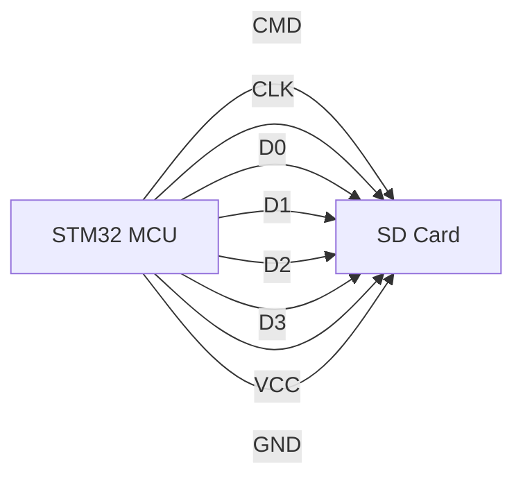

# STM32 SDIO Interface

## Introduction

The Secure Digital Input/Output (SDIO) interface is a specialized communication protocol designed for interaction with SD memory cards and other SDIO-compliant devices. On STM32 microcontrollers, this interface provides a high-speed pathway to external storage, making it invaluable for applications requiring data logging, file systems, or multimedia handling.

Unlike simpler interfaces like SPI, the SDIO protocol enables much faster data transfers, supporting the full capabilities of modern SD cards with transfer rates up to 25MB/s on some STM32 devices. This makes it particularly useful for embedded applications that need to quickly read or write large amounts of data.

In this tutorial, we'll explore how to configure and use the SDIO interface on STM32 microcontrollers, step-by-step, with practical code examples.

## SDIO Basics

### What is SDIO?

SDIO (Secure Digital Input/Output) is a hardware interface that extends the SD memory card standard to include I/O functions. While primarily used for SD memory cards, the interface can also communicate with other SDIO-compliant devices like Wi-Fi adapters, cameras, or GPS receivers.

### STM32 SDIO Hardware Support

Not all STM32 microcontrollers include SDIO hardware. It's typically available on mid-to-high-end STM32 families such as:

- STM32F1 series (some models)
- STM32F2 series
- STM32F4 series
- STM32F7 series
- STM32H7 series

The hardware typically consists of:

- Data lines (1, 4, or 8 bits depending on the STM32 model)
- Command line
- Clock line
- Dedicated peripheral with DMA support

### SDIO vs SPI for SD Card Communication

While SD cards can be interfaced using SPI, SDIO offers several advantages:

| Feature | SDIO | SPI |
|---------|------|-----|
| Speed | Up to 25MB/s (STM32F4) | Typically 1-2MB/s |
| Pin Count | 6+ pins | 4 pins |
| Implementation Complexity | Higher | Lower |
| CPU Usage | Lower (with DMA) | Higher |
| Power Efficiency | Better | Worse |

## Hardware Setup

### Required Connections

To connect an SD card to an STM32 microcontroller using SDIO:



A typical pin assignment for an STM32F4 microcontroller might be:

| STM32 Pin | SD Card Pin | Function |
|-----------|-------------|----------|
| PC8 | Pin 5 | SDIO_D0 |
| PC9 | Pin 6 | SDIO_D1 |
| PC10 | Pin 7 | SDIO_D2 |
| PC11 | Pin 8 | SDIO_D3 |
| PC12 | Pin 2 | SDIO_CLK |
| PD2 | Pin 3 | SDIO_CMD |
| 3.3V | Pin 4 | VDD (Power) |
| GND | Pin 3 | VSS (Ground) |

### Pull-up Resistors

SD card data and command lines require pull-up resistors (typically 10kΩ). Many STM32 development boards and SD card modules include these resistors, but if you're designing a custom circuit, remember to add them.

## Software Implementation

### Using STM32 HAL Library

The STM32 HAL (Hardware Abstraction Layer) library provides functions to simplify SDIO configuration and usage. We'll use these functions in our examples.

### Initialization Process

Initializing the SDIO interface involves several steps:

1. Configure GPIO pins for SDIO
2. Enable SDIO peripheral clock
3. Configure SDIO timing parameters
4. Initialize the SD card
5. Configure transfer mode (polling, interrupt, or DMA)

Let's look at an implementation:

```c
/* Include necessary headers */
#include "stm32f4xx_hal.h"

/* SDIO handle declaration */
SD_HandleTypeDef hsd;

/* Configure pins for SDIO */
void SDIO_GPIO_Init(void)
{
    GPIO_InitTypeDef GPIO_InitStruct = {0};
    
    /* Enable GPIO clocks */
    __HAL_RCC_GPIOC_CLK_ENABLE();
    __HAL_RCC_GPIOD_CLK_ENABLE();
    
    /* Configure pins */
    GPIO_InitStruct.Pin = GPIO_PIN_8|GPIO_PIN_9|GPIO_PIN_10|GPIO_PIN_11|GPIO_PIN_12;
    GPIO_InitStruct.Mode = GPIO_MODE_AF_PP;
    GPIO_InitStruct.Pull = GPIO_PULLUP;
    GPIO_InitStruct.Speed = GPIO_SPEED_FREQ_VERY_HIGH;
    GPIO_InitStruct.Alternate = GPIO_AF12_SDIO;
    HAL_GPIO_Init(GPIOC, &GPIO_InitStruct);
    
    GPIO_InitStruct.Pin = GPIO_PIN_2;
    HAL_GPIO_Init(GPIOD, &GPIO_InitStruct);
}

/* Initialize SDIO interface */
HAL_StatusTypeDef SDIO_Init(void)
{
    /* Enable SDIO clock */
    __HAL_RCC_SDIO_CLK_ENABLE();
    
    /* Configure SDIO */
    hsd.Instance = SDIO;
    hsd.Init.ClockEdge = SDIO_CLOCK_EDGE_RISING;
    hsd.Init.ClockBypass = SDIO_CLOCK_BYPASS_DISABLE;
    hsd.Init.ClockPowerSave = SDIO_CLOCK_POWER_SAVE_DISABLE;
    hsd.Init.BusWide = SDIO_BUS_WIDE_1B; /* Start with 1-bit bus width */
    hsd.Init.HardwareFlowControl = SDIO_HARDWARE_FLOW_CONTROL_DISABLE;
    hsd.Init.ClockDiv = SDIO_TRANSFER_CLK_DIV; /* Usually set to 0 for 24MHz or adjusted based on system clock */
    
    /* Initialize SD card */
    HAL_StatusTypeDef status = HAL_SD_Init(&hsd);
    if (status != HAL_OK) {
        return status;
    }
    
    /* Switch to 4-bit data width for better performance */
    status = HAL_SD_ConfigWideBusOperation(&hsd, SDIO_BUS_WIDE_4B);
    return status;
}
```

### Reading and Writing Data

Once initialized, we can read and write data from/to the SD card:

```c
/* Buffer for data transfer */
uint8_t buffer[512];

/* Read a block from SD card */
HAL_StatusTypeDef SDIO_ReadBlock(uint32_t blockAddr)
{
    return HAL_SD_ReadBlocks(&hsd, buffer, blockAddr, 1, 1000);
}

/* Write a block to SD card */
HAL_StatusTypeDef SDIO_WriteBlock(uint32_t blockAddr)
{
    /* Fill buffer with data */
    for (int i = 0; i < 512; i++) {
        buffer[i] = i % 256;
    }
    
    return HAL_SD_WriteBlocks(&hsd, buffer, blockAddr, 1, 1000);
}
```

### Using DMA for Efficient Transfers

For large data transfers, DMA (Direct Memory Access) significantly improves performance by offloading the CPU:

```c
/* DMA handle declaration */
DMA_HandleTypeDef hdma_sdio_rx;
DMA_HandleTypeDef hdma_sdio_tx;

/* Configure DMA for SDIO */
void SDIO_DMA_Init(void)
{
    /* Enable DMA2 clock */
    __HAL_RCC_DMA2_CLK_ENABLE();
    
    /* Configure DMA for RX */
    hdma_sdio_rx.Instance = DMA2_Stream3;
    hdma_sdio_rx.Init.Channel = DMA_CHANNEL_4;
    hdma_sdio_rx.Init.Direction = DMA_PERIPH_TO_MEMORY;
    hdma_sdio_rx.Init.PeriphInc = DMA_PINC_DISABLE;
    hdma_sdio_rx.Init.MemInc = DMA_MINC_ENABLE;
    hdma_sdio_rx.Init.PeriphDataAlignment = DMA_PDATAALIGN_WORD;
    hdma_sdio_rx.Init.MemDataAlignment = DMA_MDATAALIGN_WORD;
    hdma_sdio_rx.Init.Mode = DMA_PFCTRL;
    hdma_sdio_rx.Init.Priority = DMA_PRIORITY_VERY_HIGH;
    hdma_sdio_rx.Init.FIFOMode = DMA_FIFOMODE_ENABLE;
    hdma_sdio_rx.Init.FIFOThreshold = DMA_FIFO_THRESHOLD_FULL;
    hdma_sdio_rx.Init.MemBurst = DMA_MBURST_INC4;
    hdma_sdio_rx.Init.PeriphBurst = DMA_PBURST_INC4;
    HAL_DMA_Init(&hdma_sdio_rx);
    
    /* Associate DMA handle with SD handle */
    __HAL_LINKDMA(&hsd, hdmarx, hdma_sdio_rx);
    
    /* Configure DMA for TX (similar to RX but with MEMORY_TO_PERIPH direction) */
    hdma_sdio_tx.Instance = DMA2_Stream6;
    hdma_sdio_tx.Init.Channel = DMA_CHANNEL_4;
    hdma_sdio_tx.Init.Direction = DMA_MEMORY_TO_PERIPH;
    /* Rest of the configuration is similar to RX */
    HAL_DMA_Init(&hdma_sdio_tx);
    
    __HAL_LINKDMA(&hsd, hdmatx, hdma_sdio_tx);
    
    /* Configure NVIC for DMA */
    HAL_NVIC_SetPriority(DMA2_Stream3_IRQn, 5, 0);
    HAL_NVIC_EnableIRQ(DMA2_Stream3_IRQn);
    HAL_NVIC_SetPriority(DMA2_Stream6_IRQn, 5, 0);
    HAL_NVIC_EnableIRQ(DMA2_Stream6_IRQn);
}

/* Read blocks using DMA */
HAL_StatusTypeDef SDIO_ReadBlocks_DMA(uint32_t blockAddr, uint32_t numOfBlocks)
{
    return HAL_SD_ReadBlocks_DMA(&hsd, buffer, blockAddr, numOfBlocks);
}

/* Write blocks using DMA */
HAL_StatusTypeDef SDIO_WriteBlocks_DMA(uint32_t blockAddr, uint32_t numOfBlocks)
{
    return HAL_SD_WriteBlocks_DMA(&hsd, buffer, blockAddr, numOfBlocks);
}

/* DMA transfer complete callback */
void HAL_SD_TxCpltCallback(SD_HandleTypeDef *hsd)
{
    /* Transfer complete - do something */
    printf("TX transfer complete\r
");
}

void HAL_SD_RxCpltCallback(SD_HandleTypeDef *hsd)
{
    /* Transfer complete - do something */
    printf("RX transfer complete\r
");
}
```

## Practical Examples

### Example 1: Data Logger

This example shows how to create a simple data logger using the SDIO interface. We'll log temperature readings from a sensor to an SD card.

```c
#include "stm32f4xx_hal.h"
#include "fatfs.h"
#include "temperature_sensor.h" /* Hypothetical temperature sensor library */

/* FatFS variables */
FATFS fs;
FIL file;
FRESULT res;
uint32_t bytesWritten;

void DataLogger_Init(void)
{
    /* Initialize SDIO and peripherals */
    SDIO_GPIO_Init();
    SDIO_Init();
    SDIO_DMA_Init();
    
    /* Initialize temperature sensor */
    TempSensor_Init();
    
    /* Mount file system */
    res = f_mount(&fs, "", 1);
    if (res != FR_OK) {
        Error_Handler();
    }
}

void DataLogger_LogTemperature(void)
{
    float temperature;
    char buffer[64];
    
    /* Get temperature reading */
    temperature = TempSensor_ReadTemperature();
    
    /* Format data string */
    sprintf(buffer, "%lu,%0.2f\r
", HAL_GetTick(), temperature);
    
    /* Open file for append */
    res = f_open(&file, "templog.csv", FA_OPEN_APPEND | FA_WRITE | FA_OPEN_ALWAYS);
    if (res != FR_OK) {
        Error_Handler();
    }
    
    /* Write data */
    res = f_write(&file, buffer, strlen(buffer), (UINT*)&bytesWritten);
    if (res != FR_OK) {
        Error_Handler();
    }
    
    /* Close file */
    f_close(&file);
}

int main(void)
{
    /* System initialization code */
    HAL_Init();
    SystemClock_Config();
    
    /* Initialize data logger */
    DataLogger_Init();
    
    /* Main loop */
    while (1) {
        /* Log temperature every second */
        DataLogger_LogTemperature();
        HAL_Delay(1000);
    }
}
```

### Example 2: Loading Configuration from SD Card

This example demonstrates how to load configuration settings from an SD card at startup:

```c
#include "stm32f4xx_hal.h"
#include "fatfs.h"

/* FatFS variables */
FATFS fs;
FIL file;
FRESULT res;

/* Configuration structure */
typedef struct {
    uint32_t samplingRate;
    uint16_t alarmThreshold;
    uint8_t powerSaveMode;
    char deviceName[32];
} AppConfig_t;

AppConfig_t appConfig;

HAL_StatusTypeDef LoadConfiguration(void)
{
    UINT bytesRead;
    
    /* Initialize SDIO */
    SDIO_GPIO_Init();
    if (SDIO_Init() != HAL_OK) {
        return HAL_ERROR;
    }
    
    /* Mount file system */
    res = f_mount(&fs, "", 1);
    if (res != FR_OK) {
        return HAL_ERROR;
    }
    
    /* Open configuration file */
    res = f_open(&file, "config.bin", FA_READ);
    if (res != FR_OK) {
        /* If file doesn't exist, use default values */
        appConfig.samplingRate = 1000;
        appConfig.alarmThreshold = 500;
        appConfig.powerSaveMode = 1;
        strcpy(appConfig.deviceName, "DefaultDevice");
        return HAL_OK;
    }
    
    /* Read configuration */
    res = f_read(&file, &appConfig, sizeof(AppConfig_t), &bytesRead);
    f_close(&file);
    
    if (res != FR_OK || bytesRead != sizeof(AppConfig_t)) {
        return HAL_ERROR;
    }
    
    return HAL_OK;
}

int main(void)
{
    /* System initialization code */
    HAL_Init();
    SystemClock_Config();
    
    /* Load configuration */
    if (LoadConfiguration() != HAL_OK) {
        /* Handle error */
        Error_Handler();
    }
    
    /* Use configuration */
    printf("Device: %s\r
", appConfig.deviceName);
    printf("Sampling Rate: %lu Hz\r
", appConfig.samplingRate);
    
    /* Main loop */
    while (1) {
        /* Application code */
        HAL_Delay(1000);
    }
}
```

## Common Challenges and Solutions

### Card Detection

Many applications need to detect when a card is inserted or removed. There are two common approaches:

1. Mechanical detection using a card detect (CD) pin:

```c
/* Configure card detect pin with interrupt */
void CardDetect_Init(void)
{
    GPIO_InitTypeDef GPIO_InitStruct = {0};
    
    /* Enable GPIO clock */
    __HAL_RCC_GPIOB_CLK_ENABLE();
    
    /* Configure CD pin as input with pull-up */
    GPIO_InitStruct.Pin = GPIO_PIN_7; /* Example pin */
    GPIO_InitStruct.Mode = GPIO_MODE_IT_RISING_FALLING;
    GPIO_InitStruct.Pull = GPIO_PULLUP;
    HAL_GPIO_Init(GPIOB, &GPIO_InitStruct);
    
    /* Configure interrupt */
    HAL_NVIC_SetPriority(EXTI9_5_IRQn, 5, 0);
    HAL_NVIC_EnableIRQ(EXTI9_5_IRQn);
}

/* Interrupt handler */
void EXTI9_5_IRQHandler(void)
{
    HAL_GPIO_EXTI_IRQHandler(GPIO_PIN_7);
}

/* Callback */
void HAL_GPIO_EXTI_Callback(uint16_t GPIO_Pin)
{
    if (GPIO_Pin == GPIO_PIN_7) {
        if (HAL_GPIO_ReadPin(GPIOB, GPIO_PIN_7) == GPIO_PIN_RESET) {
            /* Card inserted */
            Card_MountFileSystem();
        } else {
            /* Card removed */
            Card_UnmountFileSystem();
        }
    }
}
```

2. Periodic polling of card status:

```c
void CheckCardStatus(void)
{
    static uint8_t prevStatus = 0;
    uint8_t currentStatus = 0;
    
    /* Check if card is present using HAL function */
    if (HAL_SD_GetCardState(&hsd) == HAL_SD_CARD_TRANSFER) {
        currentStatus = 1;
    }
    
    /* Detect change */
    if (currentStatus != prevStatus) {
        if (currentStatus) {
            /* Card inserted */
            Card_MountFileSystem();
        } else {
            /* Card removed */
            Card_UnmountFileSystem();
        }
        prevStatus = currentStatus;
    }
}
```

### Error Handling

Robust error handling is essential for SD card operations:

```c
const char* SDIO_GetErrorMessage(HAL_SD_ErrorTypedef error)
{
    switch(error) {
        case HAL_SD_ERROR_NONE: return "No error";
        case HAL_SD_ERROR_CMD_CRC_FAIL: return "Command CRC failed";
        case HAL_SD_ERROR_DATA_CRC_FAIL: return "Data CRC failed";
        case HAL_SD_ERROR_CMD_RSP_TIMEOUT: return "Command response timeout";
        case HAL_SD_ERROR_DATA_TIMEOUT: return "Data timeout";
        case HAL_SD_ERROR_TX_UNDERRUN: return "TX underrun";
        case HAL_SD_ERROR_RX_OVERRUN: return "RX overrun";
        case HAL_SD_ERROR_ADDR_MISALIGNED: return "Address misaligned";
        case HAL_SD_ERROR_BLOCK_LEN_ERR: return "Block length error";
        case HAL_SD_ERROR_ERASE_SEQ_ERR: return "Erase sequence error";
        case HAL_SD_ERROR_BAD_ERASE_PARAM: return "Bad erase parameter";
        case HAL_SD_ERROR_WRITE_PROT_VIOLATION: return "Write protect violation";
        case HAL_SD_ERROR_LOCK_UNLOCK_FAILED: return "Lock/unlock failed";
        case HAL_SD_ERROR_COM_CRC_FAILED: return "Communication CRC failed";
        case HAL_SD_ERROR_ILLEGAL_CMD: return "Illegal command";
        case HAL_SD_ERROR_CARD_ECC_FAILED: return "Card ECC failed";
        case HAL_SD_ERROR_CC_ERR: return "CC error";
        case HAL_SD_ERROR_GENERAL_UNKNOWN_ERR: return "Unknown error";
        case HAL_SD_ERROR_STREAM_READ_UNDERRUN: return "Stream read underrun";
        case HAL_SD_ERROR_STREAM_WRITE_OVERRUN: return "Stream write overrun";
        case HAL_SD_ERROR_CID_CSD_OVERWRITE: return "CID/CSD overwrite";
        case HAL_SD_ERROR_WP_ERASE_SKIP: return "WP erase skip";
        case HAL_SD_ERROR_CARD_ECC_DISABLED: return "Card ECC disabled";
        case HAL_SD_ERROR_ERASE_RESET: return "Erase reset";
        case HAL_SD_ERROR_AKE_SEQ_ERR: return "AKE sequence error";
        case HAL_SD_ERROR_INVALID_VOLTRANGE: return "Invalid voltage range";
        case HAL_SD_ERROR_ADDR_OUT_OF_RANGE: return "Address out of range";
        case HAL_SD_ERROR_REQUEST_NOT_APPLICABLE: return "Request not applicable";
        case HAL_SD_ERROR_PARAM: return "Parameter error";
        case HAL_SD_ERROR_UNSUPPORTED_FEATURE: return "Unsupported feature";
        case HAL_SD_ERROR_BUSY: return "Card is busy";
        case HAL_SD_ERROR_DMA: return "DMA error";
        case HAL_SD_ERROR_TIMEOUT: return "Timeout";
        default: return "Unknown error code";
    }
}

void SDIO_HandleError(void)
{
    HAL_SD_ErrorTypedef error = HAL_SD_GetError(&hsd);
    printf("SD Card Error: %s\r
", SDIO_GetErrorMessage(error));
    
    /* Try to reinitialize */
    HAL_SD_DeInit(&hsd);
    HAL_Delay(100);
    if (SDIO_Init() != HAL_OK) {
        /* Critical error - cannot recover */
        Error_Handler();
    }
}
```

## Performance Optimization

Here are tips to maximize SDIO performance:

1. **Use 4-bit bus width**: Always configure for 4-bit mode after initialization.

   ```c
   HAL_SD_ConfigWideBusOperation(&hsd, SDIO_BUS_WIDE_4B);
   ```

2. **Use DMA**: As shown earlier, DMA significantly reduces CPU load.

3. **Multiple block operations**: For large transfers, use multi-block functions:

   ```c
   /* Read multiple blocks at once */
   HAL_SD_ReadBlocks_DMA(&hsd, buffer, startBlock, numberOfBlocks);
   ```

4. **Optimize clock speed**: Set the SDIO clock as high as reliably possible:

   ```c
   /* For 48MHz system clock, divider of 0 gives 24MHz SDIO clock */
   hsd.Init.ClockDiv = 0;
   ```

5. **Sector alignment**: Keep buffers aligned to 4-byte boundaries for optimal DMA performance:

   ```c
   /* Aligned buffer */
   ALIGN_32BYTES(uint8_t buffer[512]);
   ```

6. **Batch operations**: Instead of many small operations, batch reads/writes together.

## Integration with File Systems

The SDIO interface is usually combined with a file system like FatFS. Here's a basic setup:

```c
#include "stm32f4xx_hal.h"
#include "fatfs.h"

FATFS fs;
FIL file;
FRESULT res;

void FileSystem_Init(void)
{
    /* Initialize SDIO */
    SDIO_GPIO_Init();
    SDIO_Init();
    
    /* Mount file system */
    res = f_mount(&fs, "", 1);
    if (res != FR_OK) {
        Error_Handler();
    }
    
    /* Create a new file and write to it */
    res = f_open(&file, "test.txt", FA_CREATE_ALWAYS | FA_WRITE);
    if (res != FR_OK) {
        Error_Handler();
    }
    
    UINT bytesWritten;
    res = f_write(&file, "Hello, SDIO World!\r
", 20, &bytesWritten);
    if (res != FR_OK) {
        Error_Handler();
    }
    
    /* Close file */
    f_close(&file);
    
    /* Read back the file */
    char readBuffer[64];
    UINT bytesRead;
    
    res = f_open(&file, "test.txt", FA_READ);
    if (res != FR_OK) {
        Error_Handler();
    }
    
    res = f_read(&file, readBuffer, sizeof(readBuffer) - 1, &bytesRead);
    if (res != FR_OK) {
        Error_Handler();
    }
    
    readBuffer[bytesRead] = '\0';
    printf("Read from file: %s\r
", readBuffer);
    
    f_close(&file);
}
```

## Summary

The SDIO interface on STM32 microcontrollers provides a high-performance pathway to SD cards and other SDIO devices. In this tutorial, we've covered:

- The basics of the SDIO protocol and its advantages over SPI
- Hardware connections required for SDIO communication
- Configuring and initializing the SDIO interface
- Reading and writing data using both polling and DMA methods
- Handling common challenges like card detection and error handling
- Performance optimization techniques
- Integration with file systems

With this knowledge, you can implement robust SD card storage solutions in your STM32 projects, enabling applications like data logging, configuration storage, and multimedia handling.

## Additional Resources

To further enhance your understanding of SDIO on STM32:

1. **ST Documentation:**
   - AN4748: Using the STM32 SD/SDIO peripheral
   - RM0090: STM32F4 Reference Manual (SDIO section)

2. **Libraries:**
   - FatFS: http://elm-chan.org/fsw/ff/00index_e.html
   - STM32 HAL SD Driver Documentation

3. **Practice Exercises:**

   **Exercise 1:** Create a data logger that records accelerometer data to an SD card.
   
   **Exercise 2:** Implement a simple file browser that can list files on an SD card and display their contents.
   
   **Exercise 3:** Create a configuration system that loads device settings from an SD card at startup and allows them to be modified and saved.
   
   **Exercise 4:** Benchmark SD card performance with different bus widths and DMA settings to find the optimal configuration for your specific application.