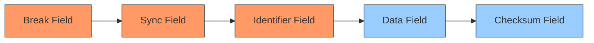
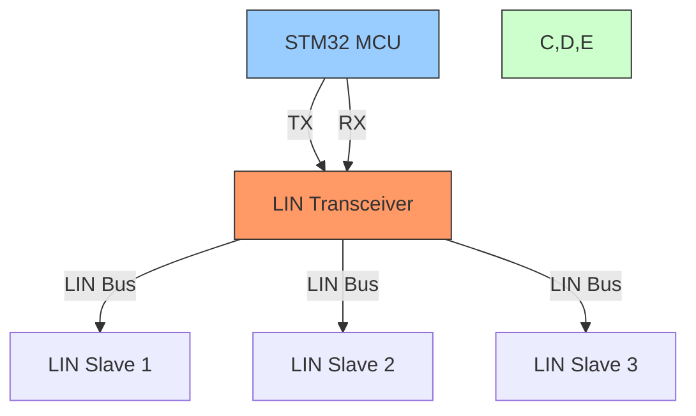

# STM32 LIN Interface

## Introduction

The Local Interconnect Network (LIN) is a serial communication protocol designed primarily for automotive networks. It serves as a cost-effective alternative to CAN (Controller Area Network) for applications that don't require high bandwidth or robustness. In this tutorial, we'll explore how to implement LIN communication using STM32 microcontrollers.

LIN is single-master, multiple-slave architecture that operates over a single wire, making it ideal for connecting sensors, actuators, and other devices in automotive systems where cost is a significant concern, but reliability is still important.

## LIN Protocol Basics

### What is LIN?

LIN (Local Interconnect Network) is a:
- Serial communication protocol
- Single-wire interface
- Single-master, multiple-slave network
- Low-speed protocol (up to 20 kbps)
- Cost-effective solution for non-critical automotive subsystems

### LIN Frame Structure

A LIN frame consists of two main components:

1. **Header** (transmitted by master):
   - Break field
   - Sync field
   - Identifier field

2. **Response** (transmitted by either master or a specific slave):
   - Data field (1-8 bytes)
   - Checksum field

Let's visualize the LIN frame structure:



## STM32 and LIN Interface

STM32 microcontrollers don't have dedicated LIN peripherals, but they implement LIN using their UART/USART modules with some additional software handling. The STM32's USART peripherals have LIN mode support which helps manage certain aspects of the protocol.

### Hardware Setup Requirements

To set up LIN communication with an STM32 microcontroller, you'll need:

1. An STM32 microcontroller with USART capabilities
2. A LIN transceiver (like TJA1020 or MCP2003)
3. A single-wire bus with proper termination
4. 12V supply (typical for automotive networks)

Here's a simplified connection diagram:



## Implementing LIN on STM32

Let's implement a basic LIN master using an STM32 microcontroller. We'll use the HAL library for easier development.

### Step 1: Configure the USART Peripheral

First, we need to configure the USART peripheral in LIN mode:

```c
UART_HandleTypeDef huart1;

void LIN_Init(void)
{
  huart1.Instance = USART1;
  huart1.Init.BaudRate = 19200; // Standard LIN baudrate
  huart1.Init.WordLength = UART_WORDLENGTH_8B;
  huart1.Init.StopBits = UART_STOPBITS_1;
  huart1.Init.Parity = UART_PARITY_NONE;
  huart1.Init.Mode = UART_MODE_TX_RX;
  huart1.Init.HwFlowCtl = UART_HWCONTROL_NONE;
  huart1.Init.OverSampling = UART_OVERSAMPLING_16;
  
  // Enable LIN mode
  huart1.AdvancedInit.AdvFeatureInit = UART_ADVFEATURE_AUTOBAUDRATE_INIT;
  huart1.AdvancedInit.AutoBaudRateEnable = UART_ADVFEATURE_AUTOBAUDRATE_ENABLE;
  huart1.AdvancedInit.AutoBaudRateMode = UART_ADVFEATURE_AUTOBAUDRATE_ONSTARTBIT;
  
  HAL_UART_Init(&huart1);
  
  // Enable LIN mode
  SET_BIT(huart1.Instance->CR2, USART_CR2_LINEN);
}
```

### Step 2: Implementing the LIN Break Detection/Generation

The LIN break is a critical part of the protocol. Let's implement functions to send and detect break signals:

```c
// Send LIN break
void LIN_SendBreak(void)
{
  // Request to send a break character
  SET_BIT(huart1.Instance->RQR, USART_RQR_SBKRQ);
  
  // Wait until break is transmitted
  while(!(huart1.Instance->ISR & USART_ISR_SBKF));
  while(huart1.Instance->ISR & USART_ISR_SBKF);
  
  // Small delay to ensure proper timing
  HAL_Delay(1);
}

// Detect LIN break (for slave implementation)
bool LIN_DetectBreak(void)
{
  // Check if LIN break detection flag is set
  if(huart1.Instance->ISR & USART_ISR_LBDF)
  {
    // Clear the LIN break detection flag
    huart1.Instance->ICR = USART_ICR_LBDCF;
    return true;
  }
  return false;
}
```

### Step 3: Implementing the LIN Master Frame Transmission

Now, let's create a function to send a complete LIN frame:

```c
// Calculate LIN checksum (enhanced version)
uint8_t LIN_CalculateChecksum(uint8_t id, uint8_t* data, uint8_t length)
{
  uint16_t sum = id;
  
  for(uint8_t i = 0; i < length; i++)
  {
    sum += data[i];
    // Handle carry
    if(sum >= 256)
      sum = (sum & 0xFF) + 1;
  }
  
  return (uint8_t)(0xFF - sum);
}

// Send a complete LIN frame
void LIN_SendFrame(uint8_t id, uint8_t* data, uint8_t length)
{
  // Step 1: Send the Break field
  LIN_SendBreak();
  
  // Step 2: Send the Sync field (0x55)
  uint8_t sync = 0x55;
  HAL_UART_Transmit(&huart1, &sync, 1, 100);
  
  // Step 3: Send the ID field
  HAL_UART_Transmit(&huart1, &id, 1, 100);
  
  // Step 4: Send the Data field
  HAL_UART_Transmit(&huart1, data, length, 100);
  
  // Step 5: Calculate and send the Checksum
  uint8_t checksum = LIN_CalculateChecksum(id, data, length);
  HAL_UART_Transmit(&huart1, &checksum, 1, 100);
  
  // Small delay to ensure proper timing
  HAL_Delay(10);
}
```

### Step 4: Implementing a LIN Slave Response

For a slave device, we need to detect the LIN header and respond accordingly:

```c
// Global variables for LIN slave
uint8_t slave_id = 0x10; // This slave's ID
uint8_t response_data[8] = {0};

// Process received LIN header and respond if needed
void LIN_SlaveProcess(void)
{
  uint8_t received_byte;
  uint8_t sync_field = 0;
  uint8_t id_field = 0;
  
  // Step 1: Wait for and verify the break field
  if(!LIN_DetectBreak())
    return;
  
  // Step 2: Read the sync field (should be 0x55)
  if(HAL_UART_Receive(&huart1, &sync_field, 1, 100) != HAL_OK || sync_field != 0x55)
    return;
  
  // Step 3: Read the ID field
  if(HAL_UART_Receive(&huart1, &id_field, 1, 100) != HAL_OK)
    return;
  
  // Step 4: Check if this frame is addressed to this slave
  if(id_field == slave_id)
  {
    // Send response data
    HAL_UART_Transmit(&huart1, response_data, 8, 100);
    
    // Calculate and send checksum
    uint8_t checksum = LIN_CalculateChecksum(id_field, response_data, 8);
    HAL_UART_Transmit(&huart1, &checksum, 1, 100);
  }
}
```

## Complete Example: LIN Master/Slave Communication

Let's put everything together into a complete example with a master and a slave. For this demo, we'll use two STM32 devices.

### Master Code

```c
#include "stm32f4xx_hal.h"

UART_HandleTypeDef huart1;
uint8_t temperature_request_id = 0x22;
uint8_t light_control_id = 0x33;

void SystemClock_Config(void);
static void MX_GPIO_Init(void);
static void MX_USART1_UART_Init(void);
void LIN_SendBreak(void);
void LIN_SendFrame(uint8_t id, uint8_t* data, uint8_t length);

int main(void)
{
  HAL_Init();
  SystemClock_Config();
  MX_GPIO_Init();
  MX_USART1_UART_Init();
  
  // Enable LIN mode
  SET_BIT(huart1.Instance->CR2, USART_CR2_LINEN);
  
  uint8_t light_data[2] = {0x01, 0xFF}; // Turn on light at full brightness
  uint8_t recv_data[4] = {0};
  
  while (1)
  {
    // Send request for temperature (master requests data from slave)
    LIN_SendFrame(temperature_request_id, NULL, 0);
    
    // Wait for slave response and read it
    HAL_UART_Receive(&huart1, recv_data, 4, 500);
    
    // Process temperature data (in this example, just check values)
    float temperature = (float)((recv_data[0] << 8) | recv_data[1]) / 10.0f;
    float humidity = (float)((recv_data[2] << 8) | recv_data[3]) / 10.0f;
    
    // Based on temperature, control light intensity
    if(temperature > 25.0f)
    {
      light_data[1] = 0xFF; // Full brightness
    }
    else
    {
      light_data[1] = 0x80; // Half brightness
    }
    
    // Send command to control lights
    LIN_SendFrame(light_control_id, light_data, 2);
    
    HAL_Delay(1000); // Update every second
  }
}

void LIN_SendBreak(void)
{
  // Request to send a break character
  SET_BIT(huart1.Instance->RQR, USART_RQR_SBKRQ);
  
  // Wait until break is transmitted
  while(!(huart1.Instance->ISR & USART_ISR_SBKF));
  while(huart1.Instance->ISR & USART_ISR_SBKF);
  
  // Small delay to ensure proper timing
  HAL_Delay(1);
}

void LIN_SendFrame(uint8_t id, uint8_t* data, uint8_t length)
{
  // Step 1: Send the Break field
  LIN_SendBreak();
  
  // Step 2: Send the Sync field (0x55)
  uint8_t sync = 0x55;
  HAL_UART_Transmit(&huart1, &sync, 1, 100);
  
  // Step 3: Send the ID field
  HAL_UART_Transmit(&huart1, &id, 1, 100);
  
  // Step 4: If there's data to send, transmit it
  if(data != NULL && length > 0)
  {
    HAL_UART_Transmit(&huart1, data, length, 100);
    
    // Calculate and send checksum
    uint16_t sum = id;
    for(uint8_t i = 0; i < length; i++)
    {
      sum += data[i];
      if(sum >= 256)
        sum = (sum & 0xFF) + 1;
    }
    uint8_t checksum = (uint8_t)(0xFF - sum);
    HAL_UART_Transmit(&huart1, &checksum, 1, 100);
  }
  
  HAL_Delay(10);
}

// UART initialization and other required functions would be here
```

### Slave Code

```c
#include "stm32f4xx_hal.h"

UART_HandleTypeDef huart1;
uint8_t my_temperature_id = 0x22;
uint8_t my_light_control_id = 0x33;
float current_temperature = 23.5f;
float current_humidity = 45.0f;
uint8_t light_status = 0;
uint8_t light_brightness = 0;

void SystemClock_Config(void);
static void MX_GPIO_Init(void);
static void MX_USART1_UART_Init(void);
bool LIN_DetectBreak(void);
void LIN_SlaveProcess(void);

int main(void)
{
  HAL_Init();
  SystemClock_Config();
  MX_GPIO_Init();
  MX_USART1_UART_Init();
  
  // Enable LIN mode and break detection
  SET_BIT(huart1.Instance->CR2, USART_CR2_LINEN);
  SET_BIT(huart1.Instance->CR2, USART_CR2_LBDIE);
  
  while (1)
  {
    // Process LIN commands
    LIN_SlaveProcess();
    
    // Simulate changing temperature (in a real application, read from a sensor)
    current_temperature += ((HAL_GetTick() % 100) - 50) / 1000.0f;
    if(current_temperature < 15.0f) current_temperature = 15.0f;
    if(current_temperature > 35.0f) current_temperature = 35.0f;
    
    // Control light based on received commands
    if(light_status)
    {
      HAL_GPIO_WritePin(GPIOA, GPIO_PIN_5, GPIO_PIN_SET);
      // In a real application, could use PWM to control brightness
    }
    else
    {
      HAL_GPIO_WritePin(GPIOA, GPIO_PIN_5, GPIO_PIN_RESET);
    }
  }
}

bool LIN_DetectBreak(void)
{
  // Check if LIN break detection flag is set
  if(huart1.Instance->ISR & USART_ISR_LBDF)
  {
    // Clear the LIN break detection flag
    huart1.Instance->ICR = USART_ICR_LBDCF;
    return true;
  }
  return false;
}

void LIN_SlaveProcess(void)
{
  uint8_t sync_field = 0;
  uint8_t id_field = 0;
  uint8_t data[8] = {0};
  uint8_t checksum = 0;
  
  // Step 1: Wait for and verify the break field
  if(!LIN_DetectBreak())
    return;
  
  // Step 2: Read the sync field (should be 0x55)
  if(HAL_UART_Receive(&huart1, &sync_field, 1, 100) != HAL_OK || sync_field != 0x55)
    return;
  
  // Step 3: Read the ID field
  if(HAL_UART_Receive(&huart1, &id_field, 1, 100) != HAL_OK)
    return;
  
  // Step 4: Process based on ID
  if(id_field == my_temperature_id)
  {
    // Convert temperature and humidity to integers for transmission
    uint16_t temp_int = (uint16_t)(current_temperature * 10.0f);
    uint16_t humid_int = (uint16_t)(current_humidity * 10.0f);
    
    data[0] = (temp_int >> 8) & 0xFF;
    data[1] = temp_int & 0xFF;
    data[2] = (humid_int >> 8) & 0xFF;
    data[3] = humid_int & 0xFF;
    
    // Send temperature and humidity data
    HAL_UART_Transmit(&huart1, data, 4, 100);
    
    // Calculate and send checksum
    uint16_t sum = id_field;
    for(uint8_t i = 0; i < 4; i++)
    {
      sum += data[i];
      if(sum >= 256)
        sum = (sum & 0xFF) + 1;
    }
    checksum = (uint8_t)(0xFF - sum);
    HAL_UART_Transmit(&huart1, &checksum, 1, 100);
  }
  else if(id_field == my_light_control_id)
  {
    // Receive light control command
    if(HAL_UART_Receive(&huart1, data, 2, 100) == HAL_OK)
    {
      light_status = data[0];
      light_brightness = data[1];
      
      // Receive and verify checksum (simplified)
      HAL_UART_Receive(&huart1, &checksum, 1, 100);
    }
  }
}

// UART initialization and other required functions would be here
```

## Real-World Applications of LIN

LIN is widely used in automotive applications where cost-effectiveness is important but reliable communication is still needed. Some common applications include:

1. **Body Electronics**
   - Door modules
   - Window controls
   - Seat controls
   - Mirror adjustment

2. **Comfort Systems**
   - Climate control
   - Interior lighting
   - Power seats

3. **Sensor Networks**
   - Temperature sensors
   - Light sensors
   - Rain sensors

4. **Actuator Control**
   - Simple motors
   - LEDs and lighting
   - Simple valve control

### Example: Car Door Module

In a car door module, LIN might be used to:
- Control window movement
- Manage door lock mechanisms
- Control side mirrors
- Handle interior door lights

The main car ECU would be the LIN master, while each door would have a slave controller handling these functions.

## Advanced Topics

### Sleep and Wake-up

LIN supports network sleep and wake-up functionality:

```c
// Put LIN network to sleep (master)
void LIN_Sleep(void)
{
  uint8_t sleep_id = 0x3C; // Sleep command ID
  uint8_t sleep_data[8] = {0xFF, 0xFF, 0xFF, 0xFF, 0xFF, 0xFF, 0xFF, 0xFF};
  
  LIN_SendFrame(sleep_id, sleep_data, 8);
}

// Wake up LIN network (master)
void LIN_Wakeup(void)
{
  // Send a wake-up pulse (dominant state for 250-5000 µs)
  HAL_GPIO_WritePin(LIN_TX_GPIO_Port, LIN_TX_Pin, GPIO_PIN_RESET);
  HAL_Delay(1); // 1ms wake-up pulse
  HAL_GPIO_WritePin(LIN_TX_GPIO_Port, LIN_TX_Pin, GPIO_PIN_SET);
  HAL_Delay(10); // Wait for slaves to wake up
}
```

### Error Handling

Robust LIN implementations should include error handling:

```c
typedef enum {
  LIN_NO_ERROR = 0,
  LIN_SYNC_ERROR,
  LIN_ID_PARITY_ERROR,
  LIN_SLAVE_NOT_RESPONDING,
  LIN_CHECKSUM_ERROR,
  LIN_TIMEOUT
} LIN_Error_t;

LIN_Error_t LIN_GetResponse(uint8_t id, uint8_t* data, uint8_t length, uint32_t timeout)
{
  // Implementation of error detection and handling
  // This would check for:
  // - Valid sync field
  // - Valid ID parity
  // - Response within timeout
  // - Correct checksum
  
  // Example implementation would go here
  
  return LIN_NO_ERROR;
}
```

## Summary

In this tutorial, we've explored the STM32 LIN Interface including:

1. **LIN Protocol Basics**
   - Single-master, multiple-slave architecture
   - Low-cost, single-wire design
   - Frame structure with header and response

2. **STM32 Implementation**
   - Using UART/USART in LIN mode
   - Break generation and detection
   - Frame transmission and reception

3. **Complete Examples**
   - Master implementation
   - Slave implementation
   - Real-world usage scenarios

LIN is an excellent solution for low-cost, low-speed communication in automotive and industrial applications where a full CAN bus would be excessive. The STM32's flexible UART peripherals make it well-suited for implementing LIN communication with minimal external components.

## Exercises

1. **Basic LIN Master**
   - Implement a simple LIN master that regularly polls two slaves for data.

2. **Temperature Control System**
   - Create a LIN network with one master and two slaves: a temperature sensor and a cooling fan controller.
   - The master should read the temperature from one slave and control the fan via the other slave.

3. **Sleep Mode Implementation**
   - Enhance your LIN implementation to support sleep and wake-up functionality to save power.

4. **Error Handling**
   - Implement robust error handling in your LIN driver, including timeout detection, checksum verification, and retry functionality.

## Additional Resources

- [STM32 USART Reference Manual](https://www.st.com)
- [LIN Specification](https://www.lin-cia.org/)
- [Automotive Networking: LIN, CAN, FlexRay](https://www.nxp.com)
- [STM32 HAL Library Documentation](https://www.st.com)