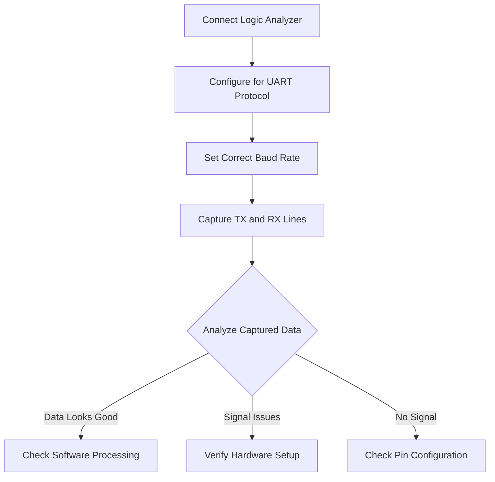
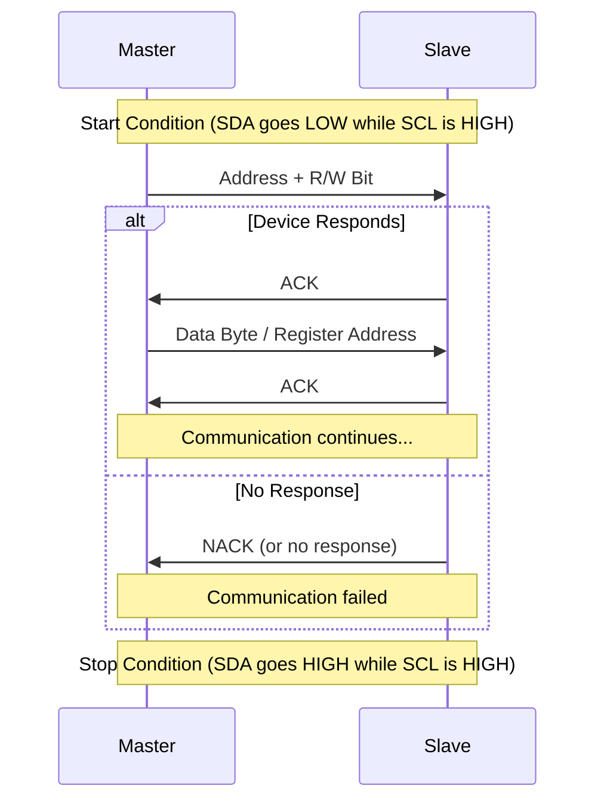
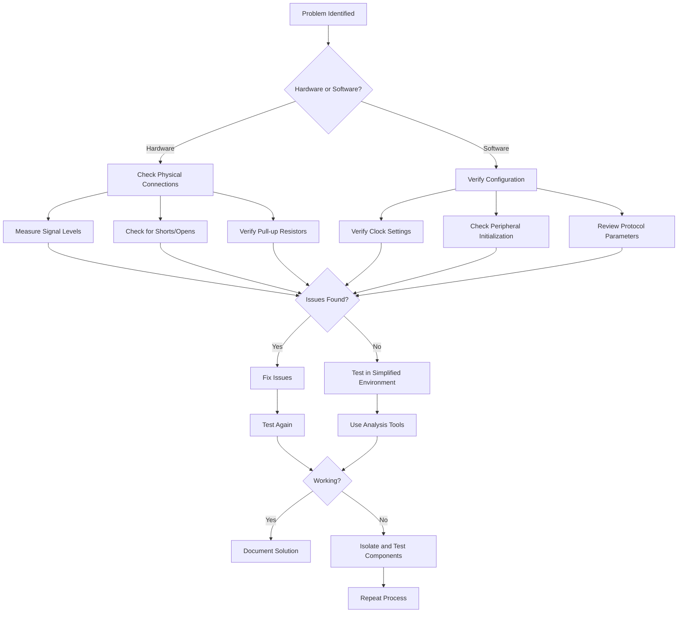

# STM32 Communication Debugging

## Introduction

Communication protocols are essential for connecting your STM32 microcontroller to the outside world. Whether you're interfacing with sensors, displays, other microcontrollers, or a host computer, reliable communication is critical for your embedded system to function correctly. However, when these communication channels fail, identifying and resolving issues can be challenging.

This guide will walk you through the process of debugging various communication protocols on STM32 microcontrollers, including UART, I2C, SPI, and CAN. You'll learn about common issues, essential debugging tools, and step-by-step troubleshooting techniques that will help you diagnose and fix communication problems efficiently.

## Understanding Communication Failures

Before diving into specific debugging techniques, it's important to understand the common types of communication failures:

1. **Hardware Issues**: Incorrect wiring, missing pull-up resistors, voltage level mismatches
2. **Configuration Errors**: Incorrect clock settings, pin assignments, or peripheral initialization
3. **Protocol Violations**: Timing issues, improper handshaking, or incorrect data formats
4. **Software Bugs**: Logic errors in the communication handling code
5. **Electrical Noise**: Interference causing data corruption

With an understanding of these failure categories, we can now explore debugging techniques for specific protocols.

## Essential Debugging Tools

Having the right tools makes communication debugging much more efficient:

1. **Logic Analyzer**: Captures digital signals and visualizes protocol-specific data
2. **Oscilloscope**: Measures signal quality and timing characteristics
3. **Protocol Analyzers**: Software tools that decode and display protocol-specific information
4. **Breakout Boards**: Allow easy access to communication lines
5. **Debug Probes**: Enable real-time inspection of variables and program flow

## UART Debugging

UART (Universal Asynchronous Receiver-Transmitter) is one of the simplest and most commonly used communication protocols.

### Common UART Issues

1. **Baud Rate Mismatch**: When communicating devices use different baud rates
2. **Incorrect Pin Configuration**: TX/RX pins not properly configured or connected
3. **Buffer Overflow**: Receiving data faster than it's processed
4. **Framing Errors**: Start/stop bits not correctly recognized

### Step-by-Step UART Debugging

#### 1. Verify Hardware Connections

Ensure that:
- TX from one device connects to RX of the other and vice versa
- Ground connections are shared between devices
- Voltage levels are compatible (use level shifters if necessary)

#### 2. Check Configuration Parameters

Confirm matching configuration on both sides:
- Baud rate (most common mismatch)
- Data bits (typically 8)
- Parity (typically none)
- Stop bits (typically 1)

#### 3. Code Example: UART Configuration Check

```c
// Correct UART configuration for STM32F4xx
void UART_Init(void) {
  // Enable clock for USART2
  RCC->APB1ENR |= RCC_APB1ENR_USART2EN;
  
  // Enable clock for GPIOA
  RCC->AHB1ENR |= RCC_AHB1ENR_GPIOAEN;
  
  // Configure PA2 as TX, PA3 as RX
  GPIOA->MODER &= ~(GPIO_MODER_MODER2_0 | GPIO_MODER_MODER3_0);
  GPIOA->MODER |= (GPIO_MODER_MODER2_1 | GPIO_MODER_MODER3_1);  // Alternate function
  
  // Set alternate function as USART2 (AF7)
  GPIOA->AFR[0] &= ~(GPIO_AFRL_AFRL2 | GPIO_AFRL_AFRL3);
  GPIOA->AFR[0] |= ((7 << GPIO_AFRL_AFSEL2_Pos) | (7 << GPIO_AFRL_AFSEL3_Pos));
  
  // Configure UART: 115200 baud, 8-bit data, no parity, 1 stop bit
  // Assuming PCLK1 = 42MHz
  USART2->BRR = 42000000 / 115200;
  USART2->CR1 &= ~(USART_CR1_M | USART_CR1_PCE);  // 8-bit data, no parity
  USART2->CR2 &= ~USART_CR2_STOP;  // 1 stop bit
  
  // Enable UART, TX, and RX
  USART2->CR1 |= (USART_CR1_UE | USART_CR1_TE | USART_CR1_RE);
}
```

#### 4. Loopback Test

A loopback test can confirm if your UART hardware and configuration are working correctly:

```c
void UART_LoopbackTest(void) {
  char testByte = 'A';
  
  // Send a test byte
  while(!(USART2->SR & USART_SR_TXE)); // Wait until transmit buffer is empty
  USART2->DR = testByte;
  
  // Wait for reception
  while(!(USART2->SR & USART_SR_RXNE)); // Wait until receive buffer is not empty
  char receivedByte = USART2->DR;
  
  if(receivedByte == testByte) {
    // Success - physically connect TX to RX for this test
    // Toggle an LED or print success message
  } else {
    // Failure
    // Toggle another LED or print error message
  }
}
```

For this test, you'll need to physically connect the TX and RX pins together.

#### 5. Monitor with Logic Analyzer

Using a logic analyzer, observe the UART signal to check:
- Start and stop bits
- Data bits
- Timing between bits matches expected baud rate



## I2C Debugging

I2C (Inter-Integrated Circuit) is a popular bus protocol that uses just two wires: SCL (clock) and SDA (data).

### Common I2C Issues

1. **Missing Pull-up Resistors**: I2C requires pull-up resistors on both SCL and SDA lines
2. **Address Conflicts**: Multiple devices with the same address on the bus
3. **Clock Stretching**: Some devices may hold the clock line low to indicate they need more time
4. **Bus Lockup**: SDA stuck low preventing proper bus operation

### Step-by-Step I2C Debugging

#### 1. Check Pull-up Resistors

Ensure proper pull-up resistors (typically 4.7kΩ to 10kΩ) are connected to both SCL and SDA lines. Without these, I2C communication will fail.

#### 2. Verify Device Addresses

```c
// I2C bus scan to find connected devices
void I2C_ScanBus(void) {
  uint8_t address;
  uint8_t foundDevices = 0;
  
  // Try all possible addresses (7-bit addressing)
  for(address = 1; address < 128; address++) {
    // Send start condition and address
    I2C1->CR1 |= I2C_CR1_START;
    while(!(I2C1->SR1 & I2C_SR1_SB));
    
    // Send address with write bit (0)
    I2C1->DR = (address << 1);
    
    // Wait for address sent or timeout
    uint32_t timeout = 1000000;
    while(!(I2C1->SR1 & I2C_SR1_ADDR) && !(I2C1->SR1 & I2C_SR1_AF) && timeout--);
    
    if(I2C1->SR1 & I2C_SR1_ADDR) {
      // Device acknowledged - it exists
      foundDevices++;
      
      // Clear ADDR flag by reading SR1 and SR2
      uint32_t temp = I2C1->SR1;
      temp = I2C1->SR2;
      (void)temp; // Prevent unused variable warning
    }
    
    // Send stop condition
    I2C1->CR1 |= I2C_CR1_STOP;
    
    // Short delay
    for(volatile int i = 0; i < 1000; i++);
  }
  
  // foundDevices contains the number of devices found
}
```

#### 3. Bus Recovery for Lockups

If the I2C bus gets stuck, you can use this procedure to recover it:

```c
void I2C_BusRecovery(void) {
  // Configure SDA and SCL as GPIO outputs
  // This depends on which pins you're using
  // Example for I2C1 on PB6 (SCL) and PB7 (SDA)
  
  // Enable GPIOB clock
  RCC->AHB1ENR |= RCC_AHB1ENR_GPIOBEN;
  
  // Configure as outputs
  GPIOB->MODER &= ~(GPIO_MODER_MODER6 | GPIO_MODER_MODER7);
  GPIOB->MODER |= (GPIO_MODER_MODER6_0 | GPIO_MODER_MODER7_0);
  
  // Set pins high (idle state for I2C)
  GPIOB->BSRR = GPIO_BSRR_BS6 | GPIO_BSRR_BS7;
  
  // Generate clock pulses to force any stuck slaves to release SDA
  for(int i = 0; i < 9; i++) {
    // SCL low
    GPIOB->BSRR = GPIO_BSRR_BR6;
    for(volatile int j = 0; j < 100; j++); // Short delay
    
    // SCL high
    GPIOB->BSRR = GPIO_BSRR_BS6;
    for(volatile int j = 0; j < 100; j++); // Short delay
  }
  
  // Generate STOP condition: SDA low to high while SCL is high
  GPIOB->BSRR = GPIO_BSRR_BR7; // SDA low
  for(volatile int j = 0; j < 100; j++); // Short delay
  GPIOB->BSRR = GPIO_BSRR_BS7; // SDA high while SCL is high
  
  // Reconfigure as I2C pins (alternate function)
  // ... (standard I2C GPIO configuration)
  
  // Reinitialize I2C peripheral
  // ... (standard I2C peripheral initialization)
}
```

#### 4. Logic Analyzer Debugging

When using a logic analyzer for I2C:
- Capture both SCL and SDA lines
- Verify START and STOP conditions
- Check if ACKs are received from slave devices
- Verify clock frequency is within device specifications



## SPI Debugging

SPI (Serial Peripheral Interface) uses separate clock, data in, data out, and chip select lines for communication.

### Common SPI Issues

1. **Clock Polarity/Phase Mismatch**: Incorrect CPOL/CPHA settings
2. **Chip Select Timing**: Improper CS assertion/deassertion timing
3. **Signal Integrity**: Long wires or high speeds causing signal degradation
4. **Multiple Slave Management**: Issues with handling multiple devices on the bus

### Step-by-Step SPI Debugging

#### 1. Verify Pin Connections

Ensure proper connection of:
- SCLK (Serial Clock)
- MOSI (Master Out Slave In)
- MISO (Master In Slave Out)
- CS/SS (Chip Select/Slave Select)

#### 2. Check Clock Polarity and Phase

SPI has four modes based on Clock Polarity (CPOL) and Clock Phase (CPHA):

| Mode | CPOL | CPHA | Clock Idle State | Data Sampled On |
|------|------|------|------------------|----------------|
| 0    | 0    | 0    | Low              | Rising Edge    |
| 1    | 0    | 1    | Low              | Falling Edge   |
| 2    | 1    | 0    | High             | Falling Edge   |
| 3    | 1    | 1    | High             | Rising Edge    |

Example code to configure SPI in the four modes:

```c
void SPI_ConfigureMode(uint8_t mode) {
  // Disable SPI first
  SPI1->CR1 &= ~SPI_CR1_SPE;
  
  // Clear CPOL and CPHA bits
  SPI1->CR1 &= ~(SPI_CR1_CPOL | SPI_CR1_CPHA);
  
  // Set mode
  switch(mode) {
    case 0:
      // CPOL=0, CPHA=0
      break;
    case 1:
      // CPOL=0, CPHA=1
      SPI1->CR1 |= SPI_CR1_CPHA;
      break;
    case 2:
      // CPOL=1, CPHA=0
      SPI1->CR1 |= SPI_CR1_CPOL;
      break;
    case 3:
      // CPOL=1, CPHA=1
      SPI1->CR1 |= (SPI_CR1_CPOL | SPI_CR1_CPHA);
      break;
    default:
      // Invalid mode
      return;
  }
  
  // Re-enable SPI
  SPI1->CR1 |= SPI_CR1_SPE;
}
```

#### 3. Test Basic Communication

A simple test to verify SPI communication:

```c
uint8_t SPI_TestCommunication(void) {
  uint8_t test_byte = 0xA5;
  uint8_t received_byte;
  
  // Ensure CS is active (low)
  GPIOA->BSRR = GPIO_BSRR_BR4; // Assuming CS is on PA4
  
  // Send test byte
  SPI1->DR = test_byte;
  
  // Wait for transmission to complete
  while(!(SPI1->SR & SPI_SR_TXE));
  while(SPI1->SR & SPI_SR_BSY);
  
  // Read received data
  received_byte = SPI1->DR;
  
  // Deactivate CS
  GPIOA->BSRR = GPIO_BSRR_BS4;
  
  return received_byte;
}
```

#### 4. Analyze with Logic Analyzer

When debugging SPI with a logic analyzer:
- Verify CS activation before data transfer
- Check clock frequency is within device specifications
- Observe data alignment with clock edges based on mode
- Confirm data is sent and received correctly

## CAN Bus Debugging

Controller Area Network (CAN) is used in automotive and industrial applications for reliable communication.

### Common CAN Issues

1. **Termination Resistors**: Missing or incorrect termination resistors (120Ω)
2. **Bitrate Mismatch**: Different bit timing configurations among nodes
3. **ID Conflicts**: Multiple nodes using the same message ID
4. **Bus Off State**: Node enters Bus Off state due to excessive errors

### Step-by-Step CAN Debugging

#### 1. Check Physical Layer

- Verify proper termination resistors at both ends of the bus
- Check for proper twisted pair cabling
- Measure differential voltage (should be approximately 2V from CAN_H to CAN_L during recessive state)

#### 2. Configure Bit Timing

Correct bit timing is critical for CAN communication:

```c
void CAN_ConfigureBitTiming(uint32_t baudrate) {
  // Example for STM32F4 with 42MHz APB1 clock
  // Disable CAN first
  CAN1->MCR |= CAN_MCR_INRQ;
  while(!(CAN1->MSR & CAN_MSR_INAK));
  
  // Configure bit timing
  // For 500kbps with 42MHz APB1 clock:
  // - Prescaler = 6
  // - BS1 = 11 (time quanta)
  // - BS2 = 2 (time quanta)
  // - SJW = 1 (time quanta)
  // Total time quanta = 1 + 11 + 2 = 14
  // Baudrate = 42MHz / 6 / 14 = 500kHz
  
  if(baudrate == 500000) {
    CAN1->BTR = (5 << CAN_BTR_BRP_Pos) | // Prescaler = 6 (value written is prescaler-1)
                (10 << CAN_BTR_TS1_Pos) | // BS1 = 11 (value written is BS1-1)
                (1 << CAN_BTR_TS2_Pos) |  // BS2 = 2 (value written is BS2-1)
                (0 << CAN_BTR_SJW_Pos);   // SJW = 1 (value written is SJW-1)
  } else if(baudrate == 1000000) {
    // Configuration for 1Mbps
    CAN1->BTR = (2 << CAN_BTR_BRP_Pos) | // Prescaler = 3
                (10 << CAN_BTR_TS1_Pos) | // BS1 = 11
                (1 << CAN_BTR_TS2_Pos) |  // BS2 = 2
                (0 << CAN_BTR_SJW_Pos);   // SJW = 1
  } else {
    // Add other baudrates as needed
  }
  
  // Return to normal mode
  CAN1->MCR &= ~CAN_MCR_INRQ;
  while(CAN1->MSR & CAN_MSR_INAK);
}
```

#### 3. Monitor Error Counters

CAN controllers have transmit and receive error counters that can help diagnose issues:

```c
void CAN_MonitorErrorCounters(void) {
  uint8_t tx_errors = (CAN1->ESR & CAN_ESR_TEC) >> CAN_ESR_TEC_Pos;
  uint8_t rx_errors = (CAN1->ESR & CAN_ESR_REC) >> CAN_ESR_REC_Pos;
  
  // Check for Bus Off state
  if(CAN1->ESR & CAN_ESR_BOFF) {
    // Node is in Bus Off state (TX error counter exceeded 255)
    // Recovery required
    CAN_Recover();
  }
  
  // High error counters indicate problems
  if(tx_errors > 96 || rx_errors > 96) {
    // Approaching error passive state (counters > 127)
    // Investigate bus issues
  }
}

void CAN_Recover(void) {
  // Request hardware to reset the CAN controller
  CAN1->MCR |= CAN_MCR_RESET;
  while(CAN1->MCR & CAN_MCR_RESET);
  
  // Reinitialize CAN
  // ... (standard CAN initialization code)
}
```

#### 4. Test with Loopback Mode

STM32's CAN controller has a loopback mode for testing without external hardware:

```c
void CAN_LoopbackTest(void) {
  // Enable loopback mode
  CAN1->BTR |= CAN_BTR_LBKM;
  
  // Configure a filter to accept all messages
  CAN1->FMR |= CAN_FMR_FINIT;  // Enter filter initialization mode
  CAN1->FA1R &= ~(1 << 0);     // Deactivate filter 0
  CAN1->FS1R |= (1 << 0);      // Set filter 0 to single 32-bit scale
  CAN1->FM1R &= ~(1 << 0);     // Set filter 0 to mask mode
  CAN1->sFilterRegister[0].FR1 = 0;  // Filter ID = 0
  CAN1->sFilterRegister[0].FR2 = 0;  // Filter Mask = 0 (accept all)
  CAN1->FFA1R &= ~(1 << 0);    // Assign filter 0 to FIFO 0
  CAN1->FA1R |= (1 << 0);      // Activate filter 0
  CAN1->FMR &= ~CAN_FMR_FINIT; // Exit filter initialization mode
  
  // Prepare a test message
  CAN_TxHeaderTypeDef txHeader;
  txHeader.StdId = 0x123;
  txHeader.ExtId = 0;
  txHeader.IDE = CAN_ID_STD;  // Standard ID
  txHeader.RTR = CAN_RTR_DATA;  // Data frame
  txHeader.DLC = 2;  // 2 bytes of data
  
  uint8_t data[2] = {0xAA, 0x55};
  uint32_t mailbox;
  
  // Send message
  if(HAL_CAN_AddTxMessage(&hcan1, &txHeader, data, &mailbox) != HAL_OK) {
    // Transmission failed
    return;
  }
  
  // Wait for message to be sent
  while(HAL_CAN_GetTxMailboxesFreeLevel(&hcan1) != 3);
  
  // Check if message was received
  if(HAL_CAN_GetRxFifoFillLevel(&hcan1, CAN_RX_FIFO0) > 0) {
    // Message received in loopback mode
    CAN_RxHeaderTypeDef rxHeader;
    uint8_t rxData[8];
    
    HAL_CAN_GetRxMessage(&hcan1, CAN_RX_FIFO0, &rxHeader, rxData);
    
    if(rxHeader.StdId == 0x123 && rxData[0] == 0xAA && rxData[1] == 0x55) {
      // Loopback test successful
    } else {
      // Data mismatch
    }
  } else {
    // No message received
  }
  
  // Disable loopback mode
  CAN1->BTR &= ~CAN_BTR_LBKM;
}
```

## Creating a Debugging Test Plan

When faced with communication issues, a systematic approach helps identify and resolve problems more efficiently.

### General Debugging Workflow



### Step-by-Step Testing Plan

1. **Simplify the System**
   - Reduce to minimum components required
   - Remove other peripherals that might interfere

2. **Validate Hardware Setup**
   - Check connections, power, and ground
   - Verify pull-ups/pull-downs where required
   - Measure signal levels with multimeter/oscilloscope

3. **Verify Peripheral Configuration**
   - Clock settings
   - Pin assignments and alternate functions
   - Peripheral initialization sequence

4. **Use Built-in Diagnostics**
   - Status registers
   - Error flags
   - Built-in loopback modes

5. **External Analysis**
   - Logic analyzer capture
   - Protocol-specific analysis
   - Compare with known-good signal patterns

## Practical Debug Example: Troubleshooting I2C Communication

Let's walk through a practical example of debugging I2C communication with an MPU6050 sensor.

### Problem Description
The STM32 cannot read data from the MPU6050 accelerometer/gyroscope via I2C.

### Step 1: Check Hardware Connections

First, verify connections using a multimeter:
- Check continuity between microcontroller pins and sensor pins
- Verify VCC and GND connections
- Measure voltage on SDA and SCL lines (should be pulled up to VCC)

### Step 2: Verify Pull-up Resistors

I2C requires pull-up resistors. If they're missing:

```c
// Enable internal pull-ups (not always strong enough, external is better)
void EnableInternalPullups(void) {
  // Assuming I2C1 on PB6 (SCL) and PB7 (SDA)
  GPIOB->PUPDR &= ~(GPIO_PUPDR_PUPDR6 | GPIO_PUPDR_PUPDR7);
  GPIOB->PUPDR |= (GPIO_PUPDR_PUPDR6_0 | GPIO_PUPDR_PUPDR7_0); // Pull-up
}
```

### Step 3: Scan the I2C Bus

Run an I2C bus scan to verify the device is detected:

```c
// Output from a scan with MPU6050 connected
// I2C Scan Results:
// Device found at address: 0x68
// 1 devices found on the bus
```

If no device is found, check the AD0 pin on the MPU6050. If it's pulled high, the address changes to 0x69.

### Step 4: Check the Device ID

Read the WHO_AM_I register to verify communication:

```c
uint8_t ReadWhoAmI(void) {
  uint8_t whoAmI = 0;
  
  // Start condition
  I2C1->CR1 |= I2C_CR1_START;
  while(!(I2C1->SR1 & I2C_SR1_SB));
  
  // Send device address (write)
  I2C1->DR = (0x68 << 1);
  while(!(I2C1->SR1 & I2C_SR1_ADDR));
  // Clear ADDR flag
  uint32_t temp = I2C1->SR1;
  temp = I2C1->SR2;
  (void)temp;
  
  // Send register address (WHO_AM_I = 0x75)
  I2C1->DR = 0x75;
  while(!(I2C1->SR1 & I2C_SR1_TXE));
  
  // Restart
  I2C1->CR1 |= I2C_CR1_START;
  while(!(I2C1->SR1 & I2C_SR1_SB));
  
  // Send device address (read)
  I2C1->DR = (0x68 << 1) | 0x01;
  while(!(I2C1->SR1 & I2C_SR1_ADDR));
  // Clear ADDR flag
  temp = I2C1->SR1;
  temp = I2C1->SR2;
  (void)temp;
  
  // Disable ACK, set STOP
  I2C1->CR1 &= ~I2C_CR1_ACK;
  I2C1->CR1 |= I2C_CR1_STOP;
  
  // Wait for data reception
  while(!(I2C1->SR1 & I2C_SR1_RXNE));
  whoAmI = I2C1->DR;
  
  // Re-enable ACK for future transfers
  I2C1->CR1 |= I2C_CR1_ACK;
  
  return whoAmI;
}
```

For the MPU6050, the WHO_AM_I register should return 0x68.

### Step 5: Observe the I2C Bus with Logic Analyzer

Connect a logic analyzer to SDA and SCL pins and observe the communication. Look for:
- START condition
- Device address transmission
- ACK bit
- Register address transmission
- Data transfer
- STOP condition

If we see the device is not acknowledging (NACK), there might be an issue with the device address or hardware connection.

### Step 6: Check Clock Frequency

Verify the I2C clock frequency is within the MPU6050's specifications (400kHz max):

```c
// Configure I2C clock frequency
void I2C_SetClockFrequency(uint32_t frequency) {
  // Disable I2C
  I2C1->CR1 &= ~I2C_CR1_PE;
  
  // Configure clock
  I2C1->CR2 &= ~I2C_CR2_FREQ;
  I2C1->CR2 |= 42; // APB1 clock in MHz (42MHz for STM32F4)
  
  if(frequency <= 100000) {
    // Standard mode (100kHz)
    I2C1->CCR &= ~I2C_CCR_FS;
    // CCR = PCLK1 / (2 * freq)
    I2C1->CCR = 42000000 / (2 * frequency);
  } else {
    // Fast mode (400kHz)
    I2C1->CCR |= I2C_CCR_FS;
    // CCR = PCLK1 / (3 * freq)
    I2C1->CCR = 42000000 / (3 * frequency);
  }
  
  // Configure TRISE
  if(frequency <= 100000) {
    // Standard mode max rise time = 1000ns
    I2C1->TRISE = 42 + 1; // PCLK1(MHz) + 1
  } else {
    // Fast mode max rise time = 300ns
    I2C1->TRISE = (42 * 300) / 1000 + 1;
  }
  
  // Re-enable I2C
  I2C1->CR1 |= I2C_CR1_PE;
}