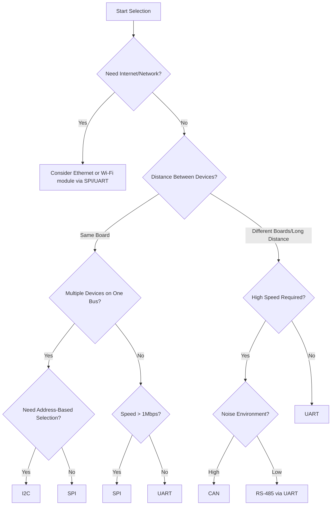

# STM32 Protocol Selection

## Introduction

Selecting the appropriate communication protocol for your STM32 microcontroller project is a critical decision that impacts performance, complexity, and compatibility. STM32 microcontrollers support a wide range of communication protocols, each with distinct advantages and limitations. This guide will help you understand the available options and make an informed choice based on your project requirements.

## Understanding Protocol Requirements

Before selecting a protocol, consider these key factors:

- **Data transfer speed**: How much data needs to be transferred and how quickly?
- **Distance**: How far apart are the communicating devices?
- **Power consumption**: Is your application power-sensitive?
- **Complexity**: How much development time can you allocate?
- **Number of devices**: How many devices need to communicate?
- **Reliability**: What level of error detection/correction is needed?

## Common STM32 Communication Protocols

### 1. UART/USART

The Universal Asynchronous/Synchronous Receiver Transmitter is one of the simplest protocols available on STM32 devices.

#### Key Characteristics:
- **Speed**: Typically 9600-115200 baud (bits per second)
- **Wiring**: Simple (TX, RX, GND)
- **Communication Mode**: Full-duplex (simultaneous send/receive)
- **Addressing**: Point-to-point (one-to-one)

#### Ideal For:
- Debug communication
- Simple device-to-device communication
- Connecting to computer terminals
- Legacy device integration

#### Basic Implementation:

```c
// UART configuration example for STM32
void UART_Init(void) {
  // Enable UART clock
  RCC->APB1ENR |= RCC_APB1ENR_USART2EN;
  
  // Configure UART pins (GPIOA)
  RCC->AHB1ENR |= RCC_AHB1ENR_GPIOAEN;
  
  // Configure PA2 as TX
  GPIOA->MODER &= ~GPIO_MODER_MODER2;
  GPIOA->MODER |= GPIO_MODER_MODER2_1;
  GPIOA->AFR[0] |= (7 << (2 * 4)); // AF7 for USART2
  
  // Configure PA3 as RX
  GPIOA->MODER &= ~GPIO_MODER_MODER3;
  GPIOA->MODER |= GPIO_MODER_MODER3_1;
  GPIOA->AFR[0] |= (7 << (3 * 4)); // AF7 for USART2
  
  // Configure UART
  USART2->BRR = SystemCoreClock / 115200;
  USART2->CR1 = USART_CR1_TE | USART_CR1_RE | USART_CR1_UE;
}

// Send a character via UART
void UART_SendChar(char ch) {
  while(!(USART2->SR & USART_SR_TXE));
  USART2->DR = ch;
}

// Receive a character via UART
char UART_ReceiveChar(void) {
  while(!(USART2->SR & USART_SR_RXNE));
  return USART2->DR;
}
```

### 2. SPI (Serial Peripheral Interface)

SPI is a synchronous serial communication protocol commonly used for communicating with sensors, displays, and other peripherals.

#### Key Characteristics:
- **Speed**: Up to several MHz (much faster than UART)
- **Wiring**: 4 wires (MOSI, MISO, SCK, SS/CS)
- **Communication Mode**: Full-duplex
- **Addressing**: Master-slave with chip select lines

#### Ideal For:
- High-speed sensor communication
- Display interfaces
- SD card communication
- Daisy-chaining multiple devices

#### Basic Implementation:

```c
// SPI configuration example for STM32
void SPI_Init(void) {
  // Enable SPI1 clock
  RCC->APB2ENR |= RCC_APB2ENR_SPI1EN;
  
  // Enable GPIOA clock
  RCC->AHB1ENR |= RCC_AHB1ENR_GPIOAEN;
  
  // Configure SCK (PA5), MISO (PA6), MOSI (PA7)
  GPIOA->MODER &= ~(GPIO_MODER_MODER5 | GPIO_MODER_MODER6 | GPIO_MODER_MODER7);
  GPIOA->MODER |= (GPIO_MODER_MODER5_1 | GPIO_MODER_MODER6_1 | GPIO_MODER_MODER7_1);
  
  // Configure alternate function for SPI1
  GPIOA->AFR[0] |= (5 << (5 * 4)) | (5 << (6 * 4)) | (5 << (7 * 4));
  
  // Configure CS pin (PA4) as output
  GPIOA->MODER &= ~GPIO_MODER_MODER4;
  GPIOA->MODER |= GPIO_MODER_MODER4_0;
  GPIOA->BSRR = GPIO_BSRR_BS4; // Set CS high (inactive)
  
  // Configure SPI: Master mode, 8-bit data, MSB first
  SPI1->CR1 = SPI_CR1_SSM | SPI_CR1_SSI | SPI_CR1_BR_1 | SPI_CR1_MSTR;
  SPI1->CR1 |= SPI_CR1_SPE; // Enable SPI
}

// Send/receive a byte via SPI
uint8_t SPI_Transfer(uint8_t data) {
  // Start transmission
  GPIOA->BSRR = GPIO_BSRR_BR4; // CS low (active)
  
  SPI1->DR = data;
  while(!(SPI1->SR & SPI_SR_TXE));
  while(!(SPI1->SR & SPI_SR_RXNE));
  
  GPIOA->BSRR = GPIO_BSRR_BS4; // CS high (inactive)
  return SPI1->DR;
}
```

### 3. I2C (Inter-Integrated Circuit)

I2C is a two-wire serial protocol designed for communication between integrated circuits on the same board.

#### Key Characteristics:
- **Speed**: Standard (100 kHz), Fast (400 kHz), Fast+ (1 MHz)
- **Wiring**: 2 wires (SDA, SCL) + pull-up resistors
- **Communication Mode**: Half-duplex
- **Addressing**: Multi-master, multi-slave with device addresses

#### Ideal For:
- Multiple device communication on the same bus
- Communication with sensors and EEPROMs
- Applications with limited pins
- Internal board communication

#### Basic Implementation:

```c
// I2C configuration example for STM32
void I2C_Init(void) {
  // Enable I2C1 clock
  RCC->APB1ENR |= RCC_APB1ENR_I2C1EN;
  
  // Enable GPIOB clock
  RCC->AHB1ENR |= RCC_AHB1ENR_GPIOBEN;
  
  // Configure I2C pins: PB8 (SCL), PB9 (SDA)
  GPIOB->MODER &= ~(GPIO_MODER_MODER8 | GPIO_MODER_MODER9);
  GPIOB->MODER |= (GPIO_MODER_MODER8_1 | GPIO_MODER_MODER9_1);
  
  // Set pins to open-drain
  GPIOB->OTYPER |= (GPIO_OTYPER_OT_8 | GPIO_OTYPER_OT_9);
  
  // Enable pull-up
  GPIOB->PUPDR &= ~(GPIO_PUPDR_PUPDR8 | GPIO_PUPDR_PUPDR9);
  GPIOB->PUPDR |= (GPIO_PUPDR_PUPDR8_0 | GPIO_PUPDR_PUPDR9_0);
  
  // Configure alternate function for I2C1
  GPIOB->AFR[1] |= (4 << (0 * 4)) | (4 << (1 * 4)); // AF4 for I2C1
  
  // Reset I2C
  I2C1->CR1 = I2C_CR1_SWRST;
  I2C1->CR1 = 0;
  
  // Set I2C clock frequency (APB1 clock = SystemCoreClock/4 typically)
  I2C1->CR2 = SystemCoreClock / 4000000; // Input clock in MHz
  
  // Configure for 100 kHz Standard mode
  I2C1->CCR = 50; // For 100 kHz with 50 MHz APB1 clock
  I2C1->TRISE = 51; // max rise time
  
  // Enable I2C
  I2C1->CR1 |= I2C_CR1_PE;
}

// Write data to I2C device
uint8_t I2C_Write(uint8_t device_addr, uint8_t reg_addr, uint8_t data) {
  // Wait until I2C is not busy
  while(I2C1->SR2 & I2C_SR2_BUSY);
  
  // Generate START condition
  I2C1->CR1 |= I2C_CR1_START;
  while(!(I2C1->SR1 & I2C_SR1_SB));
  
  // Send device address (write mode)
  I2C1->DR = device_addr << 1;
  while(!(I2C1->SR1 & I2C_SR1_ADDR));
  uint8_t temp = I2C1->SR2; // Clear ADDR flag
  
  // Send register address
  I2C1->DR = reg_addr;
  while(!(I2C1->SR1 & I2C_SR1_TXE));
  
  // Send data
  I2C1->DR = data;
  while(!(I2C1->SR1 & I2C_SR1_BTF));
  
  // Generate STOP condition
  I2C1->CR1 |= I2C_CR1_STOP;
  
  return 0; // Success
}
```

### 4. CAN (Controller Area Network)

CAN is a robust protocol designed for high reliability in noisy environments, commonly used in automotive and industrial applications.

#### Key Characteristics:
- **Speed**: Up to 1 Mbps
- **Wiring**: Differential pair (CAN_H, CAN_L)
- **Communication Mode**: Multi-master with message prioritization
- **Addressing**: Message-based, not device-based

#### Ideal For:
- Automotive systems
- Industrial automation
- Applications requiring high reliability
- Distributed control systems

#### Basic Implementation:

```c
// CAN configuration example for STM32
void CAN_Init(void) {
  // Enable CAN1 clock
  RCC->APB1ENR |= RCC_APB1ENR_CAN1EN;
  
  // Enable GPIOA clock
  RCC->AHB1ENR |= RCC_AHB1ENR_GPIOAEN;
  
  // Configure CAN pins: PA11 (RX), PA12 (TX)
  GPIOA->MODER &= ~(GPIO_MODER_MODER11 | GPIO_MODER_MODER12);
  GPIOA->MODER |= (GPIO_MODER_MODER11_1 | GPIO_MODER_MODER12_1);
  
  // Configure alternate function for CAN
  GPIOA->AFR[1] |= (9 << (3 * 4)) | (9 << (4 * 4)); // AF9 for CAN1
  
  // Exit sleep mode
  CAN1->MCR &= ~CAN_MCR_SLEEP;
  
  // Request initialization
  CAN1->MCR |= CAN_MCR_INRQ;
  while((CAN1->MSR & CAN_MSR_INAK) == 0);
  
  // Configure for 250 kbps with 50 MHz clock
  // BRP=10, TS1=3, TS2=2, SJW=1
  CAN1->BTR = (1 << 24) | (2 << 20) | (3 << 16) | 9;
  
  // Leave initialization mode
  CAN1->MCR &= ~CAN_MCR_INRQ;
  while(CAN1->MSR & CAN_MSR_INAK);
  
  // Configure filters (accept all)
  CAN1->FMR |= CAN_FMR_FINIT;
  CAN1->FA1R |= 1;
  CAN1->FM1R &= ~1;
  CAN1->FS1R |= 1;
  CAN1->FFA1R &= ~1;
  CAN1->sFilterRegister[0].FR1 = 0;
  CAN1->sFilterRegister[0].FR2 = 0;
  CAN1->FMR &= ~CAN_FMR_FINIT;
}

// Send a CAN message
uint8_t CAN_Send(uint32_t id, uint8_t* data, uint8_t length) {
  // Find an empty mailbox
  uint8_t mailbox = 0;
  if((CAN1->TSR & CAN_TSR_TME0) == CAN_TSR_TME0) {
    mailbox = 0;
  } else if((CAN1->TSR & CAN_TSR_TME1) == CAN_TSR_TME1) {
    mailbox = 1;
  } else if((CAN1->TSR & CAN_TSR_TME2) == CAN_TSR_TME2) {
    mailbox = 2;
  } else {
    return 1; // No empty mailbox
  }
  
  // Set up the mailbox
  CAN1->sTxMailBox[mailbox].TIR = (id << 21);
  CAN1->sTxMailBox[mailbox].TDTR = length;
  
  // Copy data
  CAN1->sTxMailBox[mailbox].TDLR = 
    (data[0] << 0) | (data[1] << 8) | (data[2] << 16) | (data[3] << 24);
  CAN1->sTxMailBox[mailbox].TDHR = 
    (data[4] << 0) | (data[5] << 8) | (data[6] << 16) | (data[7] << 24);
  
  // Request transmission
  CAN1->sTxMailBox[mailbox].TIR |= CAN_TI0R_TXRQ;
  
  return 0; // Success
}
```

### 5. USB (Universal Serial Bus)

STM32 microcontrollers often include USB device capability, allowing direct connection to computers and other USB hosts.

#### Key Characteristics:
- **Speed**: Full-speed (12 Mbps) or High-speed (480 Mbps)
- **Wiring**: D+, D-, VBUS, GND
- **Communication Mode**: Host-device
- **Power**: Can provide power to the device

#### Ideal For:
- PC communication
- USB peripherals
- Mass storage devices
- USB audio/video

#### Implementation Note:
USB implementation is more complex and typically uses ST's USB libraries rather than direct register programming. Example code would be significantly longer and require multiple files.

### 6. Ethernet

Many STM32 variants include Ethernet MAC for network connectivity.

#### Key Characteristics:
- **Speed**: 10/100 Mbps
- **Wiring**: Requires PHY and magnetics
- **Communication Mode**: Network-based
- **Protocol**: TCP/IP, UDP, etc.

#### Ideal For:
- IoT devices
- Network-connected applications
- Web servers
- Remote monitoring systems

#### Implementation Note:
Ethernet implementation is complex and typically uses libraries like LwIP. Full implementation example would be beyond the scope of this article.

## Protocol Selection Decision Tree



## Practical Application Examples

### Example 1: Weather Station

A weather station might use:
- **I2C** for temperature, humidity, and pressure sensors
- **SPI** for the display
- **UART** for debugging
- **USB** for data logging to a computer

```c
// Simplified code structure for a weather station
void WeatherStation_Init(void) {
  // Initialize protocols
  I2C_Init();  // For sensors
  SPI_Init();  // For display
  UART_Init(); // For debugging
  
  // Initialize sensors
  BME280_Init(); // Temperature/humidity/pressure sensor via I2C
  
  // Initialize display
  ST7735_Init(); // Color LCD via SPI
}

void WeatherStation_ReadSensors(void) {
  // Read sensor data via I2C
  float temperature = BME280_ReadTemperature();
  float humidity = BME280_ReadHumidity();
  float pressure = BME280_ReadPressure();
  
  // Send data to UART for debugging
  char buffer[64];
  sprintf(buffer, "T:%.1f°C, H:%.1f%%, P:%.1fhPa\r
", temperature, humidity, pressure);
  UART_SendString(buffer);
  
  // Update display via SPI
  ST7735_FillScreen(ST7735_BLACK);
  ST7735_WriteString(10, 10, "Weather Station", Font_11x18, ST7735_WHITE, ST7735_BLACK);
  
  sprintf(buffer, "Temp: %.1f C", temperature);
  ST7735_WriteString(5, 40, buffer, Font_7x10, ST7735_GREEN, ST7735_BLACK);
  
  sprintf(buffer, "Humidity: %.1f%%", humidity);
  ST7735_WriteString(5, 60, buffer, Font_7x10, ST7735_CYAN, ST7735_BLACK);
  
  sprintf(buffer, "Pressure: %.0fhPa", pressure);
  ST7735_WriteString(5, 80, buffer, Font_7x10, ST7735_YELLOW, ST7735_BLACK);
}
```

### Example 2: Automotive ECU

An automotive ECU might use:
- **CAN** for communication with other vehicle systems
- **SPI** for sensor data collection
- **I2C** for on-board peripheral control

```c
// Simplified code structure for an automotive ECU
void ECU_Init(void) {
  // Initialize protocols
  CAN_Init();  // For vehicle network
  SPI_Init();  // For high-speed sensors
  I2C_Init();  // For configuration EEPROM
}

void ECU_ProcessMessages(void) {
  // Check for new CAN messages
  if(CAN_MessageAvailable()) {
    CAN_Message msg = CAN_Receive();
    
    // Process message based on ID
    switch(msg.id) {
      case ENGINE_RPM_ID:
        uint16_t rpm = (msg.data[0] << 8) | msg.data[1];
        // Process RPM data
        break;
      
      case THROTTLE_POSITION_ID:
        uint8_t throttle_position = msg.data[0];
        // Process throttle position
        break;
        
      // Other message IDs...
    }
  }
  
  // Read sensor data via SPI
  uint16_t temperature = SPI_ReadSensor(TEMP_SENSOR_CS);
  
  // Send status message on CAN bus
  uint8_t status_data[8] = {0};
  status_data[0] = (temperature >> 8) & 0xFF;
  status_data[1] = temperature & 0xFF;
  status_data[2] = CalculateSystemStatus();
  
  CAN_Send(ECU_STATUS_ID, status_data, 3);
}
```

## Protocol Comparison Table

| Feature | UART | SPI | I2C | CAN | USB | Ethernet |
|---------|------|-----|-----|-----|-----|----------|
| Speed | Low | High | Medium | Medium | High | Very High |
| Wiring | 2-3 wires | 4+ wires | 2 wires | 2 wires | 4 wires | Complex |
| Distance | Short | Very short | Short | Long | Medium | Very long |
| Complexity | Low | Low | Medium | High | Very high | Very high |
| Multi-device | No | Yes (with CS) | Yes | Yes | Limited | Yes |
| Noise immunity | Low | Low | Medium | Very high | Medium | High |
| Power usage | Low | Medium | Low | Medium | High | Very high |

## How to Choose the Right Protocol

1. **Define your requirements**:
   - Data rate needed
   - Communication distance
   - Number of devices
   - Environmental constraints

2. **Consider physical constraints**:
   - Available pins on your STM32
   - Power limitations
   - Space for wiring

3. **Evaluate software complexity**:
   - Development time available
   - Team's expertise
   - Available libraries

4. **Plan for future expansion**:
   - Will more devices be added later?
   - Might speed requirements increase?

## Common Mistakes and How to Avoid Them

1. **Choosing based on familiarity alone**
   - Solution: Evaluate protocols based on requirements, not just what you know

2. **Underestimating noise impact**
   - Solution: Consider CAN or RS-485 for noisy environments

3. **Forgetting about pull-up resistors for I2C**
   - Solution: Always include proper pull-up resistors (typically 4.7kΩ)

4. **Incorrect voltage levels**
   - Solution: Ensure all devices use compatible voltage levels or use level shifters

5. **Exceeding maximum bus length**
   - Solution: Respect maximum cable lengths for each protocol

## Summary

Selecting the right communication protocol for your STM32 project requires careful consideration of various factors including speed, distance, complexity, and reliability requirements. The STM32 family offers a wide range of protocol options from simple UART to complex Ethernet implementations.

- Use **UART** for simple point-to-point communication and debugging
- Choose **SPI** for high-speed communication with sensors and displays
- Select **I2C** when you need multiple devices on a simple bus
- Implement **CAN** for robust communication in noisy environments
- Consider **USB** for direct computer connectivity
- Use **Ethernet** for network-connected applications

By understanding the strengths and limitations of each protocol, you can make an informed decision that best meets your project requirements.

## Exercises

1. Design a protocol selection for a smart home system that needs to communicate with temperature sensors, a display, and a Wi-Fi module.

2. Compare the power consumption of I2C vs SPI when interfacing with three sensors on an STM32L4 microcontroller (low-power series).

3. Implement a simple data exchange between two STM32 boards using UART. Send temperature readings from one board to another.

4. Design a CAN network with three STM32 nodes, each responsible for different functions in an industrial control system.

5. Convert the example UART code to use interrupts instead of polling for efficient operation.

## Additional Resources

- STM32 HAL Driver Documentation for communication peripherals
- STMicroelectronics Application Notes (AN2586, AN3155)
- STM32CubeMX for automatic peripheral initialization code generation
- Online communities: STM32 forums, Stack Overflow, Reddit r/embedded